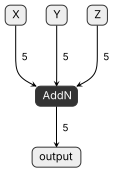
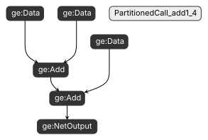

# 自定义算子框架插件

## 概述

本样例从完整自定义算子工程中独立出来的**框架插件（Framework Plugin）**模块，包含 ONNX 和 TensorFlow 两个框架的自定义算子适配插件代码。这些插件用于告诉 CANN 编译器如何识别和映射第三方框架模型中的自定义算子。

本模块采用独立 CMake 构建，使用系统 g++ 编译器（Host 侧代码），不依赖 Ascend C 编译器（Bisheng）和 NPU 设备。

## 目录结构

```
custom_op/
├── CMakeLists.txt           // 独立构建入口
├── build.sh                 // 工程编译入口脚本
├── README_CN.md
├── image/                     // 模型转换效果对比图
│   ├── addn_original.svg      // AddN 原始模型图
│   └── addn_subgraph.svg      // AddN 拆分为子图效果
├── onnx_plugin              // ONNX 框架算子适配插件
│   ├── CMakeLists.txt
│   ├── add_plugin.cc        // Add 算子映射
│   ├── addn_plugin.cc       // AddN 算子映射
│   ├── leaky_relu_plugin.cc // LeakyRelu 算子映射
└── tf_plugin                // TensorFlow 框架算子适配插件
    ├── CMakeLists.txt
    ├── add_block_cust_plugin.cc                      // AddBlockCust 算子注册
    ├── add_dsl_plugin.cc                             // AddDsl 算子注册
    ├── decode_bbox_v2_scope_fusion_plugin.cc         // DecodeBboxV2 融合算子适配
    ├── lstm_tik_plugin.cc                            // LSTMTik 算子注册
    ├── reshape_cust_plugin.cc                        // ReshapeCust 算子注册
    ├── scatter_nd_add_plugin.cc                      // ScatterNdAdd 算子注册
    └── unique_cust_plugin.cc                         // UniqueCust 算子注册
```

## 样例介绍

### ONNX 框架插件（onnx_plugin）

将第三方框架中的算子映射为 CANN 算子。本目录包含以下样例：

- **add_plugin.cc**：将 ONNX Add 算子直接映射为 CANN Add 算子（一对一映射），通过 `AutoMappingByOpFn` 自动完成输入输出映射。
- **addn_plugin.cc**：将 ONNX AddN 算子映射为多个 CANN Add 算子组成的子图（一对多映射 "PartitionedCall"）。通过 `ParseOpToGraphFn` 构建子图，将 AddN(x, y, z) 拆解为 Add(Add(x, y), z)。
- **leaky_relu_plugin.cc**：将 ONNX LeakyRelu 算子（兼容 ai.onnx::8 ~ 13 多个 opset 版本）映射为 CANN LeakyRelu 算子。通过 `ParseParamsByOperatorFn` 从 ONNX 属性中解析 `alpha` 参数。

### TensorFlow 框架插件（tf_plugin）

将 TensorFlow 自定义算子注册到 CANN 框架。本目录包含以下样例：

- **add_block_cust_plugin.cc**：注册 AddBlockCust 算子，指定为 AI_CPU 实现。
- **add_dsl_plugin.cc**：注册 AddDsl 算子，指定为 TVM 实现。
- **decode_bbox_v2_scope_fusion_plugin.cc**：DecodeBboxV2 融合算子的适配插件，通过 `FusionParseParamsFn` 从 Scope 内的小算子中提取缩放参数并设置到融合算子。
- **lstm_tik_plugin.cc**：注册 LSTMTik 算子，指定为 TVM 实现。
- **reshape_cust_plugin.cc**：注册 ReshapeCust 算子，指定为 AI_CPU 实现。
- **scatter_nd_add_plugin.cc**：注册 ScatterNdAdd 算子，指定为 TVM 实现。
- **unique_cust_plugin.cc**：注册 UniqueCust 算子，指定为 AI_CPU 实现。

## 环境要求

- 操作系统：Ubuntu 18.04+ / CentOS 7.6+ / EulerOS，x86_64 或 aarch64
- 编译器：g++ 7.3.0 及以上
- 构建工具：cmake >= 3.5.1、make
- CANN 软件包：已完成昇腾 AI 软件栈部署，版本 8.0 及以上

## 配置编译环境

### 1. 设置 CANN 环境变量

在编译前需配置 CANN 头文件所在路径。build.sh 会自动从以下来源检测，按优先级排列：

1. 环境变量 `ASCEND_TENSOR_COMPILER_INCLUDE`
2. 环境变量 `ASCEND_HOME_PATH`（`source set_env.sh` 后自动设置）
3. 系统/用户默认安装路径（如 `/usr/local/Ascend/...`、`${HOME}/Ascend/...`）

**大多数情况下**，只需先执行 `source $\{CANN_INSTALL_PATH}/ascend-toolkit/set_env.sh`（例如 `${HOME}/Ascend/ascend-toolkit/set_env.sh`），再运行 `./build.sh` 即可，无需手动配置。

若自动检测失败，可通过以下方式指定：

**方式一：设置环境变量**

```bash
export ASCEND_TENSOR_COMPILER_INCLUDE=${HOME}/Ascend/ascend-toolkit/latest/include
```

**方式二：通过 cmake 参数传入**

```bash
cmake .. -DASCEND_INC=/path/to/cann/include
```

## 算子工程编译

1.  确保 CANN 环境变量已配置。build.sh 会自动检测 `ASCEND_TENSOR_COMPILER_INCLUDE`，大多数情况下 `source $\{CANN_INSTALL_PATH}/ascend-toolkit/set_env.sh` 后即可直接编译，无需修改脚本。

    若自动检测失败（编译报错找不到 CANN 头文件），可在 build.sh 头部设置：

    ```bash
    export ASCEND_TENSOR_COMPILER_INCLUDE=/home/HwHiAiUser/Ascend/ascend-toolkit/latest/include
    ```

2.  在算子工程路径 `custom_op` 目录下执行如下命令。

    **chmod +x build.sh**

    **./build.sh**

    若重新进行工程编译，请先执行 `./build.sh clean` 命令进行编译文件的清理。

    编译成功后，会在当前目录下创建 `build_out` 目录，并在 `build_out/makepkg/packages/vendors/customize/framework/` 下生成如下产物：

```
build_out/makepkg/packages/vendors/customize/framework/
├── onnx/libcust_onnx_parsers.so         // ONNX 框架自定义算子插件库
└── tensorflow/libcust_tf_parsers.so     // TensorFlow 框架自定义算子插件库
```

### build.sh 环境变量配置

build.sh 会自动检测 `ASCEND_TENSOR_COMPILER_INCLUDE`（从 `ASCEND_HOME_PATH` 或默认路径）。仅在自动检测失败时，才需修改 build.sh 头部以下变量：

| 变量 | 说明 | 示例 |
|------|------|------|
| `ASCEND_TENSOR_COMPILER_INCLUDE` | CANN 头文件路径 | `${HOME}/Ascend/ascend-toolkit/latest/include` |

### 手动编译

不使用 build.sh 时，可在算子工程路径 `custom_op` 目录下手动执行 cmake：

```bash
mkdir build_out && cd build_out
cmake .. \
    -DASCEND_INC=/path/to/cann/include
make -j
```

## 部署

编译完成后，`build_out/makepkg/` 目录结构与算子包一致，包含所有框架的插件库：

    build_out/makepkg/
    ├── set_env.bash                           // 环境变量脚本
    └── packages/vendors/customize/
        └── framework/
            ├── onnx/libcust_onnx_parsers.so
            └── tensorflow/libcust_tf_parsers.so

部署方式如下：

1.  默认安装：将 `packages/vendors/customize/` 下的内容拷贝到 CANN OPP 算子库路径 `<CANN>/opp/vendors/` 下，ONNX/TF的描述转换成GEOP的时候自动加载。
 
2.  指定目录安装（推荐用于验证）：

    执行 `source build_out/makepkg/set_env.bash`，将当前编译输出路径追加到 `ASCEND_CUSTOM_OPP_PATH` 环境变量。ONNX/TF的描述转换成GEOP的时会遍历该路径下的 `framework/` 子目录，自动发现所有框架的插件库。在当前终端生效后，可直接进行模型转换验证。

    多个厂商的算子包共存时，按照 `ASCEND_CUSTOM_OPP_PATH` 中从左到右的顺序搜索，后 source 的路径优先级更高。

## 将算子映射为子图（一对多映射）验证

用户可使用ATC模型转换工具对算子映射为子图的效果进行验证。下面给出验证方法：

1.  构造包含AddN算子的onnx模型。构造模型前需要安装依赖的第三方软件onnx 1.12.0。

    生成模型的方法为：

    1.  假设用户工作路径为  _<work\_dir\>_，在工作路径下创建python脚本gen\_addn.py， 脚本内容参考：


        ```
        import os
        import numpy as np
        import onnx

        def gen_onnx():
            X = onnx.helper.make_tensor_value_info("X", onnx.TensorProto.FLOAT, [5])
            Y = onnx.helper.make_tensor_value_info("Y", onnx.TensorProto.FLOAT, [5])
            Z = onnx.helper.make_tensor_value_info("Z", onnx.TensorProto.FLOAT, [5])
            output = onnx.helper.make_tensor_value_info("output", onnx.TensorProto.FLOAT, [5])

            node0 = onnx.helper.make_node("AddN", inputs=["X", "Y", "Z"], outputs=["output"])

            inputs = [X, Y, Z]
            outputs = [output]

            graph_def = onnx.helper.make_graph(
                [node0],
                "addn_model",
                inputs,
                outputs
            )

            model_def = onnx.helper.make_model(graph_def)
            model_def.opset_import[0].version = 11
            onnx.save(model_def, "addn_model.onnx")
            print(model_def)
        
        if __name__ == "__main__":
            gen_onnx()
        ```

    2.  执行脚本，生成的onnx模型文件"addn_model.onnx"位于  _<work\_dir\>_目录下。

        **python3 gen\_addn.py**

2.  通过ATC模型转换功能验证算子映射子图效果。
    1.  设置环境变量。

        完成CANN软件基础环境变量配置后，还需要额外配置如下环境变量。
        
        ```
        export DUMP_GE_GRAPH=2     # 控制dump图的内容多少
        export DUMP_GRAPH_LEVEL=2  # 控制dump图的个数
        ```
        
    2. 进行模型转换。

       **atc --model=./addn_model.onnx --framework=5 --output=./addn --input_format=NCHW --soc\_version=$\{soc\_version\}**

       其中，soc\_version：昇腾AI处理器的型号，请根据实际情况替换。可从ATC安装路径下的"compiler/data/platform\_config"目录下查看支持的昇腾AI处理器的类型，对应"\*.ini"文件的名字即为{soc\_version\}。
       模型转换完成后会在执行atc命令的当前目录下生成一系列按"ge_onnx\*.pbtxt"命名方式命名的文件。这些文件是基于ONNX的开源模型描述结构，可以使用Netron等可视化软件打开。

    3. 结果验证。

       ge\_onnx\_00000000\_graph\_0\_PreRunBegin.pbtxt是ge获取到的经过parse处理的整张下沉图。使用Netron等可视化软件打开原始模型和 ge\_onnx\_00000000\_graph\_0\_PreRunBegin.pbtxt可以看到算子映射子图的实际效果。

        转换前（原始 AddN 模型）：

        

        转换后（AddN 被拆分为 Add + Add 子图）：

        

## 已知问题

- **与主构建体系隔离**：本模块使用 g++ 编译（Host 侧），不加入父级 `Samples/` 的 Bisheng + ASC 编译体系，需独立构建。
