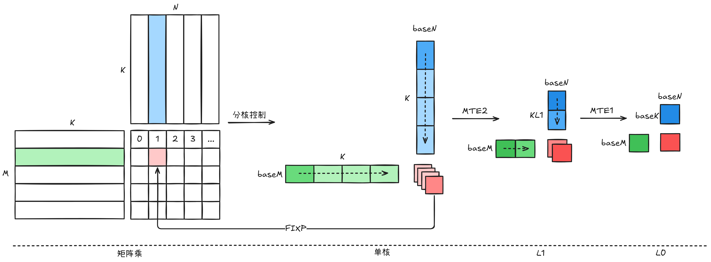

# Matmul

## 描述

本样例展示了如何在昇腾AI处理器的CubeCore硬件单元上使用AscendC编程语言实现矩阵乘运算。下面是矩阵乘在NPU上的执行的示意图。


## 关键特性

- 流水并行：具备DoubleBuffer能力开启流水并行
- 参数可配：支持自定义矩阵维度进行测试
- 精度对比：提供标准的CPU实现作为精度基准

## 支持架构

NPU ARCH 3510

## ASC API

[ASC API文档](https://www.hiascend.com/document/detail/zh/CANNCommunityEdition/850/API/ascendcopapi/atlasascendc_api_07_0003.html)

## 参数说明

- m: 矩阵乘中左矩阵的行
- k: 矩阵乘中左矩阵的列/右矩阵的行
- n: 矩阵乘中右矩阵的列

算子Kernel支持Dtype模板参数，目前支持FLOAT16/BFLOAT16/FLOAT32

## 编译运行

1. 编译样例

从项目根目录启动构建，参考项目[README.md](../../../README.md)

在仓库根目录下完成编译和安装后，进入当前样例目录：
```shell
cmake -S . -B build -DNPU_ARCH=dav-3510
cmake --build build --parallel
cmake --install build --prefix ./build_out
cd ./build_out/0_Introduction/matmul
```

如需单独编译当前样例，可使用以下指令：
```shell
cmake --build build --target matmul
cp ./Samples/0_Introduction/matmul/scripts/* ./build/Samples/0_Introduction/matmul/
cd ./build/Samples/0_Introduction/matmul
```

2. 运行样例

使用可执行文件直接执行算子用例，需要指定矩阵乘维度，并随机生成输入数据。
```shell
./matmul 1024 2048 4096
```
运行成功后，终端将打印如下类似信息：
```txt
Data generated successfully!

[verify] shape(1024, 4096), elements=4194304 - summary (large matrix, full tensors omitted)
  abs_err: max=2.560000e+02, mean=7.629395e-03, rmse=1.397542e+00
  rel_err: max=6.451613e-03
  count(|abs_err| > 0.001): 125 / 4194304
  cpu golden (top-left 4x4):
tensor([[40448., 41728., 41472., 41984.],
        [39680., 40704., 40448., 40960.],
        [40192., 41472., 41472., 41984.],
        [40960., 41984., 41728., 42240.]], dtype=torch.bfloat16)
  npu out (top-left 4x4):
tensor([[40448., 41728., 41472., 41984.],
        [39680., 40704., 40448., 40960.],
        [40192., 41472., 41472., 41984.],
        [40960., 41984., 41728., 42240.]], dtype=torch.bfloat16)
max abs diff: 256.0
point error count(>0.1): 0/4194304
ratio error count(>0.001): 125/4194304, error ratio: 0.000030
[PASS] NPU results are consistent with CPU.
```
如果存在精度问题，则会打印错误数据，并显示如下结果。
```txt
[ERROR] NPU results differ from CPU.
```

3. 测试性能
运行性能测试脚本，指定矩阵乘法的维度后执行。
```shell
python3 profile_matmul.py 1024 2048 4096
```
打印如下执行结果，证明样例性能测试成功。
```shell
[Profile Breakdowm]
+-----------+------------+---------+------------+----------+----------+-------------+----------------+
| candidate | kernel(us) | mac(us) | scalar(us) | mte1(us) | mte2(us) | fixpipe(us) | icache_miss(%) |
+===========+============+=========+============+==========+==========+=============+================+
| matmul    |     86.870 |  43.804 |      1.850 |   12.997 |   51.857 |       2.970 |          2.200 |
+-----------+------------+---------+------------+----------+----------+-------------+----------------+
```