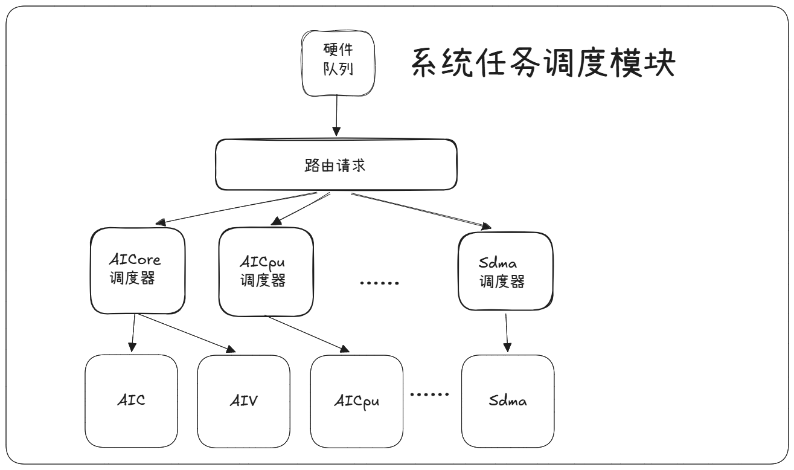

# 一个 NPU 算子从 PyTorch 调用到芯片执行经历了什么：完整执行链路拆解

> **概述**：本文档描述 AICore 算子从运行时（runtime）下发任务到执行完成的完整流程。其中运行时（runtime）是华为昇腾平台CANN软件栈中负责驱动硬件执行与管理AI计算任务的核心组件，实现从资源初始化、任务调度、内存通信到模型执行的完整运行时支持。
>
> **关键词**：AICore、算子调度、任务执行、流水线

---

## 流程总览

算子从 runtime 下发任务后到执行结束，整体流程分为两大阶段，算子调度部分和算子执行部分：

| 阶段 | 说明 | 子步骤数 |
|------|------|:--------:|
| **算子调度部分** | 任务从 runtime 到 AICore 的调度过程 | 算子调度 5 步 |
| **算子执行部分** | AICore 执行算子的完整过程（含硬件初始化、软件初始化、算子执行） | 硬件初始化 2 步 + 软件初始化 3 步 + 计算 3 步 |

**备注**

Task Duration：算子profiling采集的算子耗时, 其中AICore调度器调度时间大约150ns，硬件初始化大约50ns，软件初始化大约1us，这个时间不是固定的由算子的TilingData大小，算子初始化行为的耗时决定，所有核执行结束到结果上报耗时约500ns。

---

## 一、算子调度部分

| 步骤 | 名称 | 描述 | 模块 |
|:----:|------|------|------|
| 1 | 任务下发 | runtime将算子任务写到runtime任务队列中(可以是host侧的也可以是device侧的)，并发送通知给系统任务调度器 | 软件 |
| 2 | 任务交换 | 系统任务调度器将任务从软件队列中交换到硬件队列中 | 硬件 |
| 3 | 任务解析 | 系统任务调度器接收到请求后，读取和解析硬件任务队列中的任务 | 硬件 |
| 4 | 任务分发 | 系统任务调度器根据任务类型，将AICore任务下发到AICore调度器处理 | 硬件 |
| 5 | 任务调度 | AICore调度器将任务调度给AICore | 硬件 |

---
**备注**

任务调度器：是芯片上的硬件调度器，是昇腾芯片特有的硬件调度加速模块，是芯片任务和资源调度处理中心，支持调度多种计算引擎和搬运引擎，支持片上多模块的调度。

AI调度器：是任务调度器中的一个模块，专门负责AIC和AIV任务的调度。

算子任务格式：一般一个算子的执行任务对应一个，任务内容包含了算子的类型（AIC/AIV/MIX），算子使用核数，runtime软件侧的stream id，AICore算子的执行过程中的栈地址，kernel程序在内存的位置等信息。

## 二、算子执行部分

### 2.1 算子硬件初始化

| 步骤 | 名称 | 描述 |
|:----:|------|------|
| 1 | 系统初始化 | AICore系统控制器接收到高速总线发过来的AICore任务，进行初始化配置（Icache Invalidate/PreLoad、Warning 清除等操作），启动AICore的scalar unit |
| 2 | 首指令读取 | Scalar Uint从每个AICore中的Icache中读取kernel程序，若如果Icache MISS则需要去L2 cache查询；若L2 cache也MISS，则去内存获取 |

**备注**

AICore系统控制器：是每个AICore内部的一个模块，负责AICore算子的初始化配置，性能统计，结果上报。

首指令：是kernel的第一条指令，通常为了解决算子首条指令的cache miss带来的开销，runtime会在算子任务中设置Icache预取操作，在kernel启动前将kernel代码加载到算子的Icache中。

指令内存层级：AICore的都是从Icache读取指令，Icache是Instruction Cache的缩写，每个核有自己的Icache，如果Icache空的话，kernel会去读取内存上的kernel指令，首先会看kernel指令是否在L2上，如果在L2上，则需要去内存获取，否则直接从L2读取已经缓存的指令，L2是芯片所核内共享的。

### 2.2 算子软件初始化

| 步骤 | 名称 | 描述 | 来源 |
|:----:|------|------|------|
| 1 | 算子参数初始化 | 获取指令后，进行算子入参地址拷贝，Dcache初始化 | 编译器 |
| 2 | 框架初始化 | 全局寄存器、TilingData初始化 | Ascendc/编译器 |
| 3 | 其他初始化操作 | 算子内部循环边界值，切分变量，地址偏移等参数初始化 | 算子开发 |

**备注**

算子参数：输入、输出、工作空间、栈地址、切分信息地址信息，算子拷贝参数首先通过寄存器获取参数起始地址，然后再加载这些信息。
TilingData: 一般包含了算子切分信息、规格、算子属性等信息，算子初始化tilingdata就是将在device内存上的tilingData信息搬运到全局寄存器或者算子分配的device的栈空间上。
其他初始化操作：然后进行buffer分配，初始化输入地址偏移，计算循环数等操作。

### 2.3 计算任务执行

| 步骤 | 名称 | 描述 |
|:----:|------|------|
| 1 | 数据搬入 | MTE2/MTE1 将数据从外部存储搬入 AICore 内部存储 |
| 2 | 计算执行 | VECTOR/CUBE 执行计算任务 |
| 3 | 数据搬出 | MTE3/FIXPIPE 将计算结果从 AICore 内部存储搬出到外部存储 |

### 2.4 执行完成

AICore系统控制器上报算子任务的执行状态给系统任务调度器，整个算子任务执行结束。