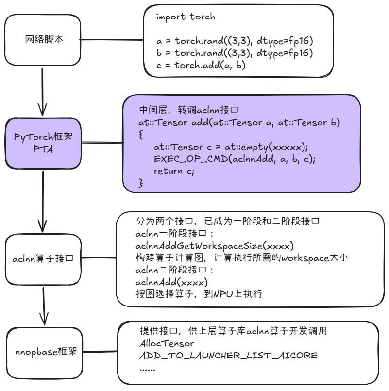
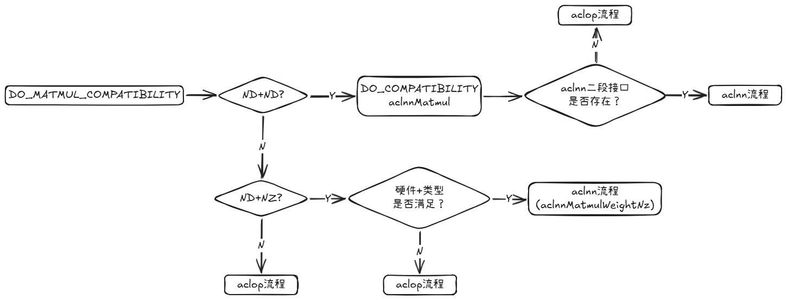
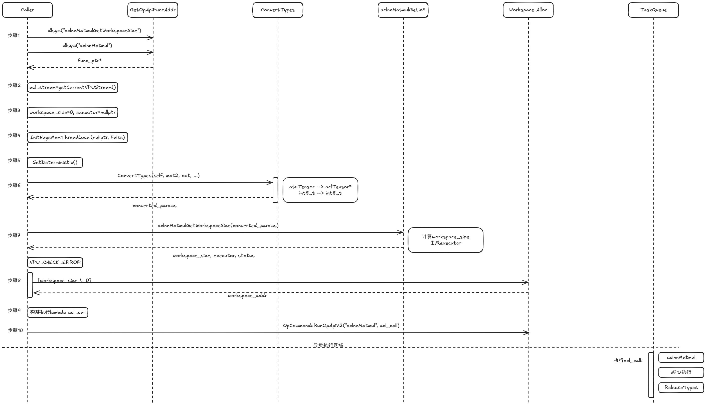
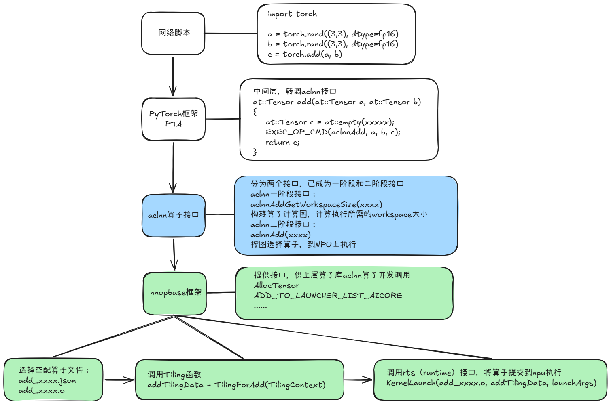
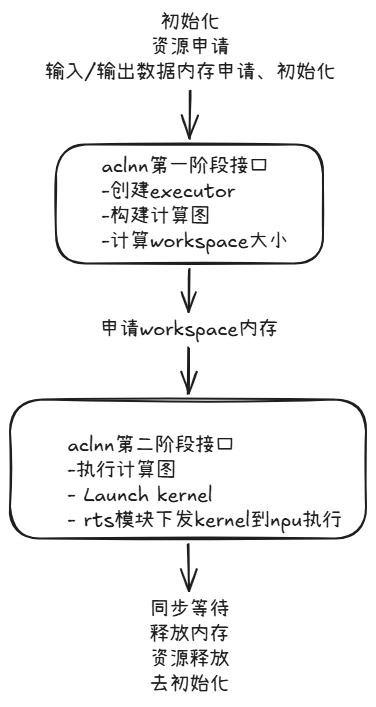
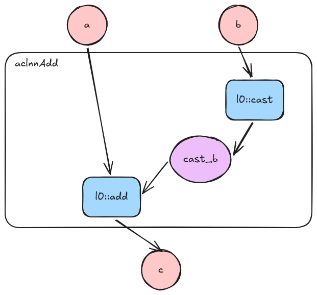
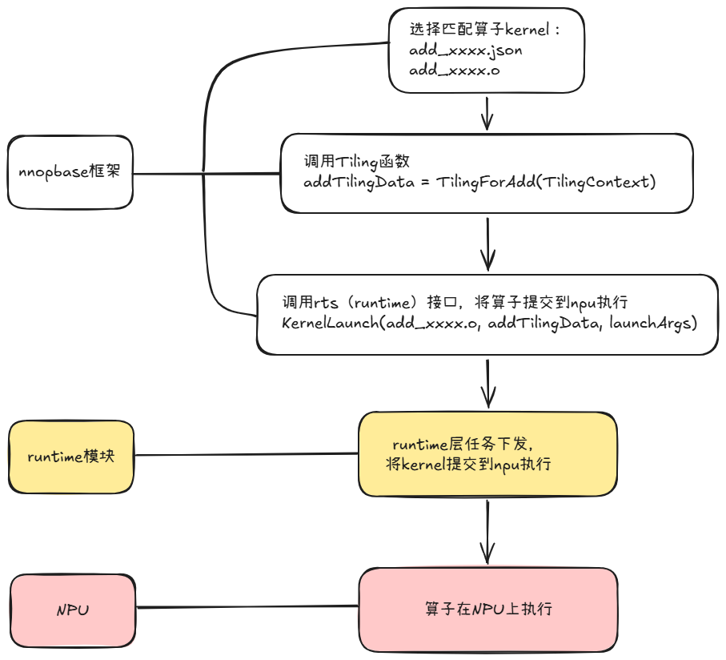
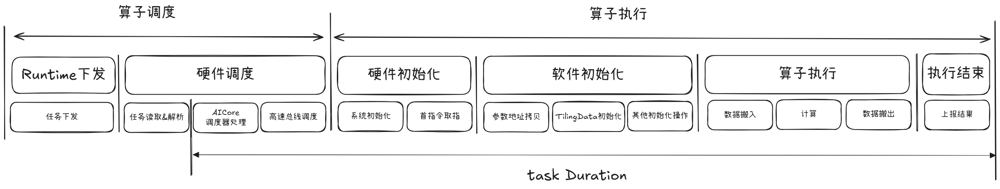

# 一个 NPU 算子从 PyTorch 调用到芯片执行经历了什么：完整执行链路拆解

# 一、pytorch框架调用阶段分析

## 1. 整体流程



## 2. pytorch侧执行流程

### 2.1 初始化	

​	Python 中的 `torch._C` 是一个用 C++ 编写并编译为 .so 的扩展模块。在这个模块内部，有一个子对象 `_VariableFunctions`，它上面挂载了大量以算子名命名的函数对象（如 matmul, add, relu 等），构建过程如下：

1. **定义一个静态 Python 类型 `THPVariableFunctions`（相当于一个"类"）**
   文件: `pytorch_2.7.1/torch/csrc/autograd/python_torch_functions_manual.cpp:534`

2. **用代码生成工具（根据`native_functions.yaml`）自动生成方法表**
   文件: `pytorch_2.7.1/torch/csrc/autograd/generated/python_torch_functions_0.cpp:689`，方法表是一个 C 数组，每个元素形如：

```c++
{"matmul", THPVariable_matmul, METH_VARARGS|METH_KEYWORDS|METH_STATIC, nullptr}
 ↑名字     ↑实际调用的C函数       ↑调用约定
```

3. **把方法表挂到类上，创建单例实例，注册为 `torch._C._VariableFunctions`，方法表里每个方法都指向一个 C++实现的 `THPVariable_xxx`**

```c++
// pytorch_2.7.1/torch/csrc/autograd/python_torch_functions_manual.cpp:575
  void initTorchFunctions(PyObject* module) {
      // [1] 收集所有方法（包含 THPVariable_matmul）到 torch_functions 数组
      gatherTorchFunctions(torch_functions);

      // [2] 把方法表挂到类型上
      THPVariableFunctions.tp_methods = torch_functions.data();

      // [3] 初始化类型（让 Python 运行时识别这个类型）
      PyType_Ready(&THPVariableFunctions);

      // [4] 把类型本身注册为 torch._C._VariableFunctionsClass
      PyModule_AddObject(module, "_VariableFunctionsClass", &THPVariableFunctions);

      // [5] 用类型创建一个实例对象，注册为 torch._C._VariableFunctions
      THPVariableFunctionsModule = PyType_GenericNew(&THPVariableFunctions, ...);
      PyModule_AddObject(module, "_VariableFunctions", THPVariableFunctionsModule);
  }
```

```python
# pytorch_2.7.1/torch/__init__.py:2087-2099
for __name in dir(_C._VariableFunctions):
      if __name.startswith("__") or __name in PRIVATE_OPS:
          continue
      __obj = getattr(_C._VariableFunctions, __name)
      __obj.__module__ = __name__  # 设置为 "torch"
      globals()[__name] = __obj
```

做的事情可以用一个等价的比喻来理解：

```python
  torch._C._VariableFunctions 上有：
    ├── matmul     →  指向 C++ THPVariable_matmul 的 Python 函数对象
    ├── add        →  指向 C++ THPVariable_add 的 Python 函数对象
    ├── mm         →  指向 C++ THPVariable_mm 的 Python 函数对象
    └── ... (几百个算子)
```

  循环把每一个都"抄"到 torch 模块上：

```python
torch.matmul = _C._VariableFunctions.matmul
torch.add = _C._VariableFunctions.add
torch.mm = _C._VariableFunctions.mm
    ...
```

  那么为什么不直接写 `def matmul(...): ...`？主要有以下三点因素：

- **性能**：Python 端只是一个入口壳，PyTorch 通过代码生成技术在编译阶段自动生成了几百个 `THPVariable_xxx` 的 C++ 函数，把它们注册到 `_VariableFunctions` 上，再用这段循环统一"搬"到 torch 命名空间。这样用户写 `torch.matmul(a, b)` 时，实际调用的是 C++ 实现的高性能版本。

- **复用**：`torch._C._VariableFunctions` 也被 torch.fx、torch.compile 等子系统引用，它们需要拿到"原始的、无装饰的"底层函数表。

- **隔离**：如果直接 `def matmul(...): ...`，用户代码可能覆盖它。中间层保证 `_C._VariableFunctions.matmul` 始终指向原始 C 实现。

### 2.2 THPVariable_xxx流程

```cpp
// pytorch_2.7.1/torch/csrc/autograd/generated/python_torch_functions_0.cpp:4913
static PyObject * THPVariable_matmul(PyObject* self_, PyObject* args, PyObject* kwargs)
{
  HANDLE_TH_ERRORS
  static PythonArgParser parser({
    "matmul(Tensor input, Tensor other, *, Tensor out=None)",
  }, /*traceable=*/true);

  ParsedArgs<3> parsed_args;
  auto _r = parser.parse(nullptr, args, kwargs, parsed_args);
  if(_r.has_torch_function()) {
    return handle_torch_function(_r, nullptr, args, kwargs, THPVariableFunctionsModule, "torch");
  }
  if (_r.isNone(2)) {
    // aten::matmul(Tensor self, Tensor other) -> Tensor
    auto dispatch_matmul = [](const at::Tensor & self, const at::Tensor & other) -> at::Tensor {
      pybind11::gil_scoped_release no_gil;   // 释放Python全局解释器锁
      return self.matmul(other);              // 进入Dispatcher
    };
    return wrap(dispatch_matmul(_r.tensor(0), _r.tensor(1)));
  } else {
    // aten::matmul.out(Tensor self, Tensor other, *, Tensor(a!) out) -> Tensor(a!)
    auto dispatch_matmul_out = [](at::Tensor out, const at::Tensor & self, const at::Tensor & other) -> at::Tensor {
      pybind11::gil_scoped_release no_gil;
      return at::matmul_out(out, self, other);
    };
    return wrap(dispatch_matmul_out(_r.tensor(2), _r.tensor(0), _r.tensor(1)));
  }
  Py_RETURN_NONE;
  END_HANDLE_TH_ERRORS
}
```

**执行流程**：

​	`PythonArgParser` 解析 Python 传来的位置参数和关键字参数，支持两种签名：无 `out` 参数和有 `out` 参数。

​	检查是否重写了 `__torch_function__`（子类化 Tensor 的情况），若是则走 Python 回调路径。

​	关键步骤：在调用 C++ 分发之前，通过 `pybind11::gil_scoped_release` 释放 GIL，使 C++ 端长时间的计算不会阻塞其他 Python 线程。

​	调用 `self.matmul(other)` 或 `at::matmul_out(out, self, other)` 进入 PyTorch 的 C++ Dispatcher。

### 2.3 Dispatch流程


1. **`self.matmul(other)` 编译为` at::Tensor::matmul()`，它直接调用 `at::_ops::matmul::call()`**

```c++
// pytorch_2.7.1/build/aten/src/ATen/core/TensorBody.h:2899
inline at::Tensor Tensor::matmul(const at::Tensor & other) const {
    return at::_ops::matmul::call(const_cast<Tensor&>(*this), other);
}
```

2. **`at::_ops::matmul::call()` → `TypedOperatorHandle`**

```c++
// pytorch_2.7.1/build/aten/src/ATen/Operators_4.cpp:2767-2770
at::Tensor matmul::call(const at::Tensor & self, const at::Tensor & other) {
    static auto op = create_matmul_typed_handle();  // 初始化一次，后续复用
    return op.call(self, other);
    // op是TypedOperatorHandle<at::Tensor(const at::Tensor&, const at::Tensor&)>
}
```

3. **`TypedOperatorHandle::call` → `Dispatcher::call`**

```c++
// pytorch_2.7.1/aten/src/ATen/core/dispatch/Dispatcher.h:603-606
template <class Return, class... Args>
class TypedOperatorHandle<Return(Args...)> {
    C10_ALWAYS_INLINE Return call(Args... args) const {
        return c10::Dispatcher::singleton().call<Return, Args...>(  // 直接调用Dispatcher单例的call方法
            *this, std::forward<Args>(args)...);
    }
};
```

4. **`Dispatcher::call` 提取 dispatch key → 查找 kernel（以下为核心逻辑，省略了 profiling 和 debug trace 等分支）**

```c++
// pytorch_2.7.1/aten/src/ATen/core/dispatch/Dispatcher.h:764-813
template <class Return, class... Args>
C10_ALWAYS_INLINE_UNLESS_MOBILE Return Dispatcher::call(const TypedOperatorHandle<...>& op, Args... args) const {
    // [1] 从所有Tensor参数中提取dispatch key set
    auto dispatchKeySet =
    op.operatorDef_->op.dispatchKeyExtractor()
    .template getDispatchKeySetUnboxed<Args...>(args...);

    // [2] 从dispatch table中查找最高优先级的kernel
    const KernelFunction& kernel = op.operatorDef_->op.lookup(dispatchKeySet);

    // [3] 调用找到的 kernel
    return kernel.template call<Return, Args...>(
    op, dispatchKeySet, std::forward<Args>(args)...);
}
```

​	提取 dispatch keyset 的细节（`getDispatchKeySetUnboxed` 简化版，省略了 `requiresBitsetPerBackend_` 分支）：

```c++
// pytorch_2.7.1/aten/src/ATen/core/dispatch/DispatchKeyExtractor.h
// 56-57 - 遍历参数时调用每个 Tensor 的 key_set()
void operator()(const at::Tensor& x) {
      ts = ts | x.key_set();   // 从 Tensor 内部读取 key set，例如 {Autograd, PrivateUse1}
}
// 182-194 — 对所有参数做合并后排除 fallthrough key
DispatchKeySet getDispatchKeySetUnboxed(const Args&... args) const {
    auto ks = detail::multi_dispatch_key_set(args...);  // 遍历所有参数，合并 key_set
    return impl::computeDispatchKeySet(ks, nonFallthroughKeys_);  // 排除 fallthrough key
}

```

```c++
// pytorch_2.7.1/aten/src/ATen/core/dispatch/OperatorEntry.h:182-200
const KernelFunction& lookup(DispatchKeySet ks) const {
    // 取最高优先级的 key 作为索引
    // Autograd > PrivateUse1，所以命中Autograd
    const auto idx = ks.getDispatchTableIndexForDispatchKeySet();
    const auto& kernel = dispatchTable_[idx];  // 数组查找
    return kernel;
}
```

​	`dispatchTable_` 是一个以 dispatch key 为索引的数组。Autograd 优先级高于 PrivateUse1，所以命中的是注册在 Autograd 下的 `VariableType::matmul`。

5. **KernelFunction::call 执行目标函数：`kernel.template call<Return, Args...>(op, dispatchKeySet, self, other)` 最终调用到 `VariableType::matmul(dispatchKeySet, self, other)`。**

### 2.4 Redispatch流程


```c++
// pytorch_2.7.1/torch/csrc/autograd/generated/VariableType_4.cpp:13168
at::Tensor matmul(c10::DispatchKeySet ks, const at::Tensor & self, const at::Tensor & other) {
  auto& self_ = unpack(self, "self", 0);
  auto& other_ = unpack(other, "other", 1);
  [[maybe_unused]] auto _any_requires_grad = compute_requires_grad( self, other );

  // [1] 如果任意输入需要梯度，创建反向传播节点
  std::shared_ptr<MatmulBackward0> grad_fn;
  if (_any_requires_grad) {
    grad_fn = std::shared_ptr<MatmulBackward0>(new MatmulBackward0(), deleteNode);
    grad_fn->set_next_edges(collect_next_edges( self, other ));
    grad_fn->other_ = SavedVariable(other, false);  // 保存输入other
    grad_fn->self_  = SavedVariable(self, false);    // 保存输入self
  }

  // [2] 执行前向计算（越过autograd层，重新分发到后端）
  auto _tmp = ([&]() {
    if ((isFwGradDefined(self) || isFwGradDefined(other))) {
      // 前向模式AD路径
      return impl::run_jit_decomposition_with_args_for_jvp<at::Tensor>(...);
    } else {
      at::AutoDispatchBelowADInplaceOrView guard;
      // 关键：ks & c10::after_autograd_keyset剥离autograd key
      return at::redispatch::matmul(ks & c10::after_autograd_keyset, self_, other_);
    }
  })();
  auto result = std::move(_tmp);

  // [3] 将反向节点挂到输出张量上
  if (grad_fn) {
      set_history(flatten_tensor_args( result ), grad_fn);
  }
  return result;
}
```

1. **VariableType::matmul 执行流程**

（1）Unpack：unpack 出底层的 C++ Tensor。

（2）梯度检查：`compute_requires_grad` 检查任一输入是否设置了 `requires_grad=True`。

（3）创建反向节点：如果需要梯度，创建 `MatmulBackward0` 对象，保存两个输入张量为 `SavedVariable`（用于反向计算），并通过 `collect_next_edges` 收集计算图中的前驱节点边。

（4）重新分发：`ks & c10::after_autograd_keyset` 剥离 Autograd 相关的 dispatch key，使后续分发直接到达后端 kernel。对于 NPU，下一个命中的 key 就是 `PrivateUse1`。

（5）挂载历史：将 `grad_fn` 绑定到输出张量上，使后续的 `loss.backward()` 能沿计算图反向传播。

2. **`at::redispatch::matmul` 执行流程（省略了 debug trace 代码）**

```c++
// pytorch_2.7.1/build/aten/src/ATen/Operators_4.cpp:2774-2778
at::Tensor matmul::redispatch(c10::DispatchKeySet dispatchKeySet,
                              const at::Tensor & self, const at::Tensor & other) {
    static auto op = create_matmul_typed_handle();
    return op.redispatch(dispatchKeySet, self, other); // TypedOperatorHandle::redispatch
}
```

```c++
// pytorch_2.7.1/aten/src/ATen/core/dispatch/Dispatcher.h:610-614
Return redispatch(DispatchKeySet currentDispatchKeySet, Args... args) const {
    return c10::Dispatcher::singleton().redispatch<Return, Args...>(
        *this, currentDispatchKeySet, std::forward<Args>(args)...);
}
```

```c++
// pytorch_2.7.1/aten/src/ATen/core/dispatch/Dispatcher.h:818-834
inline Return Dispatcher::redispatch(
	const TypedOperatorHandle<Return(Args...)>& op,
	DispatchKeySet currentDispatchKeySet, // 关键参数
	Args... args) const {

  // 不从Tensor提取key，直接用传入的key set查表
  const KernelFunction& kernel =
  op.operatorDef_->op.lookup(currentDispatchKeySet); // = {PrivateUse1}
  
  return kernel.template call<Return, Args...>(
	  op, currentDispatchKeySet, std::forward<Args>(args)...);
}
```

```c++
// pytorch_2.7.1/aten/src/ATen/core/dispatch/OperatorEntry.h:182-200
const KernelFunction& lookup(DispatchKeySet ks) const {
    const auto idx = ks.getDispatchTableIndexForDispatchKeySet();
    // 最高优先级key = PrivateUse1
    // idx = dispatch table中PrivateUse1对应的索引
    const auto& kernel = dispatchTable_[idx];
    return kernel; // = KernelFunction(wrapper_NPU__matmul)
}
```

## 3. torch_npu侧执行流程

### 3.1 matmul的注册与调用

1. **注册**

   PyTorch 通过 `TORCH_LIBRARY_IMPL` 宏将后端特定的 kernel 注册到 Dispatcher 中。torch_npu 使用 `PrivateUse1` 作为 NPU 的 dispatch key。

```cpp
// torch_npu/torch_npu/csrc/aten/RegisterNPU.cpp:23789
// 全局算子注册块
TORCH_LIBRARY_IMPL(aten, PrivateUse1, m) {
    // ... 其他算子注册 ...

    // matmul系列算子注册（受环境变量TORCH_NPU_USE_COMPATIBLE_IMPL控制）
    if (std::getenv("TORCH_NPU_USE_COMPATIBLE_IMPL") == nullptr ||
        std::string(std::getenv("TORCH_NPU_USE_COMPATIBLE_IMPL")) != "1") {
        m.impl("matmul",          TORCH_FN(wrapper_NPU__matmul)); // 前向
        m.impl("matmul.out",      TORCH_FN(wrapper_NPU_out_matmul_out)); // 带out参数
        m.impl("matmul_backward", TORCH_FN(wrapper_NPU__matmul_backward)); // 反向
    }

    // mm和bmm 也独立注册
    m.impl("mm",      TORCH_FN(wrapper_NPU__mm));
    m.impl("mm.out",  TORCH_FN(wrapper_NPU_out_mm_out));
    m.impl("bmm",     TORCH_FN(wrapper_NPU__bmm));
    m.impl("bmm.out", TORCH_FN(wrapper_NPU_out_bmm_out));
    // ...
}
```

​	**补充说明**：`PrivateUse1` 是 PyTorch 预留给第三方加速设备的 dispatch key。当 Tensor 的 `device` 为 `npu` 时，Dispatcher 会自动将其路由到 `PrivateUse1` 下注册的 kernel。

2. **执行**

```cpp
// torch_npu/torch_npu/csrc/aten/RegisterNPU.cpp:6330
at::Tensor wrapper_NPU__matmul(const at::Tensor & self, const at::Tensor & other) {
    // [1] 设备一致性检查：确保所有输入tensor都在同一个NPU设备上
    c10::optional<at::Device> common_device = at::nullopt;
    c10::impl::check_and_update_common_device(common_device, self, "wrapper_NPU__matmul", "self");
    c10::impl::check_and_update_common_device(common_device, other, "wrapper_NPU__matmul", "other");

    // [2] 数据安全检查（可选，受环境变量控制）
    if (c10_npu::get_npu_data_unsafe_flag()) {
        c10_npu::check_npu_tensor_is_safe(self);
        c10_npu::check_npu_tensor_is_safe(other);
    }

    const OptionalDeviceGuard device_guard(device_of(self));

    // [3] Profiling hook
#ifndef BUILD_LIBTORCH
    torch_npu::profiler::NPURecordFunction guard;
#endif

    // [4] 用户自定义 OpHook 拦截
    if (C10_UNLIKELY(at_npu::native::env::CheckOpHookEnable())) {
        at_npu::native::OpHook::GetInstance().PreHook("matmul", self, other);
        at::Tensor res = op_plugin::matmul(self, other);
        at_npu::native::OpHook::GetInstance().PostHook(res);
        return res;
    }

    // [5] 正常路径：进入 op_plugin 路由层
    return op_plugin::matmul(self, other);
}
```

**执行流程**：

​	设备校验：确保 `self` 和 `other` 都在同一个 NPU 设备上，否则抛出异常。

​	数据安全检查：如果启用了数据安全标志，验证 tensor 数据的合法性。

​	Profiling：如果启用了 profiling，记录算子执行的开始时间。

​	OpHook：用户可注册自定义钩子函数，在算子执行前后进行拦截。

​	进入路由：调用 `op_plugin::matmul()`，进入算子插件的路由层。

### 3.2 op_plugin 侧的执行流程

1. **根据 JIT 开关来判断走 aclnn 流程还是 aclop 流程**

```cpp
// torch_npu/third_party/op-plugin/op_plugin/OpInterface.cpp:18375
at::Tensor matmul(const at::Tensor & self, const at::Tensor & other) {
    bool is_jit_disable = at_npu::native::env::CheckJitDisable();
    OP_EXEC_LOG(matmul, "exec aten", self, other);
    ASCEND_LOGI("matmul exec with jit compile: %d", !is_jit_disable);

    if (is_jit_disable) {
        return op_api::matmul(self, other);    // 主流场景：aclnn API
    } else {
        return acl_op::matmul(self, other);    // 日落中：aclop API
    }
}
```

2. **aclnn 场景 matmul 的调用流程**

```c++
// torch_npu/third_party/op-plugin/op_plugin/ops/opapi/MatmulKernelNpuOpApi.cpp:107
// 对应上述的aclnn接口流程
at::Tensor matmul(const at::Tensor &tensor1, const at::Tensor &tensor2)
{
    // [1] 格式兼容性检查，决定走aclnn或aclop
    DO_MATMUL_COMPATIBILITY(
        aclnnMatmulWeightNz,    // NZ 格式专用 API
        aclnnMatmul,            // ND 格式标准 API
        tensor1, tensor2,
        acl_op::matmul(tensor1, tensor2)   // 不兼容时的回退
    );

    // [2] 计算 name inference（命名张量传播）
    auto maybe_outnames = at::namedinference::compute_matmul_outnames(tensor1, tensor2);

    // [3] 执行前向计算
    auto result = matmul_forward(tensor1, tensor2);

    at::namedinference::propagate_names_if_nonempty(result, maybe_outnames);
    return result;
}
```

```cpp
at::Tensor matmul_forward(const at::Tensor &self, const at::Tensor &mat2)
{
    at::NoNamesGuard guard;
    auto output_size = get_output_size(self, mat2); // 计算输出shape
    auto out = OpPreparation::apply_tensor_without_format( // 分配输出tensor
        output_size, self.options());
    matmul_implement_npu(out, self, mat2); // 执行矩阵乘
    return out;
}
```

```cpp
static inline void matmul_implement_npu(
    at::Tensor &out, const at::Tensor &self, const at::Tensor &mat2)
{
    // cube_math_type 控制是否允许FP32降精度（转为HF32/FP16 计算）
    int8_t cube_math_type = op_plugin::utils::get_cube_math_type_with_passthrough();

    if (op_plugin::utils::is_nd_nz_format(self, mat2)) {
        // 权重是NZ（fractal NZ）格式 → 使用WeightNz专用API
        EXEC_NPU_CMD(aclnnMatmulWeightNz, self, mat2, out, cube_math_type);
    } else {
        // ND格式 → 标准matmul API
        EXEC_NPU_CMD(aclnnMatmul, self, mat2, out, cube_math_type);
    }
}
```

（1）通过 `DO_MATMUL_COMPATIBILITY` 判断输入是否为私有格式来决定调用 aclnn 流程还是 aclop 流程，这个宏根据当前 tensor 格式来判断走哪个 API：

```cpp
// torch_npu/third_party/op-plugin/op_plugin/utils/op_api_common.h:586
#define DO_MATMUL_COMPATIBILITY(aclnn_nz_api, aclnn_nd_api, input1, input2, aclop_func_call) \
    do {                                                                                    \
        if (op_plugin::utils::is_two_tensor_base_format(input1, input2)) {                 \
            /* 情况 A：两个输入都是 base format（ND 格式）*/                                 \
            DO_COMPATIBILITY(aclnn_nd_api, aclop_func_call);                               \
            /* → 检查 aclnn_nd_api 函数指针是否存在，不存在则回退 aclop */                  \
        } else {                                                                            \
            /* 检查 SoC 版本是否支持 NZ 格式 */                                              \
            static bool is_support_soc =                                                    \
                (c10_npu::GetSocVersion() >= c10_npu::SocVersion::Ascend910B1 &&            \
                 c10_npu::GetSocVersion() < c10_npu::SocVersion::Ascend310B1) ||            \
                (c10_npu::GetSocVersion() > c10_npu::SocVersion::Ascend310B4);              \
            bool is_nz_dtype_valid = (                                                      \
                (input1).scalar_type() != at::ScalarType::Float &&                           \
                (input2).scalar_type() != at::ScalarType::Float);                            \
            if (op_plugin::utils::is_nd_nz_format(input1, input2) &&                        \
                is_support_soc && is_nz_dtype_valid) {                                      \
                /* 情况 B：一个 ND 一个 NZ，SoC 支持，dtype 非 FP32 */                       \
                DO_COMPATIBILITY(aclnn_nz_api, aclop_func_call);                            \
            } else {                                                                        \
                /* 情况 C：不支持的格式组合 → 回退 aclop 路径 */                             \
                if (!c10_npu::IsAclnnOnly()) {                                              \
                    return aclop_func_call;                                                  \
                }                                                                           \
                TORCH_CHECK(false, "matmul got not support format ...");                    \
            }                                                                               \
        }                                                                                   \
    } while (0)
```

**流程图**：



（2）`EXEC_NPU_CMD` 执行流程

```c++
// torch_npu/third_party/op-plugin/op_plugin/utils/op_api_common.h:435
#define EXEC_NPU_CMD(aclnn_api, ...)                                                      \
    do {                                                                                  \
        static const auto task_queue_enable = c10_npu::option::OptionsManager::GetTaskQueueEnable(); \
        if (task_queue_enable == 2) {                                                      \
            EXEC_NPU_CMD_V2(aclnn_api, __VA_ARGS__);   /* V2: 参数预拷贝 */               \
        } else {                                                                          \
            EXEC_NPU_CMD_V1(aclnn_api, __VA_ARGS__);   /* V1: 直接转换 */                 \
        }                                                                                 \
    } while (false)
```

`EXEC_NPU_CMD_V1` 和 `EXEC_NPU_CMD_V2` 的区别如下：

|                             | V1           | V2           |
| --------------------------- | ------------ | ------------ |
| aclnnMatmulGetWorkspaceSize | 主线程执行   | 消费线程执行 |
| aclnnMatmul执行             | 消费线程执行 | 消费线程执行 |

以 `EXEC_NPU_CMD(aclnnMatmul, self, mat2, out, cube_math_type)` 为例，V1 展开为以下步骤：

```cpp
// [步骤 1] 动态加载函数指针 (dlsym from libopapi.so)
static const auto getWorkspaceSizeFuncAddr = GetOpApiFuncAddr("aclnnMatmulGetWorkspaceSize");
static const auto opApiFuncAddr           = GetOpApiFuncAddr("aclnnMatmul");
// 检查指针不为空
TORCH_CHECK(getWorkspaceSizeFuncAddr != nullptr && opApiFuncAddr != nullptr, ...);

// [步骤 2] 获取当前 NPU stream
auto acl_stream = c10_npu::getCurrentNPUStream().stream(false);

// [步骤 3] 初始化 workspace 和 executor
uint64_t workspace_size = 0;
uint64_t *workspace_size_addr = &workspace_size;
aclOpExecutor *executor = nullptr;
aclOpExecutor **executor_addr = &executor;

// [步骤 4] PTA 编译缓存初始化（避免重复编译相同算子）
InitHugeMemThreadLocal initMemFunc = reinterpret_cast<InitHugeMemThreadLocal>(initMemAddr);
if (initMemFunc) { initMemFunc(nullptr, false); }

// [步骤 5] 设置确定性模式
at_npu::native::SetDeterministic();

// [步骤 6] 参数类型转换：PyTorch 类型 → ACL 类型
//   at::Tensor  → aclTensor*    (通过 aclCreateTensor)
//   int8_t      → int8_t        (直接传递)
auto converted_params = ConvertTypes(self, mat2, out, cube_math_type,
                                     workspace_size_addr, executor_addr);

// [步骤 7] 第一阶段：GetWorkspaceSize
//   编译算子，计算临时空间需求，生成 executor
static auto getWorkspaceSizeFunc = ConvertToOpApiFunc(converted_params, getWorkspaceSizeFuncAddr);
auto workspace_status = call(getWorkspaceSizeFunc, converted_params);
NPU_CHECK_ERROR(workspace_status, "call aclnnMatmul failed");

// [步骤 8] 分配 workspace 内存（若需要）
void *workspace_addr = nullptr;
at::Tensor workspace_tensor;
if (workspace_size != 0) {
    workspace_tensor = OpPreparation::unsafe_empty_workspace(workspace_size);
    workspace_addr = const_cast<void *>(workspace_tensor.storage().data());
}

// [步骤 9] 构建执行 lambda
auto acl_call = [converted_params, workspace_addr, workspace_size, acl_stream, executor]()
    -> int {
    OpApiFunc opApiFunc = reinterpret_cast<OpApiFunc>(opApiFuncAddr);
    // 第二阶段：实际执行 ACL 算子
    auto api_ret = opApiFunc(workspace_addr, workspace_size, executor, acl_stream);
    // 即调用: aclnnMatmul(workspace_addr, workspace_size, executor, acl_stream)
    NPU_CHECK_ERROR(api_ret, "call aclnnMatmul failed");
    ReleaseConvertTypes(converted_params);  // 释放 aclTensor* 等资源
    return api_ret;
};

// [步骤 10] 提交到异步 TaskQueue 执行
at_npu::native::OpCommand::RunOpApiV2("aclnnMatmul", acl_call);
```

执行时序图如下所示：




# 二、ACLNN单算子、NNOPBASE框架调用阶段分析

## 1. 概述

aclnn算子接口，是为了方便用户在Host侧调用算子，CANN算子库提供的C语言单算子接口。

nnopbase是CANN算子库依赖的基础框架库，上对接pytorh、mindspore等AI框架，提供aclnn算子相关数据结构的创建、销毁、属性设置与获取能力，为ops-math、ops-nn、ops-cv、ops-transformer 等算子库，提供了一套统一的单算子执行调度框架，下对接CANN runtime模块，控制算子提交到NPU执行，起到了承上启下的作用。



## 2. ACLNN单算子接口

参考文档：[CANN内置算子调用-CANN社区版9.0.0-昇腾社区](https://www.hiascend.com/document/detail/zh/CANNCommunityEdition/900/programug/acldevg/aclcppdevg_000531.html)

ACLNN单算子接口，采用“两段式接口”形式，nopbase框架为两段式接口提供了一套统一的公共能力，接口样式如下：

```
aclnnStatus aclnnXxxGetWorkspaceSize(const aclTensor *src, ..., aclTensor *out, ..., uint64_t *workspaceSize, aclOpExecutor **executor)
aclnnStatus aclnnXxx(void *workspace, uint64_t workspaceSize, aclOpExecutor *executor, aclrtStream stream)
```

两段式接口统一使用aclnn作为接口前缀，其中*“Xxx”*表示对应的算子类型，如Add算子。

两段式接口具体作用如下：

- **第一阶段接口（aclnnXxxGetWorkspaceSize）**：完成入参校验、动态Shape场景下推导输出Shape、数据切块（Tiling）、构建L0算子的计算图以及计算执行过程中算子所需的workspace内存大小等任务。
- **第二阶段接口（aclnnXxx）**：nnopbase框架按照计算图，选择正确的算子，提交到NPU上执行。

### 2.1 ACLNN单算子接口调用流程




### 2.2 ACLNN单算子接口内部组成

aclnn二段式接口为L2接口，内部会调用多个L0算子接口。




## 3. 一阶段接口调用流程（aclnnXXXGetWorkspaceSize）

### 3.1 流程概览

以 `aclnnAdd` 算子为例，代码链接：[ops-math/math/add/op_api/aclnn_add.cpp-代码预览-ops-math:基于 CANN 的数学类算子库项目 - AtomGit | GitCode](https://gitcode.com/cann/ops-math/blob/master/math/add/op_api/aclnn_add.cpp)

```
aclnnStatus aclnnAddGetWorkspaceSize(const aclTensor* self, const aclTensor* other, const aclScalar* alpha, aclTensor* out, uint64_t* workspaceSize, aclOpExecutor** executor);
    ↓
1. L2_DFX_PHASE_1 宏调用 // nnopbase框架提供，固定写法，用于时延统计、入参打印
    ↓
2. 创建UniqueExecutor（CREATE_EXECUTOR宏）// nnopbase框架提供，固定写法
    ↓
3. 参数校验（CheckParams）
    ↓
4. 构建计算图（调用多个L0算子）
    - l0op::Contiguous(self) → selfContiguous
    - l0op::Cast(selfContiguous, promoteType) → selfCasted
    - l0op::Contiguous(other) → otherContiguous
    - l0op::Cast(otherContiguous, promoteType) → otherCasted
    - l0op::Add(selfCasted, otherCasted) → addOpOut
    - l0op::Cast(addOpOut, out->GetDataType()) → castOut
    - l0op::ViewCopy(castOut, out) → viewCopyResult
    ↓
5. 计算Workspace大小（executor->GetWorkspaceSize） // nnopbase框架提供，固定写法
    ↓
6. 返回executor和workspaceSize
```

### 3.2 详细流程分析

#### 3.2.1 宏L2_DFX_PHASE_1

nnopbase框架提供，固定写法，一阶段接口的入口处调用，用于时延统计、入参打印。

#### 3.2.2 创建执行器

nnopbase框架提供宏：CREATE_EXECUTOR()，用于创建aclOpExecutor，aclOpExecutor 是 nnopbase 框架中算子执行器的核心类，负责管理整个算子计算图的构建和执行。

```
aclOpExecutor提供的能力
    │
    ├── 1. 内存分配与管理
    │     ├── 创建device侧、host侧tensor、tensor list
    │     ├── 创建host侧array数组
    │     ├── 创建标量数据：scalar、scalar list
    │     ├── 创建view类tensor
    │     └── 数组、标量转tensor
    |
    ├── 2. 计算图管理
    │     ├── 一个L0算子对应一个 KernelLauncher
    │     ├── 维护 KernelLauncher 列表 
    │     └── 管理多个 L0 算子的组合执行
    │
    ├── 3. Workspace 计算
    │     └── 计算ACLNN单算子接口执行所需要的workspace内存
    │
    └── 4. 按照计算图，下发L0算子到NPU执行
```

#### 3.2.3 L0算子调用

每个L0算子，内部调用框架提供的宏ADD_TO_LAUNCHER_LIST_AICORE，将L0算子加入任务队列。

以L0 add算子为例，调用示例如下：

```c++
namespace l0op {
const aclTensor* Add(const aclTensor* self, const aclTensor* other, aclOpExecutor* executor)
{
	...
	auto addOut = isMixDataType ? executor->AllocTensor(broadcastShape, DataType::DT_FLOAT) :
                                  executor->AllocTensor(broadcastShape, self->GetDataType());
	if (isMixDataType || (IsAiCoreSupport(self) && IsAiCoreSupport(other))) {
        return AddAiCore(self, other, addOut, executor);
    }
    return AddAiCpu(self, other, addOut, executor);
}

// AICORE算子kernel
static const aclTensor* AddAiCore(
    const aclTensor* self, const aclTensor* other, aclTensor* addOut, aclOpExecutor* executor)
{
    L0_DFX(AddAiCore, self, other, addOut);
    // 使用框架宏ADD_TO_LAUNCHER_LIST_AICORE，将AiCore Add算子加入任务队列
    // Add是算子的OpType，self、other是算子的输入，addOut是算子的输出
    auto ret = ADD_TO_LAUNCHER_LIST_AICORE(Add, OP_INPUT(self, other), OP_OUTPUT(addOut));
    OP_CHECK(
        ret == ACL_SUCCESS, OP_LOGE(ACLNN_ERR_INNER_NULLPTR, "AddAiCore ADD_TO_LAUNCHER_LIST_AICORE failed."),
        return nullptr);
    return addOut;
}
}
```

#### 3.2.4 计算图构建

宏ADD_TO_LAUNCHER_LIST_AICORE内部，使用BuildGraph函数，为每一个L0算子构建计算图节点。

```
BuildGraph(graph, opType, inputs, outputs, workspace, outputshape)
    │
    ├── 创建KernelNode，即计算图节点
    │   ├── 设置opType（算子类型标识），输入/输出/workspace tensor
    │   └── 记录每个tensor的生命周期，分析每个tensor与其他节点tensor之间的关联关系
    │
    └── 将创建好的KernelNode算子节点，添加到KernelGraph计算图中
```

#### 3.2.5 计算Workspace大小

固定调用框架提供的接口aclOpExecutor::GetWorkspaceSize()，计算整个aclnn算子执行过程中需要的workspace。

```
aclOpExecutor::GetWorkspaceSize()
    ↓
1.获取计算图
    ↓
2.根据计算图，确定算子执行顺序。遍历所有aclnn接口内部创建的tensor，根据各个tensor的关联关系，确定每个tensor生命周期，计算每个tensor大小。
    ↓
3.内存复用：生命周期不重叠的tensor共享内存
    ↓
4.返回总大小：优化后的workspace总大小
```

## 4. 二阶段接口调用流程（aclnnXXX）

### 4.1 流程概览

aclnnXXX二段式接口，固定调用nnopbase提供宏L2_DFX_PHASE_2和接口CommonOpExecutorRun

以 `aclnnAdd` 算子为例，代码链接：[ops-math/math/add/op_api/aclnn_add.cpp-代码预览-ops-math:基于 CANN 的数学类算子库项目 - AtomGit | GitCode](https://gitcode.com/cann/ops-math/blob/master/math/add/op_api/aclnn_add.cpp)

```
aclnnStatus aclnnAdd(void* workspace, uint64_t workspaceSize,  aclOpExecutor* executor, aclrtStream stream)
    ↓
1. L2_DFX_PHASE_2(aclnnAdd);  // nnopbase框架提供，固定写法
    - 时延统计
    ↓
2. CommonOpExecutorRun(workspace, workspaceSize, executor, stream); // nnopbase框架提供，固定写法
    - 执行计算图（executor->Run()）
        - 按照L0算子队列顺序，依次launch
        	- 若一阶段未执行tiling，则调用tiling，否则从缓存中获取tiling结果（tiling key、block dim等）
    		- Kernel下发（调用runtime接口）
```

## 5. L0算子的管理

L0算子的管理，由nnopbase框架完成，包括算子的注册、算子信息初始化。

L0算子通常采用多Kernel实例化架构，针对不同的输入输出特征组合，编译生成独立的二进制目标文件（.o文件）。

每个独立的二进制文件对应一组明确的输入输出参数v，核心特征维度包括：

- 数据类型（dtype）：如bfloat16、float32、int32等
- 数据格式（format）：如ND（N-Dimensional）、NHWC、NCHW等

以Add算子为例：

$$
y = x1 + x2
$$
case 1:

输入x1：dtype=bfloat16，format=ND

输入x2：dtype=bfloat16，format=ND

输出y：dtype=bfloat16，format=ND 

对应二进制文件：`add_bf16_nd.o`

case 2:

输入x1：dtype=float32，format=ND

输入x2：dtype=float32，format=ND

输出y：dtype=float32，format=ND

对应二进制文件：`add_f32_nd.o`

nnopbase框架会根据算子的入参，选择正确的kernel，即二进制文件，加载到NPU执行。框架通过将磁盘中存储的Kernel元数据与特征信息全量预加载至内存并构建索引，避免了算子调度阶段的磁盘I/O开销，大幅提升匹配效率。

#### 5.1 核心组件

nnopbase框架使用以下组件，管理L0算子

| 组件        | 功能                                                         |
| ----------- | ------------------------------------------------------------ |
| KernelMgr   | L0算子管理器，管理所有OpKernel                               |
| OpKernel    | L0算子的抽象，一个L0算子对应多个kernel，该组件负责管理这些kernel，即OpKernelBin |
| OpKernelBin | 算子二进制文件的抽象，对应算子二进制文件， 负责算子加载、下发执行 |

```c++
class KernelMgr {
public:    
    // 获取 kernel
    OpKernel *GetKernel(uint32_t opType);

private:
    std::array<OpKernel, MAX_OP_TYPE_COUNT> kernel_;    // kernel 列表
}

class OpKernel {
public:    
    // 添加静态二进制
    aclnnStatus AppendStaticBin(...);

    // 添加动态二进制
    aclnnStatus AppendDynBin(...);

    // 选择静态二进制
    OpKernelBin *SelectStaticBin(inputs, outputs, attrs);

    // 选择动态二进制
    OpKernelBin *SelectBin(inputs, outputs, attrs);

private:
    std::string opTypeStr_;    // 算子名
    std::map<size_t, std::unique_ptr<OpKernelBin>> bins_;         // 动态二进制列表
    std::map<size_t, std::unique_ptr<OpKernelBin>> staticBins_;   // 静态二进制列表
};

class OpKernelBin {
piblic:
    // kernel下发执行
    aclnnStatus Launch(stream, args);
    
private:
    aclrtBinHandle binHandle_;   // 算子二进制文件加载后生成的句柄
}
```

#### 5.2 L0算子的注册

nnopbase框架提供的`OP_TYPE_REGISTER` 宏，用于在nnopbase框架中注册L0算子类型，为 L0 算子生成唯一的 OpTypeId（算子类型标识符），用于 kernel launch 时的算子类型识别。

#### 5.3 L0算子信息的初始化

当算子第一次tiling或者launch之前，会解析动态kernel和静态kernel的json配置文件，为每个二进制提取输入、输出的dtype、format等特征生成匹配key，计算hash值后，将二进制信息插入到动态二进制列表和静态二进制列表，供运行时根据输入参数匹配选择合适的kernel二进制。

#### 5.4 L0算子的选择匹配

根据算子入参信息，即输入输出和属性信息，从二进制列表中找到对应的OpKernelBin对象。

入口函数：SelectBin

```
SelectBin(inputs, outputs, attrs)
    │
    ├── 1. 优先查找静态二进制 
    │       └── SelectStaticBin(inputs, outputs, attrs)
    │              ├── 检查静态二进制列表 staticBins_ 是否为空，则不匹配静态二进制         
    │              ├── 根据算子入参inputs、outputs、attrs等参数，生成匹配key，计算hash值
    │              └── 在静态二进制列表 staticBins_ 中查找匹配静态kernel
    │
    └── 2. 若静态二进制未找到，查找动态二进制
            ├── 根据算子入参inputs、outputs、attrs等参数，生成匹配key，计算hash值
            └── 在动态二进制列表 bins_ 中查找匹配静态kernel
```

## 6. INFER_SHAPE机制

### 6.1 概述

部分L0算子在kernel下发执行前，输出tensor的shape无法直接获得，需要调用算子提供的InferShape 函数，根据输入tensor的shape、data type、format，以及算子属性，结合算子的数学语义，推导输出tensor的shape、data type、format。

例如：Slice算子，需要根据输入tensor的shape，每个维度的起始偏移量offsets，每个维度的切片大小size，推导出输出tensor的shape。

nnopbase框架提供INFER_SHAPE宏，内部调用执行算子InferShape函数，L0算子接口内，通过调用该宏来执行InferShape。

### 6.2 INFER_SHAPE内部实现

```
#define INFER_SHAPE(KERNEL_NAME, op_args...)
    ↓
1. 根据KERNEL_NAME找到对应算子的InferShape函数
    ↓
2. 封装输入、输出、属性等信息，构建InferShape上下文信息，即InferShapeContext
    ↓
3. 调用算子注册的InferShape函数，传入参数即InferShapeContext
    ↓
4. 更新输出tensor的shape
```

### 6.3 INFER_SHAPE调用时机

如果算子需要INFER_SHAPE，那么此宏需要在ADD_TO_LAUNCHER_LIST_AICORE之前调用。

```
L0 算子实现
    ↓
AllocTensor (分配输出tensor，此时shape未确定)
    ↓
INFER_SHAPE (推导输出tensor的shape)    ← 在这里调用
    ↓
ADD_TO_LAUNCHER_LIST_AICORE (L0算子加入任务队列)
```

### 6.4 INFER_SHAPE调用示例

以 `Slice` 算子为例：

```
const aclTensor* Slice(const aclTensor* x, const aclIntArray* offsets, const aclIntArray* size, aclOpExecutor* executor) {
    // 1. 分配输出 tensor（此时 shape 未确定）
    auto out = executor->AllocTensor(x->GetDataType(), x->GetStorageFormat(), x->GetOriginalFormat());
    
    // 2. 转换参数为 tensor
    auto offsetTensor = executor->ConvertToTensor(offsets, ToOpDataType(ACL_INT64));
    auto sizeTensor = executor->ConvertToTensor(size, ToOpDataType(ACL_INT64));
    
    // 3. 调用 INFER_SHAPE 宏，nnopbase框架会调用算子的 infershape 函数
    INFER_SHAPE(Slice, OP_INPUT(x, offsetTensor, sizeTensor), OP_OUTPUT(out), OP_EMPTY_ARG);
    
    // 4. 根据入参判断是否支持SliceV2，选择对应的算子
    if (IsSliceV2AiCoreSupport(x, offsets, size)) {
        return SliceV2AiCore(x, out, offsetTensor, sizeTensor, executor);
    }
    return Slice(x, out, offsetTensor, sizeTensor, executor);
}
```

## 7. Tiling机制

### 7.1 概述

Tiling是将大任务切分成小块以适应硬件计算的过程，Tiling过程中，根据不同的输入、输出和属性参数，确定切分策略，给出算子执行过程中所需要的workspace大小。

每个L0算子都会注册一个Tiling函数，nnopbase框架根据算子类型调用对应的Tiling函数，来完成Tiling过程。

### 7.2 Tiling调用时机

若L0算子调用时，没有显式指定的workspace参数，且算子自身存在workspace，那么Tiling调用发生在aclnn一阶段流程中；否则Tiling发生在aclnn二阶段流程中。

### 7.3 Tiling调用流程

```
1. 根据算子名，找到算子注册的Tiling函数
    ↓
2. 封装输入、输出、属性等信息，构建Tiling上下文信息，即TilingContext
    ↓
3. 调用算子注册的Tiling函数，传入参数TilingContext
    ↓
4. 返回tiling输出信息：
    - tiling_key: kernel选择key
    - numBlocks: block数量
    - tiling_data: tiling参数数据
    - workspace_size: L0 workspace大小
```

## 8. Workspace计算

nnopbase 框架中有两种 workspace：

| 类型         | 说明                                                         | 计算时机                        |
| ------------ | ------------------------------------------------------------ | ------------------------------- |
| L0 Workspace | L0 kernel 级别的 workspace，由 tiling 计算                   | Tiling 阶段                     |
| L2 Workspace | L2 算子级别的 workspace，用于存储aclnn接口内部申请的tensor内存和L0 Workspace | aclOpExecutor::GetWorkspaceSize |

## 9. Kernel下发执行

L0算子kernel的下发，由nnopbase框架通过调用runtime模块提供的LaunchKernel接口来完成，发生在aclnn二阶段流程中。

nnopbase框架提供统一的接口CommonOpExecutorRun，在aclnn一阶段中通过ADD_TO_LAUNCHER_LIST_AICORE宏加入任务队列的L0算子，在二阶段流程中就会根据一阶段中创建好的计算图，依次执行。

# 三、AICore算子下发阶段分析

## 1. 概述

本段落描述了 AICore 算子从运行时（runtime）下发任务到执行完成的完整流程。其中运行时（runtime）是华为昇腾平台CANN软件栈中负责驱动硬件执行与管理AI计算任务的核心组件，实现从资源初始化、任务调度、内存通信到模型执行的完整运行时支持。



详细流程：



算子从 runtime 下发任务后到执行结束，整体流程分为两大阶段，算子调度部分和算子执行部分：

| 阶段             | 说明                                                         |                   子步骤数                    |
| ---------------- | ------------------------------------------------------------ | :-------------------------------------------: |
| **算子调度部分** | 任务从 runtime 到 AICore 的调度过程                          |                 算子调度 5 步                 |
| **算子执行部分** | AICore 执行算子的完整过程（含硬件初始化、软件初始化、算子执行） | 硬件初始化 2 步 + 软件初始化 3 步 + 计算 3 步 |

**备注**

Task Duration：算子profiling采集的算子耗时, 其中AICore调度器调度时间大约150ns，硬件初始化大约50ns，软件初始化大约1us，这个时间不是固定的由算子的TilingData大小，算子初始化行为的耗时决定，所有核执行结束到结果上报耗时约500ns。

---

## 2. 算子调度部分


| 步骤 | 名称     | 描述                                                         | 模块 |
| :--: | -------- | ------------------------------------------------------------ | ---- |
|  1   | 任务下发 | runtime将算子任务写到runtime任务队列中(可以是host侧的也可以是device侧的)，并发送通知给系统任务调度器 | 软件 |
|  2   | 任务交换 | 系统任务调度器将任务从软件队列中交换到硬件队列中             | 硬件 |
|  3   | 任务解析 | 系统任务调度器接收到请求后，读取和解析硬件任务队列中的任务   | 硬件 |
|  4   | 任务分发 | 系统任务调度器根据任务类型，将AICore任务下发到AICore调度器处理 | 硬件 |
|  5   | 任务调度 | AICore调度器将任务调度给AICore                               | 硬件 |

---

**备注**

任务调度器：是芯片上的硬件调度器，是昇腾芯片特有的硬件调度加速模块，是芯片任务和资源调度处理中心，支持调度多种计算引擎和搬运引擎，支持片上多模块的调度。

AI调度器：是任务调度器中的一个模块，专门负责AIC和AIV任务的调度。

算子任务格式：一般一个算子的执行任务对应一个，任务内容包含了算子的类型（AIC/AIV/MIX），算子使用核数，runtime软件侧的stream id，AICore算子的执行过程中的栈地址，kernel程序在内存的位置等信息。


## 3. 算子执行部分

### 3.1 算子硬件初始化

| 步骤 | 名称       | 描述                                                         |
| :--: | ---------- | ------------------------------------------------------------ |
|  1   | 系统初始化 | AICore系统控制器接收到高速总线发过来的AICore任务，进行初始化配置（Icache Invalidate/PreLoad、Warning 清除等操作），启动AICore的scalar unit |
|  2   | 首指令读取 | Scalar Uint从每个AICore中的Icache中读取kernel程序，若如果Icache MISS则需要去L2 cache查询；若L2 cache也MISS，则去内存获取 |

**备注**

AICore系统控制器：是每个AICore内部的一个模块，负责AICore算子的初始化配置，性能统计，结果上报。

首指令：是kernel的第一条指令，通常为了解决算子首条指令的cache miss带来的开销，runtime会在算子任务中设置Icache预取操作，在kernel启动前将kernel代码加载到算子的Icache中。

指令内存层级：AICore的都是从Icache读取指令，Icache是Instruction Cache的缩写，每个核有自己的Icache，如果Icache空的话，kernel会去读取内存上的kernel指令，首先会看kernel指令是否在L2上，如果在L2上，则需要去内存获取，否则直接从L2读取已经缓存的指令，L2是芯片所核内共享的。

### 3.2 算子软件初始化

| 步骤 | 名称           | 描述                                               | 来源           |
| :--: | -------------- | -------------------------------------------------- | -------------- |
|  1   | 算子参数初始化 | 获取指令后，进行算子入参地址拷贝，Dcache初始化     | 编译器         |
|  2   | 框架初始化     | 全局寄存器、TilingData初始化                       | Ascendc/编译器 |
|  3   | 其他初始化操作 | 算子内部循环边界值，切分变量，地址偏移等参数初始化 | 算子开发       |

**备注**

算子参数：输入、输出、工作空间、栈地址、切分信息地址信息，算子拷贝参数首先通过寄存器获取参数起始地址，然后再加载这些信息。
TilingData: 一般包含了算子切分信息、规格、算子属性等信息，算子初始化tilingdata就是将在device内存上的tilingData信息搬运到全局寄存器或者算子分配的device的栈空间上。
其他初始化操作：然后进行buffer分配，初始化输入地址偏移，计算循环数等操作。

### 3.3 计算任务执行

| 步骤 | 名称     | 描述                                                    |
| :--: | -------- | ------------------------------------------------------- |
|  1   | 数据搬入 | MTE2/MTE1 将数据从外部存储搬入 AICore 内部存储          |
|  2   | 计算执行 | VECTOR/CUBE 执行计算任务                                |
|  3   | 数据搬出 | MTE3/FIXPIPE 将计算结果从 AICore 内部存储搬出到外部存储 |

### 3.4 执行完成

AICore系统控制器上报算子任务的执行状态给系统任务调度器，整个算子任务执行结束。

