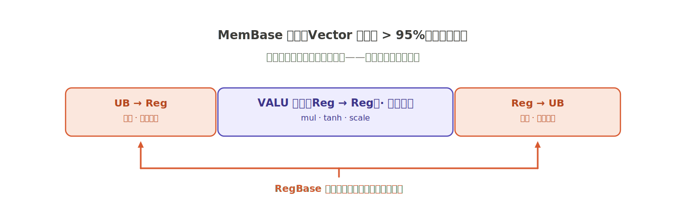
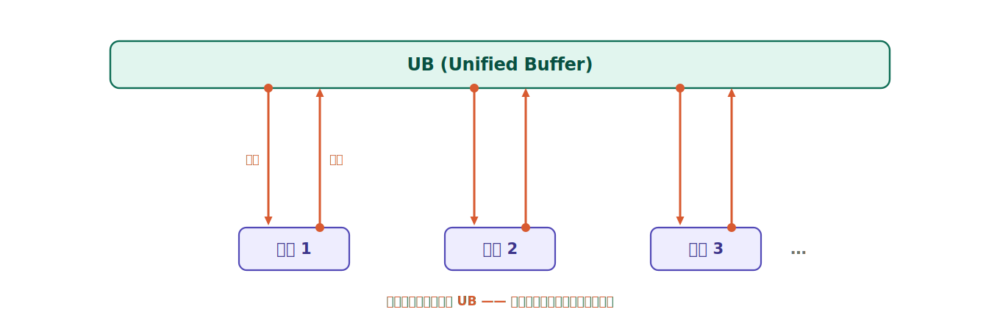
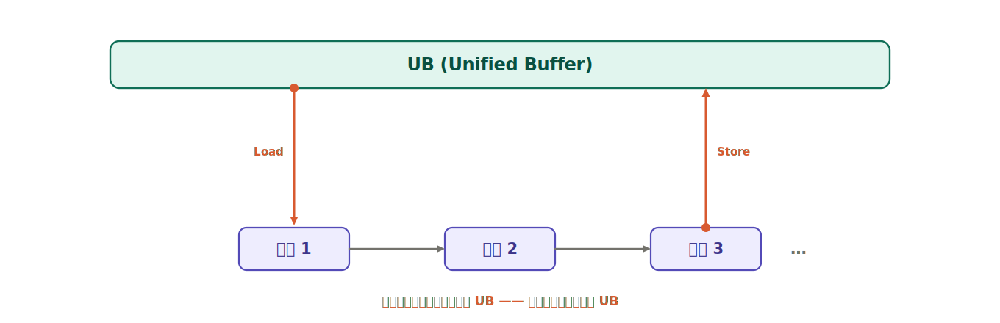
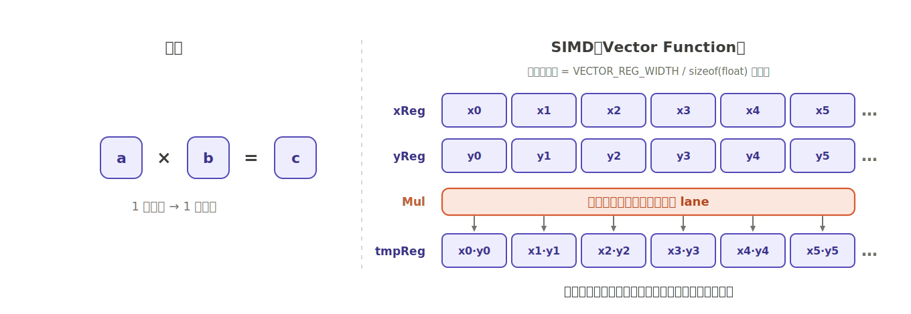
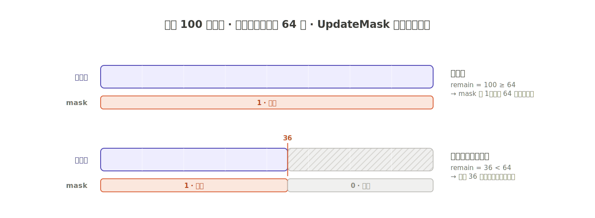
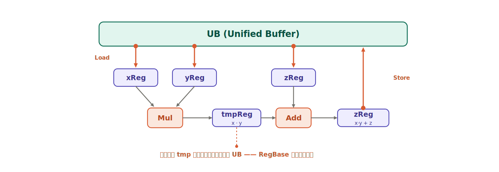
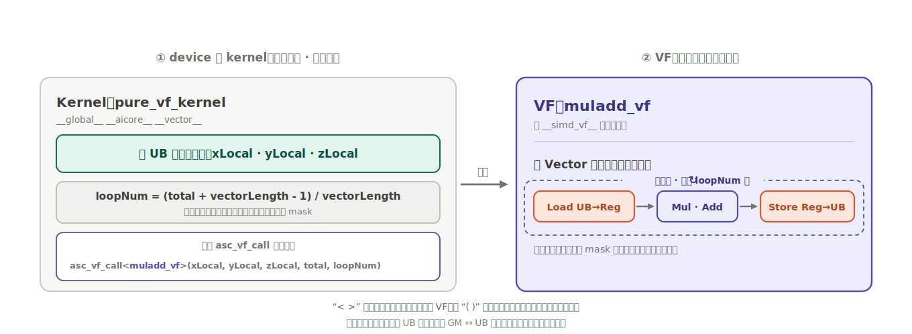
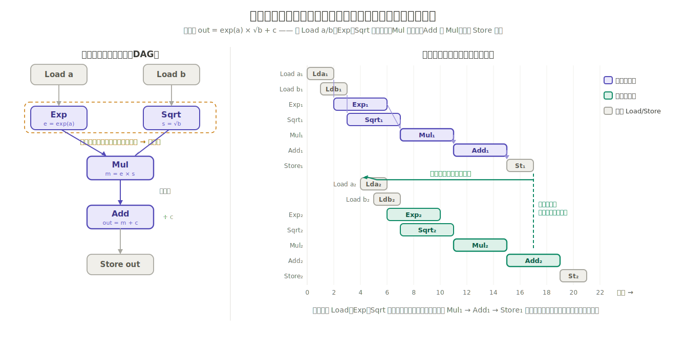
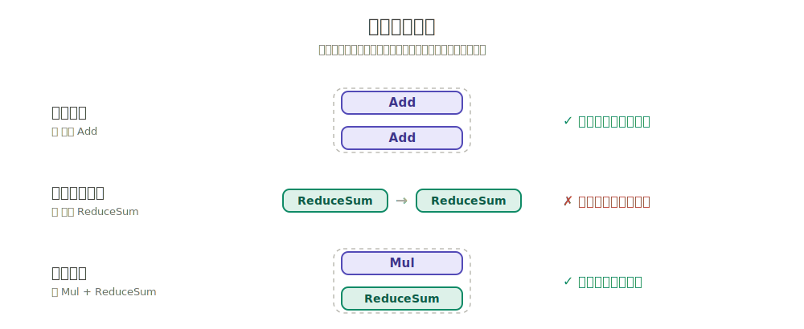
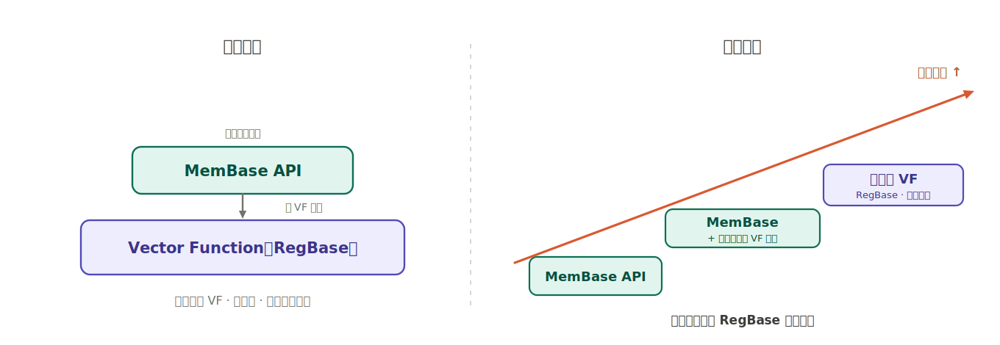

# RegBase入门：在 Ascend950 上用 Vector Function 榨干算力

# 一、Vector性能天花板

如果你用 MemBase 写过 GeLU，大概率见过这样一份 Profiling：算子功能正确，Vector 计算单元的占用率 \>95% 甚至 99%，达到了 Bound。计算单元满负荷，看起来没什么可优化的了。

但值得想一下：那个 Bound 里，有多少是在真正做你要的 mul、tanh、scale？又有多少是在把数据在 UB 和 Reg 之间搬进搬出？这部分搬运并不是算法本身需要的，而是 MemBase 写法自带的开销：只要用 MemBase，每一步运算都要在 UB 和 Reg 之间走一趟。



在 Ascend 950 上，还有另一种写法：RegBase。它重新组织了数据流，省掉 MemBase 中那层不可避免的搬运开销。要理解它为什么能做到这一点，我们先看 MemBase 写法下数据是怎么流动的。


# 二、MemBase 下的数据流：每一步运算都要往返 UB

两个基本概念：

- **UB（Unified Buffer）** ：片上统一缓冲区，Vector 计算单元能直接访问的数据区。
- **VALU**：Vector 计算单元，执行实际算术运算的硬件。

MemBase 模型下，所有数据的读写都发生在 UB 上。计算单元每做一步运算，从 UB 取数，算完写回 UB。下一步再从 UB 取，算完再写回。

GeLU 这类多步算子（高次项、tanh、缩放、相乘），每一步都要走一次这个往返：



步骤越多，往返越多。计算单元的时间里，有相当一部分花在了等数据进来、把结果送回去上，而不是纯粹在算。

回到第一节的 Profiling：Vector 占用率 \>95%，看起来计算单元满负荷，但这个负荷里包含了所有往返 UB 的搬运开销。在 MemBase 写法下，这些搬运和计算绑在一起，是这种写法固有的代价。


# 三、RegBase 的思路：中间结果留在寄存器里

RegBase（Register Based），基于寄存器的编程模型，区别于 MemBase 的执行方式。

核心变化是：**把 Vector 寄存器的控制权开放给开发者。**  开发者不再只能操作 UB，而是直接控制三件事：

1. 把数据从 UB **Load** 进 Vector 寄存器；
2. 在**寄存器之间**完成多步运算；
3. 把最终结果从寄存器 **Store** 回 UB。

Vector 寄存器物理上紧挨 VALU，数据从寄存器到计算单元的代价极低。数据流因此变成这样：


数据 Load 进寄存器后，中间所有步骤在寄存器里连续完成，只在头尾各和 UB 交互一次。对比第二节的锯齿形往返，中间那些反复的 UB 回写被消掉了。

回到 GeLU：在 RegBase 下，多个计算步骤是一连串在寄存器里流转的运算，中间量始终待在寄存器中，只在头尾碰一次 UB。计算单元的时间真正花在计算上，省掉了中间的搬运。

这些寄存器操作具体写在一种叫做 Vector Function（简称 VF） 的函数里，它是 RegBase 模型最核心的编程载体。下一节展开它的编程模型。


# 四、VF 的编程模型

一个 VF 是一个用 `__simd_vf__` 标记的 C++ 函数。写法和普通 C/C++ 接近，可以有参数、局部变量、多层循环；区别在于函数体内用 `AscendC::Reg` 系列 API 操作寄存器的 Load、运算和 Store。

1. 一条指令作用在一整批元素上  

   `__simd_vf__` 是函数修饰符，告诉编译器这个函数是 Vector Function，而不是普通 C++ 函数。

   VF 里的运算是 SIMD 的。Vector 寄存器宽度是一个固定常量，通过 `AscendC::VECTOR_REG_WIDTH` 获取。对 float 来说，一个寄存器装 `VECTOR_REG_WIDTH / sizeof(float)` 个元素。

   当你写下 `Mul(tmp, x, y)`，它不是算一对数的乘法，而是同时对寄存器里那一整批元素做乘法。写 VF 时必须记住：操作的单位是一个寄存器宽度的数据，不是单个标量。

   
2. 用 Mask 控制哪些元素生效  
   一次处理一整批，那凑不满一个寄存器宽度时怎么办？比如总共 100 个 float，寄存器一次装 64 个，第一轮处理 64 个，第二轮只剩 36 个有效，但寄存器依然是 64 个位置。  
   这时用掩码寄存器：配置一个 mask，让运算只在有效的那部分元素上生效，其余位置不参与。最后那个装不满的尾块也能精确处理，不会越界算到不该碰的数据。后面的代码例子会展示 mask 怎么自动适配尾块。

   
3. Load / Store 在 VF 内部控制  
   VF 里你可以自己写循环遍历 UB 上的数据，什么时候 Load、什么时候 Store 都在 VF 内部决定。一个 VF 更像一段完整的片上小程序，而不只是一个计算公式。


# 五、动手：一个 MulAdd 合并的 Vector Function

写一个最小但完整的例子：`z = x * y + z`。两个输入和一个累加器、两次算术、一次写回，刚好把 Load、运算、Store、Mask 都用上。

```cpp
// z = x * y + z   —— MulAdd 融合，尾块自适应
__simd_vf__ inline void muladd_vf(__ubuf__ float *xAddr, __ubuf__ float *yAddr,
                                  __ubuf__ float *zAddr, uint32_t total, uint32_t loopNum)
{
    constexpr uint32_t vectorLength = AscendC::VECTOR_REG_WIDTH / sizeof(float);
    AscendC::Reg::RegTensor<float> xReg, yReg, zReg, tmpReg;
    AscendC::Reg::MaskReg pMask;

    uint32_t remain = total;

    for (uint16_t i = 0; i < loopNum; ++i) {
        pMask = AscendC::Reg::UpdateMask<float>(remain);
        AscendC::Reg::LoadAlign(xReg, xAddr + i * vectorLength);
        AscendC::Reg::LoadAlign(yReg, yAddr + i * vectorLength);
        AscendC::Reg::LoadAlign(zReg, zAddr + i * vectorLength);
        AscendC::Reg::Mul(tmpReg, xReg, yReg, pMask);
        AscendC::Reg::Add(zReg,   tmpReg, zReg, pMask);
        AscendC::Reg::StoreAlign<float, AscendC::Reg::StoreDist::DIST_NORM_B32>(
            zAddr + i * vectorLength, zReg, pMask);
    }
}
```



## 寄存器宽度

```cpp
constexpr uint32_t vectorLength = AscendC::VECTOR_REG_WIDTH / sizeof(float);
```

一个寄存器一轮能处理多少个 float。`VECTOR_REG_WIDTH` 是寄存器字节宽度，除以 `sizeof(float)` 得到元素个数。后面循环里靠它给地址分段。

## 寄存器变量声明

```cpp
AscendC::Reg::RegTensor<float> xReg, yReg, zReg, tmpReg;
AscendC::Reg::MaskReg pMask;
```

`RegTensor<float>` 是 Vector 寄存器在 C++ 里的表示，每个变量对应一整批 float。`tmpReg` 存放 `x * y` 的中间结果，这个中间量全程在寄存器里，不碰 UB，正是 RegBase 省搬运的关键。`MaskReg` 是掩码寄存器。

## Mask 与尾块自适应

```cpp
uint32_t remain = total;
...
pMask = AscendC::Reg::UpdateMask<float>(remain);
```

`remain` 是 VF 内部的可变状态，初值是元素总数。`UpdateMask` 做两件事：根据当前 `remain` 的值生成对应的掩码，赋给 `pMask`；同时以引用方式把 `remain` 就地减去一个 `vectorLength`。

效果是：

- 前面几轮 `remain ≥ vectorLength`，mask 全 1，整个寄存器宽度的元素都参与运算；
- 最后一个尾块 `remain < vectorLength`，mask 只让前 `remain` 个元素生效。

后续的 `Mul`、`Add`、`StoreAlign` 都接收 `pMask`，只在有效元素上执行。尾块不需要单独处理。

## Load → 计算 → Store

```cpp
AscendC::Reg::LoadAlign(xReg, xAddr + i * vectorLength);
AscendC::Reg::LoadAlign(yReg, yAddr + i * vectorLength);
AscendC::Reg::LoadAlign(zReg, zAddr + i * vectorLength);
AscendC::Reg::Mul(tmpReg, xReg, yReg, pMask);
AscendC::Reg::Add(zReg,   tmpReg, zReg, pMask);
AscendC::Reg::StoreAlign<float, AscendC::Reg::StoreDist::DIST_NORM_B32>(
    zAddr + i * vectorLength, zReg, pMask);
```

一轮的完整生命周期：把这一段的 x、y、z 从 UB Load 进寄存器，在寄存器里算出 `tmp = x*y` 再算 `z = tmp + z`，最后把 z Store 回 UB。

`LoadAlign` / `StoreAlign` 里的 "Align" 指 UB 地址必须按 BlockSize（32B）对齐。这是硬性要求：非对齐地址会触发 ERROR，Kernel 直接崩溃。计算地址偏移时要保证对齐。`StoreAlign` 的模板参数 `StoreDist::DIST_NORM_B32` 表示按 32 字节对齐的常规存储模式。

如果地址无法保证 32B 对齐，则需要改用非对齐指令 `LoadUnalign` / `StoreUnalign`，它们可以处理任意地址的读写。


# 六、VF 是怎么被调用的

VF 写好后，由 device 侧的 kernel 通过 `asc_vf_call` 调用：VF 函数名作为模板参数，后面跟实参。kernel 入口用 `__vector__` 修饰，表示这个函数是运行在 Vector Core 上的核函数：

```cpp
__global__ __vector__ void pure_vf_kernel()
{
    constexpr uint32_t kNumElements = 8192;
    constexpr uint32_t vectorLength = AscendC::VECTOR_REG_WIDTH / sizeof(float);
    constexpr uint32_t total   = kNumElements;
    uint32_t           loopNum = (total + vectorLength - 1) / vectorLength;

    __ubuf__ float xLocal[kNumElements];
    __ubuf__ float yLocal[kNumElements];
    __ubuf__ float zLocal[kNumElements];

    asc_vf_call<muladd_vf>(xLocal, yLocal, zLocal, total, loopNum);
}
```

`loopNum` 是向上取整：总元素数除以一轮处理的元素数，不能整除就多跑一轮，多出来的那一轮由 mask 控制有效元素范围。



> 这个例子是故意简化的，聚焦在 VF 本身怎么写、怎么调用。`xLocal` 等数据直接声明在 UB 上，省去了真实算子里 Global Memory 与 UB 之间的搬运。生产算子还需要处理 GM <--> UB 的数据搬运，本文不展开。


# 七、VF 执行时硬件在做什么：乱序与并行执行

VF 的代码交给硬件后会怎么执行？乱序和并行执行完全由硬件自动完成，不需要写调度代码，但开发者需要了解它们，因为这直接影响 VF 能跑多快。

## 乱序执行

乱序执行的意思是：**硬件不必按代码书写顺序逐条发射指令。一条指令只要操作数就绪、计算单元空闲，就可以提前发射，哪怕它在代码里排在后面。**

每条指令都有几个周期的执行延迟。如果严格按代码顺序、一条算完再发下一条，计算单元会有大量周期空等在延迟上。乱序执行让彼此没有依赖的指令把各自的执行延迟重叠起来，计算单元的利用率上去，VF 的端到端耗时也就下来了。

关键在有没有数据依赖。看一个循环体，逐 tile 计算 `out = exp(a) × √b + c`：先把 a、b 从 UB **Load** 进寄存器，中间四条算术算出结果，最后把 out **Store** 回 UB。展开成下面这串指令：

```cpp
AscendC::Reg::LoadAlign(a, aAddr + i * vectorLength);   // Load a
AscendC::Reg::LoadAlign(b, bAddr + i * vectorLength);   // Load b
AscendC::Reg::Exp (e,   a,        pMask);   // e   = exp(a)
AscendC::Reg::Sqrt(s,   b,        pMask);   // s   = √b
AscendC::Reg::Mul (m,   e,  s,    pMask);   // m   = e × s     依赖 Exp、Sqrt
AscendC::Reg::Add (out, m,  c,    pMask);   // out = m + c     依赖 Mul
AscendC::Reg::StoreAlign<float, AscendC::Reg::StoreDist::DIST_NORM_B32>(
    outAddr + i * vectorLength, out, pMask);            // Store out
```

开头两条 `Load` 各取各的输入、互不依赖；`Exp` 和 `Sqrt` 也各读各的，彼此没有数据依赖；`Mul` 要等这两个结果都就绪才能开始，`Add` 再等 `Mul`，末尾的 `Store` 再等 `Add`，中间这几条构成一条依赖链。下图左侧就是这段循环体的指令依赖关系（DAG）。



乱序执行带来两层重叠。**其一在一轮迭代内部**：两条 `Load`、以及 `Exp` 和 `Sqrt` 都互不依赖，硬件不必算完一条再发下一条，可以让它们的执行延迟重叠起来。**其二、也是更大的收益，发生在相邻迭代之间**：第二轮的 `Load`、`Exp`、`Sqrt` 处理的是新一批数据，和第一轮没有任何依赖，于是当第一轮还卡在 `Mul₁ → Add₁ → Store₁` 这条依赖链上、计算单元本会空等时，硬件就把第二轮的 `Load₂`、`Exp₂`、`Sqrt₂` 提前发射出去，填满那些空等的周期。右侧流水图里，第二轮（绿色）的指令明显跑到了第一轮（紫色）依赖链的左侧，也就是被提前执行了。

可见乱序能带来多少收益，取决于代码里有多少彼此独立的指令。对比第五节的 `z = x*y + z`：那里 `Add` 依赖 `Mul` 的结果，两条指令构成一条依赖链，只能串行，乱序无从施展。独立的指令越多，能重叠的延迟就越多。

需要补充的是，相邻迭代之间能这样重叠，前提是循环被编译器识别为**硬件循环**，硬件因此能把相邻迭代的指令纳入同一个调度窗口。这正是下一节的主题。

正确性由硬件保证。硬件通过指令实际使用的寄存器编号判断依赖关系，不会调换有依赖的指令，乱序后的结果和顺序执行完全一致。寄存器的复用与分配由编译器和硬件负责：代码里声明几个 `RegTensor`，不等于实际执行时分配的物理寄存器数量，这一层开发者不需要介入。

需要注意的是，寄存器内的数据依赖关系由硬件保证，UB 的地址需要开发者自己管理。

## 硬件循环与软件循环

乱序能跨迭代生效的前提是：循环被编译器识别为**硬件循环（Hardware Loop）** 。

先看普通的软件 `for` 循环是怎么实现的。一个 `for (i = 0; i < n; i++)`，除了循环体里的计算指令，每一轮迭代还要执行一组**循环控制指令**：递增循环计数器（更新归纳变量 `i`）、将计数器与循环上界 `n` 做比较、再根据比较结果执行一条条件分支跳回循环起始地址。这些指令不参与有效计算，属于纯粹的**循环开销（loop overhead）**，却同样消耗发射周期；循环体越短，循环开销占总指令数的比例越高。更进一步，循环末尾的条件分支引入了控制相关（control dependency），会打断指令流水、阻碍前面讲的乱序与并行执行跨迭代展开。

**硬件循环**通过一条专门的循环指令 `VLOOP` 消除这部分开销，这类机制在体系结构上称为**零开销循环（zero-overhead loop）**。编译器只需把迭代次数提交给 `VLOOP`，计数器递增、边界比较、回跳就全部由硬件的循环控制逻辑自动完成，指令流里不再出现那组循环控制指令，也没有了条件分支。省去循环开销只是其一，更关键的是硬件预先知道循环的迭代次数与边界，可以把相邻迭代的指令统一纳入调度窗口，乱序和并行执行因此能够跨迭代生效。

不是所有 `for` 循环都能成为硬件循环。满足 VF 编程要求的循环，编译器会将其映射为 `VLOOP` 指令；不满足的，退化为**软件循环**，即上面那种带显式循环控制指令的形式。一旦退化，乱序和并行执行都无法生效。

即使在硬件循环内，乱序的收益也不是均匀的。如果循环体内存在跨迭代的数据依赖（比如累加规约，第 i 轮的输入依赖第 i-1 轮的输出），那么有依赖关系的指令必须串行执行，乱序无法重排它们。但同一循环里没有依赖的指令（比如多条访问不同地址的 Load）仍然可以乱序发射和并行执行。依赖链越长，被迫串行的比例越高，乱序能掩盖的延迟就越少。

## 指令并行执行

使用不同 VALU 的指令天然可以在同一个周期内并行执行，比如一条 `Add` 和一条 `ReduceSum`，它们占用不同的硬件单元，互不阻塞。

同一类型的两条指令也可以在一个周期内并行执行：比如两条 `Add` 可以在同一个周期内同时完成。但并非所有指令都支持这种并行，比如 `ReduceSum`，两条无法在同一周期执行，只能串行。



乱序的一个重要作用，就是在每个周期里尽可能凑出可以并行的指令组合把发射效率拉满。


# 八、如何衡量一个VF的执行效率：IPC

VF 性能的核心指标是 **IPC（Instructions Per Cycle，每周期指令数）** 。

## IPC 衡量什么

IPC 反映的是计算单元的指令发射效率，也就是乱序和并行执行的能力用了多少。它和前面讲的"减少 UB 交互"是不同维度的事：

1. 减少 UB 交互，减的是搬运**总量**；
2. IPC 看的是指令**吞吐**。

两者独立。一个 VF 搬运很省但 IPC 偏低是完全可能的，比如依赖链太长，每个周期凑不出可以并行的指令组合，并行度打不满。优化时两个维度要分开看。


## IPC 怎么算

IPC 只统计计算指令，公式是：

**IPC \= VF 中执行的 EXEC 类指令数 ÷ VF 消耗的 Cycle 数**

分子只数 EXEC 类（实际参与计算）的指令，不计 `Load` / `Store` 这类访存指令；分母是这个 VF 执行完所花的总周期数。比值越大，说明每个周期里塞进的计算指令越多，乱序与并行执行用得越充分。


# 九、优先使用RegBase编程

在 Ascend950 上，MemBase API 本身就是用 VF 封装出来的，它与前代芯片的接口兼容。

1. **MemBase API 可以和 VF 混用。**  底层都是 VF，混用没有障碍。可以渐进式迁移：先把性能最吃紧的部分重写成 VF，其余保持原样，不必一次性全部重写。
2. **MemBase 也能享受部分融合。**  用 MemBase 实现的功能，编译器会在编译阶段尽可能自动做 VF 融合。
3. **极致性能，直接写 VF。**  跳过 MemBase，用 RegBase 直接控制寄存器，能探到 MemBase 够不着的性能区间。

**建议开发者优先选择 RegBase 实现算子。**  Vector Function 把寄存器、Load/Store、Mask 这些底层细节交到开发者手上，自由度更高，也意味着能触及更高的性能天花板。




