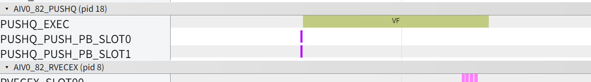
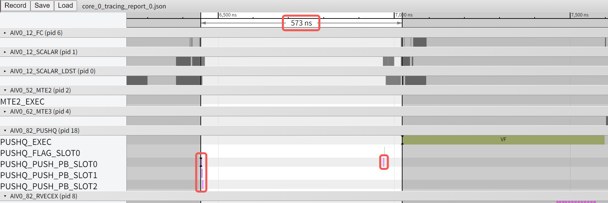
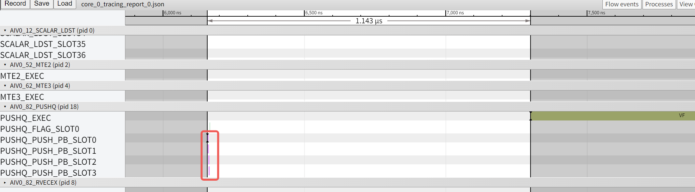
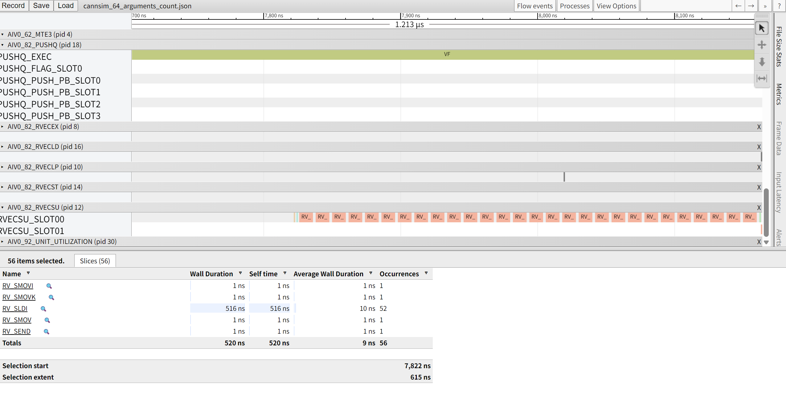
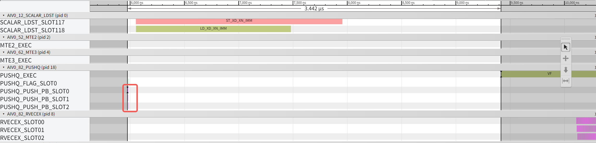

# SIMD VF 编程约束

本文整理 SIMD VF 的常见编程约束。Ascend950 上存在 SIMD VF 和 SIMT VF 两类形态；本文只讨论 SIMD VF。各章节按约束性质给出判断规则、推荐路径、风险写法和反例，并提供可运行样例或注释保留的反例符号。

## SIMD VF 函数定义与调用

SIMD VF 通过 `__simd_vf__` 定义，由 `asc_vf_call` 启动。SIMD VF 入口函数的参数、函数形态和调用方式会影响编译合法性，也会影响 SIMD VF 启动前的 Scalar 侧开销。

### 入参类型约束 【功能】

SIMD VF 入参只支持基本算术类型和 `__ubuf__` 修饰的基本类型指针。复杂类型、非 UB 指针或隐式对象状态不属于 SIMD VF 参数接口。

**支持的写法：**

| 描述 | 示例 | 原理 |
|---|---|---|
| 传入 C/C++ 基本算术类型 | `float scale`, `uint32_t n` | 基本 scalar 可通过 Parameter Buffer 传入 SIMD VF |
| 传入 UB 上的基本类型指针 | `__ubuf__ T* x` | SIMD VF RegAPI 访问 UB 地址 |
| 传入只读 UB 指针 | `const __ubuf__ T* x` | 只读 UB 数据可作为 SIMD VF 输入 |
| 传入 API 支持的窄精度类型 UB 指针 | `__ubuf__ fp8_e5m2_t* x` | 指针仍指向 UB 上的基本数据类型 |

**不支持的写法：**

| 描述 | 示例 | 原因 |
|---|---|---|
| 数组传参 | `VF(float a[4])` | 本质是 Scalar 栈上指针，不满足参数限制 |
| 引用传参 | `VF(x, float& s)` | 引用会按指针语义处理，不满足参数限制 |
| 非 UB 指针 | `float* x`, `__gm__ float* x` | SIMD VF 入口指针参数必须显式指向 UB |
| 函数指针或函数对象 | `VF(fn, x)` | SIMD VF 参数接口不支持函数对象 |
| 结构体传值 | `VF(x, params)` | SIMD VF 参数接口不支持结构体传值，属于未定义行为 |

#### 正例

SIMD VF 入口显式接收 UB 地址和必要的 scalar 参数。

```cpp
template <typename T>
__simd_vf__ inline void SingleOpVF(__ubuf__ T* xUbAddr, __ubuf__ T* yUbAddr,
    T scalar, uint32_t elemNum, uint16_t vfLoopNum)
{
    // use xUbAddr, yUbAddr and scalar in SIMD VF
}
```

示例源码：`src/args.asc::SingleOpVF`

#### 反例

**不允许：** 引用、普通指针、GM 指针、数组、函数指针都不作为 SIMD VF 参数使用。

```cpp
__simd_vf__ inline void InvalidRefArg(__ubuf__ float* x, float& scale) {}
__simd_vf__ inline void InvalidPlainPtr(float* x) {}
__simd_vf__ inline void InvalidGmPtr(__gm__ float* x) {}
__simd_vf__ inline void InvalidArrayArg(float coeff[4], __ubuf__ float* y) {}
```

示例源码：`src/args.asc::InvalidRefArg`, `src/args.asc::InvalidPlainPtr`, `src/args.asc::InvalidGmPtr`, `src/args.asc::InvalidArrayArg`, `src/args.asc::InvalidFunctionPtr`, `src/args.asc::InvalidStructValue`

#### 编译运行

```bash
cmake --build build --target simd_vf_constraints_args -j
./build/Samples/1_Features/hardware_features/simd_vf_constraints/simd_vf_constraints_args
```

### 入参数量约束 【性能】

SIMD VF 功能上不限制入参数量，但参数会从 Scalar 单元传递到 Vector 单元的 Parameter Buffer。参数过多会增加 `PUSH_PB` 操作，并可能造成 Scalar/地址寄存器溢出。

**推荐的写法：**

| 描述 | 示例 | 原理 |
|---|---|---|
| 只传 SIMD VF 必需参数 | `asc_vf_call<VF>(x, y, scale, n, loop)` | 参数越少，Scalar 到 Vector 的传参开销越低 |
| 在 SIMD VF 外合并可推导参数 | `scale = f(a, b); VF(..., scale)` | 减少 Parameter Buffer 写入次数 |
| 把常量写成模板参数 | `VF<T, Mode>` | 编译期常量不需要作为运行时参数传入 |

**不推荐的写法：**

| 描述 | 示例 | 理由 |
|---|---|---|
| 重复传入可合并的入参 | `VF(..., a, b, a+b, a*b)` | 增加参数传递压力，可能导致多次 `PUSH_PB` 头开销 |
| 传入超多入参（如超过16个B32类型） | `VF(..., p0, p1, ..., p63)` | 增加参数传递压力，可能导致多次 `PUSH_PB` 头开销，且可能导致 SIMD VF 内标量寄存器溢出 |

#### 正例

额外传入 8 个 `float` 参数，启动 SIMD VF 前只有少量 `PUSH_PB`。

```cpp
__simd_vf__ inline void ManyFloatArgs008VF(__ubuf__ float* xUbAddr, __ubuf__ float* yUbAddr,
    float p000, float p001, float p002, float p003,
    float p004, float p005, float p006, float p007,
    uint32_t elemNum, uint16_t vfLoopNum)
{
    // use p000 ... p007
}
```

示例源码：`src/args_count.asc::ManyFloatArgs008VF`



#### 反例

**不推荐：** 传入 32 个及以上 `float` 参数。功能可以运行，但 `PUSH_PB` 数量增加，SIMD VF 启动延迟变大。

```cpp
__simd_vf__ inline void ManyFloatArgs032VF(__ubuf__ float* xUbAddr, __ubuf__ float* yUbAddr,
    float p000, float p001, /* ... */, float p030, float p031,
    uint32_t elemNum, uint16_t vfLoopNum)
{
    // use p000 ... p031
}
```

示例源码：`src/args_count.asc::ManyFloatArgs032VF`，流水图：

`PUSH_PB` 指令会发生多次，并增加启动 SIMD VF 前的延迟。


**不推荐：** 传入 64 个、128 个或 256 个 `float` 参数。此类写法会进一步放大 SIMD VF 启动延迟，并可能由于寄存器溢出导致 `RVECSU` 泳道（Vec 单元内 Aux Scalar 流水）产生大量 `LD/ST` 指令。

示例源码：`src/args_count.asc::ManyFloatArgs064VF`，流水图：



SIMD VF 内标量寄存器溢出导致的大量 `SLDI` 指令：



示例源码：`src/args_count.asc::ManyFloatArgs128VF`, `src/args_count.asc::ManyFloatArgs256VF`，流水图：



#### 编译运行

```bash
cmake --build build --target simd_vf_constraints_args_count -j
./build/Samples/1_Features/hardware_features/simd_vf_constraints/simd_vf_constraints_args_count
```

### asc_vf_call 调用约束 【功能】

`asc_vf_call<funcName>(args...)` 的模板参数必须是 SIMD VF 入口函数。把 SIMD VF 定义为 `__simd_vf__` 修饰的 `void` 返回值函数，并通过参数显式传入所有运行时依赖。`__simd_vf__` 函数内部可以调用 `__simd_callee__` 子函数，`__simd_callee__` 会被内联进 SIMD VF 代码；`__simd_callee__` 子函数之间也可以继续调用。

**支持的写法：**

| 描述 | 示例 | 原理 |
|---|---|---|
| `__simd_vf__` 函数作为入口 | `asc_vf_call<PlainVF>(args...)` | `funcName` 指向完整 SIMD VF 入口 |
| 显式实例化函数模板 | `asc_vf_call<TemplateVF<float, 2>>(args...)` | 模板参数在编译期确定 |
| 运行时依赖全部显式传参 | `VF(x, y, scale, n, loop)` | 避免 SIMD VF 隐式访问 Main Scalar 状态 |
| SIMD VF 内调用 `__simd_callee__` 子函数 | `VfEntry(...){ CalleeA(...); }` | callee 被内联进 SIMD VF 代码 |
| `__simd_callee__` 调用另一个 `__simd_callee__` | `CalleeA(...){ CalleeB(...); }` | callee 调用链仍属于 SIMD VF 内部代码 |

**不支持的写法：**

| 描述 | 示例 | 原因 |
|---|---|---|
| `__simd_callee__` 作为入口 | `asc_vf_call<Callee>(...)` | callee 只能在 SIMD VF 内部调用 |
| SIMD VF 内调用非 `__simd_callee__` 子函数 | `VfEntry(...){ OtherVf(...); }` | SIMD VF 内部子函数必须用 `__simd_callee__` 修饰 |
| `__simd_callee__` 递归调用自身 | `CalleeA(...){ CalleeA(...); }` | 递归无法按 SIMD VF 内联调用链展开 |
| 未实例化模板名 | `asc_vf_call<TemplateVF>(...)` | 编译器无法确定具体函数实体 |
| 非静态成员函数或访问成员状态 | `asc_vf_call<Obj::MemberVF>(...)` | 存在隐式对象状态，不符合 SIMD VF 调用约束 |

#### 正例

普通 SIMD VF 函数和显式实例化的 SIMD VF 模板都可以作为入口。SIMD VF 内部的辅助逻辑使用 `__simd_callee__` 定义；callee 可以被 SIMD VF 入口调用，也可以继续调用其他 callee。

```cpp
asc_vf_call<PlainVF>(xUbAddr, yUbAddr, scalar, elemNum, vfLoopNum);
asc_vf_call<TemplateVF<float, 2>>(xUbAddr, yUbAddr, scalar, elemNum, vfLoopNum);

__simd_callee__ inline void CalleeB(__ubuf__ float* xUbAddr, __ubuf__ float* yUbAddr) { ... }

__simd_callee__ inline void CalleeA(__ubuf__ float* xUbAddr, __ubuf__ float* yUbAddr)
{
    CalleeB(xUbAddr, yUbAddr);
}

__simd_vf__ inline void EntryVF(__ubuf__ float* xUbAddr, __ubuf__ float* yUbAddr,
    float scalar, uint32_t elemNum, uint16_t vfLoopNum)
{
    CalleeA(xUbAddr, yUbAddr);
}
```

示例源码：`src/asc_vf_call.asc::PlainVF`, `src/asc_vf_call.asc::TemplateVF`, `src/args.asc::ForwardScalarCallee`, `src/args.asc::IdentityScalarCallee`

#### 反例

**不允许：** 未使用 `__simd_vf__` 修饰的函数、使用 `__simd_callee__` 修饰的函数、未实例化模板不能作为 SIMD VF 入口。

```cpp
asc_vf_call<NotSimdVf>(xUbAddr, yUbAddr, scalar, elemNum, vfLoopNum);
asc_vf_call<SimdCalleeOnly>(xUbAddr, yUbAddr, scalar, elemNum, vfLoopNum);
asc_vf_call<TemplateVF>(xUbAddr, yUbAddr, scalar, elemNum, vfLoopNum);
```

示例源码：`src/asc_vf_call.asc::SimdCalleeOnly`

**不允许：** SIMD VF 内不要调用除 `__simd_callee__` 以外的子函数，例如不要从 `__simd_vf__` 调用另一个 `__simd_vf__` 或 `__aicore__` 函数；`__simd_callee__` 也不要递归调用自身。

```cpp
__simd_vf__ inline void OtherVF(__ubuf__ float* xUbAddr, __ubuf__ float* yUbAddr,
    float scalar, uint32_t elemNum, uint16_t vfLoopNum) { ... }

__aicore__ inline void AicoreHelper(__ubuf__ float* xUbAddr, __ubuf__ float* yUbAddr) { ... }

__simd_callee__ inline void RecursiveCallee(__ubuf__ float* xUbAddr, __ubuf__ float* yUbAddr)
{
    RecursiveCallee(xUbAddr, yUbAddr);
}

__simd_vf__ inline void InvalidNestedCallVF(__ubuf__ float* xUbAddr, __ubuf__ float* yUbAddr,
    float scalar, uint32_t elemNum, uint16_t vfLoopNum)
{
    OtherVF(xUbAddr, yUbAddr, scalar, elemNum, vfLoopNum);
    AicoreHelper(xUbAddr, yUbAddr);
}
```

示例源码：`src/args.asc::InvalidCallSimdVf`, `src/args.asc::InvalidCallAicore`, `src/args.asc::InvalidRecursiveCallee`

**不允许：** 不要把访问对象成员或静态成员状态的成员函数作为 SIMD VF 入口。

```cpp
asc_vf_call<InvalidVfHolder::StaticMemberStateVF>(xUbAddr, yUbAddr, scalar, elemNum, vfLoopNum);
```

示例源码：`src/asc_vf_call.asc::InvalidVfHolder`

#### 编译运行

```bash
cmake --build build --target simd_vf_constraints_asc_vf_call -j
./build/Samples/1_Features/hardware_features/simd_vf_constraints/simd_vf_constraints_asc_vf_call
```

## SIMD VF 硬件循环（Hardware Loop）

Hardware Loop 是 SIMD VF 的关键循环优化形态。符合规范的 `for` 循环可生成硬循环；不符合规范时，循环可能退化为由标量跳转和条件判断构成的 Software Loop。

### 标准硬循环（Hardware Loop）规范 【功能&性能】

标准硬循环应使用固定、简单、可识别的循环形态。单层主循环建议写成 `uint16_t i = 0; i < vfLoopNum; ++i`：循环变量类型固定，起始值固定为 0，步长固定为 1，循环边界由 SIMD VF 外计算后传入。循环体内尽量保持直线向量数据流；元素级别的条件用 `Reg::Compares + Reg::Select` 转为数据流表达，尾块通过 `MaskReg` 处理，多层循环嵌套不超过 4 层。推荐按如下模板编写主循环：

```cpp
// vfLoopNum 和 elemNum 在 SIMD VF 外按数据量计算好后传入。
// 循环变量使用 uint16_t，起始值固定为 0，步长固定为 1。
constexpr uint32_t VL_T = AscendC::VECTOR_REG_WIDTH / sizeof(T);
for (uint16_t i = 0; i < vfLoopNum; ++i) {
    // 尾块通过 MaskReg 处理，避免在循环体内写运行期 if。
    // UpdateMask 会按 RegTensor 宽度递减本地 elemNum。
    mask = AscendC::Reg::UpdateMask<T>(elemNum);
    // 地址使用简单线性表达式：base + i * vectorLength。
    AscendC::Reg::LoadAlign(xReg, xUbAddr + i * VL_T);
    // 循环体保持直线向量数据流；元素级条件用 Compares + Select。
    // ...
    AscendC::Reg::StoreAlign(yUbAddr + i * VL_T, yReg, mask);
}
```

#### 标准 Hardware Loop 要素

读一段 SIMD VF 循环时，先确认它是否满足硬循环生成所需的结构要素。满足这些要素时，循环更容易保持为硬件循环，控制流和尾块处理也更稳定。

| 判断项 | 推荐写法 | 说明 | 示例源码 |
|---|---|---|---|
| 循环变量类型 | `uint16_t i` | SIMD VF 硬循环候选优先使用固定宽度的 16 位循环变量 | `src/hwloop.asc::GoodStandardVF` |
| 起始值、步长、边界 | `i = 0`, `++i`, `i < vfLoopNum` | 循环头保持固定、简单、可识别的模式 | `src/hwloop.asc::GoodStandardVF` |
| 嵌套层数 | 不超过 4 层 `for` | 每层循环都能对应硬循环结构，避免外层退化 | `src/hwloop.asc::GoodNested4ImmediateVF` |
| 尾块 Mask | `UpdateMask(elemNum)` | 主循环内按剩余元素生成有效元素遮罩，`UpdateMask` 会递减本地 `elemNum` | `src/hwloop.asc::TailUpdateMaskVF` |
| 尾块独立处理 | `for (uint16_t i = 0; i < hasTail; ++i)` | 把能装满数次 RegTensor 的整块和剩下的尾块分开处理，用最多一轮的短循环替代 `if (hasTail)` | `src/hwloop.asc::TailForOneVF` |
| 编译期分支 | `if constexpr (NeedExtra)` | 分支在编译期消除，不进入 SIMD VF 运行期控制流 | `src/hwloop.asc::GoodIfConstexprVF` |
| 元素级条件 | `Compares + Select` | 把元素条件表达为向量数据流，而不是循环体控制流 | `src/hwloop.asc::GoodCompareSelectVF` |

#### 容易退化为 Software Loop 的写法

下面这些写法并不一定功能不支持；多数样例保留为可运行反例，用来说明硬循环生成质量下降的风险。核心判断是：运行期控制流、非标准循环头或过深嵌套进入 SIMD VF 循环后，编译器可能改用标量跳转和 Aux Scalar 指令维持语义。

| 判断项 | 风险写法 | 影响 | 示例源码 |
|---|---|---|---|
| 非标准循环头 | `uint32_t i`、非 0 起始、非 1 步长、运行期起始值或步长 | 依赖编译器重写循环头；失败时可能退化为 Software Loop 或引入额外 Aux Scalar | `src/hwloop.asc::BadU32IterVF`, `src/hwloop.asc::BadNonzeroStartVF`, `src/hwloop.asc::BadStepTwoVF`, `src/hwloop.asc::BadRuntimeStartVF`, `src/hwloop.asc::BadRuntimeStrideVF` |
| 运行期分支或三元表达式 | `if (scalar >= 0)`、`if (i == specialLoop)`、`cond ? a : b` | 控制流进入循环体，容易打断直线向量数据流 | `src/hwloop.asc::BadRuntimeIfVF`, `src/hwloop.asc::BadLoopIndexDataIfVF`, `src/hwloop.asc::ExtremeIfLoopIndexVF`, `src/hwloop.asc::BadTernaryVF` |
| `continue` | `if (skip) continue;` | 循环体出现跳转，容易产生大量 Aux Scalar 控制流指令 | `src/hwloop.asc::BadContinueVF` |
| `while` 循环 | `while (i < vfLoopNum)` | 循环形态不如标准 `for` 稳定，可能难以生成硬循环 | `src/hwloop.asc::ExtremeWhileVF` |
| 尾块 `if` | `if (hasTail != 0) { ... }` | VLOOP 后引入运行期控制流；优先改成 Mask 或短 `for` | `src/hwloop.asc::TailRuntimeIfVF` |
| 超过 4 层嵌套 | 5 层 `for` | 外层嵌套可能退化为 Software Loop，并带来 Aux Scalar 控制流开销 | `src/hwloop.asc::Nested5RuntimeImmediateVF` |

#### 不允许的写法

| 写法 | 示例 | 结果 | 示例源码 |
|---|---|---|---|
| 循环内 `break` | `if (cond) break;` | 编译失败 | `src/hwloop.asc::ExtremeBreakVF` |
| 循环内修改边界 | `bound = nextBound;` | 未定义行为 | `src/hwloop.asc::ExtremeMutableBoundVF` |
| 循环内修改步长 | `step = nextStep;` | 未定义行为 | `src/hwloop.asc::ExtremeMutableStepVF` |

#### 示例说明

推荐模式是标准循环头、线性地址和 Mask 尾块处理组合在一起。

```cpp
for (uint16_t i = 0; i < vfLoopNum; ++i) {
    mask = AscendC::Reg::UpdateMask<float>(elemNum);
    AscendC::Reg::LoadAlign(xReg, xUbAddr + i * VL_B32);
    AscendC::Reg::StoreAlign(yUbAddr + i * VL_B32, yReg, mask);
}
```

如果尾块在主循环外用 `if` 或 `for (1)` 单独处理，需要先处理能装满数次 RegTensor 的整块，再用 tail 元素数生成最后一轮 mask。

运行期控制流是常见退化点。能表达成向量数据流的元素级条件，应改用 `Compares + Select`；尾块应优先用 Mask 或短 `for`。

```cpp
if ((i & 1) == 0) {
    AscendC::Reg::Adds(yReg, yReg, 1.0f, mask);
}

if (skip) {
    continue;
}
```

非标准循环头可能退化为 Software Loop，或引入额外 Aux Scalar 计算。

```cpp
for (uint32_t i = 0; i < vfLoopNum; ++i) { ... }
for (uint16_t i = start; i < vfLoopNum; ++i) { ... }
for (uint16_t i = 0; i < vfLoopNum; i += stride) { ... }
```

循环边界和步长必须在循环外稳定，不要在循环体内修改。

```cpp
for (uint16_t i = 0; i < bound; ++i) {
    bound = nextBound;
}
```

#### 编译运行

```bash
cmake --build build --target simd_vf_constraints_hwloop -j
./build/Samples/1_Features/hardware_features/simd_vf_constraints/simd_vf_constraints_hwloop
```

## SIMD VF LocalMemBar 约束

Ascend950 AIV 的 Vector 单元支持乱序发射，SIMD VF 内部指令的发射顺序不保证与程序编写顺序一致。不同类型的指令属于不同 Vector 单元内流水线，如 `StoreAlign` 走 `VEC_STORE`，`LoadAlign` 走 `VEC_LOAD`，计算指令走 `VECEX`。

`LocalMemBar<src, dst>()` 用于约束流水顺序。`src` 表示被等待的流水，`dst` 表示等待方流水。

### 需要插入 LocalMemBar 的场景 【功能】

判断原则：这里的“读”和“写”针对的是 UB 上的地址。只要两个 SIMD VF 内存操作访问同一 UB 地址，且后一个 UB 访问必须在前一个 UB 访问之后发生，就需要按真实流水方向插入 `LocalMemBar<src, dst>()`。这既包括同一循环轮次内的依赖，也包括跨循环轮次的依赖；跨轮次依赖不限定为相邻轮次，只要后续轮次依赖前序轮次的 UB 访问结果，就需要考虑保序。

| 场景 | 写法 | 说明 |
|---|---|---|
| UB 写后读 | `Store(addr, a); LocalMemBar<VEC_STORE, VEC_LOAD>(); Load(b, addr)` | 后续 Load 必须读取前序 Store 的结果 |
| UB 读后写 | `Load(a, addr); LocalMemBar<VEC_LOAD, VEC_STORE>(); Store(addr, b)` | 前序 Load 必须先读取旧值，后续 Store 才能覆盖该地址；同名寄存器保序场景除外 |
| UB 写后写 | `Store(addr, a); LocalMemBar<VEC_STORE, VEC_STORE>(); Store(addr, b)` | 两次 Store 的生效顺序影响最终 UB 内容 |
| 跨循环轮次同 UB 地址依赖 | `前序轮次访问 addr; 后续轮次 LocalMemBar; 访问 addr` | 按真实依赖方向选择 `src` 和 `dst`；可保证正确性，但会限制循环展开和并行发射，应优先调整算法消除跨轮次依赖 |

#### 正例

同一轮次内存在 UB 写后读依赖时，显式插入 `LocalMemBar<VEC_STORE, VEC_LOAD>()`。

```cpp
AscendC::Reg::StoreAlign(tmpUbAddr + i * VL_B32, storeReg, mask);
AscendC::Reg::LocalMemBar<AscendC::Reg::MemType::VEC_STORE,
    AscendC::Reg::MemType::VEC_LOAD>();
AscendC::Reg::LoadAlign(loadReg, tmpUbAddr + i * VL_B32);
```

示例源码：`src/membar.asc::DiffRegWithMemBarVF`

跨循环轮次通过 UB 传递数据时，也需要 `LocalMemBar` 保证后续轮次读取到前序轮次写入的结果。下面示例用相邻轮次展示，规则不限定为相邻轮次。

```cpp
for (uint16_t i = 0; i < vfLoopNum; ++i) {
    AscendC::Reg::LocalMemBar<AscendC::Reg::MemType::VEC_STORE,
        AscendC::Reg::MemType::VEC_LOAD>();
    AscendC::Reg::LoadAlign(prevReg, tmpUbAddr);
    // ...
    AscendC::Reg::StoreAlign(tmpUbAddr, tmpReg, mask);
}
```

示例源码：`src/membar.asc::InterIterWithMemBarVF`

#### 反例

**不允许：** UB 写后读依赖不插入 `LocalMemBar`，后续 Load 可能早于前序 Store 生效。

```cpp
AscendC::Reg::StoreAlign(tmpUbAddr + i * VL_B32, storeReg, mask);
AscendC::Reg::LoadAlign(loadReg, tmpUbAddr + i * VL_B32);
```

示例源码：`src/membar.asc::DiffRegNoMemBarVF`

**不允许：** 跨循环轮次存在写后读依赖但不插入 `LocalMemBar`。

```cpp
for (uint16_t i = 0; i < vfLoopNum; ++i) {
    AscendC::Reg::LoadAlign(prevReg, tmpUbAddr);
    // ...
    AscendC::Reg::StoreAlign(tmpUbAddr, tmpReg, mask);
}
```

示例源码：`src/membar.asc::InterIterNoMemBarVF`

### 不需要插入 LocalMemBar 的场景 【性能】

如果两个操作之间没有同一 UB 地址上的先后依赖，或 UB 读后写顺序已经能由同名寄存器保序推出，通常不需要插入 `LocalMemBar`。此时额外 barrier 不提升正确性，只会增加同步开销或降低流水并行度。

| 场景 | 写法 | 原理 |
|---|---|---|
| 无同 UB 地址前后依赖 | `Load(aAddr); Store(bAddr)` | 访问不同 UB 地址，或后续访问不依赖前序访问结果 |
| 无依赖路径插入 barrier | `Load(aAddr); LocalMemBar; Store(bAddr)` | 不提升正确性，只增加同步开销并降低流水并行度 |
| 同名寄存器 + UB 读后写 | `Load(r, addr); ...; Store(addr, r)` | Store 读取的寄存器正是前序 Load 写入的寄存器，寄存器名依赖可保序 |

#### 正例

同名寄存器的 UB 读后写可依赖寄存器保序。这里的读后写指先 `Load` 读取 UB 地址，再 `Store` 写回同一 UB 地址。

```cpp
AscendC::Reg::LoadAlign(workReg, xUbAddr + i * VL_B32);
// ...
AscendC::Reg::StoreAlign(xUbAddr + i * VL_B32, workReg, mask);
```

示例源码：`src/membar.asc::SameRegNoMemBarVF`

#### 编译运行

```bash
cmake --build build --target simd_vf_constraints_membar -j
./build/Samples/1_Features/hardware_features/simd_vf_constraints/simd_vf_constraints_membar
```

## SIMD VF 硬件资源约束

SIMD VF 代码最终会映射到硬件寄存器、Aux Scalar、地址生成和 UB 数据访问资源。资源不足时可能导致性能下降、硬循环退化或编译失败。

### 寄存器资源限制 【功能&性能】

常用寄存器有明确资源上限。开发者应减少长生命周期寄存器，避免超过编译器可复用范围。

**推荐的写法：**

| 资源 | 推荐写法 | 原理 |
|---|---|---|
| `UnalignRegForLoad` | 同时不超过 4 个 | Load 类资源上限为 4 |
| `UnalignRegForStore` | 同时不超过 4 个 | Store 类资源上限为 4 |
| Load/Store UnalignReg 混用 | Load 4 个 + Store 4 个 | 两类资源独立计算 |
| `RegTensor`, `MaskReg` | 缩短生命周期，及时复用 | 降低寄存器压力 |

**不推荐的写法：**

| 资源 | 示例 | 理由 |
|---|---|---|
| 大量 `RegTensor` 长时间存活 | `RegTensor r0, ..., r31` | 可能发生寄存器换入换出，影响性能 |
| 大量 `MaskReg` 长时间存活 | `MaskReg m0, ..., m7` | 可能发生寄存器换入换出，影响性能 |

**不允许的写法：**

| 资源 | 示例 | 理由 |
|---|---|---|
| 同类 Load UnalignReg 超过 4 个 | `UnalignRegForLoad u0...u4` | 编译失败 |
| 同类 Store UnalignReg 超过 4 个 | `UnalignRegForStore u0...u4` | 编译失败 |

#### 正例

```cpp
AscendC::Reg::UnalignRegForLoad u0, u1, u2, u3;
AscendC::Reg::LoadUnAlignPre<float>(u0, src0);
AscendC::Reg::LoadUnAlignPre<float>(u1, src1);
AscendC::Reg::LoadUnAlignPre<float>(u2, src2);
AscendC::Reg::LoadUnAlignPre<float>(u3, src3);
```

示例源码：`src/hwlimits_regs.asc::UnalignLoad4VF`

#### 反例

**不允许：** 同类 UnalignReg 超过 4 个。

```cpp
AscendC::Reg::UnalignRegForLoad u0, u1, u2, u3, u4;
AscendC::Reg::LoadUnAlignPre<float>(u4, src4);
```

示例源码：`src/hwlimits_regs.asc::UnalignLoad5VF`, `src/hwlimits_regs.asc::UnalignStore5VF`

#### 编译运行

```bash
cmake --build build --target simd_vf_constraints_hwlimits_regs -j
./build/Samples/1_Features/hardware_features/simd_vf_constraints/simd_vf_constraints_hwlimits_regs
```

### SIMD VF 内标量计算限制 【功能&性能】

SIMD VF 内 Aux Scalar 计算能力有限，且性能不如外部 Main Scalar。判断 scalar 表达式时，先看能否在 SIMD VF 外或循环外计算，再看数据类型，最后看它是否会破坏 Hardware Loop 或增加 Aux Scalar 开销。能在 SIMD VF 外计算的 scalar，应在 SIMD VF 外计算后传入。

| 表达式来源 | 能否外提 | 支持情况 | 建议 | 示例源码 |
|---|---|---|---|---|
| SIMD VF 外可计算的 scalar | 已在 SIMD VF 外计算 | 支持且推荐 | 在 Main Scalar 侧算好后作为 SIMD VF 参数传入 | `src/hwlimits_aux_scalar.asc::PrecomputedScalarVF` |
| SIMD VF 内只依赖入参或循环不变量的表达式 | 可被编译器外提 | 支持 | 不建议依赖编译器外提；手动外提后传入更清晰 | `src/hwlimits_aux_scalar.asc::HoistableScalarVF` |
| SIMD VF 循环内依赖 `i` 的 16/32 位整数 `+`、`-`、`*` 计算 | 无法外提 | 支持 | 仅在确有必要时使用；仍可能破坏 Hardware Loop，并增加 Aux Scalar 开销 | `src/hwlimits_aux_scalar.asc::IntegerLoopScalarVF` |
| SIMD VF 循环内依赖 `i` 的 16/32 位整数 `/`、`%` 计算 | 无法外提 | 不建议 | 不建议使用；依赖 Aux Scalar 软件模拟实现，性能较差且可能破坏 Hardware Loop | `src/hwlimits_aux_scalar.asc::IntegerLoopScalarVF` |
| SIMD VF 循环内依赖循环状态的浮点计算 | 无法外提 | 不支持 | 改成向量计算、查表或在 SIMD VF 外重构算法 | `src/hwlimits_aux_scalar.asc::InvalidLoopFloatExprVF` |
| 读 UB 标量后继续做浮点 scalar 计算 | 无法外提 | 不支持 | 不要把 UB 数据读成 SIMD VF 内浮点 scalar 再参与表达式 | `src/hwlimits_aux_scalar.asc::InvalidUbFloatExprVF` |

#### 正例

推荐路径是在 SIMD VF 外计算 scalar，再通过 Parameter Buffer 传给 SIMD VF。

```cpp
uint32_t scale = ((a + b) * 2U) / 4U;
asc_vf_call<MyVF>(xUbAddr, yUbAddr, elemNum, vfLoopNum, scale);
```

#### 反例

**不推荐：** 可外提表达式写在 SIMD VF 内通常也能编译，但代码读者需要判断它是否真的被外提，建议手动移出 SIMD VF。

```cpp
for (uint16_t i = 0; i < vfLoopNum; ++i) {
    uint32_t offset = ((a + b) * 2U) / 4U;
    AscendC::Reg::Adds(yReg, xReg, offset, mask);
}
```

**不推荐：** 无法外提的整数计算，依赖 Aux Scalar 实现，性能较差且可能退化为 Software Loop。

```cpp
uint32_t scalar = ((static_cast<uint32_t>(i) + a) * b) / divisor;
```

**不允许**：无法外提的浮点 scalar 计算。

```cpp
float scalar = (static_cast<float>(i) + a - b) * b / divisor;
float scalar2 = xUbAddr[0] + static_cast<float>(elemNum) / divisor;
```

#### 编译运行

```bash
cmake --build build --target simd_vf_constraints_hwlimits_aux_scalar -j
./build/Samples/1_Features/hardware_features/simd_vf_constraints/simd_vf_constraints_hwlimits_aux_scalar
```

### SIMD VF 内地址计算限制 【功能&性能】

地址计算与普通非地址标量计算在算术能力上基本一致：仅支持 16/32 位**整数**的计算，不支持浮点数。但地址表达式还会进入地址生成路径，因此判断重点不是单纯“能不能编译”，而是表达式形态是否容易生成稳定的地址逻辑和硬循环。

| 地址表达式类型 | 支持情况 | 建议 | 示例源码 |
|---|---|---|---|
| 简单线性表达式 | 支持且推荐 | 优先写成 `base + i * VL` 或同等简单线性形式，便于生成地址寄存器逻辑 | `src/hwlimits_addr_expr.asc::AddrExprVF`, `src/hwlimits_addr_expr.asc::CalcAddrOffset` |
| 16/32 位整数 `+`、`-`、`*` 地址计算 | 支持 | 优先使用简单线性推进，或能清晰表达线性关系的整数表达式 | `src/hwlimits_addr_expr.asc::CalcAddrOffset` |
| 16/32 位整数 `/`、`%` 地址计算 | 不建议 | 依赖 Aux Scalar 软件模拟实现；优先在 SIMD VF 外预计算或重构为线性地址 | `src/hwlimits_addr_expr.asc::CalcAddrOffset` |
| 显式 `AddrReg` | 不建议 | 一般不如直接地址表达式清晰，也不利于编译器做全局优化；只在确有必要时使用 | `src/hwlimits_addr_expr.asc::AddrExprVF` |
| 浮点 offset | 不支持 | 不要让浮点数参与地址偏移计算；应改成整数 offset 或在 SIMD VF 外重构 | `src/hwlimits_addr_expr.asc::InvalidFloatAddrOffsetVF` |

#### 正例

**推荐：** 直接写简单线性地址表达式。

```cpp
uint32_t offset = static_cast<uint32_t>(i) * VL_B32;
AscendC::Reg::LoadAlign(xReg, xUbAddr + offset);
AscendC::Reg::StoreAlign(yUbAddr + offset, xReg, mask);
```

#### 反例

**不推荐：** 复杂但可规约的表达式功能可用，但可读性差，也让读者和编译器都必须重新推导它等价于线性地址。

```cpp
uint32_t offset = (((i + 1U) * VL_B32 * 2U) / 2U) - VL_B32;
```

**不推荐：** 涉及 `%`、`/` 的整数地址计算表达式，无法优化为地址寄存器逻辑，且依赖 Aux Scalar 模拟实现，性能差。

```cpp
uint32_t modOffset = static_cast<uint32_t>(i % 5U) * VL_B32;
uint32_t divOffset = static_cast<uint32_t>(i / 5U) * VL_B32;
```

**不推荐：** 显式 `AddrReg` 也可用，但通常不如直接地址表达式便于阅读和优化。

```cpp
AscendC::Reg::AddrReg aReg = AscendC::Reg::CreateAddrReg<float>(i, VL_B32);
AscendC::Reg::LoadAlign(xReg, xUbAddr, aReg);
```

**不允许：** 浮点数参与地址 offset 计算。

```cpp
float offset = static_cast<float>(i) * static_cast<float>(VL_B32);
```

#### 编译运行

```bash
cmake --build build --target simd_vf_constraints_hwlimits_addr_expr -j
./build/Samples/1_Features/hardware_features/simd_vf_constraints/simd_vf_constraints_hwlimits_addr_expr
```

### SIMD VF 内数据访问限制 【功能】

SIMD VF 内 RegAPI 访问 UB 地址，不直接访问 GM。Main Scalar 的值需要通过参数显式传入，不能通过成员变量或捕获状态隐式访问。

**支持的写法：**

| 描述 | 示例 | 原理 |
|---|---|---|
| GM 先搬到 LocalTensor/UB | `ElemwiseCopyIn(local, gm, n)` | SIMD VF RegAPI 访问 UB，不直接访问 GM |
| 将 UB 地址显式传入 SIMD VF | `VF((__ubuf__ T*)local.GetPhyAddr())` | SIMD VF 通过参数获得 UB 地址 |
| Main Scalar 值通过参数传入 | `VF(x, y, scalar)` | 避免隐式访问 Main Scalar 栈 |

**不支持的写法：**

| 描述 | 示例 | 理由 |
|---|---|---|
| SIMD VF 内直接访问 GM | `__gm__ T* xGm` | SIMD VF 无法直接访问 GM |
| SIMD VF 内访问 Main Scalar 栈变量或成员变量 | `this->scalar`, `captured` | 未定义行为 |

#### 正例

```cpp
auto* xUbAddr = reinterpret_cast<__ubuf__ float*>(xLocal.GetPhyAddr());
auto* yUbAddr = reinterpret_cast<__ubuf__ float*>(yLocal.GetPhyAddr());
asc_vf_call<DataAccessVF>(xUbAddr, yUbAddr, scalar, elemNum, vfLoopNum);
```

示例源码：`src/hwlimits_data_access.asc::DataAccessVF`

#### 反例

**不允许：** SIMD VF 内直接访问 GM。

```cpp
__simd_vf__ inline void InvalidGmAccessVF(__gm__ float* xGm, __ubuf__ float* yUbAddr) {}
```

示例源码：`src/hwlimits_data_access.asc::InvalidGmAccessVF`

**不允许：** 通过成员变量等隐式状态访问 Main Scalar 栈数据。

```cpp
struct InvalidVfHolder {
    __ubuf__ float* xUbAddr;
    __simd_vf__ inline void MemberVF(uint32_t elemNum, uint16_t vfLoopNum) { ... }
};
```

示例源码：`src/hwlimits_data_access.asc::InvalidVfHolder`, `src/hwlimits_data_access.asc::InvalidMainScalarStackAccessVF`

#### 编译运行

```bash
cmake --build build --target simd_vf_constraints_hwlimits_data_access -j
./build/Samples/1_Features/hardware_features/simd_vf_constraints/simd_vf_constraints_hwlimits_data_access
```
