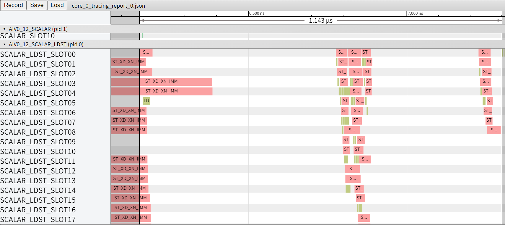

# VF编程约束

本文整理 SIMD VF 的常见编程约束。每类约束按“支持的写法、不推荐的写法、不支持的写法”说明，并给出可运行样例或注释保留的反例符号。

## VF 函数定义与调用

SIMD VF 通过 `__simd_vf__` 定义，由 `asc_vf_call` 启动。VF 入口函数的参数、函数形态和调用方式会影响编译合法性，也会影响 VF 启动前的 Scalar 侧开销。

### 入参类型约束 【功能】

VF 入参只支持基本算术类型和 `__ubuf__` 修饰的基本类型指针。复杂类型、非 UB 指针或隐式对象状态不属于 VF 参数接口。

支持的写法：

| 描述 | 示例 | 原理 |
|---|---|---|
| 传入 C/C++ 基本算术类型 | `float scale`, `uint32_t n` | 基本 scalar 可通过 Parameter Buffer 传入 VF |
| 传入 UB 上的基本类型指针 | `__ubuf__ T* x` | VF RegAPI 访问 UB 地址 |
| 传入只读 UB 指针 | `const __ubuf__ T* x` | 只读 UB 数据可作为 VF 输入 |
| 传入 API 支持的窄精度类型 UB 指针 | `__ubuf__ fp8_e5m2_t* x` | 指针仍指向 UB 上的基本数据类型 |


不支持的写法：

| 描述 | 示例 | 原因 |
|---|---|---|
| 数组传参 | `VF(float a[4])` | 本质是 Scalar 栈上指针，不满足参数限制 |
| 引用传参 | `VF(x, float& s)` | 引用会按指针语义处理，不满足参数限制 |
| 非 UB 指针 | `float* x`, `__gm__ float* x` | VF 入口指针参数必须显式指向 UB |
| 函数指针或函数对象 | `VF(fn, x)` | VF 参数接口不支持函数对象 |
| 结构体传值 | `VF(x, params)` | VF 参数接口不支持结构体传值，属于未定义行为 |

#### 正例

VF 入口显式接收 UB 地址和必要的 scalar 参数。

```cpp
template <typename T>
__simd_vf__ inline void SingleOpVF(__ubuf__ T* xUbAddr, __ubuf__ T* yUbAddr,
    T scalar, uint32_t elemNum, uint16_t vfLoopNum)
{
    // use xUbAddr, yUbAddr and scalar in VF
}
```

示例源码：`src/args.asc::SingleOpVF`

#### 反例

**不允许**：引用、普通指针、GM 指针、数组、函数指针都不作为 VF 参数使用。

```cpp
__simd_vf__ inline void InvalidRefArg(__ubuf__ float* x, float& scale) {}
__simd_vf__ inline void InvalidPlainPtr(float* x) {}
__simd_vf__ inline void InvalidGmPtr(__gm__ float* x) {}
__simd_vf__ inline void InvalidArrayArg(float coeff[4], __ubuf__ float* y) {}
```

示例源码：`src/args.asc::InvalidRefArg`, `src/args.asc::InvalidPlainPtr`, `src/args.asc::InvalidGmPtr`, `src/args.asc::InvalidArrayArg`, `src/args.asc::InvalidFunctionPtr`, `src/args.asc::InvalidStructValue`

#### 编译运行

```bash
cmake --build build --target simd_vf_constraints_args -j
./build/Samples/1_Features/hardware_features/simd_vf_constraints/simd_vf_constraints_args
```

### 入参数量约束 【性能】

SIMD VF 功能上不限制入参数量，但参数会从 Scalar 单元传递到 Vector 单元的 Parameter Buffer。参数过多会增加 `PUSH_PB` 操作，并可能造成 Scalar/地址寄存器溢出。

推荐的写法：

| 描述 | 示例 | 原理 |
|---|---|---|
| 只传 VF 必需参数 | `asc_vf_call<VF>(x, y, scale, n, loop)` | 参数越少，Scalar 到 Vector 的传参开销越低 |
| 在 VF 外合并可推导参数 | `scale = f(a, b); VF(..., scale)` | 减少 Parameter Buffer 写入次数 |
| 把常量写成模板参数 | `VF<T, Mode>` | 编译期常量不需要作为运行时参数传入 |

不推荐的写法：

| 描述 | 示例 | 理由 |
|---|---|---|
| 重复传入可合并的入参 | `VF(..., a, b, a+b, a*b)` | 增加参数传递压力，可能导致多次 `PUSH_PB` 头开销 |
| 传入超多入参（如超过16个B32类型） | `VF(..., p0, p1, ..., p63)` | 增加参数传递压力，可能导致多次 `PUSH_PB` 头开销，且可能导致 VF 内标量寄存器溢出 |


#### 正例

额外传入 8 个 `float` 参数，启动 VF 前只有少量 `PUSH_PB`。

```cpp
__simd_vf__ inline void ManyFloatArgs008VF(__ubuf__ float* xUbAddr, __ubuf__ float* yUbAddr,
    float p000, float p001, float p002, float p003,
    float p004, float p005, float p006, float p007,
    uint32_t elemNum, uint16_t vfLoopNum)
{
    // use p000 ... p007
}
```

示例源码：`src/args_count.asc::ManyFloatArgs008VF`


#### 反例

**不推荐**：传入 32 个及以上 `float` 参数。功能可以运行，但 `PUSH_PB` 数量增加，VF 启动延迟变大。

```cpp
__simd_vf__ inline void ManyFloatArgs032VF(__ubuf__ float* xUbAddr, __ubuf__ float* yUbAddr,
    float p000, float p001, /* ... */, float p030, float p031,
    uint32_t elemNum, uint16_t vfLoopNum)
{
    // use p000 ... p031
}
```

示例源码：`src/args_count.asc::ManyFloatArgs032VF`


**不推荐**：传入 64 个、128 个或 256 个 `float` 参数。此类写法会进一步放大 VF 启动延迟，并可能引入 Scalar 侧 LD/ST。

示例源码：`src/args_count.asc::ManyFloatArgs064VF`




示例源码：`src/args_count.asc::ManyFloatArgs128VF`, `src/args_count.asc::ManyFloatArgs256VF`


#### 编译运行

```bash
cmake --build build --target simd_vf_constraints_args_count -j
./build/Samples/1_Features/hardware_features/simd_vf_constraints/simd_vf_constraints_args_count
```

### asc_vf_call 调用约束 【功能】

`asc_vf_call<funcPtr>(args...)` 的模板参数必须是 SIMD VF 入口函数。把 VF 定义为 `__simd_vf__` 修饰的 `void` 返回值函数，并通过参数显式传入所有运行时依赖。

支持的写法：

| 描述 | 示例 | 原理 |
|---|---|---|
| `__simd_vf__` 函数作为入口 | `asc_vf_call<PlainVF>(args...)` | `funcPtr` 指向完整 VF 入口 |
| 显式实例化函数模板 | `asc_vf_call<TemplateVF<float, 2>>(args...)` | 模板参数在编译期确定 |
| 运行时依赖全部显式传参 | `VF(x, y, scale, n, loop)` | 避免 VF 隐式访问 Main Scalar 状态 |

不支持的写法：

| 描述 | 示例 | 原因 |
|---|---|---|
| `__simd_callee__` 作为入口 | `asc_vf_call<Callee>(...)` | callee 只能在 VF 内部调用 |
| 未实例化模板名 | `asc_vf_call<TemplateVF>(...)` | 编译器无法确定具体函数实体 |
| 非静态成员函数或访问成员状态 | `asc_vf_call<Obj::MemberVF>(...)` | 存在隐式对象状态，不符合 VF 调用约束 |

#### 正例

普通 VF 函数和显式实例化的 VF 模板都可以作为入口。

```cpp
asc_vf_call<PlainVF>(xUbAddr, yUbAddr, scalar, elemNum, vfLoopNum);
asc_vf_call<TemplateVF<float, 2>>(xUbAddr, yUbAddr, scalar, elemNum, vfLoopNum);
```

示例源码：`src/asc_vf_call.asc::PlainVF`, `src/asc_vf_call.asc::TemplateVF`

#### 反例

**不允许**：未使用 `__simd_vf__` 修饰的函数、使用 `__simd_callee__` 修饰的函数、未实例化模板不能作为 VF 入口。

```cpp
asc_vf_call<NotSimdVf>(xUbAddr, yUbAddr, scalar, elemNum, vfLoopNum);
asc_vf_call<SimdCalleeOnly>(xUbAddr, yUbAddr, scalar, elemNum, vfLoopNum);
asc_vf_call<TemplateVF>(xUbAddr, yUbAddr, scalar, elemNum, vfLoopNum);
```

示例源码：`src/asc_vf_call.asc::SimdCalleeOnly`

**不允许**：不要把访问对象成员或静态成员状态的成员函数作为 VF 入口。

```cpp
asc_vf_call<InvalidVfHolder::StaticMemberStateVF>(xUbAddr, yUbAddr, scalar, elemNum, vfLoopNum);
```

示例源码：`src/asc_vf_call.asc::InvalidVfHolder`

#### 编译运行

```bash
cmake --build build --target simd_vf_constraints_asc_vf_call -j
./build/Samples/1_Features/hardware_features/simd_vf_constraints/simd_vf_constraints_asc_vf_call
```

## SIMD VF 硬件循环（Hardware Loop）

Hardware Loop 是 SIMD VF 的关键循环优化形态。符合规范的 `for` 循环可生成硬循环；不符合规范时，循环可能退化为由标量跳转和条件判断构成的 Software Loop。

### 标准硬循环（Hardware Loop）规范 【功能&性能】

标准硬循环应使用固定、简单、可识别的循环形态。单层主循环建议写成 `uint16_t i = 0; i < vfLoopNum; ++i`：循环变量类型固定，起始值固定为 0，步长固定为 1，循环边界由 VF 外计算后传入。循环体内尽量保持直线向量数据流；元素级别的条件用 `Reg::Compares + Reg::Select` 转为数据流表达，尾块通过 `MaskReg` 处理，多层循环嵌套不超过 4 层。推荐按如下模板编写主循环：

```cpp
// vfLoopNum 和 elemNum 在 VF 外按数据量计算好后传入。
// 循环变量使用 uint16_t，起始值固定为 0，步长固定为 1。
constexpr uint32_t VL_T = AscendC::VECTOR_REG_WIDTH / sizeof(T);
for (uint16_t i = 0; i < vfLoopNum; ++i) {
    // 尾块通过 MaskReg 处理，避免在循环体内写运行期 if。
    mask = AscendC::Reg::UpdateMask<T>(elemNum);
    // 地址使用简单线性表达式：base + i * vectorLength。
    AscendC::Reg::LoadAlign(xReg, xUbAddr + i * VL_T);
    // 循环体保持直线向量数据流；元素级条件用 Compares + Select。
    // ...
    AscendC::Reg::StoreAlign(yUbAddr + i * VL_T, yReg, mask);
}
```

支持的写法：

| 场景 | 推荐写法 | 原理 | 参考用例 |
|---|---|---|---|
| 标准单层主循环 | `for (uint16_t i = 0; i < vfLoopNum; ++i)` | 循环头简单稳定，便于生成硬循环指令 | `GoodStandardVF` |
| 循环头三要素 | `uint16_t i = 0`, `++i`, `i < vfLoopNum` | 起始值、步长和边界保持固定模式 | `GoodStandardVF` |
| 不超过 4 层嵌套 | `for a { for b { ... } }` | 每层循环对应硬循环结构 | `GoodNested4ImmediateVF` |
| 编译期分支 | `if constexpr (NeedExtra)` | 分支在编译期消除 | `GoodIfConstexprVF` |
| 元素级条件 | `Compares + Select` | 条件表达为向量数据流 | `GoodCompareSelectVF` |
| 主循环内处理尾块：用 Mask | `mask = UpdateMask(GetLoopMaskCount(elemNum, i))` | 每轮按剩余元素数生成有效元素遮罩，保持尾块处理在主硬循环内 | `TailUpdateMaskVF` |
| 主循环后处理尾块：用 `for(1)` 代替 `if` | `for (uint16_t i = 0; i < hasTail; ++i)` | 用短硬循环替代运行期 `if` | `TailForOneVF` |

不推荐的写法：

| 场景 | 示例 | 理由 | 参考用例 |
|---|---|---|---|
| 非 `uint16_t` 迭代变量 | `for (uint32_t i = 0; ...)` | 依赖编译器优化，可能退化为 Software Loop | `BadU32IterVF` |
| 非 0 起始或非 1 步长 | `i = start`, `i += stride` | 依赖编译器规约，可能引入额外标量计算 | `BadNonzeroStartVF`；`BadStepTwoVF` |
| 起始值或步长由参数传入 | `for (i = start; ...; i += stride)` | 运行时变量增加硬循环识别难度 | `BadRuntimeStartVF`；`BadRuntimeStrideVF` |
| 运行期分支 | `if ((i & 1) == 0)` | 引入标量跳转，可能退化为软循环 | `ExtremeIfLoopIndexVF` |
| 运行期三元表达式 | `v = cond ? a : b` | 类似运行期分支 | `BadTernaryVF` |
| `while` 循环 | `while (i < loopNum)` | 可能退化为软循环 | `ExtremeWhileVF` |
| `continue` | `if (skip) continue;` | 改变控制流，不利于硬循环 | `BadContinueVF` |
| 超过 4 层嵌套 | 5 层 `for` | 混入标量控制流，性能下降 | `Nested5RuntimeImmediateVF` |
| 尾块用 `if` | `if (hasTail) { ... }` | 引入标量跳转 | `TailRuntimeIfVF` |

不支持的写法：

| 场景 | 示例 | 理由 | 参考用例 |
|---|---|---|---|
| 循环内 `break` | `if (cond) break;` | 编译失败 | `ExtremeBreakVF` |
| 循环内修改步长 | `stride = nextStride;` | 未定义行为 | `ExtremeMutableStepVF` |
| 循环内修改边界 | `bound = nextBound;` | 未定义行为 | `ExtremeMutableBoundVF` |

### 典型示例

本节按常见循环场景给出推荐和反例写法。

#### 正例

```cpp
for (uint16_t i = 0; i < vfLoopNum; ++i) {
    mask = AscendC::Reg::UpdateMask<float>(GetLoopMaskCount(elemNum, i));
    AscendC::Reg::LoadAlign(xReg, xUbAddr + i * VL_B32);
    AscendC::Reg::StoreAlign(yUbAddr + i * VL_B32, yReg, mask);
}
```

示例源码：`src/hwloop.asc::GoodStandardVF`, `src/hwloop.asc::GoodNested4ImmediateVF`, `src/hwloop.asc::GoodIfConstexprVF`, `src/hwloop.asc::GoodCompareSelectVF`, `src/hwloop.asc::TailUpdateMaskVF`, `src/hwloop.asc::TailForOneVF`

#### 反例

**不推荐**：运行期分支、`continue`、尾块 `if` 会破坏循环数据流。

```cpp
if ((i & 1) == 0) {
    AscendC::Reg::Adds(yReg, yReg, 1.0f, mask);
}

if (skip) {
    continue;
}
```

示例源码：`src/hwloop.asc::ExtremeIfLoopIndexVF`, `src/hwloop.asc::BadRuntimeIfVF`, `src/hwloop.asc::BadLoopIndexDataIfVF`, `src/hwloop.asc::BadTernaryVF`, `src/hwloop.asc::ExtremeWhileVF`, `src/hwloop.asc::BadContinueVF`, `src/hwloop.asc::TailRuntimeIfVF`

**不推荐**：超过 4 层嵌套会混入标量控制流。

```cpp
for (uint16_t a = 0; a < aLoop; ++a) {
    for (uint16_t b = 0; b < bLoop; ++b) {
        for (uint16_t c = 0; c < cLoop; ++c) {
            for (uint16_t d = 0; d < dLoop; ++d) {
                for (uint16_t e = 0; e < eLoop; ++e) { ... }
            }
        }
    }
}
```

示例源码：`src/hwloop.asc::Nested5RuntimeImmediateVF`

**不推荐**：非标准循环头可能退化为软循环，或引入额外标量计算。

```cpp
for (uint32_t i = 0; i < vfLoopNum; ++i) { ... }
for (uint16_t i = start; i < vfLoopNum; ++i) { ... }
for (uint16_t i = 0; i < vfLoopNum; i += stride) { ... }
```

示例源码：`src/hwloop.asc::BadU32IterVF`, `src/hwloop.asc::BadNonzeroStartVF`, `src/hwloop.asc::BadStepTwoVF`, `src/hwloop.asc::BadRuntimeStartVF`, `src/hwloop.asc::BadRuntimeStrideVF`

**不允许**：循环内修改边界、步长或使用 `break`。

```cpp
for (uint16_t i = 0; i < bound; ++i) {
    bound = nextBound;
}
```

示例源码：`src/hwloop.asc::ExtremeBreakVF`, `src/hwloop.asc::ExtremeMutableBoundVF`, `src/hwloop.asc::ExtremeMutableStepVF`

#### 编译运行

```bash
cmake --build build --target simd_vf_constraints_hwloop -j
./build/Samples/1_Features/hardware_features/simd_vf_constraints/simd_vf_constraints_hwloop
```

## SIMD VF LocalMemBar 约束

SIMD VF 内部的矢量指令会进入不同流水。`StoreAlign` 走 `VEC_STORE`，`LoadAlign` 走 `VEC_LOAD`，计算指令走 `VECEX`。这些流水可以并行发射，执行顺序不一定和编码顺序一致。

`LocalMemBar<src, dst>()` 用于约束流水顺序。`src` 表示被等待的流水，`dst` 表示等待方流水。

### LocalMemBar 使用场景 【功能】

使用 `LocalMemBar` 时，重点判断后续 `LoadAlign` 是否必须读取前序 `StoreAlign` 写入的同一块 UB。

支持的写法：

| 场景 | 推荐写法 | 原理 |
|---|---|---|
| 同一轮内同地址写后读 | `Store; LocalMemBar<VEC_STORE, VEC_LOAD>(); Load` | 让后续 Load 等待前序 Store |
| 同名寄存器写后读 | `Store(tmp, r); Load(r, tmp)` | 寄存器依赖可推导顺序 |
| 读后写 | `Load; compute; Store` | Store 依赖前序计算结果，通常无需额外 barrier |

不推荐的写法：

| 场景 | 示例 | 理由 |
|---|---|---|
| 用 barrier 保序跨迭代依赖 | `for i: MemBar; Load(prev); Store(next)` | 限制循环展开和并行发射 |
| 为无依赖路径插入 barrier | `Load; MemBar; Store` | 增加无意义同步开销 |

不支持的写法：

| 场景 | 示例 | 原因 |
|---|---|---|
| 写后读同一 UB 地址但不插 barrier | `Store(tmp); Load(tmp)` | 编译可通过，但读写顺序不受保证，结果可能错误 |
| 模板参数方向错误 | `LocalMemBar<VEC_LOAD, VEC_STORE>()` | 等待关系与真实依赖不匹配 |

#### 正例

```cpp
AscendC::Reg::StoreAlign(tmpUbAddr + i * VL_B32, storeReg, mask);
AscendC::Reg::LocalMemBar<AscendC::Reg::MemType::VEC_STORE,
    AscendC::Reg::MemType::VEC_LOAD>();
AscendC::Reg::LoadAlign(loadReg, tmpUbAddr + i * VL_B32);
```

示例源码：`src/membar.asc::DiffRegWithMemBarVF`

#### 反例

**不允许**：同地址写后读没有保序，后续 Load 可能早于前序 Store 生效。

```cpp
AscendC::Reg::StoreAlign(tmpUbAddr + i * VL_B32, storeReg, mask);
AscendC::Reg::LoadAlign(loadReg, tmpUbAddr + i * VL_B32);
```

示例源码：`src/membar.asc::DiffRegNoMemBarVF`

#### 编译运行

```bash
cmake --build build --target simd_vf_constraints_membar -j
./build/Samples/1_Features/hardware_features/simd_vf_constraints/simd_vf_constraints_membar
```

### 典型示例

不同寄存器间的同地址写后读需要 `LocalMemBar`；同名寄存器读写可以由寄存器依赖保序。

支持的写法：

| 场景 | 推荐写法 | 原理 |
|---|---|---|
| 不同寄存器同地址写后读 | `Store(tmp, a); MemBar; Load(b, tmp)` | UB 地址依赖不能从寄存器名推导，需要显式同步 |
| 同名寄存器 Store 后 Load | `Store(tmp, r); Load(r, tmp)` | 同名寄存器保序 |

不推荐的写法：

| 场景 | 示例 | 理由 |
|---|---|---|
| 相邻迭代间通过 UB 传递数据 | `iter i Store(tmp); iter i+1 Load(tmp)` | 需要 barrier，会压制循环展开 |
| 大量使用 `LocalMemBar` 修补流水依赖 | `MemBar` 分散在循环体多处 | 降低流水并行度 |

不支持的写法：

| 场景 | 示例 | 理由 |
|---|---|---|
| 不同寄存器同地址写后读不加 barrier | `Store(tmp, a); Load(b, tmp)` | 编译可通过，但读写顺序不受保证，结果可能错误 |
| 跨迭代写后读不加 barrier | `Load(tmp)` 在后一轮早于前一轮 `Store(tmp)` | 编译可通过，但读写顺序不受保证，结果可能错误 |

#### 正例

不同寄存器读写同一 UB 地址时，显式插入 `LocalMemBar`。

```cpp
AscendC::Reg::StoreAlign(tmpUbAddr + i * VL_B32, storeReg, mask);
AscendC::Reg::LocalMemBar<AscendC::Reg::MemType::VEC_STORE,
    AscendC::Reg::MemType::VEC_LOAD>();
AscendC::Reg::LoadAlign(loadReg, tmpUbAddr + i * VL_B32);
```

示例源码：`src/membar.asc::DiffRegWithMemBarVF`

同名寄存器读写可依赖寄存器保序。

```cpp
AscendC::Reg::StoreAlign(tmpUbAddr + i * VL_B32, workReg, mask);
AscendC::Reg::LoadAlign(workReg, tmpUbAddr + i * VL_B32);
```

示例源码：`src/membar.asc::SameRegNoMemBarVF`

#### 反例

**不推荐**：相邻迭代间写后读可以用 `LocalMemBar` 保证正确性，但会限制循环展开和并行发射，应优先调整算法消除跨迭代依赖。

```cpp
for (uint16_t i = 0; i < vfLoopNum; ++i) {
    AscendC::Reg::LocalMemBar<AscendC::Reg::MemType::VEC_STORE,
        AscendC::Reg::MemType::VEC_LOAD>();
    AscendC::Reg::LoadAlign(prevReg, tmpUbAddr);
    // ...
    AscendC::Reg::StoreAlign(tmpUbAddr, tmpReg, mask);
}
```

示例源码：`src/membar.asc::InterIterWithMemBarVF`

**不允许**：有相邻迭代写后读依赖但不插入 `LocalMemBar`。

```cpp
for (uint16_t i = 0; i < vfLoopNum; ++i) {
    AscendC::Reg::LoadAlign(prevReg, tmpUbAddr);
    // ...
    AscendC::Reg::StoreAlign(tmpUbAddr, tmpReg, mask);
}
```

示例源码：`src/membar.asc::InterIterNoMemBarVF`

#### 编译运行

```bash
cmake --build build --target simd_vf_constraints_membar -j
./build/Samples/1_Features/hardware_features/simd_vf_constraints/simd_vf_constraints_membar
```

## SIMD VF 硬件资源约束

SIMD VF 代码最终会映射到硬件寄存器、Aux Scalar、地址生成和 UB 数据访问资源。资源不足时可能导致性能下降、硬循环退化或编译失败。

### 寄存器资源限制 【功能&性能】

常用寄存器有明确资源上限。开发者应减少长生命周期寄存器，避免超过编译器可复用范围。

支持的写法：

| 资源 | 推荐写法 | 原理 |
|---|---|---|
| `UnalignRegForLoad` | 同时不超过 4 个 | Load 类资源上限为 4 |
| `UnalignRegForStore` | 同时不超过 4 个 | Store 类资源上限为 4 |
| Load/Store UnalignReg 混用 | Load 4 个 + Store 4 个 | 两类资源独立计算 |
| `RegTensor`, `MaskReg` | 缩短生命周期，及时复用 | 降低寄存器压力 |

不推荐的写法：

| 资源 | 示例 | 理由 |
|---|---|---|
| 大量 `RegTensor` 长时间存活 | `RegTensor r0, ..., r31` | 可能发生寄存器换入换出，影响性能 |
| 大量 `MaskReg` 长时间存活 | `MaskReg m0, ..., m7` | 可能发生寄存器换入换出，影响性能 |

不支持的写法：

| 资源 | 示例 | 理由 |
|---|---|---|
| 同类 Load UnalignReg 超过 4 个 | `UnalignRegForLoad u0...u4` | 编译失败 |
| 同类 Store UnalignReg 超过 4 个 | `UnalignRegForStore u0...u4` | 编译失败 |

#### 正例

```cpp
AscendC::Reg::UnalignRegForLoad u0, u1, u2, u3;
AscendC::Reg::LoadUnAlignPre<float>(u0, src0);
AscendC::Reg::LoadUnAlignPre<float>(u1, src1);
AscendC::Reg::LoadUnAlignPre<float>(u2, src2);
AscendC::Reg::LoadUnAlignPre<float>(u3, src3);
```

示例源码：`src/hwlimits_regs.asc::UnalignLoad4VF`

#### 反例

**不允许**：同类 UnalignReg 超过 4 个。

```cpp
AscendC::Reg::UnalignRegForLoad u0, u1, u2, u3, u4;
AscendC::Reg::LoadUnAlignPre<float>(u4, src4);
```

示例源码：`src/hwlimits_regs.asc::UnalignLoad5VF`, `src/hwlimits_regs.asc::UnalignStore5VF`

#### 编译运行

```bash
cmake --build build --target simd_vf_constraints_hwlimits_regs -j
./build/Samples/1_Features/hardware_features/simd_vf_constraints/simd_vf_constraints_hwlimits_regs
```

### VF 内标量计算限制 【功能&性能】

VF 内 Aux Scalar 计算能力有限，且性能较差。对于无法被外提至 VF 外计算的表达式，仅支持 16/32 位**整数**，不支持浮点数。能在 VF 外计算的 scalar，应在 VF 外计算后传入。

支持的写法：

| 描述 | 示例 | 原理 |
|---|---|---|
| 在 VF 外计算 scalar 后传入 | `scale = f(a, b); VF(..., scale)` | 由 Main Scalar 完成普通标量计算 |
| VF 内直接使用传入 scalar | `Adds(y, x, scale, mask)` | RegAPI 支持 scalar 参数 |

不推荐的写法：

| 描述 | 示例 | 理由 |
|---|---|---|
| VF 内写可手动外提的表达式 | `for: s = (a + b) / c` | 依赖编译器外提，代码不清晰 |
| VF Loop 内写不可外提整数计算 | `s = (i + a) * b / c` | 会导致 Hardware Loop 退化，VF 内 scalar 性能差 |

不支持的写法：

| 描述 | 示例 | 理由 |
|---|---|---|
| 不可外提的浮点计算 | `float s = (float)i + a` | 编译失败 |
| 读 UB 后继续做浮点计算 | `float s = xUbAddr[0] + a` | 读 UB 后无法外提，内部浮点计算不支持 |

#### 正例

```cpp
uint32_t scale = ((a + b) * 2U) / 4U;
asc_vf_call<MyVF>(xUbAddr, yUbAddr, elemNum, vfLoopNum, scale);
```

示例源码：`src/hwlimits_aux_scalar.asc::PrecomputedScalarVF`

#### 反例

**不推荐**：在 VF 内写可以手动外提的标量表达式。此类写法依赖编译器外提，代码也不清晰。

```cpp
for (uint16_t i = 0; i < vfLoopNum; ++i) {
    uint32_t offset = ((a + b) * 2U) / 4U;
    AscendC::Reg::Adds(yReg, xReg, offset, mask);
}
```

示例源码：`src/hwlimits_aux_scalar.asc::HoistableScalarVF`

**不推荐**：在 VF Loop 内写无法外提的整数计算。该写法可以编译运行，但会导致 Hardware Loop 退化，并增加 VF 内 scalar 开销。

```cpp
uint32_t scalar = ((static_cast<uint32_t>(i) + a) * b) / divisor;
```

示例源码：`src/hwlimits_aux_scalar.asc::IntegerLoopScalarVF`

**不允许**：无法外提的浮点 scalar 计算。

```cpp
float scalar = (static_cast<float>(i) + a - b) * b / divisor;
float scalar2 = xUbAddr[0] + static_cast<float>(elemNum) / divisor;
```

示例源码：`src/hwlimits_aux_scalar.asc::InvalidLoopFloatExprVF`, `src/hwlimits_aux_scalar.asc::InvalidUbFloatExprVF`

#### 编译运行

```bash
cmake --build build --target simd_vf_constraints_hwlimits_aux_scalar -j
./build/Samples/1_Features/hardware_features/simd_vf_constraints/simd_vf_constraints_hwlimits_aux_scalar
```

### VF 内地址计算限制 【功能&性能】

地址计算与普通非地址标量计算在算术能力上基本一致：仅支持 16/32 位**整数**的计算，不支持浮点数。地址表达式还会进入地址生成路径，推荐写简单线性表达式，让编译器生成地址寄存器逻辑。

支持的写法：

| 描述 | 示例 | 原理 |
|---|---|---|
| 简单线性地址表达式 | `base + i * c1` | 容易生成地址寄存器逻辑 |
| 多变量线性表达式 | `base + i*c1 + j*c2` | 符合线性地址生成模式 |
| 16/32 位整数地址计算 | `offset = (i + a) * b` | 地址计算支持整数算术 |

不推荐的写法：

| 描述 | 示例 | 理由 |
|---|---|---|
| 复杂但可规约的地址表达式 | `(((i + 1) * c * 2) / 2) - c` | 可读性差，依赖编译器规约 |
| 显式使用 `AddrReg` | `CreateAddrReg(i, stride)` | 不如直接写地址表达式，便于全局优化 |
| 无法规约为线性模式的表达式 | `(i % 3) * c` | Hardware Loop 可能退化 |

不支持的写法：

| 描述 | 示例 | 理由 |
|---|---|---|
| 浮点数参与地址 offset 计算 | `float offset = (float)i * c` | 编译失败 |

#### 正例

```cpp
uint32_t offset = static_cast<uint32_t>(i) * VL_B32;
AscendC::Reg::LoadAlign(xReg, xUbAddr + offset);
AscendC::Reg::StoreAlign(yUbAddr + offset, xReg, mask);
```

示例源码：`src/hwlimits_addr_expr.asc::AddrExprVF`

#### 反例

**不推荐**：复杂但可规约的地址表达式可读性差，依赖编译器优化。

```cpp
uint32_t offset = (((i + 1U) * VL_B32 * 2U) / 2U) - VL_B32;
```

示例源码：`src/hwlimits_addr_expr.asc::CalcAddrOffset`

**不推荐**：无法规约到线性模式的表达式会影响 Hardware Loop。

```cpp
uint32_t offset = static_cast<uint32_t>(i % 3U) * VL_B32;
```

示例源码：`src/hwlimits_addr_expr.asc::CalcAddrOffset`

**不允许**：浮点数参与地址 offset 计算。

```cpp
float offset = static_cast<float>(i) * static_cast<float>(VL_B32);
```

示例源码：`src/hwlimits_addr_expr.asc::InvalidFloatAddrOffsetVF`

#### 编译运行

```bash
cmake --build build --target simd_vf_constraints_hwlimits_addr_expr -j
./build/Samples/1_Features/hardware_features/simd_vf_constraints/simd_vf_constraints_hwlimits_addr_expr
```

### VF 内数据访问限制 【功能】

VF 内 RegAPI 访问 UB 地址，不直接访问 GM。Main Scalar 的值需要通过参数显式传入，不能通过成员变量或捕获状态隐式访问。

支持的写法：

| 描述 | 示例 | 原理 |
|---|---|---|
| GM 先搬到 LocalTensor/UB | `ElemwiseCopyIn(local, gm, n)` | VF RegAPI 访问 UB，不直接访问 GM |
| 将 UB 地址显式传入 VF | `VF((__ubuf__ T*)local.GetPhyAddr())` | VF 通过参数获得 UB 地址 |
| Main Scalar 值通过参数传入 | `VF(x, y, scalar)` | 避免隐式访问 Main Scalar 栈 |

不支持的写法：

| 描述 | 示例 | 理由 |
|---|---|---|
| VF 内直接访问 GM | `__gm__ T* xGm` | VF RegAPI 不支持直接访问 GM |
| VF 内访问 Main Scalar 栈变量或成员变量 | `this->scalar`, `captured` | 隐式状态不属于 VF 数据访问接口 |

#### 正例

```cpp
auto* xUbAddr = reinterpret_cast<__ubuf__ float*>(xLocal.GetPhyAddr());
auto* yUbAddr = reinterpret_cast<__ubuf__ float*>(yLocal.GetPhyAddr());
asc_vf_call<DataAccessVF>(xUbAddr, yUbAddr, scalar, elemNum, vfLoopNum);
```

示例源码：`src/hwlimits_data_access.asc::DataAccessVF`

#### 反例

**不允许**：VF 内直接访问 GM。

```cpp
__simd_vf__ inline void InvalidGmAccessVF(__gm__ float* xGm, __ubuf__ float* yUbAddr) {}
```

示例源码：`src/hwlimits_data_access.asc::InvalidGmAccessVF`

**不允许**：通过成员变量等隐式状态访问 UB 地址或 Main Scalar 栈数据。

```cpp
struct InvalidVfHolder {
    __ubuf__ float* xUbAddr;
    __simd_vf__ inline void MemberVF(uint32_t elemNum, uint16_t vfLoopNum) { ... }
};
```

示例源码：`src/hwlimits_data_access.asc::InvalidVfHolder`, `src/hwlimits_data_access.asc::InvalidMainScalarStackAccessVF`

#### 编译运行

```bash
cmake --build build --target simd_vf_constraints_hwlimits_data_access -j
./build/Samples/1_Features/hardware_features/simd_vf_constraints/simd_vf_constraints_hwlimits_data_access
```
