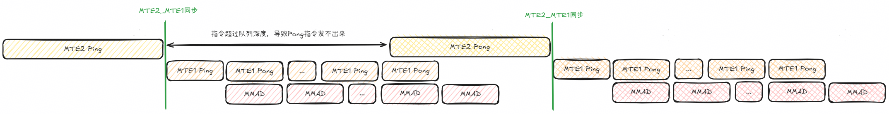
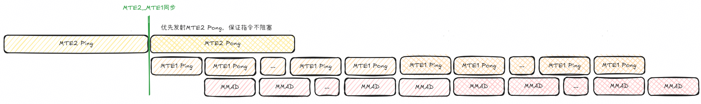
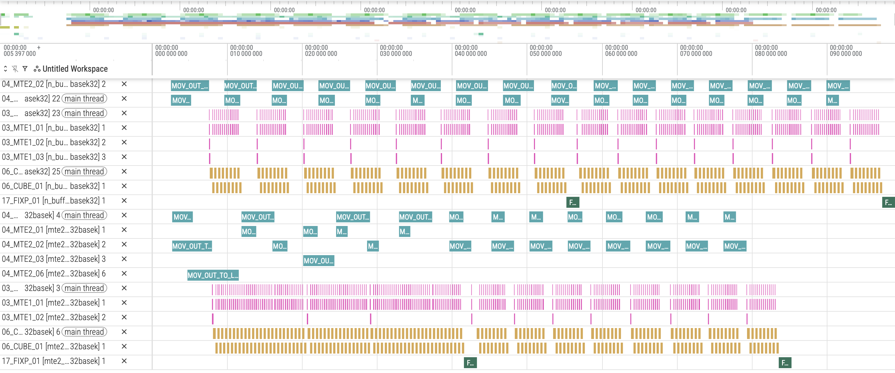

# MTE2预加载特性介绍
## 1. 原理介绍
### 1.1 背景
&ensp;&ensp;在实现启用双缓冲（Double Buffer）的矩阵乘法时，每条 MTE2_PONG 指令必须等待与其配对的 MTE2_PING 指令之后的所有指令全部发射完毕后，才能获得发射机会。因此，若这两条指令之间插入的指令数量过多，超出了芯片预设的指令队列深度，即使不存在同步依赖，MTE2_PONG 指令仍会因队列阻塞而无法发射。

<div align="center">
  
</div>

&ensp;&ensp;限制 KL1 长度虽能减少指令队列中的指令数量，但在某些 shape 场景下，KL1 已无法进一步缩减，否则会导致性能损失。此时，需借助 MTE2 预加载来避免指令阻塞。

### 1.2 原理
&ensp;&ensp;通过提前将两组数据搬运到 L1 缓存中，使 MTE2 指令得以提前发射，从而避免因指令堵塞而导致的流水线断流。

**计算流水图如下**：

&ensp;&ensp;优先发送 PONG 对应的 MTE2，且下一轮的 PING 无需等待。随后再执行上一轮 MTE2（即已发送 PONG 的那一轮）所对应的 MTE1 与 MMAD 指令，从而实现解耦。
<div align="center">
  
</div>

### 1.3 预期效果

* **消除指令队列阻塞**：MTE2_PONG 不再被动等待 PING 之后的所有指令发射完毕，而是可以提前发射并预取数据，避免因指令队列深度不足导致的发射停顿。
* **提升流水线连续性**：在 KL1 无法进一步缩减的场景下，仍能维持计算单元持续工作，减少流水线断流。

## 2. 实践：使用MTE2预加载特性优化计算流水

### 2.1 代码
下面演示 M 方向 MTE2 预加载的实现：
首先，在第一轮搬运两份 A 矩阵到 L1 缓存：

```C++
// 第一段：处理第一个分片（tileIdx / blockNum == 0 且是第一轮迭代 iter0 == 0）
if (tileIdx / blockNum == 0 && iter0 == 0) {
    // 等待该 L1 缓冲区上之前的 MTE1（L1 -> GM）和 MTE2（GM -> L1）操作完成
    AscendC::WaitFlag<AscendC::HardEvent::MTE1_MTE2>(l1BufId);
    
    // 为 L1 缓冲区 A 创建张量，并从全局内存中拷贝第一个分片的 A 数据
    auto tensorAL1First =
        AscendC::Te::MakeTensor(AscendC::Te::MakeL1memPtr<T>(l1BufferAOffset[l1BufId]), layoutAL1);
    auto tensorAGmTileFirst =
        tensorAGmBlock(AscendC::Te::MakeCoord(0, iter0 * kL1), AscendC::Te::MakeShape(curM, curGmAKL1));
    AscendC::Te::Copy(copyGM2L1, tensorAL1First, tensorAGmTileFirst);

    // 为 L1 缓冲区 B 创建张量，并从全局内存中拷贝第一个分片的 B 数据
    auto tensorBL1First =
        AscendC::Te::MakeTensor(AscendC::Te::MakeL1memPtr<T>(l1BufferBOffset[l1BufId]), layoutBL1);
    auto tensorBGmTileFirst =
        tensorBGmBlock(AscendC::Te::MakeCoord(iter0 * kL1, 0), AscendC::Te::MakeShape(curGmBKL1, curN));
    AscendC::Te::Copy(copyGM2L1, tensorBL1First, tensorBGmTileFirst);

    // 设置标志位，同步 MTE2 -> MTE1，表示拷贝完成
    AscendC::SetFlag<AscendC::HardEvent::MTE2_MTE1>(l1BufId);
}
```

接下来，在非首轮迭代或首轮迭代的后续分片时，利用双缓冲机制预取下一分片数据到另一块 L1 缓冲区，实现数据加载与计算的重叠:

```C++
// 第二段：预取下一个分片（用于双缓冲）
if (tileIdx / blockNum > 0 || (tileIdx / blockNum == 0 && kL1TileNum > 1 && iter0 + 1 < kL1TileNum)) {
    // 对于第一个 block 内的后续迭代，更新偏移量和缓冲区 ID
    if(tileIdx / blockNum == 0) {
        curOffsetL1 = (iter0 + 1) * kL1;
        curGmAKL1 = NextCurGmAKL1;
        curGmBKL1 = NextCurGmBKL1;
        curL1BufId = 1 - l1BufId;   // 在两个 L1 缓冲区之间切换
    }
    
    // 等待目标缓冲区上之前的 MTE1_MTE2 操作完成
    AscendC::WaitFlag<AscendC::HardEvent::MTE1_MTE2>(curL1BufId);
    
    // 重新计算下一个分片的布局
    layoutAL1 = AscendC::Te::MakeLayoutAL1<T>{}(curM, curGmAKL1);
    layoutBL1 = AscendC::Te::MakeLayoutBL1<T>{}(curGmBKL1, curN);
    
    // 将下一个 A 分片从全局内存拷贝到 L1 缓冲区（辅助缓冲区）
    auto tensorAL1Sec =
        AscendC::Te::MakeTensor(AscendC::Te::MakeL1memPtr<T>(l1BufferAOffset[curL1BufId]), layoutAL1);
    auto tensorAGmTileSec = tensorAGmBlock(
        AscendC::Te::MakeCoord(0, curOffsetL1), AscendC::Te::MakeShape(curM, curGmAKL1));
    AscendC::Te::Copy(copyGM2L1, tensorAL1Sec, tensorAGmTileSec);

    // 将下一个 B 分片从全局内存拷贝到 L1 缓冲区（辅助缓冲区）
    auto tensorBL1Sec =
        AscendC::Te::MakeTensor(AscendC::Te::MakeL1memPtr<T>(l1BufferBOffset[curL1BufId]), layoutBL1);
    auto tensorBGmTileSec = tensorBGmBlock(
        AscendC::Te::MakeCoord(curOffsetL1, 0), AscendC::Te::MakeShape(curGmBKL1, curN));
    AscendC::Te::Copy(copyGM2L1, tensorBL1Sec, tensorBGmTileSec);
    
    // 拷贝完成后设置标志位
    AscendC::SetFlag<AscendC::HardEvent::MTE2_MTE1>(curL1BufId);
}
```
**关键改动点**：

* **初始预加载双份数据**: 在首轮（iter0 == 0）时，一次性搬运两份 A 矩阵数据到 L1 缓存，使得 MTE2_PONG 提前发射。
* **缓冲区切换**：在首轮块内，每次预取前更新curL1BufId = 1 - l1BufId，切换到另一块缓冲区；同时更新全局内存偏移量（curOffsetL1）和分片尺寸（curGmAKL1, curGmBKL1）。

### 2.2 修改注意点

* **只预取所需分片**：条件判断确保只在还有剩余分片时（iter0 + 1 < kL1TileNum）才发起预取，避免无效搬运。
* **首轮特殊处理边界**：首轮（iter0 == 0）预加载两份数据后，需确保首次 MMAD 计算使用的是第一份数据，而非等待第二份搬运完成。
* **末轮搬运与计算的收尾**：在最后一轮迭代时，需注意不再触发下一轮预取（避免越界访问），同时确保最后一轮的计算仍能正确访问已搬运的数据块，不要提前释放或覆盖。
* **受影响部分**：代码复杂度增加，流水管理需注意错开操作，同时指令规模扩大，导致耗时增加。

## 3 性能结果对比
### 3.1 case前后性能

<div align="center">
  
</div>

&ensp;&ensp;从流水对比图可以看出，开启 MTE2 预加载后，Pong 的 MTE2 指令并未因超过预设队列深度而延后启动，整体 MTE2 处理过程向前平移，计算更加连续。

## 4. 结论

适用场景：
* **指令队列深度受限的高密度调度场景**：当 PING 与 PONG 指令之间插入的指令数量超出芯片预设队列深度时，传统双缓冲会出现 MTE2_PONG 发射阻塞，预加载机制可有效解除该依赖。
* **KL1 无法进一步缩减的性能敏感场景**：在某些矩阵 shape 下，继续缩减 KL1 会导致计算性能下降。此时 MTE2 预加载能够在保持 KL1 不变的前提下，通过提前发射MTE_PONG指令来避免流水线断流。

&ensp;&ensp;MTE2 预加载通过提前搬运矩阵到L1，消除了 MTE2_PONG 的发射阻塞，提升了流水线连续性与吞吐效率。

## 5.编译 执行

1. 编译样例

从项目根目录启动构建，参考项目[README.md](../../../README.md)

在仓库根目录下完成编译和安装后，进入当前样例目录：
```shell
cmake -S . -B build
cmake --build build --parallel
cmake --install build --prefix ./build_out
cd ./build_out/1_Features/instruction_optimization/mte2_preload/
```

如需单独编译当前样例，可使用以下指令：
```shell
cmake --build build --target mte2_preload
cp ./Samples/1_Features/instruction_optimization/mte2_preload/scripts/profile_matmul.py ./build/Samples/1_Features/instruction_optimization/mte2_preload/
cd ./build/Samples/1_Features/instruction_optimization/mte2_preload/
```

2. 运行样例

使用可执行文件直接执行算子用例，需要指定矩阵乘维度，并随机生成输入数据。
```shell
./mte2_preload 1024 2048 4096
```
打印如下执行结果，证明样例执行成功。
```shell
matmul run successfully!
```
如果存在精度问题，则会打印错误数据，并显示如下结果。
```shell
matmul run failed!
```

3. 测试性能
运行性能测试脚本，指定矩阵乘法的维度后执行。
```shell
python3 profile_matmul.py 1024 2048 4096
```
打印如下执行结果，证明样例性能测试成功。
```shell
[Profile Breakdowm]
+--------------+------------+---------+------------+----------+----------+-------------+----------------+
| candidate    | kernel(us) | mac(us) | scalar(us) | mte1(us) | mte2(us) | fixpipe(us) | icache_miss(%) |
+==============+============+=========+============+==========+==========+=============+================+
| mte2_preload |     63.288 |  41.880 |      5.924 |   14.299 |   32.722 |       2.543 |          0.500 |
+--------------+------------+---------+------------+----------+----------+-------------+----------------+
```
与相同规模下的基础 MatMul 算子开启 double-buffer对比：
```shell
[Profile Breakdowm]
+-----------+------------+---------+------------+----------+----------+-------------+----------------+
| candidate | kernel(us) | mac(us) | scalar(us) | mte1(us) | mte2(us) | fixpipe(us) | icache_miss(%) |
+===========+============+=========+============+==========+==========+=============+================+
| n_buffer  |     66.000 |  40.810 |      2.558 |   10.659 |   37.595 |       1.980 |          1.200 |
+-----------+------------+---------+------------+----------+----------+-------------+----------------+
```
可以看到，整体kernel运算时间缩短，性能有所提升。

## 6. 支持架构

NPU ARCH 3510