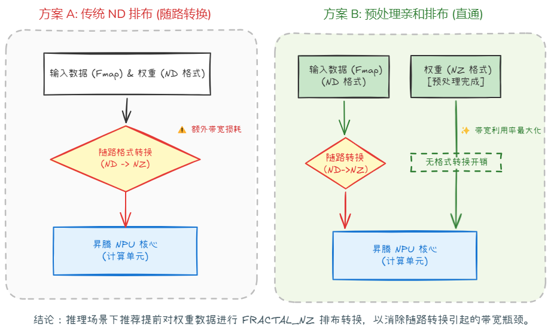
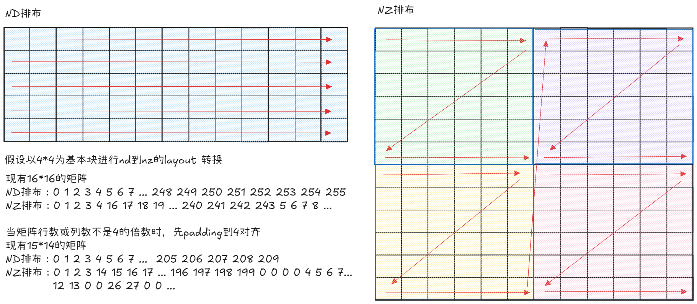
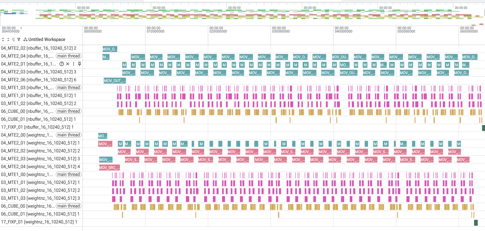

# weightnz特性介绍
## 1. 原理介绍
### 1.1 背景
&ensp;&ensp;昇腾NPU内部采用亲和的 FRACTAL_NZ 排布形式，当Matmul算子以传统ND排布传入权重时，需在数据通路中随路完成格式转换，该过程会引入额外的带宽损耗。因此，在推理场景下，可对权重进行预处理，提前转换为 FRACTAL_NZ 排布，从而消除转换开销，充分发挥带宽利用率。

<div align="center">
  
</div>

&ensp;&ensp;但该方法仅适用于推理场景；在训练场景中，由于无法对权重进行预处理，实际将 ND 转换为 FRACTAL_NZ 排布会引入额外的耗时。

### 1.2 原理

&ensp;&ensp;NPU 内部计算的 FRACTAL_NZ 基本块大小根据数据类型调整：对于 FP16 或 BF16 格式，基本块大小为 16×16；对于 FP32 格式，则为 16×8。即保持 M 维度块大小 16 不变，FP32 时 N 维度块大小减半，K 维度的分块策略保持不变。在 ND 排布中，数据在内存中按行主序连续存储；而 FRACTAL_NZ 排布则以基本块为单位组织，基本块之间采用 N 字形（即列优先顺序）排列，块内部则按 Z 字形（即 Morton 顺序）排列。以下以 4×4 基本块为例给出原理示意图：

<div align="center">
  
</div>

## 2. 实践：通过权重矩阵预处理优化矩阵乘法计算流水

### 2.1 代码

### 2.1.1 gm到L1搬运函数修改

&ensp;&ensp;将原本按 ND 排布存储的权重矩阵，改为按 FRACTAL_NZ 排布创建和存放。

```C++
// 为矩阵 B 创建 FRACTAL_NZ 排布：K 维度上的分块大小为 cube_size（即 32/sizeof(T)），N 维度上的分块大小为 16
auto layoutB = AscendC::Te::MakeNzLayout<T>(
    tool::CeilAlign(k, tool::CUBE_SIZE / sizeof(T)),   // 将 K 维度对齐到 cube_size 的倍数
    tool::CeilAlign(n, 16)                             // 将 N 维度对齐到 16 的倍数
);
auto tensorBgm = AscendC::Te::MakeTensor(AscendC::Te::MakeGMmemPtr(reinterpret_cast<__gm__ T*>(bGm)), layoutB);
```

**关键改动点**：

* **排布创建方式**：将权重矩阵从 GM 搬运至 L1 时，存储排布由默认的行主序 ND 排布切换为 FRACTAL_NZ 排布。
* **nd转nz函数**：实现将内存数据从 ND 排布转换为 FRACTAL_NZ 格式排布的转换函数。

### 2.2 修改注意点

* **维度对齐处理**：原始权重矩阵的 K 维和 N 维可能不是基本块大小的整数倍，需在转换前进行 Padding 对齐。
* **数据类型适配**：不同数据类型对应的 cube_size 不同（FP16/BF16 为 16，FP32 为 8），需通过 32 / sizeof(T) 动态计算
* **内存大小变化**：FRACTAL_NZ 排布因维度对齐会导致实际存储空间大于原始矩阵，分配 GM 空间时应以对齐后的尺寸为准，避免越界访问。

## 3 性能结果对比
### 3.1 case前后性能

<div align="center">
  
</div>

&ensp;&ensp;由上述仿真流水图可以看出，将权重矩阵预先转换为 FRACTAL_NZ 排布，可有效提升数据搬运效率，整体流水提前。

## 4. 结论

**适用场景**：
* **权重矩阵固定**：适合权重矩阵固定的推理场景。
* **大矩阵场景**：适合大weight矩阵场景，搬运优化收益更高。

&ensp;&ensp;通过将权重矩阵预转换为 FRACTAL_NZ 排布，消除 Matmul 算子中的随路格式转换开销，提升了整体的流水优化。

## 5.编译 执行

1. 编译样例

从项目根目录启动构建，参考项目[README.md](../../../README.md)

在仓库根目录下完成编译和安装后，进入当前样例目录：
```shell
cmake -S . -B build -DNPU_ARCH=dav-3510
cmake --build build --parallel
cmake --install build --prefix ./build_out
cd ./build_out/1_Features/instruction_optimization/weightnz/
```

如需单独编译当前样例，可使用以下指令：
```shell
cmake --build build --target weightnz
cp ./Samples/1_Features/instruction_optimization/weightnz/scripts/* ./build/Samples/1_Features/instruction_optimization/weightnz/
cd ./build/Samples/1_Features/instruction_optimization/weightnz/
```

2. 运行样例

使用可执行文件直接执行算子用例，需要指定矩阵乘维度，并随机生成输入数据。
```shell
./weightnz 1024 2048 4096
```
打印如下执行结果，证明样例执行成功。
```shell
matmul run successfully!
```
如果存在精度问题，则会打印错误数据，并显示如下结果。
```shell
matmul run failed!
```

3. 测试性能
运行性能测试脚本，指定矩阵乘法的维度后执行。
```shell
python3 profile_matmul.py 1024 2048 4096
```
打印如下执行结果，证明样例性能测试成功。
```shell
[Profile Breakdowm]
+-----------+------------+---------+------------+----------+----------+-------------+----------------+
| candidate | kernel(us) | mac(us) | scalar(us) | mte1(us) | mte2(us) | fixpipe(us) | icache_miss(%) |
+===========+============+=========+============+==========+==========+=============+================+
| weightnz  |     53.598 |  40.511 |      2.664 |   10.659 |   35.529 |       3.216 |          1.100 |
+-----------+------------+---------+------------+----------+----------+-------------+----------------+
```
与相同输入规模下的基础开启db的 matmul 算子相比：
```shell
[Profile Breakdowm]
+-----------+------------+---------+------------+----------+----------+-------------+----------------+
| candidate | kernel(us) | mac(us) | scalar(us) | mte1(us) | mte2(us) | fixpipe(us) | icache_miss(%) |
+===========+============+=========+============+==========+==========+=============+================+
| n_buffer  |     66.000 |  40.810 |      2.558 |   12.681 |   37.595 |       1.980 |          1.200 |
+-----------+------------+---------+------------+----------+----------+-------------+----------------+
```
可以看到，整体计算时间显著缩短，性能有所提升。

## 6. 支持架构

NPU ARCH 3510