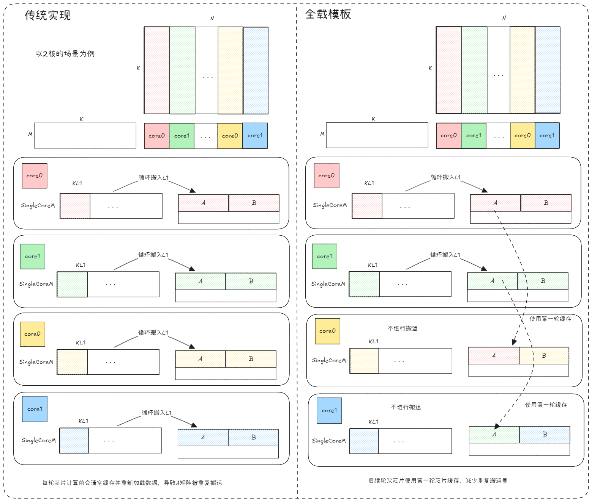
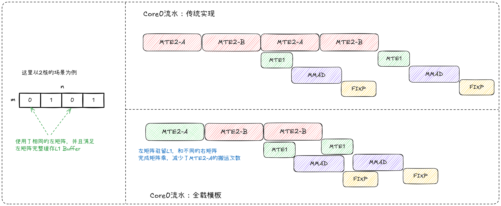
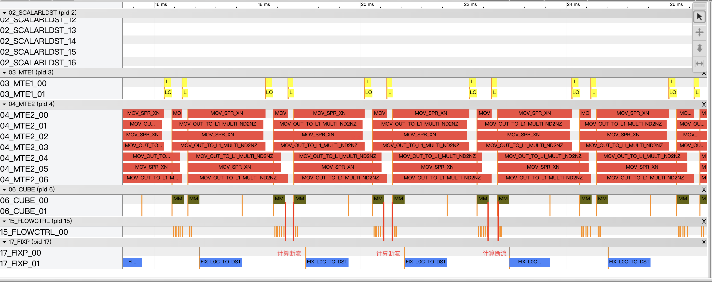
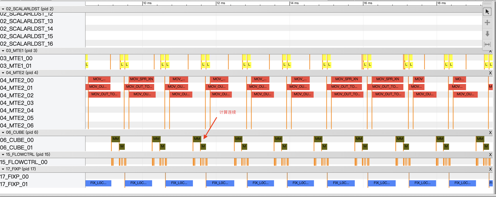

# 全载特性介绍
## 1. 原理介绍
### 1.1 背景
&ensp;&ensp;在 MTE2 Bound 的场景下，整体耗时的优化关键在于减少 MTE2 搬运环节的开销。当 A 矩阵或 B 矩阵规模较小时，可将其缓存至 L1，以降低 MTE2 的搬运量，从而提升性能。
### 1.2 原理
&ensp;&ensp;对于能够完整载入L1缓存的矩阵，可以采用全载模板策略，即一次性将整个矩阵加载到L1缓存中并使其常驻，在不同计算轮次中重复使用该缓存数据而无需反复从全局内存搬运，从而显著减少访存次数、降低内存带宽压力，最终有效减少算子MTE2搬运阶段的耗时。
<div align="center">
  
</div>

**计算流水图对比**：

<div align="center">
  
</div>
&ensp;&ensp;如图所示，相较于传统的搬运方式，利用全载机制可以有效减少MTE2的搬运次数，进而降低整体的数据搬运耗时，尤其在带宽成为性能瓶颈时效果尤为显著。

### 1.3 预期效果

* **MTE2搬运次数减少**：全载矩阵仅需在计算开始前加载一次，后续轮次直接复用缓存数据，MTE2搬运次数由原来的与计算轮次成正比降低为常数级。
* **端到端延迟降低**：在带宽受限场景下，减少全局内存访问可直接降低数据搬运耗时。

## 2. 实践：使用全载机制优化matmul计算流水

### 2.1 代码
以一个典型的MatMul计算为例，修改以下代码可实现A矩阵全载效果：

```
for (uint64_t tileIdx = curBlockIdx; tileIdx < tileNum; tileIdx += blockNum) {

  // 1. 在 L1 缓存中预先申请 A 矩阵的存储空间
  auto layoutAL1 = AscendC::Te::MakeLayoutAL1<T>{}(curM, k);
  auto tensorAL1 = AscendC::Te::MakeTensor(AscendC::Te::MakeL1memPtr<T>(l1BufferAOffset[0]), layoutAL1);
  
  for (uint64_t iter0 = 0; iter0 < kL1TileNum; ++iter0) {
    // 2. 仅在第一轮循环时执行数据搬运，后续轮次直接复用 L1 中已缓存的 A 矩阵
    if (l1PingPong < kL1TileNum) {
        auto tensorAGmTile =
            tensorAGmBlock(AscendC::Te::MakeCoord(0, iter0 * kL1), AscendC::Te::MakeShape(curM, curGmAKL1));
        AscendC::Te::Copy(copyGM2L1, tensorBlockAL1, tensorAGmTile);
    }
  }
}

int main(int argc, char* argv[])
{
  // 3. 预先验证当前形状是否支持 A 矩阵全载
  bool result = tool::IsFullLoadEnabled<float>(m, n, k, numBlocks);
  CHECK_COND(result == true, "当前形状不支持 A 矩阵全载。", return 1);

}

template <typename T>
bool IsFullLoadEnabled(int m, int n, int k, uint32_t numBlocks)
{
    // 必选：若不满足，可能导致精度异常或无法获得预期性能收益
    // 条件1：分块数量需要超过可用的核数
    int tilesM = (m + 255) / 256;
    int tilesN = (n + 255) / 256;
    bool enoughBlocks = (tilesM * tilesN >= numBlocks);

    // 条件2：L1 容量限制（L1 的容量为 512KB，扣除 A 矩阵存储开销）
    size_t aMatrixSize = static_cast<size_t>(k) * m * sizeof(T);
    size_t l1HalfCapacity = (512 * 1024) / 2;
    bool fitsInL1 = (aMatrixSize <= l1HalfCapacity);

    // 条件3：特殊场景约束
    // 场景1：M <= 256，全载优化生效（否则缓存缺失导致精度问题）
    // 场景2：M < N 且分块数 <= 核数，避免缓存缺失
    bool specialCondition = (m <= 256) || (m < n && (tilesM * tilesN <= numBlocks));

    // 可选：满足以下约束的shape全载复用收益明显
    // 条件4：N维度需足够大（如 n >= 512），全载才有显著收益
    // 原因：N较小时计算轮次少，全载节省的搬运次数有限；N足够大时重复利用率高，收益明显
    // bool nIsLargeEnough = (n >= 512);

    return enoughBlocks && fitsInL1 && specialCondition;
}
```

**关键改动点**：

* **L1空间预先申请**：在循环外通过 MakeLayoutAL1 和 MakeTensor 预先申请并分配好L1缓存中A矩阵的存储空间，确保数据可以常驻L1。
* **搬运条件控制**：通过 `if (l1PingPong < kL1TileNum)` 条件判断，使得A矩阵的GM2L1搬运仅在首次进入内层循环时执行一次，后续轮次跳过搬运逻辑，直接复用L1中已缓存的数据。

### 2.2 修改注意点

* **L1缓存容量限制**:需确保A矩阵（或B矩阵）的总大小不超过L1缓存的实际容量，否则可能导致缓存溢出或频繁换入换出。
* **前置条件校验**：在 main 函数中调用 `IsFullLoadEnabled` 进行预先验证，确保当前矩阵维度、核数、L1容量等条件满足全载要求，若不满足则提前报错退出，避免运行时出现性能退化或功能异常。

## 3 性能结果对比
### 3.1 case前后性能

&ensp;&ensp;以基础 MatMul 算子开启 double-buffer 为例，在相同输入规模（M=256, K=64, N=32768）下进行性能测试，并利用 Profiling 工具采集硬件流水线的执行状态。

&ensp;&ensp;测试结果表明，启用 A 全载优化后，原先被 MTE2 打断的 MMAD 计算流水线变得连续，从而提升了算子的整体执行性能。

未开启 A 全载优化时：

<div align="center">
  
</div>

开启 A 全载优化后：

<div align="center">
  
</div>

## 4. 结论

**适用场景**：

* **小规模矩阵计算**：A矩阵或B矩阵能够完整放入L1缓存，且计算轮次较多时，全载机制可显著减少重复搬运开销。
* **带宽瓶颈场景**：当算子性能受限于MTE2搬运带宽时，通过减少全局内存访问次数，可有效缓解带宽压力，提升整体性能。

&ensp;&ensp;全载机制通过将小规模矩阵一次性加载至L1缓存并常驻复用，可将MTE2搬运次数从与计算轮次成正比降低为常数级，在带宽受限场景下显著降低端到端延迟。

## 5.编译 执行

1. 编译样例

从项目根目录启动构建，参考项目[README.md](../../../README.md)

在仓库根目录下完成编译和安装后，进入当前样例目录：
```shell
cmake -S . -B build
cmake --build build --parallel
cmake --install build --prefix ./build_out
cd ./build_out/1_Features/memory_optimization/full_load/
```

如需单独编译当前样例，可使用以下指令：
```shell
cmake --build build --target full_load
cp ./Samples/1_Features/memory_optimization/full_load/scripts/profile_matmul.py ./build/Samples/1_Features/memory_optimization/full_load/
cd ./build/Samples/1_Features/memory_optimization/full_load/
```

2. 运行样例

使用可执行文件直接执行算子用例，需要指定矩阵乘维度，并随机生成输入数据。
```shell
./full_load 64 256 9000
```
打印如下执行结果，证明样例执行成功。
```shell
matmul run successfully!
```
如果存在精度问题，则会打印错误数据，并显示如下结果。
```shell
matmul run failed!
```

3. 测试性能
运行性能测试脚本，指定矩阵乘法的维度后执行。
```shell
python3 profile_matmul.py 64 256 9000
```
打印如下执行结果，证明样例性能测试成功。
```shell
[Profile Breakdowm]
+-----------+------------+---------+------------+----------+----------+-------------+----------------+
| candidate | kernel(us) | mac(us) | scalar(us) | mte1(us) | mte2(us) | fixpipe(us) | icache_miss(%) |
+===========+============+=========+============+==========+==========+=============+================+
| full_load |     12.565 |   0.853 |      1.292 |    0.567 |    5.540 |       1.177 |          7.400 |
+-----------+------------+---------+------------+----------+----------+-------------+----------------+
```
与相同规模下的基础 MatMul 算子开启 double-buffer对比：
```shell
[Profile Breakdowm]
+-----------+------------+---------+------------+----------+----------+-------------+----------------+
| candidate | kernel(us) | mac(us) | scalar(us) | mte1(us) | mte2(us) | fixpipe(us) | icache_miss(%) |
+===========+============+=========+============+==========+==========+=============+================+
| n_buffer  |     12.860 |   0.885 |      1.581 |    0.581 |    5.713 |       1.216 |          7.300 |
+-----------+------------+---------+------------+----------+----------+-------------+----------------+
```
可以看到，整体计算时间缩短，性能有所提升。

## 6. 支持架构

NPU ARCH 3510