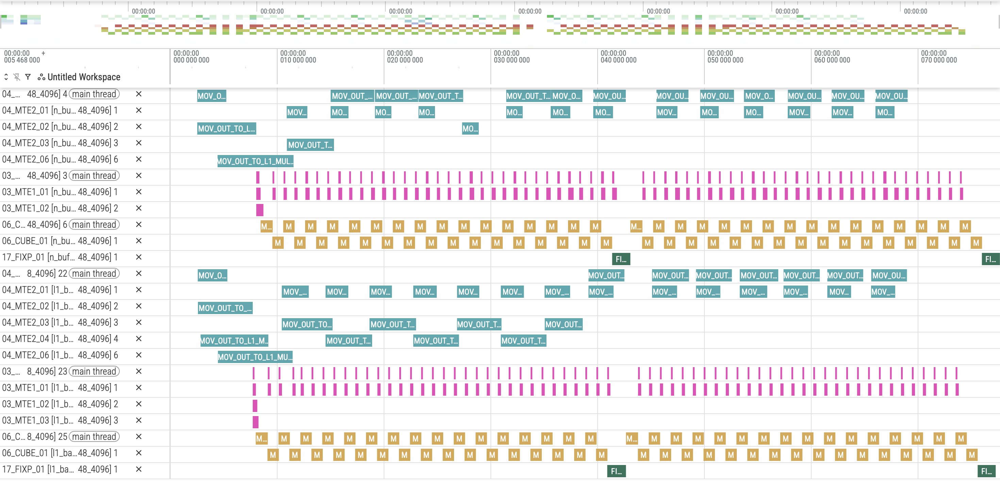

# L1bank冲突介绍
## 1. 原理介绍
### 1.1 背景

&ensp;&ensp;L1缓存以256 KB为粒度划分为两个独立Bank。当读写操作指向同一Bank时，即触发Bank冲突，导致MTE1带宽利用率下降，并中断MMAD指令执行序列。为此，L1双缓冲机制需要将两份待缓存数据分别放置于不同Bank，通过分离读写访问的目标Bank，消除冲突产生的必要条件，从而保障带宽效率和指令连续性。
<div align="center">
  
</div>

### 1.2 原理

&ensp;&ensp;原先设计中，L1A ping-pong数据采用连续排布方式。硬件层L1被划分为两个Bank，每个Bank大小为256KB。由于每次搬运指令的发包大小为256B，一次传输必定横跨8个Bank Group，在此排布下必然引发L1 Bank的读写冲突。

&ensp;&ensp;针对这一问题，可采用自主申请两块Bank空间的方式加以解决，即分别申请L1一半大小的空间，一块分配给Ping使用，另一块分配给Pong使用，从而实现Ping与Pong缓冲区的完全隔离。通过这种隔离机制，可有效避免Bank内的读写冲突。

## 2. 实践：通过合理分配L1 ping和pong空间来避免bank冲突

### 2.1 代码
以一个典型的MatMul计算为例，修改以下代码可避免L1 bank冲突：

传统写法：

 ```C++
 // [Ping A][Pong A][Ping B][Pong B]
for (uint64_t iter0 = 0; iter0 < kL1TileNum; ++iter0) {
    // 计算A矩阵和B矩阵在L1缓存中单份数据所需的空间大小
    uint64_t AOffsetL1 = baseM * kL1 * sizeof(T);  // A矩阵单份大小 = M维度 × K分块大小 × 数据类型字节数
    uint64_t BOffsetL1 = baseN * kL1 * sizeof(T);  // B矩阵单份大小 = N维度 × K分块大小 × 数据类型字节数

    // Ping/Pong双缓冲空间分配：通过l1BufId（0或1）区分两块独立Bank空间
    l1BufferAOffset[l1BufId] = l1BufId * AOffsetL1;  // A矩阵偏移：Ping区从0开始，Pong区紧邻A矩阵单份大小

    // B矩阵偏移：预留两份A矩阵空间后，再根据l1BufId偏移B矩阵单份大小
    l1BufferBOffset[l1BufId] = tool::DOUBLE_BUFFER_COUNT * AOffsetL1 + l1BufId * BOffsetL1;
}
 ```
切分L1给ping pong分别分配独立的空间来避免L1 bank 冲突：

 ```C++
 // [Ping A][Ping B] | [Pong A][Pong B]
for (uint64_t iter0 = 0; iter0 < kL1TileNum; ++iter0) {
    // 使用L1总容量的一半作为Ping和Pong的隔离边界，实现两块Bank空间的完全隔离
    // l1BufId = 0 对应Ping区，l1BufId = 1 对应Pong区
    uint64_t l1Offset = (AscendC::TOTAL_L1_SIZE >> 1) * l1BufId;
    l1BufferAOffset[l1BufId] = l1Offset;                       // A矩阵在L1中的起始偏移
    l1BufferBOffset[l1BufId] = l1Offset + baseM * kL1 * sizeof(T); // B矩阵紧邻A矩阵存放
}
 ```
**关键改动点**:

* **L1空间按Bank边界切分**:将L1总容量的一半（256KB）作为Ping区和Pong区的物理隔离边界，确保两块缓冲区分别位于不同的Bank中，从根本上避免Bank地址重叠导致的读写冲突。

* **Ping/Pong地址空间完全隔离**:Ping区起始偏移为0，Pong区起始偏移为L1总容量的一半，两块空间互不重叠。每个Bank内部A矩阵与B矩阵连续存放，充分利用空间的同时保持访问局部性。

### 2.2 修改注意点

* **L1容量边界对齐要求**:切分L1空间时需确保Ping和Pong各占一半，即每块大小为 TOTAL_L1_SIZE >> 1。若L1总容量存在其他预留空间，需重新计算实际可用容量，避免越界或空间浪费。

## 3 性能结果对比
### 3.1 case前后性能

&ensp;&ensp;以基础 MatMul 算子开启 double-buffer 为例，在相同输入规模（M=512, K=512, N=512）下进行性能测试，并利用 Profiling 工具采集硬件流水线的执行状态。

&ensp;&ensp;测试结果表明，启用 L1 bank 冲突优化后，原先 MTE1 搬运流水线的时间变短，从而提升了算子的整体执行性能。

完成 L1 bank 冲突优化后：

<div align="center">
  
</div>

## 4. 结论
适用场景：

* **多缓冲机制场景**:当算子采用L1多缓冲机制进行流水线优化时，需将Ping和Pong缓冲区分别放置于不同Bank，否则连续排布会导致读写冲突，削弱双缓冲的并行效果。

* **出现带宽瓶颈**：当算子性能受限于MTE1搬运带宽时，Bank冲突导致的串行化等待会进一步加剧带宽瓶颈，通过空间隔离消除冲突可显著提升搬运效率。

&ensp;&ensp;通过将L1缓存按Bank边界切分为Ping和Pong两个独立空间，实现地址空间的完全隔离，可从根本上避免L1上的读写冲突，有效保障MTE1带宽利用率和MMAD指令连续性。
## 5.编译 执行

1. 编译样例

从项目根目录启动构建，参考项目[README.md](../../../README.md)

在仓库根目录下完成编译和安装后，进入当前样例目录：
```shell
cmake -S . -B build
cmake --build build --parallel
cmake --install build --prefix ./build_out
cd ./build_out/1_Features/memory_optimization/l1_bank_conflict/
```

如需单独编译当前样例，可使用以下指令：
```shell
cmake --build build --target l1_bank_conflict
cp ./Samples/1_Features/memory_optimization/l1_bank_conflict/scripts/profile_matmul.py ./build/Samples/1_Features/memory_optimization/l1_bank_conflict/
cd ./build/Samples/1_Features/memory_optimization/l1_bank_conflict/
```

2. 运行样例

使用可执行文件直接执行算子用例，需要指定矩阵乘维度，并随机生成输入数据。
```shell
./l1_bank_conflict 1024 2048 4096
```
打印如下执行结果，证明样例执行成功。
```shell
matmul run successfully!
```
如果存在精度问题，则会打印错误数据，并显示如下结果。
```shell
matmul run failed!
```

3. 测试性能
运行性能测试脚本，指定矩阵乘法的维度后执行。
```shell
python3 profile_matmul.py 1024 2048 4096
```
打印如下执行结果，证明样例性能测试成功。
```shell
[Profile Breakdowm]
+------------------+------------+---------+------------+----------+----------+-------------+----------------+
| candidate        | kernel(us) | mac(us) | scalar(us) | mte1(us) | mte2(us) | fixpipe(us) | icache_miss(%) |
+==================+============+=========+============+==========+==========+=============+================+
| l1_bank_conflict |     50.871 |  40.212 |      2.842 |   11.065 |   36.999 |       2.751 |          1.000 |
+------------------+------------+---------+------------+----------+----------+-------------+----------------+
```
与相同规模下的基础 MatMul 算子开启 double-buffer对比：
```shell
[Profile Breakdowm]
+-----------+------------+---------+------------+----------+----------+-------------+----------------+
| candidate | kernel(us) | mac(us) | scalar(us) | mte1(us) | mte2(us) | fixpipe(us) | icache_miss(%) |
+===========+============+=========+============+==========+==========+=============+================+
| n_buffer  |     66.000 |  40.810 |      2.558 |   10.659 |   37.595 |       1.980 |          1.200 |
+-----------+------------+---------+------------+----------+----------+-------------+----------------+
```
可以看到，整体计算时间缩短，性能有所提升。

## 6. 支持架构

NPU ARCH 3510