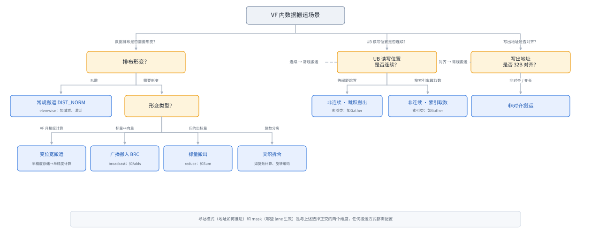
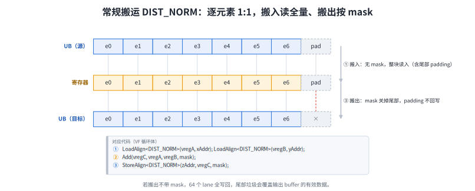
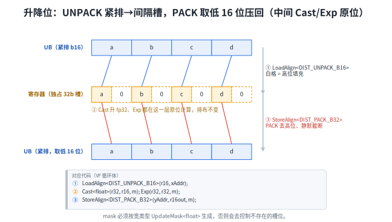
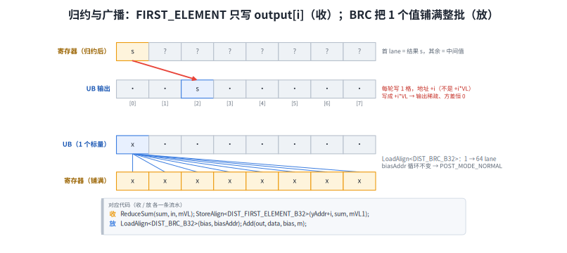
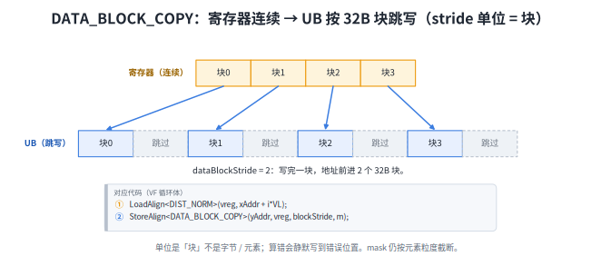
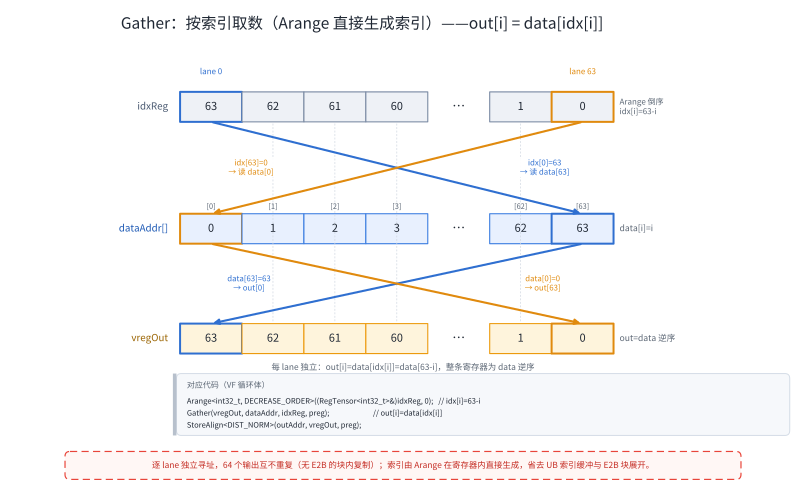
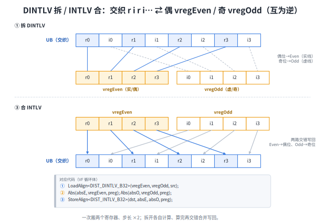
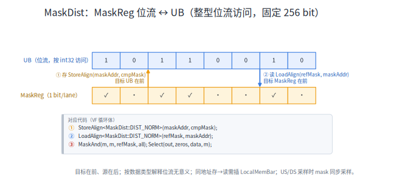
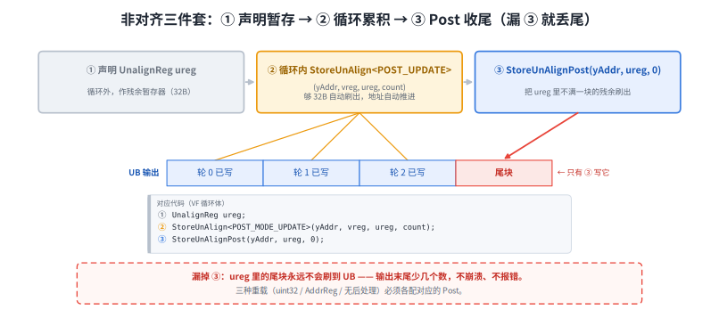

# Reg 数据搬运场景选型指南

> 适用硬件：Ascend 950PR / 950DT（NpuArch DAV_3510）。
> 频次统计自 `ops-cv` / `ops-math` / `ops-nn` / `ops-transformer` 四个算子仓全量源码。`AscendC::Reg` 与 `AscendC::MicroAPI` 是同一命名空间（`kernel_macros.h` 中 `namespace MicroAPI = Reg`），下文按各处真实代码写法混用。
> 文中实测输出均来自 `src/` 各示例在 950 实机上的运行结果（CANN 9.1.0，`cmake -DNPU_ARCH=dav-3510` 构建后逐个执行）；为便于逐列对照，引用时部分行内空白经排版对齐，数值未作任何改动。

## 适用场景

算子的数据计算链路为 `GM → UB → 寄存器 → UB → GM`，本指南聚焦其中 `UB → 寄存器 → UB` 这一跳。计算场景不同，搬运方式也不同，下文按场景说明各自该用哪条指令。


## 场景划分与选型

下面的决策树按计算场景特点确定该用哪种搬运方式（蓝色框对应下文详细章节）：



> 寻址模式（地址如何推进）和 mask（哪些 lane 生效）是与上述选择正交的两个维度，任何搬运方式都需配置。

---

## 常规搬运 `DIST_NORM`

> **用于**VF 内 elemwise 类计算场景（向量加减乘、激活、比较等），数据不经过任何排布形变，原样从 UB 搬入寄存器计算后再原样搬出，逐元素 1:1 对应。`dist` 模板参数缺省即为 `DIST_NORM`，是最常用的搬运方式。

> 搬入（无 mask）：
> ```cpp
> template <typename T, LoadDist dist = LoadDist::DIST_NORM, typename U>
> __simd_callee__ inline void LoadAlign(U& dstReg, __ubuf__ T* srcAddr);
> ```
> 搬出（必须带 mask）：
> ```cpp
> template <typename T, StoreDist dist = StoreDist::DIST_NORM, typename U>
> __simd_callee__ inline void StoreAlign(__ubuf__ T* dstAddr, U& srcReg, MaskReg& mask);
> ```

搬出需要 mask 的原因：数据总量不一定恰好是寄存器 lane 数的整数倍，最后一轮可能只需写出部分 lane。搬入时多读几个无效 lane 不影响结果（后续被计算 mask 屏蔽），但搬出时若不限制生效 lane，多余的垃圾值会覆盖输出 buffer 中的有效数据。



以下示例演示向量加法（N=150，寄存器 lane 数 64），通过 mask 控制只写出 150 个有效元素，不会产生脏写：

```cpp
template <typename T>
__simd_vf__ inline void Scene1Vf(__ubuf__ T* xAddr, __ubuf__ T* yAddr,
                                 __ubuf__ T* zAddr, uint32_t n, uint16_t loopNum)
{
    uint32_t VL = AscendC::VECTOR_REG_WIDTH / sizeof(T);
    AscendC::Reg::RegTensor<T> vregA, vregB, vregC;
    AscendC::Reg::MaskReg mask;
    uint32_t count = n;

    for (uint16_t i = 0; i < loopNum; i++) {
        mask = AscendC::Reg::UpdateMask<T>(count);   // 开前 count 个 lane，count 原地递减

        AscendC::Reg::LoadAlign<T, AscendC::Reg::LoadDist::DIST_NORM>(
            vregA, xAddr + i * VL);                              // 搬入，无 mask
        AscendC::Reg::LoadAlign<T, AscendC::Reg::LoadDist::DIST_NORM>(
            vregB, yAddr + i * VL);

        AscendC::Reg::Add(vregC, vregA, vregB, mask);

        AscendC::Reg::StoreAlign<T, AscendC::Reg::StoreDist::DIST_NORM>(
            zAddr + i * VL, vregC, mask);                        // 搬出，带 mask
    }
}
```

实测输出（x[i]=i·0.5，y[i]=i·0.25）：

```text
[scene1] in : x[0..3]=0.000000 0.500000 1.000000 1.500000  y[0..3]=0.000000 0.250000 0.500000 0.750000
[scene1] out: z[0..3]=0.000000 0.750000 1.500000 2.250000
[scene1] tail: z[148]=111.000000 z[149]=111.750000 | z[150]= -1.000000 z[151]= -1.000000 (sentinel -1)
```

示例计算逻辑：x[i]=i·0.5，y[i]=i·0.25，z=x+y。前两轮各写出 64 个元素，第三轮通过 `UpdateMask<float>(count)` 将 count 从 64 递减到 22，只写出 z[128..149] 这 22 个元素，z[150] 起不会被脏写。

> 完整源码：[`src/scene1_dist_norm.asc`](src/scene1_dist_norm.asc)

---

## 变位宽搬运 `UNPACK` ↔ `PACK`

> **用于**VF 内需要用 Cast 改变精度的场景：例如 UB 中存储 bf16/fp16 数据，VF 内需提升至 fp32 计算，计算完成后再降回 bf16/fp16 写出。搬入时通过 `UNPACK` 将连续的 b16 数据展开到 32 位宽，搬出时通过 `PACK` 将 32 位宽压缩回连续 b16。两者互为逆操作，通常成对使用。

> 搬入（UNPACK 升位宽）：
> ```cpp
> template <typename T, LoadDist dist = LoadDist::DIST_UNPACK_B16, typename U>
> __simd_callee__ inline void LoadAlign(U& dstReg, __ubuf__ T* srcAddr);
> ```
> 搬出（PACK 降位宽）：
> ```cpp
> template <typename T, StoreDist dist = StoreDist::DIST_PACK_B32, typename U>
> __simd_callee__ inline void StoreAlign(__ubuf__ T* dstAddr, U& srcReg, MaskReg& mask);
> ```

与常规搬运相比，变位宽搬运需注意以下差异：

- **dist 参数不同**：搬入使用 `LoadDist::DIST_UNPACK_B16`，搬出使用 `StoreDist::DIST_PACK_B32`。
- **mask 按计算时的宽类型生成**：例如 bf16→fp32 场景中，UNPACK 后数据按 fp32（64 lane）计算，mask 须用 `UpdateMask<float>` 而非 `UpdateMask<half>`，否则会开出不存在的 lane 导致结果静默出错。



以下示例演示变位宽搬运（N=150，half 精度），数据通过 UNPACK 升至 fp32 计算 exp，再通过 PACK 降回 half 写出：

```cpp
template <typename T>
__simd_vf__ inline void Scene2Vf(__ubuf__ T* xAddr, __ubuf__ T* yAddr,
                                 uint32_t n, uint16_t loopNum)
{
    uint32_t VL = AscendC::VECTOR_REG_WIDTH / sizeof(float);
    AscendC::Reg::RegTensor<T> vreg16In, vreg16Out;       // 128 lane × 16b
    AscendC::Reg::RegTensor<float> vreg32In, vreg32Out;   // 64 lane × 32b
    AscendC::Reg::MaskReg mask;
    uint32_t count = n;

    for (uint16_t i = 0; i < loopNum; i++) {
        mask = AscendC::Reg::UpdateMask<float>(count);     // 按宽类型生成 mask

        AscendC::Reg::LoadAlign<T, AscendC::Reg::LoadDist::DIST_UNPACK_B16>(
            vreg16In, xAddr + i * VL);                 // 连续 b16 → 32 位宽

        AscendC::Reg::Cast<float, T, CAST_B16_TO_B32>(vreg32In, vreg16In, mask);
        AscendC::Reg::Exp(vreg32Out, vreg32In, mask);
        AscendC::Reg::Cast<T, float, CAST_B32_TO_B16>(vreg16Out, vreg32Out, mask);

        AscendC::Reg::StoreAlign<T, AscendC::Reg::StoreDist::DIST_PACK_B32>(
            yAddr + i * VL, vreg16Out, mask);          // 32 位宽低 16 位 → 连续
    }
}
```

实测输出（x[i]=i·0.01，host 按 half 容差校验全部通过）：

```text
[scene2] in : x[0..3]=0.000000 0.010002 0.020004 0.029999
[scene2] out: y[0..3]=1.000000 1.009766 1.020508 1.030273
[scene2] tail: y[149]= 4.437500 | y[150]=-1.000000 (sentinel -1)
```

每轮搬运的数据量按计算类型计算：`VL = AscendC::VECTOR_REG_WIDTH / sizeof(float) = 64`，即每轮从 UB 搬入 64 个 b16 元素（128 字节），UNPACK 展开为 64 个 fp32 在寄存器中计算，PACK 后再搬出 64 个 b16 元素。总数据量 N=150 不是 64 的整数倍，最后一轮通过 mask 只写出 22 个有效元素。

> 完整源码：[`src/scene2_unpack_b16.asc`](src/scene2_unpack_b16.asc)　[`src/scene3_pack_b32.asc`](src/scene3_pack_b32.asc)

---

## 广播搬入与标量搬出 `BRC` ↔ `FIRST_ELEMENT`

> **用于**两个典型场景：一是通过 `BRC` 从 UB 读入一个标量，随路广播填满整条寄存器，常用于 bias 加载等标量参与向量运算的场景；二是 VF 内 Reduce 后通过 `FIRST_ELEMENT` 将归约结果标量写出到 UB，仅写出第 0 个 lane 的值。

> 广播搬入（BRC）：
> ```cpp
> template <typename T, LoadDist dist = LoadDist::DIST_BRC_B32, typename U>
> __simd_callee__ inline void LoadAlign(U& dstReg, __ubuf__ T* srcAddr);
> ```
> 标量搬出（FIRST_ELEMENT）：
> ```cpp
> template <typename T, StoreDist dist = StoreDist::DIST_FIRST_ELEMENT_B32, typename U>
> __simd_callee__ inline void StoreAlign(__ubuf__ T* dstAddr, U& srcReg, MaskReg& mask);
> ```

广播搬入将 UB 中的一个值复制填满整条寄存器的所有 lane；标量搬出仅将寄存器第 0 个 lane 的值写到 UB，配合 `MaskPattern::VL1`（只开第 0 lane）使用。`dist` 枚举按数据位宽选择：b32 数据用 `DIST_BRC_B32` / `DIST_FIRST_ELEMENT_B32`，b16 数据用 `DIST_BRC_B16` / `DIST_FIRST_ELEMENT_B16`，b8 数据用对应 `_B8` 版本。



以下示例演示标量搬出场景（N=150，fp32），数据按 VL 分组归约求和，每组通过 `FIRST_ELEMENT` 仅写出第 0 lane 的归约结果：

```cpp
__simd_vf__ inline void Scene4Vf(__ubuf__ float* xAddr, __ubuf__ float* yAddr,
                                 uint32_t n, uint16_t loopNum)
{
    uint32_t VL = AscendC::VECTOR_REG_WIDTH / sizeof(float);
    AscendC::Reg::RegTensor<float> vregIn, vregSum;
    AscendC::Reg::MaskReg maskVL, maskVL1;
    uint32_t count = n;
    maskVL1 = AscendC::Reg::CreateMask<float, AscendC::Reg::MaskPattern::VL1>();

    for (uint16_t i = 0; i < loopNum; i++) {
        maskVL = AscendC::Reg::UpdateMask<float>(count);

        AscendC::Reg::LoadAlign<float, AscendC::Reg::LoadDist::DIST_NORM>(
            vregIn, xAddr + i * VL);

        AscendC::Reg::ReduceSum(vregSum, vregIn, maskVL);         // 归约 → 首 lane

        AscendC::Reg::StoreAlign<float, AscendC::Reg::StoreDist::DIST_FIRST_ELEMENT_B32>(
            yAddr + i, vregSum, maskVL1);                          // 偏移 +i，逐元素推进
    }
}
```

实测输出（三组 64 lane 分别全 1、全 2、全 3）：

```text
[scene4] in : group0=1.000000 group1=2.000000 group2=3.000000 (per-lane const)
[scene4] out: y[0]= 64.000000 y[1]=128.000000 y[2]=192.000000 | y[3]= -1.000000 (sentinel -1)
```

标量搬出的 mask 使用 `MaskPattern::VL1`，只开启第 0 个 lane，与 `FIRST_ELEMENT` 只写出首 lane 的语义一致。输出偏移为 `yAddr + i`（逐元素推进），而非 `yAddr + i * VL`：每轮只写出 1 个标量，偏移按元素步进。

以下示例演示广播搬入场景（N=150，fp32），通过 `BRC` 从 UB 读入 bias 标量并广播填满寄存器，与向量数据相加后写出：

```cpp
__simd_vf__ inline void Scene5Vf(__ubuf__ float* xAddr, __ubuf__ float* biasAddr,
                                 __ubuf__ float* yAddr, uint32_t n, uint16_t loopNum)
{
    uint32_t VL = AscendC::VECTOR_REG_WIDTH / sizeof(float);
    AscendC::Reg::RegTensor<float> vregData, vregBias, vregOut;
    AscendC::Reg::MaskReg mask;
    uint32_t count = n;

    for (uint16_t i = 0; i < loopNum; i++) {
        mask = AscendC::Reg::UpdateMask<float>(count);

        AscendC::Reg::LoadAlign<float, AscendC::Reg::LoadDist::DIST_NORM>(
            vregData, xAddr + i * VL);

        AscendC::Reg::LoadAlign<float, AscendC::Reg::LoadDist::DIST_BRC_B32>(
            vregBias, biasAddr);                          // 1 个标量 → 64 lane

        AscendC::Reg::Add(vregOut, vregData, vregBias, mask);

        AscendC::Reg::StoreAlign<float, AscendC::Reg::StoreDist::DIST_NORM>(
            yAddr + i * VL, vregOut, mask);
    }
}
```

实测输出（x[i]=i·0.5，UB 中仅 bias[0]=100 有效）：

```text
[scene5] in : x[0..3]=  0.000000   0.500000   1.000000   1.500000  bias[0]=100.000000
[scene5] out: y[0..3]=100.000000 100.500000 101.000000 101.500000
[scene5] tail: y[149]=174.500000 | y[150]= -1.000000 (sentinel -1)
```

广播搬入时 `biasAddr` 每轮不变，始终从同一地址读取同一个标量并广播到整条寄存器。

> 完整源码：[`src/scene4_first_element.asc`](src/scene4_first_element.asc)　[`src/scene5_brc_b32.asc`](src/scene5_brc_b32.asc)

---

## 非连续存取 `DATA_BLOCK_COPY` + `Gather`

> **用于**gather 类离散读取和等间距跳写场景：一是按索引通过 `Gather` 从一块 UB 中离散读取数据到寄存器，索引可用 `Arange` 在寄存器内直接生成；二是按照固定 stride，通过 `DATA_BLOCK_COPY` 将寄存器中的数据间隔写到 UB 中。

### 跳跃搬运 `DATA_BLOCK_COPY`

> 等间距跳写（StoreAlign + DATA_BLOCK_COPY）：
> ```cpp
> template <typename T, DataCopyMode dataMode, typename U>
> __simd_callee__ inline void StoreAlign(__ubuf__ T* dstAddr, U& srcReg, uint32_t dataBlockStride, MaskReg& mask);
> ```

DATA_BLOCK_COPY 以 32 B 块为单位，将寄存器中的数据按固定间距写入 UB。例如寄存器中有 64 个 fp32 元素（8 块），`dataBlockStride = 2` 时，块 0 写到 dstAddr，块 1 写到 dstAddr + 64 字节，块间留出 32 字节的间隔不被覆盖。

- **dataBlockStride**：两次写操作的起始地址间距，以 32 B 块为单位计算，不是字节也不是元素。例如要跳 64 字节则填 `stride = 2`。
- **mask**：逐元素粒度。例如一整块 8 个元素只需写前 5 个，mask 可精确控制只写 5 个，不会因整块截断而多写。



以下示例演示等间距跳写（fp32），连续读入 64 个元素后按 stride=2 间隔写出，另用 count=20 验证 mask 的逐元素粒度：

```cpp
__simd_vf__ inline void Scene6Vf(__ubuf__ float* xAddr, __ubuf__ float* yAddr,
                                 __ubuf__ float* y2Addr)
{
    uint32_t VL = AscendC::VECTOR_REG_WIDTH / sizeof(float);
    AscendC::Reg::RegTensor<float> vreg;
    AscendC::Reg::MaskReg maskAll, maskPart;
    uint32_t cntAll = VL, cntPart = 20;

    AscendC::Reg::LoadAlign<float, AscendC::Reg::LoadDist::DIST_NORM>(
        vreg, xAddr);                                        // 连续搬入 64 元素

    maskAll = AscendC::Reg::UpdateMask<float>(cntAll);
    AscendC::Reg::StoreAlign<float, AscendC::Reg::DataCopyMode::DATA_BLOCK_COPY>(
        yAddr, vreg, STRIDE, maskAll);                       // 8 块全写，块间跳 32 B

    maskPart = AscendC::Reg::UpdateMask<float>(cntPart);     // 20 lane = 2.5 块
    AscendC::Reg::StoreAlign<float, AscendC::Reg::DataCopyMode::DATA_BLOCK_COPY>(
        y2Addr, vreg, 1, maskPart);                          // stride=1：验证 mask 粒度
}
```

实测输出（x[i]=i，输出区预填校验值 -1）：

```text
[scene6] y[0]=0.000000 y[7]=7.000000 | y[8]=-1.000000 y[15]=-1.000000 (sentinel) | y[16]=8.000000 y[23]=15.000000
[scene6] mask20: y2[15]=15.000000 | y2[16..19]=16.000000 17.000000 18.000000 19.000000 | y2[20..23]=-1.000000 -1.000000 -1.000000 -1.000000
```

stride=2 的效果：每块 8 个 fp32 元素写出后跳过 8 个位置（32 字节），块 k 落在 y[16k..16k+7]，块间的 8 个预填值原样保留。mask=20 的效果：只写出前 20 个元素，y2[16..19] 有效写入，y2[20..23] 保持预填值不变，说明 mask 按元素粒度精确截断，不受块边界限制。

### 按索引取数 `Gather`

> 按索引离散读取（Gather）：
> ```cpp
> template <typename T, typename U, typename IdxT>
> __simd_callee__ inline void Gather(U& dstReg, __ubuf__ T* srcAddr, RegTensor<IdxT>& idxReg, MaskReg& mask);
> ```

`Gather` 按逐 lane 寻址：`out[lane] = dataAddr[idx[lane]]`，索引是一个普通的 uint32 寄存器，每个 lane 一个独立索引，64 个 lane 各取各的、互不重复。索引位宽随数据类型选择（b32/b64 数据用 u32 索引，b8/b16 用 u16），可以从 UB 读入，也可以在寄存器内直接生成。下例用 `Arange` 直接生成一段倒序索引来填它。



以下示例演示按索引取数（fp32），用 `Arange` 在寄存器内直接生成倒序索引 `idx[i]=63-i`，再由 `Gather` 逐 lane 离散收集，得到 data 的逆序拷贝：

```cpp
__simd_vf__ inline void Scene7Vf(__ubuf__ float* dataAddr, __ubuf__ float* outAddr)
{
    uint32_t VL = AscendC::VECTOR_REG_WIDTH / sizeof(uint32_t);   // 64
    AscendC::Reg::RegTensor<uint32_t> idxReg;
    AscendC::Reg::RegTensor<float> vregOut;
    AscendC::Reg::MaskReg preg;
    uint32_t count = VL;

    preg = AscendC::Reg::UpdateMask<uint32_t>(count);

    // 寄存器内直接生成倒序索引 idx[i]=63-i，免去 UB 索引与 E2B 展开
    AscendC::Reg::Arange<int32_t, AscendC::Reg::IndexOrder::DECREASE_ORDER>(
        (AscendC::Reg::RegTensor<int32_t>&)idxReg, 0);     // 标量取最小值 0 → idx[i]=63-i

    AscendC::Reg::Gather<float, float, uint32_t>(vregOut, dataAddr, idxReg, preg);   // 逐 lane 离散收集

    AscendC::Reg::StoreAlign<float, AscendC::Reg::StoreDist::DIST_NORM>(
        outAddr, vregOut, preg);                           // 连续写出
}
```

实测输出（data[i]=i，倒序索引 idx[i]=63-i）：

```text
[scene7] data[0..3]=0.000000 1.000000 2.000000 3.000000 (data[i]=i)
[scene7] out[0..3]=63.000000 62.000000 61.000000 60.000000 | out[62]=1.000000 out[63]=0.000000 (idx[i]=63-i)
```

每个 lane 独立寻址 `out[i]=data[idx[i]]=data[63-i]`，64 个输出互不重复，整体是 data 的逆序拷贝：out[0]=data[63]=63，out[63]=data[0]=0。

> 完整源码：[`src/scene6_block_copy.asc`](src/scene6_block_copy.asc)　[`src/scene7_gather_arange.asc`](src/scene7_gather_arange.asc)

---

## 特殊场景：交织 / 掩码 / 非对齐

三种边角情况各有各的坑，频次都不高，按需查阅即可。

### 交织拆合 `DINTLV` / `INTLV`

> **用于**复数 `[r0,i0,r1,i1,…]` 等两路交织数据的拆分计算。`DINTLV` 在搬入时按奇偶拆成两个寄存器，各自独立计算，算完再用 `INTLV` 交错合并写回。

> 拆分搬入（DINTLV）：
> ```cpp
> template <typename T, LoadDist dist = LoadDist::DIST_DINTLV_B32, typename U>
> __simd_callee__ inline void LoadAlign(U& dstReg0, U& dstReg1, __ubuf__ T* srcAddr);
> ```
> 交错写出（INTLV）：
> ```cpp
> template <typename T, StoreDist dist = StoreDist::DIST_INTLV_B32, typename U>
> __simd_callee__ inline void StoreAlign(__ubuf__ T* dstAddr, U& srcReg0, U& srcReg1, MaskReg& mask);
> ```

`DINTLV` 将偶数位 0,2,4… 拆入 reg0，奇数位 1,3,5… 拆入 reg1，两条指令成对使用（拆 → 处理 → 合）。双寄存器搬运的数据量是单搬运的 2 倍，步长按 `VL * 2` 推进，mask 按 `T` 生成、一份同时作用于两个寄存器。



以下示例演示交织拆合（fp32），将交织的实部/虚部数据拆分后各自取绝对值，再交错合并写出：

```cpp
__simd_vf__ inline void Scene8Vf(__ubuf__ float* xAddr, __ubuf__ float* yAddr)
{
    AscendC::Reg::RegTensor<float> vregEven, vregOdd, vregAbsE, vregAbsO;
    AscendC::Reg::MaskReg preg;
    uint32_t count = PAIRS;                                // 64 对 (r,i)

    preg = AscendC::Reg::UpdateMask<float>(count);

    AscendC::Reg::LoadAlign<float, AscendC::Reg::LoadDist::DIST_DINTLV_B32>(
        vregEven, vregOdd, xAddr);                         // 偶 lane → even，奇 lane → odd

    AscendC::Reg::Abs(vregAbsE, vregEven, preg);
    AscendC::Reg::Abs(vregAbsO, vregOdd, preg);

    AscendC::Reg::StoreAlign<float, AscendC::Reg::StoreDist::DIST_INTLV_B32>(
        yAddr, vregAbsE, vregAbsO, preg);                  // 交错合并写回
}
```

实测输出（实部 k+0.25、虚部 -(k+0.5) 交织）：

```text
[scene8] in : x[0..5]= 0.250000 -0.500000  1.250000 -1.500000  2.250000 -2.500000 (r,i interleaved)
[scene8] out: y[0..5]= 0.250000  0.500000  1.250000  1.500000  2.250000  2.500000
```

DINTLV 将偶数位置的实部拆入 reg0、奇数位置的虚部拆入 reg1，各自取绝对值后 INTLV 交错合并写回，虚部去负号、实部不变、交织次序保持。

### 掩码存取 `MaskDist`

> **用于**将 `MaskReg` 存入 UB 暂存，之后读回复用。常用于 NMS 保存/恢复 IoU 比较结果、attention mask 等场景。

> MaskReg → UB（存储）：
> ```cpp
> template <typename T, MaskDist dist = MaskDist::DIST_NORM>
> __simd_callee__ inline void StoreAlign(__ubuf__ T* dstAddr, MaskReg& mask);
> ```
> UB → MaskReg（读取）：
> ```cpp
> template <typename T, MaskDist dist = MaskDist::DIST_NORM>
> __simd_callee__ inline void LoadAlign(MaskReg& mask, __ubuf__ T* srcAddr);
> ```

mask 在 UB 中固定占 32B（256 bit），存储和读取的参数顺序相反：存储时 UB 地址在前，读取时 MaskReg 在前。

- **LocalMemBar 不可省**：同一地址先存后读时，必须插 `LocalMemBar<VEC_STORE, VEC_LOAD>()` 屏障，否则读回结果不确定。
- **dist 取值**：读侧支持 `NORM/US/DS`，写侧支持 `NORM/PACK`。



### 非对齐搬运 `StoreUnAlign` + `Post`

> **用于**写出地址不是 32 B 对齐，或每轮写出元素数不定的场景。`StoreUnAlign` 用内部 `UnalignReg` 暂存器，将不满一块的残余攒起来、够 32 B 再刷出。非对齐能力仅限写侧，读侧仍须 32 B 对齐。

> 非对齐写出：
> ```cpp
> template <typename T, PostLiteral postMode>
> __simd_callee__ inline void StoreUnAlign(__ubuf__ T*& dstAddr, U& srcReg, UnalignReg& ureg, uint32_t count);
> ```
> 刷尾部残余：
> ```cpp
> __simd_callee__ inline void StoreUnAlignPost(__ubuf__ T*& dstAddr, UnalignReg& ureg, uint32_t tailCount);
> ```

三件套必须完整使用：① 声明 `UnalignReg` 暂存器 → ② 循环内 `StoreUnAlign` 累积写出 → ③ 循环外 `StoreUnAlignPost` 刷出尾部残余，漏掉 ③ 则尾部数据丢失。

- **POST_MODE_UPDATE**：自动推进 `yAddr`，循环内不能再手动加偏移。
- **count 每轮可变**：支持每轮写出不同数量的元素。



以下示例演示非对齐搬运（fp32），每轮写 50 个元素、共三轮，通过三件套无空洞拼接写出 150 个元素：

```cpp
AscendC::Reg::UnalignReg ureg;                            // ① 暂存器

for (uint16_t i = 0; i < ROUNDS; i++) {
    uint32_t cnt = PER_ROUND;                             // 50，非块整数倍
    mask = AscendC::Reg::UpdateMask<float>(cnt);
    AscendC::Reg::LoadAlign<float, AscendC::Reg::LoadDist::DIST_NORM>(
        vreg, xAddr + i * VL);                           // 读侧保持 32 B 对齐

    AscendC::Reg::StoreUnAlign<float, AscendC::Reg::PostLiteral::POST_MODE_UPDATE>(
        yAddr, vreg, ureg, PER_ROUND);                    // ② 累积，yAddr 自动推进
}
AscendC::Reg::StoreUnAlignPost(yAddr, ureg, 0);           // ③ 刷尾，漏掉则尾部丢失
```

实测输出（x[i]=i，每轮取所在 VL 的前 50 个 lane）：

```text
[scene10] out: y[0]=  0.000000 y[49]= 49.000000 y[50]= 64.000000 y[99]=113.000000 y[100]=128.000000
[scene10] tail: y[144]=172.000000 y[149]=177.000000 | y[150]= -1.000000 (sentinel -1)
```

三轮各写 50 个元素，无空洞拼接：y[0..49] 为第一轮，y[50..99] 为第二轮，y[100..149] 为第三轮，其中尾段 y[144..149] 由 `StoreUnAlignPost` 刷出。

> 完整源码：[`src/scene8_dintlv_intlv.asc`](src/scene8_dintlv_intlv.asc)　[`src/scene9_mask_dist.asc`](src/scene9_mask_dist.asc)　[`src/scene10_unalign.asc`](src/scene10_unalign.asc)

---

## 寻址模式（与上面五个模式正交）

寻址模式管的是「地址怎么推进」，与选哪种 `dist` 完全独立，可任意组合：

| 寻址模式 | 用量 | 适用 | 代价 / 注意 |
|---|---:|---|---|
| `POST_MODE_NORMAL`（默认） | — | 偏移简单（`+ i*VL`） | 偏移在调用点手动算 |
| `POST_MODE_UPDATE` | **2551** | 循环内多个地址同步线性前进 | 地址按引用被改写，**不能再手动 `+offset`** |
| `AddrReg` | 483 | 多维 / 不连续偏移、gather | `CreateAddrReg` 在寄存器内算偏移，多占一个地址寄存器 |

`POST_MODE_UPDATE` 用量 2551，比任何单个 `dist` 都高，生产代码里基本是默认做法。最常见的坑是用了它之后又手动 `yAddr + i*VL`，地址被推进两次导致错位：**用了 UPDATE 就别再手动加偏移。**

---

## 注意事项与常见误区

各模式的坑已在对应小节展开，跨模式的共性规律汇总于此。除对齐违例当场抛 507035 外，其余条目的共同点是静默出错：编译通过、运行不崩，只有结果不对。标注「实测」的条目在 `src/` 对应示例中有复现：

| 误区 | 后果 | 正解 | 验证 |
|---|---|---|---|
| 对齐搬入地址非 32 B 对齐 | 设备异常 507035 | 偏移按 VL 推进，变长收尾交给 mask / UnAlign | 实测（scene10） |
| 搬出尾轮 mask 全开 | 垃圾 lane 覆盖有效数据 | `UpdateMask<T>(count)` 收尾 | 实测（scene1） |
| 升降位按存储类型生成 mask | 开出不存在的 lane | mask 跟计算类型走（`UpdateMask<float>`） | scene2 全程宽类型 |
| 降位 Cast `SatMode::UNKNOWN` | 编译失败（vcvt 静态断言） | 显式 `NO_SAT`/`SAT` | 实测（scene2） |
| `FIRST_ELEMENT` 输出偏移按 VL 推进 | 输出稀疏、归并读到零 | 偏移 `+i` 逐元素推进 | 实测（scene4） |
| `dataBlockStride` 按字节/元素填 | 写到错误位置 | 单位是 32 B 块 | 实测（scene6） |
| 当作 BLOCK_COPY 的 mask 按块算 | 半块按整块处理、多写或少写 | mask 是逐元素粒度 | 实测（scene6） |
| `POST_MODE_UPDATE` 后再手动加偏移 | 地址双重推进、错位 | UPDATE 与手动偏移二选一 | — |
| `StoreUnAlign` 漏 `StoreUnAlignPost` | 尾部残余丢失 | 三件套配齐，重载配对 | scene10 尾段由 Post 刷出 |
| 同地址存 mask 后立即读回 | 概率性读到全 0 | 插 `LocalMemBar<VEC_STORE, VEC_LOAD>` | 实测（scene9） |
| mask 位流按「b32 每 lane 1 bit」解释 | 位偏移错 4 倍 | 固定 256 bit、b8 粒度，b32 每 4 bit 取 1 | 实测（scene9） |
| 大张量 gather 用 16 位索引 | 索引溢出 | b32/b64 数据配 u32 索引 | — |

---

## 附录 · API 反查

从代码里看到某个 `dist` 时反查它属于哪个模式、用在哪里。频次按存量代码中的 `DataCopy` / `DataCopyGather` 别名写法统计，新代码推荐等价的 `LoadAlign` / `StoreAlign` / `Gather`。频次按**具体变体**计（与正文模式标题处的族计数粒度不同）；其中「按索引取数」场景的 `DataCopyGather`（325）与 `DIST_E2B`（113）是同一条流水的两步，分列计数。枚举全集见 `include/basic_api/reg_compute/kernel_reg_compute_utils.h`（`LoadDist` 还含 `US/DS`、`SPLT2/4CHN` 等通道类成员，`StoreDist` 含 `NORM_B8/B16/B32`、`PACK_B64`、`MRG2/4CHN` 等，本指南未覆盖的成员按需查头文件）。

| API / `dist` | 模式 | 频次 | 代表出处 |
|---|---|---:|---|
| `DataCopy` + `DIST_NORM`（默认） | 常规·搬入 | 919+ | add_n_regbase.h:207 |
| `DataCopy` + `DIST_NORM*` | 常规·搬出 | 1117 | add_n_regbase.h:210 |
| `LoadDist::DIST_UNPACK_B16` | 升降位·搬入 | 1293 | exp_dag.h:80 |
| `LoadDist::DIST_UNPACK4_B8` | 升降位·搬入(4×) | 216 | anti_mx_quant_tail_axis.h:690 |
| `StoreDist::DIST_PACK_B32` | 升降位·搬出 | 439 | exp_dag.h:88 |
| `StoreDist::DIST_PACK4_B32` | 升降位·搬出(4×) | 348 | u32→u8 窄化 |
| `StoreDist::DIST_PACK_B16` | 升降位·搬出 | 58 | dynamic_mx_quant_tail_axis_fp8.h:522 |
| `StoreDist::DIST_FIRST_ELEMENT_*` | 归约·写出 | 846 | reduce_var_twopass.h:365 |
| `LoadDist::DIST_BRC_*` | 广播·铺满 | 993 | nms_with_mask_regbase_base.h:52 |
| `DataCopyMode::DATA_BLOCK_COPY` | 非连续·跳跃 | 502 | gather_nd_full_load_vgather.h:269 |
| `DataCopyGather` | 非连续·索引取数 | 325 | gather_nd_full_load_vgather.h:268 |
| `LoadDist::DIST_E2B_*` | 非连续·索引广播到 32B | 113 | gather_nd_full_load_vgather.h:265 |
| `LoadDist::DIST_DINTLV_*` | 特殊·交织拆 | 223 | abs_complex_dag.h:115 |
| `StoreDist::DIST_INTLV_*` | 特殊·交织合 | 63 | random_kernel_base.h:307 |
| `MaskDist::DIST_NORM/US/DS/PACK` | 特殊·掩码存取 | 269 | nms_with_mask_regbase_multiprocess.h:375 |
| `StoreUnAlign` + `Post` | 特殊·非对齐 | ~156 | dynamic_mx_quant_tail_axis_fp8.h:337 |
| `MaskGenWithRegTensor` | 特殊·寄存器→mask | 1 | vf_antiquant_w4.h:916 |
| `POST_MODE_UPDATE` | 寻址（正交） | 2551 | — |
| `AddrReg` | 寻址（正交） | 483 | — |

注：`MaskDist` 枚举中 `DIST_PACK` 与 `DIST_US` 取同一枚举值（1），读侧支持 `NORM/US/DS`、写侧支持 `NORM/PACK`。

## 示例工程构建

```bash
cd cann-samples-tpc
cmake -S . -B build -DNPU_ARCH=dav-3510
cmake --build build --parallel        # 或 --target scene1_dist_norm
./build/Samples/1_Features/memory_optimization/reg_data_movement/scene1_dist_norm
```

10 个示例（scene1~scene10）一一对应正文场景，结构一致：`__simd_vf__` 函数承载搬运指令，kernel 桥接 GM ↔ UB 并以 `AscendC::PRINTF` 打印关键数据，host 侧用确定性输入与预填校验值做逐元素校验，输出 `PASSED` / `FAILED`。
