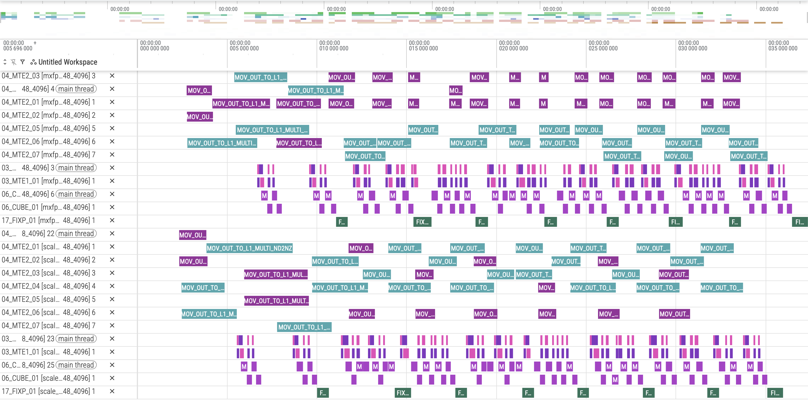

# Scale 缓存特性介绍
## 1. 原理介绍
### 1.1 背景

Scale 矩阵的数据量约为原始输入矩阵的 1/32。当矩阵规模较小时，单次 Scale 搬运的数据量不足以充分发挥带宽性能，导致搬运带宽利用率显著降低。针对该问题，可借助 L1 缓存的剩余空间，提前加载后续所需的 Scale 数据并进行缓存，从而减少 Scale 的搬运频次，有效缓解因单次数据量过小而引起的带宽性能下降。

### 1.2 原理

通过提前将后续 Scale 数据载入 L1，将多次小粒度搬运合并为一次批量传输，使单次搬运数据量达到带宽饱和阈值，从而充分发挥带宽性能。

**原理图如下**：

<div align="center">
  
</div>

## 2. 实践：使用 Scale 缓存优化 quant_matmul_mx 计算性能

### 2.1 代码

下面演示如何修改quant_matmul_mx代码来实现scale缓存：

通过 iter0 判断是否需要搬运 scale，以减少冗余传输；同时，通过将原始的 scaleKL1 预先扩大 scaleKL1Ratio 倍，来控制单次搬运的数据量。

```C++
// 计算每个L1 tile处理的缩放因子在K维上的比例（K维分块数）
uint64_t scaleKL1Ratio = scaleKL1 / kL1;

if (iter0 % scaleKL1Ratio == 0) {
    // 计算当前tile在全局缩放因子张量中的K维起始偏移
    uint64_t scaleKL1Offset = iter0 * kL1;
    
    // 等待MTE1（L2->L1）数据传输完成事件
    AscendC::WaitFlag<AscendC::HardEvent::MTE1_MTE2>(tool::SCALE_BUFFER_FLAG_0 + scaleL1BufId);
    
    // 创建从Global Memory到L1 Memory的拷贝操作对象
    auto CopyScaleGM2L1 = AscendC::Te::MakeCopy(::Tile::CopyScaleGM2L1Atom{});
    
    // 当前tile实际处理的K维长度（边界处理，避免越界）
    uint64_t curScaleKL1 = scaleKL1;
    if (scaleKL1Offset + curScaleKL1 > k) {
        curScaleKL1 = k - scaleKL1Offset;  // 最后一块可能不足完整长度
    }
    
    // 为A矩阵的缩放因子创建L1内存布局（按Z字型布局）
    // 维度：curM × ceil(scaleKL1 / MXFP_GROUP_SIZE)
    // 注意：这里使用MXFP_GROUP_SIZE，每个缩放因子对应一个组
    auto layoutScaleAL1 = AscendC::Te::MakeZzLayout<fp8_e8m0_t>(
        curM, tool::CeilDiv(scaleKL1, tool::MXFP_GROUP_SIZE));
    
    // 在L1内存上创建A矩阵缩放因子的张量视图
    auto tensorScaleAL1Buf = AscendC::Te::MakeTensor(
        AscendC::Te::MakeL1memPtr<fp8_e8m0_t>(l1BufferScaleAOffset[scaleL1BufId]),
        layoutScaleAL1);
    
    // 定义A矩阵缩放因子在Global Memory中的tile形状
    // 起始坐标：(0, scaleKL1Offset / MXFP_GROUP_SIZE)
    // 形状：curM × [ceil(curScaleKL1 / MXFP_DIVISOR_SIZE) * MXFP_MULTI_BASE_SIZE]
    // 注意：这里使用MXFP_DIVISOR_SIZE和MXFP_MULTI_BASE_SIZE进行块对齐计算
    auto tensorScaleAGmTile = ScaleAgm(
        AscendC::Te::MakeCoord(0, scaleKL1Offset / tool::MXFP_GROUP_SIZE),
        AscendC::Te::MakeShape(
            curM, tool::CeilDiv(curScaleKL1, tool::MXFP_DIVISOR_SIZE) * tool::MXFP_MULTI_BASE_SIZE));
    
    // 执行拷贝：将A矩阵缩放因子从Global Memory复制到L1 Memory
    AscendC::Te::Copy(CopyScaleGM2L1, tensorScaleAL1Buf, tensorScaleAGmTile);
    
    // 为B矩阵的缩放因子创建L1内存布局（按N轴优先布局）
    // 维度：ceil(scaleKL1 / MXFP_GROUP_SIZE) × curN
    auto layoutScaleBL1 = AscendC::Te::MakeNnLayout<fp8_e8m0_t>(
        tool::CeilDiv(scaleKL1, tool::MXFP_GROUP_SIZE), curN);
    
    // 在L1内存上创建B矩阵缩放因子的张量视图
    auto tensorScaleBL1Buf = AscendC::Te::MakeTensor(
        AscendC::Te::MakeL1memPtr<fp8_e8m0_t>(l1BufferScaleBOffset[scaleL1BufId]),
        layoutScaleBL1);
    
    // 定义B矩阵缩放因子在Global Memory中的tile形状
    // 起始坐标：(scaleKL1Offset / MXFP_GROUP_SIZE, 0)
    // 形状：[ceil(curScaleKL1 / MXFP_DIVISOR_SIZE) * MXFP_MULTI_BASE_SIZE] × curN
    auto tensorScaleBGmTile = ScaleBgm(
        AscendC::Te::MakeCoord(scaleKL1Offset / tool::MXFP_GROUP_SIZE, 0),
        AscendC::Te::MakeShape(
            tool::CeilDiv(curScaleKL1, tool::MXFP_DIVISOR_SIZE) * tool::MXFP_MULTI_BASE_SIZE, curN));
    
    // 执行拷贝：将B矩阵缩放因子从Global Memory复制到L1 Memory
    AscendC::Te::Copy(CopyScaleGM2L1, tensorScaleBL1Buf, tensorScaleBGmTile);
}
```

## 3 性能结果对比
### 3.1 case前后性能

<div align="center">
  
</div>

&ensp;&ensp;可以看到，采用 Scale 缓存搬运后，搬运次数减少，带宽利用率提高，这使得整体计算得以提前启动，性能得到了提升。

## 4. 结论
适用场景：

* **K 维规模较小的情况**:当矩阵的 K 维度较小时，单次 Scale 搬运的数据量不足，带宽利用率低，通过缓存合并搬运，可显著提升有效带宽。
* **多 tile 迭代场景**：Scale 缓存可将搬运次数降低，发挥带宽性能优势。

Scale 缓存优化通过将多次小粒度 Scale 搬运合并为一次批量传输，显著减少了搬运次数并提升带宽利用率，尤其适用于 K 维较大且 L1 缓存有充足剩余空间的矩阵乘法场景，是一种以空间换时间的有效性能优化手段。

&ensp;&ensp;通过将L1缓存按Bank边界切分为Ping和Pong两个独立空间，实现地址空间的完全隔离，可从根本上避免L1上的读写冲突，有效保障MTE1带宽利用率和MMAD指令连续性。
## 5.编译 执行

1. 编译样例

从项目根目录启动构建，参考项目[README.md](../../../README.md)

在仓库根目录下完成编译和安装后，进入当前样例目录：
```shell
cmake -S . -B build
cmake --build build --parallel
cmake --install build --prefix ./build_out
cd ./build_out/1_Features/memory_optimization/scale_cache/
```

如需单独编译当前样例，可使用以下指令：
```shell
cmake --build build --target scale_cache
cp ./Samples/1_Features/memory_optimization/scale_cache/scripts/profile_matmul.py ./build/Samples/1_Features/memory_optimization/scale_cache/
cd ./build/Samples/1_Features/memory_optimization/scale_cache/
```

2. 运行样例

使用可执行文件直接执行算子用例，需要指定矩阵乘维度，并随机生成输入数据。
```shell
./scale_cache 1024 2048 4096
```
打印如下执行结果，证明样例执行成功。
```shell
matmul run successfully!
```
如果存在精度问题，则会打印错误数据，并显示如下结果。
```shell
matmul run failed!
```

3. 测试性能
运行性能测试脚本，指定矩阵乘法的维度后执行。
```shell
python3 profile_matmul.py 1024 2048 4096
```
打印如下执行结果，证明样例性能测试成功。
```shell
[Profile Breakdowm]
+------------------+------------+---------+------------+----------+----------+-------------+----------------+
| candidate        | kernel(us) | mac(us) | scalar(us) | mte1(us) | mte2(us) | fixpipe(us) | icache_miss(%) |
+==================+============+=========+============+==========+==========+=============+================+
| scale_cache      |     50.871 |  40.212 |      2.842 |   11.065 |   36.999 |       2.751 |          1.000 |
+------------------+------------+---------+------------+----------+----------+-------------+----------------+
```
与相同规模下的基础 MatMul 算子开启 double-buffer对比：
```shell
[Profile Breakdowm]
+-----------+------------+---------+------------+----------+----------+-------------+----------------+
| candidate | kernel(us) | mac(us) | scalar(us) | mte1(us) | mte2(us) | fixpipe(us) | icache_miss(%) |
+===========+============+=========+============+==========+==========+=============+================+
| n_buffer  |     66.000 |  40.810 |      2.558 |   10.659 |   37.595 |       1.980 |          1.200 |
+-----------+------------+---------+------------+----------+----------+-------------+----------------+
```
可以看到，整体计算时间缩短，性能有所提升。

## 6. 支持架构

NPU ARCH 3510