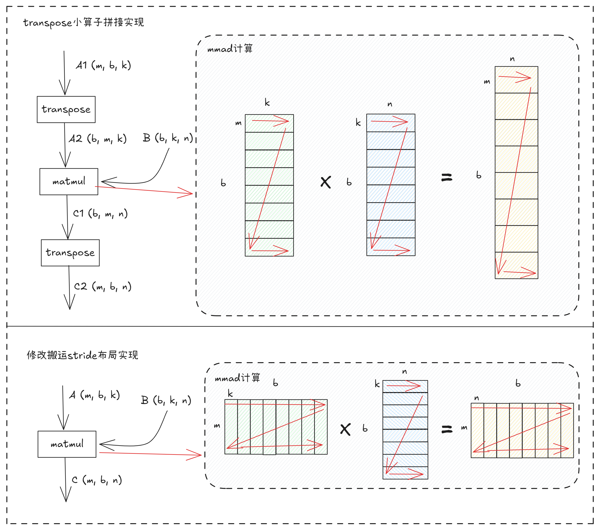
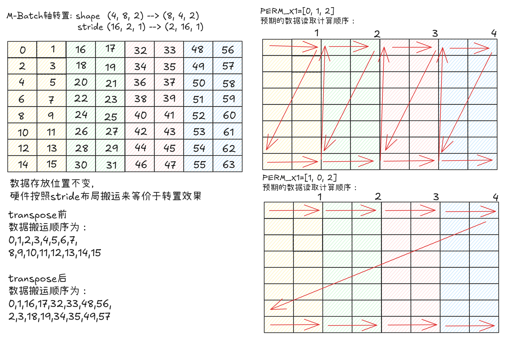

# TransposeBatchMatMul 特性介绍
## 1. 原理介绍
### 1.1 背景

&ensp;&ensp;在 Attention、RNN 等场景中，BatchMatMul 的输入往往不是算子默认的排布：A 矩阵可能以 `[m, batch, k]` 形式存放（batch 与 M 维互换），B 矩阵可能以 `[batch, n, k]` 形式存放（K 与 N 维互换）。常规做法是先调用一次独立的 Transpose 算子把输入重排为 `[batch, m, k]` 与 `[batch, k, n]`，再执行 BatchMatMul。

&ensp;&ensp;这种"显式转置 + BMM"的方式存在明显的访存开销：转置算子需要把整张矩阵从 GM 读出再写回，相当于一次全量数据的额外搬运，在大 batch、大 K 场景下 MTE2 带宽与显存压力都会显著上升。

&ensp;&ensp;当前MM计算单元支持对输入输出进行重排搬运，与转置的效果一致，只通过修改搬运排布实现无损转置：
<div align="center">
  
</div>

### 1.2 原理

&ensp;&ensp;针对上述问题，本样例实现 TransposeBatchMatMul（TBMM），借助 Tensor API 的 Layout 抽象，把输入的转置排布直接编码进 GM→L1 的搬运指令中，由硬件按目标 stride 访问，从而省去显式 Transpose 算子，避免一次全量 GM 读写。

&ensp;&ensp;**跨 stride 搬运示意图**（以 A 矩阵 `[m, batch, k]` 为例，batch=4, m=8, k=2）：
<div align="center">
  
</div>

**隐含约束**：
* stride 取值必须与 shape 和 Hardware C0 对齐要求兼容，不能导致非对齐访存；
* 对于 B 矩阵，Layout 模板（`NDExtLayoutPtn` / `DNExtLayoutPtn`）决定了 L1 中的分形排布，需和后续 L1→L0 搬运的模板一致。

&ensp;&ensp;算子通过 perm_x1 / perm_x2 参数描述 A / B 矩阵各维度的重排方式，其中 `[0, 1, 2]` 分别对应 `[batch, m, k]`（A）或 `[batch, k, n]`（B）：

| 参数 | 取值 | 排布（perm） | 实际形状 | 含义 |
|------|------|------------|---------|------|
| perm_x1 | 0 | `[0, 1, 2]` | `A=[batch, m, k]` | A 不转置 |
| perm_x1 | 1 | `[1, 0, 2]` | `A=[m, batch, k]` | A 的 batch 与 M 维互换 |
| perm_x2 | 0 | `[0, 1, 2]` | `B=[batch, k, n]` | B 不转置 |
| perm_x2 | 1 | `[0, 2, 1]` | `B=[batch, n, k]` | B 的 K 与 N 维互换 |

&ensp;&ensp;此外，算子把 batch 维纳入多核 block 调度（`totalBlockNums = mBlockNums × nBlockNums × batch`），当 M×N 较小、batch 较大时也能填满多核；并支持 `batchSplitFactor` 将输出 reshape 为 `[bsf, m, innerBatch×n]`，便于下游按 batch 分组消费。

## 2. 实践：用 Layout 描述转置的 BatchMatMul

### 2.1 代码

以 BatchMatMul 为例，以下几处关键改动可实现 TBMM：

```C++
template <typename T, uint64_t PERM_X1, bool TRANS_B>
__global__ __aicore__ void TbmmKernel(GM_ADDR aGm, GM_ADDR bGm, GM_ADDR cGm,
                                      uint32_t m, uint32_t n, uint32_t k, uint32_t batch,
                                      uint32_t batchSplitFactor) {
    constexpr bool TRANS_BATCH_A = (PERM_X1 == PERM_X1_1_0_2);

    // 1. 根据 PERM_X1 构造 A 的 GM Layout：通过 stride 描述 batch-M 是否互换
    //    TRANS_BATCH_A=true  → A=[m, batch, k]
    //    TRANS_BATCH_A=false → A=[batch, m, k]
    uint64_t batchStrideA = TRANS_BATCH_A ? k : m * k;
    uint64_t mStrideA = TRANS_BATCH_A ? batch * k : k;
    auto layoutA = MakeNDBatchLayout<T>(batch, m, k, batchStrideA, mStrideA);

    // 2. 根据 PERM_X2 选择 B 的 Layout 模板：K-N 是否互换
    //    TRANS_B=true  → B=[batch, n, k]，使用 DNExtLayoutPtn
    //    TRANS_B=false → B=[batch, k, n]，使用 NDExtLayoutPtn
    using BGmLayoutPtn = AscendC::Std::conditional_t<TRANS_B,
                          AscendC::Te::DNExtLayoutPtn, AscendC::Te::NDExtLayoutPtn>;
    using MakeBLayout = AscendC::Te::FrameLayoutFormat<BGmLayoutPtn, AscendC::Std::Int<AscendC::Te::C0_ELEMENT<T>>>;
    auto layoutB = MakeBLayout{}(batch, k, n);

    // 3. 输出固定为 [m, batch, n]；batchSplitFactor>1 时 reshape 为 [bsf, m, innerBatch*n]
    uint64_t innerBatch = batch / batchSplitFactor;
    auto splitBatchLayoutC = ...;  // 详见 main.asc

    // 4. 多核调度：batch 维参与 block 总数，自然实现 batch 维并行
    uint64_t totalBlockNums = mBlockNums * nBlockNums * batch;
    for (uint64_t blockIdx = curBlockIdx; blockIdx < totalBlockNums; blockIdx += blockNum) {
        uint64_t curBatchIdx = blockIdx / mnBlockNums;
        uint64_t mnIdx = blockIdx % mnBlockNums;
        uint64_t blockM = mnIdx / nBlockNums;
        uint64_t blockN = mnIdx % nBlockNums;
        ...
        // GM→L1 搬运时，A/B 的 Slice 按上面构造的 stride 自动跳步访问，
        // 等价于在搬运过程中完成转置，无需额外 Transpose 算子
        AscendC::Te::Copy(copyGM2L1, l1BlockA, gmTileA);
        AscendC::Te::Copy(copyGM2L1, l1BlockB, gmTileB);
        ...
    }
}
```

**关键改动点**：

* **以 Layout 描述代替显式转置**：通过 `MakeNDBatchLayout` 的 stride 参数与 `NDExtLayoutPtn`/`DNExtLayoutPtn` 模板选择，把 A、B 的转置信息编码进 Layout，搬运指令直接按目标 stride 从 GM 取数，省去一次全量 GM 读写。
* **batch 维参与多核调度**：`totalBlockNums = mBlockNums × nBlockNums × batch`，当 M×N 较小、batch 较大时，batch 维提供更多 block 填满多核。
* **输出排布与下游对齐**：输出固定为 `[m, batch, n]`，配合 `batchSplitFactor` 可 reshape 为 `[bsf, m, innerBatch×n]`，便于后续算子按 batch 分组消费。

### 2.2 修改注意点

* **PERM_X1 / PERM_X2 取值约束**：仅支持 0/1 两种取值（对应上述两种排布），其他排布需要扩展 Layout 构造逻辑。
* **batchSplitFactor 必须整除 batch**：当 `batchSplitFactor > 1` 时，要求 `batch % batchSplitFactor == 0`，否则 reshape 后输出形状不连续。
* **L1 / L0 ping-pong 空间**：模板沿用 L1 半容量切分（`TOTAL_L1_SIZE >> 1`）与 L0 半容量切分（`HALF_L0_SIZE`）来避免 bank 冲突，调整 baseM/baseN/baseK 时需保证单份 tile 不超过半区。

## 3. 性能结果对比
### 3.1 case 前后性能

&ensp;&ensp;以 `M=32, K=512, N=128, batch=16, perm_x1=1, perm_x2=0` 的规模为例，对比"显式 Transpose + 基础 BMM"与"TBMM（Layout 内嵌转置）"两种实现。Profiling 结果表明，TBMM 由于省去了一次全量 GM 读写，MTE2 搬运量显著下降，整体 kernel 耗时缩短。
```shell
显式 Transpose + 基础 BMM结果：
[Profile Breakdown]
+---------------------------------------------------------+------------+---------+------------+----------+----------+-------------+----------------+
| shape                                                   | kernel(us) | mac(us) | scalar(us) | mte1(us) | mte2(us) | fixpipe(us) | icache_miss(%) |
+=========================================================+============+=========+============+==========+==========+=============+================+
| m=32,k=512,n=128,b=16,px1=1,px2=0,bsf=1                 |     22.476 |   0.512 |      2.115 |    0.411 |    7.047 |       3.967 |          8.500 |
+---------------------------------------------------------+------------+---------+------------+----------+----------+-------------+----------------+
```

```shell
TBMM（Layout 内嵌转置）结果：
[Profile Breakdown]
+---------------------------------------------------------+------------+---------+------------+----------+----------+-------------+----------------+
| shape                                                   | kernel(us) | mac(us) | scalar(us) | mte1(us) | mte2(us) | fixpipe(us) | icache_miss(%) |
+=========================================================+============+=========+============+==========+==========+=============+================+
| m=32,k=512,n=128,b=16,px1=1,px2=0,bsf=1                 |     16.928 |   0.457 |      1.588 |    0.408 |    5.822 |       3.687 |          9.000 |
+---------------------------------------------------------+------------+---------+------------+----------+----------+-------------+----------------+
```

## 4. 结论
适用场景：

* **输入需要转置的 BatchMatMul**：A 或 B 的排布与 BMM 默认排布不一致时，直接通过 Layout 描述转置，避免显式 Transpose 算子带来的额外搬运与显存。
* **M×N 较小但 batch 较大**：batch 维参与 tile 调度，提供更多 tile 填满多核，避免硬件闲置。
* **下游需要 `[m, batch, n]` 排布**：如 Attention 链路，固定输出排布可减少后续算子的转置。

&ensp;&ensp;TransposeBatchMatMul 通过 Layout 抽象把转置语义内嵌到 GM→L1 搬运指令中，省去显式转置算子的全量搬运转写开销；同时将 batch 维纳入多核调度并支持 batch 分组输出，有效提升整体访存效率与硬件利用率。

## 5. 编译 执行

1. 编译样例

从项目根目录启动构建，参考项目[README.md](../../../../README.md)

在仓库根目录下完成编译和安装后，进入当前样例目录：
```shell
cmake -S . -B build -DNPU_ARCH=dav-3510
cmake --build build --parallel
cmake --install build --prefix ./build_out
cd ./build_out/1_Features/memory_optimization/transpose_batch_matmul/
```

如需单独编译当前样例，可使用以下指令：
```shell
cmake --build build --target transpose_batch_matmul
cp ./Samples/1_Features/memory_optimization/transpose_batch_matmul/scripts/* ./build/Samples/1_Features/memory_optimization/transpose_batch_matmul/
cd ./build/Samples/1_Features/memory_optimization/transpose_batch_matmul/
```

2. 运行样例

使用可执行文件直接执行算子用例，需要指定矩阵乘维度与转置/切分参数，并随机生成输入数据。
```shell
./transpose_batch_matmul 32 512 128 16 1 0 1
```
参数说明：
* `m k n batch`：矩阵乘的 M、K、N 维与 batch 维
* `perm_x1`：0=[0,1,2]（不转置），1=[1,0,2]（A 的 batch-M 互换），默认 1
* `perm_x2`：0=[0,1,2]（不转置），1=[0,2,1]（B 的 K-N 互换），默认 0
* `batch_split_factor`：1=不切分，>1=按 batch 切分输出（需整除 batch），默认 1

运行成功后，终端将打印如下类似信息：
```txt
Data generated successfully!

[verify] shape=(32, 2048), elements=65536 - summary (large matrix, full tensors omitted)
  abs_err: max=..., mean=..., rmse=...
  ...
max abs diff: ...
point error count(>0.1): 0/65536
ratio error count(>0.001): .../65536, error ratio: ...
[PASS] NPU results are consistent with CPU.
```
如果存在精度问题，则会打印错误数据，并显示如下结果。
```txt
[ERROR] NPU results differ from CPU.
```

3. 测试性能
运行性能测试脚本，指定矩阵乘法的维度与转置/切分参数后执行。
```shell
python3 profile_matmul.py 32 512 128 16 1 0 1
```
打印如下执行结果，证明样例性能测试成功。
```shell
[Profile Breakdown]
+---------------------------------------------------------+------------+---------+------------+----------+----------+-------------+----------------+
| shape                                                   | kernel(us) | mac(us) | scalar(us) | mte1(us) | mte2(us) | fixpipe(us) | icache_miss(%) |
+=========================================================+============+=========+============+==========+==========+=============+================+
| m=32,k=512,n=128,b=16,px1=1,px2=0,bsf=1                 |     xx.xxx |  xx.xxx |      x.xxx |    x.xxx |    x.xxx |       x.xxx |           x.xx |
+---------------------------------------------------------+------------+---------+------------+----------+----------+-------------+----------------+
```
可以看到，相较于"显式 Transpose + 基础 BMM"方案，TBMM 由于减少了全量 GM 搬运，MTE2 耗时下降，整体计算时间缩短。

## 6. 支持架构

NPU ARCH 3510