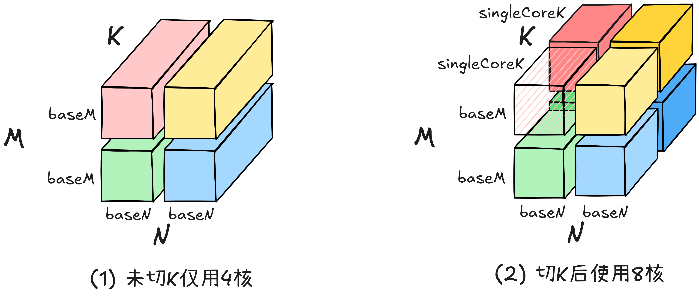
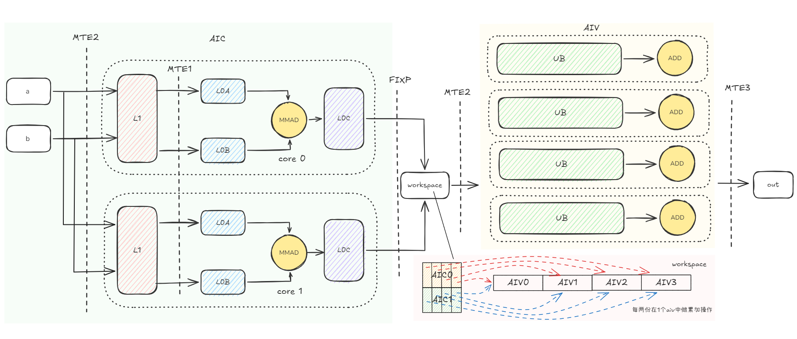
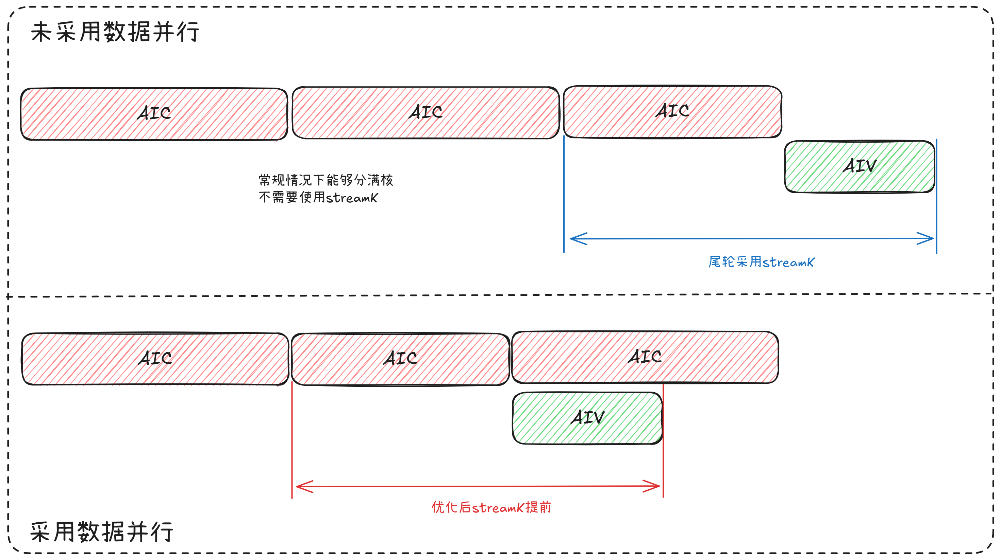
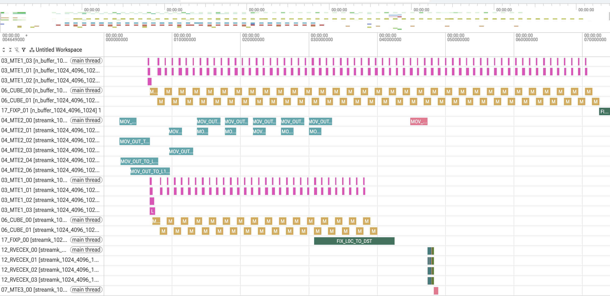

# streamk特性介绍
## 1. 原理介绍
### 1.1 背景

&ensp;&ensp;当矩阵规模可被单核承载时，采用负载均衡策略将计算任务分散至多核，通常能够提升计算效率。然而，若沿矩阵的 m 方向和 n 方向进行切分，则会破坏原有最优的数据搬运模式。具体而言，MTE2总的数据搬运量可表示为 $M \cdot K \cdot (N / \text{baseN}) + N \cdot K \cdot (M / \text{baseM})$ 。在M和N方向切分基本块的计算会导致原有的数据重复搬运开销增加。针对该问题，可采用 Stream-K 策略进行优化，即通过沿 k 方向进行切分，从而避免破坏原有的数据搬运策略。

<div align="center">
  
</div>

### 1.2 原理

&ensp;&ensp;在不改变切分策略的前提下，为了将计算负载均衡到其他计算核心上，可以将任务划分为 k 份，分别在不同的核心上并行计算。随后，将各个计算块的中间结果搬运到外部内存，再统一搬移到统一缓冲区（UB）中进行累加，从而获得最终的计算结果。

<div align="center">
  
</div>

&ensp;&ensp;在最后一轮计算中，AIC 完全空闲，需要等待 AIV 计算结束。而 DPSK（Data-Parallel Streamk）策略将最后一轮的 AIC 计算提前执行，从而实现 AIC 与 AIV 的数据并行计算。当 AIV 进行累加计算时，不会影响最后一轮 AIC 的执行。流水线对比如下图所示。

<div align="center">
  
</div>

## 2. 实践：使用Stream-K策略来优化matmul计算性能

### 2.1 代码

#### 2.1.1 AIC与AIC逻辑分离

&ensp;&ensp;通过条件编译实现了AIC与AIV的逻辑分离。其中，__mix__(1,2) 标识核函数同时包含两类计算单元的代码。AIC侧负责控制核间同步标志（CrossCoreSetFlag），AIV侧则等待对应标志（CrossCoreWaitFlag）就绪后执行向量计算，从而协同完成矩阵乘法任务。

```C++
template <typename T>
__global__ __aicore__ __mix__(1, 2) void MatmulKernel(
    GM_ADDR aGm, GM_ADDR bGm, GM_ADDR cGm, GM_ADDR workspaceGm, uint32_t m, uint32_t k, uint32_t n)
{
    // -------------------- AIC 逻辑（AI Core） --------------------
    if ASCEND_IS_AIC {
        // 计算实际参与运算的核心数：取任务总块数与可用核心数的最小值
        uint64_t usedCoreNum = tileNum < blockNum ? tileNum : blockNum;
        // 若当前核心索引超出有效核心范围，则该核心不参与实际计算
        if (curBlockIdx >= usedCoreNum) {
            AscendC::CrossCoreSetFlag<tool::AIC_SYNC_AIV_MODE_4, PIPE_FIX>(tool::AIC_SYNC_AIV_FLAG);
            AscendC::CrossCoreSetFlag<tool::AIC_SYNC_AIV_MODE_4, PIPE_FIX>(tool::AIC_SYNC_AIV_FLAG + tool::FLAG_ID_MAX);
            return;
        }
        // 后续AIC计算逻辑代码

        // 若当前分片索引超出总分片数，同样设置同步标志后提前返回
        if (tileIdx + blockNum >= tileNum) {
            AscendC::CrossCoreSetFlag<tool::AIC_SYNC_AIV_MODE_4, PIPE_FIX>(tool::AIC_SYNC_AIV_FLAG);
            AscendC::CrossCoreSetFlag<tool::AIC_SYNC_AIV_MODE_4, PIPE_FIX>(tool::AIC_SYNC_AIV_FLAG + tool::FLAG_ID_MAX);
        }
    }
    // -------------------- AIV 逻辑（AI Vector Core） --------------------
    if ASCEND_IS_AIV {
        // 判断当前AIV核心是否已完成所有预期的循环轮次（lastLoopTotalCnt * 任务分配比）
        if (curBlockIdx >= lastLoopTotalCnt * AscendC::GetTaskRation()) {
            AscendC::CrossCoreWaitFlag<tool::AIC_SYNC_AIV_MODE_4, PIPE_MTE3>(tool::AIC_SYNC_AIV_FLAG);
            AscendC::SyncAll();
            return;
        }

        // 常规AIV计算路径：等待AIC标志就绪，再进行向量计算
        AscendC::CrossCoreWaitFlag<tool::AIC_SYNC_AIV_MODE_4, PIPE_MTE3>(tool::AIC_SYNC_AIV_FLAG);
        AscendC::SyncAll();
        // 后续AIV计算逻辑代码
    }
}
```

#### 2.1.2 workspace设置

&ensp;&ensp;Workspace 是位于全局内存（GM）中的中转缓冲区，用于 AIC 与 AIV 之间的数据交互。每个 AIC 核心在完成自身 K 轴累加后，会将 L0C 中的部分累加结果通过 CopyL0C2GM 操作写入各自**独立开辟**的 Workspace 空间。写入过程按 (mTileNum, nTileNum, skKTileNum) 的三维分块进行组织，每块大小为 BLOCK_BASE_M × BLOCK_BASE_N，从而确保数据互不覆盖。

&ensp;&ensp;随后，AIV 核心从 Workspace 中读取这些中间结果，并搬运至本地 UB 中，完成逐次累加，从而保证累加结果的**确定性**。假设将 K 轴切分为两份进行计算，则可以按照 AIC 与 AIV 的配比来分配每次需要放入 AIV 中累加的 AIC 计算数据。例如，当配比为 2（即每个 AIC 对应两个 AIV）时，可将每两份 K 切分计算得到的 AIC 结果进行进一步划分，划分的数量等于“切 K 数量 × AIC 与 AIV 配比”。

```C++
template <typename T>
__global__ __aicore__ __mix__(1, 2) void MatmulKernel(
    GM_ADDR aGm, GM_ADDR bGm, GM_ADDR cGm, GM_ADDR workspaceGm, uint32_t m, uint32_t k, uint32_t n)
{
    // -------------------- AIC 逻辑（AI Core） --------------------
    // AIC 负责执行矩阵乘法的核心计算，并将中间结果写入 workspace
    if ASCEND_IS_AIC {
        // 将 workspace 指针转换为全局内存浮点指针，便于后续地址计算
        __gm__ float* workspaceGmAddr = reinterpret_cast<__gm__ float*>(workspaceGm);
        // 计算 K 维度上的分块数（每个 block 在 K 轴上被切分的份数）
        uint64_t skKTileNum = blockNum / (mTileNum * nTileNum);

        // 循环遍历当前核心负责的所有 tile（步长为 blockNum，实现负载均衡）
        for (uint64_t tileIdx = curBlockIdx; tileIdx < tileNum; tileIdx += blockNum) {

            // 计算当前 tile 在 K 维度上的分块索引
            uint64_t kTileIdx = (tileIdx % blockNum) % skKTileNum;
            // 计算当前 tile 在 workspace 中的偏移量
            // 布局逻辑：(mTileIndex, nTileIndex, kTileIndex) 三维映射到线性地址
            int64_t offsetWorkspace = (((tileIdx % blockNum) / skKTileNum) * skKTileNum + kTileIdx) * 
                                       tool::BLOCK_BASE_M * tool::BLOCK_BASE_N;
            // 构建 workspace 张量对象（GM 内存视图）
            auto gmWorkSpace =
                AscendC::Te::MakeTensor(AscendC::Te::MakeGMmemPtr(workspaceGmAddr + offsetWorkspace), layoutWorkspace);
           
            for (uint64_t iter0 = 0; iter0 < kL1TileNum; ++iter0) {
                // L0 层内部迭代（实际的计算/搬运操作）
                for (uint16_t iter1 = 0; iter1 < kL0IterNum; ++iter1) {
                    // 矩阵乘计算核心逻辑
                }
                // 当 K 维度的最后一轮迭代完成时，将 L0C 中的累加结果搬运到 workspace
                if (iter0 + 1 == kL1TileNum) {
                    // 创建 L0C 到 GM 的拷贝操作
                    auto CopyL0C2GM = AscendC::Te::MakeCopy(AscendC::Te::CopyL0C2GM{});
                    // 执行拷贝：将 L0C 中的数据写入 workspace 指定偏移位置
                    // FINAL_ACCUMULATION 表示这是最终累加结果，需要写回
                    AscendC::Te::Copy(
                        CopyL0C2GM, gmWorkSpace, tensorL0C, 
                        AscendC::Te::FixpipeParams{tool::FINAL_ACCUMULATION});
                }
            }
        }
    }

    // -------------------- AIV 逻辑（AI Vector Core） --------------------
    // AIV 负责从 workspace 中读取 AIC 产生的中间结果，进行后续向量化处理
    if ASCEND_IS_AIV {
        // 计算当前 AIV 核心需要读取的 workspace 起始地址偏移量
        // 公式含义：
        // - newBlockIdx * skKTileNum * BLOCK_BASE_M * BLOCK_BASE_N: 按 block 索引到对应分区
        // - kTileIdx * mBurstBase * curN: 按 K 分块和 burst 维度进一步定位
        // - copyGm2UbParams_.mBurst * index: 按 burst 索引计算具体数据块偏移
        copyGm2UbParams_.offsetWorkspaceGM = 
            newBlockIdx * skKTileNum * tool::BLOCK_BASE_M * tool::BLOCK_BASE_N +
            (kTileIdx * mBurstBase + copyGm2UbParams_.mBurst * index) * curN;
        
        // 计算其他搬运参数（如搬运长度、burst 配置等，原代码省略）
        // ... 参数计算逻辑 ...
        
        // 执行 GM 到 UB（统一缓冲区）的数据搬运
        // 将 workspace 中指定偏移的数据搬运到 ubAddTensor（UB 上的张量）
        DataCopyPad<float>(
            ubAddTensor,                           // 目标：UB 上的张量
            workspaceGlobal_[copyGm2UbParams_.offsetWorkspaceGM],  // 源：workspace 中的指定位置
            dataCopyExtParams,                     // 搬运扩展参数（长度、步长等）
            {false, 0, 0, 0});                    // 对齐/填充参数
        
        // 后续 AIV 向量计算逻辑
        // ...
    }
}
```

#### 2.1.3 分核且坐标重设

&ensp;&ensp;切k后需要通过将线性 tile 索引重新映射为 (mTileIdx, nTileIdx, kTileIdx) 三维坐标，并处理尾块边界，实现了任务在多核间的均匀分配以及 AIC 与 AIV 之间的坐标统一。

```C++
template <typename T>
__global__ __aicore__ __mix__(1, 2) void MatmulKernel(
    GM_ADDR aGm, GM_ADDR bGm, GM_ADDR cGm, GM_ADDR workspaceGm, uint32_t m, uint32_t k, uint32_t n)
{
    // -------------------- AIC 逻辑（AI Core） --------------------
    // AIC 负责执行矩阵乘法的核心计算，并将中间结果写入 workspace
    if ASCEND_IS_AIC {
        
        // 计算尾块（不足一个完整 block）的 (M, N) 分块数量
        // tileNum 为总 (M, N) 分块数，blockNum 为每个 block 处理的 (M, N) 块数
        // 如果当前 tileNum 小于 blockNum，则全部为尾块；否则取余数部分
        int64_t tailMNTileNum = tileNum < blockNum ? tileNum : tileNum % blockNum;
        uint64_t totalMNTileNumInDP = tileNum - tailMNTileNum;
        tileNum = totalMNTileNumInDP + tailMNTileNum * skKTileNum;
        int64_t tailSKTotalTileNum = tailMNTileNum * skKTileNum;
        
        // 更新总 tile 数：原 tileNum 乘以 K 轴分片数，使循环覆盖所有 K 分片
        tileNum = tileNum * skKTileNum;

        // (M,N)块数较少时，增大K轴切分，提高并行度
        if(tileNum <= blockNum / 2) {
            skKTileNum = blockNum / tileNum;          // K轴切分数 = 总核数 / 块数
            skKSingleCore = CeilDiv(k, skKTileNum);   // 每核处理K长度
        } 
        // (M,N)块数较多时，基于尾块计算切分，并向上取整保证整除
        else {
            skKTileNum = blockNum / (tileNum % blockNum);
            skKSingleCore = CeilDiv(k, skKTileNum);
            skKTileNum = CeilDiv(k, skKSingleCore);   // 反推实际切分数
        }
        
        // 遍历当前核心负责的所有 tile（步长为 blockNum，实现任务轮流分配）
        for (uint64_t tileIdx = curBlockIdx; tileIdx < tileNum; tileIdx += blockNum) {

            // ----- 坐标重映射：从线性 tileIdx 解算出三维分块索引 -----
            
            int64_t tmpTileIdx = tileIdx;

            // SK Preload in DP+SK 模式下的索引重映射 实现AIC和AIV计算并行
            if (!tool::CheckIsSkScene(0, blockNum, tileNum)) {
                // 尾块区域且位于倒数第二个循环批次：往后推一个批次计算
                if (tileIdx % usedCoreNum < tailSKTotalTileNum &&
                    (CeilDiv(tileIdx + 1, usedCoreNum) == (CeilDiv(tileNum, usedCoreNum) - 1))) {
                    tmpTileIdx = tileIdx + usedCoreNum;
                } 
                // 尾块区域且位于最后一个循环批次：往前推一个批次计算
                else if (tileIdx % usedCoreNum < tailSKTotalTileNum &&
                        (CeilDiv(tileIdx + 1, usedCoreNum) == CeilDiv(tileNum, usedCoreNum))) {
                    tmpTileIdx = tileIdx - usedCoreNum;
                }
            }

            // 判断当前是否为SK场景（K轴切分），决定K轴块数
            uint64_t curKTileNum = tool::CheckIsSkScene(tmpTileIdx, blockNum, tileNum) ? skKTileNum : 1;

            if (tool::CheckIsSkScene(tmpTileIdx, blockNum, tileNum)) { 
                // SK场景：K轴分片 + (M,N)块来自尾块区
                kTileIdx = (tmpTileIdx % usedCoreNum) % curKTileNum;
                mnIdxInCurLoop = (tmpTileIdx % usedCoreNum) / curKTileNum + totalMNTileNumInDP;
            } else { 
                // DP场景：无K轴切分
                kTileIdx = 0;
                mnIdxInCurLoop = tmpTileIdx / curKTileNum;
            }

            // 将(M,N)块索引进一步分解为M维索引和N维索引
            uint64_t mTileIdx = mnIdxInCurLoop / nTileNum;
            uint64_t nTileIdx = mnIdxInCurLoop % nTileNum;
            
            // ----- 根据是否为尾块，确定实际处理的矩阵维度（处理边界对齐）-----
            int64_t curM = mTileIdx == (mTileNum - 1) ? tailBaseM : baseM;
            int64_t curN = nTileIdx == (nTileNum - 1) ? tailBaseN : baseN;
            int64_t curSK = kTileIdx == (skKTileNum - 1) ? tailKSingleCore : skKSingleCore;
           
            // 后续 K 维度 L1/L0 层循环计算（此处省略具体实现）
            for (uint64_t iter0 = 0; iter0 < kL1TileNum; ++iter0) {
                // 矩阵乘累加计算逻辑
                // ...
            }
        }
    }

    // -------------------- AIV 逻辑（AI Vector Core） --------------------
    // AIV 负责从 workspace 中读取 AIC 产生的中间结果并进行向量化后处理
    if ASCEND_IS_AIV {
        // ----- AIV 侧的坐标重新设置（与 AIC 侧的映射规则保持一致）-----
        
        // newBlockIdx: 重新映射后的块索引（对应 M-N 平面上的块编号）
        // 计算方式：当前核心索引 curBlockIdx 除以 (任务分配比 × K轴分片数)
        // AscendC::GetTaskRation() 获取任务分配比率（AIV 核心数 / AIC 核心数）
        uint64_t newBlockIdx = curBlockIdx / (AscendC::GetTaskRation() * skKTileNum);
        
        // kTileIdx: 重新映射后的 K 维度分块索引
        // 通过对 (任务分配比 × K轴分片数) 取模得到
        uint64_t kTileIdx = curBlockIdx % (AscendC::GetTaskRation() * skKTileNum);
        uint64_t cGmIndex = newBlockIdx + (mTileNum * nTileNum - (mTileNum * nTileNum) % blockNum);
        uint64_t mTileIdx = cGmIndex / nTileNum;
        uint64_t nTileIdx = cGmIndex % nTileNum;
        
        // 后续 AIV 计算逻辑（从 workspace 读取数据、向量累加等）
        // ...
    }
}
```

**关键改动点**:

* **AIC与AIV逻辑分离**：通过条件编译分离AIC与AIV逻辑，AIC侧设置同步标志，AIV侧等待标志就绪后执行向量计算，并增加越界保护防止死锁。
* **workspace设置**：workspace作为GM中的三维分块缓冲区，AIC将L0C累加结果按线性映射地址写入，AIV再从workspace搬运数据到UB进行后续处理。
* **分核坐标设计**：通过将线性tile索引重映射为(mTileIdx, nTileIdx, kTileIdx)三维坐标并处理尾块边界，实现任务在多核间的均匀分配及AIC/AIV坐标统一。


## 3 性能结果对比
### 3.1 case前后性能

<div align="center">
  
</div>

&ensp;&ensp;由上述仿真流水图可以看出，通过切分K维度并分配至多核计算，有效提升了计算效率，从而整体上提前了流水时序。

## 4. 结论

**适用场景**：
* **多核负载不均**：当各计算核心因任务分配不均而导致部分核心空闲、整体利用率偏低时，Stream-K 通过在 K 维度上进行细粒度切分并将子任务均匀分配到各核心，从而有效提升多核利用率和计算吞吐量。
* **大k场景**：当矩阵的 K 维度较大（如 K ≥ 8192）时，单核独立承载完整的计算任务计算效率低。Stream-K 能够将计算负载切分到多个核心并行处理，充分利用多核资源实现加速。

Stream-K 策略通过在不改变原有切分策略的前提下，将 K 维度进一步切分并均匀分配至多个核心，配合 workspace 中转机制实现 AIC 与 AIV 的高效协同，有效解决了多核负载不均和大 K 场景下的计算瓶颈。

## 5.编译 执行

1. 编译样例

从项目根目录启动构建，参考项目[README.md](../../../README.md)

在仓库根目录下完成编译和安装后，进入当前样例目录：
```shell
cmake -S . -B build -DNPU_ARCH=dav-3510
cmake --build build --parallel
cmake --install build --prefix ./build_out
cd ./build_out/1_Features/system_optimization/streamk/
```

如需单独编译当前样例，可使用以下指令：
```shell
cmake --build build --target streamk
cp ./Samples/1_Features/system_optimization/streamk/scripts/* ./build/Samples/1_Features/system_optimization/streamk/
cd ./build/Samples/1_Features/system_optimization/streamk/
```

2. 运行样例

使用可执行文件直接执行算子用例，需要指定矩阵乘维度，并随机生成输入数据。
```shell
./streamk 1024 2048 1024
```
运行成功后，终端将打印如下类似信息：
```txt
Data generated successfully!

[verify] shape(1024, 1024), elements=1048576 - summary (large matrix, full tensors omitted)
  abs_err: max=2.560000e+02, mean=6.103516-03, rmse=1.250000e+00
  rel_err: max=6.410256e-03
  count(|abs_err| > 0.001): 108 / 1048576
  cpu golden (top-left 4x4):
tensor([[40448., 41728., 41472., 41984.],
        [39680., 40704., 40448., 40960.],
        [40192., 41472., 41472., 41984.],
        [40960., 41984., 41728., 42240.]], dtype=torch.bfloat16)
  npu out (top-left 4x4):
tensor([[40448., 41728., 41472., 41984.],
        [39680., 40704., 40448., 40960.],
        [40192., 41472., 41472., 41984.],
        [40960., 41984., 41728., 42240.]], dtype=torch.bfloat16)
max abs diff: 256.0
point error count(>0.1): 0/1048576
ratio error count(>0.001): 25/1048576, error ratio: 0.0000024
[PASS] NPU results are consistent with CPU.
```
如果存在精度问题，则会打印错误数据，并显示如下结果。
```txt
[ERROR] NPU results differ from CPU.
```

3. 测试性能
运行性能测试脚本，指定矩阵乘法的维度后执行。
```shell
python3 profile_matmul.py 1024 2048 1024
```
打印如下执行结果，证明样例性能测试成功。
```shell
[Profile Breakdowm]
+-----------+------------+---------+------------+----------+----------+-------------+----------------+
| candidate | kernel(us) | mac(us) | scalar(us) | mte1(us) | mte2(us) | fixpipe(us) | icache_miss(%) |
+===========+============+=========+============+==========+==========+=============+================+
| streamk   |     23.423 |  12.776 |      1.954 |   4.009  |   11.701 |       9.391 |          4.000 |
+-----------+------------+---------+------------+----------+----------+-------------+----------------+
```
与相同输入规模下的基础开db的 matmul 算子相比：
```shell
[Profile Breakdowm]
+-----------+------------+---------+------------+----------+----------+-------------+----------------+
| candidate | kernel(us) | mac(us) | scalar(us) | mte1(us) | mte2(us) | fixpipe(us) | icache_miss(%) |
+===========+============+=========+============+==========+==========+=============+================+
| n_buffer  |     28.455 |  18.479 |      2.148 |   5.984  |   16.761 |       0.950 |          2.900 |
+-----------+------------+---------+------------+----------+----------+-------------+----------------+
```

可以看到，由于整体的计算效率提升，整体计算时间缩短，性能有所提升。

## 6. 支持架构

NPU ARCH 3510