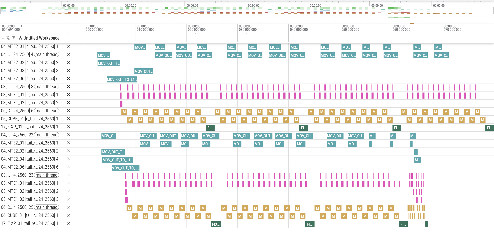

# 尾轮负载均衡特性介绍
## 1. 原理介绍
### 1.1 背景
&ensp;&ensp;在进行算子多核运算时，通常会遇到最后一轮迭代中剩余任务块（block）数量小于可用计算核数量的情况。此时，仅部分计算核参与计算，其余计算核处于闲置状态，导致整体计算效率下降。若能将这些剩余任务进一步拆分，使其均匀分配到所有计算核上并行执行，则可有效提升计算资源利用率，显著改善整体性能。这一数据拆分与重分配的过程，即为尾轮负载均衡。
### 1.2 原理

&ensp;&ensp;将末轮未完全分配的基本块进行重切分，重新计算所需的总核数，并重新分配计算核心，使其均匀分布至各核，从而充分发挥计算核算力。

**原理图如下**：

<div align="center">
  
</div>

&ensp;&ensp;如图所示重新分配基本快到多核后，端到端的计算耗时减少，计算效率提升。

## 2. 实践：使用尾轮负载均衡策略来优化matmul计算性能

### 2.1 代码
&ensp;&ensp;下面以典型添加了SWAT特性的MatMul算子计算代码为例，演示数据切分及均匀分发至各核心的具体实现过程：

#### 2.1.1 计算尾轮基本块需要拆分的数量

&ensp;&ensp;尾轮负载均衡首先需要确定尾块拆分的大小，即明确在M维度和N维度上分别需要切分的块数。以下函数基于当前可用的AI核心数量，计算最优的尾块切分方案：

```C++
// 计算尾块拆分维度
__aicore__ inline void CalcTailBasicBlock(uint64_t mTileNum, uint64_t nTileNum, uint64_t aicNum, 
                                          uint64_t& tailMCnt, uint64_t& tailNCnt)
{
    uint64_t mnCnt = mTileNum * nTileNum;
    uint64_t tailCnt = mnCnt - aicNum * (CeilDiv(mnCnt, aicNum) - 1);
    tailMCnt = 1UL;
    tailNCnt = 1UL;
    if (tailCnt != 0UL) {
        while ((tailMCnt + 1UL) * tailNCnt * tailCnt <= aicNum) {
            tailMCnt += 1UL;
            if (tailMCnt * (tailNCnt + 1UL) * tailCnt <= aicNum) {
                tailNCnt += 1UL;
            }
        }
    }
}

```

#### 2.1.2 多核任务重分配

&ensp;&ensp;尾块拆分后，需要重新计算总任务块数并调整多核分配策略，确保各核心负载均衡。具体实现如下：

```C++
// 重新计算总块数：原始块数 + 尾块拆分后新增的块数
tileNum = tileNum + (tailCnt - 1) * perTailCnt;
// Multi-core tile processing loop - distribute tiles across available cores
for (uint64_t tileIdx = curBlockIdx; tileIdx < tileNum; tileIdx += blockNum) {
    // 多核任务分配循环 - 将任务块均匀分发至各核心
    if (tileIdx / blockNum == (perCoreBlockNum - 1) && tailCnt > 1)
    {
        tileIdx = (perCoreBlockNum - 1) * blockNum + curBlockIdx / tailCnt;
    }

    // 单核计算逻辑
    ...
}
```

#### 2.1.3 尾块坐标重映射

&ensp;&ensp;当处理到末轮拆分的尾块时，需要重新计算当前核心负责的子块在M维度和N维度上的起始坐标与尺寸，确保数据切分的正确性。具体实现如下：

```C++
// 判断是否为尾块拆分场景：最后一个核心且存在尾块拆分
if (tileIdx / blockNum == (perCoreBlockNum - 1) && tailCnt > 1)
{
  // 计算拆分后每个子块在M维度和N维度上的尺寸
    int64_t splitBlkM = tool::CeilDiv(curM, tailMCnt);
    int64_t splitBlkN = tool::CeilDiv(curN, tailNCnt);
    // 计算当前核心在尾块拆分中的索引位置
    int64_t mSplitIdx = (curBlockIdx % tailCnt) % tailMCnt;
    int64_t nSplitIdx = (curBlockIdx % tailCnt) / tailMCnt;
    // 计算子块在M维度和N维度上的起始偏移
    int64_t mSplitOffset = mSplitIdx * splitBlkM;
    int64_t nSplitOffset = nSplitIdx * splitBlkN;
    //跳过那些超出原始维度范围的无效子块
    if (mSplitOffset >= curM || nSplitOffset >= curN) {
        continue;
    }
    // 更新当前子块的实际尺寸（边界处理）
    curM = (curM - mSplitOffset) < splitBlkM ? (curM - mSplitOffset) : splitBlkM;
    curN = (curN - nSplitOffset) < splitBlkN ? (curN - nSplitOffset) : splitBlkN;

    // 重新设置张量GM地址，指向当前子块对应的数据区域
    tensorAGmBlock = tensorAgm(AscendC::Te::MakeCoord(mTileIdx * baseM + mSplitOffset, 0L), AscendC::Te::MakeShape(curM, k));
    tensorBGmBlock = tensorBgm(AscendC::Te::MakeCoord(0L, nTileIdx * baseN + nSplitOffset), AscendC::Te::MakeShape(k, curN));

    tensorCGmBlock =
        tensorCgm(AscendC::Te::MakeCoord(mTileIdx * baseM + mSplitOffset, nTileIdx * baseN + nSplitOffset), AscendC::Te::MakeShape(curM, curN));
    
    // 根据实际输出尺寸重新设置L0C布局
    layoutL0C = AscendC::Te::MakeL0CLayout(curM, curN);  // L0C layout for output
    tensorL0C = AscendC::Te::MakeTensor(AscendC::Te::MakeL0CmemPtr<float>(l0cOffset), layoutL0C);
}

```
**关键改动点**:

* **尾块拆分维度计算**：采用贪心策略，在确保拆分后子块总数不超过可用核心数的前提下，尽可能扩大M、N维度的拆分数量，充分利用闲置核心。
* **多核任务重分配**：重构多核任务分配循环，通过动态更新总块数并增加尾块场景的特殊映射，将末轮任务均匀分发至所有可用核心。
* **尾块坐标重映射**：新增子块索引计算逻辑，根据拆分后的网格位置重新确定当前核心负责的M、N维度起始偏移与数据尺寸，确保张量地址映射的正确性。

## 3 性能结果对比
### 3.1 case前后性能
&ensp;&ensp;以基础MatMul算子为例，在相同输入规模（M=2560, K=1024, N=2560）下进行性能测试，通过Profiling工具采集硬件流水线执行状态。

使用尾轮负载均衡策略优化后：

<div align="center">
  
</div>

&ensp;&ensp;可以看到，经过尾轮负载均衡后，尾轮的计算时间显著缩短，整体计算效率得到提升。

## 4. 结论
适用场景：
* **存在尾轮分配不均匀**：矩阵维度不是基本块大小的整数倍，导致末轮存在不完整分配。

&ensp;&ensp;尾轮负载均衡通过将末轮剩余任务块进一步拆分并均匀分配至所有计算核心，有效消除多核计算中的负载不均问题，在尾块占比较高且核心数较多的场景下，可显著提升计算资源利用率和算子执行性能。

## 5.编译 执行

1. 编译样例

从项目根目录启动构建，参考项目[README.md](../../../README.md)

在仓库根目录下完成编译和安装后，进入当前样例目录：
```shell
cmake -S . -B build
cmake --build build --parallel
cmake --install build --prefix ./build_out
cd ./build_out/1_Features/system_optimization/tail_rebalance/
```

如需单独编译当前样例，可使用以下指令：
```shell
cmake --build build --target tail_rebalance
cp ./Samples/1_Features/system_optimization/tail_rebalance/scripts/profile_matmul.py ./build/Samples/1_Features/system_optimization/tail_rebalance/
cd ./build/Samples/1_Features/system_optimization/tail_rebalance/
```

2. 运行样例

使用可执行文件直接执行算子用例，需要指定矩阵乘维度，并随机生成输入数据。
```shell
./tail_rebalance 1024 2048 4096
```
打印如下执行结果，证明样例执行成功。
```shell
matmul run successfully!
```
如果存在精度问题，则会打印错误数据，并显示如下结果。
```shell
matmul run failed!
```

3. 测试性能
运行性能测试脚本，指定矩阵乘法的维度后执行。
```shell
python3 profile_matmul.py 1024 2048 4096
```
打印如下执行结果，证明样例性能测试成功。
```shell
[Profile Breakdowm]
+-----------+------------+---------+------------+----------+----------+-------------+----------------+
| candidate | kernel(us) | mac(us) | scalar(us) | mte1(us) | mte2(us) | fixpipe(us) | icache_miss(%) |
+===========+============+=========+============+==========+==========+=============+================+
| matmul    |     82.135 |  41.781 |      1.863 |   10.539 |   33.148 |       2.132 |          2.500 |
+-----------+------------+---------+------------+----------+----------+-------------+----------------+
```
与相同输入规模下的基础 matmul 算子相比：
```shell
[Profile Breakdowm]
+-----------+------------+---------+------------+----------+----------+-------------+----------------+
| candidate | kernel(us) | mac(us) | scalar(us) | mte1(us) | mte2(us) | fixpipe(us) | icache_miss(%) |
+===========+============+=========+============+==========+==========+=============+================+
| matmul    |     86.870 |  43.804 |      1.850 |   12.997 |   51.857 |       2.970 |          2.200 |
+----
可以看到，由于尾轮的计算效率提升，整体计算时间缩短，性能有所提升。
```

## 6. 支持架构

NPU ARCH 3510