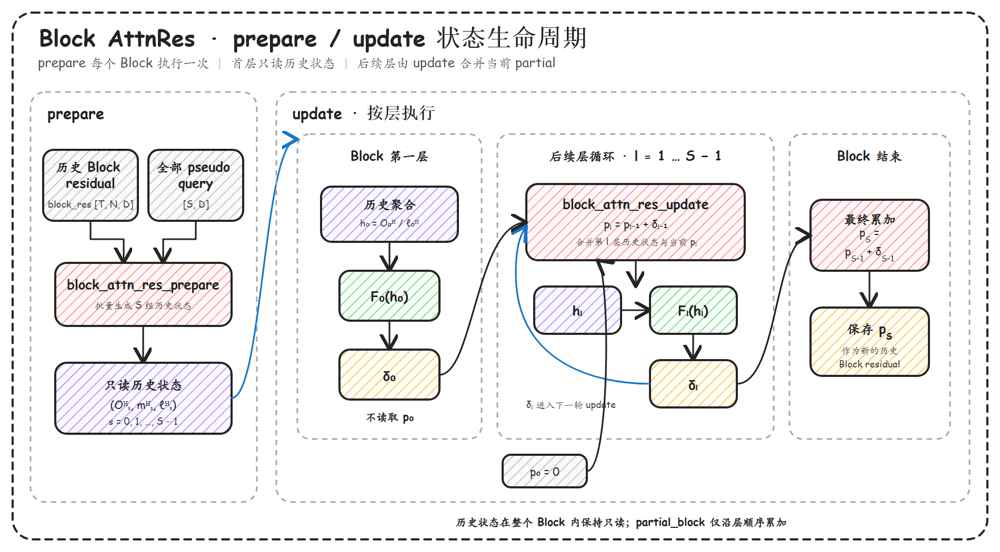
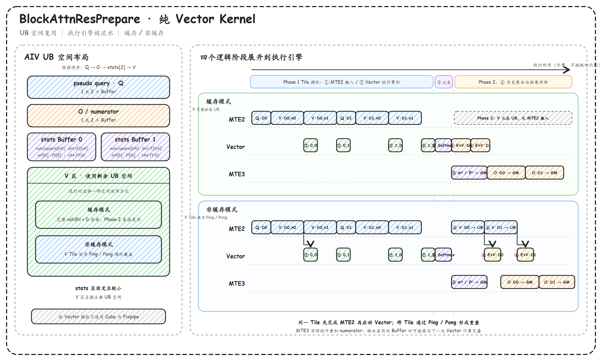
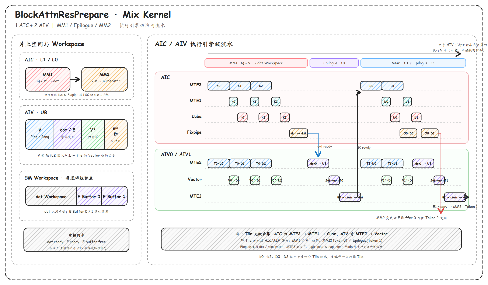
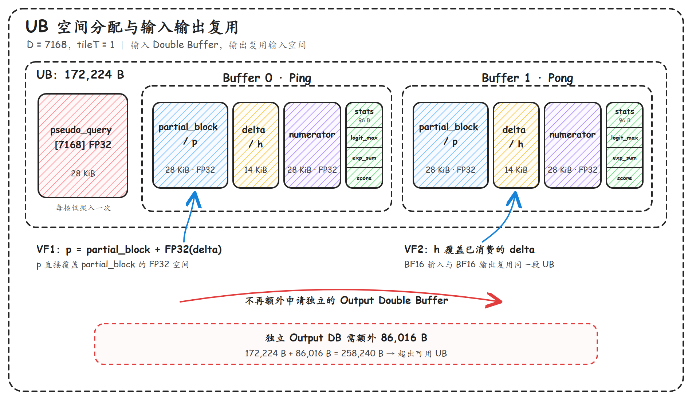
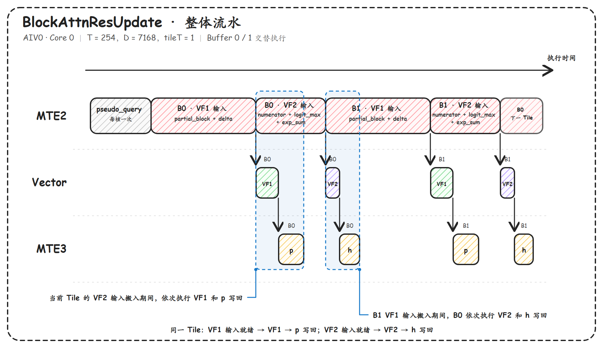
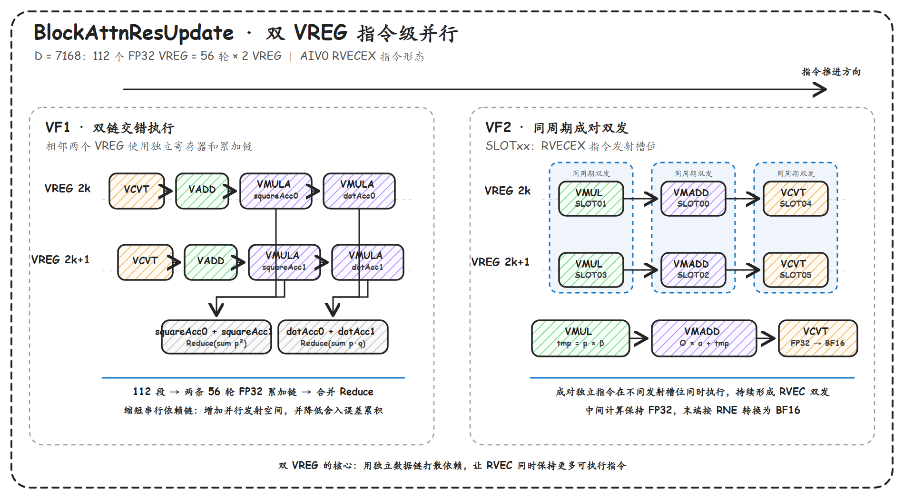
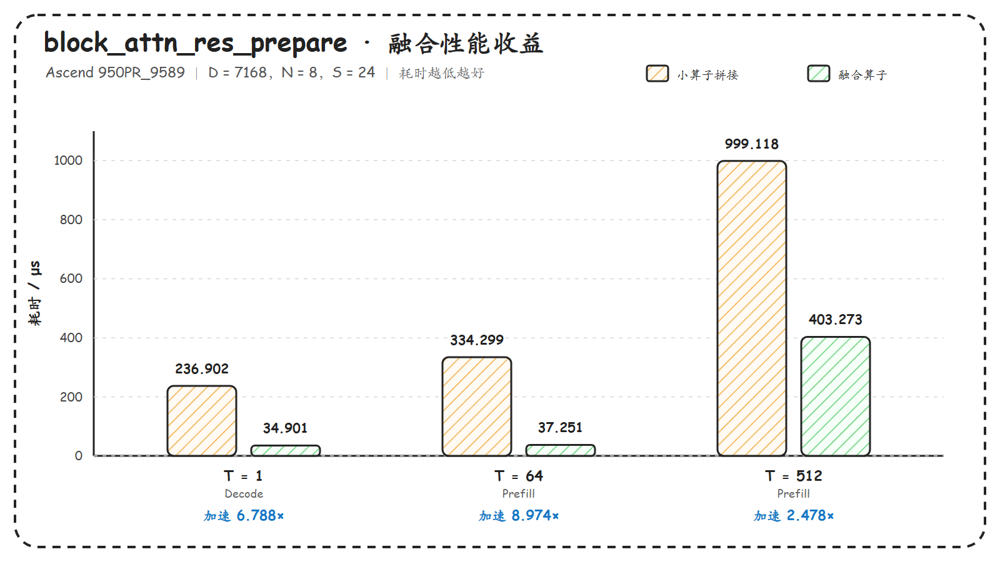
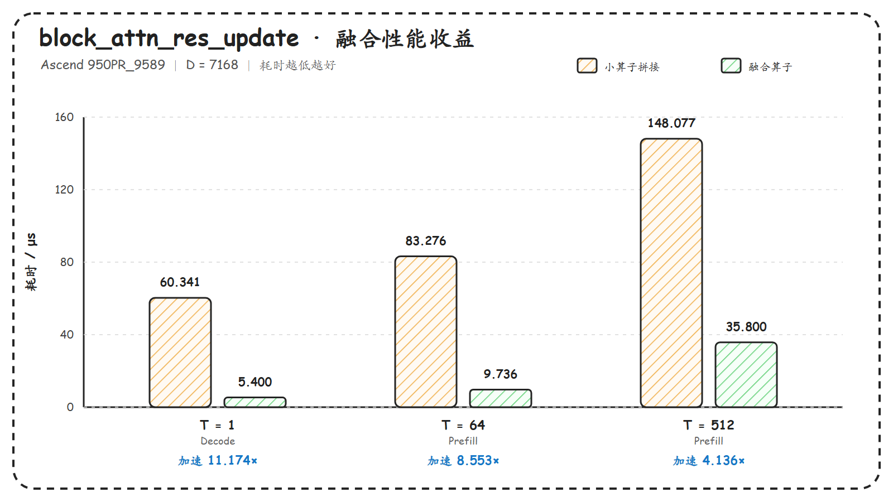

# BlockAttnRes 两阶段推理算子性能优化指南

## 概述

Block Attention Residuals（BlockAttnRes）将普通残差的固定累加改为沿网络深度的注意力聚合，使当前层能够按内容选择历史 Block 残差。直接使用小算子拼接时，当前 Block 内的不同层会重复读取历史状态，并产生较多 Kernel 调度和中间结果搬运。

本样例将计算拆为 `block_attn_res_prepare` 和 `block_attn_res_update` 两个阶段，并分别提供纯 Vector、Cube+Vector Mix 和 Update Full-D 模板。本文围绕算子实现原理、性能瓶颈、优化方法和模板选择展开；构建、运行与精度验证方法见 [BlockAttnRes Recipe 示例](../block_attn_res_recipes/examples/block_attn_res/README.md)。

## 算子实现原理

### 算子功能说明

以 PreNorm Transformer 为例，普通残差连接可以表示为：

$$
h_l=x_l,\qquad
\delta_l=F_l(h_l),\qquad
x_{l+1}=x_l+\delta_l
$$

Attention Residuals 使用当前层的 query 对历史表示进行深度方向的注意力聚合。BlockAttnRes 进一步将相邻层分组：

- 已完成 Block 的累计结果保存在 `block_res` 中，作为历史 Block 残差；
- 当前 Block 内仍通过 `partial_block += delta` 累积局部残差；
- Block 首层只聚合历史 Block 残差；
- Block 后续层聚合“历史 Block 残差 + 当前 `partial_block`”，生成该层输入 `h`。

下图展示普通残差、Full Attention Residuals 与 Block Attention Residuals 的结构差异。

<div align="center">
  
</div>

*图 1 普通残差、Full Attention Residuals 与 Block Attention Residuals 的结构对比。来源：[Kimi Team, Attention Residuals, Figure 1](https://github.com/MoonshotAI/Attention-Residuals/blob/master/Attention_Residuals.pdf)（[CC BY-NC-ND 4.0](https://creativecommons.org/licenses/by-nc-nd/4.0/)），原图未作修改。*

设 Token 数为 $T$，历史 Block 容量为 $N_{\max}$，运行时有效历史 Block 数为：

$$
N_v=\min(\mathrm{valid\_blocks},N_{\max})
$$

当前 Block 层数为 $S$，Hidden size 为 $D$。历史 Block 残差记为 $V_{t,n,d}$，当前层的原始 query 和 RMSNorm 缩放参数分别为 $q_s$ 和 $\gamma_s$。样例将二者预融合为：

$$
\widetilde Q_s=\gamma_s\odot q_s
$$

因此不需要显式生成带缩放参数的 RMSNorm 中间结果。

### 两阶段计算流程

一段式实现会在当前 Block 的每一层重新处理全部历史 Block 残差。推理阶段能够预先获得当前 Block 各层的 pseudo query，因此可以拆成：

- **Prepare**：在 Block 开始时批量计算全部层的历史 Online Softmax 状态；
- **Update**：完成一层计算后，更新 `partial_block`，并将当前状态与下一层对应的历史状态合并。

下图展示 Prepare 输出在当前 Block 内的生命周期，以及首层、后续层和 Block 结束时 `partial_block` 的更新关系。

<div align="center">
  
</div>

#### `block_attn_res_prepare`

Prepare 的输入参数如下。

| 输入 | Shape | dtype | 含义 |
|---|---|---|---|
| `block_res` | $[T,N_{\max},D]$ | FP32 | 历史 Block 残差缓冲区，仅前 $N_v$ 个 Block 有效 |
| `valid_blocks` | $[1]$ | UINT64 | 运行时有效历史 Block 数 |
| `pseudo_query` | $[S,D]$ | FP32 | 当前 Block 全部层的预融合 pseudo query |
| `eps` | 标量属性 | float | RMS 稳定项，默认值为 $10^{-6}$ |

输出参数如下。

| 输出 | 符号 | Shape | dtype | 含义 |
|---|---|---|---|---|
| `numerator` | $O^H$ | $[S,T,D]$ | FP32 | 未归一化的历史 Value 加权和 |
| `logit_max` | $m^H$ | $[S,T]$ | FP32 | 历史 Block 维度的最大 logit |
| `exp_sum` | $\ell^H$ | $[S,T]$ | FP32 | 减去最大 logit 后的指数和 |

首先对每个历史 Block 残差计算 RMS：

$$
r_{t,n}
=\sqrt{
\frac{1}{D}\sum_{d=0}^{D-1}V_{t,n,d}^{2}
+\varepsilon
}
$$

随后计算每一层 query 对历史 Block 残差的 logit：

$$
z_{s,t,n}
=\frac{
\sum_{d=0}^{D-1}\widetilde Q_{s,d}V_{t,n,d}
}{
r_{t,n}
}
$$

在有效历史 Block 维度上计算稳定化 Softmax 状态：

$$
m^H_{s,t}=\max_{0\le n<N_v}z_{s,t,n}
$$

$$
E_{s,t,n}=\exp\left(z_{s,t,n}-m^H_{s,t}\right)
$$

$$
\ell^H_{s,t}=\sum_{n=0}^{N_v-1}E_{s,t,n}
$$

$$
O^H_{s,t,d}
=\sum_{n=0}^{N_v-1}E_{s,t,n}V_{t,n,d}
$$

Prepare 不执行最终归一化，而是输出 $(O^H,m^H,\ell^H)$。当 $N_v>0$ 时，当前 Block 首层可直接得到：

$$
h_{0,t,d}=\frac{O^H_{0,t,d}}{\ell^H_{0,t}}
$$

当 $N_v=0$ 时，Prepare 输出 Online Softmax 空状态：`numerator=0`、`logit_max=-FLT_MAX`、`exp_sum=0`。

#### `block_attn_res_update`

Update 使用即将执行层对应的一组历史状态。输入输出参数如下。

| 参数 | Shape | dtype | 输入/输出 | 含义 |
|---|---|---|---|---|
| `partial_block` | $[T,D]$ | FP32 | 输入、原地输出 | 当前 Block 已累计的局部残差 |
| `delta` | $[T,D]$ | BF16 | 输入 | 刚完成子层产生的残差增量 |
| `pseudo_query` | $[D]$ | FP32 | 输入 | 下一层的预融合 pseudo query |
| `numerator` | $[T,D]$ | FP32 | 输入 | 下一层对应的 $O^H$ |
| `logit_max` | $[T]$ | FP32 | 输入 | 下一层对应的 $m^H$ |
| `exp_sum` | $[T]$ | FP32 | 输入 | 下一层对应的 $\ell^H$ |
| `h` | $[T,D]$ | BF16 | 输出 | 下一层的 BlockAttnRes 输入 |

先更新当前 Block 局部残差：

$$
p_{l,t,d}
=p_{l-1,t,d}+\operatorname{FP32}(\delta_{l-1,t,d})
$$

再计算当前 `partial_block` 对下一层 query 的 score：

$$
score_{l,t}
=\frac{
\sum_{d=0}^{D-1}p_{l,t,d}\widetilde q_{l,d}
}{
\sqrt{\frac{1}{D}\sum_{d=0}^{D-1}p_{l,t,d}^{2}+\varepsilon}
}
$$

通过 Online Softmax Merge 合并历史状态与当前 singleton 状态：

$$
m'_{l,t}=\max(m^H_{l,t},score_{l,t})
$$

$$
\alpha_{l,t}=\exp(m^H_{l,t}-m'_{l,t}),\qquad
\beta_{l,t}=\exp(score_{l,t}-m'_{l,t})
$$

$$
h_{l,t,d}
=\operatorname{BF16}\left(
\frac{\alpha_{l,t}O^H_{l,t,d}+\beta_{l,t}p_{l,t,d}}
     {\alpha_{l,t}\ell^H_{l,t}+\beta_{l,t}}
\right)
$$

样例的 E2E 入口将 Prepare 和 Update 放在同一 ACL stream 中，并把选定 slot 的设备地址直接传给 Update，不需要 Host 回传或中间同步。

### 算子实现约束

| 项目 | 约束 |
|---|---|
| 架构 | Ascend 950PR/950DT，`dav-3510` |
| $T$ | 正整数，受设备内存和 uint32 Tiling 范围限制 |
| $N_{\max}$ | $1\sim64$ |
| $S$ | 正整数；`slot` 必须小于 $S$ |
| $D$ | $1\sim8192$ |
| `valid_blocks` | Prepare 按 $\min(\mathrm{valid\_blocks},N_{\max})$ 处理；允许为 0 |
| `eps` | 有限正数 |
| 数据排布 | 当前样例使用连续 ND 排布 |
| Update 历史状态 | Update 和 E2E 要求有效历史状态非空 |
| Update UB | 一行完整 $D$ 以及双缓冲工作区必须能够放入 UB，否则 Host Tiling 报错 |

Prepare Mix 模板还要求平台满足 1 个 AIC 对应 2 个 AIV，并满足 $T\ge32$、$S\ge16$、$D\ge256$。Host 还会校验 L1、L0A、L0B、L0C、UB、Workspace 及 `baseT × N_max <= 16` 等条件；任一条件不满足时，Auto 模式回退纯 Vector 模板。

## 算子性能建模

### 工作量分析

两阶段拆分首先改变历史 RMS 统计的复用方式，但不会消除 query 点积和 Value 聚合本身。下面只给出主导项，忽略对齐、尾块和标量操作。

| 计算项 | 一段式逐层执行 | 两阶段算法目标 | 当前样例实现 |
|---|---:|---:|---:|
| 历史 Block RMS 统计 | $\mathcal{O}(STN_vD)$ | $\mathcal{O}(TN_vD)$ | Vector：$\mathcal{O}(STN_vD)$；Mix：约 $\mathcal{O}(\lceil S/baseS\rceil TN_vD)$ |
| query 与历史 Value 点积 | $\mathcal{O}(STN_vD)$ | $\mathcal{O}(STN_vD)$ | Vector 使用 AIV；Mix 使用 MM1 |
| 历史 Value 加权聚合 | $\mathcal{O}(STN_vD)$ | $\mathcal{O}(STN_vD)$ | Vector 使用 AIV；Mix 使用 MM2 |
| 当前 Block 更新与状态合并 | $\mathcal{O}(STD)$ | $\mathcal{O}(STD)$ | Update 使用 AIV |

因此，两阶段设计的收益不能简单描述为全部计算量从 $\mathcal{O}(STN_vD)$ 降为 $\mathcal{O}(TN_vD)$：

- 能够跨层复用的是历史 RMS 状态；
- query 点积和 Value 聚合仍与 $S$ 成正比；
- 纯 Vector 模板以 $(t,s)$ 为工作单元，仍会在不同 $s$ 之间重复历史 RMS 统计；
- Mix 模板在一个 `baseS` Tile 内复用历史 RMS 结果，更接近两阶段算法的复用目标。

### Prepare 性能模型

#### 纯 Vector 模板

纯 Vector 模板共有 $T\times S$ 个工作单元，每个工作单元处理一个 $(t,s)$，主计算量与 $N_vD$ 成正比。稳态耗时可以近似理解为：

$$
T_{\mathrm{prepare,vector}}
\gtrsim T_{\mathrm{launch}}
+\max(T_{\mathrm{MTE2}},T_{\mathrm{Vector}},T_{\mathrm{MTE3}})
+T_{\mathrm{phase\ boundary}}
$$

其中归约依赖和两个计算阶段之间的边界无法完全隐藏。`numerator` 和统计量的最低输出量为：

$$
B_{\mathrm{out}}=4STD+8ST\quad\text{bytes}
$$

历史 Value 通常是主要输入之一。若完整 $N_v\times D$ 能在单个工作单元内驻留 UB，历史 Value 约读取一次：

$$
B^{V}_{\mathrm{cache}}\approx4STN_vD
$$

否则统计阶段和加权聚合阶段分别读取一次：

$$
B^{V}_{\mathrm{reload}}\approx8STN_vD
$$

上述公式不包含 query、对齐和尾块开销，但可以直接说明 V 缓存对 MTE2 压力的影响。

#### Mix 模板

Mix 模板以 1 个 AIC 和 2 个 AIV 为一个逻辑计算组。两次 Cube 计算的主计算量分别为：

$$
F_{\mathrm{MM1}}\approx STN_vD,\qquad
F_{\mathrm{MM2}}\approx STN_vD
$$

AIV 负责历史 Value 平方和归约及 Softmax。历史 RMS 统计在每个 $S$ Tile 内复用，其主计算量约为：

$$
F_{\mathrm{RMS}}\approx
2\left\lceil\frac{S}{baseS}\right\rceil TN_vD
$$

系数 2 来自同一逻辑计算组中的两个 AIV：二者各自计算 V 平方和，供各自负责的 $S$ 行复用。

进入稳定流水后，Mix 模板耗时由 AIC、AIV 和搬运中最慢的一侧决定，同时还需要考虑跨核同步与首尾开销：

$$
T_{\mathrm{prepare,mix}}
\gtrsim T_{\mathrm{launch}}+T_{\mathrm{sync}}+T_{\mathrm{tail}}
+\max(T_{\mathrm{AIC}},T_{\mathrm{AIV}},T_{\mathrm{move}})
$$

当任务足够大时，两次矩阵乘能够利用 Cube 吞吐，并在 `baseS` 内复用历史 RMS；当任务较小时，AIC/AIV 启动和 Mode-4 同步开销可能抵消这些收益。因此当前实现只在满足 Shape、平台比例和片上容量条件时启用 Mix。

### Update 性能模型

Update 每层处理 $T\times D$ 个元素。忽略对齐后，GM 主数据搬运量约为：

$$
B_{\mathrm{update}}
\approx16TD+4C_{\mathrm{used}}D+8T\quad\text{bytes}
$$

其中：

- `partial_block` 读写共 $8TD$ bytes；
- `delta` 读取和 `h` 写出共 $4TD$ bytes；
- `numerator` 读取为 $4TD$ bytes；
- 每个参与核读取一次 FP32 `pseudo_query`，共 $4C_{\mathrm{used}}D$ bytes；
- `logit_max` 与 `exp_sum` 共 $8T$ bytes。

Update 同时包含 RMS 与点积归约、指数和逐元素融合。其理论下界可表示为：

$$
T_{\mathrm{update}}
\gtrsim T_{\mathrm{launch}}
+\max\left(
\frac{B_{\mathrm{update}}}{BW_{\mathrm{GM}}},
T_{\mathrm{Vector}}
\right)
+T_{\mathrm{dependency}}
$$

$T$ 较小时，并行核数和 Kernel 启动开销更敏感；$D$ 较大或每核需要多个 Tile 时，MTE2、Vector、MTE3 的重叠程度以及长归约依赖链成为重点。

### 性能瓶颈分析

| 场景或 Profiling 现象 | 可能瓶颈 | 优先检查 |
|---|---|---|
| Prepare 的 $T\times S$ 很小 | Kernel 启动、核间同步或并行度不足 | 使用纯 Vector，避免强制 Mix |
| Prepare Vector 中历史 V 在两个阶段重复搬入 | MTE2 Bound | 检查完整 $N_v\times D$ 是否满足 UB 缓存条件 |
| Prepare Vector 的 Vector 流水持续繁忙 | 平方和、dot、加权聚合计算量 | 使用 Auto 并确认 Mix 是否可用 |
| Prepare Mix 的 AIC 等待 E | AIV RMS/Softmax 或 E 写回较慢 | 检查 `baseS/baseD`、AIV 行分配和 E 双缓冲 |
| Prepare Mix 的 AIV 等待 dot | MM1 或其搬运较慢 | 检查 Cube Tile、L1 缓冲及 MM1 数据搬运 |
| Update 的 $T$ 很小 | 启动开销、有效核数不足 | 保持每 Token 的完整 $D$ 单核处理，避免跨核归约 |
| Update 多 Tile 间存在明显空洞 | MTE2/Vector/MTE3 重叠不足 | 检查 `tileT`、Ping-Pong 复用事件和尾 Tile |
| Update Vector 时间随 $D$ 增长明显 | RMS/dot 长依赖链 | 检查双累加链、双 VREG 和小 D 专用 VF 分支 |

### 优化目标

- 在 Block 级复用历史状态，减少逐层重复的 RMS 统计和 Kernel 调度；
- 根据 Shape 在纯 Vector 与 Mix 模板间选择，避免小任务承担不必要的 Cube/跨核同步开销；
- 尽量减少历史 Value 重读，并提高 MTE2、Vector、MTE3 的重叠度；
- 在 Mix 模板中平衡 MM1、AIV Epilogue 和 MM2，避免 AIC/AIV 相互等待；
- Update 沿 $T$ 维均衡分核，并保持完整 $D$ 单核归约，避免跨核同步；
- 中间统计和归约使用 FP32，优化性能的同时保持 Online Softmax 数值稳定性。

## 算子优化实践

### 两阶段状态复用与小算子融合

- **原理介绍**

  Prepare 将当前 Block 全部层的历史 Online Softmax 状态提前生成，Update 只合并当前 `partial_block`。同时，RMS、点积、Softmax、Value 聚合和 Online Softmax Merge 分别融合进两个 Kernel，减少中间结果物化。

- **性能作用**

  - 将逐层独立的小算子链收敛为 Prepare 和 Update 两个融合算子；
  - Mix 模板在 `baseS` 内复用历史 RMS 统计；
  - Update 的计算量不再随历史 Block 数 $N_v$ 增长；
  - 代价是 Prepare 需要保存 $[S,T,D]$ 的 FP32 `numerator` 及两组 $[S,T]$ 统计量。

- **适用场景**

  - 当前 Block 包含多层，历史状态会被重复使用；
  - 小算子调度和中间 GM 搬运占比较高；
  - 能够接受 Prepare 状态占用的设备内存。

### Prepare 纯 Vector 模板：联合分核与 V 缓存

- **原理介绍**

  将 $(t,s)$ 展平为 $T\times S$ 个任务并连续均分到 AIV：

  $$
  C_{\mathrm{vector}}=\min(TS,\mathrm{aivNum})
  $$

  $D$ 不跨核切分，只在单核内选择完整 $D$、1024、512 或 256 作为 `baseD`。当单核有多个工作轮次或 $D$ 被切成多个 Tile 时，Q、V、O Buffer 按需使用双缓冲；统计区固定使用两组小 Buffer。

  若运行时 $N_v\times D$ 能够完整放入剩余 UB，统计阶段搬入的 V 会驻留到加权聚合阶段；否则第二阶段重新从 GM 搬入 V。

- **效果对比**

  下图展示纯 Vector 模板的 UB 分区及 MTE2、Vector、MTE3 流水。缓存模式在第二阶段不再使用 MTE2；非缓存模式使用 V Ping-Pong，使相邻 Tile 的搬入和计算重叠。

  <div align="center">
    
  </div>

- **适用场景**

  - $T<32$、$S<16$ 或 $D<256$，当前 Mix 模板不可用；
  - 工作量较小，Mix 启动与跨核同步成本占比较高；
  - 不希望申请额外 Workspace；
  - 需要覆盖任意合法 Shape 的通用回退路径。

### Prepare Mix 模板：Cube/Vector 协同

- **原理介绍**

  Mix 模板以 1 个 AIC 和 2 个 AIV 为一组，将主要计算拆为：

  1. MM1：$Q_{blockS\times D}\times V^{\mathsf T}_{D\times(blockT\cdot N_v)}$，生成 dot；
  2. AIV Epilogue：计算 V 平方和、RMS、Softmax 指数项 $E$、`logit_max` 和 `exp_sum`；
  3. MM2：$E_{blockS\times N_v}\times V_{N_v\times validD}$，生成 `numerator`。

  MM1 与 AIV 的 V 平方和归约可以并行；E Workspace 使用两组循环 Buffer，使 AIC 对当前 Token 执行 MM2 时，AIV 可以继续生成下一 Token 的 E。`dot ready`、`E ready` 和 `E buffer free` 三类 Mode-4 事件维护跨核依赖。

- **效果对比**

  下图按执行引擎展示 MTE2、MTE1、Vector、Cube、MTE3 和 Fixpipe 的协同关系。

  <div align="center">
    
  </div>

- **负载与运行时适配**

  Host 沿 $T$、$S$ 和 $D$ 搜索 `baseT/baseS/baseD`，只接受不会增加最忙逻辑组负载且满足片上容量的候选。`valid_blocks` 在 Device 侧读取；当实际 $N_v$ 小于容量 $N_{\max}$ 时，Scheduler 可以在既有 MM1 列跨度、Workspace 和并行度允许的范围内增大 Token 分组，减少工作单元数量。

- **适用场景**

  - $T\ge32$、$S\ge16$、$D\ge256$ 且平台与片上容量条件满足；
  - query 点积与 Value 聚合的 Vector 计算成为主要耗时；
  - 任务规模足以覆盖 AIC/AIV 启动、跨核同步和 Workspace 搬运开销。

### Update：沿 Token 分核与 Tile 均衡

- **原理介绍**

  Update 固定沿 $T$ 维分核，完整 $D$ 由同一个 AIV 处理。Host 先按平台可用 AIV 数计算：

  $$
  tPerCore=\left\lceil\frac{T}{aivNum}\right\rceil
  $$

  $$
  usedCores=\left\lceil\frac{T}{tPerCore}\right\rceil
  $$

  这种分配避免启动空闲核，也避免 RMS 和 dot 跨核归约。UB 容量确定单 Buffer 的最大 `tileT` 后，Host 保持搬入轮数不变重新均衡 Tile，避免产生过小尾块。例如 `18=8+8+2` 会调整为 `18=6+6+6`。

- **性能作用**

  - 减少核间负载差和尾 Tile 浪费；
  - 消除 $D$ 维跨核归约与同步；
  - 为后续双缓冲提供尺寸接近的连续 Tile。

- **适用场景**

  - 所有 Update Shape；
  - $T$ 不能被核数或最大 Tile 大小整除的场景。

### Update：UB 常驻与分时复用

- **原理介绍**

  每个核仅在入口搬入一次 `pseudo_query`，随后在全部 Token Tile 中复用。UB 布局为一份 query 加两组 Ping-Pong Buffer，每组包含：

  - `partial_block`；
  - `delta/h` 复用区；
  - `numerator`；
  - `logit_max`、`exp_sum` 和 `score` 三组统计量。

  更新后的 $p$ 直接保留在 `partial_block` 对应 UB 区，最终 $h$ 复用已经消费完的 `delta` 区，避免为两个输出单独申请 Buffer。

- **效果对比**

  <div align="center">
    
  </div>

- **适用场景**

  - query 跨多个 Token Tile 保持不变；
  - UB 空间不足以同时为所有输入输出分配独立双缓冲；
  - 两个计算阶段的 Buffer 生命周期可以安全复用。

### Update：双缓冲流水与 single-tile 特化

- **原理介绍**

  VF1 搬入 `partial_block` 和 `delta`，更新 $p$ 并计算 `score`；VF2 搬入历史 `numerator/logit_max/exp_sum`，完成 Online Softmax Merge 并写出 $h$。

  multi-tile 路径使用两组 Buffer 交替执行，使下一 Tile 的 VF1 输入搬入能够与当前 Tile 的 VF2 和 $h$ 写回重叠。同一 Buffer 再次使用前，通过 MTE3→MTE2 事件确认上一轮写回完成。单核只有一个 Tile 时，编译期 `SINGLE_TILE` 分支移除不必要的 Buffer 复用事件。

- **效果对比**

  <div align="center">
    
  </div>

- **适用场景**

  - multi-tile：每核包含多个 Token Tile，需要隐藏搬入、计算和搬出延迟；
  - single-tile：每核工作量能够一次放入 UB，优先减少同步开销。

### Update：小 D 专用 VF 与双 VREG

- **原理介绍**

  当前实现按 $D$ 选择三类 VF：

  - $D\le64$：单 VREG 专用路径；
  - $64<D\le128$：双 VREG 专用路径；
  - $D>128$：通用双 VREG 循环。

  通用 VF1 为平方和与点积分别维护两条独立累加链，即 `squareAcc0/1` 和 `dotAcc0/1`。相邻两个 VREG 并行处理后在链尾合并，既增加独立指令，也缩短串行累加深度。VF2 使用两组无依赖寄存器并行执行 `VMUL`、`VMADD` 和 `VCVT`。

  以 $D=7168$ 为例，共有 112 个 FP32 VREG；双链后每条链只需完成 56 轮累加。

- **效果对比**

  <div align="center">
    
  </div>

- **适用场景**

  - 小 $D$ 场景需要避免进入通用循环；
  - 大 $D$ 场景的 RMS/dot 归约依赖链较长；
  - RVECEX 存在可利用的指令级并行空间。

## 算子模板归纳

| 模板 | 执行单元 | 工作切分 | Workspace | 主要优化 | 适用条件 |
|---|---|---|---:|---|---|
| Prepare Vector | AIV | $(t,s)$ 联合分核，$D$ 单核内分 Tile | 0 | Q/V/O 按需双缓冲、V 缓存、空状态和 $N_v=1$ 快路径 | 所有通过 Host Tiling 的 Prepare Shape；Auto 回退模板 |
| Prepare Mix | 1 AIC + 2 AIV | $T/S/D$ 联合 Tiling | 需要 | 两次 Cube Matmul、AIC/AIV 并行、E 双缓冲、运行时 Token 分组 | 平台比例、Shape 和片上容量条件全部满足 |
| Update Full-D | AIV | 沿 $T$ 分核，完整 $D$ 单核处理 | 0 | query 常驻、UB 分时复用、single/multi-tile、双 VREG | 所有合法 Update Shape，且一行 $D$ 可双缓冲放入 UB |

对应实现如下。

- Prepare Vector：[Tiling](../block_attn_res_recipes/include/tiling/block_attn_res_prepare_tiling.h)、[Kernel](../block_attn_res_recipes/include/kernel/block_attn_res_prepare_vector.h)、[VF](../block_attn_res_recipes/include/vf/block_attn_res_prepare_vector_vf.h)
- Prepare Mix：[Kernel](../block_attn_res_recipes/include/kernel/block_attn_res_prepare_mix.h)、[Scheduler](../block_attn_res_recipes/include/block/block_attn_res_prepare_scheduler.h)、[MMAD](../block_attn_res_recipes/include/block/block_attn_res_prepare_mmad.h)、[Epilogue](../block_attn_res_recipes/include/block/block_attn_res_prepare_epilogue.h)
- Update Full-D：[Tiling](../block_attn_res_recipes/include/tiling/block_attn_res_update_tiling.h)、[Kernel](../block_attn_res_recipes/include/kernel/block_attn_res_update_full_d.h)、[VF](../block_attn_res_recipes/include/vf/block_attn_res_update_vf.h)
- 两阶段串联：[block_attn_res_e2e.asc](../block_attn_res_recipes/examples/block_attn_res/block_attn_res_e2e.asc)

## 优化策略选择指南

### Prepare 模板选择

`--template auto` 的实际选择逻辑如下：

```text
平台满足 aivNum == 2 × aicNum
且 T >= 32、S >= 16、D >= 256
且 T × D 未超过当前 Mix 索引范围
且存在满足 L1/L0/UB/Workspace 和负载约束的 baseT/baseS/baseD
    → Prepare Mix
否则
    → Prepare Vector
```

| 输入或使用特征 | 推荐方式 | 原因 |
|---|---|---|
| 首次使用或 Shape 动态变化 | `--template auto` | 使用当前实现完整的能力与容量检查 |
| $T<32$、$S<16$ 或 $D<256$ | Vector | Mix 当前不具备能力 |
| 大 Prefill，且 Auto 选择 Mix | Mix | 批量使用 Cube，并在 `baseS` 内复用历史 RMS |
| Decode 或小工作量 | Vector | 避免 AIC/AIV 启动和跨核同步开销 |
| 不允许额外 Workspace | Vector | Vector 模板 Workspace 为 0 |
| 对比模板性能 | 分别强制 `vector` 和 `mix` | 仅在 Mix 能力检查通过时可强制 Mix |

需要注意，Host 选择模板时使用容量 $N_{\max}$；运行时 $N_v$ 变小不会重新选择模板，但 Mix Scheduler 可以在既有资源范围内调整 Token 分组。

Auto 当前是基于能力与资源约束的启发式选择，并不是对每个 Shape 现场测速的自动调优器。对性能敏感的固定 Shape，仍建议在 Mix 能力检查通过后分别测试 Vector 和 Mix。

### Update 路径选择

Update 不需要用户选择模板。Host 根据每核 Token 数和 UB 容量生成 `tileT`：

- 每核只有一个 Tile 时选择 `SINGLE_TILE=true`；
- 每核包含多个 Tile 时选择 Ping-Pong 路径；
- Kernel 内再根据 $D\le64$、$D\le128$ 或 $D>128$ 选择对应 VF。

### 根据 Profiling 结果选择优化方向

| 主要现象 | 优先优化方向 |
|---|---|
| Prepare Vector 的 MTE2 时间高且 V 被重读 | 增大 V 缓存机会，或在能力满足时使用 Mix |
| Prepare Vector 的 Vector 时间高 | 使用 Mix 将 dot 和 Value 聚合迁移到 Cube |
| Prepare Mix 中 AIC/AIV 等待明显 | 调整 `baseT/baseS/baseD`，检查两侧任务是否平衡 |
| Prepare 输出搬出占主导 | 关注 `numerator` 的 $4STD$ 固定输出成本，避免无效层或 Token |
| Update MTE2/MTE3 空洞明显 | 检查 `tileT` 均衡与双缓冲事件链 |
| Update Vector 长依赖明显 | 检查双累加链、双 VREG 及 D 分支是否命中 |
| 小 Shape 总耗时接近固定值 | 优先减少启动、同步和无效核，而不是继续增大缓冲 |

## 融合收益验证

以下数据来自原方案交付时的单次 msprof 采样，用于说明融合方向的收益。由于测试采用 0 次预热、1 次正式迭代，数据不等同于稳定性能基线；在当前环境评估时，建议按后文步骤增加预热和重复次数重新采集。

### 测试环境

| 项目 | 配置 |
|---|---|
| NPU | Ascend 950PR_9589 |
| CANN 版本 | 9.2.0 |
| 驱动版本 | 9.1.t13.0.b130 |
| 动静态 | 动态二进制 |
| 测试工具 | msprof |
| 预热次数 | 0 |
| 正式迭代次数 | 1 |

测试 Shape 如下。

| 场景 | T | D | $N_{\max}=N_v$ | S |
|---|---:|---:|---:|---:|
| Decode | 1 | 7168 | 8 | 24 |
| Prefill | 64 | 7168 | 8 | 24 |
| Prefill | 512 | 7168 | 8 | 24 |

### `block_attn_res_prepare`

小算子基线包含 14 个算子：

```text
Slice → Square → ReduceMean → Add → Rsqrt
 → Slice → Transpose → MatMulV3 → Mul
 → ReduceMax → Sub → Exp → ReduceSum → Mul
```

性能结果如下。

| 场景 | T | D | N | S | Kernel 模板 | 小算子拼接/μs | 融合算子/μs | 加速比 |
|---|---:|---:|---:|---:|---|---:|---:|---:|
| Decode | 1 | 7168 | 8 | 24 | Vector | 236.902 | 34.901 | 6.788× |
| Prefill | 64 | 7168 | 8 | 24 | Mix | 334.299 | 37.251 | 8.974× |
| Prefill | 512 | 7168 | 8 | 24 | Mix | 999.118 | 403.273 | 2.478× |

<div align="center">
  
</div>

在这三组 Shape 下，Prepare 融合算子的单次采样加速比为 2.478～8.974 倍。

### `block_attn_res_update`

小算子基线包含 21 个算子：

```text
Cast → Add → Square → ReduceMean → Add → Rsqrt
 → Mul → ReduceSum → Mul → Maximum
 → Sub → Exp → Sub → Exp → Mul → Add
 → Mul → Mul → Add → RealDiv → Cast
```

性能结果如下。

| 场景 | T | D | 小算子拼接/μs | 融合算子/μs | 加速比 |
|---|---:|---:|---:|---:|---:|
| Decode | 1 | 7168 | 60.341 | 5.400 | 11.174× |
| Prefill | 64 | 7168 | 83.276 | 9.736 | 8.553× |
| Prefill | 512 | 7168 | 148.077 | 35.800 | 4.136× |

<div align="center">
  
</div>

在这三组 Shape 下，Update 融合算子的单次采样加速比为 4.136～11.174 倍。

## 性能调优实践步骤

1. **确认模板**：使用 `--template auto` 运行 Prepare，记录程序打印的 `vector/mix`、核数和 Workspace。
2. **分别采集**：单独采集 Prepare、Update，再采集 E2E，避免只用总耗时推断单个阶段瓶颈。
3. **稳定测量**：设置足够的 `--warmup` 和 `--repeat`，比较多次 Kernel Task Duration，排除首次运行和采样抖动。
4. **识别流水**：结合 MTE2、MTE1、Vector、Cube、MTE3/Fixpipe 活跃区间判断瓶颈，不仅比较 Kernel 总时间。
5. **对比模板**：Mix 能力检查通过时，分别强制 `vector` 和 `mix`，验证 Auto 选择在目标 Shape 上的收益。
6. **定位冗余搬运**：Vector 重点检查 V 是否重读；Mix 重点检查 MM1/MM2 与 AIV Epilogue 是否相互等待；Update 重点检查 query 是否常驻及 Ping-Pong 是否形成重叠。
7. **检查负载均衡**：观察最慢核与平均核时间，核对 $(t,s)$ 工作单元、Mix 逻辑组和 Update Token Tile 的尾块。
8. **验证精度**：每次修改 Tiling、Buffer 或 VF 后运行结果校验；长 $D$ 归约保持 FP32 累加。

## 总结

BlockAttnRes 的性能收益来自三个层级：两阶段拆分复用历史状态，融合小算子减少调度与中间搬运，以及针对不同 Shape 选择合适的 AscendC Kernel。Prepare 的关键是纯 Vector 与 Mix 的选型，以及历史 V 复用和 AIC/AIV 平衡；Update 的关键是沿 Token 均衡分核、完整 D 单核归约、UB 生命周期复用和多流水并行。实际调优应从 Profiling 瓶颈出发，而不是对所有 Shape 固定使用同一模板。

## 参考资料

- 算法与图示来源：[Kimi Team, Attention Residuals](https://github.com/MoonshotAI/Attention-Residuals/blob/master/Attention_Residuals.pdf)
- 模型调用参考：[CANN Kimi K3 模型实现](https://gitcode.com/cann/cann-recipes-infer/blob/master/models/kimi_k3/models/modeling_kimi_k3.py)
- 算子工程实现：CANN ops-transformer [`block_attn_res_prepare`](https://gitcode.com/cann/ops-transformer/tree/master/attention/block_attn_res_prepare)、[`block_attn_res_update`](https://gitcode.com/cann/ops-transformer/tree/master/attention/block_attn_res_update)
