# 【建设中】 Flash Attention Lite：Ascend 950 上的 1 AIC + 2 AIV 协作与流水优化

## 概述

Flash Attention Lite（FALite）是 Ascend 950 上的因果（causal）FlashAttention 前向教学样例，面向一次处理整段输入的推理 Prefill 场景。重点是一个 Mix 核组中的 1 个矩阵计算核（AIC）与 2 个向量计算核（AIV）如何交换数据、复用片上空间，让计算与搬运重叠。算法遵循 causal Attention 定义，精度验证参考 FlashAttention 官方仓库，Kernel 按 Ascend 950 数据通路独立设计。

本文先讲分块 Online Softmax，再以 v00～v12 为主线，逐步介绍分核、片上数据交接、双缓冲、预发射和 Vector 优化，并用真机耗时与流水图分析每版的效果和不足。

## FALite 样例定位

### 支持的能力

- causal self-attention 前向计算，每个 token 只能读取自己和此前的 token；
- BF16 输入 `Q`、`K`、`V` 和输出 `O`，布局为 `[B,N,S,D]`，固定 `HeadDim=128`、分块 `128×128`；
- `BatchSize`、`HeadNum`、`SeqLen` 均可取正整数，`SeqLen` 无需按 128 对齐；v00～v12 已泛化验证 `BatchSize×HeadNum×SeqLen≤131072`；
- 可设置 Softmax 缩放系数和 Mix 核组数上限。

### 未支持的能力

- 不等长的 `Q` 与 `K/V` 序列、causal offset、Sliding Window、Sparse Attention 和 KV Cache；
- `[B,S,N,D]` 数据布局；
- 同一批次中每条序列长度不同的 varlen 输入，`Q`、`K`、`V` Head 数不一致的 GQA/MQA，以及可变 HeadDim 或 tile 大小；
- Attention bias、Dropout、反向计算和网络算子常见的其他融合能力。

> **规模范围：** 更大规模不在测试保证范围内，Host 也不会按上述范围拦截参数。

### 对外接口与参数

```cpp
bool FlashAttnLiteNPU(
    uint8_t* dQ,
    uint8_t* dK,
    uint8_t* dV,
    uint8_t* dOut,
    uint32_t batchSize,
    uint32_t headNum,
    uint32_t seqLen,
    float softmaxScale,
    uint32_t requestedAicCoreNum,
    aclrtStream stream);
```

| 参数 | 含义与约束 |
| --- | --- |
| `dQ`、`dK`、`dV`、`dOut` | 设备侧输入、输出地址，均为 BF16 `(B,N,S,128)` |
| `batchSize` | `BatchSize`，必须大于 0 |
| `headNum` | `Q`、`K`、`V` 共用的 `HeadNum`，必须大于 0 |
| `seqLen` | `SeqLen`，必须大于 0，无需按 128 对齐 |
| `softmaxScale` | Softmax 缩放系数，必须是非 0 有限值；Demo 使用 `1/sqrt(HeadDim)` |
| `requestedAicCoreNum` | 请求使用的 Mix 核组数上限，以 AIC 数表示；v00 忽略该值并固定使用 1 组，v01～v12 在传 0 时以设备全部 AIC 为上限，实际启动数不超过 Query tile 总数 |
| `stream` | 提交 Kernel 的 ACL Stream；调用方在读取输出或释放输入输出前需要同步 |

v00～v02 需要设备全局内存（GM）中的临时工作区（下文简称 workspace），因此会在释放 workspace 前同步 `stream`；v03～v12 没有这份 workspace，可在提交 Kernel 后返回。公共接口固定调用 causal 实例，不提供运行时 causal 切换；源码中的 non-causal 模板分支仅用于代码对照。

## 算法基础

### 数学记号与输入形状

除非特别说明，向量均为行向量。不同 Batch 和 Head 之间互不依赖，公式省略这两条轴，只写单个 `(b,n)` 的计算。

| 符号 | 含义 | 形状或取值 |
| --- | --- | --- |
| $B$ | Batch 数 | 正整数 |
| $N$ | `Q`、`K`、`V` 共用的 Head 数 | 正整数 |
| $S$ | 序列长度 | 正整数，无需按 tile 大小对齐 |
| $D$ | Query、Key、Value 的通道数 | 本样例固定为 128 |
| $p$、$q$ | 完整序列中的 Query、Key token 下标 | $0,\ldots,S-1$ |
| $\gamma$ | Softmax 缩放系数 | Demo 使用 $1/\sqrt{128}$ |
| $\mathbf Q$、$\mathbf K$、$\mathbf V$ | 单个 `(b,n)` 的 Query、Key、Value | $\mathbb R^{S\times D}$ |
| $\mathbf M$、$\mathbf Z$ | causal mask、应用缩放和 mask 后的注意力分数 | $S\times S$（允许以 $-\infty$ 标记屏蔽位置） |
| $\mathbf P_{\mathrm{full}}$ | 完整归一化注意力权重 | $\mathbb R^{S\times S}$ |
| $\mathbf O$ | 单个 `(b,n)` 的输出 | $\mathbb R^{S\times D}$ |

tile 表示固定计算分块；Query tile 是一块 Query，K/V tile 是同一位置的一块 Key 和 Value。分块使用以下符号：

| 符号 | 含义 | 形状或取值 |
| --- | --- | --- |
| $B_r$、$B_c$ | Query tile 与 K/V tile 的物理行数 | 本样例均固定为 128 |
| $T_r$、$T_c$ | Query tile 与 K/V tile 的数量 | $T_r=\lceil S/B_r\rceil$，$T_c=\lceil S/B_c\rceil$；本样例中二者相等 |
| $i$、$j$ | Query tile 与 K/V tile 的编号 | $0\le i<T_r$，$0\le j<T_c$ |
| $q^{(i)}$、$k^{(j)}$ | 第 $i$ 个 Query tile、第 $j$ 个 K/V tile 的有效行数 | $\min(B_r,S-iB_r)$、$\min(B_c,S-jB_c)$ |
| $r$、$c$、$d$ | tile 内的 Query 行、Key 行和通道列编号 | $0\le r<q^{(i)}$，$0\le c<k^{(j)}$，$0\le d<D$ |

带括号的右上角表示 tile 编号，右下角表示块内行列：例如 $Q^{(i)}_{r,d}$ 是 Query tile $i$ 的第 $r$ 行、第 $d$ 个通道，$S^{(i,j)}_{r,c}$ 是 tile 对 $(i,j)$ 的第 $r$ 个 Query 与第 $c$ 个 Key 的分数。普通 $S$ 表示序列长度，粗体 $\mathbf S^{(i,j)}$ 表示分数块；$\top$ 表示转置，$\mathrm{full}$、$\mathrm{acc}$、$\mathrm{row}$ 是说明性标签。

分块后的逻辑有效区域为：

$$
\mathbf Q^{(i)}\in\mathbb R^{q^{(i)}\times D},\qquad
\mathbf K^{(j)},\mathbf V^{(j)}\in\mathbb R^{k^{(j)}\times D}.
$$

公式只描述有效区域：尾块的补齐位置不参与 Softmax，也不写入输出；片上补齐方法见实现章节。

### 完整 causal Attention

令 $\mathbf M$ 为形状为 $S\times S$ 的 causal mask：

$$
M_{p,q}=
\begin{cases}
0,&q\le p,\\
-\infty,&q>p.
\end{cases}
$$

完整计算为：

$$
\mathbf Z=\gamma\mathbf Q\mathbf K^\top+\mathbf M,
\qquad
\mathbf P_{\mathrm{full}}=\operatorname{Softmax}_{\mathrm{row}}(\mathbf Z),
\qquad
\mathbf O=\mathbf P_{\mathrm{full}}\mathbf V.
$$

加上 $\mathbf M$ 就是应用 mask：未来位置的分数变为 $-\infty$，取指数后为 0。$\mathbf P_{\mathrm{full}}$ 是完整归一化注意力权重；后文的 $\mathbf P^{(i,j)}$ 尚未除以完整分母，称为“未归一化注意力权重”。

### FlashAttention 的分块计算

#### 一个 Query tile 只遍历有效的 K/V tile

第 $i$ 个 Query tile 只读取 $j\le i$ 的 K/V tile：

- $j<i$：整个 tile 都位于因果下三角，完整参与计算；
- $j=i$：对角 tile 在数学上的 $P^{(i,i)}_{r,c}$ 只保留 $c\le r$，也就是下三角；
- $j>i$：整个 tile 位于未来区域，不发射 QK 和 PV 矩阵乘。

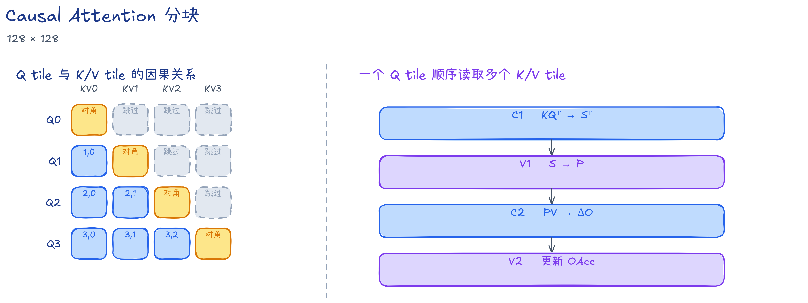

蓝色块完整计算，橙色对角块只保留下三角，灰色虚框块跳过。图右侧的 C1/C2 是两次矩阵乘，V1/V2 是 Softmax 与输出更新，见下文最终公式。代码保存转置后的分数与权重，物理布局中的有效三角方向也随之交换；数学公式始终按 Query 行、Key 列理解。

#### Online Softmax：一个 Query tile 怎样顺序读取 K/V

先定义还没有缩放和应用 mask 的注意力分数：

$$
\mathbf S^{(i,j)}=\mathbf Q^{(i)}\left(\mathbf K^{(j)}\right)^\top
\in\mathbb R^{q^{(i)}\times k^{(j)}}.
$$

应用缩放与块内 mask，其中 $M^{(i,j)}_{r,c}=M_{iB_r+r,\,jB_c+c}$：

$$
\mathbf X^{(i,j)}=\gamma\mathbf S^{(i,j)}+\mathbf M^{(i,j)}.
$$

对固定的 Query tile $i$，从 $j=0$ 开始依次读取 K/V tile，维护三份 FP32 状态：逐行最大值 $\mathbf m^{(i,j)}$、逐行指数和 $\boldsymbol\ell^{(i,j)}$、未归一化输出 $\mathbf O_{\mathrm{acc}}^{(i,j)}$。这里的 $(i,j)$ 表示已处理完 K/V tile $j$，$(i,j-1)$ 表示旧状态；形状见后面的速查表。

下面直接对整个 Query tile 递推。$\operatorname{rowmax}$、$\operatorname{rowsum}$ 分别对矩阵的每一行取最大值、求和，返回每个 Query 行对应的一个数；$\exp$ 和两个向量间的 $\max$ 均逐元素计算。行统计向量与矩阵运算时，按 Query 行广播：第 $r$ 个数用于矩阵的整行，$\odot$、$\oslash$ 分别表示逐元素乘、除。

先更新行最大值，并计算旧状态换算到新基准的系数：

$$
\begin{aligned}
\mathbf m^{(i,j)}&=\max\left(\mathbf m^{(i,j-1)},\operatorname{rowmax}(\mathbf X^{(i,j)})\right),\\
\boldsymbol\alpha^{(i,j)}&=\exp\left(\mathbf m^{(i,j-1)}-\mathbf m^{(i,j)}\right).
\end{aligned}
$$

当前块的分数减去新的行最大值，取指数得到未归一化注意力权重。旧指数和乘 $\boldsymbol\alpha$，再加上本块的逐行指数和，即为新的 Softmax 分母：

$$
\begin{aligned}
\mathbf P^{(i,j)}&=\exp\left(\mathbf X^{(i,j)}-\mathbf m^{(i,j)}\right),\\
\boldsymbol\ell^{(i,j)}&=\boldsymbol\alpha^{(i,j)}\odot\boldsymbol\ell^{(i,j-1)}
+\operatorname{rowsum}(\mathbf P^{(i,j)}).
\end{aligned}
$$

#### 输出在线更新：累加当前 tile 对输出分子的贡献

当前块通过矩阵乘得到输出分子的增量 $\boldsymbol\Delta\mathbf O$；旧输出分子同样先乘 $\boldsymbol\alpha$ 换算到新基准，再加上这一增量：

$$
\begin{aligned}
\boldsymbol\Delta\mathbf O^{(i,j)}&=\mathbf P^{(i,j)}\mathbf V^{(j)},\\
\mathbf O_{\mathrm{acc}}^{(i,j)}&=\boldsymbol\alpha^{(i,j)}\odot\mathbf O_{\mathrm{acc}}^{(i,j-1)}
+\boldsymbol\Delta\mathbf O^{(i,j)}.
\end{aligned}
$$

初始化时，$\mathbf m^{(i,-1)}$ 的各元素为 $-\infty$，$\boldsymbol\ell^{(i,-1)}$ 和 $\mathbf O_{\mathrm{acc}}^{(i,-1)}$ 全为 0。causal 模式下，Query tile $i$ 最后处理的 K/V tile 也是 $i$；循环结束后，按行除以分母：

$$
\mathbf O^{(i)}=\mathbf O_{\mathrm{acc}}^{(i,i)}\oslash\boldsymbol\ell^{(i,i)}.
$$

递推只保留 $\mathbf m$、$\boldsymbol\ell$ 和 $\mathbf O_{\mathrm{acc}}$，无需保存完整 $S\times S$ 权重矩阵。各状态必须按 $j=0,1,\ldots,i$ 更新；不同块的矩阵乘和 Vector 阶段可以错位重叠，但不能打乱状态更新顺序。

### 公式符号速查

| 符号 | 含义 | 形状 | 来源或定义 |
| --- | --- | --- | --- |
| $\mathbf Q^{(i)}$ | 第 $i$ 个 Query tile 的有效行 | $\mathbb R^{q^{(i)}\times128}$ | $Q^{(i)}_{r,d}=Q_{iB_r+r,d}$ |
| $\mathbf K^{(j)}$、$\mathbf V^{(j)}$ | 第 $j$ 个 K/V tile 的有效行 | $\mathbb R^{k^{(j)}\times128}$ | $K^{(j)}_{c,d}=K_{jB_c+c,d}$，$V^{(j)}_{c,d}=V_{jB_c+c,d}$ |
| $\mathbf M$ | 完整 causal mask | $S\times S$ | $M_{p,q}=0$（$q\le p$），否则为 $-\infty$ |
| $\mathbf M^{(i,j)}$ | Query tile $i$ 与 K/V tile $j$ 对应的 causal mask | $q^{(i)}\times k^{(j)}$ | $M^{(i,j)}_{r,c}=M_{iB_r+r,\,jB_c+c}$ |
| $\mathbf Z$ | 完整 Attention 中已经缩放并应用 mask 的分数 | $S\times S$ | $\gamma\mathbf Q\mathbf K^\top+\mathbf M$ |
| $\mathbf S^{(i,j)}$ | 未缩放的分块注意力分数 | $\mathbb R^{q^{(i)}\times k^{(j)}}$ | $\mathbf Q^{(i)}(\mathbf K^{(j)})^\top$ |
| $\mathbf X^{(i,j)}$ | 已缩放并应用 causal mask 的分块注意力分数 | $q^{(i)}\times k^{(j)}$ | $\gamma\mathbf S^{(i,j)}+\mathbf M^{(i,j)}$ |
| $\mathbf m^{(i,j)}$ | 处理完 tile $j$ 后的逐行最大值 | $\mathbb R^{q^{(i)}}$ | $\max(\mathbf m^{(i,j-1)},\operatorname{rowmax}(\mathbf X^{(i,j)}))$ |
| $\boldsymbol\alpha^{(i,j)}$ | 将旧状态换算到新最大值基准的系数 | $\mathbb R^{q^{(i)}}$ | $\exp(\mathbf m^{(i,j-1)}-\mathbf m^{(i,j)})$ |
| $\mathbf P^{(i,j)}$ | 本 tile 的未归一化注意力权重 | $\mathbb R^{q^{(i)}\times k^{(j)}}$ | $\exp(\mathbf X^{(i,j)}-\mathbf m^{(i,j)})$，按行广播 |
| $\boldsymbol\ell^{(i,j)}$ | 处理完 tile $j$ 后的逐行指数和 | $\mathbb R^{q^{(i)}}$ | $\boldsymbol\alpha^{(i,j)}\odot\boldsymbol\ell^{(i,j-1)}+\operatorname{rowsum}(\mathbf P^{(i,j)})$ |
| $\boldsymbol\Delta\mathbf O^{(i,j)}$ | 本 tile 对输出分子的增量 | $\mathbb R^{q^{(i)}\times128}$ | $\mathbf P^{(i,j)}\mathbf V^{(j)}$ |
| $\mathbf O_{\mathrm{acc}}^{(i,j)}$ | 处理完 tile $j$ 后的输出分子累加量 | $\mathbb R^{q^{(i)}\times128}$ | $\boldsymbol\alpha^{(i,j)}\odot\mathbf O_{\mathrm{acc}}^{(i,j-1)}+\boldsymbol\Delta\mathbf O^{(i,j)}$，按行广播 |
| $\mathbf O^{(i)}$ | 第 $i$ 个 Query tile 的最终输出 | $\mathbb R^{q^{(i)}\times128}$ | $\mathbf O_{\mathrm{acc}}^{(i,i)}\oslash\boldsymbol\ell^{(i,i)}$，按行广播 |
| $\mathbf P_{\mathrm{full}}$ | 完整归一化注意力权重 | $\mathbb R^{S\times S}$ | $\operatorname{Softmax}(\mathbf Z)$ |

### NPU Kernel 最终公式

实际设计 Kernel 时，前述递推可以归纳为以下四个阶段：

```text
Rows: qRows = min(128, SeqLen - 128*i)
      kRows = min(128, SeqLen - 128*j)
C1: (S^(i,j))^T = K^(j) (Q^(i))^T
V1: X^(i,j) = scale * S^(i,j) + causal_mask
    最大值和指数和只统计 kRows 个有效 Key；P 的其余物理位置写 0
    m_new = max(m_old, row_max(X^(i,j)))
    alpha = exp(m_old - m_new)
    P^(i,j) = exp(X^(i,j) - m_new[:, None])
    l_new = alpha * l_old + row_sum(P^(i,j))
C2: DeltaO^(i,j) = P^(i,j) V^(j)
V2: OAcc_new = alpha[:, None] * OAcc_old + DeltaO^(i,j)
End: O^(i) = OAcc / l[:, None]，只写回 qRows 行
```

`_old`、`_new` 表示更新前后的状态，`[:, None]` 表示把逐行标量扩展到所有通道。

## Ascend 950 上的 FALite 实现

### 调度术语：task、item、slot、group 与 epoch

后文沿用源码和流水图中的调度名称：

| 名称 | 简单解释 | 含义 |
| --- | --- | --- |
| task | Query 分块任务 | 某个 `(b,n)` 下一个 Query tile 的完整计算；它按顺序处理所有允许读取的 K/V tile |
| item | 一对 Query 与 K/V 分块 | 一个 Query tile 与一个已发射 K/V tile 的计算，即一组 C1/V1/C2/V2 |
| slot | 缓冲槽 | 一块可以重复使用的物理缓冲区；槽号回卷前，必须确认上一份数据已经用完 |
| group | 一次一起调度的两个 item | v04～v06 把相邻两个 item 分成一组。组内 AIC 先发射两个 C1，再发射两个 C2；AIV 先发射两个 V1，再发射两个 V2。每颗核心完成自己的组内顺序后，才进入下一组 |
| epoch | 调度轮次 | v07～v12 每推进一轮，就发射较新的 C1/V1，并在条件满足时处理较早的 C2/V2 |
| 在途 item | 已进入流水、但四个阶段还没全部结束的 item | 从这个 item 的 C1 开始，到 V2 完成之前，它都处于“在途”状态；期间保存其中间数据的缓冲槽还不能全部释放 |

### BNSD（`[B,N,S,D]`）数据切分与任务分配

Host 先把 `BatchSize`、`HeadNum` 合并成一条 batch-head 索引，再按 Query tile 建立 task。代码中的 `tr` 对应数学符号 $T_r$，也就是每个 `(b,n)` 的 Query tile 数量：

```text
tr       = ceil(SeqLen / 128)
numTasks = BatchSize * HeadNum * tr
bnIdx    = taskId / tr
batchIdx = bnIdx / HeadNum
headIdx  = bnIdx % HeadNum
qTileIdx = taskId % tr
```

Query tile `i` 只生成 `j=0...i` 的 item。分核单位是上述 `numTasks` 个 task，而非单个 token：v00 用一个 Mix 核组顺序处理全部 task，v01～v12 按固定步长分给多个核组，具体见 v00→v01。

### 一个 Mix 核组如何分工

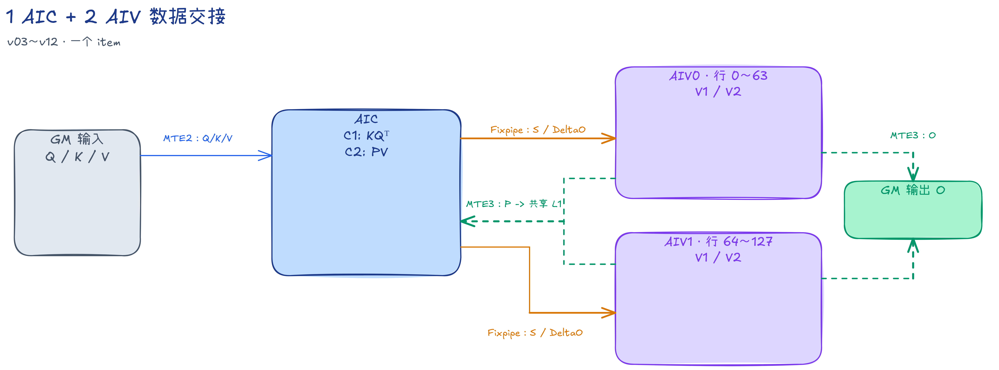

图中以 v03～v12 的片上 `P` 交接为例；v00～v02 的 `P` 会先写入 GM，再由 AIC 读回。

| 核心 | 负责的工作 | 保存的状态 |
| --- | --- | --- |
| AIC | C1 的 $\mathbf K^{(j)}\left(\mathbf Q^{(i)}\right)^\top$；C2 的 $\mathbf P^{(i,j)}\mathbf V^{(j)}$ | L1/GM 中的输入和阶段结果，L0A/L0B/L0C 中的矩阵乘工作槽 |
| AIV0 | Query tile 前 64 个物理行的 V1/V2；最终只写回其中的有效行 | 自己的 $\mathbf m$、$\boldsymbol\ell$、$\boldsymbol\alpha$、$\mathbf O_{\mathrm{acc}}$ |
| AIV1 | Query tile 后 64 个物理行的 V1/V2；没有有效输出行时跳过写回 | 与 AIV0 形状相同、内容独立的另一半状态 |

两路 AIV 各自维护 Softmax 状态，按 Query 行拼成完整结果；AIC 必须等两路 `P` 都就绪后才能执行 C2。即使尾块中 AIV1 没有有效输出行，它仍须参与同步并归还槽位，只跳过最终写回。

AIC 与 AIV 之间的计算和数据交接简称 CV 协作，用于交替交接数据的片上空间称为 CV 槽。

### 片上 SRAM 与核内 Pipe

GM 位于片外，L1、L0 和 UB 属于片上 SRAM；多槽缓冲为同类数据提供可轮换的物理空间。

| 名称 | 所处位置 | 本文中的用途 |
| --- | --- | --- |
| GM | 所有核心可访问的全局内存 | 保存输入、输出，以及 v00～v02 的部分中间量 |
| L1 | AIC 侧片上共享 SRAM | 暂存 `Q`、`K`、`V` 和 `P`；v03～v12 中也负责 AIV→AIC 的 `P` 交接 |
| L0A/L0B/L0C | AIC 内的矩阵乘输入区和累加区 | L0A、L0B 保存矩阵乘输入，L0C 保存 FP32 累加结果 |
| UB | 每颗 AIV 独享的片上 SRAM | 保存注意力分数、Softmax 状态、`P`、`DeltaO` 和 `OAcc` |

各版本 SRAM 图根据 tiling 和核内分配绘制，按单个 AIC、单路 AIV 统计。两路 AIV 各有 248 KiB 私有 UB，GM workspace 不计入 SRAM。

在固定 $B_r=B_c=D=128$ 时，常用缓冲的单槽大小为：

- 一个 $128\times128$ 的 BF16 tile 占 32 KiB；
- 单路 AIV 保存的 $64\times128$ FP32 半块占 32 KiB；
- L0C 保存的 $128\times128$ FP32 整块占 64 KiB。

图中从左到右按地址排列，每段代表一个槽，同类数据同色，灰色表示未分配。宽度不严格按容量缩放；`m`、`l`、`alpha` 各占 0.25 KiB/槽，另用虚线引出放大。跨核访问视图不重复计为分配。

核内 Pipe 分工为：AIC 的 MTE2 搬运 GM→L1，MTE1 搬运 L1→L0，CUBE 计算矩阵乘，FIXP 写出 L0C 结果；AIV 的 MTE2/MTE3 负责读入/写出，VECTOR 计算 Softmax 与输出更新。

### CV 四个协作阶段

下表以 v03～v12 的片上直连通路为例。v00/v01 的分数缓冲 `S`、未归一化注意力权重 `P` 和输出分子增量 `DeltaO` 都经 GM，v02 只有 `P` 经 GM。它们的四阶段计算相同，交接位置不同。

为了与源码和图中的短名称对应：`S` 是 C1 得到的转置分数 $\left(\mathbf S^{(i,j)}\right)^{\top}$，`P` 是 V1 得到的未归一化注意力权重，`DeltaO` 是 C2 得到的输出分子增量，`OAcc` 是 V2 持续更新、尚未除以指数和的输出分子。

| 阶段 | 执行核心 | 计算 | 交接 |
| --- | --- | --- | --- |
| C1 | AIC | $\mathbf K^{(j)}\left(\mathbf Q^{(i)}\right)^\top\rightarrow\left(\mathbf S^{(i,j)}\right)^\top$ | Fixpipe 将前后 64 个逻辑 Query 行（物理布局中的前后 64 列）分别写入 AIV0/AIV1 UB |
| V1 | AIV0/AIV1 | 应用缩放与 causal mask，更新行最大值和指数和，生成 BF16 的未归一化注意力权重 `P` | 两路 AIV 经 MTE3 写入共享 L1，并分别通知 AIC |
| C2 | AIC | $\mathbf P^{(i,j)}\mathbf V^{(j)}\rightarrow\boldsymbol\Delta\mathbf O^{(i,j)}$，得到当前 tile 的输出分子增量 | Fixpipe 将结果的前后 64 行分别写入 AIV0/AIV1 UB |
| V2 | AIV0/AIV1 | 用 $\boldsymbol\alpha$ 把旧输出分子换算到新行最大值基准，再累加 $\boldsymbol\Delta\mathbf O$；末次 item 除以指数和并写回 | 消费 `DeltaO`；末次 item 将最终输出写回 GM |

AIV 的输出累加量 `OAcc` 和最终输出区位于各自的 UB，不由 AIC 复用。最终的 BF16 输出也不另占一块 UB：v00～v02 复用 `pUB`，v03～v05 复用 `PWork`，v06～v12 与 `OAcc` 共址。不同版本的槽位归还方式不同，后文会随版本分别说明。

### 转置计算与 NZ 数据布局

AIC 在 C1 中实际计算 $\left(\mathbf S^{(i,j)}\right)^\top=\mathbf K^{(j)}\left(\mathbf Q^{(i)}\right)^\top$，并把结果写入源码名为 `S` 的分数缓冲。转置后，128 个 Query 行位于 128 列上，Fixpipe 可以把前后 64 列分别送入 AIV0 和 AIV1。

这种方向还有两点好处：

- 每颗 AIV 负责 64 个 Query 列，向量寄存器的 64 个 FP32 元素槽（lane）正好对应 64 个 Query 位置。AIV 沿 Key 行扫描时，用逐元素的最大值和加法同时更新 64 个 Query，减少逐个 Query 执行长归约指令的开销；
- 两路 AIV 生成的 $\left(\mathbf P^{(i,j)}\right)^{\top}$ 分片沿 Query 列相邻，写入共享 L1 后可以直接组成完整的 NZ 分块，供 AIC 的 C2 读取。

AIV 从 `S` 缓冲读取转置后的分数元素 $\left(\mathbf S^{(i,j)}\right)^{\top}_{c,r}=S^{(i,j)}_{r,c}$，生成物理方向同样转置的未归一化注意力权重 $\left(\mathbf P^{(i,j)}\right)^{\top}$。v00～v02 将其保存为 BF16 DN（普通二维布局），经 GM 交给 AIC；v03～v12 将其整理为 BF16 NZ（供 Cube 读取的分块布局），经共享 L1 交给 AIC。

Cube 的左右输入分别使用 NZ、ZN 分块方向，可以把 ZN 理解为 NZ 转置后的方向，即 `Transpose(NZ)=ZN`。FALite 利用 L1→L0 的装载方式完成所需转置，不额外生成一份完整的转置矩阵：

| 操作数 | 进入 L0 前 | 装入 L0 时 | Cube 看到的逻辑矩阵 |
| --- | --- | --- | --- |
| `K` | 从 GM 的 ND 转为 L1 NZ | 直接装入 L0A | $\mathbf K^{(j)}$ |
| `Q` | 从 GM 的 ND 转为 L1 NZ | 按 L0B 的 ZN 方向装入 | $\left(\mathbf Q^{(i)}\right)^\top$ |
| `P` | AIV 生成 $\left(\mathbf P^{(i,j)}\right)^{\top}$；v00～v02 以 DN 写入 GM，v03～v12 以 NZ 写入共享 L1 | 转置装入 L0A | $\mathbf P^{(i,j)}$ |
| `V` | 从 GM 的 ND 转为 L1 NZ | 按 L0B 的 ZN 方向装入 | $\mathbf V^{(j)}$ |

这些装载转置不改变前文的数学公式。

### causal mask 与尾块

未来的 K/V tile 不发射 C1/C2。对角 tile 仍做完整矩阵乘，AIV 将 $c>r$ 的分数屏蔽为 $-\infty$，使对应权重 $P^{(i,i)}_{r,c}=0$。转置布局中，这些无效位置位于下三角。

尾块不足 128 行时，Kernel 只从 GM 读取有效的 `Q`、`K`、`V` 行，在 L1 的其余位置补 0。补齐的 Key 行不参与最大值和指数和统计，最终也只写回有效 Query 行。

### 连续滚动与 `preload(C1)`

v07～v12 不再每两个 item 重启一次调度，而是让循环按 `epoch` 连续向前推进。流水填充完成后，每个 epoch 先发射较新 item 的 C1/V1，再处理较早 item 的 C2/V2。

本文用 `preload(C1)=R` 表示这项配置。例如 `R=3` 且 task 至少包含三个 item 时，AIC 在首个 C2 前依次发射 `C1(0)`、`C1(1)` 和 `C1(2)`；AIV 也会在首个 V2 前发射三个 V1。“预发射”表示计算任务已经进入对应核心的流水，结果可能尚未计算完成。

后文统一把 `R` 称为 C1 预发射数。首个 C2 前实际发射 `min(R, task 的 item 数)` 个 C1；`R` 也决定稳态中同一 item 的各阶段相隔多少轮。本实现让 `V`、`P`、`alpha` 的轮换槽数等于 `R`。

L0C 保存等待 Fixpipe 读出的矩阵乘结果，槽数单独配置。在容量允许时，本样例采用与 `R` 相同的 L0C 槽数：v07 为两槽，v08/v10 为三槽，v09/v11 为四槽。这是配置选择，不要求每个预发射 C1 独占一个 L0C 槽。v12 将 `R` 增至 5，但五个 64 KiB 的 L0C 槽超过 256 KiB 容量，因此仍用四槽。

v07～v09 使用基础 Vector 通路：Online Softmax、`P` 的类型转换与排布整理、输出更新分成多个 Vector 函数执行。v10～v12 使用压缩 Vector 通路：把相邻步骤合入更少的 Vector 函数，减少 UB 中间数据的重复读写。“压缩”指缩短 Vector 执行路径，不是压缩数据格式或数值位宽。

### 数据精度

- `Q`、`K`、`V` 和最终 `O` 使用 BF16；
- 两次 Cube 矩阵乘使用 BF16 输入，并在 L0C 中利用 AIC 自身能力进行 FP32 累加；
- C1 的分数缓冲 `S`（逻辑上是 $\left(\mathbf S^{(i,j)}\right)^{\top}$）、$\mathbf m$、$\boldsymbol\ell$、$\boldsymbol\alpha$ 和 $\mathbf O_{\mathrm{acc}}$ 使用 FP32；
- 未归一化注意力权重 $\mathbf P^{(i,j)}$ 在 V1 内先以 FP32 计算，再转换为 BF16，供 C2 使用；
- C2 的结果保持 FP32 写给 AIV，并在 V2 中与 FP32 $\mathbf O_{\mathrm{acc}}$ 累加；
- 最终除法在 FP32 中完成，写回 GM 前转换为 BF16。

### 核间与核内同步

- CrossCore：协调跨核数据就绪。Fixpipe 写完 `S`/`DeltaO` 后通知 AIV；两路 AIV 的 MTE3 都写完 `P` 后，AIC 才能读取。
- Mutex：协调本核物理槽的复用。每个槽用同一个 ID 在相关 Pipe 间交接所有权，不能替代 CrossCore。

流水示意图的红色虚框表示等待，红色虚线箭头表示 CrossCore 依赖。阶段色块包含计算及必要搬运、写出；反向槽位归还和核内 Mutex 连线省略。

v04～v12 上半图用共享横轴展示跨核重叠，下半图跟踪同一 item 的就绪关系。上半图按源码和槽复用约束定性排布，保守地把归还放在阶段末尾；硬件可能在读完数据后更早归还。色块及空隙宽度不代表实测耗时，实际重叠看 PipeTimeline，具体等待原因需结合源码或 CANNSIM。

v07～v12 各画 `R+2` 个 item，包含填充与排空，图间缩放不同。`epoch` 是每颗核心自己的循环编号，每个 task 从 0 开始，不表示跨核同号轮次同时执行。

## 性能模型与验证口径

### 计算量、理论下限与模型算力利用率（MFU）

causal Attention 的逻辑有效区域包含：

$$
1+2+\cdots+S=\frac{S(S+1)}2
$$

个 Query/Key token 对。每个 token 对在 QK 和 PV 中各完成一次长度为 $D$ 的乘加，分别按 $2D$ FLOPs 统计。再乘上 $B\times N$，两次矩阵乘的合计有效工作量为：

$$
F_{\mathrm{effective}}=2BNDS(S+1).
$$

令 $T=T_r=T_c=\lceil S/128\rceil$。FALite 跳过未来的完整 tile，但已发射的对角 tile 仍按固定 $128\times128$ 计算。实际发射的 tile 对共有 $T(T+1)/2$ 个，因此实际 tile 工作量为：

$$
F_{\mathrm{tile}}=2BND\times128^2\times T(T+1).
$$

当 $S$ 是 128 的整数倍时，上式可化为 $2BNDS(S+128)$。下表的统一性能规格满足这一条件。

950PR 整卡 32 个 AIC 的 BF16/FP16 Cube 峰值来自《昇腾 950 NPU 架构白皮书》，不含 Vector 算力：

$$
P_{\mathrm{device}}=432\times10^{12}\ \mathrm{FLOP/s}.
$$

有效 Cube 利用率使用：

$$
\mathrm{MFU}_{\mathrm{effective}}=
\frac{F_{\mathrm{effective}}}{t_{\mathrm{kernel}}P_{\mathrm{device}}},
$$

其中 $t_{\mathrm{kernel}}$ 是 Kernel Task Duration 的秒数。全版本统一使用整卡峰值；v00 虽只启动一个 AIC，未使用的核心仍计入分母。

汇总表还给出两个辅助指标：

$$
\Delta t_{\mathrm{effective}}=t_{\mathrm{kernel}}-\frac{F_{\mathrm{effective}}}{P_{\mathrm{device}}},
\qquad
U_{\mathrm{tile}}=\frac{F_{\mathrm{tile}}}{t_{\mathrm{kernel}}P_{\mathrm{device}}}.
$$

- $\Delta t_{\mathrm{effective}}$：高于有效工作量峰值下限的时间，包含额外 tile 计算、Vector、搬运和同步等开销，不等于流水空泡。
- $U_{\mathrm{tile}}$：实际 tile Cube 利用率，计入对角块上三角及尾块补零区域；有效 MFU 只计入数学上需要的下三角计算。

取 `B=N=1,S=131072,D=128`，工作量和峰值理论下限为：

| 统计口径 | 工作量/TFLOP | 整卡峰值下限/μs |
| --- | ---: | ---: |
| 有效下三角 | 4.398080065536 | 10180.740892 |
| 实际 tile | 4.402341478400 | 10190.605274 |

### 实验环境与统计方法

- CANN 9.2.0，实验 NPU 为 Ascend 950PR（32 AIC / 64 AIV）；
- `BatchSize=1,HeadNum=1,SeqLen=131072,HeadDim=128`；v00 固定使用 1 个 AIC，v01～v12 使用 32 个 AIC；
- 使用 BasicInfo，预热 5 次、采集 1 次，读取 `OpBasicInfo.csv` 的 `Task Duration(us)`；
- 各版本重复测量取中位数，统计不含 Host Golden 时间。

### 精度标准

公共验证脚本以 FP32 计算 causal Golden，并以 FP32 落盘。NPU 的 BF16 输出读取后转为 FP32，直接与未量化的 FP32 Golden 逐元素比较：

```text
abs(float(npu_bf16) - golden_fp32) <= 0.004 + 0.004 * abs(golden_fp32)
```

全部元素通过才算成功，NaN/Inf 直接失败。

设置 `FA_VERIFY_LOW_PRECISION_BASELINE=1` 可切换到 FlashAttention 风格的低精度基线倍率校验。额外用 Torch BF16 计算一份基线；设 NPU 和该基线相对 FP32 Golden 的最大绝对误差分别为 $E_{\mathrm{npu}}$、$E_{\mathrm{bf16}}$，要求：

$$
E_{\mathrm{npu}}\le2E_{\mathrm{bf16}}.
$$

该模式必须能导入 Torch：

```bash
FA_VERIFY_LOW_PRECISION_BASELINE=1 ./build/Samples/2_Performance/flash_attn_lite_story/falite_v10 --size 1 1 32768
```

在 Demo 默认 `scale=1/sqrt(HeadDim)` 下，v00～v12 的功能验证范围统一为 `BatchSize×HeadNum×SeqLen≤131072`，覆盖整块和非整块用例。v01～v12 逐版验通了 `SeqLen=705`；v10 使用 `SeqLen=707` 覆盖压缩 Vector 通路一次处理多行后的余数，v12 使用 `BatchSize=2,HeadNum=3,SeqLen=129` 覆盖多 Batch、多 Head 和单行尾块。

### 流水统计口径

| 工具 | 规格与用途 | 边界 |
| --- | --- | --- |
| 真机 PipeTimeline | CANN 9.2、单 Mix、`B=N=1,S=2048`，观察各 Pipe 的忙区与重叠 | 小规格耗时不参与长序列排名；并行 Pipe 的忙碌时长不能直接相加 |
| CANNSIM | 单 Mix 小规格输入，核对指令顺序和同步 | 仿真周期不能替代真机耗时 |

真机截图从完整 `trace.json` 中选取 40 μs 窗口，图注按查看器标尺记录。保留 AIC 的 MTE2/MTE1/CUBE/FIXP、两路 AIV 的 VECTOR/MTE3；v00/v01 另保留读取 GM 中间块的 AIV MTE2。窗口不保证对应相同 task/item，只用于观察排布，不计算版本收益。

## 编译、运行与复现

### 最小构建与功能验证

CANN Toolkit 不在默认位置时设置 `ASCEND_HOME_PATH`。在 cann-samples 根目录执行：

```bash
python3 -m pip install -r Samples/2_Performance/flash_attn_lite_story/requirements.txt
cmake -S . -B build -DNPU_ARCH=dav-3510 -DSIM_COMPATIBLE=OFF
cmake --build build --target falite -j
./build/Samples/2_Performance/flash_attn_lite_story/falite_v01 --size 1 1 385
./build/Samples/2_Performance/flash_attn_lite_story/falite_v12 --core-num 1 --size 1 1 768
```

可执行文件和精度校验脚本位于 `build/Samples/2_Performance/flash_attn_lite_story/`。

`falite` 构建全部版本；只构建一个版本时将 target 换成 `falite_vNN`，其中 `NN` 是两位版本号，例如 `falite_v00`。

| 参数 | 含义 |
| --- | --- |
| `--size SeqLen` | 只设置序列长度，`BatchSize=HeadNum=1`；`SeqLen` 可为任意正整数 |
| `--size HeadNum SeqLen` | 设置 Head 数和序列长度，`BatchSize=1` |
| `--size BatchSize HeadNum SeqLen` | 设置 Batch、Head 数和序列长度；不传时使用 `BatchSize=1,HeadNum=1,SeqLen=4096` |
| `--core-num n` | 设置 Mix 核组数上限，以 AIC 数表示；v00 忽略该参数并固定使用一组，v01～v12 不传时使用设备全部可用 AIC |
| `--dry-run` | 仍执行 Kernel、同步、结果回传和落盘，只跳过 Golden 与精度比对 |

### 性能与流水采集

长序列性能使用：

```bash
msopprof --warm-up=5 --launch-count=1 \
    --aic-metrics=BasicInfo \
    --output=<profiling-output> \
    ./build/Samples/2_Performance/flash_attn_lite_story/falite_v12 --dry-run --size 1 1 131072
```

流水截图使用：

```bash
msopprof --aic-metrics=PipeTimeline \
    --output=<profiling-output> \
    ./build/Samples/2_Performance/flash_attn_lite_story/falite_v12 --dry-run --core-num 1 --size 1 1 2048
```

## 版本演进与性能优化

前面介绍的数学公式、causal mask、尾块处理和精度标准在 v00～v12 中保持一致。v00→v01 先改变 task 怎样分给 Mix 核组；后续版本再改变中间数据经过哪一层存储、每类缓冲有多少槽，以及 C1、V1、C2、V2 的发射顺序。

### 版本路线总览

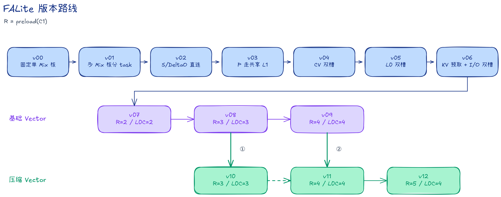

图中实线表示版本演进：① v08→v10 保持 `R=3,L0C=3`，② v09→v11 保持 `R=4,L0C=4`，分别压缩 Vector 通路。v10→v11 的虚线表示两套配置的横向对照，C1 预发射数和 L0C 槽数同时从 3 增至 4。

| 版本 | 主要设计 | 本版回答的问题 |
| --- | --- | --- |
| v00 | 一个 Mix 核组顺序遍历全部 task | 用最少的任务调度建立完整计算和同步闭环 |
| v01 | 多个 Mix 核组分担 task，数据通路仍为单槽 GM | 单独观察 task 级并行带来的变化 |
| v02 | 分数缓冲 `S` 和 `DeltaO` 由 Fixpipe 直达 AIV UB | 去掉两类 AIC→AIV 中间块的 GM 往返 |
| v03 | `P` 经共享 L1 交给 AIC | 去掉最后一份 GM workspace |
| v04 | 相邻两个 item 使用两套 CV 槽 | 让 AIC 和 AIV 可以错位处理相邻 item |
| v05 | 为 L0A/L0B/L0C 打开双缓冲 | 让 AIC 内的搬运、Cube 和 Fixpipe 可以交叠 |
| v06 | C1 同时预取 `K`、`V`，Query 与输出使用 I/O 双槽 | 减少 C2 等待 `V` 的时间，并交叠相邻 task |
| v07 | 预发射 `preload(C1)=2`，取消固定 group | 让新 C1/V1 越过固定分组边界 |
| v08 | `preload(C1)=3`，基础 Vector 通路 | 检验多保留一个在途 item 能否覆盖等待区间 |
| v09 | `preload(C1)=4`，基础 Vector 通路 | 检验继续增加 C1 预发射数是否还有收益 |
| v10 | `preload(C1)=3`，压缩 Vector 通路 | 在较少的 C1 预发射数下建立压缩 Vector 对照点 |
| v11 | `preload(C1)=4`，压缩 Vector 通路 | 保持 v09 的缓冲配置，观察压缩 Vector 通路的效果 |
| v12 | `preload(C1)=5,L0C=4`，压缩 Vector 通路 | 检验第五个预发射 C1 的边际收益 |

v08～v12 覆盖 `preload(C1)`、L0C 槽数和 Vector 通路三项配置，版本号本身不代表一条单变量优化曲线。下面按可比配置整理它们的关系：

| `preload(C1)` | 基础 Vector 通路 | 压缩 Vector 通路 | 直接对照 |
| ---: | --- | --- | --- |
| 3 | v08，`L0C=3` | v10，`L0C=3` | v08→v10 只改 Vector 通路 |
| 4 | v09，`L0C=4` | v11，`L0C=4` | v09→v11 只改 Vector 通路 |
| 5 | — | v12，`L0C=4` | v11→v12 只改 `preload(C1)` |

### v00～v03：从单核闭环到片上数据交接

#### v00：一个 Mix 核组顺序完成全部 task

##### 先建立最简单的完整流程

v00 固定发射一个 Mix 核组。唯一的 AIC 和同组两路 AIV 从 task 0 开始，按编号顺序遍历全部 Query tile；`--core-num` 在这一版不参与分核。

每个 item 使用一套物理槽，并按下面的顺序闭环：

```text
C1 -> 分数缓冲 S 写入 GM -> V1 -> 未归一化权重 P 写入 GM
   -> C2 -> 输出分子增量 DeltaO 写入 GM -> V2 -> 下一 item
```

`S`、`P`、`DeltaO` 的生产者都先把结果写入 GM，消费者再读回。三份中间块合计需要 160 KiB/task 的 GM workspace；Host 在释放这块内存前同步 stream。


v00 的片上缓冲全部为单槽：L1 中的 `P`、`Q`、`K`、`V` 各占 32 KiB，L0A/L0B 各占 32 KiB，L0C 占 64 KiB；单路 AIV UB 使用 112.75 KiB。GM workspace 不计入图中。


图上方先画出唯一核组的 task 循环，下方再展开一个 item 的 C1/V1/C2/V2。红色虚线表示 CrossCore 数据就绪关系，虚框表示消费者可能等待生产者。

##### 仿真与真机流水


CANNSIM 使用 `BatchSize=1,HeadNum=1,SeqLen=512`，截图直接取自完整 trace 的 `[18,32]` μs。4 个 Query tile 在 causal 模式下形成 `1+2+3+4=10` 个 item；完整 trace 中恰有 20 次 MMAD 和 20 次主要 Fixpipe 写出，对应每个 item 的 C1、C2 各一次。CUBE 与 AIV Vector 的重叠只占 CUBE 有效区间的 4.72%，符合单槽顺序通路的预期。


真机截图使用 `BatchSize=1,HeadNum=1,SeqLen=2048`，窗口为 `[368.8,408.8]` μs。AIC 的 MTE2/MTE1/CUBE/FIXP 与两路 AIV 的 MTE2/Vector/MTE3 都有任务，阶段忙区之间仍有明显空隙。

长序列 `BatchSize=1,HeadNum=1,SeqLen=131072` 下，v00 固定使用 1 个 AIC，三次采集的 Kernel 时间中位数为 2574789.75 μs。按整卡 432 TFLOP/s 峰值计算，有效 Cube MFU 为 0.3954%。这一数值把其余 31 个未参与计算的 AIC 也计入分母，可以与后续版本直接比较。

##### 下一步为什么先增加 task 并行

v00 的整卡 MFU 只有 0.3954%，首要原因是它固定使用一个 Mix 核组，其余 31 个 AIC 和配套 AIV 没有参与计算。此时先调整核组内部流水，只能改善已经启动的这一组核心，无法利用整卡的大部分算力。

分配更多核组不改变 Attention 数学。一个 Query tile 的输出只依赖自己的 `Q` 和只读的 `K/V`，Softmax 状态也只在该 task 内更新；两个 task 写入的输出行和 GM workspace 均不重叠。因此它们可以由不同 Mix 核组同时计算。若 task 数量充足且负载完全均衡，理想加速上限接近实际启动的核组数；真实收益还会受到 causal task 工作量不均、GM 带宽和调度开销影响。

v01 据此保留 v00 的四阶段计算、GM 数据通路和单槽缓冲，只增加 task 级分核。这样可以先把“有没有使用整卡”与后续“单个核组内部流水是否高效”分开观察。

#### v01：多个 Mix 核组并行处理 task

##### 从单核循环到跨核分工

v01 根据请求核数、设备核数和 task 总数确定实际 Mix 核组数。编号为 `aicIdx` 的核组处理：

```text
tr        = ceil(SeqLen / 128)
numTasks  = BatchSize * HeadNum * tr
useAicNum = min(请求核数或设备核数, numTasks)

taskId = aicIdx, aicIdx + useAicNum, aicIdx + 2 * useAicNum, ...
```

AIC 和同组两路 AIV 使用相同的 task 序列。等价地说，`taskId % useAicNum` 决定了这个 task 交给哪个 Mix 核组。单个 item 仍按 v00 的单槽顺序执行，`S`、`P`、`DeltaO` 仍经 GM，片上 SRAM 分配也没有改变。

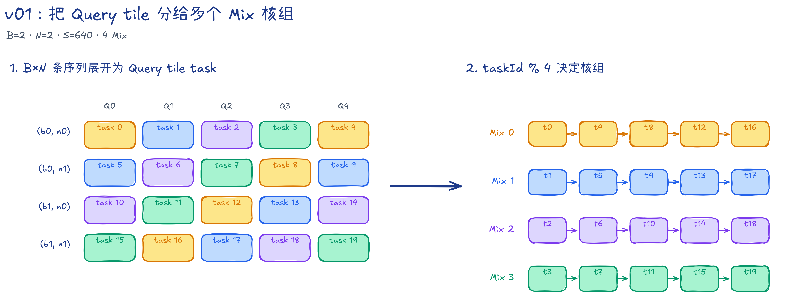

图中用 `BatchSize=2,HeadNum=2,SeqLen=640` 和 4 个 Mix 核组举例。每个 `(b,n)` 有 5 个 Query tile，共形成 20 个 task；`t0`～`t19` 是 task 编号，颜色表示 `taskId % 4` 的结果。右侧列出每个核组实际遍历的 task，核组之间没有数据依赖，同一核组内的 AIC/AIV 则共同处理这条 task 序列。

causal 模式下，第 `i` 个 Query tile 有 `i+1` 个 item，越靠后的 task 工作量越大。固定步长分配把连续 task 轮转到不同核组，能够分散轻、重任务，但不保证各组耗时完全相同。当同一轮的连续 `taskId` 没有跨过 `(b,n)` 边界时，各核组会读取高度重合的 K/V 前缀，也可能利用 L2 中已有的数据；跨 Head 或 Batch 时没有这类共享，实际命中率不作保证。

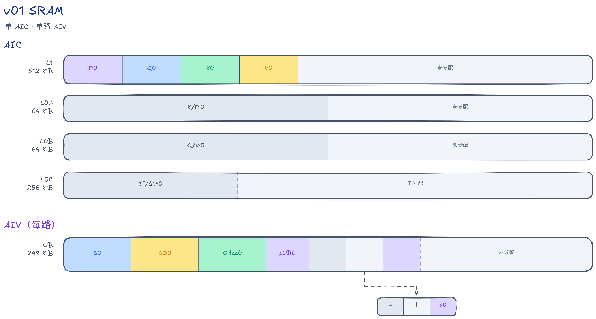

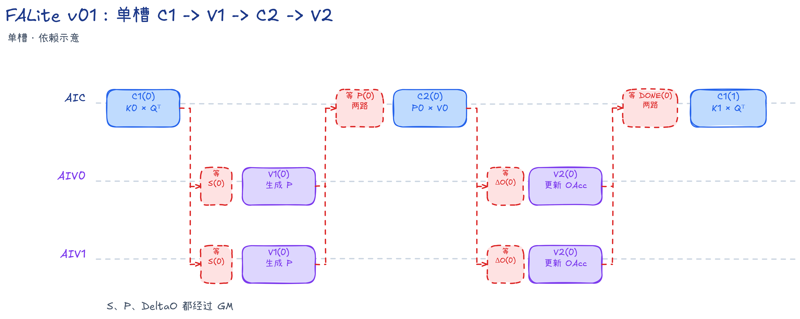

示意图只展开一个核组内部的 item 闭环；多个核组之间没有 CrossCore 数据依赖，它们各自领取并完成自己的 task。

##### 流水与性能

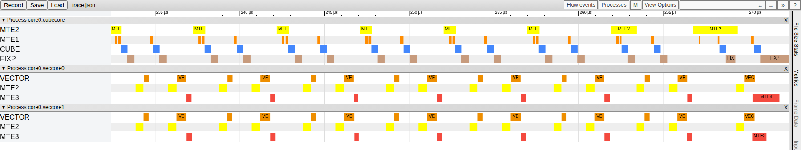

统一长序列规格下，v01 使用 32 个 AIC，耗时 88377.64 μs，有效 Cube MFU 为 11.52%。相较固定 1 个 AIC 的 v00，耗时缩短 96.57%，加速 29.13 倍。这里同时改变了实际核数，只说明 task 级并行的效果，不代表单个核组内部流水快了 29.13 倍。

截图窗口为 `[232.419,272.419]` μs。AIV0/AIV1 的 MTE2 泳道对应中间块从 GM 读回 UB 的搬运；单槽阶段之间仍有明显间隔。

##### 还剩的问题

多个核组已经把 task 并行起来，但每个核组内部的三份中间结果仍反复经过 GM。`S` 和 `DeltaO` 都由 AIC 产生、由 AIV 消费，Ascend 950 的 Fixpipe 可以把它们直接写入 AIV UB。v02 先缩短这两条通路。

#### v02：分数缓冲 `S` 和输出分子增量 `DeltaO` 直接进入 AIV UB

##### v01 留下的问题

v01 的 C1 和 C2 都先把结果写入 GM，V1 和 V2 再由 AIV MTE2 读回。两次 AIC→AIV 交接本可以利用片上直连，不需要绕行 GM。

##### v02 的改法

v02 让 AIC Fixpipe 把分数缓冲 `S` 和输出分子增量 `DeltaO` 分别写入两路 AIV 的 UB：

```text
C1 -> Fixpipe 写 AIV UB -> V1 -> 未归一化权重 P 写入 GM
   -> C2 -> Fixpipe 写 AIV UB -> V2
```

未归一化注意力权重 `P` 仍按 AIV UB→GM→AIC L1 交接，所以 workspace 降到 32 KiB/task，但尚未归零。AIV MTE3 和 AIC MTE2 仍需搬运 `P`，这成为下一步可缩短的数据通路。

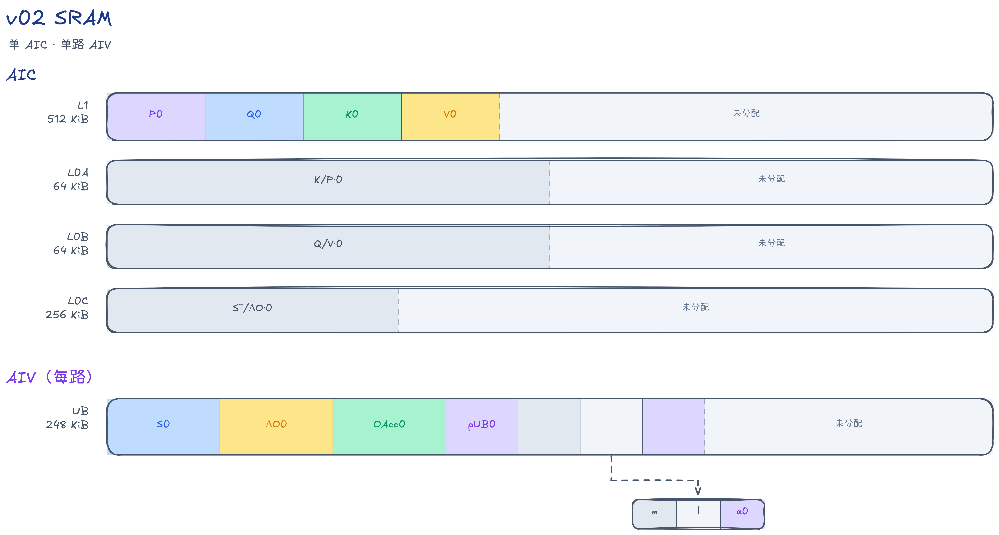

v02 改变的是 `S` 和 `DeltaO` 的交接路径，片上缓冲的大小和槽数与 v01 相同。AIC 中指向 AIV UB 的地址只是 Fixpipe 的写入视图，不会重复占用一份 SRAM；`P` 的 32 KiB/task GM workspace 仍需另算。

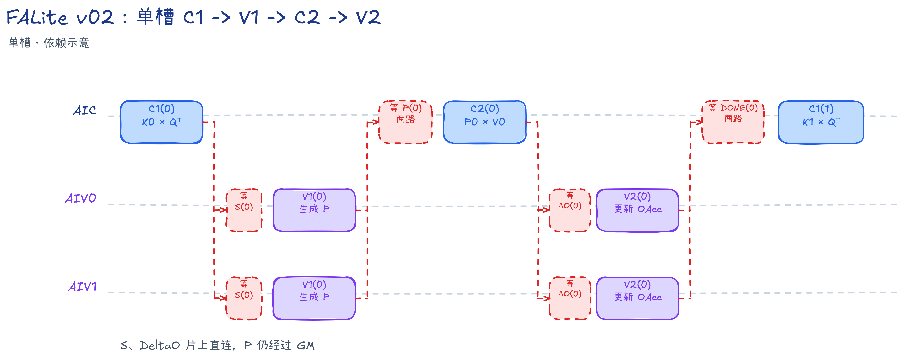

##### 流水与性能

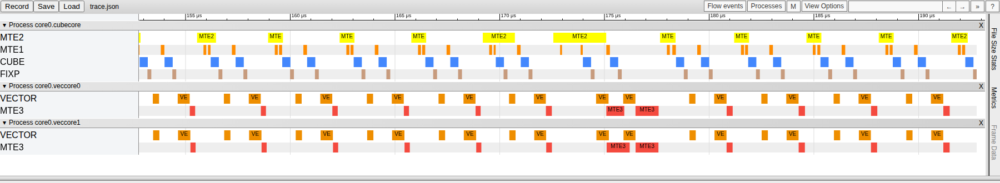

统一长序列规格下，v02 耗时 62899.64 μs，有效 Cube MFU 为 16.19%，较 v01 缩短 28.83%。截图窗口为 `[152.785, 192.785]` μs；分数缓冲 `S` 和输出分子增量 `DeltaO` 的 GM 往返已经移除，`P` 的 MTE3/MTE2 交接仍然存在。

##### 还剩的问题

`P` 仍要执行 AIV UB→GM→AIC L1，32 KiB/task 的 workspace 和对应搬运都还存在。v03 把这最后一份中间量也留在片上。

#### v03：未归一化注意力权重 `P` 经共享 L1 交给 AIC

##### v02 留下的问题

V1 在 AIV 上生成 `P`，C2 随后在 AIC 上消费 `P`。v02 借助 GM 完成这次 AIV→AIC 交接，路径仍然偏长。

##### v03 的改法

v03 在 AIV UB 中把 FP32 `P` 转成 BF16 NZ 布局（供 Cube 读取的分块布局），再经 MTE3 写入共享 L1。AIC 的 MTE1 从共享 L1 读取 `P` 到 L0A，随后执行 C2：

```text
C1 -> V1 -> P: AIV UB -> 共享 L1 -> AIC L0A -> C2 -> V2
```

三个中间块都留在片上，GM workspace 归零。不过只有一套 CV 槽，同一物理槽尚未被上一阶段释放时，下一 item 不能进入，AIC 和 AIV 很难同时处理相邻 item。

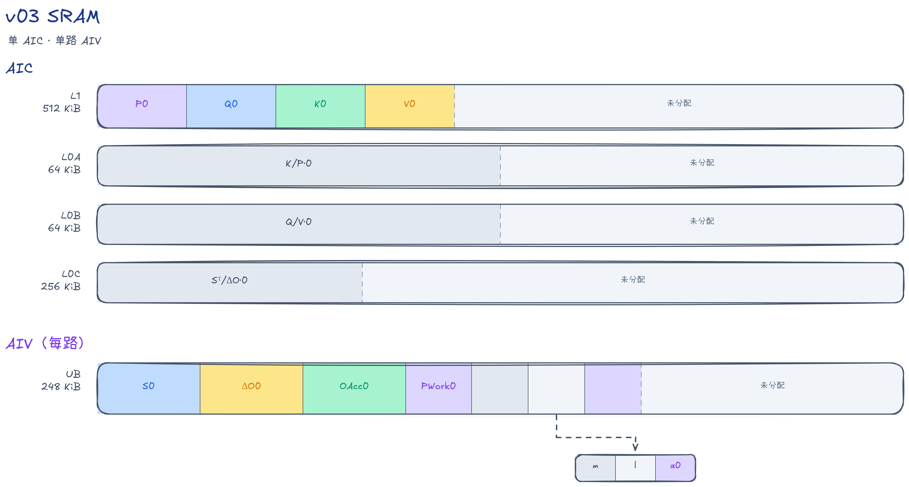

v03 的 AIC 分配仍与 v01/v02 相同。AIV 的 `pUB` 改为 `pWorkUB`，每个 16 列 NZ 分组增加一个 32 B 的 padding block，因此这一槽由 16 KiB 增至 16.125 KiB，单路 UB 总量为 112.875 KiB。


##### 流水与性能


统一长序列规格下，v03 耗时 58697.13 μs，有效 Cube MFU 为 17.34%，较 v02 缩短 6.68%。截图窗口为 `[140.107, 180.107]` μs；`P` 已不再往返 GM，但单槽依赖仍留下较多跨 Pipe 空隙。

##### 还剩的问题

数据通路已经留在片上，但一个 item 仍要等上一 item 归还唯一的 CV 槽才能进入。v04 为相邻 item 准备两套槽，让生产者和消费者可以错位执行。

### v04～v06：让相邻 item 和 task 逐步重叠执行

#### v04：用两套 CV 槽错位处理两个 item

##### v03 留下的问题

v03 只有一套 CV 槽。V1 还在读取 `S(0)` 时，AIC 不能覆盖同一块空间写 `S(1)`；C2/V2 也有相同的复用限制。片上直连已经建立，但相邻 item 仍接近串行。

##### v04 的改法

v04 首次使用固定的双 item 分组，即 `group=2`。同一 task 中每两个连续 item 组成一组，最后不足两个时只处理真实存在的 item。`K`、`V`、分数缓冲 `S`、未归一化注意力权重 `P`、`DeltaO`、`alpha` 和 `PWork` 分别准备两个轮换槽。

这些数据共用相同的 item 槽号，但仍是多块独立的物理缓冲。`PWork` 是 AIV UB 中暂存并整理 `P` 排布的工作区。组内发射顺序可以简化为：

```text
AIC: C1(0) -> C1(1) -> C2(0) -> C2(1)
AIV: V1(0) -> V1(1) -> V2(0) -> V2(1)
```

AIC 的 `C1(1)` 可以与 AIV 的 `V1(0)` 重叠，后续阶段也能错位推进。两路 AIV 分别发送“`P` 已就绪”通知；真机 mode2 下，AIC 只有收到两路通知，才能执行 C2。

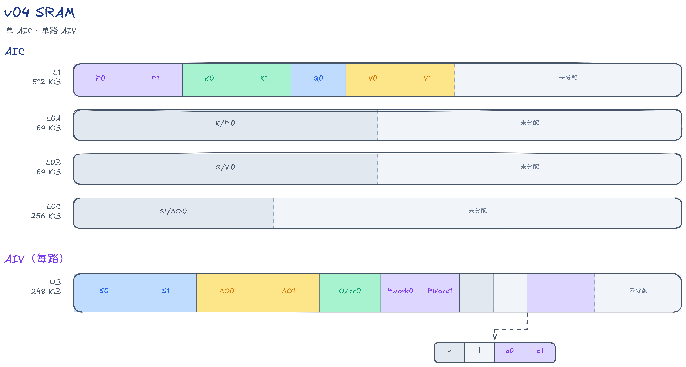

双 CV 槽把 AIC L1 用量增至 224 KiB，单路 AIV UB 增至 193.25 KiB。L0A、L0B、L0C 与 task 级 `Q`、`OAcc` 仍是单槽，这正是 v05 要继续处理的限制。


上半图展示连续两组 item：`C1(1)` 可以与 `V1(0)` 重叠，`C2(0)` 也可以与 `V1(1)` 重叠。两核仍分别遵守“两次 C1、两次 C2”和“两次 V1、两次 V2”的顺序，但组边界并不要求跨核同时结束。CV item 缓冲按 `j % 2` 轮换，L0 仍为单槽；下半图给出任意一个 item 都必须满足的依赖链。

##### 流水与性能


统一长序列规格下，v04 耗时 31164.51 μs，有效 Cube MFU 为 32.67%，较 v03 缩短 46.91%。截图窗口为 `[88.796, 128.796]` μs；相同的 40 μs 视窗内出现了更多 CUBE、FIXP 与 VECTOR 重叠，CV 双槽已经允许 AIC 和 AIV 错位处理相邻 item。

##### 还剩的问题

v04 已经让 CV 核间的粗粒度阶段错位，但 AIC 内的 L0A/L0B/L0C 仍只有一槽。下一次装载、矩阵乘或 Fixpipe 写出可能因上一条 AIC 核内流水尚未归还 L0 而等待。v05 把优化范围推进到 AIC 核内。

#### v05：L0 双缓冲让 AIC 的搬运、Cube 和 Fixpipe 错位

##### v04 留下的问题

v04 主要在 C1、V1、C2、V2 四个阶段之间做 CV 重叠。AIC 内部的 MTE1、CUBE、FIXP 仍受单套 L0 约束，核间流水已经放开，核内却可能把前后阶段重新串起来。

##### v05 的改法

v05 将 L0A、L0B、L0C 改为双槽。MTE1/MTE2、CUBE 和 FIXP 按槽位交接所有权，使一套 L0 正在计算或写出时，另一套可以装入下一阶段的数据。

C1 分别向 MTE2 和 MTE1 发射 `K` 与 `Q` 的搬运。C2 中，未归一化注意力权重 `P` 的 L1→L0A 与 `V` 的 GM→L1→L0B 使用独立就绪关系，一条加载路径无需等待另一条先完成。

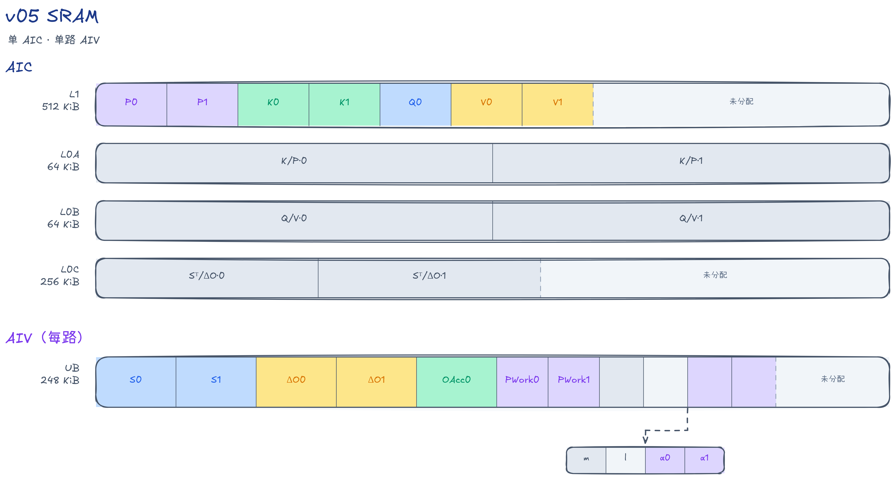

v05 的 CV 缓冲与 v04 相同，只把 AIC 的 L0A、L0B、L0C 由单槽扩成双槽。L0A 和 L0B 各占满 64 KiB，L0C 使用 128/256 KiB。

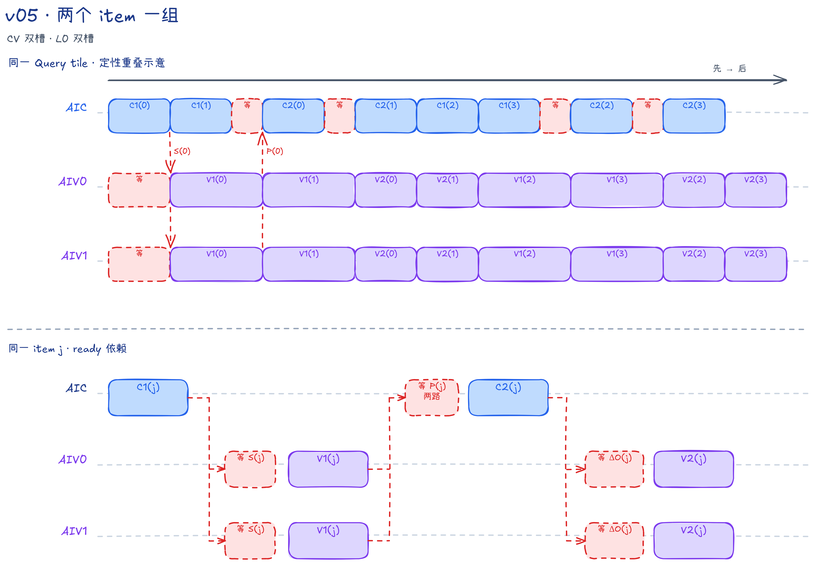

示意图保留与 v04 相同的整阶段 CV 重叠结构；v05 新增的是阶段内部的 L0 双槽交接，具体的 MTE1、CUBE、FIXP 重叠见下方 PipeTimeline。该版 `P` 写完后分别通知 AIC 的 MTE1 和 MTE2：前者装载 `P`，后者搬入 `V`。下半图的一条 `P` 依赖概括了这两条通知。

##### 流水与性能


统一长序列规格下，v05 耗时 26319.76 μs，有效 Cube MFU 为 38.68%，较 v04 缩短 15.55%。截图窗口为 `[77.589, 117.589]` μs；AIC 的 MTE1、CUBE 和 FIXP 比 v04 更紧密地交叠。

##### 还剩的问题

C2 仍要等 `P` 生成后才开始从 GM 装入 `V`。`V` 是只读输入，不依赖 `P`，这次 DMA 可以提前发射。v06 把它移到 C1，使搬运有机会与前面的矩阵乘重叠。

#### v06：提前装入 `V`，并用 I/O 双槽交叠相邻 task

##### v05 留下的问题

v05 的 C2 要在 `P` 就绪后才通过 MTE2 搬入 `V`，这次搬运位于 C2 的必经路径上。另一方面，前一个 task 的输出写回也可能挡住下一个 task 的起步。

##### v06 的改法

v06 在 C1 阶段一起把 `K` 和 `V` 搬入共享 L1。DMA 异步发射后，`V` 的 GM→L1 搬运有机会与 $\mathbf K^{(j)}\left(\mathbf Q^{(i)}\right)^\top$ 的 Cube 计算重叠。MTE1 读完 `K` 后继续保留这一 K/V 槽，直到同一 item 的 C2 消费完 `V` 才归还，避免下一代数据提前覆盖。

Query L1 和 AIV 的输出区域还增加了两个 I/O 槽。一个 task 的结果经 MTE3 写回 GM 时，下一个 task 可以使用另一槽开始装入 Query 和执行计算。

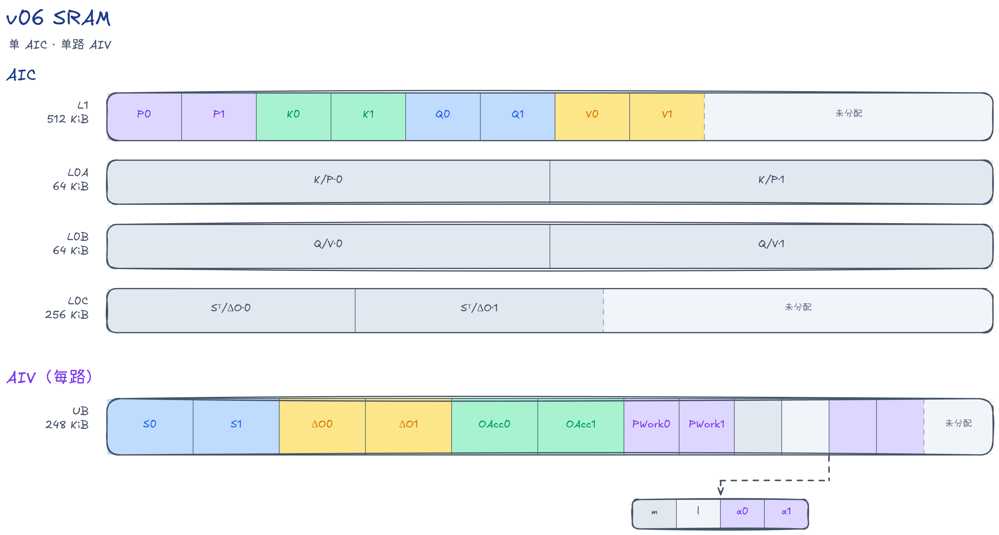

I/O 双槽把 AIC L1 用量增至 256 KiB，并把单路 AIV UB 用量增至 225.25 KiB。`m`、`l` 仍是 task 内顺序更新的一份状态，不随双槽复制。


`K,V ↓ L1` 表示 C1 同时提前搬入该 item 的 `K` 和 `V`，后续 C2 从 L1 读取 `V`。CV item 缓冲仍按 `j % 2` 轮换；`Q` 与输出累加缓冲则按 task 的 `ioSlot` 轮换。图中未展开这层 I/O 双缓冲，其写回与下一 task 计算的重叠见下方 PipeTimeline。

##### 流水与性能


统一长序列规格下，v06 耗时 24255.71 μs，有效 Cube MFU 为 41.97%，较 v05 缩短 7.84%。截图窗口为 `[68.998, 108.998]` μs。结合源码可知，AIC MTE2 在 C1 中同时发射 `K`、`V` 搬运；截图则直接显示了 MTE2、CUBE 与其他 Pipe 的重叠，以及 AIV MTE3 写回与后续计算并行出现。

##### 还剩的问题

v06 每组只能先发射两个 C1。AIV 连续处理 `V1(0)`、`V1(1)` 时，AIC 随后要等对应的 `P` 才能执行 C2；下一组的 `C1(2)` 本来不依赖这些 `P`，却被固定 group 的循环边界挡住。AIC 反复按“两次 C1、两次 C2”的顺序发射，限制了后续 C1 提前执行的机会。v07 取消固定分组，让 item 连续向前滚动。

### v07～v09：取消固定分组，增加首个 C2 前预发射的 C1

#### 为什么双缓冲仍会留下等待

v06 的 AIC 在一个 group 内发射 `C1(0), C1(1), C2(0), C2(1)`。当它等待 `P(0)` 或 `P(1)` 时，下一组的 `C1(2)` 已经不依赖这些 `P`，却仍被本地循环顺序挡在组外。AIV 等待旧 `DeltaO` 时也存在同类问题。

v07～v09 使用统一的 epoch 公式：

```text
AIC: C1(t)   后处理较早的 C2(t-R+1)
AIV: V1(t-1) 后处理较早的 V2(t-R)
```

填充阶段先发射新 C1/V1，稳态阶段还会消费较早 C2/V2，排空阶段停止产生新 item 并完成剩余阶段。item 足够时，首个 C2 前会发射 `R` 个 C1。这让较新 item 的 C1/V1 与较旧 item 的 C2/V2 获得更多重叠机会，但不会缩短 V1/V2 本身的执行时间。

v07、v08、v09 保持基础 Vector 通路，依次把 `R` 从 2 增到 4，并增加容纳在途 item 所需的槽位。这个实验要回答的是：在片上 SRAM 允许的范围内，多发射一个 C1 能否继续覆盖等待区间。

#### v07：首个 C2 前预发射两个 C1，即 `preload(C1)=2`

##### 从固定分组到连续滚动

v07 先连续发射一批没有前置依赖的 C1。进入稳态后，每个 epoch 一边产生较新 item 的 `S`，一边消费较早 item 的 `P`；AIV 也按相同思路错位执行 V1 和 V2。输入结束后，再把剩余 C2/V2 排空。填充和排空阶段不可能完全重叠，主要收益来自中间的稳态区。

v07 为 `V`、`P` 和 `alpha` 各自保留两个轮换槽，但不再每两个 item 重启一次局部顺序：

```text
C1(j): epoch j
V1(j): epoch j+1
C2(j): epoch j+1
V2(j): epoch j+2
```

分数缓冲 `S` 和输出分子增量 `DeltaO` 使用 ready/free 双向 CrossCore 交接，槽位可以在连续 epoch 中回卷。新的 C1/V1 可以越过 v06 的组尾等待。

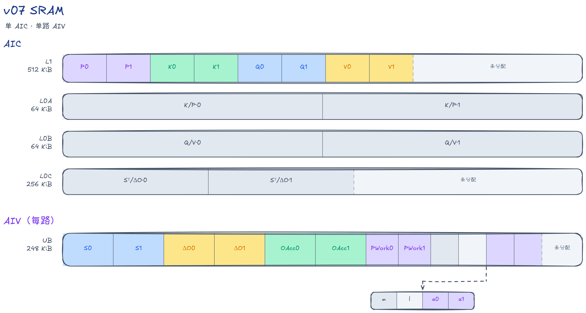

v07 的数值布局与 v06 相同，但槽的含义更明确：`P`、`V`、`alpha` 保存跨阶段的两代 item；`K`、`Q`、`S`、`DeltaO`、`PWork`、`OAcc` 使用短生命周期双槽；L0C 是独立的两槽结果队列。


##### 流水与性能


统一长序列规格下，v07 耗时 19446.87 μs，有效 Cube MFU 为 52.35%，较 v06 缩短 19.83%。截图窗口为 `[55.175, 95.175]` μs；AIC 和 AIV 的主要忙区继续变密，但 `preload(C1)=2` 时，AIC 在等待旧 `P` 前只能多准备一个新的 C1。

##### 还剩的问题

`preload(C1)=2` 时，AIC 发射较新 item 的 C1 后仍可能等待较旧 item 的 `P`。v08 把首个 C2 前的 C1 数增至三个，观察多出的一个在途 item 能否覆盖这段等待。

#### v08：首个 C2 前预发射三个 C1，即 `preload(C1)=3`

##### v07 留下的问题与 v08 的改法

v08 将 `C2(j)` 延后到 epoch `j+2`，将 `V2(j)` 延后到 epoch `j+3`。`V`、`P`、`alpha` 各自使用三个轮换槽，L0C 结果也使用三槽。

AIC 等待 `P(j)` 前可以先发射到 `C1(j+2)`；AIV 在处理较旧 item 的 V2 前，也能多发射一个较新 item 的 V1。行最大值 `m`、指数和 `l` 与输出累加量 `OAcc` 仍严格按 K/V tile 顺序更新。

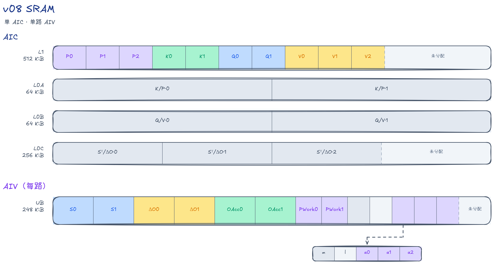

与 v07 相比，v08 只把需要跨 C1→C2 或 V1→V2 保存的 `P`、`V`、`alpha` 扩成三槽，并把 L0C 结果队列加深到三槽。其余短生命周期缓冲仍是双槽。

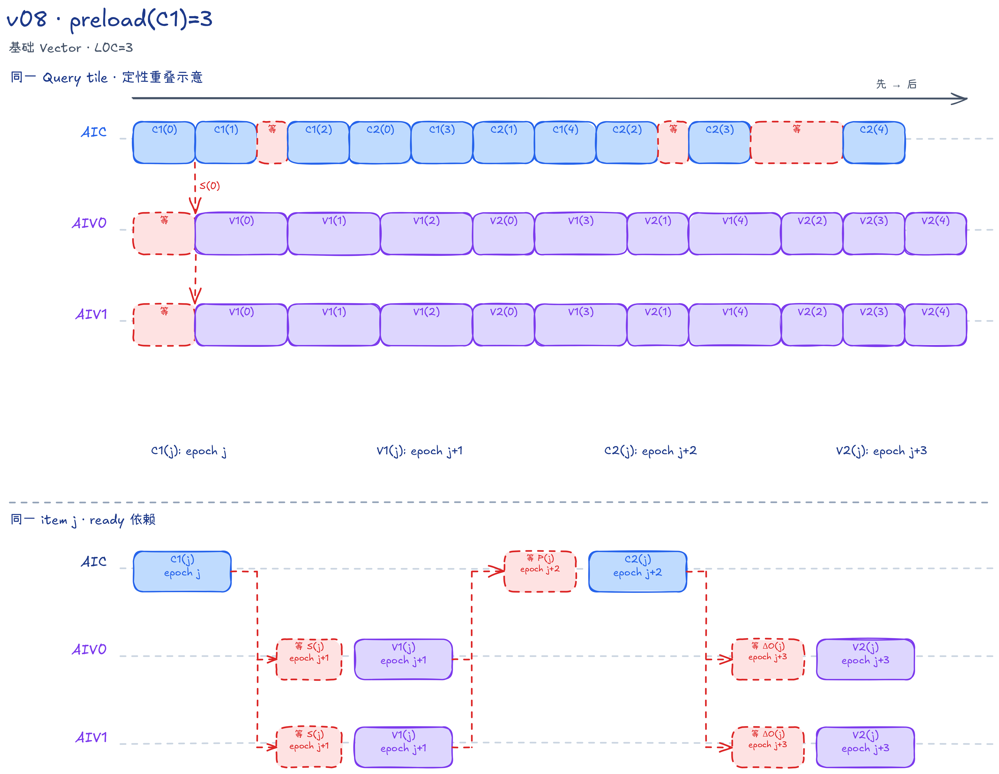

##### 流水与性能


统一长序列规格下，v08 耗时 15132.38 μs，有效 Cube MFU 为 67.28%，较 v07 缩短 22.19%。截图窗口为 `[45.915, 85.915]` μs；首个 C2 前多预发射一个 C1 后，CUBE、FIXP 和 VECTOR 形成更长的连续忙区。

##### 还剩的问题

`preload(C1)/L0C=2/2→3/3` 的整套配置让同时未完成的 item 更多，并覆盖了 v07 中的部分等待；22.19% 的变化不能单独归因于 C1 预发射数或 L0C。流水中仍能看到较长的 Vector 工作块。v09 再增加一个在途 item，检查这条路是否还有余量。

#### v09：首个 C2 前预发射四个 C1，耗时基本不变

##### v08 留下的问题与 v09 的改法

v09 为 `V`、`P`、`alpha` 和 L0C 结果各自保留四个槽，同一 item 的 C1 到 V2 相隔四个 epoch。AIV 仍使用基础 Vector 通路：Online Softmax 与 `P` 的 FP32→BF16 转换和排布整理分开执行，V2 使用独立的乘法和加法更新输出。

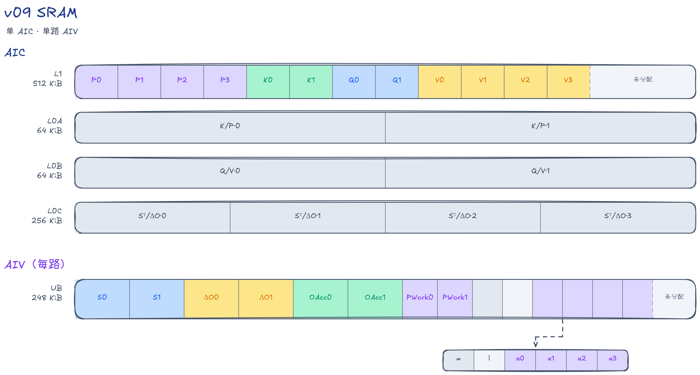

四槽使 AIC L1 使用 384/512 KiB，L0C 使用 256/256 KiB；单路 AIV UB 使用 225.75/248 KiB。L0C 已没有继续增加完整 FP32 tile 的空间。

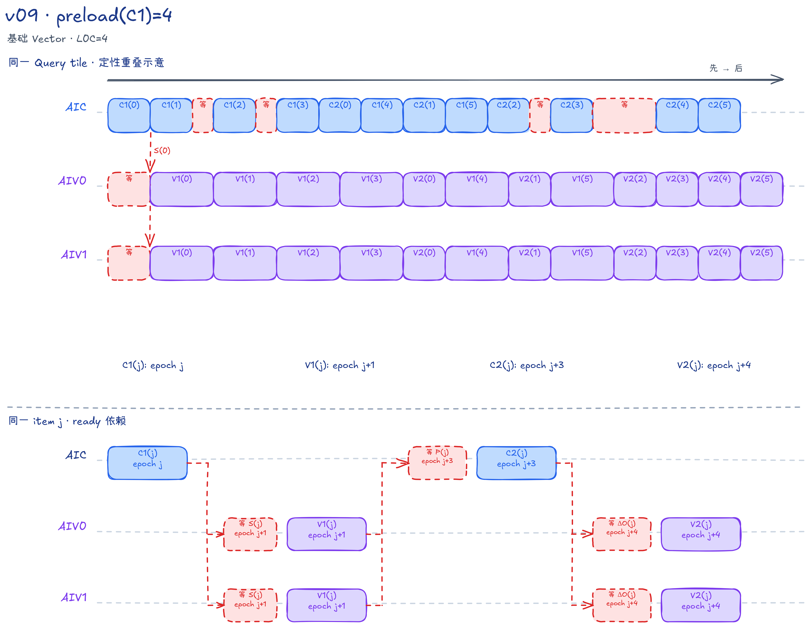

##### 流水与性能


统一长序列规格下，v09 耗时 15120.49 μs，有效 Cube MFU 为 67.33%，较 v08 只缩短 0.08%，两版处于相近水平。截图窗口为 `[44.312, 84.312]` μs。

##### 这条路线为什么到这里停下

v08→v09 同时改变 C1 预发射数和 L0C 槽数，因此这里只评价整套配置。保持基础 Vector 通路不变时，`preload(C1)/L0C=3/3→4/4` 多保留了一个在途 item，却没有带来可确认的端到端收益。增加预发射数量只能覆盖等待，不能缩短 V1/V2 自身。下一组版本转而优化 Vector 通路，再重新比较 `R=3/4/5`。

### v10～v12：压缩 Vector 通路后，重新比较 `preload(C1)`

v08→v09 继续增加 C1 预发射数，耗时只变化 0.08%。PipeTimeline 中 AIC 的主要 Pipe 已较连续，AIV 仍有较长的 Vector 工作块。于是 v10～v12 不再只靠更多在途 item，而是把 V1/V2 中相邻的向量步骤合入更少的 Vector 函数，并通过循环展开和多路寄存器累加减少串行依赖与 UB 中间读写。

#### v10：`preload(C1)=3`，建立压缩 Vector 通路的对照点

##### 设计目的

v10 在 `preload(C1)=3` 的调度下采用压缩 Vector 通路。V1 仍扫描分数两遍：第一遍求行最大值，第二遍计算指数和，同时把 FP32 的指数结果转换并整理成 BF16 NZ `P`。这样不再需要先把指数结果写回 `S` 的 UB 缓冲，再启动另一个 Vector 函数重新读取。求和时使用四路寄存器分别累加，最后再合并结果，以缩短连续加法的依赖链。

V2 的首个 item 直接用输出分子增量 `DeltaO` 建立 `OAcc`，不再先写一份全零初值；后续 item 使用多路寄存器和融合乘加完成 `alpha×OAcc+DeltaO`。这些改动共同减少了 Vector 函数数量、UB 读写和串行计算。

v10 保持 v08 的 `preload(C1)=3,L0C=3`，Host、AIC 和核间同步不变，两版只在 AIV 的 Vector 通路上不同。

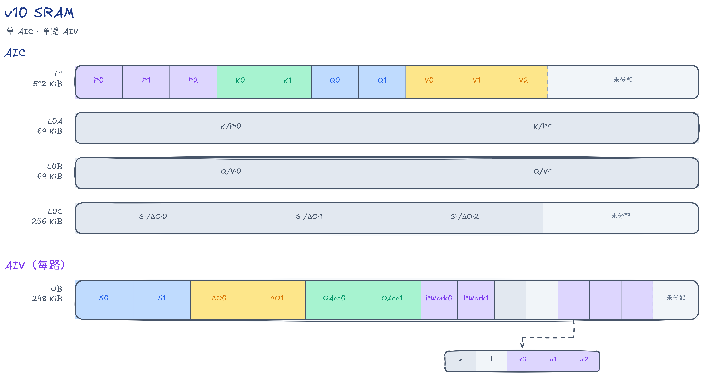

v10 的 `P`、`V`、`alpha` 和 L0C 各用三槽，L0C 占用 192 KiB。压缩 Vector 通路改变的是向量函数内部计算与寄存器组织，没有新增或删减 UB 缓冲。


##### 流水与性能


统一长序列规格下，v10 耗时 13399.55 μs，有效 Cube MFU 为 75.98%。单 Mix、`SeqLen=2048` 的 Task Duration 为 117.54 μs，截图窗口为 `[41.778, 81.778]` μs。与 v08 相比，压缩 Vector 通路缩短了 AIV Vector 的工作块；AIC 与 AIV 之间仍有可见的空隙，不能仅凭截图确定每段空隙对应哪一次等待。

##### 还剩的问题

从源码看，`R=3` 时 AIC 在发射新 C1 后，仍可能等待较旧 item 的 `P`。另一条路线是在 v09 的 `R=4,L0C=4` 配置上应用相同的 Vector 优化，得到 v11。v10 与 v11 用于比较三槽、四槽两套方案；它们同时改变预发射数和 L0C 深度。

#### v11：压缩 Vector 通路下使用 `preload(C1)=4`

##### 从 v09 压缩 Vector 通路

v11 保持 v09 的 `preload(C1)=4,L0C=4`，只把基础 Vector 通路改为压缩 Vector 通路。它与 v08→v10 构成两组平行的优化路线，分别回答三槽、四槽配置下缩短 V1/V2 有什么效果。

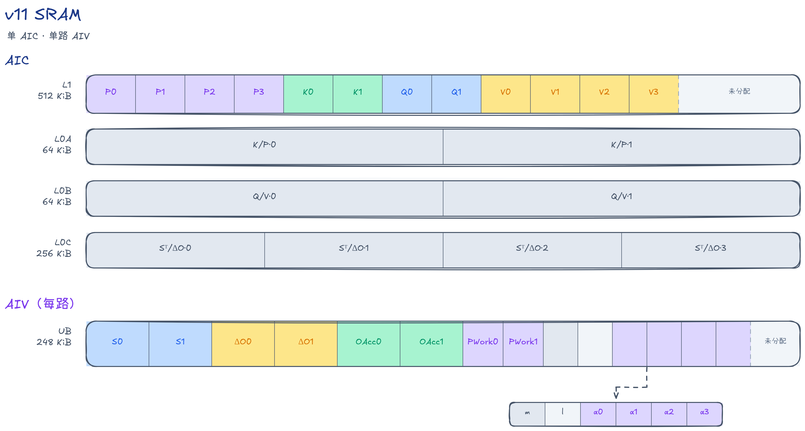

v11 的 SRAM 数值布局与 v09 完全相同。两版的直接对照也说明，压缩 Vector 通路的收益来自计算路径，而不是多分配了片上缓冲。

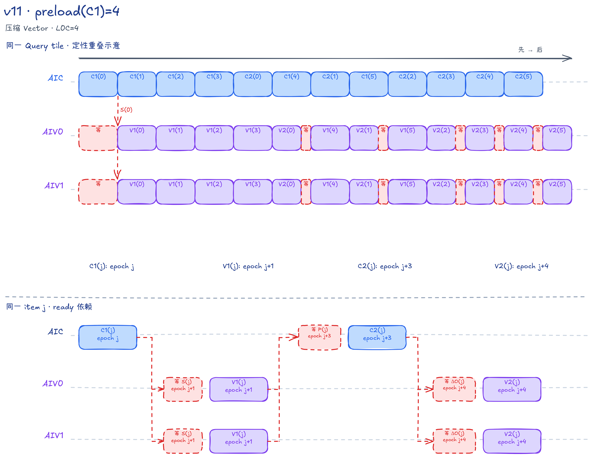

##### 流水与性能


统一长序列规格下，v11 耗时 10618.89 μs，有效 Cube MFU 为 95.87%。截图窗口为 `[39.165, 79.165]` μs。与 v09 相比，AIV Vector 执行区间缩短；按统一汇总表，耗时下降 29.77%。与 v10 相比，v11 的配置使用更多片上空间、耗时更短，但这一差异同时包含预发射数和 L0C 深度的影响。

##### 还剩的问题

L0C 的四个 FP32 tile 已占满 256 KiB，不能再随 `R` 增加。v12 保持 L0C 四槽，只把 `V`、`P`、`alpha` 各自的轮换槽增至五个，用来检验第五个预发射 C1 是否仍有价值。

#### v12：压缩 Vector 通路下使用 `preload(C1)=5`

##### 在 L0C 四槽下继续增加 C1 预发射数

v12 允许首个 C2 前预发射五个 C1，L0C 仍按四槽轮换。AIC L1 为第五份 `V` 和 `P` 增加空间，AIV 也保留第五份 `alpha`，但 C1/C2 共用的 FP32 结果队列继续使用四槽 L0C。

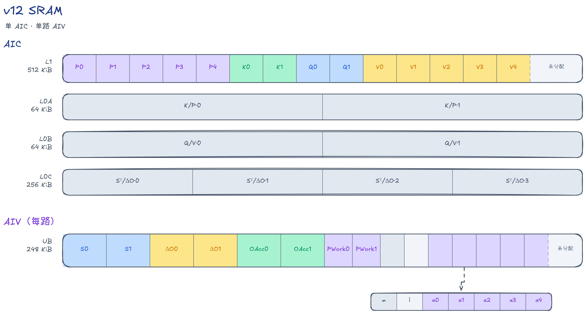

此时 AIC L1 使用 448/512 KiB，单路 AIV UB 使用 226/248 KiB。第五组 `P`、`V`、`alpha` 轮换槽放得下；L0C 的第五个 FP32 tile 需要额外 64 KiB，已经超过 256 KiB 上限。

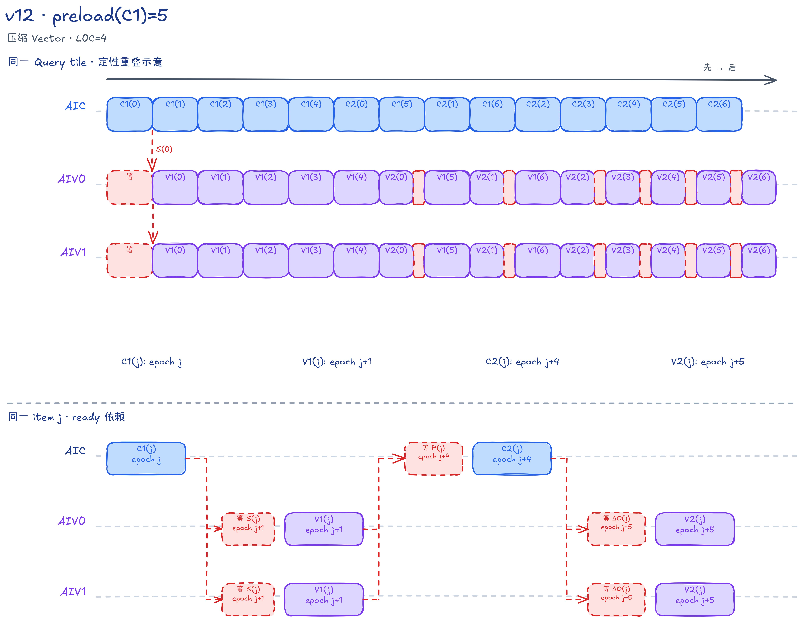

##### 流水与性能

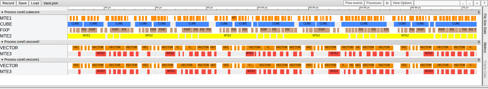

统一长序列规格下，v12 耗时 10578.22 μs，有效 Cube MFU 为 96.24%。截图窗口为 `[36.456, 76.456]` μs；v11 和 v12 的 AIC/AIV 忙区已经很接近，耗时中位数相差 0.38%。在这一固定规格下，重复测量没有显示第五个预发射 C1 带来可确认的性能提升。

##### 本组实验的结论

`preload(C1)` 要与 Vector 阶段的长度一起考虑。当首个 C2 前的 C1 已经覆盖主要等待区间后，继续增大 `R` 会占用更多片上 SRAM，耗时却未必继续下降。

## 整体性能与优化总结

### 统一性能结果

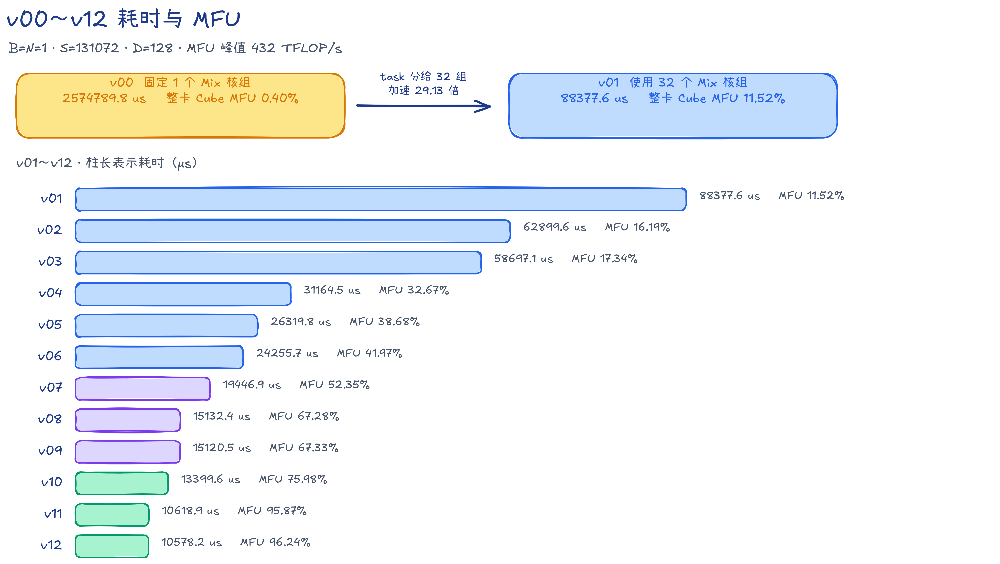

以下沿用前述统计口径：`B=N=1,S=131072,D=128`，全部 MFU 以整卡 432 TFLOP/s 为峰值。结果仅代表这一固定规格。

| 版本 | 调度 | Vector 通路 | 实际 AIC | Task Duration（μs） | 有效吞吐（TFLOP/s） | 整卡 Cube MFU | 距整卡有效峰值下限（μs） | 整卡实际 tile Cube 利用率 |
| --- | --- | --- | ---: | ---: | ---: | ---: | ---: | ---: |
| v00 | 固定一个 Mix 核组，单槽 GM 通路 | 基础 Vector 通路 | 1 | 2574789.750000 | 1.708132 | 0.3954% | 2564609.009108 | 0.3958% |
| v01 | 多核分 task，单槽 GM 通路 | 基础 Vector 通路 | 32 | 88377.640625 | 49.764624 | 11.5196% | 78196.899733 | 11.5308% |
| v02 | 单槽，只有 `P` 经 GM | 基础 Vector 通路 | 32 | 62899.636719 | 69.922185 | 16.1857% | 52718.895827 | 16.2014% |
| v03 | 单槽，三个中间块片上交接 | 基础 Vector 通路 | 32 | 58697.125000 | 74.928373 | 17.3445% | 48516.384108 | 17.3613% |
| v04 | 双 item | 基础 Vector 通路 | 32 | 31164.513672 | 141.124617 | 32.6677% | 20983.772780 | 32.6994% |
| v05 | 双 item，L0 双缓冲 | 基础 Vector 通路 | 32 | 26319.761719 | 167.101819 | 38.6810% | 16139.020827 | 38.7185% |
| v06 | 双 item，增加 I/O 双缓冲 | 基础 Vector 通路 | 32 | 24255.705078 | 181.321469 | 41.9726% | 14074.964186 | 42.0132% |
| v07 | `preload(C1)=2,L0C=2` | 基础 Vector 通路 | 32 | 19446.865234 | 226.158819 | 52.3516% | 9266.124342 | 52.4023% |
| v08 | `preload(C1)=3,L0C=3` | 基础 Vector 通路 | 32 | 15132.375000 | 290.640436 | 67.2779% | 4951.634108 | 67.3431% |
| v09 | `preload(C1)=4,L0C=4` | 基础 Vector 通路 | 32 | 15120.490234 | 290.868880 | 67.3308% | 4939.749342 | 67.3960% |
| v10 | `preload(C1)=3,L0C=3` | 压缩 Vector 通路 | 32 | 13399.552734 | 328.225886 | 75.9782% | 3218.811842 | 76.0518% |
| v11 | `preload(C1)=4,L0C=4` | 压缩 Vector 通路 | 32 | 10618.893555 | 414.174984 | 95.8738% | 438.152663 | 95.9667% |
| v12 | `preload(C1)=5,L0C=4` | 压缩 Vector 通路 | 32 | 10578.221680 | 415.767432 | 96.2425% | 397.480788 | 96.3357% |

v00→v01 的 task 级并行带来 29.13 倍加速；v01→v12 再通过数据通路和流水优化，将耗时从 88377.64 μs 降到 10578.22 μs。v11→v12 仅相差 0.38%，这类小幅变化需要重复测量和流水证据支持，不单独视为稳定收益。

### 可复用的流水优化方法

- 先缩短中间数据的搬运路径，再增加同时在途的 item 数量。
- 检查双缓冲时，要分开看 CV 核间槽、AIC 内的 L0 和 task I/O；任意一层复用单槽，都可能把前后阶段重新串起来。
- 增大 `preload(C1)` 只能增加阶段重叠的机会，不能缩短 V1/V2 自身。如果 Vector 执行路径过长，需要直接优化 Vector 计算。
- 版本号相邻不代表只改了一个变量。归因性能时，应先确认 `preload(C1)`、L0C 槽数和 Vector 通路是否一致。
- 更多在途 item 会占用更多片上 SRAM。当新 item 已经无法覆盖原有等待区间时，继续增大 `preload(C1)` 还可能增加槽位复用等待。

## 后续方向

- 功能：按开头的能力边界扩展序列长度、Head 配置及布局，逐步支持网络所需的 Attention 变体。
- 性能：覆盖更多 Prefill shape，优化分核和 `preload(C1)` 选择，减少尾块、对角块的无效计算。
- 精度与流水：保持精度验收标准，继续优化 Vector、搬运和跨核等待。

欢迎开发者在 [cann-samples 中的 Flash Attention Lite 样例](https://gitcode.com/cann/cann-samples/tree/master/Samples/2_Performance/flash_attn_lite_story) 上继续完善功能、精度和性能，并用可复现的数据说明改动效果。

## 参考资料

- [FlashAttention: Fast and Memory-Efficient Exact Attention with IO-Awareness](https://arxiv.org/abs/2205.14135)
- [FlashAttention-2: Faster Attention with Better Parallelism and Work Partitioning](https://arxiv.org/abs/2307.08691)
- [FlashAttention 官方仓库与精度测试说明](https://github.com/Dao-AILab/flash-attention)
- [《昇腾 950 NPU 架构白皮书》](https://public-download.obs.cn-east-2.myhuaweicloud.com/ascend/%E6%98%87%E8%85%BE950%20NPU%E6%9E%B6%E6%9E%84%E7%99%BD%E7%9A%AE%E4%B9%A6.pdf)
- [一站式 Ascend C 编程语言文档](https://asc.gitcode.com/)
