# Flash Attention Lite：Ascend 950 上的 Cube/Vector 协作与流水优化

## 概述

### 样例定位

Flash Attention Lite（FALite）是 Ascend 950 上的 causal Flash Attention 前向教学样例，面向一次处理整段输入的 Prefill 场景。本文关注一个 Mix 核组中 1 个矩阵计算核（AIC）和 2 个向量计算核（AIV）如何交接数据，以及怎样让相邻计算在片上重叠执行。

文章按 Ver.0～Ver.5 六个大版本展开，具体实现代码在源码链接、数据出处和复现命令中标明。

### 功能范围

支持的能力：

- causal self-attention 前向计算，每个 token 只能读取自己和此前的 token；
- BF16 输入 `Q`、`K`、`V` 和输出 `O`，布局为 `[B,N,S,D]`。`B` 为 Batch 数，`N` 为 Head 数，`S` 为序列长度，`D` 为 HeadDim；
- `Q`、`K`、`V` 共用 headNum `N` 和 seqLen `S`。本例固定 `D=128`，Query 和 K/V 都按 128 行分块；
- `B`、`N`、`S` 均可取正整数，`S` 无需按 128 对齐；
- 可设置 Softmax 缩放系数和 Mix 核组数上限。

已在 `B×N×S≤131072` 的范围内验证功能。超过这一规模不在正确性保证范围内，Host 也不会按这个上限拒绝输入。

公共接口固定调用 causal 实例；源码中的 non-causal 模板分支仅供对照。

未支持的能力：

- `Q` 长度不同于 `K`、`V` 的场景、causal offset、滑动窗口、稀疏 Attention 和 KV Cache；
- `[B,S,N,D]` 布局，以及同一批次中每条序列长度不同的 varlen 输入；
- `Q`、`K`、`V` Head 数不一致的 GQA/MQA、可变 HeadDim 或分块大小；
- Attention bias、Dropout 和反向计算。

### 对外接口

```cpp
bool FlashAttnLiteNPU(
    uint8_t* dQ,
    uint8_t* dK,
    uint8_t* dV,
    uint8_t* dOut,
    uint32_t batchSize,
    uint32_t headNum,
    uint32_t seqLen,
    float softmaxScale,
    uint32_t requestedAicCoreNum,
    aclrtStream stream);
```

| 参数 | 含义与约束 |
| --- | --- |
| `dQ`、`dK`、`dV`、`dOut` | 交给 NPU 的 BF16 输入、输出 device 侧地址，均为 `[B,N,S,128]` |
| `batchSize`、`headNum`、`seqLen` | 分别对应 `B`、`N`、`S`，均须大于 0 |
| `softmaxScale` | Softmax 缩放系数，须为非零有限值；默认使用 $1/\sqrt{D}$ |
| `requestedAicCoreNum` | Mix 核组数上限，以 AIC 数表示。Ver.0 固定使用一组；Ver.1～Ver.5 传 0 表示设备全部 AIC，非 0 时不得超过设备 AIC 数；实际启动数不超过 Tiling 切分后的可并行任务数 |
| `stream` | 提交 Kernel 的 ACL Stream |

Ver.0、Ver.1 及 Ver.2 仅启用 AIC→AIV 通路时，使用设备片外内存（GM）中的临时工作区（workspace），Host 在释放它之前同步 `stream`。Ver.2 打通双向片上通路后，以及 Ver.3～Ver.5，中间结果使用片上存储，Host 提交 Kernel 后即可返回；调用方须在读取输出或释放输入输出前同步 `stream`。

## 计算原理

### Attention 公式

以下公式只讨论一个 Batch、一个 Head，省略 $B$ 和 $N$。向量采用行向量。完整 causal Attention 为

$$
\mathbf O=\operatorname{Softmax}_{\mathrm{row}}
\left(\gamma\mathbf Q\mathbf K^\top+\mathbf M\right)\mathbf V,
\qquad
\mathbf Q,\mathbf K,\mathbf V,\mathbf O\in\mathbb R^{S\times D}.
$$

这里 $\gamma$ 是缩放系数；当 $q\le p$ 时 $M_{p,q}=0$，否则 $M_{p,q}=-\infty$。因此第 $p$ 个 Query 只能读取位置不超过 $p$ 的 Key。

### 分块计算

把 Query 和 K/V 都按 128 行分块。$i$ 是 Query 块编号，$j$ 是 K/V 块编号；$\mathbf Q^{(i)}$、$\mathbf K^{(j)}$、$\mathbf V^{(j)}$ 的右上角表示块编号，右下角留给块内行列。令

$$
T=\left\lceil\frac S{128}\right\rceil,\qquad
q_i=\min(128,S-128i),\qquad
k_j=\min(128,S-128j).
$$

$q_i$ 和 $k_j$ 分别是 Query 块与 K/V 块的有效行数，整块时均为 128。第 $i$ 个 Query 块只遍历 $j=0,\ldots,i$：$j<i$ 的块完整参与计算，$j=i$ 的对角块只保留块内下三角，$j>i$ 的未来块不发射矩阵乘。

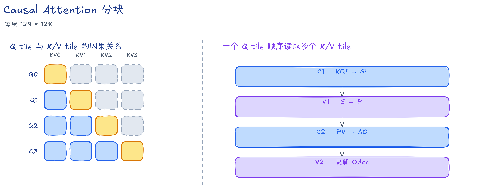

图中的蓝色块完整参与计算，橙色对角块只保留下三角。灰色虚框是整块跳过的未来区域。对角块虽然只需要一半结果，本样例仍发射完整的 Cube 矩阵乘，由 AIV 屏蔽块内未来位置。

右图概括每个 K/V 块的四个计算阶段：C1 求分数，V1 计算未归一化权重，C2 求输出增量，V2 更新输出累加值。C 表示矩阵计算阶段，V 表示向量计算阶段；具体分工见后文“硬件映射”。

### Softmax 递推

对固定的 Query 块 $i$，每处理一个 K/V 块 $j$，先计算未缩放的注意力分数

$$
\mathbf S^{(i,j)}
=\mathbf Q^{(i)}\left(\mathbf K^{(j)}\right)^\top
\in\mathbb R^{q_i\times k_j},
\qquad
\mathbf X^{(i,j)}=\gamma\mathbf S^{(i,j)}+\mathbf M^{(i,j)}.
$$

$\mathbf M^{(i,j)}$ 是完整 causal mask 的对应分块。公式只写有效行，代码在物理块中补出的 Key 行也要屏蔽。

为这个 Query 块保存逐行最大值 $\mathbf m$、逐行指数和 $\boldsymbol\ell$，以及输出分子 $\mathbf O_{\mathrm{acc}}$。前两者每行各一个元素，输出分子每行有 $D$ 个元素；上标 $(i,j)$ 表示已处理完 K/V 块 $j$。初值为 $\mathbf m^{(i,-1)}=-\infty$、$\boldsymbol\ell^{(i,-1)}=0$、$\mathbf O_{\mathrm{acc}}^{(i,-1)}=0$。

先更新逐行最大值。旧指数项乘上 $\boldsymbol\alpha$ 后，指数中减去的就从旧最大值变成新最大值。$\operatorname{rowmax}$ 表示按行取最大值，$\exp$ 逐元素计算：

$$
\begin{aligned}
\mathbf m^{(i,j)}
&=\max\!\left(\mathbf m^{(i,j-1)},
             \operatorname{rowmax}(\mathbf X^{(i,j)})\right),\\
\boldsymbol\alpha^{(i,j)}
&=\exp\!\left(\mathbf m^{(i,j-1)}-\mathbf m^{(i,j)}\right).
\end{aligned}
$$

再计算当前块的指数权重 $\mathbf P^{(i,j)}$，并更新 Softmax 分母。旧分母也由指数项累加而来，因此同样乘上 $\boldsymbol\alpha$；$\operatorname{rowsum}$ 表示按行求和：

$$
\begin{aligned}
\mathbf P^{(i,j)}
&=\exp\!\left(\mathbf X^{(i,j)}-\mathbf m^{(i,j)}\right),\\
\boldsymbol\ell^{(i,j)}
&=\boldsymbol\alpha^{(i,j)}\odot\boldsymbol\ell^{(i,j-1)}
  +\operatorname{rowsum}\!\left(\mathbf P^{(i,j)}\right).
\end{aligned}
$$

最后，用当前块的权重乘以 $\mathbf V^{(j)}$，得到输出增量；旧输出分子也先乘上 $\boldsymbol\alpha$，再与增量相加：

$$
\begin{aligned}
\boldsymbol\Delta\mathbf O^{(i,j)}
&=\mathbf P^{(i,j)}\mathbf V^{(j)},\\
\mathbf O_{\mathrm{acc}}^{(i,j)}
&=\boldsymbol\alpha^{(i,j)}\odot\mathbf O_{\mathrm{acc}}^{(i,j-1)}
  +\boldsymbol\Delta\mathbf O^{(i,j)}.
\end{aligned}
$$

$\mathbf P^{(i,j)}$ 是尚未归一化的注意力权重，形状为 $q_i\times k_j$；$\boldsymbol\Delta\mathbf O^{(i,j)}$ 和 $\mathbf O_{\mathrm{acc}}^{(i,j)}$ 的形状都是 $q_i\times D$。遍历结束后，$\mathbf O^{(i)}=\mathbf O_{\mathrm{acc}}^{(i,i)}\oslash\boldsymbol\ell^{(i,i)}$。

减去最大值、用 $\odot$ 乘 $\boldsymbol\alpha$、用 $\oslash$ 除分母时，同一 Query 行的全部元素使用该行对应的值；$\mathbf Q\mathbf K^\top$ 和 $\mathbf P\mathbf V$ 则是矩阵乘法。

这个递推只保存当前 Query 块的状态和正在处理的 K/V 块，无需把完整的 $S\times S$ 注意力权重写到 GM。一个 Query 块必须按 $j$ 递增更新状态；不同块的搬运和矩阵乘可以在不破坏这个顺序的前提下错开。

## 硬件映射

### 任务与计算阶段

一个 `task` 是某个 `(b,n,i)` 的完整 Query 块计算；其中每一对 `(i,j)` 构成一个 `item`。所有 item 使用同一套四阶段公式：

| 阶段 | 核心 | 计算与数据交接 |
| --- | --- | --- |
| C1 | AIC | 计算 $\mathbf K^{(j)}(\mathbf Q^{(i)})^\top$，得到转置存放的分数 $(\mathbf S^{(i,j)})^\top$，再交给 AIV |
| V1 | 两路 AIV | 各处理 64 个 Query 行，应用缩放和 mask，更新 $\mathbf m$、$\boldsymbol\ell$，生成缩放因子 $\boldsymbol\alpha$ 与未归一化权重 $\mathbf P$ |
| C2 | AIC | 使用两路 AIV 生成的 $\mathbf P$，计算 $\boldsymbol\Delta\mathbf O^{(i,j)}=\mathbf P^{(i,j)}\mathbf V^{(j)}$ |
| V2 | 两路 AIV | 更新各自的 `OAcc`；task 结束时除以 $\boldsymbol\ell$ 并写回负责的输出行 |

### 核组分工

一组 Mix 核中的 AIC 负责矩阵乘，两路 AIV 分别处理 Query 块的前后 64 行。两路 AIV 共同生成下一次矩阵乘需要的数据。

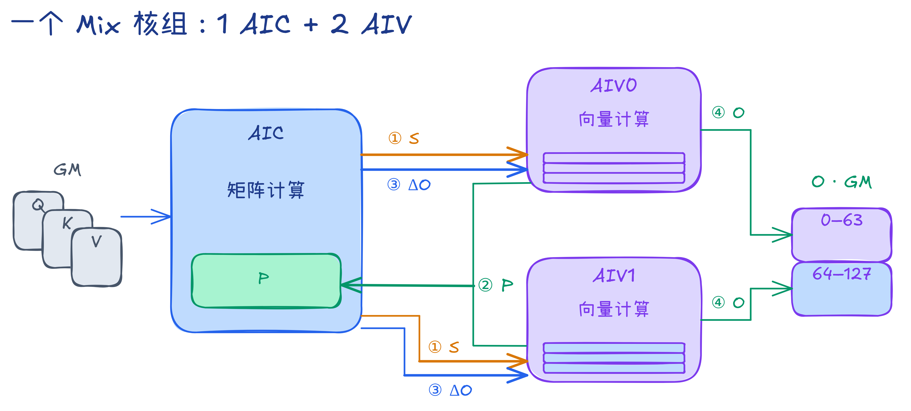

图中箭头表示数据交接顺序，具体经过 GM 还是片上通路，在 Ver.0、Ver.2 中展开。C1/C2 是同一个 AIC 的两个阶段，V1/V2 则由同一对 AIV 执行。数学公式按 Query 行、Key 列书写；实际 C1 为了分给两路 AIV，计算并保存转置分数。图中前后两个 64 行分片分别归 AIV0、AIV1，两路生成的 `P` 都就绪后，AIC 才能执行该 item 的 C2。

### 存储与精度

AIC 用 L1 暂存输入、L0A/L0B 装载矩阵、L0C 累加结果；两路 AIV 各有私有的 UB，用于保存向量计算的数据。后文的“缓冲槽”指保存一份分块数据的片上空间，多槽让不同 item 的数据可以同时保留。跨核信号负责通知数据就绪或空间可复用，核内互斥负责协调同一物理槽的读写。

各阶段使用相同的精度路径：

- `Q`、`K`、`V` 和输出 `O` 为 BF16；两次 Cube 矩阵乘的输入为 BF16，L0C 累加为 FP32。
- 分数、Softmax 状态和输出分子 `OAcc` 保持 FP32。`P` 在交给 C2 前转为 BF16；最终除法用 FP32 计算，再转为 BF16 写出。

## 实验方法

### 环境与规格

| 项目 | 配置与用途 |
| --- | --- |
| 硬件与软件 | Ascend 950PR（32 AIC、64 AIV），CANN 9.2.0 |
| 长序列性能 | `B=N=1,S=131072,D=128`；Ver.0 使用 1 个 Mix 核组，其余阶段使用 32 组 |
| 耗时指标 | `msopprof` BasicInfo 的 Kernel `Task Duration(us)`，重复采集后取中位数 |
| 真机流水 | 单 Mix 核组、`B=N=1,S=2048,D=128` 的 `PipeTimeline`，用于观察搬运与计算的重叠 |
| 向量函数（VF）分析 | NPUSIM，`--core-num 1 --size 1 1 1024`，仿真频率 1.65 GHz；观察 AIV0 的 PUSHQ 与 RVECEX，比较同一 item 的 Vector 计算 |

### 性能指标

causal Attention 的有效 Query/Key 对数为 $S(S+1)/2$。每个有效 Query/Key 对在两次矩阵乘法中合计对应 $2D$ 次乘加，每次乘加按两次浮点运算计数，故有效 Cube 工作量与整卡模型算力利用率（MFU）为

$$
F_{\mathrm{effective}}=2BNDS(S+1),\qquad
\mathrm{MFU}=\frac{F_{\mathrm{effective}}}
{t_{\mathrm{kernel}}\times432\times10^{12}}.
$$

$t_{\mathrm{kernel}}$ 的单位为秒，表中的 μs 需乘 $10^{-6}$ 后代入。432 TFLOP/s 是 Ascend 950PR 整卡 32 个 AIC 的 BF16/FP16 Cube 峰值，来自《昇腾 950 NPU 架构白皮书》；所有阶段都按这个整卡峰值计算 MFU。

有效工作量按因果下三角计算；已发射对角块的上三角和尾块补零属于额外硬件开销。这里的 MFU 衡量有效计算量相对整卡峰值的利用率，Cube 的忙碌时间则通过流水报告观察。

### 流水分析

真机流水用于观察搬运与计算的重叠，NPUSIM 用于查看 VF 调用及内部向量指令；版本性能以长序列耗时比较。每张截图标出观察窗口，跨版本分析时结合对应的 task/item 和计算分支。

示意图解释发射顺序和数据依赖，虚框表示可能等待。图中色块按便于阅读的尺寸绘制，实际时长以流水截图和测量数值为准。

## 版本演进

六个大版本依次增加并行任务、缩短数据通路、调整缓冲与发射顺序，最后优化 Vector 计算。下表概括各版的主要改动。

| 版本 | 主要改动 |
| --- | --- |
| Ver.0 | 单个 Mix 核组串行计算，中间结果经 GM 交接，按有效行处理尾块 |
| Ver.1 | 沿 Batch、Head 和 Query 块分配多核任务 |
| Ver.2 | 启用 AIC→AIV 与 AIV→AIC 两条片上通路 |
| Ver.3 | 为核间交接、核内计算和 task 输入输出逐步配置双缓冲 |
| Ver.4 | 预先发射多次 C1，连续交错处理不同 item |
| Ver.5 | 融合 VF、简化计算并增加独立指令，压缩 Vector 通路 |

下面的伪代码保留各阶段的数据依赖和索引计算；矩阵切片按逻辑行列表示，具体存储布局与搬运参数可对照所附源码。

### Ver.0：单核基线

#### 设计思路

先用一个 Mix 核组串起完整计算，将 `S`、`P`、`DeltaO` 经 GM 交接，建立四阶段顺序执行的基线。序列末尾的有效行单独处理，让紧凑存放的输入适配固定尺寸的 Cube 分块。

#### 实现方法

Kernel 固定启动一个 Mix 核组，顺序遍历 `B×N×ceil(S/128)` 个 task；每个 task 按 K/V 块编号执行四个阶段。每个 item 使用一套片上工作区：

```text
C1 → S 写 GM → V1 → P 写 GM → C2 → DeltaO 写 GM → V2
```

三份中间量需要 160 KiB/task 的 GM workspace。同一 task 的 item 按顺序复用这份空间；每次跨核交接都包含一次 GM 写出和一次 GM 读入。

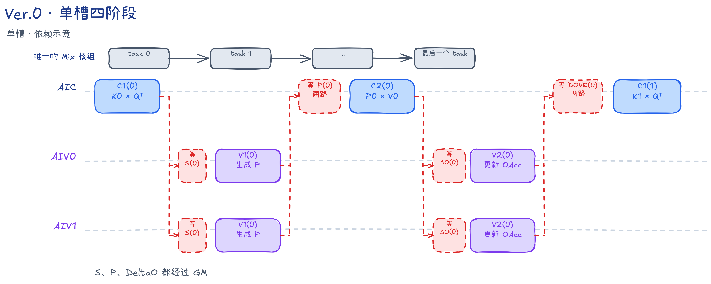

尾块按输入、Softmax 和输出三个环节处理。以 `S=197` 为例，每条序列分为 128 行和 69 行两个块。GM 中保存实际的 197 行；读取第二块时搬入 69 行，在 L1 中把剩余 59 行补零，Cube 仍按 128 行的固定尺寸计算。

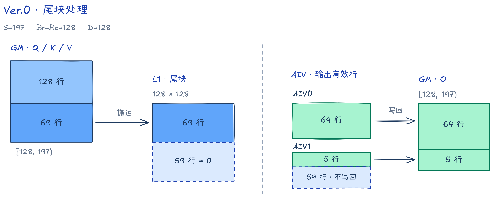

图的左右两部分分别说明输入补齐、输出裁剪，区域大小以行数标签为准。蓝色表示有效输入，绿色表示有效输出，虚框表示补齐或不写回的部分。输出侧以最后一个 Query 块为例，它仍需遍历两个 K/V 块。两路 AIV 各处理 64 个物理行位置，最后分别写回 64 行和 5 行。

有效行数和 GM 起始地址由块编号计算，`Q`、`K`、`V` 使用相同的方法：

```text
validRows = min(128, S - tileIdx * 128)
gmOffset  = ((b * N + n) * S + tileIdx * 128) * D

CopyGmToL1(dst, src + gmOffset, validRows):
    DataCopy：只搬 validRows 行，目标按 128 行的片上布局存放
    if validRows < 128:
        PipeBarrier<PIPE_MTE2>()
        Fill：将目标块剩余的行置零
```

GM→L1 搬运同时完成布局转换，补零按转换后的各通道分块分别清零末尾行。搬运和填零都写入同一 L1 槽，`PipeBarrier<PIPE_MTE2>()` 保证前一次写完成后再清零，避免写入冲突。实现见 [CopyGmToL1](./src/v00/kernel/falite_kernel_aic.h)。

Softmax 还需排除补出的 Key：它们会得到零分数，其指数仍可能非零，进而改变分母。V1 的两遍扫描都只遍历 `validBc` 个有效 Key，并将其余位置的 `P` 置零：

```text
validBc = min(128, S - j * 128)
第一遍：在 Key [0, validBc) 内求最大值，保留因果 mask
第二遍：在同一区间计算 exp、指数和与 P，保留因果 mask
P 对应 Key [validBc, 128) 的位置全部置零
```

Query 方向按两路 AIV 各自负责的 64 行裁剪写回：

```text
qValidRows = min(128, S - i * 128)
rowBegin   = subAivIdx * 64
outputRows = min(64, qValidRows - rowBegin) if qValidRows > rowBegin else 0

执行该 task 的全部 V1/V2 计算与跨核通知
if outputRows > 0:
    对本 AIV 的前 outputRows 行做最终除法，转 BF16，写回 GM
```

`S=197` 时，两路 `outputRows` 为 64、5；`S=129` 时为 1、0。即使某一路没有有效输出行，也要完成跨核通知，避免 AIC 一直等待。实现见 [OnlineColwiseSoftmaxVF 与 AIV 的输出循环](./src/v00/kernel/falite_kernel_aiv.h)。后续版本沿用这些尾块规则。

<a id="sram-ver0-ver1"></a>

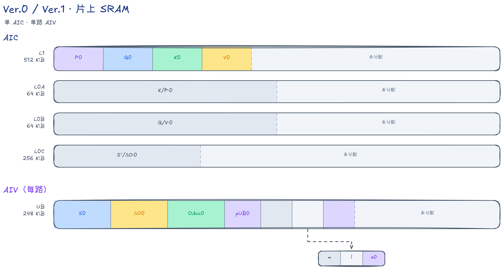

图按一个 AIC 和一路 AIV 绘制。L1 中 `P/Q/K/V` 各有一个 32 KiB 槽，L0A/L0B 各一个 32 KiB 槽，L0C 一个 64 KiB 槽；单路 AIV UB 共约 112.75 KiB。GM workspace 不在图中。

#### 流水与结果

单槽下，四阶段依次交接中间结果。下面结合真机流水和长序列耗时观察这一基线。

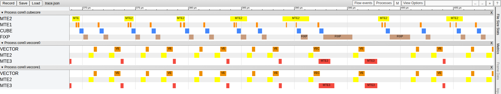

> 代码 `v00`，截图窗口 `[368.8,408.8]` μs。[仿真流水](./images/cannsim_trace/falite_v00_cannsim.png)展示了 `B=N=1,S=512` 时 C1 到 V2 的同步过程。

长序列耗时为 2,574,789.75 μs，整卡 MFU 为 0.3954%。此时只使用一个 Mix 核组，其他核组空闲；各 Query 块的输出互不覆盖，下一步可以把这些独立任务分给更多核组。

### Ver.1：多核并行

#### 设计思路

Ver.0 的一个核组要处理全部 Query 块，其他核组没有参与计算。分核首先要找到互不依赖的计算：同一个 `task` 内的 K/V 块要按顺序更新 Softmax 状态；不同 `task` 的状态和输出行则互不相干。`K/V` 只读，因此多个 Mix 核组可以同时处理不同的 Query 块，无需在核组之间合并结果。

#### 实现方法

每条序列有 $T=\lceil S/128\rceil$ 个 Query 块。一个任务由 `(b,n,i)` 唯一确定，按 `taskId=(b*N+n)*T+i` 编号，总任务数为 `B*N*T`。这里只沿 `S` 轴切 Query；每个任务仍读取同一 `(b,n)` 下所需的完整 K/V 块，并保存自己的 Softmax 状态。

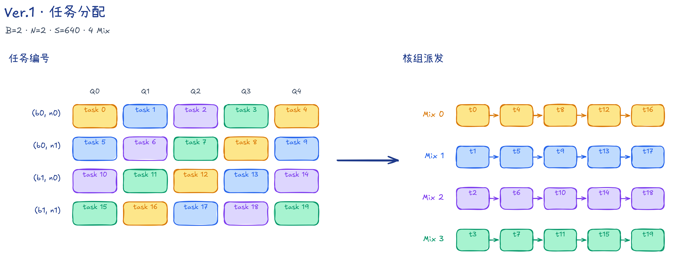

图中 `B=2,N=2,S=640`，每条序列有 5 个 Query 块，共 20 个 task。左图每行是一组 `(b,n)`，每列是一个 Query 块；颜色表示分配到的 Mix 核组。

Host 用 `G=min(核组数上限, B*N*T)` 决定实际启动的核组数。核组 `a` 从任务 `a` 开始，每次跳过 `G` 个编号：

```text
for taskId = a; taskId < B*N*T; taskId += G:
    batchHeadIdx = taskId // T
    i = taskId % T
    b = batchHeadIdx // N
    n = batchHeadIdx % N
    初始化这个 Query 块的 m、l、OAcc
    for j = 0 .. i:
        计算 Q[b,n] 的第 i 块与 K/V[b,n] 的第 j 块
    写回 O[b,n] 中第 i 个 Query 块的有效行
```

例如图中的任务 8 属于 `(b=0,n=1,i=3)`，分给核组 `8%4=0`。它计算 Query 行 `[384,512)`，遍历 K/V 块 0～3，并只写回这 128 行输出。核组 0 随后处理任务 12，重新初始化该任务的状态。

同组的两路 AIV 遍历相同的任务编号，分别处理 Query 块的前后 64 行。代码中 AIC 直接用 `GetBlockIdx()` 取得组号；AIV 用 `GetBlockIdx()/GetSubBlockNum()` 取得对应组号，用 `GetSubBlockIdx()` 区分前后半块。分核逻辑见 [Host](./src/v01/host/flash_attn_lite_host.cpp)、[AIC](./src/v01/kernel/falite_kernel_aic.h) 与 [AIV](./src/v01/kernel/falite_kernel_aiv.h)。

causal 模式下，靠后的 Query 块要遍历更多 K/V 块。轮转派发把轻重任务分散到各核组，每组的总计算量仍受所分配任务的 Query 位置影响。

每组的片上分配沿用 [Ver.0 的 SRAM 布局](#sram-ver0-ver1)，分别维护工作区和 Softmax 状态，GM workspace 为 160 KiB/task。

#### 流水与结果

多核版本沿用单组内部的四阶段流程，通过同时处理独立 Query 块增加整体并行度。

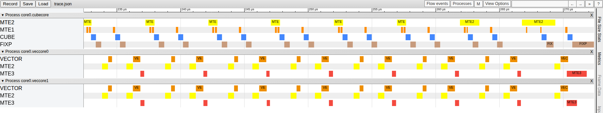

> 代码 `v01`，截图窗口 `[232.419,272.419]` μs。

长序列使用 32 个 Mix 核组，耗时 88,377.64 μs，较单组执行快 29.13 倍。分核增加了同时参与计算的核心数，但每组内部的 `S`、`P`、`DeltaO` 仍经过 GM 读写。下一阶段改用片内通路传递这些中间结果。

### Ver.2：片上通路

#### 设计思路

Ver.1 的矩阵计算和向量计算交替进行，每次交接却要写回、再读入 GM。本阶段保持计算公式和单槽调度不变，分两步替换中间数据的传递路径。

#### 实现方法

第一步启用 [AIC→AIV 通路](./src/v02/kernel/falite_kernel_aic.h)：AIC 通过负责矩阵结果写出的 Fixpipe，把 `S` 和 `DeltaO` 直接写入两路 AIV 的 UB，V1/V2 随后读取 UB 中的结果。这样省去了两份中间量的 GM 写回与读入；`P` 仍经 GM 交接，workspace 降为 32 KiB/task。

第二步启用 AIV→AIC 通路：V1 在 UB 中把 `P` 转成 BF16，并整理为 Cube 使用的分块存储布局 NZ。两路 AIV 各把自己负责的半块写入共享 L1；AIC 等两路写完后，从 L1 装入 L0A，执行 C2。至此，`S/P/DeltaO` 都在片上交接，无需 GM workspace。

```text
AIC L0C → Fixpipe → AIV UB     S、DeltaO
AIV UB  → MTE3 → 共享 L1 → AIC L0A     P
```

两条通路通过“写完通知、读完归还”管理数据交接。下面以双向片上通路为例，列出跨核同步顺序：

```text
AIC，每个 item：
    除核组的首个 item 外，等待上一 item 的 DONE
    C1：计算 S，并通过 Fixpipe 写入两路 AIV 的 UB
    通知 S_READY
    等待两路 AIV 的 P_READY
    C2：读取 L1 中的 P，计算 DeltaO，并通过 Fixpipe 写入 UB
    通知 O_READY

每路 AIV，每个 item：
    等待 S_READY
    V1：读取自己负责的 S，生成 PWork，更新 m/l 并保存 alpha
    MTE3：将 PWork 写入 L1 中属于本路的半块
    通知 P_READY
    等待 O_READY
    V2：读取 DeltaO，更新 OAcc
    通知 DONE
```

通知绑定在产生数据的流水上：`S_READY/O_READY` 在 Fixpipe 写完后生效，`P_READY` 在 MTE3 搬完后生效，`DONE` 在 V2 完成后生效。AIC 在下一次 C1 前等待 `DONE`，避免 `S/DeltaO` 等单槽数据被提前覆盖；所有 task 结束后，也要收齐最后一次 `DONE`。源码见 [AIC](./src/v03/kernel/falite_kernel_aic.h) 和 [AIV](./src/v03/kernel/falite_kernel_aiv.h)。

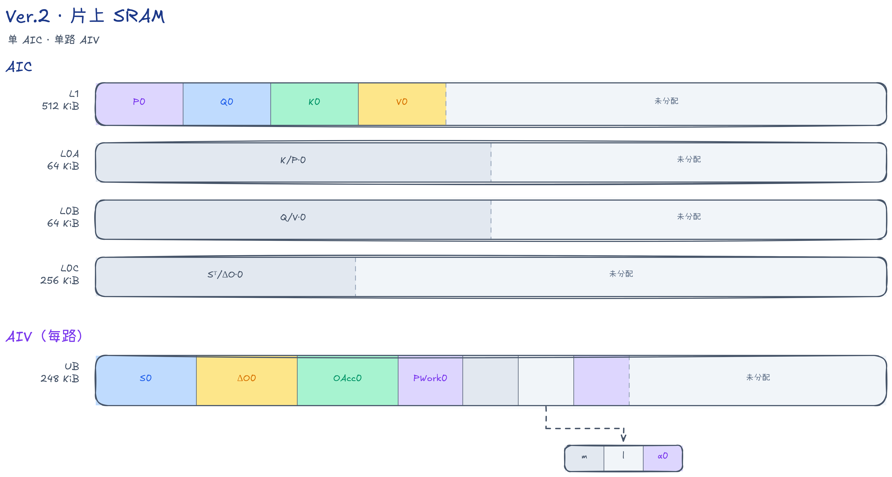

图采用两条通路都启用后的分配。AIC 仍是单槽；AIV 用 `PWork` 暂存转换并整理为 NZ 的 `P`，单路 UB 约 112.875 KiB。两颗核心访问同一物理空间时，只计一份容量。

#### 流水与结果

分别启用两条通路后，结合流水与耗时比较减少 GM 中转的效果。

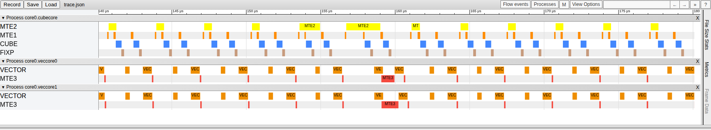

> 代码 `v03`，截图窗口 `[140.107,180.107]` μs。

长序列耗时在启用 AIC→AIV 通路后降为 62,899.64 μs，两条通路都启用后为 58,697.13 μs。

片上交接减少了 GM 搬运，单槽复用仍可能造成等待。例如 V1 还在读 `S(0)` 时，Fixpipe 必须等它读完，才能向同一槽写 `S(1)`。下一阶段为相邻 item 分配不同的缓冲槽。

### Ver.3：双缓冲

#### 设计思路

单槽使生产者和消费者争用同一片空间。增加第二槽后，较早 item 的数据仍可供消费者读取，生产者则向另一槽写入新结果；要利用这两槽，还需调整发射顺序。

#### 实现方法

双缓冲依次用于核间交接、AIC 核内计算和 task 输入输出。先为核间交接准备两套槽，把相邻两个 item 组成一组。AIC 依次发射 `C1(0)、C1(1)、C2(0)、C2(1)`；AIV 的顺序为 `V1(0)、V1(1)、V2(0)、V2(1)`。当 `C1(1)` 使用新槽时，`V1(0)` 可以继续读旧槽；同一 item 的 `C1→V1→C2→V2` 数据依赖仍须满足。

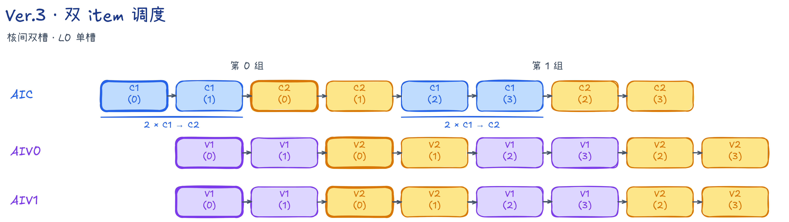

图展示核间双槽、L0 单槽这一步的发射顺序。横向位置表示本核内的先后次序；跨核实际执行还受数据就绪影响。后续增加 L0 和 task 双缓冲，继续扩大搬运与计算的重叠。

下面的两段循环分别运行在 AIC 和每路 AIV 上。`kvTileCount` 是该 task 要遍历的 K/V 块数，最后一组可以只有一个 item：

```text
AIC：
    for begin = 0; begin < kvTileCount; begin += 2:
        end = min(begin + 2, kvTileCount)
        for j in [begin, end): C1(j)
        for j in [begin, end): C2(j)

每路 AIV：
    for begin = 0; begin < kvTileCount; begin += 2:
        end = min(begin + 2, kvTileCount)
        for j in [begin, end): V1(j)，随后将 P 搬入 L1
        for j in [begin, end): V2(j)
```

`S/DeltaO/P` 等交接数据按 `slot=j%2` 选槽。item 0、1 分别用槽 0、1；item 2、3 再次使用这两槽前，必须等旧数据读完。分组调度与跨核同步约束交接顺序，核内 Mutex 协调搬运、计算对同一槽的读写。

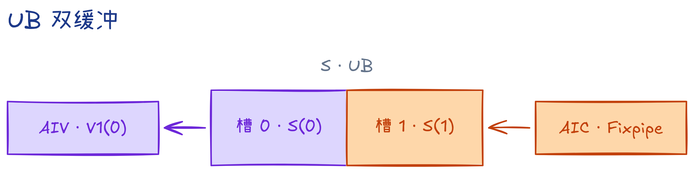

以第一组为例，紫色槽 0 保存 `S(0)`，供 Vector 执行 `V1(0)`；同时，Fixpipe 可向橙色槽 1 写入 `S(1)`。两槽位于同一路 AIV 的 UB。这项重叠发生在同组两个 item 之间；跨组时，下一组 C1 排在本组两个 C2 后面，本组的 V1 已完成。

三处缓冲分别对应以下重叠关系：

| 缓冲位置 | 缓冲配置 | 允许重叠的操作 |
| --- | --- | --- |
| 相邻 item 的输入与核间交接 | `K/V/S/P/DeltaO/alpha/PWork` 各两槽 | 例如，Fixpipe 写入新 `S` 时，Vector 读取旧 `S` |
| AIC 核内 | L0A、L0B、L0C 各两槽 | MTE1 从 L1 装入下一份矩阵时，Cube 使用另一槽计算；Fixpipe 也可读取另一 L0C 槽 |
| task 输入输出 | `Q`、`OAcc/Output` 按 task 轮换两槽 | 前一 task 写回输出时，后一 task 准备输入和计算 |

表中三项改动在 Ver.3 内依次累加。最后一项还把 `V` 的 GM→L1 搬运前移到 C1，与 `K` 一起准备，C2 直接使用片上的 `P/V`。

在本阶段最后的配置中，`K/V` 共用一组槽的同步，C1 读完 `K` 后仍保留 `V`，到 C2 读完 `V` 才归还。L0A/L0B/L0C 按 `j%2` 轮换；`Q/OAcc` 使用另一套 task 槽计数，每完成一个本核任务便执行 `ioSlot ^= 1`，不随 item 切换。`m/l` 仍只有一份，按 item 顺序更新。实现见 [AIC](./src/v06/kernel/falite_kernel_aic.h) 和 [AIV](./src/v06/kernel/falite_kernel_aiv.h)。

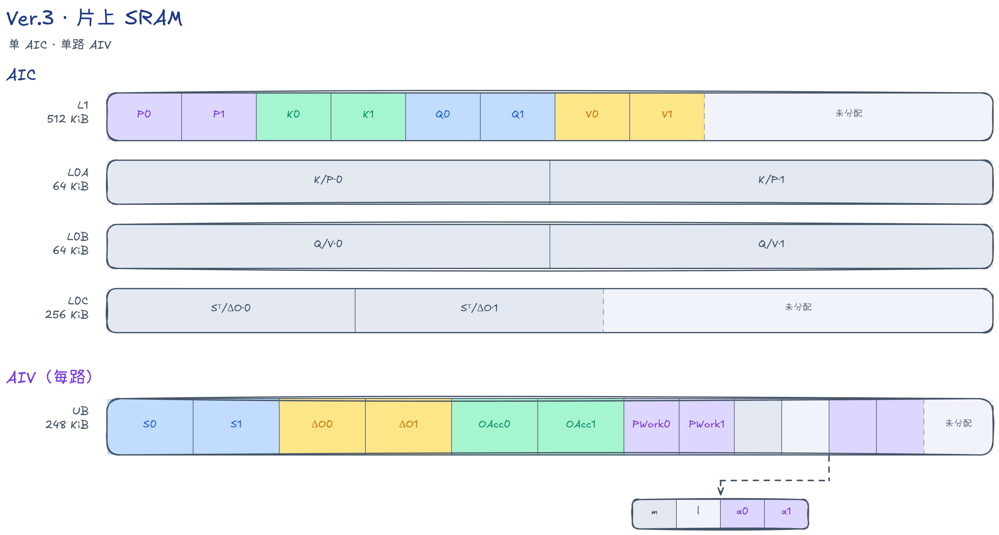

图采用本阶段最后的配置：AIC L1 为 256 KiB，L0A/L0B/L0C 各两槽，单路 AIV UB 约 225.25 KiB。`Q/OAcc` 的 task 槽与 `S/P` 等 item 槽分开轮换；图中只画一路 AIV 的私有 UB。

#### 流水与结果

逐层增加双缓冲后，长序列耗时如下。最后一行同时包含 task 输入输出双缓冲和 `V` 搬运前移的收益。

| 累加配置 | 长序列耗时 |
| --- | ---: |
| 输入与核间交接双缓冲 | 31,164.51 μs |
| 增加 AIC L0 双缓冲 | 26,319.76 μs |
| 增加 task 输入输出双缓冲，前移 V 搬运 | 24,255.71 μs |

> 表中数据依次对应代码 `v04`、`v05`、`v06`。

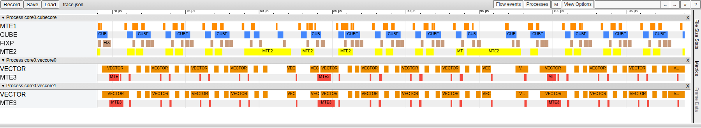

> 代码 `v06`，截图窗口 `[68.998,108.998]` μs。

图中 CUBE 与两路 VECTOR 多处同时执行，AIC 的 MTE1 装载也与 CUBE 计算发生重叠。长序列耗时由片上单槽的 58,697.13 μs 降到 24,255.71 μs。

发射顺序仍受双 item 分组限制：AIC 发射完本组两个 C2 后，才发射下一组的 C1。下一步在缓冲槽可复用时，更早插入新 item 的 C1，让它与较早 item 的 V1/V2 重叠。

### Ver.4：预发射

#### 设计思路

Ver.3 每两个 item 就结束一组发射，下一组 C1 必须排在本组两个 C2 后面。若 AIC 正在等 `P`，后续 C1 又未发射，AIV 可处理的分数块也会不足。本阶段用更深的缓冲保留中间结果，让新 item 的 C1 更早进入流水。

#### 实现方法

取消固定的双 item 分组后，一个 Mix 核组在同一 task 内连续处理 K/V 块。`preload(C1)=R` 表示：若该 task 至少有 `R` 个 item，AIC 在首个 C2 之前先发射 `R` 次 C1。这些 C1 使用同一个 Query 块，分别与不同 K/V 块计算。

例如 `R=4`、item 数足够时，两类核心分别按以下顺序发射：

```text
AIC：C1(0) → C1(1) → C1(2) → C1(3) → C2(0) → C1(4) → C2(1) → …
AIV：V1(0) → V1(1) → V1(2) → V1(3) → V2(0) → V1(4) → V2(1) → …
```

两行表示各核心自己的发射顺序，实际执行时还要等待数据就绪：V1 等对应 C1 写出分数，C2 等两路 AIV 写完 `P`，V2 等 C2 写出 `DeltaO`。因此，AIC 可以在 AIV 处理较早 item 的 V1 时，计算后续 item 的 C1。

<a id="schedule-ver4-ver5"></a>

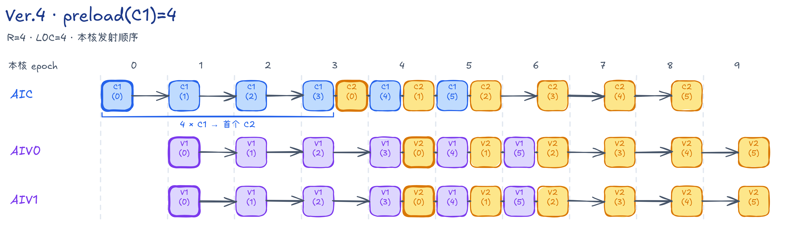

图以 6 个 item 展示先发射 4 次 C1、随后交错发射 C1/C2、最后完成剩余 C2 的过程。上下各行表示各核心的本地循环轮次，横向对齐不表示同时执行；每个阶段仍须等待对应数据就绪。

代码用 `epoch` 表示各核心自己的循环轮次。设当前 task 有 `J=kvTileCount` 个 item，调度可以写成：

```text
AIC：
    for e in [0, J + R):
        if e < J:                 C1(e)
        if 0 <= e-R+1 < J:        C2(e-R+1)

每路 AIV：
    for e in [0, J + R):
        if 0 <= e-1 < J:          V1(e-1)，随后将 P 搬入 L1
        if 0 <= e-R < J:          V2(e-R)
```

开头几轮填入新 item；中间每轮先处理新的 C1/V1，再处理较早的 C2/V2；末尾停止引入新 item，完成剩余计算。两类核心分别推进各自的 `epoch`，通过数据就绪信号衔接对应阶段。源码见 [AIC](./src/v09/kernel/falite_kernel_aic.h) 和 [AIV](./src/v09/kernel/falite_kernel_aiv.h)。

缓冲槽数由数据需要保留的时间决定。预发射后，`V` 要等 C2 读取，`P` 要等 C2 使用，`alpha` 要等 V2 使用，因此三者各分配 `R` 槽。`K/S/DeltaO/PWork` 与 L0A/L0B 保持双槽。

L0C 的槽用于保存 Cube 结果，直到 Fixpipe 读完；它与 `R` 分别配置。本阶段选择 `R=2/3/4`，对应使用 2/3/4 个 L0C 槽。

选槽时，`V/P/alpha` 用 `j%R`，`K/S/DeltaO/PWork` 用 `j%2`。C1、C2 共用 L0，因此另设矩阵乘发射计数：每发射一次 C1 或 C2 加一，用这个计数分别对 L0A/B、L0C 的槽数取余。

以 `alpha` 为例，`V1(j)` 生成它，`V2(j)` 使用它；发射顺序保证 `V2(j)` 先于 `V1(j+R)`，同槽可再次使用。`S/DeltaO` 则通过跨核通知交还槽位：AIV 读完后通知 AIC，Fixpipe 收到通知后才能再次写入。

`P/V` 的同号槽也有顺序约束：AIC 先发射旧的 `C2(j)`，再发射使用该槽的 `C1(j+R)`；新的 `P` 必须等这次 C1 产生分数后才能生成。`V` 的搬入与读取由同槽 Mutex 协调，旧数据读完后才写入新数据。

<a id="sram-ver4-ver5"></a>

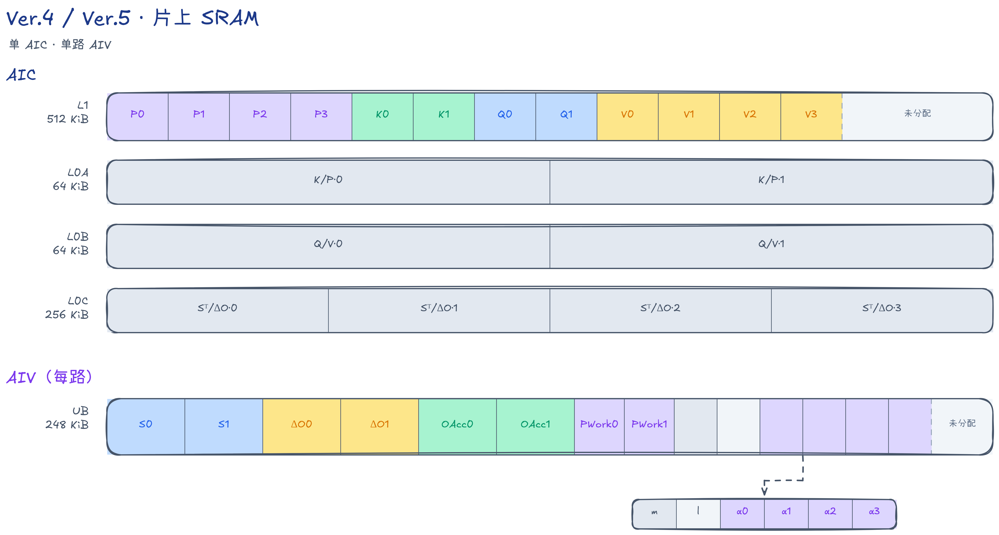

图中 `R=4`，四个 FP32 L0C 分块占满 256 KiB；AIC L1 使用 384 KiB，单路 AIV UB 约 225.75 KiB。同一数据的多个缓冲槽使用相同颜色。item 级槽保留不同 item 的数据，`Q/OAcc` 的两槽则按本核 task 轮换。

#### 流水与结果

先观察预发射后的真机流水，并比较不同预发射深度的耗时。

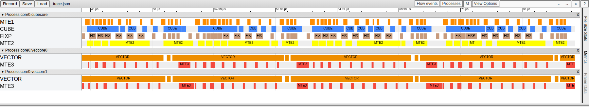

> 代码 `v09`，`R=4`，截图窗口 `[44.312,84.312]` μs。

| `preload(C1)` | L0C 槽数 | 长序列耗时 |
| ---: | ---: | ---: |
| 2 | 2 | 19,446.87 μs |
| 3 | 3 | 15,132.38 μs |
| 4 | 4 | 15,120.49 μs |

> 表中数据依次对应代码 `v07`、`v08`、`v09`。

Ver.4 的三种配置均使用基础 Vector 通路。`R=3→4` 的耗时相差约 0.08%，两套配置的实测耗时接近。这组对照同时改变 `R`、L0C 和部分片上槽数，反映的是整套配置的效果。

截图中，两路 VECTOR 有较长的连续执行区间，CUBE 则仍有多处间隙。预发射增加了不同 item 之间的重叠，V1/V2 自身的计算和 UB 读写量保持不变；下一阶段从这些操作入手。

#### VF 与 IPC

进一步查看 V1/V2 内部的指令执行情况，为 Vector 优化建立对照。下面用单 Mix 核组、`B=N=1,S=1024,D=128` 的 NPUSIM 结果，分析第 4 个 Query 块与第 2 个 K/V 块，即 `i=3,j=1`：它是非首块、非对角块，执行普通递推分支。这类 VF 在前面的 task 中已经调用过，本节与 Ver.5 均取 AIV0 负责的 64 行进行对照。

PUSHQ 中的 VF 色块表示一次向量函数调用，RVECEX 展示其中的向量计算指令。本文的计算指令 IPC 定义为“NPUSIM 中 RVECEX 动态指令数 ÷ 完整计算窗口的周期数”，用于比较同一阶段的局部向量计算效率。指令按所属 VF 计数，时间覆盖这一阶段从开始到结束的完整跨度。1.65 GHz 下，`cycles = 耗时(ns) × 1.65`。

下图顶部双向箭头标出完整计算窗口，底部 `Totals` 行末给出选中的指令数。IPC 的分母使用顶部窗口换算的周期数。底部 `Wall Duration` 显示各指令时长之和，`Selection extent` 显示选中指令的覆盖范围。各图缩放不同，比较时以标注数值为准。

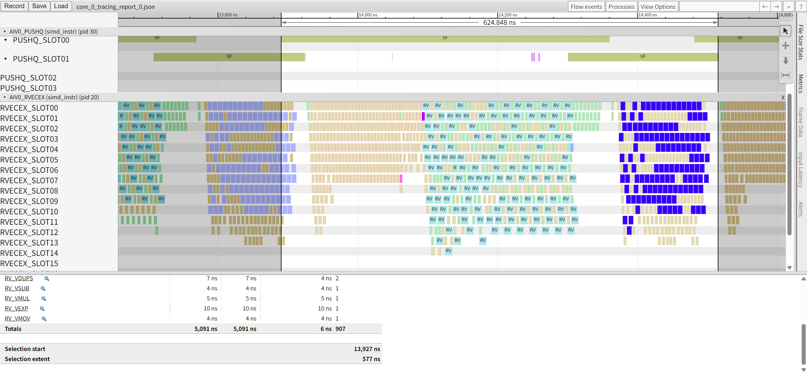

> 代码 `v09`，V1 测量区间 `[13890.303,14515.152]` ns，耗时 624.848 ns。先执行 Softmax，随后执行 CastPack；两次 VF 的完整窗口存在重叠，耗时取首个开始到最后结束的跨度。

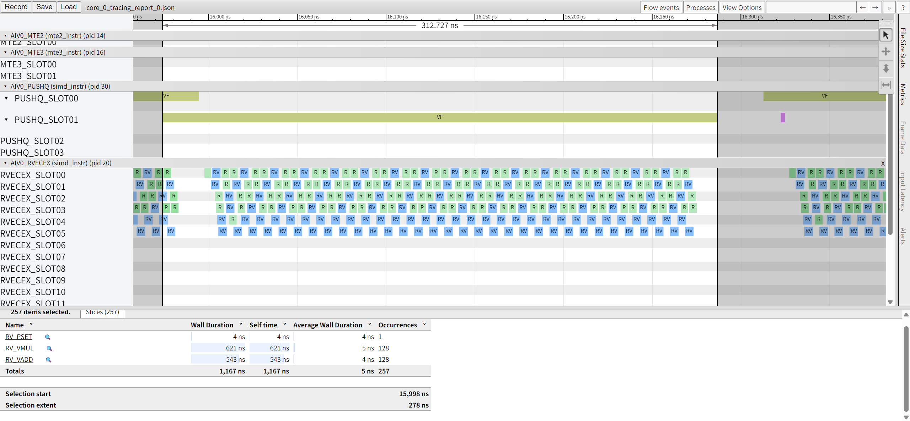

> 代码 `v09`，V2 测量区间 `[15973.939,16286.667]` ns，耗时 312.727 ns。

| 阶段 | VF 组成 | RVECEX 指令数 | 完整窗口 / cycles | 计算指令 IPC |
| --- | --- | ---: | ---: | ---: |
| V1 | `OnlineColwiseSoftmaxVF<false,false>` + `FusedDNToNZCastVF` | 907 | 1031 | 0.88 |
| V2 | `OnlineUpdateVF` | 257 | 516 | 0.50 |

V1 仍有独立的类型与布局转换调用；V2 的主要计算则是 128 次乘法和 128 次加法，另有 1 条掩码设置指令。这给下一阶段提供了两个具体方向：融合 V1，减少调用和中间读写；改写 V2，用融合乘加减少计算指令。

### Ver.5：Vector 优化

#### 设计思路

Ver.4 已让多个 item 交错执行，Vector 仍有较长的连续忙碌区间。本阶段沿用四阶段公式和外层发射顺序，集中压缩 Vector 通路的调用开销、计算操作和指令依赖。

#### 实现方法

实现从 VF 融合、计算简化和指令依赖三个方面展开，分别减少中间读写、计算操作和串行等待。

首先融合 V1 的两次 VF 调用。

基础 Vector 通路的 V1 分两次调用 VF：先计算 Softmax 的指数权重并把 FP32 结果写回 UB，再读出这些值、转为 BF16、整理成 NZ 布局。两次调用都需要提交执行任务和传递参数。把这些操作合并为一次 VF 后，每个 item、每路 AIV 的 V1 从两次 VF 调用减为一次，减少启动次数和 Vector 任务队列的提交压力，也省去指数结果的一次 UB 写回与再次读入：

```text
基础：VF 1：读 S → 求指数、更新 l → FP32 结果写 UB
      VF 2：读 UB → 转 BF16、排布 NZ → 写 PWork

融合：VF 1：读 S → 求指数 ┬→ FP32 求和，更新 l
                         └→ 转 BF16、排布 NZ → 写 PWork
```

最大值与指数和仍需分两遍扫描。第一遍确定新的行最大值 `m` 和修正系数 `alpha`；第二遍求指数时，同时生成 `P` 和行和。行和使用转换前的 FP32 值，避免把 BF16 量化误差引入 `l` 的递推。

这里融合的是 V1 内部的 Softmax 与类型、布局转换。V2 要等 C2 产生 `DeltaO`，仍单独调用 VF。减少启动和冗余读写也是官方 [VF 融合优化指南](https://www.hiascend.com/document/detail/en/CANNCommunityEdition/910/programug/Ascendcopdevg/docs/en/guide/operator_practice/simd_operator_optimization/vector_compute/vf_optimization/vf_fusion_optimization.md)给出的优化方向。

V2 则简化输出更新：通过 `MulDstAdd` 把乘法与加法合成融合乘加；首个 item 直接令 `OAcc = DeltaO`，省去清零、乘零和累加。

在此基础上，通过展开循环增加独立指令。

VF 内的向量指令支持双发射和乱序执行：数据已就绪、彼此无依赖且执行资源足够时，可在同一周期发射两条指令；硬件也可从就绪指令中选择执行，不必严格按代码排列顺序推进。具体条件见官方 [双发射优化指南](https://www.hiascend.com/document/detail/en/CANNCommunityEdition/910/programug/Ascendcopdevg/docs/en/guide/operator_practice/simd_operator_optimization/vector_compute/vf_optimization/dual_instruction_issue_optimization.md)。

IPC 表示平均每个时钟周期执行的指令数。若后一条指令必须等前一条的结果，就难以利用上述能力。这里通过手动展开循环（unroll），让一次循环处理多个 Key 位置或 Query 行，并为它们分配独立寄存器，增加可供乱序调度、双发射的指令，以提高 IPC。

```text
单路累加：sum += p0 → sum += p1 → sum += p2 → sum += p3

四路累加：sum0 += p0    sum1 += p1    sum2 += p2    sum3 += p3
          扫描结束后：sum = (sum0 + sum1) + (sum2 + sum3)
```

伪代码中的 `p0～p3` 是四个 Key 位置的指数权重向量；每个向量的 64 个元素对应本路 AIV 负责的 64 个 Query 行。单路写法反复更新同一个 `sum`，四路写法则把这条依赖链拆成四条，最后再合并。

具体落实到两个 VF：

- V1 每次处理四个 Key 位置。最大值和指数和都使用四组寄存器，分别完成加载、计算与累加，再合并结果；不足四个位置的尾部单独处理。
- V2 每次处理两个 Query 行，各行使用独立寄存器加载 `OAcc/DeltaO/alpha`，用融合乘加完成 `OAcc = alpha * OAcc + DeltaO`。两行的计算可交错安排，也减少了循环控制次数。

实现分别位于 [AIV](./src/v11/kernel/falite_kernel_aiv.h) 的 `OnlineSoftmaxCastPackVF` 与 `OnlineUpdateVF`。尾块和 causal 屏蔽规则沿用前述方法，改变累加顺序后的结果按统一精度标准验收。

本阶段沿用 Ver.4 的 [预发射顺序](#schedule-ver4-ver5) 和 [SRAM 布局](#sram-ver4-ver5)，保持 `R=4`、L0C 四槽。变化集中在 V1/V2 内部，下面直接对照它们的指令执行情况。

#### VF 与 IPC

保持 `R=4`、L0C 四槽，取与 Ver.4 相同的 `i=3,j=1`，对照 V1/V2 的指令数、计算指令 IPC 和执行时间。

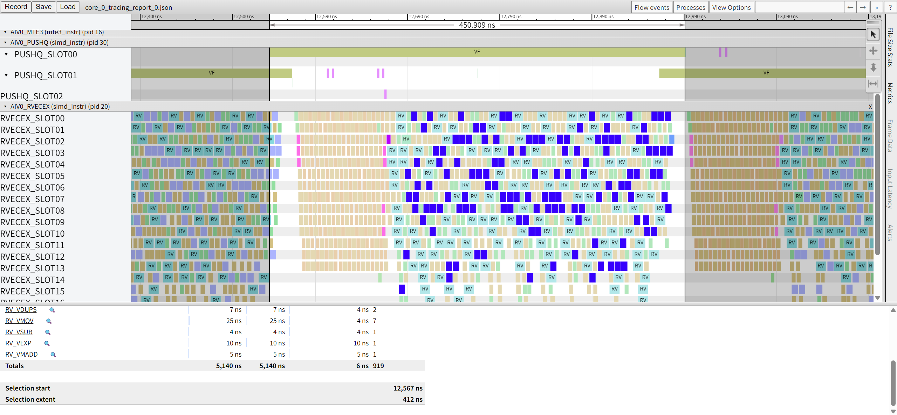

> 代码 `v11`，V1 测量区间 `[12540.000,12990.909]` ns，耗时 450.909 ns。

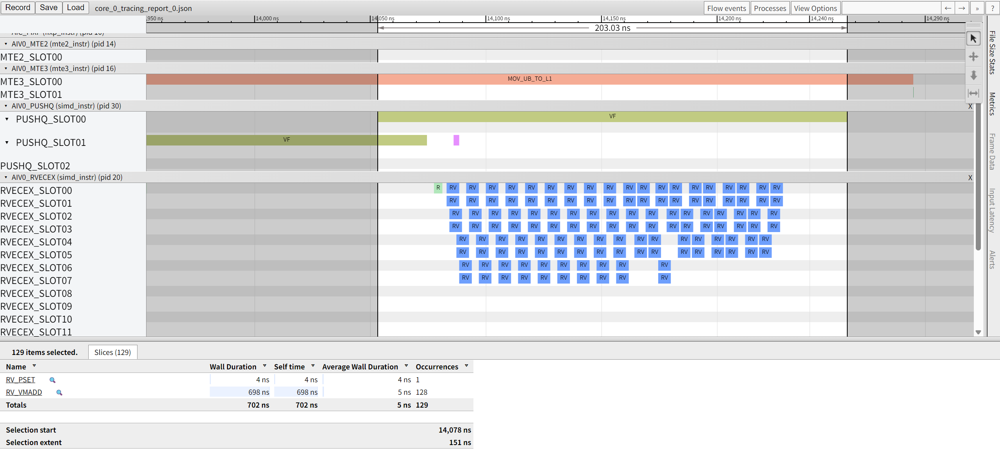

> 代码 `v11`，V2 测量区间 `[14053.333,14256.364]` ns，耗时 203.030 ns。

| 阶段 | RVECEX 指令数，Ver.4 → Ver.5 | 完整窗口 / cycles | 计算指令 IPC | 窗口耗时下降 |
| --- | ---: | ---: | ---: | ---: |
| V1 | 907 → 919 | 1031 → 744 | 0.88 → 1.24 | 27.84% |
| V2 | 257 → 129 | 516 → 335 | 0.50 → 0.39 | 35.08% |

IPC 保留两位小数，变化百分比按未取整的比值计算。

V1 的计算指令略有增加，但整体窗口从 624.848 ns 缩短到 450.909 ns，计算指令 IPC 提高约 40.41%。融合减少了中间 UB 读写与调用，四路累加又增加了独立指令；数据反映这些改写共同带来的执行效率变化。

V2 中，`MulDstAdd` 将 128 次乘法和 128 次加法替换为 128 次融合乘加，加上 1 条掩码设置指令，共 129 条。计算指令 IPC 从 0.50 降到 0.39，窗口也从 312.727 ns 缩短到 203.030 ns。完成相同计算任务时，这套实现使用的指令更少、耗时更短。

从整个小用例看，每路 AIV 共处理 8 个 task、36 个 item。Ver.4 有 132 次 VF 调用，Ver.5 减为 80 次：省去 36 次独立 CastPack 和 16 次初始化 VF。这些仿真结果解释局部 Vector 通路的变化，端到端收益仍以真机长序列测量为准。

#### 流水与结果

回到真机长序列，先按相同的预发射和 L0C 配置比较整核耗时，再观察流水与不同预发射深度的表现：

| 对照 | 保持不变的配置 | 长序列耗时 |
| --- | --- | ---: |
| 基础 → 压缩 Vector，`R=3` | L0C 三槽 | 15,132.38 → 13,399.55 μs |
| 基础 → 压缩 Vector，`R=4` | L0C 四槽 | 15,120.49 → 10,618.89 μs |

> 两组数据分别对应代码 `v08→v10`、`v09→v11`。

四槽配置下，VF 融合、计算简化和循环展开组合实施后，真机长序列耗时缩短约 29.77%，与局部仿真中 Vector 路径缩短的方向一致。

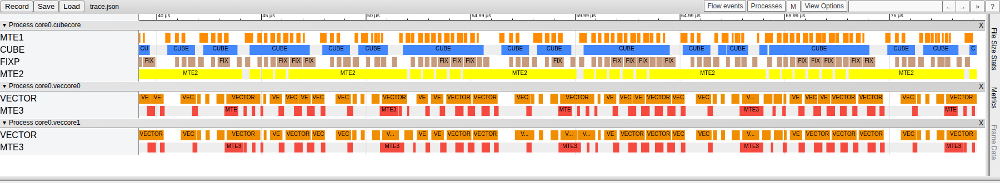

> 代码 `v11`，`R=4`，截图窗口 `[39.165,79.165]` μs。

与 Ver.4 的基础 Vector 配置相比，图中 VECTOR 的长连续执行区间被更多间隙分开，CUBE 仍有多段连续执行。

再看预发射深度。Ver.5 的 `R=3→4` 对比同时增加预发射深度和 L0C 槽数，反映两套配置的整体效果。继续把 `R` 增至 5 时，`V/P/alpha` 各分配 5 槽；L0C 保持四槽，因为五个 64 KiB 分块需要 320 KiB，超过 256 KiB 容量。此时 L1 使用 448 KiB（容量 512 KiB），单路 AIV UB 约使用 226 KiB（可用 248 KiB）。

长序列耗时在 `R=4` 时为 10,618.89 μs，`R=5` 时为 10,578.22 μs，相差约 0.38%，两套配置的实测耗时接近。

Ver.5 的 `R=4` 配置在本文长序列规格下的有效 Cube MFU 为 95.87%，耗时已接近由有效计算量和整卡峰值估算的理论下限。其他输入规格仍需分别测量、选择缓冲配置。

## 整体结果

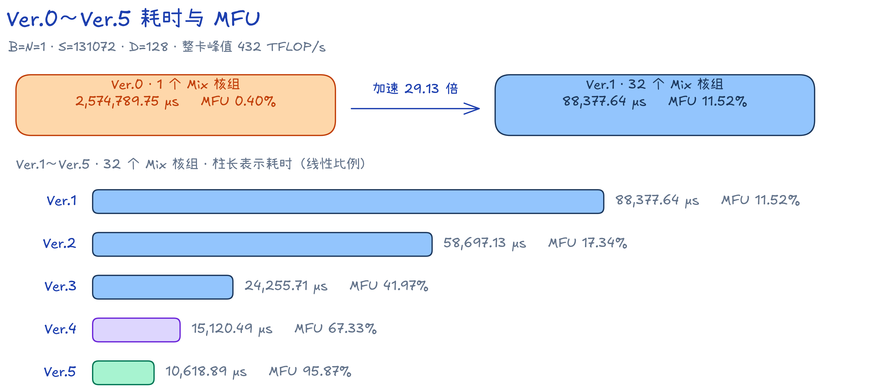

图表选取各章重点讲解、并展示 SRAM 分配与真机流水的代表实现。Ver.4、Ver.5 均取 `R=4、L0C=4`，便于对照 Vector 通路的变化。数据使用前述 `B=N=1,S=131072,D=128` 规格，MFU 均按整卡峰值计算；Ver.0 单列数值，Ver.1～Ver.5 的柱长按相同线性比例绘制。

| 阶段 | 代表代码 | AIC 数 | Task Duration | 整卡有效 Cube MFU |
| --- | --- | ---: | ---: | ---: |
| Ver.0 | `v00` | 1 | 2,574,789.75 μs | 0.3954% |
| Ver.1 | `v01` | 32 | 88,377.64 μs | 11.5196% |
| Ver.2 | `v03` | 32 | 58,697.13 μs | 17.3445% |
| Ver.3 | `v06` | 32 | 24,255.71 μs | 41.9726% |
| Ver.4 | `v09` | 32 | 15,120.49 μs | 67.3308% |
| Ver.5 | `v11` | 32 | 10,618.89 μs | 95.8738% |

Ver.0→Ver.1 通过任务分核增加参与计算的核心数；Ver.2 减少中间数据的 GM 搬运；Ver.3/Ver.4 通过缓冲配置和发射顺序增加计算与搬运的重叠；Ver.5 减少 Vector 的执行操作和 UB 读写。

## 验证与复现

### 精度标准

公共 Golden 以 FP32 计算和保存。NPU 输出保留 BF16 原始值，比较时转为 FP32，与未量化的 FP32 Golden 逐元素检查：

```text
abs(float(npu_bf16) - golden_fp32) <= 0.004 + 0.004 * abs(golden_fp32)
```

全部元素通过才算成功，NaN/Inf 直接失败。可选的 `FA_VERIFY_LOW_PRECISION_BASELINE=1` 模式需要 Torch 环境，并额外计算一份 BF16 基线。NPU 结果与 BF16 基线分别对同一 FP32 Golden 求最大绝对误差，要求前者不超过后者的两倍。

### 编译运行

在 cann-samples 根目录、已设置 CANN 环境后，可用下面的命令安装依赖、构建并运行。CANN Toolkit 不在默认位置时设置 `ASCEND_HOME_PATH`：

```bash
python3 -m pip install -r Samples/2_Performance/flash_attn_lite_story/requirements.txt
cmake -S . -B build -DNPU_ARCH=dav-3510 -DSIM_COMPATIBLE=OFF
cmake --build build --target falite -j
./build/Samples/2_Performance/flash_attn_lite_story/falite_v00 --size 1 1 385
./build/Samples/2_Performance/flash_attn_lite_story/falite_v12 --size 1 1 32768
```

可执行文件和精度校验脚本位于 `build/Samples/2_Performance/flash_attn_lite_story/`。

`falite` target 构建全部代码版本；单版本 target 形如 `falite_vNN`。`--size` 依次接受 `S`、`N S` 或 `B N S`，默认 `B=N=1,S=4096`。`--core-num n` 设置 Mix 核组数上限，Ver.0 的单核实现忽略它。`--dry-run` 仍执行 Kernel 和结果回传，只跳过 Golden 与精度比对。

### 数据采集

用 `BasicInfo` 记录耗时，用 `PipeTimeline` 记录真机流水。下面以 Ver.5 的代表实现为例：

```bash
msopprof --warm-up=5 --launch-count=1 --aic-metrics=BasicInfo \
    --output=<profiling-output> \
    ./build/Samples/2_Performance/flash_attn_lite_story/falite_v11 --dry-run --size 1 1 131072

msopprof --aic-metrics=PipeTimeline \
    --output=<profiling-output> \
    ./build/Samples/2_Performance/flash_attn_lite_story/falite_v11 --dry-run --core-num 1 --size 1 1 2048
```

仿真流水使用 NPUSIM 采集，要求 **CANN 9.2.0 及以上版本**。下面采集单个 Mix 核组、序列长度为 1024 的流水，供 VF 与 IPC 分析使用：

```bash
npusim record -s Ascend950 -g GEN_REPORT -o <report-output> \
    "./build/Samples/2_Performance/flash_attn_lite_story/falite_v11 --dry-run --core-num 1 --size 1 1 1024"
```

`-s` 指定仿真芯片，`-g GEN_REPORT` 生成分析报告，`-o` 指定报告输出目录。执行前将 `<report-output>` 替换为实际目录；上面的 `<profiling-output>` 同理。

## 后续方向

功能上，可以按样例定位中列出的范围，补齐实际网络需要的布局、Head 配置和序列形状。性能上，可以针对更多 Prefill 规格选择分核与 `preload(C1)` 配置，并减少对角块和尾块的无效计算。

欢迎开发者在 [cann-samples 的 Flash Attention Lite 样例](https://gitcode.com/cann/cann-samples/tree/master/Samples/2_Performance/flash_attn_lite_story) 上继续完善功能、精度和性能，并用可复现的输入、精度结果及流水数据检验改动。

## 参考资料

- [FlashAttention: Fast and Memory-Efficient Exact Attention with IO-Awareness](https://arxiv.org/abs/2205.14135)
- [FlashAttention-2: Faster Attention with Better Parallelism and Work Partitioning](https://arxiv.org/abs/2307.08691)
- [FlashAttention 官方仓库与精度测试说明](https://github.com/Dao-AILab/flash-attention)
- [《昇腾 950 NPU 架构白皮书》](https://public-download.obs.cn-east-2.myhuaweicloud.com/ascend/%E6%98%87%E8%85%BE950%20NPU%E6%9E%B6%E6%9E%84%E7%99%BD%E7%9A%AE%E4%B9%A6.pdf)
- [一站式 Ascend C 编程语言文档](https://asc.gitcode.com/)
