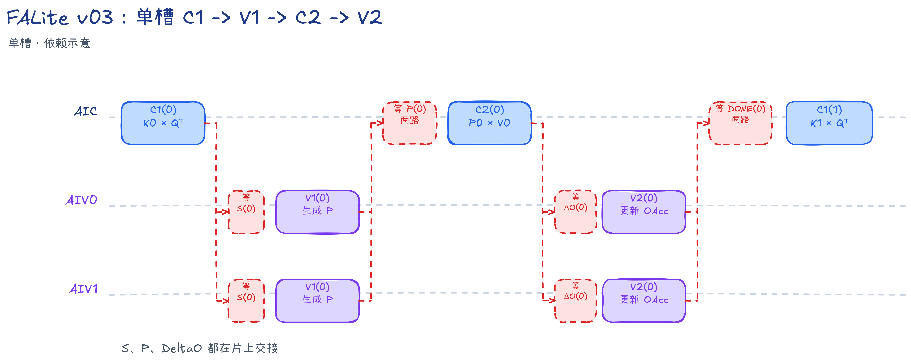
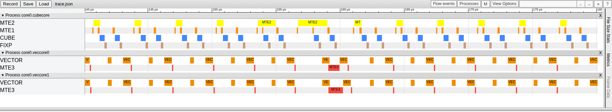

# FALite v03：P 留在片上，去掉 GM workspace

## 本版内容

v03 保留 v02 的单槽调度，把 P 改为 AIV UB→共享 L1→AIC L0A。AIV 在 UB 内完成 BF16 转换和 NZ 排布，两路 AIV 各写共享 P L1 的一半。S、P、DeltaO 至此全部在片上交接，Host 不再申请中间 workspace。

本文按 Host、AIC 和 AIV 实现解释任务归属、数据布局与同步。共同数学推导见[总 README 的算法基础](../../README.md#算法基础)，术语和硬件空间见[Ascend 950 上的 FALite 实现](../../README.md#ascend-950-上的-falite-实现)。

输入输出为 BF16 `[B,N,S,128]`，`Br=Bc=D=128`；`B/N/S` 均为正整数，`S` 无需按 128 对齐。入口固定调用同起点、等长度的方阵 causal 实例，功能保证范围为 `B*N*S<=131072`；该范围不是 Host 的主动拒绝条件。完整接口约束和未支持能力见[样例定位](../../README.md#falite-样例定位)。

## task 归属与两路 AIV 分工

一个 task 完成某个 `(b,n)` 的一个 Query tile，最多输出 128 行。一个 item 是该 task 与一个 K/V tile 的组合。Host 和 Kernel 使用以下编号：

```text
tr = ceil(S / 128)
numTasks = B * N * tr
batchHeadIdx = taskId / tr
qTileIdx = taskId % tr
batchIdx = batchHeadIdx / N
headIdx = batchHeadIdx % N
```

Host 先检查请求核数：`0` 表示使用设备 AIC 数作为上限，请求值超过设备 AIC 数则拒绝启动。合法请求再取 `useAicNum=min(核数上限,numTasks)`，入口发射 `<<<useAicNum,0,stream>>>`。

AIC 的核组编号是 `GetBlockIdx()`，AIV 的核组编号是 `GetBlockIdx()/GetSubBlockNum()`。同组使用相同的起点和步长：

```text
taskId = aicIdx, aicIdx + useAicNum, aicIdx + 2 * useAicNum, ...
```

不同 task 只共享只读 K/V，各自维护 Softmax 状态，写入不重叠的输出行，因此不需要跨核组归约。causal 下第 `i` 个 Query tile 有 `i+1` 个 item，固定步长分配不保证各组工作量完全相等。

两路 AIV 用 `subAivIdx=GetSubBlockIdx()` 区分：AIV0 负责 Query 行 0～63，AIV1 负责 64～127。它们分别维护 64 行的 `m/l/alpha` 和 `OAcc`，无需交换或合并这些状态。

| 阶段 | 核心 | 本版职责 |
| --- | --- | --- |
| C1 | AIC | `K_j × Q_i^T → S^T`，BF16 输入、FP32 累加 |
| V1 | 两路 AIV | 计算分块 Softmax，更新 `m/l/alpha`，生成尚未除以完整分母的 BF16 P |
| C2 | AIC | `P_j × V_j → DeltaO`，BF16 输入、FP32 累加 |
| V2 | 两路 AIV | `OAcc = alpha × OAcc + DeltaO`，保持 FP32；task 末尾才除以 l、转 BF16 并写回 |

## GM 与片上数据布局

Q/K/V/O 在 GM 中紧凑排列，单个 token 连续保存 128 个 BF16 通道。某个 tile 的首元素偏移为 `(batchHeadIdx*S + tileIdx*128)*128`；此处偏移以元素为单位，TilingData 中 `Addr` 字段则以字节为单位。

C1 输出转置分数 `S^T[Key,Query]`。`FixpipeToVecUB` 在 C1 使用 `dualDstCtl=2`，将 128 个 Query 列分给两路 AIV，每路 UB 得到连续的 `[128,64]`。C2 使用默认 `dualDstCtl=1`，将 `DeltaO[Query,128]` 按 Query 行均分，每路得到 `[64,128]`。AIC 构造的目的 UB 地址来自同一份 `layoutAIV`，必须与 AIV 实际使用的地址一致。

共享 P L1 保存 `P^T` 的 NZ 分块布局，AIC 的 LoadData 再将其转置到 L0A，用于 `P×V`。它不是两路 AIV 的归约区；两路分别写互不重叠的 Query 列分组，拼成完整 P。
Host 只传入 Q/K/V/O 地址，不分配中间 GM workspace，也不在 `FlashAttnLiteNPU` 内同步 stream。调用方读取输出或释放输入输出前仍需同步。

### AIC 缓冲与生命周期

`Q/K/V/P` 的 L1 数据为 BF16 NZ，即 Cube 读取所需的分块排列。以下均为单槽，不存在 slot 翻转：

| 物理空间 | 起始地址 | 大小 | 生命周期 |
| --- | ---: | ---: | --- |
| P L1 | 0 KiB | 32 KiB | 每 item 生成一次，C2 搬到 L0A 后不再读取 |
| Q L1 | 32 KiB | 32 KiB | 每 task 搬一次，供全部 C1 复用 |
| K L1 | 64 KiB | 32 KiB | C1 搬入，MTE1 读完后可复用 |
| V L1 | 96 KiB | 32 KiB | C2 搬入，MTE1 读完后可复用 |
| L0A | 本空间 0 | 32 KiB | C1 装 K，C2 装 P，Mmad 读完后归还 |
| L0B | 本空间 0 | 32 KiB | C1 装 Q，C2 装 V，Mmad 读完后归还 |
| L0C | 本空间 0 | 64 KiB | C1/C2 交替写入，Fixpipe 读完后归还 |

L1 合计 128 KiB；L0A/B/C 属于不同物理空间，不能把三个起始地址 0 当成同一块内存。

### 单路 AIV 缓冲与生命周期

| UB 区域 | 起始字节地址 | 大小 | 用途 |
| --- | ---: | ---: | --- |
| S | 0 | 32 KiB | `[128,64]` FP32 分数；V1 原地改写为 FP32 未归一化权重 |
| DeltaO | 32768 | 32 KiB | `[64,128]` FP32，当轮 V2 消费 |
| OAcc | 65536 | 32 KiB | `[64,128]` FP32，整个 task 累计 |
| PWork | 98304 | 16512 B | V1 的 BF16 P；task 末尾复用为 BF16 输出 |
| m / l / alpha | 114816 / 115072 / 115328 | 各 256 B | 每个 Query 行一个 FP32 值 |

每路 UB 共占 115584 B（112.875 KiB），两路 AIV 各有一套。S、DeltaO、P 和 alpha 按 item 复用；m、l、OAcc 按 task 复用。

## AIC 核内流水与同步

C1 按 `K GM→L1→L0A` 和 `Q L1→L0B` 准备输入，再执行 Mmad 和 Fixpipe。Q 的 MTE2 写入发生在 task 开始，MTE1 在 `j==0` 取得 Q 槽，到 `j+1==kvTileCount` 时归还；这里的末次由 causal 裁剪后的实际 item 数判断。

C2 直接将共享 P L1 转置到 L0A，再搬入 V 并装入 L0B。两次 Mmad 都初始化 L0C，而不是在 L0C 内跨 item 累加；跨 item 的输出累计由 AIV 的 OAcc 完成。

| Mutex ID | 资源 | Pipe 交接 |
| ---: | --- | --- |
| 2 | Q L1 | MTE2 写 → MTE1 读 → 下一 task 的 MTE2 |
| 0 | K L1 | MTE2 写 → MTE1 读 → 下一 C1 的 MTE2 |
| 1 | V L1 | MTE2 写 → MTE1 读 → 下一 C2 的 MTE2 |
| 3 | L0A/L0B 共用所有权 | MTE1 写 → Mmad 读 → 下一阶段 MTE1 |
| 4 | L0C | Mmad 写 → Fixpipe 读 → 下一阶段 Mmad |
| 5 | C2 加载顺序 | MTE1 读取 P → MTE2 搬运 V |

每个 Pipe 用 `Mutex::Lock/Unlock` 取得和归还对应资源。L0A/B 在 Mmad 之后即可归还，L0C 则必须等 Fixpipe 读取；不能把二者的释放合并为一个笼统的“矩阵乘结束”。本版没有手写 HardEvent 初始化或排空循环；核内交接由上述 Mutex 表达，Kernel 入口先执行 `InitSocState()`。

ID 5 的 `MUTEX_C2_LOAD_ORDER` 是加载顺序令牌，不对应额外的物理缓冲。源码在 P 的 MTE1 搬运两侧 Lock/Unlock，随后 MTE2 取得同一令牌再搬 V。共享 P L1 由远端 AIV 写入，因此没有 `MUTEX_P_L1`，它的数据就绪由 P_READY 保证。

Scalar 按函数顺序发射指令，不等于所有 Pipe 都已完成。C2 的加载令牌显式约束 P、V 的跨 Pipe 顺序；数据完成与槽位复用仍以 Mutex、CrossCore 和同一 Pipe 内的指令顺序为准。

## AIV 核内流水与同步

以下只描述一路 AIV；另一路执行相同控制流。

S 和 DeltaO 由 AIC Fixpipe 直接写入 UB，AIV 在 Vector Pipe 等待 S_READY/O_READY 后读取；这两块 UB 没有本地 MTE2 写入，也没有 AIV MTE2 Mutex。

V1 分开调用 `OnlineColwiseSoftmaxVF` 和 `FusedDNToNZCastVF`。前者将 FP32 权重写回 S，后者 Cast、Pack 后按 NZ 写入 PWork。每路的 64 个 Query 列分成 4 个 16 列分组，每组含 128 个 32 B 数据块，额外留 1 个 32 B 填充块，合计 `4*129*32=16512 B`。

`CopyPWorkToL1` 使用 `DataCopyParams(4,128,1,0)`：搬完每组 128 个数据块后跳过源端 1 个填充块。两路 AIV 的目标偏移分别是 `0` 和 `64*128` 个 BF16 元素，所以共享 L1 最终只有紧凑的 32 KiB P，没有这些临时填充。

`MUTEX_P_WORK_UB=0` 保护 PWork。Vector 必须先 Lock，再等待 S_READY、计算 V1、Unlock；MTE3 随后 Lock 并读取 PWork。这个次序也防止 MTE3 越过等待而取得尚未生成的 P。

Softmax 每次加载连续的 64 个 Query 列，一个 Vector 寄存器的 64 个 FP32 lane 各对应一个 Query 行；沿 Key 维循环即可分别维护 64 份最大值和分母。V2 用 `OnlineUpdateVF` 对每行广播 alpha，顺序更新 OAcc。m/l/OAcc 不设多槽，也不在两路 AIV 之间做归约。

task 结束时，`FusedDivCastVF` 将 `OAcc/l` 转为连续 BF16 输出，仍写进 PWork。Vector→MTE3 的 Mutex 交接保证结果生成后才能写回，下一次 Vector 取得该槽又要等 MTE3 读完。OAcc 的下一 task 清零排在本核归一化之后；无需等待 GM 写回才清零，因为 MTE3 读取的是 BF16 工作区，不是 OAcc。

## CV 核间同步

单槽的主要数据消费依赖如下；CV 指 AIC 与 AIV 的交接：

```text
C1 --S_READY--> V1 --P_READY--> C2 --O_READY--> V2
 ^                                               |
 +------------------ DONE -----------------------+
```

| flag 名称 | flag ID | Set 端 | Wait 端 | 数据含义 |
| --- | ---: | --- | --- | --- |
| S_READY | 0 | AIC FIX | AIV V | S 已写入本路 UB |
| O_READY | 1 | AIC FIX | AIV V | DeltaO 已写入本路 UB |
| DONE | 2 | AIV V | AIC MTE1 | 本 item 的 V2 已消费完成 |
| P_READY | 4 | AIV MTE3 | AIC MTE1 | 两路 P 已写入共享 L1 |

表中的 V、FIX 等对应 `PIPE_V`、`PIPE_FIX`。真机 mode2 下，一次 AIC Set 通知同组两路 AIV；AIC 等待 P_READY 或 DONE 时，必须等两路 AIV 都发出对应信号。`SIM_COMPATIBLE=ON` 的仿真封装改用 mode4 分别处理两路，逻辑 flag 和阶段不变。

DONE 不是 task 输出完成信号。它在每次 V2 后发出，最后一次 DONE 仍早于归一化与 O 写回；其消费者是下一 item 的 AIC MTE1，跨 task 时也照常消费。AIC 的首个 item 跳过 DONE 等待，全部 task 结束后再消费最后一次 DONE。没有预置的 DONE，也不能在每个 task 开头都跳过它。

DONE 绑定 MTE1，不是 Scalar 全局屏障。下一轮 K 或下一 task Q 的 MTE2 可以先进入自己的队列，真正使用单槽结果的 MTE1 及其下游仍受 DONE 限制。因此“单槽顺序”描述主要阶段依赖，不表示所有搬运都完全没有重叠。

P 不单独设置“已读完”信号：C2 读 P 后才能产生 O_READY，随后 V2 发 DONE、下一 C1 发 S_READY，AIV 才生成下一份 P。这条依赖链保护了 P 的跨 item 复用；核内 Mutex 则另行保护各 Pipe 对本地工作区的读写。

## 调度伪代码

下面保留两侧独立的 task/item 循环。`with mutex(资源, Pipe)` 表示该 Pipe 的 Lock/Unlock；C1/C2 的核内资源交接按前面的表执行，不额外添加全 Pipe 等待。

```python
# AIC
first = True
for taskId in range(aicIdx, numTasks, useAicNum):
    i = taskId % tr
    kvTileCount = i + 1
    with mutex(Q_L1, MTE2):
        copy_q_to_l1(valid_rows(i))       # 尾行补零

    for j in range(kvTileCount):
        if not first:
            WaitAivToAic(MTE1, DONE)
        first = False
        # CubeStage1：j==0 取得 Q 的 MTE1 所有权，
        # j+1==kvTileCount 时归还；内部按 Mutex 交接 L0。
        CubeStage1(j)                    # Fixpipe -> S UB
        SetAicToAiv(FIX, S_READY)
        WaitAivToAic(MTE1, P_READY)
        CubeStage2(j)                    # P L1 -> L0A；Fixpipe -> DeltaO UB
        SetAicToAiv(FIX, O_READY)

WaitAivToAic(MTE1, DONE)                  # 只消费末 item 的 DONE
```

```python
# AIV0 / AIV1，各处理自己的 64 个 Query 行
for taskId in range(aicIdx, numTasks, useAicNum):
    i = taskId % tr
    init(m=FLOAT_LOWEST, l=0, OAcc=0)
    for j in range(i + 1):
        with mutex(PWork, V):           # Lock 必须在 S_READY Wait 前
            WaitAicToAiv(V, S_READY)
            VectorStage1(j, i)           # Softmax，再 Cast/Pack 成带填充 NZ
        with mutex(PWork, MTE3):
            CopyPWorkToL1(subAivIdx * 64 * 128)
        SetAivToAic(MTE3, P_READY)

        WaitAicToAiv(V, O_READY)
        VectorStage2()
        SetAivToAic(V, DONE)

    outputRows = clamp(valid_rows(i) - subAivIdx * 64, 0, 64)
    if outputRows > 0:
        with mutex(PWork, V):
            FusedDivCastVF(outputRows)
        with mutex(PWork, MTE3):
            copy_output_to_gm(outputRows * 128)
```

## 首轮、末轮与尾块

每个 task 都重新初始化 m、l、OAcc。首个 V1 直接建立 m/l，并写 `alpha=1`；OAcc 初值为 0，所以首个 V2 仍调用普通更新函数。只有本核首个 item 不等 DONE，和“每个 task 的首个 V1”不是同一个条件。

causal 下只发射 `j=0...i`；对角 item 的 V1 在求最大值与指数和的两次扫描中都屏蔽 `keyLocal>queryLocal`，也就是逻辑 Query 行、Key 列矩阵的上三角。两路 AIV 分别使用 Query 局部起点 0、64，不能都从 0 计算 mask。

末尾不足 128 行时，`CopyGmToL1` 只读取紧凑 GM 的有效行，在 L1 补零；Cube 仍执行固定 128 大小的矩阵乘。V1 只扫描有效 Key，将其余 Key 对应的 P 置零。片上中间块仍按完整 tile 保存，最终输出才按有效 Query 行裁剪。

即使 AIV1 的 `outputRows=0`，也必须完成全部 V1/V2 和 P_READY/DONE，只跳过最终归一化与 GM 输出。否则同组 AIC 的聚合等待无法完成。本版逐 item 循环，没有两个 item 一组的奇偶尾组分支。

## 流水示意与证据入口



示意图说明本版全部中间结果在片上交接的关系。色块宽度和图中空隙不代表实际耗时；跨 Pipe 的精确完成顺序应结合源码同步判断。



截图来自 `B=1,N=1,S=2048,D=128` 的完整 PipeTimeline trace，窗口为 `[140.107,180.107] μs`。它展示各 Pipe 的忙区和空隙，不能把某个空隙直接解释为 DONE 或 P_READY 的精确等待时长。

总文档记录本版在 `B=1,N=1,S=131072`、32 个 AIC 下的 Task Duration 中位数为 `58697.125000 μs`。完整采集环境、核数差异和 MFU 口径统一见[总 README 的统一性能结果](../../README.md#统一性能结果)。本文不按示意图的宽度比较版本收益。

## 代码阅读入口与运行

| 阅读顺序 | 文件与函数 | 主要看什么 |
| --- | --- | --- |
| 1 | [Host](host/flash_attn_lite_host.cpp)：`ComputeFlashAttnLiteTilingData`、`FlashAttnLiteNPU` | task 数、实际核组数、地址规划、无 workspace 的异步提交 |
| 2 | [TilingData](flash_attn_lite_common.h) | `Addr`/`Elems` 单位，Host 与 Kernel 共用布局 |
| 3 | [Kernel 入口](kernel/flash_attn_lite_kernel.asc) | `InitSocState`、1 AIC + 2 AIV、causal 模板实例 |
| 4 | [AIC](kernel/falite_kernel_aic.h)：`KernelProcessForAIC`、`CubeStage1/2` | task/item 循环，Q 生命周期，P 加载顺序令牌，单槽复用 |
| 5 | [AIV](kernel/falite_kernel_aiv.h)：`KernelProcessForAIV`、`VectorStage1/2` | 两路切片，FusedDNToNZCastVF/CopyPWorkToL1，输出工作区复用 |
| 6 | [核间封装](kernel/falite_kernel_common.h) | flag ID、mode2/mode4 分支、`GetKvTileCount` 与有效行数 |

在 cann-samples 根目录执行以下命令即可构建并运行本版：

```bash
cmake -S . -B build -DNPU_ARCH=dav-3510 -DSIM_COMPATIBLE=OFF
cmake --build build --target falite_v03 -j
./build/Samples/2_Performance/flash_attn_lite_story/falite_v03 --core-num 2 --size 2 3 257
```

该用例包含多个 Batch/Head 和非整块尾行。精度标准和更多运行选项见[总 README 的编译、运行与复现](../../README.md#编译运行与复现)。

## 与相邻版本的区别

相对 [v02](../v02/README.md)，v03 在 AIV 增加带填充的 NZ Cast/Pack 和 UB→L1 搬运，P_READY 等待端从 AIC MTE2 改为 MTE1，PWork 比原 P UB 多 128 B。AIC 去掉 P 的 GM 读取和本地 P Mutex，保留 C2 加载顺序令牌；Host 去掉 workspace 申请、释放及其内部 stream 同步。槽数和 C1→V1→C2→V2 的主要依赖没有变化。[v04](../v04/README.md) 才增加两套 CV 工作槽。
