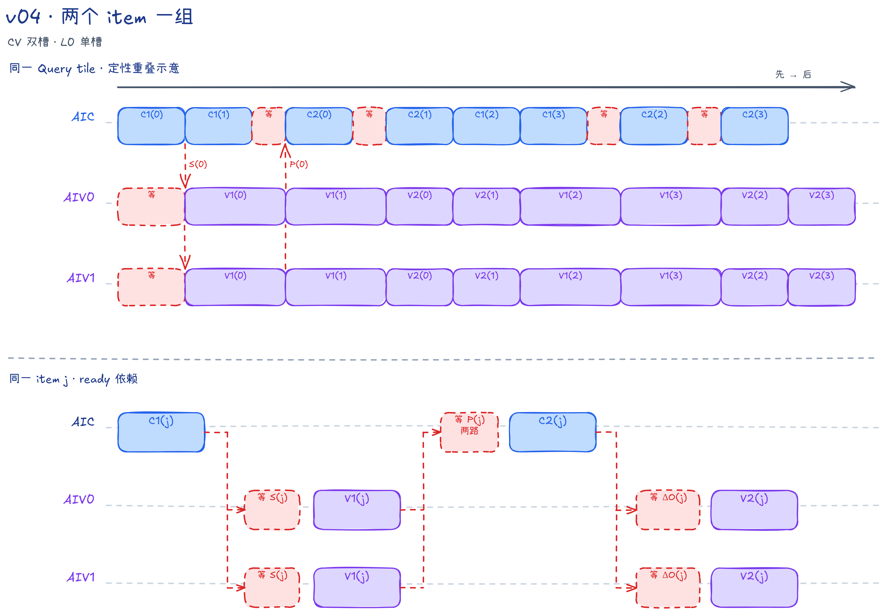

# FALite v04：CV 双槽分组，L0 保持单槽

## 本版内容

v04 将同一 task 的相邻两个 item 放进两套片上工作槽，先发射两次 C1，再发射两次 C2；AIV 对应先做两次 V1，再做两次 V2。这样 AIC 和 AIV 可以处理不同 item，但 AIC 的 L0A/L0B/L0C 仍各只有一槽。

本版固定使用 BF16 `Q/K/V/O [B,N,S,128]`、`Br=Bc=D=128`，计算同起点、等长度的方阵 causal Attention；`B/N/S` 为正整数，`S` 无需对齐，功能保证范围为 `B*N*S<=131072`。完整能力边界见[总文档的样例定位](../../README.md#falite-样例定位)，共同公式见[算法基础](../../README.md#算法基础)。

Host 令 `tr=ceil(S/128)`、`numTasks=B*N*tr`，启动 `useAicNum=min(numTasks,可用核数)` 个 Mix 组。第 `aicIdx` 组处理 `taskId=aicIdx+k*useAicNum`；`batchHeadIdx=taskId/tr`，`i=taskId%tr`。一个 task 负责一个 Query tile 的全部输出，同一 task 的 K/V item 编号为 `j=0...i`。相邻至多两个 item 组成一组，`slot=j%2`。

AIV0 负责 Query 行 0～63，AIV1 负责 64～127。两路 AIV 独立维护对应行的状态，不交换或归并 Softmax 结果。

`--core-num=0` 时使用设备可用 AIC 数；非零时采用请求值，再按 task 数收缩启动规模。请求超过设备核数会报错，不启动 Kernel。

## CV 核间流水与数据布局

满组的本核发射顺序如下；箭头不是全核完成屏障，两行也不表示锁步：

```text
AIC: C1(0) → C1(1) → C2(0) → C2(1) | 下一组
AIV: V1(0) → V1(1) → V2(0) → V2(1) | 下一组
```

C1 计算分数，V1 更新 Softmax 并交付 P，C2 计算 DeltaO，V2 更新输出分子 `OAcc=alpha*OAcc+DeltaO`。例如 C1(1) 与 V1(0)、C2(0) 与 V1(1) 允许重叠，实际时间由数据就绪和资源占用决定。

C1 用 `K[128,128] × Qᵀ[128,128]` 计算转置分数。Fixpipe 的 `dualDstCtl=2` 沿 Query 维切分，每路 AIV 接收 FP32 `Sᵀ[128 Key,64 Query]`，每个连续的 64 元素对应不同 Query。V1 在这个布局上沿 Key 维扫描，并原地把 S 改为未归一化权重。

`FusedDNToNZCastVF` 将权重转为 BF16 NZ 分块布局。每路 PWork 有四个 16 Query 列分组，每组含 128 个 32 B 数据块和一个 32 B 填充块；`CopyPWorkToL1` 跳过填充，写入共享 P L1 的半块。以 BF16 元素计，目标偏移是 `slot*16384+subAivIdx*8192`。两半按 Query 维拼接，不求和。

C2 通过转置 LoadData 把 L1 的 Pᵀ 装成 L0A 的 P，计算 `P×V`。Fixpipe 默认 `dualDstCtl=1` 按 Query 行切分，每路得到普通行布局的 FP32 `DeltaO[64,128]`。S、P、DeltaO 都不经过 GM。

Host 不申请中间 workspace，提交 Kernel 后即可返回；调用方读取输出或释放输入输出前仍需同步 stream。

| flag | flag ID（slot 0/1） | Set → Wait | 交付内容 |
| --- | --- | --- | --- |
| S_READY | 0/1 | AIC PIPE_FIX → AIV PIPE_V | S 已进入两路 UB |
| P_READY | 2/3 | AIV PIPE_MTE3 → AIC PIPE_MTE1 | 两半 P 已进入共享 L1 |
| O_READY | 4/5 | AIC PIPE_FIX → AIV PIPE_V | DeltaO 已进入两路 UB |

真机 mode2 中，AIC 的一次 Set 通知两路 AIV，反向 Wait 要等两路 AIV 都到达。仿真兼容路径用 mode4 分别处理两路，AIV1 的 flag ID 加 16，逻辑阶段不变。

没有独立的 slot-free 或 DONE 通知。复用依赖要连起来读：

- S：旧 V1 读完 S 后才能交付 P；旧 C2 的 MTE1 等到 P，后续 C1 的 MTE1 又排在旧 C2 之后，才会沿 Mmad→Fixpipe 写入下一代 S。
- P：下一组 V1 排在本组全部 V2 之后；旧 V2 等待旧 C2 写好 DeltaO，因此下一代 P 不会覆盖尚未被 C2 读取的旧 P。
- DeltaO：下一代 C2 要等下一代 V1 交付 P，而该 V1 排在旧 V2 之后，因此下一次 Fixpipe 写入不会覆盖尚未消费的 DeltaO。
- alpha：两次 V1 分别保存 alpha[0/1]，两次 V2 再按相同顺序读取；下一组 V1 排在这两次 V2 之后。

这些是 CrossCore、Mutex 和同一 Pipe 队列顺序组成的依赖链，不是“函数调用结束就代表所有硬件工作完成”。

## AIC：资源与核内同步

固定规格下 L1 共 224 KiB，L0A/L0B 各 32 KiB，L0C 64 KiB。表中容量是单槽大小；不同存储空间中的地址 0 互不别名。

| 资源 | 槽数 × 单槽容量 | Mutex ID | 生命周期 |
| --- | --- | --- | --- |
| K L1 | 2 × 32 KiB | 0/1 | C1 的 MTE2 写入 → MTE1 读 K → 允许下次写入 |
| V L1 | 2 × 32 KiB | 2/3 | C2 的 MTE2 写入 → MTE1 读 V → 允许下次写入 |
| Q L1 | 1 × 32 KiB | 4 | task 起步搬入；首个 C1 取得 MTE1 所有权，末个 C1 归还 |
| P L1 | 2 × 32 KiB | 无本地 Mutex | 两路 AIV 写入；P_READY 保护 C2 读取 |
| L0A、L0B | 各 1 × 32 KiB | 5，联合管理 | MTE1 装载 → Mmad 读取 → 下一次装载 |
| L0C | 1 × 64 KiB | 6 | Mmad 写入 → Fixpipe 读取 → 下一次矩阵乘 |
| C2 加载顺序 | 不占数据槽 | 7 | MTE1 读 P 后交给 MTE2，再搬 V |

C1 在 MTE1 上先等 K 并装入 L0A，再装 Q 到 L0B。C2 先装 P 到 L0A，通过 Mutex 7 交接后才启动 V 的 GM→L1，再把 V 装入 L0B。P 和 V 的 L1 地址不同，Mutex 7 表达加载顺序，不代表两者共用内存。

每次矩阵乘的所有权链为：

```text
MTE1 装 L0A/B → 交给 PIPE_M → Mmad
                            ├─ 归还 L0A/B，允许后续装载
                            └─ 交出 L0C → PIPE_FIX → Fixpipe → Set S/O_READY → 归还 L0C
```

`CubeStage1/2` 内的 CrossCore Set 在 Fixpipe 之后、L0C 的 `Unlock<PIPE_FIX>` 之前。下一次 Mmad 必须等同一 L0C 槽可用；不应把单槽概括成“所有 MTE1、Mmad、Fixpipe 都完全不能重叠”，因为 L0A/B 和 L0C 分别释放。

## AIV：item 双槽，task 单份状态

每路 UB 共 193.25 KiB，分配如下：

| 资源 | 槽数 × 单槽容量 | 用途 |
| --- | --- | --- |
| S、DeltaO | 各 2 × 32 KiB | 分别保存两次 V1/V2 的输入 |
| PWork | 2 × 16.125 KiB | 带填充的 BF16 NZ P；Mutex 0/1 在 Vector 与 MTE3 之间交接 |
| alpha | 2 × 256 B | 两次 V1 的缩放系数，保留到对应 V2 |
| m、l | 各 1 × 256 B | 按 j 顺序推进的 Softmax 状态 |
| OAcc | 1 × 32 KiB | 按 j 顺序更新的 FP32 输出分子 |

V1 顺序调用 `OnlineColwiseSoftmaxVF` 和 `FusedDNToNZCastVF`。Vector 释放 PWork 后，MTE3 才能读取并调用 `CopyPWorkToL1`；下次 Vector 覆盖同槽前，又要等待 MTE3 归还。V2 调用 `OnlineUpdateVF`，两次更新共用 OAcc，但读取不同的 alpha。

task 最后用 `FusedDivCastVF` 将 `OAcc/l` 写成普通 BF16 输出，复用 PWork slot 0，再由 MTE3 写 GM。下一 task 的 PWork[0] 仍受同一 Mutex 保护；OAcc 与 m/l 不属于这块输出缓冲。两路 AIV 的同号 Mutex 各自管理本核 UB。

## 调度伪代码

`with mutex(id, pipe)` 表示该 Pipe 的 Lock/Unlock，不表示 CPU 式全核等待。C1/C2 内部包含上一节的 L0 所有权链；v04 的 S/O 通知在函数内部发出。

```python
# AIC
for taskId in range(aicIdx, numTasks, useAicNum):
    i = taskId % tr
    with mutex(Q, MTE2):
        CopyGmToL1(Q, taskId)              # 有效行复制，尾部补零
    for begin in range(0, i + 1, 2):
        end = min(begin + 2, i + 1)
        for j in range(begin, end):
            s = j % 2
            # j==0: Lock(Q,MTE1)；j==i: Unlock(Q,MTE1)
            CubeStage1(j, s)              # Fix S → Set(FIX,S_READY[s]) → Unlock L0C
        for j in range(begin, end):
            s = j % 2
            WaitAivToAic(MTE1, P_READY[s])
            CubeStage2(j, s)              # 读 P → 顺序 Mutex → 搬 V → Mmad/Fix
                                         # Set(FIX,O_READY[s]) → Unlock L0C

# 每路 AIV，task 分配与同组 AIC 相同
for taskId in range(aicIdx, numTasks, useAicNum):
    i = taskId % tr
    init(OAcc=0, m=FLOAT_LOWEST, l=0)
    for begin in range(0, i + 1, 2):
        end = min(begin + 2, i + 1)
        for j in range(begin, end):
            s = j % 2
            WaitAicToAiv(V, S_READY[s])
            with mutex(PWork[s], V):
                VectorStage1(j, i, subAivIdx)   # 首轮/对角分支；保存 alpha[s]
            with mutex(PWork[s], MTE3):
                CopyPWorkToL1(s, subAivIdx)
            SetAivToAic(MTE3, P_READY[s])
        for j in range(begin, end):
            s = j % 2
            WaitAicToAiv(V, O_READY[s])
            VectorStage2(OAcc, DeltaO[s], alpha[s])
    if outputRows > 0:
        with mutex(PWork[0], V):
            FusedDivCastVF(PWork[0], OAcc, l, outputRows)
        with mutex(PWork[0], MTE3):
            DataCopy(O_GM, PWork[0], outputRows * 128)
```

## 首轮、奇数尾组与序列尾块

每个 task 先初始化 `m=FLOAT_LOWEST`、`l=0`、`OAcc=0`。首个 V1 使用 `OnlineColwiseSoftmaxVF<true,...>`，直接建立 m/l 并令 alpha=1；首个 V2 仍执行普通乘加。只有 `j==i` 的对角 item 做块内 causal mask：最大值和指数求和两遍都屏蔽 `keyLocal>queryLocal`，即逻辑 Query 行、Key 列矩阵的上三角。

组尾取 `groupEnd=min(groupStart+2,i+1)`。例如 `i=2` 时执行 `[0,1]`、`[2]`，尾组只用 slot 0，不产生 slot 1 的通知或等待。Q 的释放条件是 `j+1==kvTileCount`，不能用整条序列的 `tc` 代替。

`CopyGmToL1` 只读 Q/K/V 的有效行，并在 L1 的 NZ 布局中补零。V1 只扫描有效 Key 行，其余 P 行写零，Cube 仍计算完整 128×128 tile。每路输出行数为 `clamp(qValidRows-subAivIdx*64,0,64)`；即使 AIV1 没有有效输出行，也要完成所有 V1/V2 和 P 就绪通知，只跳过最终归一化和 GM 写回。

入口调用 `InitSocState()`，源码没有额外的手工初始 SetFlag 或循环末尾 DONE 排空。各缓冲的最后一次消费通过对应 Mutex 释放；最终输出在 AIV task 尾部发射，不能把 AIC 循环结束当成输出写回完成。

## 从 v03 到 v04

K/V/P L1、S/DeltaO/PWork/alpha 改为双槽，S/P/O_READY 按槽编号，删除 v03 的逐 item DONE 及最后一次 DONE 等待。Q、OAcc、m/l 和 L0 仍是单槽；公式、精度和 P 的片上交接不变。[v05](../v05/README.md) 进一步将 L0 改为双槽，并调整 C1/C2 的装载依赖。

## 流水示意与性能参考

统一口径下，本版 Task Duration 为 31164.513672 μs，因果有效 Cube MFU 为 32.6677%；条件和完整对比见[总文档性能表](../../README.md#统一性能结果)。



示意图展示连续两组的允许重叠及同 item 就绪依赖，省略反向复用和核内 Mutex；色块宽度不是实测耗时，L0 仍为单槽。


PipeTimeline 截图使用 `B=N=1,S=2048`、单 Mix 核组，窗口为 `[88.796,128.796]` μs，用于观察核内流水与跨核重叠；上述长序列性能来自独立计时。

## 代码阅读入口

| 入口 | 重点 |
| --- | --- |
| [Host tiling](host/flash_attn_lite_host.cpp) 的 `ComputeFlashAttnLiteTilingData` | task 数、实际核数、各 SRAM 地址与容量检查 |
| [公共结构](flash_attn_lite_common.h) | 槽数常量、`SRAMLayoutAIC/AIV`；Addr 是字节，多槽缓冲的 Elems 包含全部槽；`rowStatsUBElems=64` 例外，表示单份行统计长度，alpha 总长度还需乘槽数 |
| [Kernel 入口](kernel/flash_attn_lite_kernel.asc) | `__mix__(1,2)`、`InitSocState`、固定 causal 模板 |
| [AIC 实现](kernel/falite_kernel_aic.h) | 先读 `KernelProcessForAIC` 的分组循环，再读 `CubeStage1/2` 和 Mutex |
| [AIV 实现](kernel/falite_kernel_aiv.h) | `KernelProcessForAIV`、`VectorStage1/2`、`CopyPWorkToL1` 和最终输出 VF |
| [同步封装](kernel/falite_kernel_common.h) | flag ID、Set/Wait 所在 Pipe、`GetKvTileCount` 与 `GetTileValidRows` |

从仓库根目录可构建 `cmake --build build --target falite_v04 -j`，运行 `./build/Samples/2_Performance/flash_attn_lite_story/falite_v04 --core-num 1 --size 1 1 385` 阅读满组、单 item 尾组和非整块输出路径；完整配置与精度标准见[编译、运行与复现](../../README.md#编译运行与复现)。
