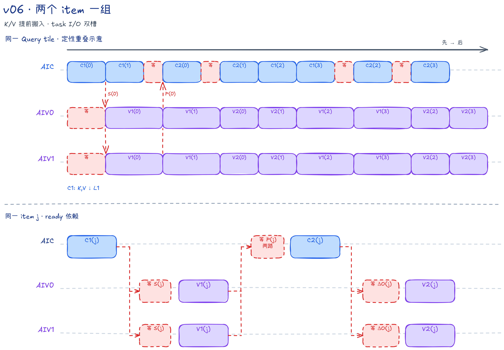
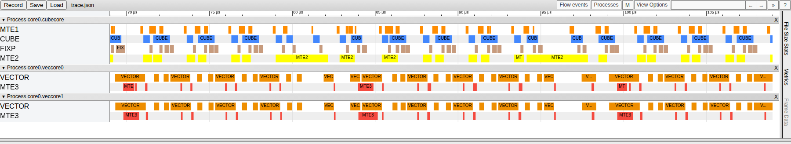

# FALite v06：K/V 预取与 task 输入输出双槽

## 本版内容

v06 将 V 的 GM→L1 搬运从 C2 前移到 C1，和 K 一起装入；C2 只消费片上的 P/V。Q L1 与 OAcc/最终输出 UB 增加 task 级双槽，而 item 仍按两个一组调度，L0 仍为双槽。

本版固定使用 BF16 `Q/K/V/O [B,N,S,128]`、`Br=Bc=D=128`，计算同起点、等长度的方阵 causal Attention；`B/N/S` 为正整数，`S` 无需对齐，功能保证范围为 `B*N*S<=131072`。完整能力边界见[总文档的样例定位](../../README.md#falite-样例定位)，共同公式见[算法基础](../../README.md#算法基础)。

Host 令 `tr=ceil(S/128)`、`numTasks=B*N*tr`，启动 `useAicNum=min(numTasks,可用核数)` 个 Mix 组。第 `aicIdx` 组处理 `taskId=aicIdx+k*useAicNum`；`batchHeadIdx=taskId/tr`，`i=taskId%tr`。一个 task 负责一个 Query tile 的全部输出，同一 task 的 K/V item 编号为 `j=0...i`。相邻至多两个 item 组成一组，`slot=j%2`。

AIV0 负责 Query 行 0～63，AIV1 负责 64～127。两路 AIV 独立维护对应行的状态，不交换或归并 Softmax 结果。

`--core-num=0` 时使用设备可用 AIC 数；非零时采用请求值，再按 task 数收缩启动规模。请求超过设备核数会报错，不启动 Kernel。

本版的 `ioSlot` 与 `slot` 分属两层循环：`slot=j%2` 为本 task 的 item 选槽；`ioSlot` 从 0 开始，每处理一个本组 task 才执行 `ioSlot^=1`。它不是 `taskId%2`，因为 taskId 按核数跨步。

## CV 核间流水与数据布局

每个满组的本核发射顺序不变：

```text
AIC: C1(0) → C1(1) → C2(0) → C2(1) | 下一组
AIV: V1(0) → V1(1) → V2(0) → V2(1) | 下一组
```

C1 预取 K/V 并生成分数，V1 更新 Softmax 并交付 P，C2 生成 DeltaO，V2 更新当前 `OAcc[ioSlot]`。task 双槽允许前一 task 的输入输出搬运与后续工作重叠，不表示两个 task 的 m/l 递推同时进行。

C1 用 `K[128,128] × Qᵀ[128,128]` 计算转置分数。Fixpipe 的 `dualDstCtl=2` 沿 Query 维切分，每路 AIV 接收 FP32 `Sᵀ[128 Key,64 Query]`，每个连续的 64 元素对应不同 Query。V1 在这个布局上沿 Key 维扫描，并原地把 S 改为未归一化权重。

`FusedDNToNZCastVF` 将权重转为 BF16 NZ 分块布局。每路 PWork 有四个 16 Query 列分组，每组含 128 个 32 B 数据块和一个 32 B 填充块；`CopyPWorkToL1` 跳过填充，写入共享 P L1 的半块。以 BF16 元素计，目标偏移是 `slot*16384+subAivIdx*8192`。两半按 Query 维拼接，不求和。

C2 通过转置 LoadData 把 L1 的 Pᵀ 装成 L0A 的 P，计算 `P×V`。Fixpipe 默认 `dualDstCtl=1` 按 Query 行切分，每路得到普通行布局的 FP32 `DeltaO[64,128]`。S、P、DeltaO 都不经过 GM。

Host 不申请中间 workspace，提交 Kernel 后即可返回；调用方读取输出或释放输入输出前仍需同步 stream。

| flag | flag ID（slot 0/1） | Set → Wait | 交付内容 |
| --- | --- | --- | --- |
| S_READY | 0/1 | AIC PIPE_FIX → AIV PIPE_V | S 已写入 UB |
| P_READY | 2/3 | AIV PIPE_MTE3 → AIC PIPE_MTE1 | 两半 P 已写入共享 L1 |
| O_READY | 4/5 | AIC PIPE_FIX → AIV PIPE_V | DeltaO 已写入 UB |

v05 的 P_READY_MTE2 已删除：V 在 C1 搬入，由 K/V Mutex 保留到 C2，C2 不再需要启动 GM 搬运。真机 mode2 下，AIC 一次 Set 通知两路 AIV，P_READY 的 Wait 则等两路都完成。仿真 mode4 封装分别同步两路，AIV1 的 flag ID 加 16。

没有独立的 slot-free 或 DONE 通知。复用依赖要连起来读：

- S：旧 V1 读完 S 后才能交付 P；旧 C2 的 MTE1 等到 P，后续 C1 的 MTE1 又排在旧 C2 之后，才会沿 Mmad→Fixpipe 写入下一代 S。
- P：下一组 V1 排在本组全部 V2 之后；旧 V2 等待旧 C2 写好 DeltaO，因此下一代 P 不会覆盖尚未被 C2 读取的旧 P。
- DeltaO：下一代 C2 要等下一代 V1 交付 P，而该 V1 排在旧 V2 之后，因此下一次 Fixpipe 写入不会覆盖尚未消费的 DeltaO。
- alpha：两次 V1 分别保存 alpha[0/1]，两次 V2 再按相同顺序读取；下一组 V1 排在这两次 V2 之后。

这些是 CrossCore、Mutex 和同一 Pipe 队列顺序组成的依赖链，不是“函数调用结束就代表所有硬件工作完成”。

## AIC：跨 C1/C2 持有 K/V

固定规格下 L1 共 256 KiB，L0A/L0B 各 64 KiB，L0C 128 KiB。

| 资源 | 槽数 × 单槽容量 | Mutex ID | 生命周期 |
| --- | --- | --- | --- |
| K L1、V L1 | 各 2 × 32 KiB | 0/1，同号联合管理 K/V | C1 MTE2 写入两者；C1 MTE1 读 K；C2 MTE1 读 V 后归还 |
| Q L1 | 2 × 32 KiB | 2/3，按 ioSlot | task 起步 MTE2 写入；首个 C1 的 MTE1 取得，末个 C1 归还 |
| P L1 | 2 × 32 KiB | 无本地 Mutex | 两路 AIV 写入，P_READY 保护读取 |
| L0A、L0B | 各 2 × 32 KiB | 4/5，每号联合管理 A/B | MTE1 装载 → Mmad 读 → 下一次装载 |
| L0C | 2 × 64 KiB | 6/7 | Mmad 写 → Fixpipe 读 → 下一次矩阵乘 |

K 和 V 是两块不同地址的 L1 缓冲，只是同号 K/V 槽共用一套所有权交接。C1 的 MTE2 连续写 K、V 后才释放 Mutex，因此 MTE1 取得它时两者都已就绪。MTE1 先读 K，但不归还该 Mutex；到同一 item 的 C2 读完 V 才归还，避免下一组的预取提前覆盖 V。

核心路径如下，箭头表示依赖，不是所有 Pipe 同步完成：

```text
MTE2: Lock KV[s] → 写 K[s]、V[s] → Unlock KV[s]
MTE1: 装 Q[io] → L0B[s] → Lock KV[s] → 装 K[s] → L0A[s]
      ……同一 item 的 P_READY 到达……
MTE1: 装 P[s] → L0A[s] → 装 V[s] → L0B[s] → Unlock KV[s]
```

Q 在 task 起步搬入当前 I/O 槽，首个 C1 取得其 MTE1 所有权，末个 C1 装载后归还。下一 task 选择另一槽，但源码没有单独的“预取下一 task Q”循环：重叠来自命令分发和不同 Pipe 的推进。

每次 C1/C2 的 L0AB 在 Mmad 读取后归还，L0C 在 Fixpipe 读取后归还；两者的复用分别等待自己的 Mutex。S/O_READY 位于 `CubeStage1/2` 返回后的主循环，排在该 stage 的 Fixpipe 与 L0C 归还之后。

## AIV：输出与 OAcc 原地共用双槽

每路 UB 共 225.25 KiB：

| 资源 | 槽数 × 单槽容量 | 生命周期 |
| --- | --- | --- |
| S、DeltaO | 各 2 × 32 KiB | 按 item slot 保存 V1/V2 输入 |
| PWork | 2 × 16.125 KiB | 仅保存 BF16 NZ P；Mutex 0/1：Vector 写 → MTE3 读 |
| alpha | 2 × 256 B | V1 生成，保留到同 item 的 V2 |
| m、l | 各 1 × 256 B | 当前 task 的 Softmax 递推状态 |
| OAcc/Output | 2 × 32 KiB，共用地址 | 按 ioSlot；Mutex 2/3：Vector 初始化、累加、压缩 → MTE3 写 GM |

V1 仍分开调用 `OnlineColwiseSoftmaxVF` 与 `FusedDNToNZCastVF`，MTE3 通过 `CopyPWorkToL1` 写 P；V2 仍调用 `OnlineUpdateVF`。m/l 只有一份；OAcc 有两个物理槽，但一个 task 的全部 V2 始终更新当前槽。

最终 `FusedDivCastInplaceVF` 按行正序读取 FP32 OAcc，归一化后将 BF16 写入同槽前半段。固定 D=128 时，每行先读取完整 FP32 行再写出压缩结果，目标只覆盖已经读取的区域。输出的 BF16 视图并非额外分配：相邻 I/O 槽的跨度仍是 32 KiB，换成 BF16 元素偏移时必须乘 `sizeof(float)/sizeof(bfloat16_t)=2`。

Output Mutex 从 task 初始化 OAcc 前一直由 Vector 持有到最终压缩结束，再交给 MTE3。下一 task 用另一槽，可与旧输出写回重叠；隔一个 task 再复用同槽时必须等 MTE3 归还。m/l 的初始化排在 Output Lock 之前，不需要等输出槽。PWork 不再充当最终输出。

## 调度伪代码

省略矩阵参数，保留两层槽位与实际释放位置。Lock/Wait 都在所标 Pipe 上生效，不是全核同步。

```python
# AIC
io = 0
for taskId in range(aicIdx, numTasks, useAicNum):
    i = taskId % tr
    with mutex(Q[io], MTE2):
        CopyGmToL1(Q[io], taskId)
    for begin in range(0, i + 1, 2):
        end = min(begin + 2, i + 1)
        for j in range(begin, end):
            s = j % 2
            # CubeStage1 内：
            # MTE2 Lock KV[s] → 写 K/V → Unlock
            # 首C1 Lock Q[io],MTE1；装Q → Lock KV[s],MTE1 → 装K
            # 末C1 Unlock Q[io],MTE1；KV[s]继续持有
            CubeStage1(j, s, io)
            SetAicToAiv(FIX, S_READY[s])
        for j in range(begin, end):
            s = j % 2
            WaitAivToAic(MTE1, P_READY[s])
            CubeStage2(s)              # 装P/V后Unlock KV[s],MTE1，再Mmad/Fix
            SetAicToAiv(FIX, O_READY[s])
    io ^= 1

# 每路 AIV
io = 0
for taskId in range(aicIdx, numTasks, useAicNum):
    i = taskId % tr
    init(m=FLOAT_LOWEST, l=0)
    Lock(Output[io], V)
    init(OAcc[io]=0)
    for begin in range(0, i + 1, 2):
        end = min(begin + 2, i + 1)
        for j in range(begin, end):
            s = j % 2
            WaitAicToAiv(V, S_READY[s])
            with mutex(PWork[s], V):
                VectorStage1(j, i, subAivIdx)
            with mutex(PWork[s], MTE3):
                CopyPWorkToL1(s, subAivIdx)
            SetAivToAic(MTE3, P_READY[s])
        for j in range(begin, end):
            s = j % 2
            WaitAicToAiv(V, O_READY[s])
            VectorStage2(OAcc[io], DeltaO[s], alpha[s])
    if outputRows > 0:
        FusedDivCastInplaceVF(OAcc[io], l, outputRows)
    Unlock(Output[io], V)               # 零输出行也必须释放
    if outputRows > 0:
        with mutex(Output[io], MTE3):
            DataCopy(O_GM, Output[io], outputRows * 128)
    io ^= 1                            # 零输出行也照常翻转
```

## 首轮、奇数尾组与序列尾块

每个 task 先初始化 `m=FLOAT_LOWEST`、`l=0`、`OAcc=0`。首个 V1 使用 `OnlineColwiseSoftmaxVF<true,...>`，直接建立 m/l 并令 alpha=1；首个 V2 仍执行普通乘加。只有 `j==i` 的对角 item 做块内 causal mask：最大值和指数求和两遍都屏蔽 `keyLocal>queryLocal`，即逻辑 Query 行、Key 列矩阵的上三角。

组尾取 `groupEnd=min(groupStart+2,i+1)`。例如 `i=2` 时执行 `[0,1]`、`[2]`，尾组只用 slot 0，不产生 slot 1 的通知或等待。Q 的释放条件是 `j+1==kvTileCount`，不能用整条序列的 `tc` 代替。

`CopyGmToL1` 只读 Q/K/V 的有效行，并在 L1 的 NZ 布局中补零。V1 只扫描有效 Key 行，其余 P 行写零，Cube 仍计算完整 128×128 tile。每路输出行数为 `clamp(qValidRows-subAivIdx*64,0,64)`；即使 AIV1 没有有效输出行，也要完成所有 V1/V2 和 P 就绪通知，只跳过最终归一化和 GM 写回。

入口调用 `InitSocState()`，源码没有额外的手工初始 SetFlag 或循环末尾 DONE 排空。各缓冲的最后一次消费通过对应 Mutex 释放；最终输出在 AIV task 尾部发射，不能把 AIC 循环结束当成输出写回完成。

v06 的零输出行分支还必须释放 Output 的 Vector 所有权并翻转 ioSlot。两路 AIV 都遍历同组的全部 task，不能因本路没有有效 Query 行而跳过 task，否则槽位和通知序列会错位。

## 从 v05 到 v06

V 的搬入前移到 C1；独立 K/V Mutex 合并为跨 C1/C2 持有的同槽 Mutex；删除 P_READY_MTE2。Q 增为两个 task 槽，OAcc 增为两个与 BF16 输出别名的槽，最终输出不再复用 PWork。双 item 分组、L0 双槽和基础 Vector 通路不变。

本版仍先发射本组全部 C1/V1，再发射 C2/V2。组边界是本核命令顺序，不是新增跨核屏障；[v07](../v07/README.md) 改变这层循环，让后续 C1/V1 可以更早发射。

## 流水示意与性能参考

统一口径下，本版 Task Duration 为 24255.705078 μs，因果有效 Cube MFU 为 41.9726%；条件和完整对比见[总文档性能表](../../README.md#统一性能结果)。



示意图展示两组 item 及同 item 依赖，省略反向复用和 Mutex，task I/O 双槽也未展开。K/V 提前装入不同 L1 区域，V 保留到对应 C2；色块宽度不是实测耗时。



PipeTimeline 截图使用 `B=N=1,S=2048`、单 Mix 核组，窗口为 `[68.998,108.998]` μs。I/O 允许重叠的范围以槽位依赖为准，不由图中阶段对齐推断锁步关系；上述长序列性能来自独立计时。

## 代码阅读入口

| 入口 | 重点 |
| --- | --- |
| [Host tiling](host/flash_attn_lite_host.cpp) 的 `ComputeFlashAttnLiteTilingData` | task 数、实际核数、各 SRAM 地址与容量检查 |
| [公共结构](flash_attn_lite_common.h) | 槽数常量、`SRAMLayoutAIC/AIV`；Addr 是字节，多槽缓冲的 Elems 包含全部槽；`rowStatsUBElems=64` 例外，表示单份行统计长度，alpha 总长度还需乘槽数 |
| [Kernel 入口](kernel/flash_attn_lite_kernel.asc) | `__mix__(1,2)`、`InitSocState`、固定 causal 模板 |
| [AIC 实现](kernel/falite_kernel_aic.h) | 先读 `KernelProcessForAIC` 的分组循环，再读 `CubeStage1/2` 和 Mutex |
| [AIV 实现](kernel/falite_kernel_aiv.h) | `KernelProcessForAIV`、`VectorStage1/2`、`CopyPWorkToL1` 和最终输出 VF |
| [同步封装](kernel/falite_kernel_common.h) | flag ID、Set/Wait 所在 Pipe、`GetKvTileCount` 与 `GetTileValidRows` |

从仓库根目录可构建 `cmake --build build --target falite_v06 -j`，运行 `./build/Samples/2_Performance/flash_attn_lite_story/falite_v06 --core-num 1 --size 1 1 513` 阅读五个 task 的 I/O 翻转、奇数尾组和一行尾块；完整配置与精度标准见[编译、运行与复现](../../README.md#编译运行与复现)。
