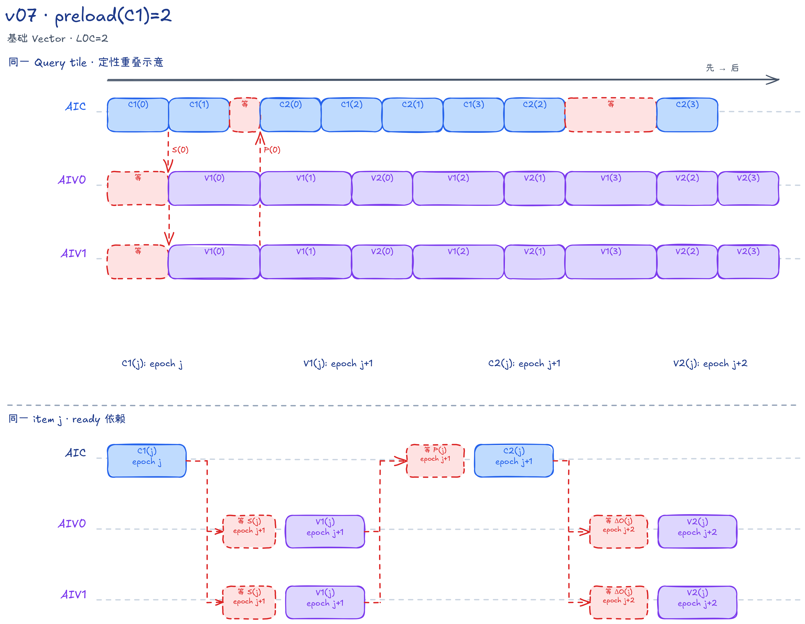

# FALite v07：preload(C1)=2，首个 C2 前预发射两个 C1

## 本版内容

v07 将 v06 的“双 item 分组”改为连续调度：AIC 每轮先发射一个新 C1，再发射较早 item 的 C2；AIV 每轮先发射新 V1，再更新旧 V2。首个 C2 前最多预发射两个 C1，后续工作不再受原来的双 item 组边界限制。本文记 `R=CV_PIPELINE_SLOT_NUM=2`，`L0C_QUEUE_DEPTH=2`。

本版固定使用 BF16 `Q/K/V/O [B,N,S,128]`、`Br=Bc=D=128`，计算同起点、等长度的方阵 causal Attention。`B/N/S` 为正整数，`S` 无需对齐，功能保证范围为 `B*N*S<=131072`。完整能力边界见[样例定位](../../README.md#falite-样例定位)，共同推导见[算法基础](../../README.md#算法基础)。

S、P、DeltaO 全部在片上交接，没有 GM workspace。Host 提交 Kernel 后返回，调用方读取输出或释放输入输出前仍需同步 stream。

## task 归属与四种槽位编号

Host 计算 `tr=ceil(S/128)` 和 `numTasks=B*N*tr`。请求核数为 0 时以设备 AIC 数为上限，非零请求超过设备核数会报错；合法请求再取 `useAicNum=min(核数上限,numTasks)`。

一个 Mix 核组包含 1 个 AIC 和 2 个 AIV。AIC 用 `GetBlockIdx()` 得到核组编号，AIV 用 `GetBlockIdx()/GetSubBlockNum()` 得到相同编号；三者都处理以下 task：

```text
taskId = aicIdx, aicIdx + useAicNum, aicIdx + 2*useAicNum, ...
batchHeadIdx = taskId / tr
i = taskId % tr
```

一个 task 负责某个 `(b,n)` 的一个 Query tile，独立维护 Softmax 状态并写自己的输出行，不需要跨核组归约。该 task 访问的 K/V tile 编号为 `j=0...i`，每个 `(i,j)` 称为一个 item，实际数量 `kvTileCount=i+1`。

AIV0 处理 Query 局部行 0～63，AIV1 处理 64～127；两路各维护 64 行的 m/l/OAcc，不交换或合并这些状态。causal 下不同 i 的 item 数不同，固定步长分配并不保证各核组负载完全相等。

连续调度中不能用一个 `slot` 代替所有编号：

| 编号 | 计算方式 | 使用资源 |
| --- | --- | --- |
| item 双槽 | `j%2` | K L1、S UB、DeltaO UB、PWork |
| 跨阶段槽 | `j%R` | V L1、P L1、alpha；保存同一 item 的较长生命周期数据 |
| 矩阵乘槽 | `mmadOpIdx%2`、`mmadOpIdx%2` | 前者选 L0A/B，后者选 L0C |
| task I/O 槽 | `ioSlot` 从 0 开始，每个本核 task 后翻转 | Q L1、OAcc/Output UB |

`mmadOpIdx` 在每次实际发射 C1 或 C2 后加 1，跨 task 延续，不按 j 或 epoch 重置。`ioSlot` 则每个 task 只翻转一次，不等于 `taskId%2`。

## CV 调度与数据布局

| 阶段 | 核心 | 工作与交接 |
| --- | --- | --- |
| C1(j) | AIC | 搬入 K/V，计算 `K_j×Q_i^T→S_j^T`，Fixpipe 写两路 S UB |
| V1(j) | 两路 AIV | 更新 m/l/alpha，生成未归一化 BF16 P，再写共享 P L1 |
| C2(j) | AIC | 读取同 item 的 P/V，计算 `P_j×V_j→DeltaO_j`，Fixpipe 写两路 DeltaO UB |
| V2(j) | 两路 AIV | `OAcc=alpha_j×OAcc+DeltaO_j`；task 末尾才除以 l 并写回 |

两次 Cube 都使用 BF16 输入、FP32 累加。S、DeltaO、m/l/alpha 和 OAcc 为 FP32，P 和最终 O 为 BF16。

Q/K/V/O 在 GM 中紧凑排列，一个 token 连续保存 128 个通道。tile 首元素偏移为 `(batchHeadIdx*S+tileIdx*128)*128`；尾行不在 GM 预先补齐，而由 `CopyGmToL1` 在 L1 补零。Q/K/V 进入 L1 后使用 NZ，即 Cube 读取所需的分块布局。

C1 的 Fixpipe 使用 `dualDstCtl=2`，将转置分数 `S^T[Key,Query]` 的 Query 列均分；每路收到连续的 `[128,64]`。Vector 每次加载 64 个 FP32 值，一个 lane 对应一个 Query 行，沿 Key 维循环更新行统计。C2 使用默认 `dualDstCtl=1`，按 Query 行均分 DeltaO，每路得到普通行布局的 `[64,128]`。

V1 分别调用 `OnlineColwiseSoftmaxVF` 和 `FusedDNToNZCastVF`：前者将 FP32 权重写回 S，后者重新读取、Cast/Pack，并写入带临时填充的 BF16 NZ PWork。每路有四个 16 Query 列分组，每组 128 个 32 B 数据块外加一个填充块，单槽为 `4*129*32=16512 B`。

`CopyPWorkToL1` 的 `DataCopyParams(4,128,1,0)` 跳过各组源端的填充块，写到共享 L1 的 `(j%R)*16384+subAivIdx*8192` 个 BF16 元素偏移。两路按 Query 列分组拼接，不求和。C2 将 L1 中的 Pᵀ 通过转置 LoadData 装到 L0A，执行 P×V。

### epoch 是各核心自己的循环编号

AIC 和 AIV 各自执行 `epoch=0...kvTileCount+R-1`，其阶段编号如下：

```text
AIC：先 C1(epoch)，再 C2(epoch-R+1)
AIV：先 V1(epoch-1)，再 V2(epoch-R)
各阶段仅在 0 <= item编号 < kvTileCount 时发射
```

首个 C2 在 AIC 的 epoch 1 发射，之前已经发射 `min(R,kvTileCount)` 个 C1；首个 V2 在 AIV 的 epoch 2 发射，之前同样已有最多 R 个 V1。预发射不等于结果已经完成。

以不少于 4 个 item 的 task 为例：

| 本核 epoch 编号 | AIC 的发射顺序 | 每路 AIV 的发射顺序 |
| ---: | --- | --- |
| 0 | C1(0) | — |
| 1 | C1(1) → C2(0) | V1(0) |
| 2 | C1(2) → C2(1) | V1(1) → V2(0) |
| 3 | C1(3) → C2(2) | V1(2) → V2(1) |

同一行只是把相同数值的循环编号排在一起，不是共同时间点。跨核先后由数据通知决定，不能把 C1(j) 与 V2(j) 的 epoch 编号差解释为真实时延。

## AIC 缓冲与核内同步

L1 按 P、K、Q、V 顺序连续分配；所有地址均由 Host tiling 计算。固定规格下 L1 共 256 KiB，L0A/B 各 64 KiB，L0C 共 128 KiB。

| 资源 | 槽数 × 单槽大小 | Mutex ID | 生命周期 |
| --- | --- | --- | --- |
| K L1 | 2 × 32 KiB | 0～1 | C1 MTE2 写入，MTE1 读 K 后归还 |
| V L1 | 2 × 32 KiB | 2～3 | C1 MTE2 写入，保留到对应 C2 的 MTE1 读完 |
| Q L1 | 2 × 32 KiB | 4～5 | task 起步搬入；首个 C1 取得 MTE1 所有权，末个 C1 归还 |
| P L1 | 2 × 32 KiB | 无本地写入 Mutex | 两路 AIV 写入，由 P_READY 保护 AIC 读取 |
| L0A/B | 各 2 × 32 KiB | 6～7，每号联合管理 A/B | MTE1 写入 → Mmad 读取 → 下一次装载 |
| L0C | 2 × 64 KiB | 8～9 | Mmad 写入 → Fixpipe 读取 → 下一次矩阵乘 |

C1 的 MTE2 分别用 K、V 的 Mutex 搬入两者，不再像 v06 那样跨 C1/C2 持有一把 K/V Mutex。MTE1 先装 Q 到 L0B，再取得 K 槽、装 K 到 L0A；读完 K 即归还。V 的数据则留在独立的 `j%R` 槽，直到 C2 读取。

Q 的 MTE1 Lock 位于首个 C1，Unlock 位于最后一个有效 C1 的装载之后，后续 Mmad 读的是 L0B。C2 先在 MTE1 等 P_READY，再取得 L0A/B；读取 P 到 L0A，读取 V 到 L0B，并归还 V 槽。两次 Mmad 都初始化结果槽，跨 item 的累计不在 L0C 中进行。

C1/C2 的结果写出顺序必须保留：

```text
Mmad → 归还 L0A/B → 交出 L0C
Fixpipe 取得 L0C → 等待目标 UB 可写 → Fixpipe 写出
                → 通知 AIV 可读 → 归还 L0C
```

等待 AIV 归还 UB 前先 Lock L0C，防止后发射的 Mmad 在旧结果尚未写出时覆盖它。CrossCore ready Set 位于 Fixpipe 之后、L0C Unlock 之前。Lock/Wait 均绑定具体 Pipe，不是 Scalar 全核屏障。

## AIV 缓冲与基础 Vector 通路

每路 AIV 的 UB 共 225.25 KiB，两路独立分配：

| 资源 | 槽数 × 单槽大小 | 管理与生命周期 |
| --- | --- | --- |
| S | 2 × 32 KiB | C1 写，V1 读；CrossCore 双向交接 |
| DeltaO | 2 × 32 KiB | C2 写，V2 读；CrossCore 双向交接 |
| PWork | 2 × 16.125 KiB | Mutex 0～1，Vector 写 → MTE3 读 |
| OAcc/Output | 2 × 32 KiB | Mutex 2～3，按 ioSlot；FP32 累加和 BF16 输出共址 |
| alpha | 2 × 256 B | 按 j%R，V1 写后保留到同 item 的 V2 |
| m/l | 各 1 × 256 B | 各 64 个 FP32 值，按 item 顺序递推 |

`rowStatsUBElems=64` 是单份行统计长度，不是 alpha 的总长度。alpha LocalTensor 的元素数是 `R*rowStatsUBElems=128`，其容量为 512 B；Host 的 UB 容量检查也乘 R。

Vector 先 Lock PWork，再等待 S 可读，完成 V1 后先归还 S，再 Unlock PWork。此时 S 已经不再需要，但 P 还没有写入 L1。MTE3 随后取得 PWork、调用 `CopyPWorkToL1`，释放 PWork 后发 P_READY。下一次 Vector 覆盖该 PWork 槽前，要等本次 MTE3 读取完成。

V2 调用 `OnlineUpdateVF`，逐行广播 alpha，并执行普通乘法和加法。m/l 只有一份，按 V1 的 j 顺序推进；OAcc 有两个 task 槽，但一个 task 的所有 V2 始终更新同一槽，不能把它们理解为两条并行 Softmax 状态链。

Output Mutex 从 OAcc 初始化前一直由 Vector 持有到 task 最终归一化结束。`FusedDivCastInplaceVF` 按行正序读取 FP32 OAcc，计算 OAcc/l，将 BF16 输出写入同槽前半段；D=128 时每行先完整读取再写出压缩结果。随后 Vector 归还槽，由 MTE3 读出有效行到 GM。下一 task 使用另一 ioSlot，隔一个 task 再复用同槽时仍要等待旧输出读完。

BF16 Output 视图不额外占用 UB，相邻槽的跨度仍为 32 KiB。以 BF16 元素索引它时，偏移要将 FP32 元素数乘 `sizeof(float)/sizeof(bfloat16_t)=2`，不能直接复用 FP32 的元素偏移。

## CrossCore：可读与可写双向交接

源码中的 HANDOFF 表示同一 flag ID 在两个方向上传递不同含义：AIV→AIC 表示 UB 可写，AIC→AIV 表示结果可读。它们不是两套独立 flag。

| flag 名称 | flag ID | 方向与 Pipe | 含义 |
| --- | --- | --- | --- |
| S_HANDOFF | 0～1 | AIV V → AIC FIX | S 槽可写（初始及 V1 后归还） |
| S_HANDOFF | 0～1 | AIC FIX → AIV V | S 已写好 |
| P_READY | 2～3 | AIV MTE3 → AIC MTE1 | 两路 P 已进入共享 L1 |
| O_DELTA_HANDOFF | 4～5 | AIV V → AIC FIX | DeltaO 槽可写（初始及 V2 后归还） |
| O_DELTA_HANDOFF | 4～5 | AIC FIX → AIV V | DeltaO 已写好 |

真机 mode2 下，AIC 一次 Set 通知两路 AIV，反向 Wait 要等两路 AIV 都到达。`SIM_COMPATIBLE=ON` 的 mode4 封装分别处理两路，AIV1 的 flag ID 加 16，逻辑交接不变。表中的 V/FIX 对应 `PIPE_V/PIPE_FIX`。

两路 AIV 在全部 task 之前各自为两个 S 槽、两个 DeltaO 槽发送初始“可写”。每轮读完后归还；这些信号跨 task 延续，不在 task 开头重新初始化。AIC 在所有 task 之后分别消费两组槽的最后一次“可写”，包括从未用到、仍保留初始信号的槽。

P 没有额外的“已读完”通知。关键依据在同一路 AIV：V2(j) 在本核 epoch `j+R` 消费 alpha(j)，V1(j+R) 在下一个本核 epoch `j+R+1` 才覆盖同槽 P/alpha。V2(j) 又必须先等 C2(j) 的 DeltaO 就绪，说明旧 P 已被 C2 读取。保护来自这条依赖链，不能仅比较不同核心的 epoch 数字。

## 调度伪代码

两侧循环分别列出。`with mutex(资源,Pipe)` 对应 Lock/Unlock。C1/C2 的 MTE、Mmad 操作压缩为一行，但显式保留影响缓冲复用的 Fixpipe 顺序。

```python
# AIC
R, L0C = 2, 2
io, mm = 0, 0
for taskId in range(aicIdx, numTasks, useAicNum):
    i = taskId % tr
    n = i + 1
    with mutex(Q[io], MTE2):
        CopyGmToL1(Q[io], taskId)          # 有效行复制，其余补零
    for e in range(n + R):
        if e < n:
            j = e
            ab, c = mm % 2, mm % L0C
            # CubeStage1：K[j%2]/V[j%R]分别搬入；
            # 首C1取得Q，装Q/K后归还K，末C1归还Q；
            # Mmad前后按L0AB/L0C Mutex交接。
            c1_load_and_mmad(j, io, ab, c)
            with mutex(L0C_slot[c], FIX):
                WaitAivToAic(FIX, S_HANDOFF[j % 2])
                FixpipeToVecUB(S[j % 2])
                SetAicToAiv(FIX, S_HANDOFF[j % 2])
            mm += 1

        j = e - R + 1
        if 0 <= j < n:
            ab, c = mm % 2, mm % L0C
            # CubeStage2内先等P，再取得L0AB、装P/V；
            # 读完V归还其Mutex，随后Mmad。
            WaitAivToAic(MTE1, P_READY[j % R])
            c2_load_and_mmad(j, ab, c)
            with mutex(L0C_slot[c], FIX):
                WaitAivToAic(FIX, O_DELTA_HANDOFF[j % 2])
                FixpipeToVecUB(DeltaO[j % 2])
                SetAicToAiv(FIX, O_DELTA_HANDOFF[j % 2])
            mm += 1
    io ^= 1                              # mm不重置

for s in range(2):
    WaitAivToAic(FIX, S_HANDOFF[s])
for s in range(2):
    WaitAivToAic(FIX, O_DELTA_HANDOFF[s])
```

```python
# 每路 AIV，独立运行；task序列与同组AIC相同
for s in range(2):
    SetAivToAic(V, S_HANDOFF[s])
for s in range(2):
    SetAivToAic(V, O_DELTA_HANDOFF[s])

io = 0
for taskId in range(aicIdx, numTasks, useAicNum):
    i = taskId % tr
    n = i + 1
    init(m=FLOAT_LOWEST, l=0)
    Lock(Output[io], V)
    init(OAcc[io]=0)
    for e in range(n + R):
        j = e - 1
        if 0 <= j < n:
            with mutex(PWork[j % 2], V):  # Lock在S的Wait之前
                WaitAicToAiv(V, S_HANDOFF[j % 2])
                VectorStage1(j, i, subAivIdx)  # 写alpha[j%R]，生成PWork
                SetAivToAic(V, S_HANDOFF[j % 2])
            with mutex(PWork[j % 2], MTE3):
                CopyPWorkToL1(j % R, subAivIdx)
            SetAivToAic(MTE3, P_READY[j % R])

        j = e - R
        if 0 <= j < n:
            WaitAicToAiv(V, O_DELTA_HANDOFF[j % 2])
            VectorStage2(OAcc[io], DeltaO[j % 2], alpha[j % R])
            SetAivToAic(V, O_DELTA_HANDOFF[j % 2])

    outputRows = clamp(valid_rows(i) - subAivIdx * 64, 0, 64)
    if outputRows > 0:
        FusedDivCastInplaceVF(OAcc[io], l, outputRows)
    Unlock(Output[io], V)                # 零输出行也释放
    if outputRows > 0:
        with mutex(Output[io], MTE3):
            DataCopy(O_GM, Output[io], outputRows * 128)
    io ^= 1                             # 零输出行也翻转
```

## 首轮、短 task、排空与尾行

每个 task 重新初始化 m/l/OAcc。首个 V1 直接建立 m/l，令 alpha=1；因 OAcc 已清零，首个 V2 仍调用普通更新，不走首轮覆盖分支。

所有阶段先检查 j 的有效范围。若 `n=1`，只生成 item 0：AIC 在 epoch 0 发 C1、epoch 1 发 C2；AIV 在 epoch 1 发 V1、epoch 2 发 V2。其余轮次为空，不发送 P_READY，也不等待不存在的 item。固定双槽的初始归还与最终消费仍全部执行。

一般 task 的最后一个 C1 位于 AIC epoch `n-1`，最后一个 C2 位于 `n+R-2`；AIC 循环还保留最后一个空 epoch。最后一个 V2 位于 AIV epoch `n+R-1`，随后才归一化输出。没有固定双 item 的奇数尾组，也没有额外 DONE。

causal 只发射 `j<=i`。对角 item 的 V1 在最大值与指数和的两遍扫描中都屏蔽 `keyLocal>queryLocal`，即逻辑 Query 行、Key 列矩阵的上三角。两路的 Query 局部起点分别为 0、64。

`CopyGmToL1` 只读 Q/K/V 的有效行并在 L1 补零；V1 只扫描有效 Key，将不存在 Key 对应的 P 行置零。Cube 和中间块仍保持完整物理 tile，最终只写有效 Query 行。即使 AIV1 没有输出行，也须完成 V1/V2、全部核间交接、Output Unlock 和 ioSlot 翻转，只跳过归一化及 GM 输出。

## 与相邻版本的区别

相对 [v06](../v06/README.md)，本版同时改变连续调度、K/V 独立生命周期、S/DeltaO 双向交接和 L0 选槽。L0 由 item 的 j%2 改为全部 C1/C2 的矩阵乘发射序号；S/DeltaO 增加初始归还和末尾消费。R 仍为 2，不能把性能差异仅归因于“预发射两个 C1”。

[v08](../v08/README.md) 保持这些代码，只把 R 和 L0C 队列一同增至 3。

## 流水示意与性能参考



上半图展示较新 C1/V1 与较早 C2/V2 的允许重叠，包含填充和排空；下半图展示同 item 就绪依赖。epoch 是各核自己的循环编号，色块按源码和槽位约束定性排列。反向归还及核内 Mutex 未全部画出，图宽不能用于比较实际耗时。


截图来自 `B=1,N=1,S=2048` 的完整 PipeTimeline trace，展示一个 Mix 核组，窗口为 `[55.175,95.175] μs`。它呈现各 Pipe 的忙区与空隙，不能把某个空隙直接命名为一个 CrossCore Wait 的精确时长。

按[总文档的统一性能口径](../../README.md#性能模型与验证口径)，本版 `B=1,N=1,S=131072`、32 个 AIC 的 Kernel 耗时为 19446.865234 μs，有效 Cube MFU 为 52.3516%。完整比较见[统一性能结果](../../README.md#统一性能结果)。

## 代码阅读入口与运行

| 入口 | 重点 |
| --- | --- |
| [Host](host/flash_attn_lite_host.cpp)：`ComputeFlashAttnLiteTilingData`、`FlashAttnLiteNPU` | task 分配、SRAM 容量、无 workspace 的异步提交 |
| [公共结构](flash_attn_lite_common.h) | R、DB_SLOT_NUM、L0C_QUEUE_DEPTH；Addr 为字节，多槽缓冲 Elems 为总元素数，rowStatsUBElems 单独表示 64 行 |
| [Kernel 入口](kernel/flash_attn_lite_kernel.asc) | `InitSocState`、`__mix__(1,2)`、固定 causal 模板 |
| [AIC](kernel/falite_kernel_aic.h)：`KernelProcessForAIC` | epoch 边界、mmadOpIdx 延续、ioSlot 翻转、末尾归还信号消费 |
| [AIC](kernel/falite_kernel_aic.h)：`CubeStage1/2` | K/V/Q 生命周期，先 Lock L0C 再等 UB 的顺序 |
| [AIV](kernel/falite_kernel_aiv.h)：`KernelProcessForAIV` | 初始归还、PWork Lock/Wait、alpha 槽、Output 持有范围 |
| [AIV](kernel/falite_kernel_aiv.h)：`VectorStage1/2`、`CopyPWorkToL1`、`FusedDivCastInplaceVF` | 基础 Vector 分步计算、NZ 填充跳过、原地输出 |
| [核间封装](kernel/falite_kernel_common.h) | HANDOFF/P_READY 编号与各 Pipe；mode2/mode4；有效 item 和行数 |

在 cann-samples 根目录执行：

```bash
cmake -S . -B build -DNPU_ARCH=dav-3510 -DSIM_COMPATIBLE=OFF
cmake --build build --target falite_v07 -j
./build/Samples/2_Performance/flash_attn_lite_story/falite_v07 --core-num 1 --size 1 1 385
```

该用例包含短 task、填充与排空、跨阶段槽首次复用和一行尾块。精度标准及更多选项见[编译、运行与复现](../../README.md#编译运行与复现)。
