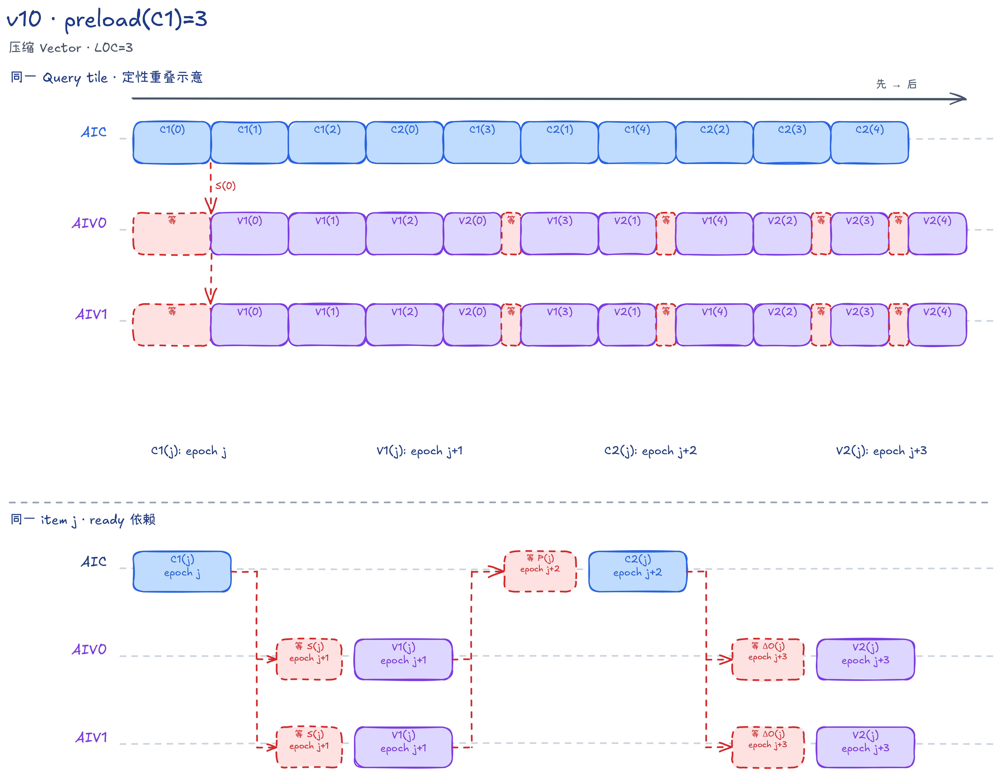
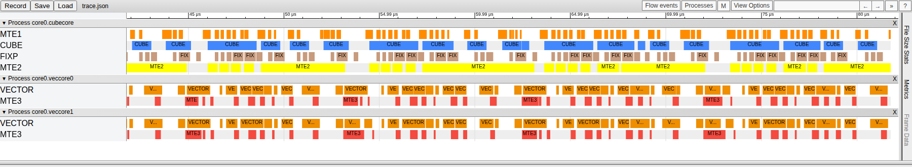

# FALite v10：三槽配置下的压缩 Vector 通路

## 本版内容

v10 保持 v08 的 `R=3,L0C=3` 和全部片上布局，只改写 AIV 的 Vector 通路：合并 Softmax 与 P 转换、缩短寄存器依赖链，并用首轮覆盖代替状态清零。

固定规格为 BF16 `Q/K/V/O [B,N,S,128]`、`Br=Bc=D=128`，`B/N/S` 为正整数，`S` 无需对齐；功能保证范围为 `B*N*S<=131072`。Kernel 固定发射同起点、等长度的方阵 causal 模板。共同公式与完整能力边界见[总文档](../../README.md#falite-样例定位)。

Host 计算 `tr=ceil(S/128)`、`numTasks=B*N*tr`。一个 Mix 组包含 1 AIC 和 2 AIV，按 `taskId=aicIdx+k*useAicNum` 遍历任务；`batchHeadIdx=taskId/tr`，Query tile 编号 `i=taskId%tr`，该 task 只处理 `j=0...i` 的 K/V item。`--core-num=0` 时采用设备核数，非零时采用合法请求值，再令 `useAicNum=min(numTasks,所选核数)`；请求超过设备核数时报错。

AIV0 负责 Query 行 0～63，AIV1 负责 64～127；两路状态独立，不相互归并。Q 和 OAcc/输出使用 task 双槽，`ioSlot` 从 0 开始，每处理一个本组 task 翻转一次，不是 `taskId%2`。

## 连续滚动的本核顺序

本版 `R=CV_PIPELINE_SLOT_NUM=3`、`L0C_DEPTH=L0C_QUEUE_DEPTH=3`。`epoch` 是每颗核心自己的循环编号，不是跨核共同时刻。AIC 每轮先 C1、后 C2；AIV 每轮先 V1、后 V2。仅当 item 存在时才发射：

```text
AIC 本地：
  epoch 0～1：依次 C1(0)～C1(1)
  epoch 2：C1(2) → C2(0)
  epoch 3：C1(3) → C2(1)
  一般轮 e：C1(e) → C2(e-2)

AIV 本地：
  epoch 0：无阶段
  epoch 1～2：依次 V1(0)～V1(1)
  epoch 3：V1(2) → V2(0)
  epoch 4：V1(3) → V2(1)
  一般轮 e：V1(e-1) → V2(e-3)
```

因此长 task 的首个 C2 前已发射 3 个 C1，首个 V2 前已发射 3 个 V1。发射不等于完成，AIC 与两路 AIV 分别在各自的 CrossCore 消费点等待数据。短 task 和排空时，越界项直接跳过。

### 槽位编号不能混用

| 编号 | 对应资源 | 轮转方式 |
| --- | --- | --- |
| `j%2` | K L1、S UB、DeltaO UB、PWork UB | 按 item 编号，task 内从 0 开始 |
| `j%3` | V L1、P L1、alpha UB | 保存跨 C1→C2、V1→V2 的 3 代数据 |
| `mmadOpIdx%2` | L0A/L0B | C1/C2 共用的矩阵乘发射总序号 |
| `mmadOpIdx%3` | L0C | 同一总序号，独立结果队列深度 |
| `ioSlot` | Q L1、OAcc/Output UB | 每个本组 task 翻转 0/1 |

`mmadOpIdx` 在 AIC task 循环之前初始化，每发射一个有效 C1 或 C2 才加一，跨 task 不清零。不能用 j 或 epoch 代替它选 L0 槽。

## CV 数据布局与核间同步

C1 执行 `K×Qᵀ`，Fixpipe 用 `dualDstCtl=2` 沿 Query 维切分分数，每路 AIV 收到 FP32 `Sᵀ[128 Key,64 Query]`。Vector 每个寄存器的 64 个通道对应 64 个 Query，沿 Key 循环求最大值和指数和。

V1 直接把未归一化的 Pᵀ 写成 BF16 NZ 分块布局。每路 PWork 有四个 16 Query 列分组，每组含 128 个 32 B 数据块和一个 32 B 填充块。`CopyPWorkToL1` 跳过填充，以 BF16 元素偏移 `(j%R)*16384+subAivIdx*8192` 写入共享 P L1；两半按 Query 维拼接，不求和。

C2 通过转置 LoadData 把 Pᵀ 装成 L0A 的 P，读取预取的 V 计算 `P×V`；Fixpipe 默认 `dualDstCtl=1` 按 Query 行切分，给每路 AIV FP32 `DeltaO[64,128]`。V2 更新 OAcc，task 最后才除以 l。S/P/DeltaO 均在片上交接，不申请 GM workspace。Host 在发射后返回，不在 `FlashAttnLiteNPU` 内等待 Kernel 完成；调用方须同步 stream 后再回读输出或释放输入输出，公共 demo 在调用后执行 `aclrtSynchronizeStream`。

### 就绪与归还

| 数据与 flag | flag ID | 就绪：Set → Wait | 归还：Set → Wait |
| --- | --- | --- | --- |
| S，S_HANDOFF | 0～1 | AIC PIPE_FIX → AIV PIPE_V | AIV PIPE_V → AIC PIPE_FIX |
| P，P_READY | 2～4 | AIV PIPE_MTE3 → AIC PIPE_MTE1 | 无独立 free |
| DeltaO，O_DELTA_HANDOFF | 5～6 | AIC PIPE_FIX → AIV PIPE_V | AIV PIPE_V → AIC PIPE_FIX |

S/DeltaO 的同一 flag ID 在两个方向分别表达 ready 和 free，不是为每槽另外分配两个 ID。两路 AIV 在 task 循环前各发一次两个 S free、两个 DeltaO free；AIC 每次 Fixpipe 写入前等 free，写完发 ready，AIV 消费后归还。真机 mode2 下，AIC 一次 Set 通知两路 AIV，反向 Wait 等两路都到达。仿真 mode4 封装分别处理两路，AIV1 的 flag ID 加 16。

P 不需要额外 free：同一 AIV 上，V2(j) 排在 V1(j+R) 之前，而 V2(j) 要等 C2(j) 已读 P 并产出 DeltaO。因此后续 V1 写入同一个 P 槽时，旧 P 已读完。alpha 也由 V2(j) 先读、V1(j+R) 后覆盖。这是本核顺序和跨核依赖组成的证明，不能仅凭不同核心的 epoch 数值大小判断完成先后。

## AIC：缓冲容量与所有权

| 资源 | 槽数 × 单槽容量 | Mutex ID | 保留到何时 |
| --- | --- | --- | --- |
| K L1 | 2 × 32 KiB | 0～1 | C1 的 MTE1 读完 K |
| V L1 | 3 × 32 KiB | 2～4 | 同 item 的 C2 MTE1 读完 V |
| Q L1 | 2 × 32 KiB | 5～6 | task 最后一个有效 C1 装完 Q |
| P L1 | 3 × 32 KiB | CrossCore 管理 | 同 item 的 C2 读完 P |
| L0A、L0B | 各 2 × 32 KiB | 7～8，每号联合管理 A/B | Mmad 读完该对输入 |
| L0C | 3 × 64 KiB | 9～11 | Fixpipe 读完该结果 |

L1 共 320 KiB，L0A/L0B 各 64 KiB，L0C 192 KiB。P 与 V 虽然都按 `j%3` 编号，仍位于不同物理地址。

### 装载、矩阵乘与写出

`CubeStage1` 先在 MTE2 上分别取得 K、V Mutex，依次搬入 K/V，并分别释放。MTE1 先装 Q 到 L0B，再取得 K Mutex、装 K 到 L0A 并归还 K。K 只保存到本次 C1 装载结束；V 的 MTE1 所有权到 C2 才取得，读取后归还。两者独立管理，不能照搬 v06 的“C1 持有联合 K/V Mutex 到 C2”。

Q 在首个 C1 取得 MTE1 所有权，在 `j+1==kvTileCount` 的末个 C1 装载后归还。`CubeStage2` 先在 MTE1 等 P_READY，再取得 L0AB，转置装 P，随后取得 V Mutex 并装 V 到 L0B。

每次矩阵乘后先归还 L0AB，再把 L0C 交给 Fixpipe。写出的精确顺序为：

```python
Lock(L0C[c], PIPE_FIX)
WaitAivToAic(PIPE_FIX, HANDOFF[s])   # 等两路 AIV 归还目标 UB 槽
FixpipeToVecUB(...)
SetAicToAiv(PIPE_FIX, HANDOFF[s])    # 通知结果就绪
Unlock(L0C[c], PIPE_FIX)
```

HANDOFF 在 C1 中指 S，在 C2 中指 DeltaO。先取得 L0C 再等 UB，才能在等待期间保住尚未写出的结果；不能把 Wait 移到 Lock 前。L0AB 与 L0C 分别释放，后续装载不必等整个写出结束；同槽下一次 Mmad 则必须等 Fixpipe 归还。

## AIV：压缩 Vector 与本地缓冲

每路 UB 共 225.5 KiB，两路配置相同但各自拥有独立状态和 Mutex。

| 资源 | 槽数 × 单槽容量 | 管理方式 |
| --- | --- | --- |
| S、DeltaO | 各 2 × 32 KiB | CrossCore ready/free 双向交接 |
| PWork | 2 × 16.125 KiB | Mutex 0/1：Vector 写 → MTE3 读 |
| OAcc/Output | 2 × 32 KiB，共址 | Mutex 2/3：Vector 累计并压缩 → MTE3 写 GM |
| m、l | 各 1 × 256 B | 每份 64 个 FP32，按 j 递推 |
| alpha | 3 × 256 B | 保存到对应 V2 |

`rowStatsUBElems=64` 表示一份行状态的元素数；alpha 的 LocalTensor 总长度为 `R*rowStatsUBElems=192`，单槽偏移仍是 `(j%R)*64`。不要把 rowStatsUBElems 当作 alpha 全部槽长度。

### V1：直接生成 P，首轮建立状态

`VectorStage1` 按 `j==0`、`j==i` 选择 `OnlineSoftmaxCastPackVF<IS_FIRST_ITER,APPLY_CAUSAL_MASK>`。该 VF 仍读 S 两遍，但第二遍的指数不再写回 FP32 S UB，而是直接 Cast/Pack 成 BF16 NZ PWork。

两遍都按四个 Key 行展开：四路 max/sum 寄存器各自累计，再两两合并。若 `validBc%4!=0`，余下 1～3 行由单行循环处理；随后把不存在的 Key 行对应 P 写零。对角 mask 在两遍和余数循环中都屏蔽 `keyLocal>queryLocal`，对应逻辑分数矩阵中 Query 行、Key 列的上三角；本路 queryLocal 从 `subAivIdx*64` 开始。

首个 V1 不读取旧 m/l，直接建立新状态，也不写 alpha；首个 V2 不读取 alpha，因此不需要补 `alpha=1`。后续 V1 写入 `alpha[j%R]`，并用 `MulDstAdd` 更新 l。task 开头没有 m/l/OAcc 的 Duplicate 初始化。

### V2 与最终输出

`VectorStage2` 令 `j==0` 走 `OnlineUpdateVF<true>`，直接把 DeltaO 复制为 OAcc。后续走 `OnlineUpdateVF<false>`，每次处理两个 Query 行，每行分两个 64 元素片段，用四组寄存器执行 `MulDstAdd`。所有 V2 都按 j 递增更新当前 OAcc[ioSlot]，并非按 R 维护多份输出状态。

Output Mutex 从 task 开头由 Vector 取得，到末尾 `FusedDivCastInplaceVF` 完成后才释放。该 VF 按行正序把 FP32 OAcc/l 压缩成同槽前半段的 BF16 输出，MTE3 再写 GM。两个物理输出槽的跨度都是 32 KiB；BF16 视图的元素偏移需要乘 2。下一 task 使用另一槽，隔一个 task 再用同槽时要等旧 MTE3 归还。

PWork 的交接更短：Vector 先 Lock PWork，再 Wait S；V1 后先发 S free，再 Unlock PWork；MTE3 取得 PWork、写共享 L1、归还 PWork，最后发 P_READY。S 的归还不需要等待 P 搬运，P_READY 却必须排在搬运之后。同号 AIV Mutex 只管理各自本核 UB。

## 调度伪代码

下面两段分别对应 AIC 与单路 AIV，不是一个共同的循环。Set/Wait 参数按 `(Pipe,flag)` 书写；`with mutex` 表示指定 Pipe 的 Lock/Unlock，不表示全核屏障。

```python
# AIC；R 和 L0C_DEPTH 取本版常量
io = 0
mmadOpIdx = 0
for taskId in range(aicIdx, numTasks, useAicNum):
    i = taskId % tr
    n = i + 1
    with mutex(Q[io], PIPE_MTE2):
        CopyGmToL1(Q[io], taskId)
    for epoch in range(n + R):
        if epoch < n:
            j = epoch
            ab, c = mmadOpIdx % 2, mmadOpIdx % L0C_DEPTH
            CubeStage1(j, kSlot=j%2, cvSlot=j%R, sSlot=j%2,
                       l0abSlot=ab, l0cSlot=c, ioSlot=io)
            # 函数内：首/末C1取得/归还Q；Mmad后按上节顺序交接S
            mmadOpIdx += 1
        j = epoch - R + 1
        if 0 <= j < n:
            ab, c = mmadOpIdx % 2, mmadOpIdx % L0C_DEPTH
            CubeStage2(cvSlot=j%R, oDeltaSlot=j%2, l0abSlot=ab, l0cSlot=c)
            # 函数内：Wait(MTE1,P_READY) → 装P/V → Mmad → 交接DeltaO
            mmadOpIdx += 1
    io ^= 1
for s in range(2):
    WaitAivToAic(PIPE_FIX, S_HANDOFF[s])       # 最后一次free
for s in range(2):
    WaitAivToAic(PIPE_FIX, O_DELTA_HANDOFF[s])

# 每路 AIV；初始free只在所有task之前发一次
for s in range(2):
    SetAivToAic(PIPE_V, S_HANDOFF[s])
for s in range(2):
    SetAivToAic(PIPE_V, O_DELTA_HANDOFF[s])
io = 0
for taskId in range(aicIdx, numTasks, useAicNum):
    i = taskId % tr
    n = i + 1
    Lock(Output[io], PIPE_V)                 # 不初始化m/l/OAcc
    for epoch in range(n + R):
        j = epoch - 1
        if 0 <= j < n:
            s, p = j % 2, j % R
            Lock(PWork[s], PIPE_V)
            WaitAicToAiv(PIPE_V, S_HANDOFF[s])
            VectorStage1(j, i, subAivIdx, alpha[p], PWork[s])
            SetAivToAic(PIPE_V, S_HANDOFF[s]) # V1读完即归还S
            Unlock(PWork[s], PIPE_V)
            with mutex(PWork[s], PIPE_MTE3):
                CopyPWorkToL1(P[p], PWork[s], subAivIdx)
            SetAivToAic(PIPE_MTE3, P_READY[p])
        j = epoch - R
        if 0 <= j < n:
            WaitAicToAiv(PIPE_V, O_DELTA_HANDOFF[j%2])
            VectorStage2(OAcc[io], DeltaO[j%2], alpha[j%R], j)
            SetAivToAic(PIPE_V, O_DELTA_HANDOFF[j%2])
    if outputRows > 0:
        FusedDivCastInplaceVF(OAcc[io], l, outputRows)
    Unlock(Output[io], PIPE_V)
    if outputRows > 0:
        with mutex(Output[io], PIPE_MTE3):
            DataCopy(O_GM, Output[io], outputRows * 128)
    io ^= 1
```

## 短 task、尾块与排空

本版没有双 item group，也没有奇数尾组专用分支。每个阶段各自检查 `0<=j<kvTileCount`；短 task 的首个 C2 前只有 `min(R,kvTileCount)` 个 C1。两核循环都执行 `kvTileCount+R` 轮，AIC 最后一个有效 C2 在 `kvTileCount+R-2`，AIV 最后一个 V2 在 `kvTileCount+R-1`。

`CopyGmToL1` 只读 Q/K/V 的有效行并补齐 L1；Cube 仍算完整 tile。V1 的 `validBc` 只限制有效 Key 行，并在输出 P 时清零其余行。V2 始终处理本路固定的 64 行，因此两 Query 行展开不需要因奇数有效输出行增加分支；最终归一化和 DataCopy 才按 `outputRows=clamp(qValidRows-subAivIdx*64,0,64)` 裁剪。

即使本路 outputRows=0，也要执行全部 V1/V2、交付半块 P、归还 S/DeltaO，最后释放 Output Mutex 并翻转 ioSlot；只跳过归一化和 GM 写回。下一 task 的 j 从 0 开始重新建立状态，但 `mmadOpIdx` 不清零，初始 free 也不重发。

AIC 退出前依次等待两个 S free 和两个 DeltaO free；从未用到的槽由最初的 free 配平，已用槽则由最后一个消费者归还。这个排空只确认中间 UB 槽归还，不能等同于最终输出的 MTE3 已完成。

## 从 v08 到 v10

[v08](../v08/README.md) 与 v10 的 Host、AIC、公共参数、槽位和 CrossCore 协议相同，只在 AIV 文件中改写 Vector 通路。因此三槽下的 Vector 对照是 v08→v10，不是 v09→v10。

改动包括：两次 V1 VF 合成 `OnlineSoftmaxCastPackVF`，四路 max/sum 累计，首轮不初始化 m/l/OAcc、不写 alpha，后续 l/OAcc 更新使用 `MulDstAdd`。输出布局、原地归一化和 task I/O 双槽不变。

[v11](../v11/README.md) 是 `R=4,L0C=4` 的压缩 Vector 配置。v10→v11 同时改变 R 与 L0C 深度，不能把差异只归因于 R；四槽下只改 Vector 的对照是 v09→v11。

## 流水示意与性能参考



示意图包含填充、滚动和排空，上半图展示允许的重叠，下半图展示同 item 的就绪依赖；省略反向归还和核内 Mutex。图中的 epoch 是本核循环编号，色块宽度不是实测耗时。



PipeTimeline 截图使用 `B=1,N=1,S=2048`、单 Mix 组，窗口为 `[41.778,81.778]` μs。

长序列统一口径下，本版 Task Duration 为 13399.552734 μs，因果有效 Cube MFU 为 75.9782%；条件及完整比较见[总文档性能表](../../README.md#统一性能结果)。

## 代码阅读入口

| 文件与函数 | 阅读重点 |
| --- | --- |
| [Host](host/flash_attn_lite_host.cpp)：`ComputeFlashAttnLiteTilingData` | task/核数、P/K/Q/V 的 L1 地址、UB 布局与容量检查 |
| [公共参数](flash_attn_lite_common.h) | `CV_PIPELINE_SLOT_NUM`、`DB_SLOT_NUM`、`L0C_QUEUE_DEPTH`；Addr 为字节、Elems 通常为全部槽元素数 |
| [Kernel 入口](kernel/flash_attn_lite_kernel.asc) | `InitSocState`、`__mix__(1,2)`、固定 causal 模板 |
| [AIC](kernel/falite_kernel_aic.h)：`KernelProcessForAIC` | 两阶段独立范围判断、`mmadOpIdx`、最后的四次 free 等待 |
| 同文件：`CubeStage1/2` | Q/K/V 装载、L0 Mutex、Fixpipe 的 Lock→Wait→写出→Set→Unlock |
| [AIV](kernel/falite_kernel_aiv.h)：`KernelProcessForAIV` | 初始 free、V1 先于 V2、PWork/Output 生命周期与零输出行分支 |
| 同文件：`OnlineSoftmaxCastPackVF`、`OnlineUpdateVF` | 四路寄存器链、余数循环、首轮不读旧状态和 alpha |
| 同文件：`CopyPWorkToL1`、`FusedDivCastInplaceVF` | NZ 填充跳过、两路 P 地址、OAcc 原地压缩 |
| [同步封装](kernel/falite_kernel_common.h) | HANDOFF/P_READY 编号、mode2 聚合与 mode4 双路封装 |

从仓库根目录可构建 `cmake --build build --target falite_v10 -j`，运行 `./build/Samples/2_Performance/flash_attn_lite_story/falite_v10 --core-num 1 --size 1 1 387`，覆盖不足 R 的短 task、首次 V/P/alpha 回卷及序列尾块。完整配置与精度标准见[编译、运行与复现](../../README.md#编译运行与复现)。
