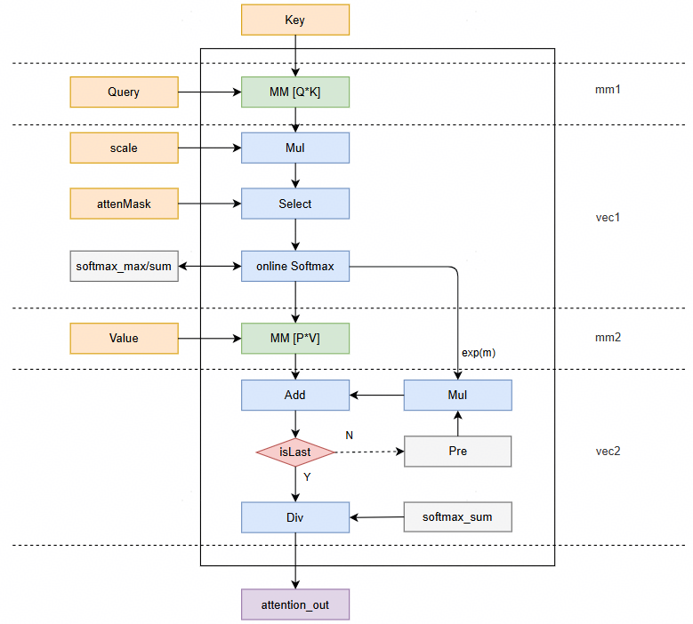
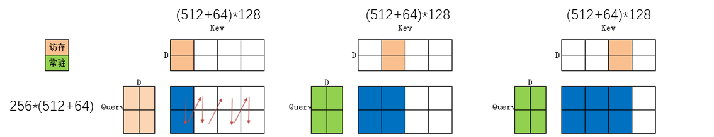
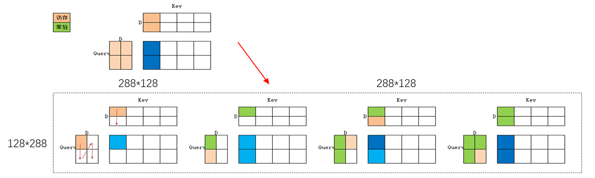
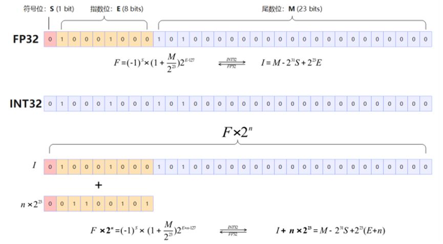
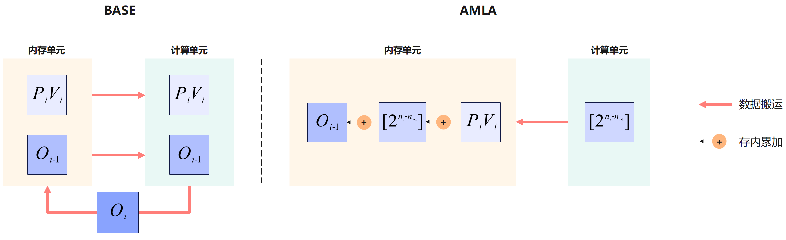
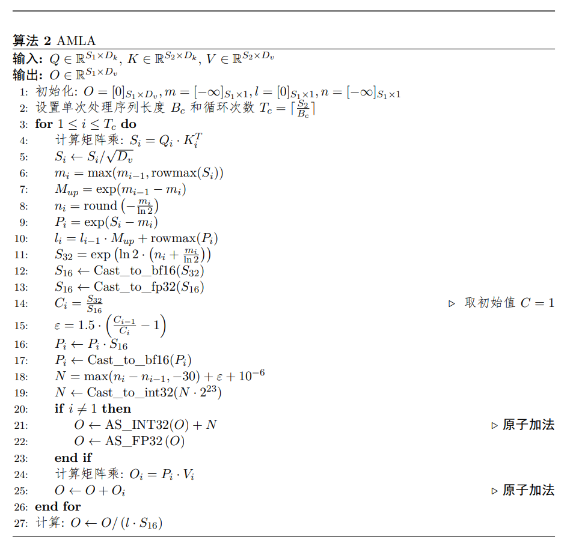
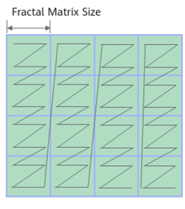
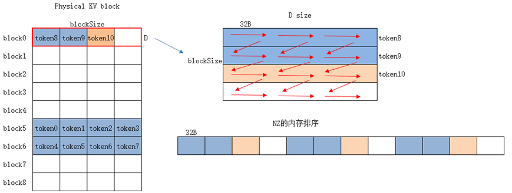

# FIA算子FP8 per-block全量化场景最佳优化实践

## 概述

本文档系统阐述**FIA**算子的实现原理、性能建模方法与优化实践，覆盖FP8 per-block全量化场景。

## 算子实现原理

### 算子功能说明

- **算子功能**  
self-attention（自注意力）利用输入样本自身的关系构建了一种注意力模型。其原理是假设有一个长度为$n$的输入样本序列$x$，$x$的每个元素都是一个$d$维向量，可以将每个$d$维向量看作一个token embedding，将这样一条序列经过3个权重矩阵变换得到3个维度为$n*d$的矩阵。

- **计算公式**  
self-attention的计算公式一般定义如下，其中$Q、K、V$为输入样本的重要属性元素，是输入样本经过空间变换得到，且可以统一到一个特征空间中。公式及算子名称中的"Attention"为"self-attention"的简写。

$$
Attention(Q,K,V)=Softmax(\frac{QK^T}{\sqrt{d}})V
$$

其中$Q$和$K^T$的乘积代表输入$x$的注意力，为避免该值变得过大，通常除以$d$的开根号进行缩放，并对每行进行softmax归一化，与$V$相乘后得到一个$n*d$的矩阵。全量化场景，上述公式中的Q、K、V分别表示已经完成反量化的矩阵,即Q=query * dequant_scale_query，K=key * dequant_scale_key,V=value * dequant_scale_value。

**说明**：
<blockquote>query、key、value数据排布格式支持从多种维度解读，其中B（Batch）表示输入样本批量大小、S（Seq-Length）表示输入样本序列长度、H（Head-Size）表示隐藏层的大小、N（Head-Num）表示多头数、D（Head-Dim）表示隐藏层最小的单元尺寸，且满足D=H/N、T表示所有Batch输入样本序列长度的累加和。
<br>Q_S表示query shape中的S，KV_S表示key和value shape中的S，Q_N表示num_query_heads，KV_N表示num_key_value_heads。dequant_scale_key表示key的per-block反量化参数；dequant_scale_value表示value的per-block反量化参数；dequant_scale_query表示query的per-block反量化参数。P表示Softmax(<span>(QK<sup class="superscript">T</sup>) / <span class="sqrt">d</span></span>)的计算结果。</blockquote>

#### MXFP8参数说明

| **变量名** | **描述**          | **Dtype**     | **Layout** | **Shape**                                      |
| ------- | --------------- | ------------- | ---------- | -------------------------------------------------- |
| query       | 公式中的输入Q | `FLOAT8_E4M3FN` | ND         | `(B,N1,S1,D)`                           |
| key       | 公式中的输入K | `FLOAT8_E4M3FN` | ND         | `(B,N2,S2,D)`                                     |
| value  | 公式中的输入V | `FLOAT8_E4M3FN` | ND         | `(B,N2,S2,D)` |
| dequant_scale_key  | 表示key的反量化因子 | `FLOAT32` | ND         | `(B,N2,Ceil(S2/256),1)`                            |
| dequant_scale_value       | 表示value的反量化因子              | `FLOAT32`    | ND         | `(B,N2,Ceil(S2/256),1)`                                      |
| dequant_scale_query       | 表示query的反量化因子 | `FLOAT32` | ND         |   `(B,N1,Ceil(S1/128),1)`                        |
| num_query_heads       | query的head个数 | `INT64` | NA         | NA                           |
| softmax_scale       | 公式中d开根号的倒数 | `DOUBLE` | NA         | NA                           |
| input_layout       | 标识输入query、key、value的数据排布格式 | `STRING` | NA         | NA                           |
| num_key_value_heads       | key、value中head个数 | `INT64` | NA         | NA                           |
| query_quant_mode       | query反量化的模式 | `INT64` | NA         | NA                        |
| key_quant_mode       | key反量化的模式 | `INT64` | NA         | NA                          |
| value_quant_mode       | value反量化的模式 | `INT64` | NA         | NA                          |
| inner_precise       | 表示高精度或者高性能选择 | `BOOL` | NA         | NA                     |
| return_softmax_lse       | 是否输出softmax_lse | `BOOL` | NA         | NA                         |
| query_dtype       | 用于在PTA接口中指定query的dtype | FP8 per-block全量化场景支持`FLOAT8_E4M3FN` | NA       | NA                          |
| key_dtype       | 用于在PTA接口中指定key的dtype | FP8 per-block全量化场景支持`FLOAT8_E4M3FN` | NA         | NA                           |
| value_dtype       | 用于在PTA接口中指定value的dtype | FP8 per-block全量化场景支持`FLOAT8_E4M3FN` | NA         | NA                          |
| attentionOut       | 公式中的输出 | `FLOAT16` | ND         | `(B,N1,S1,D)`                          |


### 算子实现说明
FIA算子实现流程图如下。其中query、key、value表示已经完成反量化的矩阵。
  <div align="center">
    
  </div>


## 算子性能建模

### 性能瓶颈分析

#### FIA算子的性能瓶颈分析

FIA算子的性能瓶颈主要分为以下三类。

1. **CUBE Bound**：算子性能受限于硬件的Cube算力规格，本身已经实现连续的MMAD计算。在prefill场景意味着算子性能已经最优，但需要重点关注**多核计算负载是否均衡**，避免出现单核Cube Bound，但整体Cube利用率偏低的情况。

2. **Memory Bound**：算子性能受限于数据搬运能力，主要的性能优化手段是减少搬运量、提高带宽利用率或者将低带宽的搬运转换成高带宽的搬运，进而发挥算子极致性能。因Bound在不同的流水上而区分出**MTE2 Bound**、**MTE1 Bound**以及**FIXPIPE Bound**。在decode场景Memory Bound意味着算子性能已经接近最优，但是但需要重点关注带宽是否打满。

3. **Vector Bound**：算子性能受限于硬件的vector算力规格，本身已经实现连续的vector计算。这种场景需要通过DN方案提高vetor指令并行度，或者调大FIA算子的基本块的N轴从而减少update次数，或者采用近似计算（使用FP16计算softmax），或基于AMLA优化Vector计算。

### FIA算子性能建模公式

**1. MMAD计算时间**

$$
T_{cube} = \frac{2 \times M \times K \times N}{16 \times C0 \times 16 \times 核数 \times 频率}
$$

其中`16 × C0 × 16`表示MX量化在Cube核上每拍的计算量。

**2. MTE2搬运时间**

MTE2的搬运量包含了因切分带来的的重复搬运，暂不考虑Scale的搬运：

$$
T_{mte2} = \frac{(M  + 2 \times N ) \times K \times (1 \times sizeof(dtype))}{BandWidth_{mte2}}
$$

MTE2的综合带宽包含DDR带宽和L2带宽的共同作用，可简化为：

$$
T_{mte2} \approx \frac{Size_{DDR}}{BandWidth_{DDR}} + \frac{Size_{L2}}{BandWidth_{L2}}
$$

由于左矩阵复用，在单基本块视角，可以忽略query的搬运耗时，仅考虑key、value的搬运耗时（即仅考虑N * K相关耗时，忽略M * K相关耗时）。

**3. FIXPIPE搬出时间**

$$
T_{fixp} = \frac{M \times N \times sizeof(dtype)}{BandWidth_{fixp}} + \frac{M \times D \times sizeof(dtype)}{BandWidth_{fixp}}
$$

**4. VECTOR计算时间**
采用实测方式统计vector耗时。

### 优化目标

使VECTOR、MMAD、MTE2、MTE1、FIXPIPE尽量匹配，避免单一流水过长；prefill场景实现VECTOR bound, decode场景实现MTE2 bound并打满带宽；不同核之间耗时尽可能接近，提高多核利用率。

## 算子优化实践

本章介绍FIA算子中应用的优化措施，包括通用的指令并行度优化和多核利用率优化，以及针对不同的Bound类型场景分别提供搬运效率优化、计算效率优化方法。

### 多核负载均衡
Decode阶段， KV Cache在不同Batch上缓存的历史Key/Value的数据量可能不相同，FA算子批量进行Flash-Attention计算时，不同Batch的计算耗时也不相同。FA根据实际Key/Value数据量大小（actual-sequence），对每个Batch上的计算量（耗时）进行评估。之后按Tiling块粒度，将每个Tiling块的计算均摊到多个核上并行计算，充分发挥算力。
  <div align="center">
    
  </div>
该方案称为负载均衡，部分Batch的计算会分到不同核上（例如图中的batch2）。该场景下，FA算子会利用Flash-Decoding算法，对分配在不同核上的计算进行Flash-Decoding归约处理。

负载均衡方案的关键步骤如下：

针对每个输入Batch，先执行数据Tiling切分（将单Batch拆解为若干连续的Tiling块），再对每个Tiling块的计算耗时进行预估值计算。 预估规则：Tiling块的计算耗时与该块的Query（Q）数据量、Key/Value（KV）数据量呈正相关，基于计算数据的拟合模型输出每个 Tiling块的耗时预估值（记为Tᵢ，i为Tiling块序号）。

将所有Tiling块分配至N个计算核上，使得各核累计计算耗时尽可能接近全局平均值，同时保持Tiling块的连续分配。具体分配流程如下：

step1：计算所有Tiling块的总预估耗时（T_total = ΣTᵢ），初始化0核上的初始期望负载：

T_target(0)=T_total/N

step2：对当前待分配的核，依次将Tiling块加入其任务队列。

若某个Batch内所有Tiling块的总预估耗时T_batch ≤ T_target，则将整个Batch分配至当前核，跳过逐块遍历，提升分配效率。

在每个核最后一块的判断上，设T_accumulated为该核已分配的Tiling块预估耗时之和，若第j个Tiling块为最后一块，满足：

T_accumulated+(Tj/2)≤T_target
此条件引入了冗余度，确保在实现负载均衡的同时，避免因单个Tiling块耗时略超预期而未被分配，导致后续核的任务越来越重。

step3：每当一个核完成分配后，剩余未分配Tiling块的总耗时（T_remain）与剩余核数（N_remain）用于更新下一个核（k）的目标负载：

T_target(k)=T_remain/N_remain

此动态调整机制可有效应对早期分配偏差，提升整体均衡性。

step4：重复step2、step3操作，直到最后一个核放入所有Tiling块，结束分配。

负载均衡方案的核心流程如下：
  <div align="center">
    
  </div>

负载均衡的伪代码实现如下：
 ```cpp
MaxCost = Inf
for CoreUsePlan ← MinCore.MaxCore do
    UnDistributedCost ← CostAll
    LoadIdx = 0
    CurMaxCost = 0
    for i ← 0, CoreUsePlan - 1 do:
        CostLimit = UnDistributedLoad/(CoreUsePlan-i)
        CoreLoad(i) = 0
        CoreCost(i) = 0
        for j ← LoadIdx, TotalLoad - 1 do:
            LoadCost(j) = BasicAveCost(M(j), basicS2(j))
            if CoreCost(i) + LoadCost(j) * 0.5 < CostLimit:
                CoreLoad(i) = CoreLoad(i) + 1
                CoreCost(i) = CoreCost(i) + LoadCost(j)                
                CurMaxCost = max(CurMaxCost, CoreCost(i))
                UnDistributedLoad = UnDistributedLoad - CoreLoad(i)
            else:
                LoadIdx = j
                break
    if CurMaxCost + CoreUsePlan < MaxCost:
        Update Plan: MaxCost = CurMaxCost + CoreUsePlan

```

理论最大收益的计算：

假设23个核分配了n个最小块（minBasic），1个核分配n个最大块（maxBasic），此时的计算耗时为A：

A=maxBasic∗n

因受慢核影响，如果负载均匀分配，即(maxBasic*n-minBasic*n)的负载量均匀分配给24个核，此时的计算耗时为B：

B=minBasic∗n+(maxBasic∗n−minBasic∗n)/24

那么节省的时间为C=A-B

C=maxBasic∗n−minBasic∗n−(maxBasic∗n−minBasic∗n)/24=((maxBasic−minBasic)∗23n)/24

均衡后的收益率为D=C/A

D=((maxBasic−minBasic)∗23n)/24÷(maxBasic∗n)×100%

根据实测，maxBasic可为13.9us、minBasic可为2.4us，此时D约为79%。


### 计算效率优化

#### Cube/Vector核间流水并行
FA算子涉及Cube和Vector计算，通过合理排布Cube、Vector核间流水，实现核并行工作。具体来说，调整切块后mm1、vec1、mm2、vec2的执行顺序，将没有数据依赖的mm计算提前执行，从而使得没有数据依赖关系的Cube计算和Vector计算能够并行执行。

下图为FA算子未排布Cueb、Vector核间流水时，Cube与Vector核上的执行示意图。
  <div align="center">
    
  </div>
可以发现FA的四阶段计算（mm1、vec1、mm2、vec2）为串行执行，这样会导致Cube核在执行时Vector核空闲，而Vector核执行时Cube核空闲，从而导致Cube或Vector核利用率非常低下。

根据FA四阶段计算中执行依赖关系：

① 相同轮次的mm1、vec1、mm2、vec2必须顺序执行；

② 不同轮次之间的vec1顺序执行；

③ 不同轮次之间的vec2顺序执行。

可以通过错位计算轮次，使得非同一轮次的mm1与vec1并行执行，非同一轮次的mm1与vec2并行执行，非同一轮次的mm2与vec1并行执行，非同一轮次的mm2与vec2并行执行。
  <div align="center">
    
  </div>
流水代码执行如下图所示：
  <div align="center">
    
  </div>

 ```cpp
Loop1：触发第一轮的mm1
Loop2：触发第二轮的mm1、第一轮的vec1、第一轮的mm2
Loop3：触发第三轮的mm1、第二轮的vec1、第二轮的mm2、第一轮的vec2
Loop4：               第三轮的vec1、第三轮的mm2、第二轮的vec2
Loop5：                                       第三轮的vec2

```
核间流水排布的伪代码如下：
 ```cpp
static constexpr uint32_t FIA_PRELOAD_TASK_CACHE_SIZE = 3;
for (B、N、S1、S2):
    RunInfo &extraInfo0 = extraInfo[loop % FIA_PRELOAD_TASK_CACHE_SIZE];       // 本轮任务
    RunInfo &extraInfo2 = extraInfo[(loop + 2) % FIA_PRELOAD_TASK_CACHE_SIZE]; // 上一轮任务
    RunInfo &extraInfo1 = extraInfo[(loop + 1) % FIA_PRELOAD_TASK_CACHE_SIZE]; // 上两轮任务
    if (extraInfo0.isValid) {
        if ASCEND_IS_AIC {
            ComputeMm1(extraInfo0);
        }
    }
    if (extraInfo2.isValid) {
        if ASCEND_IS_AIV {
            ComputeVec1(extraInfo2);
        }
        if ASCEND_IS_AIC {
            ComputeMm2(extraInfo2);
        }
    }
    if (extraInfo1.isValid) {
        if ASCEND_IS_AIV {
            ComputeVec2(extraInfo1);
        }
        extraInfo1.isValid = false;
    }

```

#### Cube核内流水并行（GQA）
FA-GQA场景下，构建Cube核内pipeline流水，提高访存和计算并行效率，具体流程如下。

1、在N轴、M轴循环遍历时：

Query常驻L1，只在nLoop为0时，将Query从GM拷入L1，减少Query的访存；

Query在L1上的buffer设计为双buffer，使得n、m循环当前轮的MTE1（QueryL1 copy to L0A）能与下一轮的MTE2（QueryGm copy to KeyL1）并行执行；

Key在L1上的buffer设计为乒乓buffer，使得n、m循环当前轮的MTE1（KeyL1 copy to L0B）能与下一轮的MTE2（KeyGm copy to KeyL1）并行执行；
  <div align="center">
    
  </div>

2、在K轴循环遍历时：
L0A、L0B的设计为乒乓buffer，使得k循环当前轮的MMAD（L0A*L0B）能与下一轮的MTE1（QueryL1 copy to L0A 和 KeyL1 copy to L0B）并行执行；
  <div align="center">
    
  </div>

mm1计算的伪代码如下：
```cpp
// Tiling块大小
SingleN=512
SingleM=256
SingleK=256
N_BASE=128
M_BASE=128
K_BASE=128

for nLoop:SingleN/N_BASE:
    WaitFlag<HardEvent::MTE1_MTE2>(KV_EVENT0 + kvBufId);
    CopyKeyToL1(L1KeyBufferDb[kvBufId % 2], GmKey) 
    SetFlag<HardEvent::MTE2_MTE1>(KV_EVENT0 + kvBufId);
    WaitFlag<HardEvent::MTE2_MTE1>(KV_EVENT0 + kvBufId);

    for mLoop:SingleM/M_BASE:
        if (nloop is first) {
            WaitFlag<HardEvent::MTE1_MTE2>(QP_EVENT0 + mLoop);            
            CopyQGmToL1(L1Query[mLoop], GmQuery)  
            SetFlag<HardEvent::MTE2_MTE1>(QP_EVENT0 + mLoop);
            WaitFlag<HardEvent::MTE2_MTE1>(QP_EVENT0 + mLoop);
        }

        WaitFlag<HardEvent::FIX_M>(L0C_EVENT0 + l0cBufId);
        for kLoop:SingleK/K_BASE:
             WaitFlag<HardEvent::M_MTE1>(L0AB_EVENT0 + l0abBufId);   
             LoadDataToL0A(L0ABufferDb[l0abBufId], L1Query[m])               // Query L1 to L0A
             LoadDataToLoB(L0BBufferDb[l0abBufId], L1KeyBufferDb[kvBufId])   // Key L1 to L0B
             SetFlag<HardEvent::MTE1_M>(L0AB_EVENT0 + l0abBufId);
             WaitFlag<HardEvent::MTE1_M>(L0AB_EVENT0 + l0abBufId);
             Mmad(L0CBufferDb[l0cBufId % 2], L0ABufferDb[l0abBufId], L0BBufferDb[l0abBufId])                     
             SetFlag<HardEvent::M_MTE1>(L0AB_EVENT0 + l0abBufId);
             l0abBufId = (l0abBufId + 1) % 2;
        SetFlag<HardEvent::M_FIX>(L0C_EVENT0 + l0cBufId);
        WaitFlag<HardEvent::M_FIX>(L0C_EVENT0 + l0cBufId);
        Fixpipe(GM, L0CBufferDb[l0cBufId])   // L0C to GM   
        SetFlag<HardEvent::FIX_M>(L0C_EVENT0 + l0cBufId); 
        l0cBufId = (l0cBufId + 1) % 2;         
       
        if (nloop is last) {
            SetFlag<HardEvent::MTE1_MTE2>(QP_EVENT0 + mLoop);
        }

    SetFlag<HardEvent::MTE1_MTE2>(KV_EVENT0 + kvBufId);
    kvBufId = (kvBufId + 1) % 2;                                     第三轮的vec2

```


#### Cube核内流水并行（MLA）
FA-MLA场景下，构建Cube核内pipeline流水，提高访存和计算并行效率，同时数据在L1上的常驻减少了访存开销。
  <div align="center">
    
  </div>

在单个Tiling块计算过程中，Q+Qr的Tiling块大小为256 * 576，K+Kr的Tiling块大小为576 * 512。计算时，将Q+Qr的数据(256 * 576)常驻内存，并将K+Kr按N轴切成4个基本块(576 * 128)，分别与常驻在内存中的Query做矩阵乘，以减少Query数据的重复搬入。
  <div align="center">
    
  </div>
在对Q+Qr与K+Kr进行基本计算时，将Q+Qr按M轴和K轴均对半切的方式切成128 * 288大小，将K+Kr按K轴对半切的方式切成288 * 128大小，并且调整矩阵乘法的遍历顺序，先遍历M轴，再遍历K轴，使切块后的Key能做一个小常驻，减少Key数据的重复搬入。

Q和K相乘的mm1伪代码如下所示：
```cpp
// L1空间
// QP: 4*72K
__CBuffer__ L1QP[4] = {L1_0_0, L1_0_1, L1_0_2, L1_0_3}
// KV: 3*72K
__CBuffer__ L1KV[3] = {L1_1_0, L1_1_1, L1_1_2}
// MTE2到MTE1的同步ID
__EVENT_ID__ mte21QPIds[4] = {EVENTID_0, EVENTID_1, EVENTID_2, EVENTID_3}
__EVENT_ID__ mte21KVIds[3] = {EVENTID_4, EVENTID_5, EVENTID_6}
// MTE1到MTE2的同步ID
__EVENT_ID__ mte12QPIds[4] = {EVENTID_0, EVENTID_1, EVENTID_2, EVENTID_3}
__EVENT_ID__ mte12KVIds[3] = {EVENTID_4, EVENTID_5, EVENTID_6}
iQP, iKV = -1, -1
// 非MTE2相关的同步比较简单，伪码中省略
mm1() {
    # L1.tiling: m=128, n=128, k=288
    # L0.tiling: m=128, n=128, k=96
    for i.1m in m.l1:
        for i.1n in n.l1:
            for i.1k in k.l1:
                if i.1n == 0:
                    if i.1k == 0:
                        iQP++
                        iQPn = iQP + 1
                        wait(mte1->mte2, mte12Ids[iQP%4])
                        wait(mte1->mte2, mte12Ids[iQPn%4])                            
                        copyA(dst=L1[iQP%4], src=Qnope, size=(128, 256))
                        copyA(dst=L1[iQPn%4], src=Qrope, size=(128, 64))
                    else:
                        iQP++
                        copyA(dst=L1[iQP%4], src=Qnope, size=(128, 256))
                    set(mte2->mte1, mte21Ids[iQP%4])
                    wait(mte2->mte1, mte21Ids[iQP%4])
                    ka = iQP
                else:
                    ka = iQP - (1 - i.1k)

                if i.1m == 0 || i.1n > 0 :
                    iKV++
                    wait(mte1->mte2, mte12Ids[iKV%3])
                    copyB(dst=L1[iKV%3], src=Knope/Krope, size=(128, 288), step=i.1n%2 ? -1 : 1)
                    set(mte2->mte1, mte21Ids[iKV%3])
                    wait(mte2->mte1, mte21Ids[iKV%3])
                    kb = iKV
                else:
                    kb = iKV - (1 - i.1k)
                for i.0k in k.l0:
                    loadA(src=L1[ka%4], size=(128, 96))
                    loadB(src=L1[kb%3], size=(128, 96))
                    mmad()
                if isLastLoop(i.1n):
                    set(mte1->mte2, mte12Ids[iQP%4])
                if isNotLastLoop(i.1n) OR (isLastLoop(i.1n) AND isLastLoop(i.1m)):
                    set(mte1->mte2, mte12Ids[iKV%3])
            fixp()
}        
```
QK的结果和V相乘的mm2如下所示：
```cpp
// L1空间
// QP: 4*72K
__CBuffer__ L1QP[4] = {L1_0_0, L1_0_1, L1_0_2, L1_0_3}
// KV: 3*72K
__CBuffer__ L1KV[3] = {L1_1_0, L1_1_1, L1_1_2}
// MTE2到MTE1的同步ID
__EVENT_ID__ mte21QPIds[4] = {EVENTID_0, EVENTID_1, EVENTID_2, EVENTID_3}
__EVENT_ID__ mte21KVIds[3] = {EVENTID_4, EVENTID_5, EVENTID_6}
// MTE1到MTE2的同步ID
__EVENT_ID__ mte12QPIds[4] = {EVENTID_0, EVENTID_1, EVENTID_2, EVENTID_3}
__EVENT_ID__ mte12KVIds[3] = {EVENTID_4, EVENTID_5, EVENTID_6}
iQP, iKV = -1, -1
// 非MTE2相关的同步比较简单，伪码中省略
mm2() {
    // L1.tiling: m=128, n=128, k=256
    // L0.tiling: m=128, n=128, k=128
    for i.1n in n.l1:
        for i.1m in m.l1:
            for i.1k in k.l1:
                if i.1n == 0:
                    iQP++
                    wait(mte1->mte2, mte12Ids[iQP%4])
                    copyB(dst=L1[iQP%4], src=P, size=(128, 256))
                    set(mte2->mte1, mte21Ids[iQP])
                    wait(mte2->mte1, mte21Ids[iQP])
                    kb = iQP
                else:
                    kb = iQP - (1 - i.1k)

                if i.1m == 0 || i.1n > 0 :
                    iKV++
                    wait(mte1->mte2, mte12Ids[iKV%3])
                    copyA(dst=L1[iKV%3], src=V, size=(128, 256), step=i.1n%2 ? -1 : 1)
                    set(mte2->mte1, mte21Ids[iKV%3])
                    wait(mte2->mte1, mte21Ids[iKV%3])
                    ka = iKV
                else:
                    ka = iKV - (1 - i.1k)
                for i.0k in k.l0:
                    loadA(src=L1[ka%3], size=(128, 128))
                    loadB(src=L1[kb%4], size=(128, 128))
                    mmad()
                if isLastLoop(i.1n):
                    set(mte1->mte2, mte12Ids[iQP%4])
                if isNotLastLoop(i.1n) OR (isLastLoop(i.1n) AND isLastLoop(i.1m)):
                    set(mte1->mte2, mte12Ids[iKV%3])

            fixp()
}        
```

#### 基于AMLA优化Vector计算
从数学角度分析MLA计算流程中的online softmax计算过程，通过数学等价变换、以加代乘技术优化硬件计算流程，实现了以加代乘的AMLA（Ascend-MLA）算法，详细论文可参考AMLA: MUL by ADD in FlashAttention Rescaling。AMLA算法利用了浮点数的性质以及浮点数乘法与整数加法的等价变换。
  <div align="center">
    
  </div>

AMLA算法将online softmax中exp相关运算变换为整数加的形式，并利用NPU原子累加操作完成Update(O)，避免存储在HBM上的中间变量（O）搬入到核内（计算单元）做乘法计算。
  <div align="center">
    
  </div>
FA算子采用AMLA算法，消除了online softmax计算过程中需要存储在HBM上的中间变量（O）的搬入搬出，有效节约了Update(O)过程中的访存开销。

详细算法流程如下：
  <div align="center">
    
  </div>


### 搬运效率优化

#### NZ格式提升访存效率
NZ数据格式是一种专为提升计算性能而设计的特殊数据排布格式，在昇腾产品中广泛应用，以便最大化发挥Cube计算单元的性能潜力，从而在矩阵乘法中实现更高的计算效率。
  <div align="center">
    
  </div>
FA算子支持读取离散存储的KV Cache，即支持Paged Attention能力，并在此基础上支持按NZ格式读取Key/Value数据。
  <div align="center">
    
  </div>
FA算子直接按NZ格式将Key、Value数据从HBM读取到Cube计算单元里的内存，避免访存过程中ND、NZ数据格式的转换，从而提升FA算子的访存效率。
KV Cache为Paged离散访存时，将Key、Value从Global Memeory拷入到L1的代码如下：

```cpp
__aicore__ inline void ProcessPageAttention(FaL1Tensor<KV_T, L1_FORMAT> &dstTensor,
                                                FaGmTensor<KV_T, GM_FORMAT> &srcTensor,
                                                GmKvCoord &gmCoord)
    {
        OffsetCalculator<GM_FORMAT> &offsetCalculator = srcTensor.offsetCalculator;
        uint32_t curS2Idx = gmCoord.s2Idx;
        uint32_t copyFinishRowCnt = 0;
        uint32_t blockElementCnt = 32 / sizeof(KV_T);
        if constexpr (IsSameType<KV_T, int4b_t>::value) {
            blockElementCnt = 64; // int4b时32B可以存64个元素
        }
        while (copyFinishRowCnt < gmCoord.s2DealSize) {
            // 获取需要拷贝的行数
            uint32_t copyRowCnt = offsetCalculator.GetBlockSize() - curS2Idx % offsetCalculator.GetBlockSize();
            if (copyFinishRowCnt + copyRowCnt > gmCoord.s2DealSize) {
                copyRowCnt = gmCoord.s2DealSize - copyFinishRowCnt;  //一个block未拷满
            }
            // 计算offset
            uint64_t gmOffset = offsetCalculator.GetOffset(gmCoord.bIdx, gmCoord.n2Idx, curS2Idx, gmCoord.dIdx);
            uint64_t l1Offset = copyFinishRowCnt * blockElementCnt;
            // 拷贝数据
            if constexpr (GM_FORMAT == GmFormat::PA_NZ) {
                DataCopyParams intriParams;
                intriParams.blockCount = gmCoord.dDealSize / blockElementCnt;
                intriParams.blockLen = copyRowCnt;
                intriParams.dstStride =  dstTensor.rowCount - copyRowCnt;
                intriParams.srcStride = offsetCalculator.GetBlockSize() - copyRowCnt;
                DataCopy(dstTensor.tensor[l1Offset], srcTensor.gmTensor[gmOffset], intriParams);
            } else {
                CopySingleMatrixNDToNZ(dstTensor.tensor[l1Offset], srcTensor.gmTensor[gmOffset], copyRowCnt,
                                       gmCoord.dDealSize, offsetCalculator.GetStrideBlockSize(), dstTensor.rowCount);
            }
            // 更新完成拷贝的行数和s2Idx
            copyFinishRowCnt += copyRowCnt;
            curS2Idx += copyRowCnt;
        }
    }        
```

当GM_FORMAT == GmFormat::PA_NZ时，直接通过DataCopy将Key、Value数据拷入到L1，避免了ND转NZ格式的操作。

#### Scale全载以打满带宽优化

- **原理介绍**

  Scale部分的数据量仅为输入矩阵的1 /（128 * D）或者1 /（256 * D），当输入矩阵较小时，所需Scale数据量急剧减小，无法充分发挥带宽性能，导致Scale搬运带宽利用率显著降低。

  可利用L1剩余空间，提前载入后续所需Scale并在L1上缓存，从而减少Scale搬运次数，缓解因单次所需Scale数据量过小导致的带宽速率降低问题。

- **效果对比**

  <div align="center">
    
  </div>

- **适用场景**
  - 输入矩阵较小，Scale数据量不足的场景
  - MTE2带宽利用率受Scale搬运限制的场景
  - L1缓冲区有充足剩余空间的场景

#### Double Buffer（双缓冲）

- **原理介绍**

  Double Buffer使用两个缓冲区交替工作：一个缓冲区用于当前计算，另一个并行准备下一轮数据。通过计算与数据加载/准备的重叠，隐藏内存访问延迟，减少流水线停顿，提高算子吞吐量。

- **效果对比**

  下图展示了L1,L0A,L0B使能Double Buffer后流水图的预期变化，从而有效提升不同流水间的并行度。

  <div align="center">
    
  </div>

- **适用场景**
  - 存在流水停顿的场景
  - 内存访问延迟成为瓶颈的场景
  - L1或L0缓冲区空间充足的场景


## 优化策略选择指南

### 根据 Bound 类型选择优化策略


| **Bound类型**   | **推荐优化策略**       | **优先级**                                |
| ------------- | ----------------------- | ----------------------------------------- |
| CUBE Bound    | 多核负载均衡、Cube核内流水并行、      | 高                 |
| VECTOR Bound    | Cube/Vector核间流水并行、基于AMLA优化Vector计算            | 高                 |
| MTE2 Bound    | Scale全载以打满带宽优化、NZ格式提升访存效率                     | 高   |
| MTE1 Bound    | L1 Bank 冲突优化                | 中                                                |
| FIXPIPE Bound | 基本块N轴调大                        | 中                                 |
| 流水停顿       | Double Buffer                  | 高 |

## 性能调优实践步骤

1. **性能分析**：使用Profiling工具结合性能建模分析当前算子的Bound类型
2. **瓶颈识别**：确定主要的性能瓶颈所在
3. **策略选择**：根据Bound类型选择合适的优化策略
4. **参数调优**：调整tiling参数，优化缓冲区使用
5. **效果验证**：对比优化前后的性能数据
6. **迭代优化**：根据结果进一步调整优化策略

## 总结

FIA算子的性能优化不仅要考虑优化核内流水的性能，还要考虑核间的负载均衡，同时根据性能建模及bound类型选择合适的优化策略。