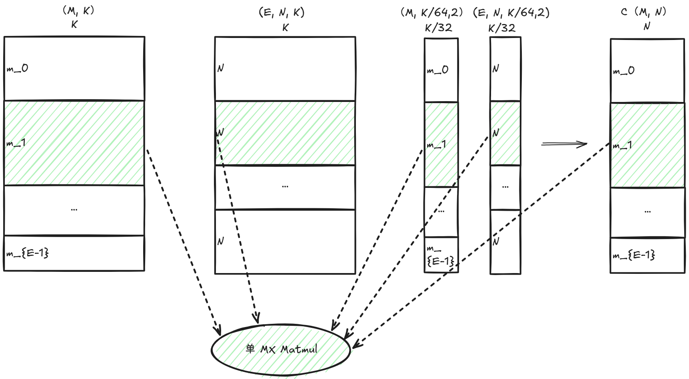
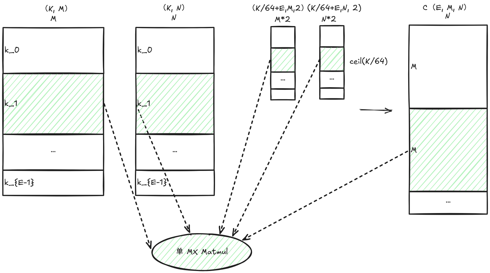
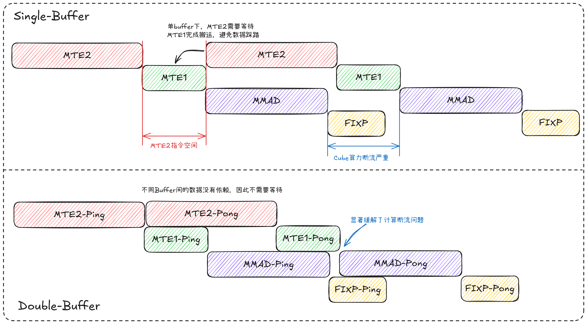
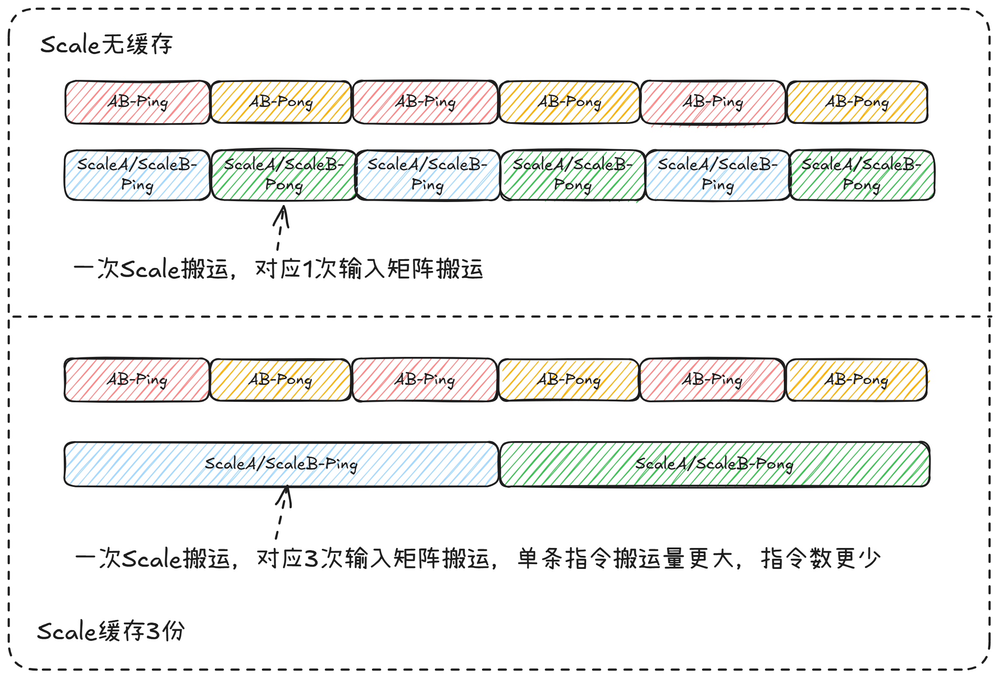
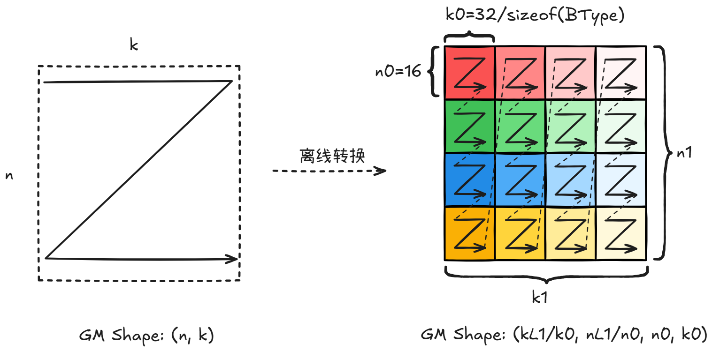
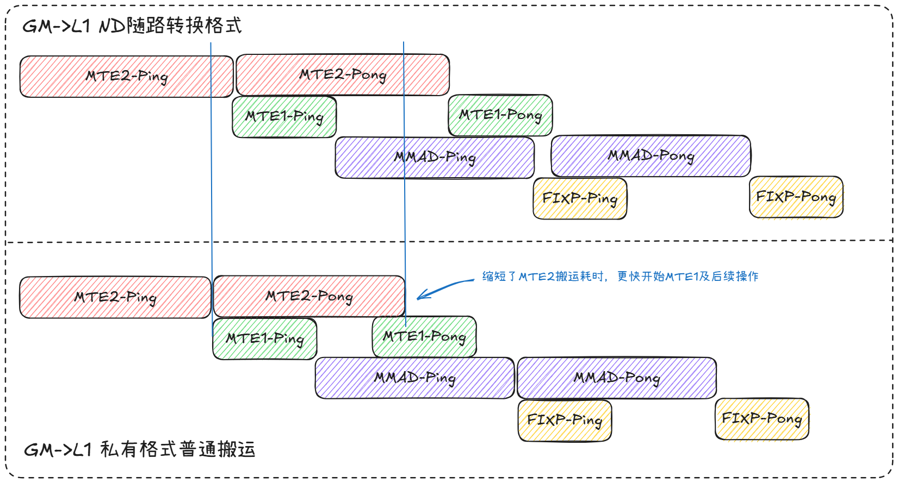
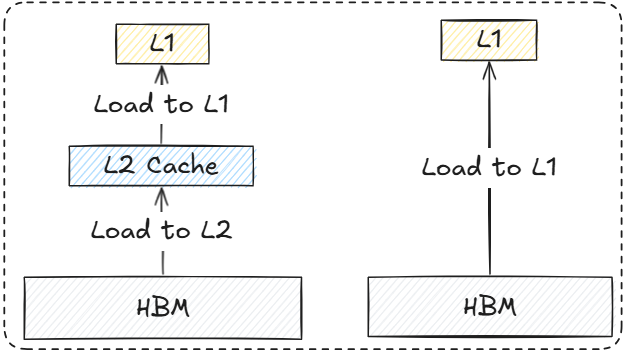
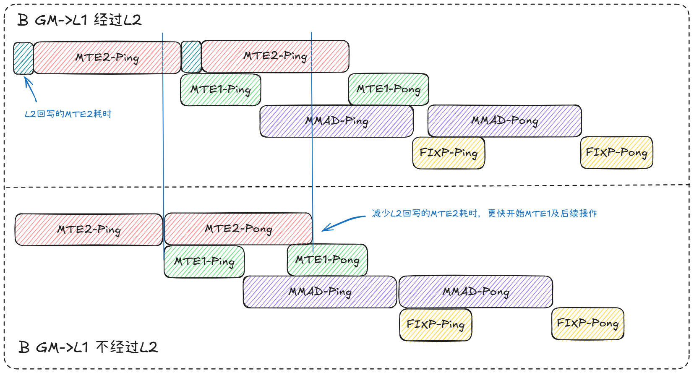
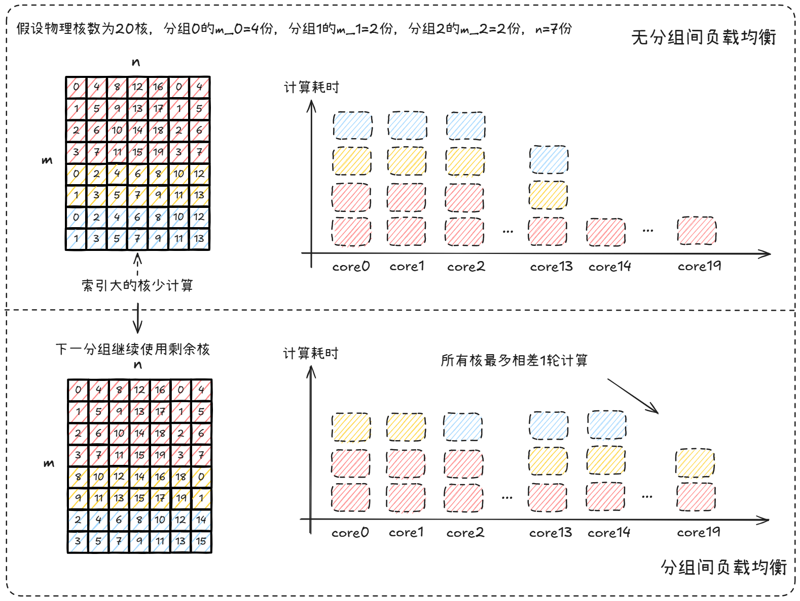
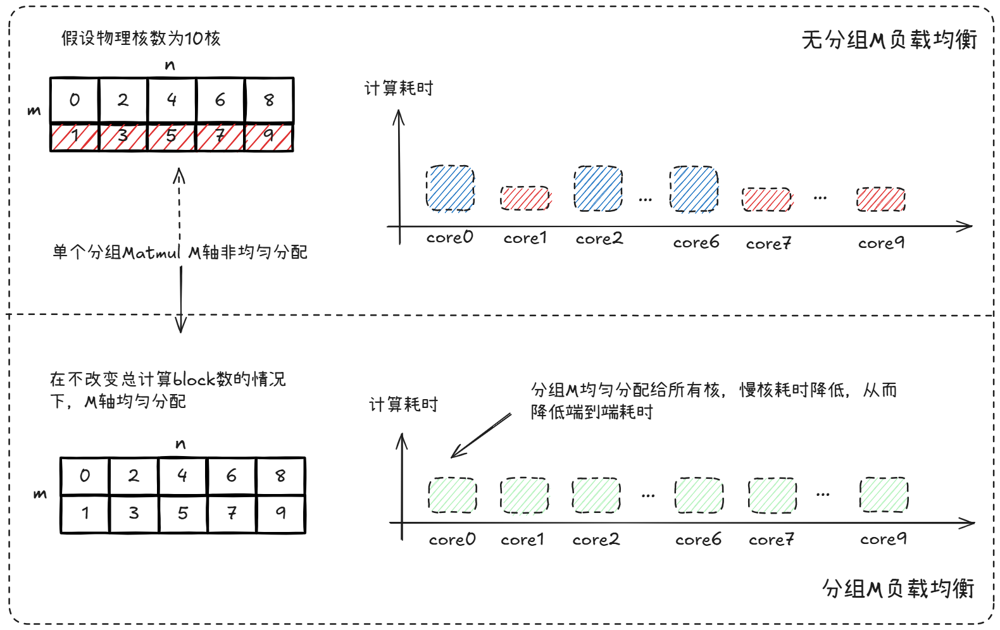

# GroupedMatmul MX量化矩阵乘算子性能优化指南

## 概述

本文档系统阐述**GroupedMatmul**的MX量化矩阵乘的实现原理、性能建模方法与优化实践，覆盖MXFP4与MXFP8场景。

## 算子实现原理

### 算子功能说明

- **算子功能**  
在GroupedMatmul（分组矩阵乘法）中，每个专家对应的分组值由输入`group_list`指定，允许分组值为0，表示该专家未被选中。
  - 在M轴分组时，每组的M值由`group_list`给出，维度`N`、`K`在所有组间相同；
  - 在K轴分组时，每组的K值由`group_list`给出，维度`M`、`N`在所有组间相同。

| **对比项**   | **MXFP8**                   | **MXFP4**                  |
| --------- | --------------------------- | -------------------------- |
| A/B数据类型  | `float8_e4m3fn`             | `float4_e2m1`              |
| 量化方式      | GroupSize=32的per-group量化 | 同左                         |
| scaleA/B  | `float8_e8m0`               | 同左              |
| 分组     | M轴分组（A ND，B ND/DN/NZ/ZN），K轴分组（A DN，B ND）    | M轴分组（A ND，B ND/DN/NZ/ZN）   |
| 显存压缩比     | 相比FP16/BF16内存占用减少约50%    | 相比FP16/BF16内存占用减少约75%   |
| 典型用途      | 模型训推，兼顾速度与精度的平衡                  | 模型推理，侧重极致显存效率与推理速度                 |

- **计算公式**  
对每个专家e：

$$  
C^{(e)}_{i, j} = \sum^{ceil(K/G)-1}_{g=0}\left(scaleA^{(e)}_{i, g} \cdot scaleB^{(e)}_{g, j} \cdot \sum^{G-1}_{k'=0} (A^{(e)}_{i, gG+k'} \cdot B^{(e)}_{gG + k', j}) \right)  
$$

其中G=32为MX的group size。

参数说明前统一约定：`E`表示专家数（Expert Number），即GroupedMatmul中参与计算的分组/专家个数。

#### MXFP4参数说明
MXFP4仅支持M轴分组。

| **变量名** | **描述**          | **Dtype**     | **Layout** | **Shape**                                      |
| ------- | --------------- | ------------- | ---------- | -------------------------------------------------- |
| A       | 输入左矩阵 | `float4_e2m1` | ND         | 整体`(M, K)`，按M分组切片                           |
| B       | 输入右矩阵 | `float4_e2m1` | ND/DN/NZ/ZN         | `(E, K, N)/(E, N, K)/(E, N1, K1, K0, N0)/(E, K1, N1, N0, K0)`，每个分组大小相同                                       |
| scaleA  | 左矩阵量化参数 | `float8_e8m0` | ND         | 整体`(M, ceil(K/64), 2)`，与A同M拼接规则 |
| scaleB  | 右矩阵量化参数 | `float8_e8m0` | ND/DN         | `(E, ceil(K/64), N, 2)/(E, N, ceil(K/64), 2)`，每个分组大小相同，转置属性同B                       |
| c       | 输出              | `bfloat16`    | ND         | 整体`(M, N)`，与A同M拼接规则                                       |

> 注：MXFP4的NZ/ZN的后两维为`(16, 64)`。

#### MXFP8参数说明

为明确区分两类分组方式，以下按**M轴分组**与**K轴分组**分别给出各参数的逻辑形状与布局约束。

<table>
  <thead>
    <tr>
      <th>变量名</th>
      <th>描述</th>
      <th>Dtype</th>
      <th colspan="2">M轴分组</th>
      <th colspan="2">K轴分组</th>
    </tr>
    <tr>
      <th></th>
      <th></th>
      <th></th>
      <th>Layout</th>
      <th>Shape</th>
      <th>Layout</th>
      <th>Shape</th>
    </tr>
  </thead>
  <tbody>
    <tr>
      <td>A</td>
      <td>输入左矩阵</td>
      <td><code>float8_e4m3fn</code></td>
      <td><code>ND</code></td>
      <td><code>(M, K)</code></td>
      <td><code>DN</code></td>
      <td><code>(K, M)</code></td>
    </tr>
    <tr>
      <td>B</td>
      <td>输入右矩阵</td>
      <td><code>float8_e4m3fn</code></td>
      <td><code>ND/DN/NZ/ZN</code></td>
      <td><code>(E, K, N)/(E, N, K)/(E, N1, K1, K0, N0)/(E, K1, N1, N0, K0)</code></td>
      <td><code>ND</code></td>
      <td><code>(K, N)</code></td>
    </tr>
    <tr>
      <td>scaleA</td>
      <td>左矩阵量化参数</td>
      <td><code>float8_e8m0</code></td>
      <td><code>ND</code></td>
      <td><code>(M, ceil(K/64), 2)</code></td>
      <td><code>DN</code></td>
      <td><code>(K/64 + E, M, 2)</code></td>
    </tr>
    <tr>
      <td>scaleB</td>
      <td>右矩阵量化参数</td>
      <td><code>float8_e8m0</code></td>
      <td><code>DN/ND</code></td>
      <td><code>(E, N, ceil(K/64), 2)/(E, ceil(K/64), N, 2)，每个分组大小相同，转置属性同B</code></td>
      <td><code>ND</code></td>
      <td><code>(K/64 + E, N, 2)</code></td>
    </tr>
    <tr>
      <td>c</td>
      <td>输出</td>
      <td><code>bfloat16</code></td>
      <td><code>ND</code></td>
      <td>整体<code>(M, N)</code>，与A同M拼接规则</td>
      <td><code>ND</code></td>
      <td>整体<code>(E, M, N)</code>，在K轴分组上做分片累加</td>
    </tr>
  </tbody>
</table>

> 注：MXFP8的NZ/ZN的后两维为`(16, 32)`。

### 算子实现说明
GroupedMatmul是由E个单Matmul组成，按分组更新`A/B/ScaleA/ScaleB/C` GM基址偏移。
- M轴分组，将当前组的`(M_e, N, K)`视作单个MX矩阵乘。以行维度M为划分依据，将整体矩阵乘拆分为多个行维度M分片子矩阵乘，A (M, K) B (E, N, K)或 (E, K, N)。各组B矩阵大小一致，各组输出沿M维度拼接。

  

    
  

- K轴分组，将当前组的`(M, N, K_e)`视作单个MX矩阵乘。以内积收缩维度K为划分依据，A (K, M) B (K, N)。将K维度切分为多个子通道块，各组输出大小一致，各组在对应K分片上独立计算并拼接结果。
  

    
  

分组内的MX矩阵乘实现与quant matmul MX矩阵乘一致，详见[quant_matmul_mx_performance.md — 算子实现说明](../../matmul_story/docs/quant_matmul_mx_performance.md#quant-matmul-mx-operator-implementation) 。

### 算子实现约束

分组内的MX矩阵乘约束与quant matmul MX矩阵乘一致，详见 [quant_matmul_mx_performance.md — 算子实现约束](../../matmul_story/docs/quant_matmul_mx_performance.md#quant-matmul-mx-implementation-constraints) 。

## 算子性能建模

### 性能瓶颈分析

#### 单MX Matmul的性能瓶颈分析

MX量化矩阵乘算子的性能瓶颈主要分为以下两类，同**QuantMatmul**：

1. **CUBE Bound**：算子性能受限于硬件的算力规格，本身已经实现连续的MMAD计算。这种场景通常意味着算子性能已经最优，但需要重点关注**多核计算负载是否均衡**，避免出现单核Cube Bound，但整体Cube利用率偏低的情况。

2. **Memory Bound**：算子性能受限于数据搬运能力，主要的性能优化手段是减少搬运量、提高带宽利用率或者将低带宽的搬运转换成高带宽的搬运，进而发挥算子极致性能。因Bound在不同的流水上而区分出**MTE2 Bound**、**MTE1 Bound**以及**FIXPIPE Bound**。

#### 多个分组MX Matmul的性能瓶颈分析

在单MX Matmul的**CUBE Bound / MTE2 Bound / MTE1 Bound / FIXPIPE Bound**分类之上，**分组场景增加**：

**组间切换与负载不均**：每个分组的数据均不能组间复用，各分组值不同可能会导致每个分组MX Matmul的性能瓶颈不同。
- 若每个Matmul都是同种bound如CUBE Bound，则GroupedMatmul是该种bound如CUBE Bound;
- 否则性能瓶颈需按**各组时间加权**估算，而非单次Matmul`(M,N,K)`决定。

### 单Matmul性能建模公式

单MX Matmul的**基本原理**、**各流水理论耗时**（MMAD、MTE2、MTE1、FIXPIPE）及**Bound对比化简**等公式详见 [quant_matmul_mx_performance.md — 性能建模公式](../../matmul_story/docs/quant_matmul_mx_performance.md#quant-matmul-mx-performance-modeling-formulas)。

### 优化目标

- 组内：与单MX Matmul相同，使MMAD、MTE2、MTE1、FIXPIPE尽量匹配，避免单一流水过长；不同核之间尽可能接近。
- 组间：通过不同group间的核负载均衡提高多核利用率。

## 算子优化实践

本章介绍MX Matmul中应用的优化措施，通用的指令并行度优化和多核利用率优化，以及针对不同的Bound类型场景分别提供搬运效率优化、计算效率优化方法。

### 指令并行度优化

#### Double Buffer（双缓冲）

**同QuantMatmul**。

- **原理介绍**

  Double Buffer使用两个缓冲区交替工作：一个缓冲区用于当前计算，另一个并行准备下一轮数据。通过计算与数据加载/准备的重叠，隐藏内存访问延迟，减少流水线停顿，提高算子吞吐量。

- **Double Buffer（2-Buffer） vs 3-Buffer**
  - **2-Buffer**：两份buffer交替，覆盖“当前计算/下一轮准备”的基本重叠关系，资源开销更小，适用于多数GroupedMatmul场景。
  - **3-Buffer**：相较2-Buffer，3-Buffer仅在L1侧增加第三份阶段缓冲（A/B数据），L0层级仍为2-Buffer，以减少因搬运抖动、带宽瞬时不足造成的断流风险。
  - **使能3-Buffer条件**：需满足L1容量约束，并且在保持目标`baseM/baseN/baseK`块大小后不引入新的瓶颈。以当前Grouped MXFP8 split-M 3buffer实现为例，需要满足：
    - `A1 + B1 + scaleA + scaleB + A3 <= HALF_L1_SIZE`
    - `A2 + B2 + scaleA + scaleB + B3 <= HALF_L1_SIZE`
    其中，A1=A2=A3,B1=B2=B3，A1/B1分别为A/B一次MTE2搬运到L1的数据量。若不满足上述条件，建议回退2-Buffer并结合SWAT/Bank冲突优化提升整体吞吐。

- **效果对比**

  下图展示了L1,L0A,L0B使能Double Buffer后流水图的预期变化，从而有效提升不同流水间的并行度。

  

    
  

- **适用场景**
  - 存在流水停顿的场景
  - 内存访问延迟成为瓶颈的场景
  - L1或L0缓冲区空间充足的场景

#### UnitFlag（单元标志）

**同QuantMatmul**。

- **原理介绍**

  UnitFlag为`MMAD`计算指令和`FIXPIPE`数据搬运指令提供基于内存访问的细粒度同步（512B粒度）。未开启时，FIXPIPE需等MMAD指令完全执行完才开始搬出；开启后，MMAD每计算完512B数据，FIXPIPE立即搬出该数据块，**尤其在无法开启L0C Double-Buffer的情况下能有效提高计算与搬出流水的并行度**。

- **效果对比**

  由性能建模可知，为充分发挥计算访存比，需尽可能用满`L0C`缓冲区，导致存在无法在`L0C`缓冲区上开启Double Buffer的场景，可启用UnitFlag功能来提高指令并行度。

  

    
  

- **适用场景**
  - MMAD和FIXPIPE流水部分或全部串行执行的场景
  - 需要提高计算与搬出并行度的场景

### 搬运效率优化

#### SWAT（自适应滑动窗口模板）

**同QuantMatmul**。

- **原理介绍**

  SWAT(Slide Window Adaptive Template)通过提升多核单次访问的L2命中率来提高`MTE2`搬运效率，从而实现首轮搬运即可做到`MMAD`指令不断流，使算子在Cube Bound场景下计算单元利用率达到95%+。

  核心逻辑是使每一轮多核计算的输出排布尽量**方正**，具体方法是在M轴上设定固定窗口，根据M轴方向尾块大小灵活调整，再沿N方向进行"Z"型滑动，从而最大程度提高L2命中率。

- **效果对比**

  下图对比了传统的列优先分配和SWAT的理论效果。

  

    
  

- **适用场景**
  - 大规模矩阵乘法场景
  - 多核并行计算场景
  - CUBE Bound为主要瓶颈的场景

#### L1 Bank冲突优化

**同QuantMatmul**。

- **原理介绍**

  L1缓冲区以256KB粒度分为两个Bank，当同时对同一Bank进行读写操作时，会触发Bank冲突，导致`MTE1`带宽效率降低，进而打断`MMAD`指令连续性。

  因此在开启L1 Double Buffer时，需将两份缓存的数据放置于不同Bank中，从而避免读写冲突导致的Bank冲突。

- **效果对比**

  

    
  

- **适用场景**
  - 开启了L1 Double Buffer的场景
  - MTE1带宽利用率不足的场景
  - 存在Bank冲突导致`MMAD`断流的场景

#### Scale缓存优化

**同QuantMatmul**。

- **原理介绍**

  Scale部分的数据量仅为输入矩阵的1/32，当输入矩阵较小时，所需Scale数据量急剧减小，无法充分发挥带宽性能，导致Scale搬运带宽利用率显著降低。

  可利用L1剩余空间，提前载入后续所需Scale并在L1上缓存，从而减少Scale搬运次数，缓解因单次所需Scale数据量过小导致的带宽速率降低问题。

- **效果对比**

  

    
  

- **适用场景**
  - 输入矩阵较小，Scale数据量不足的场景
  - MTE2带宽利用率受Scale搬运限制的场景
  - L1缓冲区有充足剩余空间的场景

#### WeightNZ优化

**同QuantMatmul**。

- **原理介绍**

  `NZ/ZN`为NPU私有格式数据。`NZ/ZN`格式的weight数据可通过普通的`DataCopy`搬运，相比带有格式转换的`ND2NZ`等指令具有更高的带宽利用率，能够更高效地将weight数据从GM搬运到L1缓冲区，从而减少weight数据搬运的MTE2耗时，优化Memory Bound场景性能。

  下图展示了从标准DN排布 `(n, k)` 到ZN私有格式 `(k1, n1, n0, k0)` 的数据排布转换过程，其中 `n0=16`, `k0=32/sizeof(BType)`：

  

    
  

- **效果对比**

  下图展示了使用weight ND和NZ搬运的流水对比，NZ的weight数据搬运耗时显著降低。

  

    
  

- **适用场景**
  - 仅支持M轴分组的推理场景，离线处理weight DN->ZN或ND->NZ的过程
  - MTE2 Bound场景
  - 原始shape内轴不对齐场景

#### 双页表

**同QuantMatmul**。

- **原理介绍**

  当分组matmul的m较小（<=baseM）时，weight数据只使用一次。当前默认HBM数据先进L2Cache再进L1缓冲区，weight数据量大，weight加载会造成L2里的有效数据回写到HBM，这部分会产生额外的MTE2耗时。
  
  如果在小m场景下，将weight数据从HBM直接加载进L1缓冲区，不仅不会增加原有weight加载耗时，且不会造成非必要的L2有效数据回写到HBM。

  

    
  

- **效果对比**

  下图展示了使用双页表前后的流水对比，优化后数据搬运耗时显著降低。

  

    
  

- **适用场景**
  - 大weight数据量
  - 整网推理场景

### 计算效率优化

#### group间核负载均衡

**GroupedMatmul相对QuantMatmul独有。**

- **原理介绍**
  GroupedMatmul每个分组Matmul使用基本块`(baseM, baseN)`策略进行多核分配，很大可能单分组Matmul的block块数并不能被开启的核数整除。为了高效使用每一个核，下一个分组Matmul接着上一个分组Matmul结束的核数往下分配核，避免每个分组Matmul均从0核开始计算。

- **效果对比**

  

    
  

- **适用场景**
  - 多核并行计算场景
  - 输入形状不规则，无法均匀分配核的场景

#### M轴分组M计算负载均衡

**GroupedMatmul相对QuantMatmul独有。**

- **原理介绍**

  group_list是device tensor, 按照基本块`(baseM, baseN)`和其它参数进行L1和L0分配地址。M轴分组时每分组`M_e`在host侧未知，若每个分组按照基本块`(baseM, baseN)`分核，有可能一些核M轴计算baseM,一些核M轴的计算远小于baseM，这就有可能造成某些核计算量偏大，算子性能取决于最晚结束的核的性能，从而导致快慢核引起的性能劣化。
  
  注意，K轴分组不做分组值计算负载均衡，因为实现模板暂不切K。另外，A (K, M)和B (K, N), 按照基本块`(baseM, baseN)`以达到更好的搬运效率。

- **效果对比**

  

    
  

- **适用场景**
  - 多核并行计算场景
  - 输入形状不规则，M轴分组M分布不均衡场景

#### 尾轮负载均衡

**同QuantMatmul**。

- **原理介绍**

  当前Matmul算子普遍使用基本块策略进行多核分配。但在处理不同规格输入时，划分的基本块无法均匀分配到所有核上，导致分核不均，尤其是最后一轮计算存在算力浪费，使整体算力利用率无法达到最优。

  可将最后一轮未完全分配的基本块进行二次切分，使其尽量均匀分配到多核中，充分发挥完整算力。

- **效果对比**

  

    
  

- **适用场景**
  - 多核并行计算场景
  - 输入形状不规则，无法均匀分配的场景
  - 最后一轮计算存在算力浪费的场景

## 算子模板归纳

### SWAT模板

- **模板特点**：
  - 作为基础模板用于处理非特化模板的所有场景，具有广泛的适用性
  - 适用于大规模矩阵乘法场景，在Cube Bound场景下表现优异
  - 支持灵活的形状配置，可适应不同维度的矩阵输入，尤其是host侧不可知的可变的分组值

- **涉及优化手段**：
  - Double Buffer：隐藏内存访问延迟，提升流水线并行度
  - UnitFlag：提升计算与搬出流水并行度
  - SWAT（自适应滑动窗口）：提升L2命中率，优化多核并行效率
  - L1 Bank冲突优化：消除Bank冲突，提升MTE1带宽利用率
  - Scale缓存：优化Scale数据搬运，减少传输开销
  - WeightNZ优化：使用非随路转换格式的普通指令高效搬运weight数据，提升weight数据搬运效率
  - 双页表：针对只使用一次的weight数据从GM直接加载到L1，不发生不必要的L2回写劣化
  - M分组M均衡负载：均衡多核负载，减轻快慢核的计算不均导致的负载失衡
  - 分组间和尾轮负载均衡：均衡多核负载，消除空闲核的浪费

- **模板实现**
  - MXFP4 splitM：[quant_grouped_matmul_mxfp4_split_m.asc](../grouped_matmul_recipes/examples/quant_grouped_matmul_mxfp4/quant_grouped_matmul_mxfp4_split_m.asc)
  - MXFP4 splitM + WeightNZ：[quant_grouped_matmul_mxfp4_split_m_weight_nz.asc](../grouped_matmul_recipes/examples/quant_grouped_matmul_mxfp4/quant_grouped_matmul_mxfp4_split_m_weight_nz.asc)
  - MXFP8 splitM：[quant_grouped_matmul_mxfp8_split_m.asc](../grouped_matmul_recipes/examples/quant_grouped_matmul_mxfp8/quant_grouped_matmul_mxfp8_split_m.asc)
  - MXFP8 splitM + 3Buffer：[quant_grouped_matmul_mxfp8_split_m_3buffer.asc](../grouped_matmul_recipes/examples/quant_grouped_matmul_mxfp8/quant_grouped_matmul_mxfp8_split_m_3buffer.asc)
  - MXFP8 splitM + WeightNZ：[quant_grouped_matmul_mxfp8_split_m_weight_nz.asc](../grouped_matmul_recipes/examples/quant_grouped_matmul_mxfp8/quant_grouped_matmul_mxfp8_split_m_weight_nz.asc)
  - MXFP8 splitK：[quant_grouped_matmul_mxfp8_split_k.asc](../grouped_matmul_recipes/examples/quant_grouped_matmul_mxfp8/quant_grouped_matmul_mxfp8_split_k.asc)

## 优化策略选择指南

### 根据 Bound 类型选择优化策略

| **Bound类型**   | **推荐优化策略**       | **优先级**                                |
| ------------- | ----------------------- | ----------------------------------------- |
| CUBE Bound    | SWAT + 多核负载均衡             | 高                 |
| MTE2 Bound    | Scale 缓存 + WeightNZ搬运优化 + 双页表| 高   |
| MTE1 Bound    | L1 Bank 冲突优化                | 中                                                |
| FIXPIPE Bound | UnitFlag                        | 中                                 |
| 流水停顿       | Double Buffer                  | 高 |

## 性能调优实践步骤

1. **性能分析**：使用Profiling工具结合性能建模分析当前算子的Bound类型
2. **瓶颈识别**：确定主要的性能瓶颈所在
3. **策略选择**：根据Bound类型选择合适的优化策略
4. **参数调优**：调整tiling参数，优化缓冲区使用
5. **效果验证**：对比优化前后的性能数据
6. **迭代优化**：根据结果进一步调整优化策略

## 总结

GroupedMatmul MX量化矩阵乘（**MXFP4 / MXFP8**）的性能优化不仅要考虑优化单MX Matmul性能，还要考虑分组间的负载均衡。