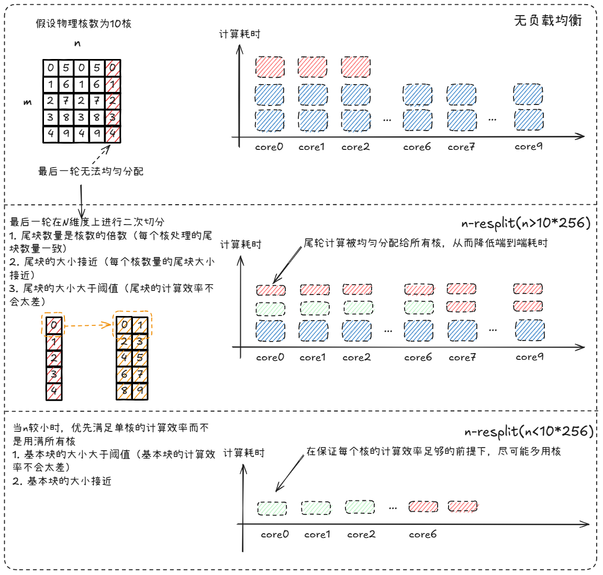

# GroupedMatmul MXFP8FP4权重量化矩阵乘算子性能优化指南

## 概述

本文档面向`m`轴分组的`weight_quant_grouped_matmul_mxfp8fp4`示例，说明其算子语义、实现路径、性能建模与优化方法，帮助开发者掌握GroupedMatmul MXFP8FP4权重量化矩阵乘算子在昇腾芯片上的开发与性能优化方法。

## 算子实现原理

### 算子功能说明

- **算子功能**：实现M轴分组的MXFP8FP4混合精度量化矩阵乘计算，左矩阵类型为`float8_e4m3fn`，右矩阵类型为`float4_e2m1`，量化方式均为MX(Microscaling)，即`scaleA`和`scaleB`为`float8_e8m0`类型、groupsize=32的分组量化。

- **应用场景**：混合精度乘的优势在于性能和精度的折中：相比于MXFP8量化，B矩阵内存占用节省50%，具有更高的搬运效率；相比于MXFP4量化，具有更好的精度表现。

| **对比项**  | **MXFP8**                                | **MXFP8FP4**                         | **MXFP4**                           |
|-------------|------------------------------------------|--------------------------------------|-------------------------------------|
| A/B数据类型 | `float8_e4m3fn`                          | `float8_e4m3fn`/`float4_e2m1`        | `float4_e2m1`                       |
| 量化方式    | groupsize=32的per-group量化              | 同左                                 | 同左                                |
| scaleA/B    | `float8_e8m0`                            | 同左                                 | 同左                                |
| 分组        | M轴分组（A ND，B ND/DN），K轴分组（A DN，B ND） | M轴分组（A ND，B Weight4BitLayout）    | M轴分组（A ND，B ND/DN）               |
| 主要内存收益 | 相比FP16/BF16内存占用减少约50%           | B矩阵/weight相比MXFP8内存占用节省50% | 相比FP16/BF16内存占用减少约75%      |
| 典型用途    | 模型训推，兼顾速度与精度的平衡            | 模型推理，兼顾速度与精度的平衡        | 模型推理，侧重极致显存效率与推理速度 |

注：B矩阵采用代码中的`Weight4BitLayout`自定义格式。

- **计算公式**：

设专家数为`E`（Expert Number），第`e`个专家需要处理的行数为 $m_e$（$m_e$ 允许为0，表示该专家未被选中），第`e`组、第`i`行、第`j`列的计算公式如下：

$$
C_{e, i, j} = \sum_{g=0}^{K/G-1}\left(scaleA_{e, i, g} \cdot scaleB_{e, g, j} \cdot \sum_{k'=0}^{G-1} (a_{e, i, gG+k'} \cdot b_{e, j, gG+k'}) \right),\ i\in[0,m_e),\ j\in[0,N).
$$

算子整体输出可表示为：

$$
C = \operatorname{Concat}_M\left(C_0, C_1, ..., C_{E-1}\right)
$$

注：上述公式按逻辑矩阵维度描述，`scaleB_{e, g, j}`表示第`e`个专家、第`j`列、第`g`个量化组的逻辑缩放因子；实际实现中，为满足硬件访存和对齐约束，`B`、`scaleA`和`scaleB`会按参数表中的实现Shape存放。当前样例约束`K`按64对齐，因此每个量化组均包含`G`个元素，且每2个量化组可在实现Shape中打包。

- **参数说明**：

| 类别 | 名称           | Shape                                                                  | Dtype                   | Layout           | 说明                                                           |
|------|----------------|------------------------------------------------------------------------|-------------------------|------------------|----------------------------------------------------------------|
| 输入 | `A`            | 整体为 `(M, K)`，第`e`组逻辑切片为 `(m_e, K)`                           | `float8_e4m3fn`         | ND               | 激活输入矩阵，按M轴拼接                                       |
| 输入 | `B`            | 逻辑Shape为 `(E, N, K)`；实现Shape为 `(E, K/_k0, N/_n0, _n0, _k0)`      | `float4_e2m1`（打包存储） | Weight4BitLayout | 按专家存储的权重矩阵，第`e`组逻辑Shape为 `(N, K)`              |
| 输入 | `scaleA`       | 整体为 `(M, K/G/2, 2)`，第`e`组逻辑切片为 `(m_e, K/G/2, 2)`             | `float8_e8m0`           | ScaleAND         | 与`A`对应的per-group scale，按M轴拼接                          |
| 输入 | `scaleB`       | `(E, N, K/G/2, 2)`                                                      | `float8_e8m0`           | ScaleBDN         | 与`B`对应的per-group scale，第`e`组为 `(N, K/G/2, 2)`          |
| 输入 | `group_m_list` | `(E)`                                                                  | `int64`                 | ND               | 每个专家的 $m_e$                                               |
| 输出 | `C`            | 整体为 `(M, N)`，第`e`组逻辑切片为 `(m_e, N)`                           | `bfloat16`              | ND               | 按组拼接后的输出矩阵                                           |

注：当前样例约束`K`按64对齐，`N`按32对齐，且 $M \geq \sum_{e=0}^{E-1}m_e$。当 $M > \sum_{e=0}^{E-1}m_e$ 时，有效输出为前 $\sum_{e=0}^{E-1}m_e$ 行，其余行属于预留空间，不参与逻辑结果。表格中的`_m0=16`、`_n0=16`、`_k0=32`分别对应M、N、K方向的基础块大小；`K/G/2`表示每2个量化组在最后一维打包。`ScaleAND`和`ScaleBDN`为代码中的Layout名称。

### 算子实现说明

Grouped Matmul由`E`个单组Matmul组成，按分组更新`A`、`B`、`scaleA`、`scaleB`、`C`的GM基址偏移，示意如下：

  

本文中的MIX算子指同时使用Vector核和Cube核协同完成计算的算子，而不是只使用单一核的算子。分组内的MXFP8FP4矩阵乘实现与单组MXFP8FP4矩阵乘一致，差异主要在于每个专家的GM基址偏移、`m_e`动态大小以及组间调度。

整体数据路径可先按计算单元划分为四类：

| **数据对象** | **主要路径** | **所属计算单元** | **说明** |
|-|-|-|-|
| Tensor B | `GM -> UB -> L1` | Vector核 | 每个专家的B矩阵先在Vector侧完成`float4_e2m1`到`float8_e4m3fn`的预处理 |
| Tensor A / scaleA | `GM -> L1 -> L0A / L0A_MX` | Cube核 | 当前专家的A矩阵及其缩放因子直接进入Cube侧缓存，参与`MMAD_MX`计算 |
| Tensor B / scaleB | `L1 -> L0B / L0B_MX` | Cube核 | 预处理后的B矩阵及其缩放因子进入Cube侧缓存，参与`MMAD_MX`计算 |
| Tensor C | `L0C -> GM` | Cube核 | `MMAD_MX`结果写入L0C后，通过FIXPIPE按当前专家的输出偏移搬出到GM |

分组内更详细的Layout和搬运路径，详见[weight_quant_matmul_mxfp8fp4_performance.md — 算子实现说明](../../matmul_story/docs/weight_quant_matmul_mxfp8fp4_performance.md#operator-implementation)。

### 算子实现约束

1. `K`维度需按64对齐，当前样例不支持`K`维度补零能力。
2. `N`维度需按32对齐，当前样例不支持`N`维度非对齐输入。

## 算子性能建模

### 性能瓶颈分析

#### 单组 Weight Quant Matmul 的瓶颈

MXFP8FP4混合精度矩阵乘算子的性能瓶颈主要分为以下三类，同单组Weight Quant Matmul：

1. **Cube Bound**：算子耗时主要由Cube核`MMAD`计算决定，且未被数据搬运或VF预处理阻塞
2. **VF Bound**：算子性能受限于Vector核算力，VF计算耗时占据主导地位
3. **Memory Bound**：算子性能受限于硬件带宽，数据搬运耗时占据主导地位。根据流水的不同，可包括**MTE1 Bound**、**MTE2 Bound**、**MTE3 Bound**以及**FIXPIPE Bound**

为了能够充分利用硬件算力，希望算子达到Cube Bound，此时MMAD流水连续，算力得以充分发挥。尽管VF Bound也是算力Bound，但Cube核的算力远高于Vector核，因此更希望达到Cube Bound。本文后续沿用单组MXFP8FP4矩阵乘的建模口径，重点关注`MTE1`、`MTE2`、`VF`和`FIXPIPE`。单核`MTE3`带宽为256BPC，而单Vector核VF输出带宽需求约50BPC，2个Vector核合计约100BPC，低于`MTE3`带宽，因此通常不会阻塞在`MTE3`上。

#### 多组 Weight Quant Matmul 的瓶颈

在单组 Bound 判定之上，grouped 场景还会新增两类问题：

- 组间切换开销：不同expert的数据通常无法在组间复用；
- 不均衡的动态负载：`group_m_list`在运行时获取，不同分组的Bound类型不同，整体性能需要在运行时平衡。

### 单组 Weight Quant Matmul 性能建模公式

单组Weight Quant Matmul的**基本原理**、**各流水理论耗时**及**Bound对比化简**等公式详见[weight_quant_matmul_mxfp8fp4_performance.md — 性能建模公式](../../matmul_story/docs/weight_quant_matmul_mxfp8fp4_performance.md#performance-model)。

### 优化目标

- 组内：尽量让`MMAD`、`MTE2`、`VF`、`MTE1`、`FIXPIPE`匹配，减少某一条流水过长；
- 组间：尽量减少group间尾轮失衡，使不同核心的结束时间接近。

## 算子优化实践

### 指令并行度优化

与单组MXFP8FP4 Matmul相同的优化实践：

1. 4-buffer（[weight_quant_matmul_mxfp8fp4_performance.md — 4-buffer优化](../../matmul_story/docs/weight_quant_matmul_mxfp8fp4_performance.md#four-buffer-optimization)）
2. UnitFlag（[weight_quant_matmul_mxfp8fp4_performance.md — UnitFlag（单元标志）](../../matmul_story/docs/weight_quant_matmul_mxfp8fp4_performance.md#unitflag-optimization)）

### 搬运效率优化

与单组MXFP8FP4 Matmul相同的优化实践：

1. L1 Bank冲突优化（[weight_quant_matmul_mxfp8fp4_performance.md — L1 Bank冲突优化](../../matmul_story/docs/weight_quant_matmul_mxfp8fp4_performance.md#l1-bank-conflict-optimization)）

#### 只读一次的场景不经过L2 Cache

同一expert内GM侧数据只读取一次的情况下，可不经过L2 Cache，减少经过L2的开销，不占用L2空间，降低L2中高频复用数据被替换的概率。

**原理介绍**

  

**收益点**

- 降低L2污染，提升其他高复用数据的L2命中稳定性。

**适用场景**

- 单组`m`一次性全部搬入时，同一expert内没有`B` Tensor重复载入的场景。

#### scale缓存优化

当前实现中`scale`并不是逐个`kL1`小块即时重载，而是按更大的`MX_SCALE_K_L1_SIZE = 4096` K窗口组织。

**原理介绍**

这类设计的目的不是改变`scale`数学语义，而是让`scale`搬运在更接近cacheline友好的粒度上进行，从而提升有效带宽与复用率。

  

**收益点**

- 减少过小`scale`搬运导致的带宽利用率下降；
- 让多次`kL1`计算复用同一段`scale` L1窗口。

**适用场景**

- `scaleA/scaleB`相比主输入明显更小，容易形成“搬得动但搬不快”的场景；
- `K`较大、可通过更大`scale`窗口换取更高复用的场景。

#### 保证连续搬运数据量

**原理介绍**

1. 虽然Ascend950支持128B的Sector-Cache，但是为了用满核而将连续搬运字节数降低到128B以下，会导致有效带宽浪费。`N`方向元素数过小时，每核连续搬运字节数可能低于128B有效粒度，从而影响带宽利用率。
2. 数据量过小会导致搬运开销无法掩盖调度开销。

**收益点**

- 避免任务切得过碎，导致搬运/调度开销比例过高；
- 让小 `N` 场景下的单任务计算量保持在合理水平。

**适用场景**

- `N <= coreNum * 128`的场景，其中`128`表示N方向元素数。

### 计算效率优化

与单组MXFP8FP4 Matmul相同的优化实践：

1. VF优化（[weight_quant_matmul_mxfp8fp4_performance.md — VF优化](../../matmul_story/docs/weight_quant_matmul_mxfp8fp4_performance.md#vf-optimization)）

#### N 方向 resplit 负载均衡

**原理介绍**

当 `N` 不能被 `coreNum * 256` 整除时，host tiling 会输出 `firstTailBlock*` 和 `secondTailBlock*` 两段尾块参数，使最后一轮块大小尽量接近，减少长尾。其中`256`表示N方向分块粒度的元素数。

**效果示意**

  

**适用场景**

- 大 `N` 且不能整齐分块的场景；
- 最后一轮存在明显慢核的场景。

#### group间核负载均衡

**原理介绍**

设备侧调度器不会让每个group都从0号核重新开始，而是通过`startBasicBlockId = (startBasicBlockId + prevTileNum) % coreNum`轮转group的起始核。这样可以避免若干大group总压在同一批核心上，降低跨group的负载偏斜。

  

**收益点**

- 让不同group的basic block更均匀地落到各个核心；
- 缓解group规模不均带来的固定核热点问题。

**适用场景**

- `group_m_list` 分布不均；
- 存在连续多个大group的场景。

## 模板归纳

### split-m + n-resplit 模板（已落地）

- **模板特点**
  - 面向grouped weight quant MXFP8FP4场景；
  - host侧给出N方向自适应重切分参数；
  - 设备侧调度器同时处理group间起始核轮转与group内M/N块枚举。

- **涉及优化手段**
  - UB侧weight 4-buffer；
  - L1侧weight Double Buffer；
  - UnitFlag；
  - N 方向 resplit；
  - 小N场景`taskNum`控制；
  - group间起始核轮转与group内M块划分。

- **适用场景**
  - `A: float8_e4m3fn`；
  - `B: float4_e2m1` packed，经Vector核转换后进入Cube核计算；
  - 按`m`轴分组、`B`转置路径；
  - 输出为`bfloat16`。

- **模板实现**
  - [weight_quant_grouped_matmul_mxfp8fp4_split_m.asc](../grouped_matmul_recipes/examples/weight_quant_grouped_matmul_mxfp8fp4/weight_quant_grouped_matmul_mxfp8fp4_split_m.asc)

## 优化策略选择指南

### 根据 Bound 类型选择

| Bound 类型              | 主要现象                 | 优先策略                                    |
|-------------------------|--------------------------|---------------------------------------------|
| Cube Bound 但利用率不高 | 尾轮不均衡、组间等待      | 先看group间核负载均衡与N-resplit            |
| MTE2 Bound              | GM/L2搬运占比高          | 先看B的FP4路径、scale窗口复用与重复搬运     |
| MTE1 Bound              | L1 -> L0 装载跟不上 MMAD | 先看双缓冲与 L1/L0 切分匹配                 |
| FIXPIPE Bound           | 写回阶段压制吞吐         | 先看UnitFlag与输出重叠                      |

### 根据输入特征选择

| 输入特征                | 建议                                 |
|-------------------------|--------------------------------------|
| 大N、group相对均衡       | 采用full-core主块 + tail resplit     |
| 中等 N、不可整除         | 重点评估 `firstTail/secondTail` 比例 |
| 小N                     | 优先检查`taskNum`选择是否过碎        |
| `group_m_list`极不均衡  | 优先分析group间负载轮转和尾轮空转    |

## 性能调优实践步骤

1. **性能分析**：使用Profiling工具结合性能建模分析当前算子的Bound类型
2. **瓶颈识别**：确定主要的性能瓶颈所在
3. **策略选择**：根据Bound类型选择合适的优化策略
4. **参数调优**：调整tiling参数，优化缓冲区使用
5. **效果验证**：对比优化前后的性能数据
6. **迭代优化**：根据结果进一步调整优化策略

## 总结

GroupedMatmul MXFP8FP4权重量化矩阵乘算子的性能优化不仅要考虑单组MXFP8FP4矩阵乘的流水匹配，还要考虑分组间的动态负载均衡。
