# 【cann-samples系列】Kimi Delta Attention Lite：Ascend 950 Kernel 实现与版本设计

[cann-samples](https://gitcode.com/cann/cann-samples) 是面向算子开发者的样例与优化实践仓库。本文介绍 Kimi Delta Attention（KDA）核心计算在 Ascend 950 上的实现方法、数据路径和性能变化。

Kimi K3 的注意力层由 69 层 KDA 和 24 层 Gated MLA 组成。KDA 是一种线性 Attention 机制，以固定大小的矩阵状态保存历史信息，为长序列计算提供了不同于全量 KV Cache 的实现路径。

为区分完整 KDA 层与其中的递推计算，本文把由预处理后的 Q、K、V、`log_decay` 和 `beta` 更新矩阵状态，并生成 O 与 `final_state` 的部分简称为 KDA Core。完整的 KDA 层还包含输入投影、ShortConv、Q/K 归一化、衰减与更新系数的生成和激活，以及输出归一化、门控和投影等环节。

Kimi Delta Attention Lite（KDALite）抽取 KDA Core 的 Prefill 前向路径，用 Ascend C 重新设计 AIC/AIV 之间的数据交换和流水。文章以这段计算为载体，重点讲解 Ascend 950 上 1 Cube + 2 Vector（1C2V）Mix 组的 CV 核协作：任务如何在 AIC/AIV 间切分，两类核心如何同步，以及中间数据如何通过 Fixpipe 和 MTE3 在 UB 与 L1 之间交接。

KDALite 的递推语义与精度验收方式参考面向 NVIDIA GPU 的 [FlashKDA](https://github.com/MoonshotAI/FlashKDA) 和 FLA `chunk_kda`，但只覆盖其中的核心子集，也不是 FlashKDA CUDA/CUTLASS Kernel 的源码或后端移植。v0～v3 分别展示三 Kernel 分阶段实现、状态与输出融合、Prepare 的 Cube/AIV 协作与多状态链，以及缩短状态依赖链四种设计。

## 样例定位

本样例把 KDA Core 的逐 token 状态递推改写为 Chunk 矩阵计算。它接收已经准备好的 Q、K、V、`log_decay` 和 `beta`，输出序列 O 与 `final_state`，网络层的外围计算由调用方完成。

KDA 不构造 `S×S` Attention 矩阵，但状态具有先后依赖：同一序列中，后一个 token 或 Chunk 必须基于前一个状态继续计算，Chunk 内的 Delta 更新也必须遵守 token 顺序。

### 支持的功能

- KDA Core 的 Prefill 前向计算；
- 可变 Batch `B`、序列长度 `S` 和尾 Chunk；
- 固定单 Head：`N=1`，固定 `Dk=Dv=128`；
- 零初始状态，并输出 BF16 的序列末尾 `final_state`；
- 默认 `C=32`；v0/v1 支持 `C=16/32`，C64 可编译并完成随机输入回归，但未覆盖完整的强衰减范围；v2/v3 支持 `C=16/32`。

接口、任务切分和片上布局要求 `Dk==Dv`。这是样例实现的限制，不是 KDA 公式的限制。

### 不支持的功能

- Q/K/V 投影、ShortConv、Q/K 归一化、门参数生成与激活、输出归一化、门控和输出投影；
- 多 Head、`Dk!=Dv` 和外部传入的非零初态；
- 连续 Prefill、Decode、packed/varlen 输入；
- 训练反向。

### 对外接口

公共头文件声明两个 Host 接口：

```cpp
bool GetKimiDeltaAttnLiteWorkspaceSize(
    uint32_t batchSize,
    uint32_t seqLen,
    uint64_t& workspaceBytes);

bool KimiDeltaAttnLiteNPU(
    uint8_t* dQ,
    uint8_t* dK,
    uint8_t* dV,
    uint8_t* dLogDecay,
    uint8_t* dBeta,
    uint8_t* dO,
    uint8_t* dFinalState,
    uint8_t* dWorkspace,
    uint64_t workspaceBytes,
    uint32_t batchSize,
    uint32_t seqLen,
    uint32_t requestedMixCoreNum,
    aclrtStream stream);
```

设备指针均使用物理布局 `[B,S,*]`，固定为 1 的 Head 轴不落盘。

| 参数 | 数据类型与形状 | 含义和约束 |
| --- | --- | --- |
| `dQ` | BF16 `[B,S,128]` | 已完成 L2 归一化，并预乘 $1/\sqrt{D_k}$。 |
| `dK` | BF16 `[B,S,128]` | 已完成 L2 归一化。 |
| `dV` | BF16 `[B,S,128]` | Value 输入。 |
| `dLogDecay` | FP32 `[B,S,128]` | 门控后的 log 衰减，逐元素不大于 0；测试范围为 $[-5,0]$。 |
| `dBeta` | BF16 `[B,S]` | 每个 token 一个更新系数，取值范围为 $[0,1]$。 |
| `dO` | BF16 `[B,S,128]` | token 输出。 |
| `dFinalState` | BF16 `[B,128,128]` | 最后一个 Chunk 更新后的状态，布局为 `[Dk,Dv]`。 |
| `dWorkspace` | 设备内存 | 字节数先由查询接口获得；不同版本的内部布局不能混用。 |

O 占 `256*B*S` 字节，`final_state` 占 `32768*B` 字节。这里描述的是对外缓冲区；Kernel 内部仍以 FP32 保存递推状态。

| 标量参数 | 含义和约束 |
| --- | --- |
| `batchSize`、`seqLen` | 对应 `B`、`S`，均须大于 0。 |
| `workspaceBytes` | `dWorkspace` 的实际字节数，不得小于查询结果。 |
| `requestedMixCoreNum` | Mix 组数上限；每组包含 1 个矩阵计算核心（AIC）和 2 个向量计算核心（AIV）。0 表示使用本卡全部 Mix 组，非零值不得超过设备上限。纯 AIV Kernel 最多使用 `2*n` 个 AIV。 |
| `stream` | ACL stream；调用方须保证设备指针和 workspace 在 stream 执行结束前有效。 |

四个版本使用同一组 Host 接口。链接不同的 `kdalite_vN` 构建目标时，接口会调用对应版本的 Host 和 Kernel 实现。所有设备指针和 `stream` 都必须有效；调用方先查询并分配 workspace，再使用同一版本的执行接口。

`GetKimiDeltaAttnLiteWorkspaceSize` 返回所需的 workspace 字节数。`KimiDeltaAttnLiteNPU` 返回 `true` 只表示参数校验通过且 Kernel 已异步提交到 stream，不表示执行已经完成。

### 版本总览

| 版本 | Kernel 划分 | 主要变化 | ChunkSize | 详细说明 |
| --- | --- | --- | --- | --- |
| v0 | Prepare、StateUpdate、LocalOutput | 三 Kernel 单槽基线，中间量经 GM 交接 | 16/32；64（实验） | [v0 README](src/v0/README.md) |
| v1 | Prepare、StateOutput | 合并状态与输出，删除多项 GM 中间量，引入双槽 | 16/32；64（实验） | [v1 README](src/v1/README.md) |
| v2 | Prepare、StateOutput | Pair/Araw 迁到 Cube，StateOutput 支持 1/2/4 条状态链 | 16/32 | [v2 README](src/v2/README.md) |
| v3 | Prepare、StateOutput | W 前移，O 由 Fixpipe 直写，并重排状态链发射顺序 | 16/32 | [v3 README](src/v3/README.md) |

### Device Kernel 入口

v0 使用三个 Mix Kernel；v1 的 Prepare 是纯 AIV Kernel；v2/v3 使用两个 Mix Kernel。为便于横向比较，文中将 v1～v3 的第二个 Kernel 称为 StateOutput，但源码入口名统一保留为 `kimi_delta_attn_lite_state_update_k`。

```cpp
// v0
__global__ __mix__(1, 2) void kimi_delta_attn_lite_prepare_k(Q, K, V, g, beta, workspace, tiling);
__global__ __mix__(1, 2) void kimi_delta_attn_lite_state_update_k(finalState, workspace, tiling);
__global__ __mix__(1, 2) void kimi_delta_attn_lite_local_output_k(O, workspace, tiling);

// v1
__global__ __vector__ void kimi_delta_attn_lite_prepare_k(Q, K, g, beta, workspace, tiling);
__global__ __mix__(1, 2) void kimi_delta_attn_lite_state_update_k(V, O, finalState, workspace, tiling);

// v2/v3
__global__ __mix__(1, 2) void kimi_delta_attn_lite_prepare_k(Q, K, g, beta, workspace, tiling);
__global__ __mix__(1, 2) void kimi_delta_attn_lite_state_update_k(V, O, finalState, workspace, tiling);
```

这里省略了 `GM_ADDR` 和 `KimiDeltaAttnLiteTilingData` 等类型细节；各版完整签名见对应版本 README。

### 性能摘要

> **实验环境**：CANN 9.2，`dav-3510`（Ascend 950），32 个 Mix 组，1650 MHz\
> **性能规格**：`B=32,N=1,S=65536,Dk=Dv=128,C=32`，运行参数为 `--dry-run --size 32 65536`\
> **统计口径**：每版采集三次，对各 Kernel 的 `Task Duration` 分别取中位数后求和\
> **优化结果**：41328.564453 us → 11495.066406 us，Kernel 时间下降 72.1861%，加速 3.5953x

这里统计的是设备侧 Kernel `Task Duration`，不是 Host 端到端耗时，也不包含数据生成、Host 与 Device 间的数据搬运、Kernel 启动、参考计算和结果比对。`--dry-run` 仍会执行 Kernel、结果回传和落盘，只跳过参考计算与精度比对。

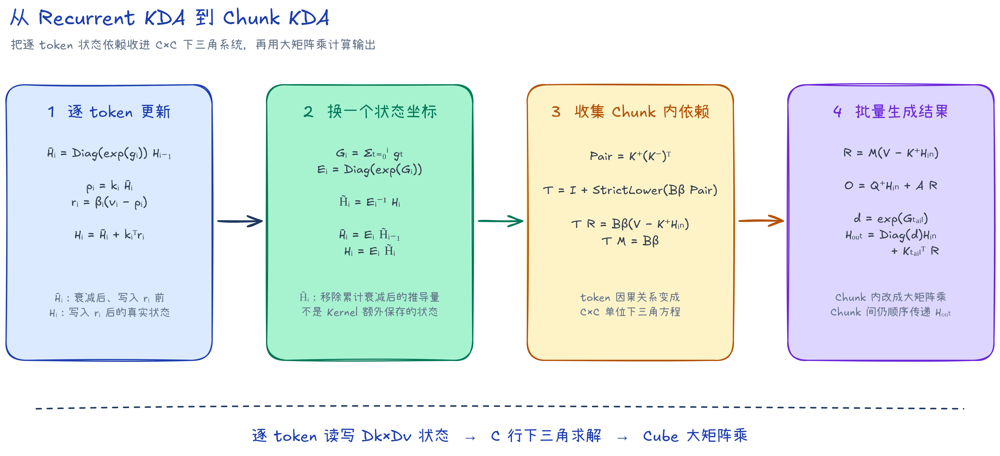

上图只概括推导路线，符号和形状从下一节开始定义。

文中的算法图和流水示意图均在 `images/` 目录保留 `.excalidraw` 源文件，PNG 用于页面展示。

---

## 数学记号

### 下标与维度

除非特别说明，token 向量均为行向量。公式省略 Batch 轴和固定为 1 的 Head 轴。

| 符号 | 含义 | 取值或形状 |
| --- | --- | --- |
| $B$ | Batch 数 | 正整数 |
| $N$ | Head 数 | 本样例固定为 1 |
| $S$ | 序列长度 | 正整数 |
| $D_k,D_v$ | Key、Value 维度 | 本样例固定 $D_k=D_v=128$ |
| $C$ | ChunkSize | 默认 32 |
| $L$ | 当前 Chunk 的有效 token 数 | $1\le L\le C$ |
| $i,j,t$ | Chunk 内 token 下标 | $0,\ldots,C-1$ |
| $d$ | Key 通道下标 | $0,\ldots,D_k-1$ |

### 输入、状态与输出

完整序列张量为：

$$
\mathbf Q,\mathbf K,\mathbf g\in\mathbb R^{S\times D_k},\qquad
\mathbf V,\mathbf O\in\mathbb R^{S\times D_v},\qquad
\boldsymbol\beta\in\mathbb R^{1\times S}.
$$

Recurrent 计算用 $\mathbf H_{i-1}$ 表示 token $i$ 开始前的状态，用 $\overline{\mathbf H}_i$ 表示衰减后、写入前的状态，用 $\mathbf H_i$ 表示写入后的状态。

Chunk 推导还会引入 $\widetilde{\mathbf H}_i$。四者的区别将在“[四种状态符号](#四种状态符号)”中集中说明。

| 符号 | 含义 | 形状 | 来源或定义 |
| --- | --- | --- | --- |
| $\mathbf Q,\mathbf K,\mathbf g$ | 全序列的 Query、Key、log 衰减 | $\mathbb R^{S\times D_k}$ | 算子输入 |
| $\mathbf V,\mathbf O$ | 全序列的 Value、输出 | $\mathbb R^{S\times D_v}$ | 输入与输出 |
| $\boldsymbol\beta$ | 全序列的更新系数 | $\mathbb R^{1\times S}$ | 算子输入 |
| $\mathbf q_i,\mathbf k_i,\mathbf g_i$ | 第 $i$ 个 token 的 Query、Key、log 衰减 | $\mathbb R^{1\times D_k}$ | $\mathbf Q,\mathbf K,\mathbf g$ 的第 $i$ 行 |
| $\mathbf v_i,\mathbf o_i$ | 第 $i$ 个 token 的 Value、输出 | $\mathbb R^{1\times D_v}$ | $\mathbf V,\mathbf O$ 的第 $i$ 行 |
| $\beta_i$ | 当前 token 的更新系数 | $\mathbb R$ | $\boldsymbol\beta$ 的第 $i$ 项 |
| $\mathbf p_i$ | Key 从衰减后状态中读出的预测 | $\mathbb R^{1\times D_v}$ | $\mathbf p_i=\mathbf k_i\overline{\mathbf H}_i$ |
| $\mathbf r_i$ | Value 与预测之间的加权残差 | $\mathbb R^{1\times D_v}$ | $\mathbf r_i=\beta_i(\mathbf v_i-\mathbf p_i)$ |
| $\mathbf H_{\mathrm{in}},\mathbf H_{\mathrm{out}}$ | 当前 Chunk 的输入、输出状态 | $\mathbb R^{D_k\times D_v}$ | 相邻 Chunk 之间传递 |

### 运算符

| 记号 | 含义 |
| --- | --- |
| $\mathbb R^{m\times n}$ | 由实数组成的 $m\times n$ 矩阵；$m=1$ 时表示行向量 |
| $\mathbf x\mathbf Y$ | 矩阵乘；行向量乘矩阵后仍为行向量 |
| $\mathbf x^\top\mathbf y$ | 列向量与行向量的外积，结果是矩阵 |
| $(\cdot)^\top$ | 转置 |
| $(\cdot)^{-1}$ | 矩阵逆；本文只对可逆的对角矩阵或单位下三角矩阵使用 |
| $\odot$ | 逐元素乘 |
| $\exp(\mathbf x)$ | 对向量或矩阵逐元素取指数 |
| $\operatorname{Diag}(\mathbf x)$ | 用行向量 $\mathbf x$ 的元素构造对角矩阵 |
| $\operatorname{StrictLower}(\mathbf X)$ | 只保留严格下三角，不含对角线 |
| $\operatorname{Lower}(\mathbf X)$ | 保留下三角和对角线 |
| $\langle\mathbf x,\mathbf y\rangle$ | 两个等长行向量的内积 |
| $\mathbf X_{i,:}$ | 矩阵 $\mathbf X$ 的第 $i$ 行 |

## Recurrent 公式

### 逐 Token 更新

状态 $\mathbf H\in\mathbb R^{D_k\times D_v}$ 可以看作一张可更新的 Key→Value 映射表。令整段 Prefill 的初始状态 $\mathbf H_{-1}=\mathbf 0$，第 $i$ 个 token 依次执行衰减、读取、写入和输出：

$$
\begin{aligned}
\boldsymbol\lambda_i &= \exp(\mathbf g_i) &&\in\mathbb R^{1\times D_k},\\
\overline{\mathbf H}_i &= \operatorname{Diag}(\boldsymbol\lambda_i)\mathbf H_{i-1} &&\in\mathbb R^{D_k\times D_v},\\
\mathbf p_i &= \mathbf k_i\overline{\mathbf H}_i &&\in\mathbb R^{1\times D_v},\\
\mathbf r_i &= \beta_i(\mathbf v_i-\mathbf p_i) &&\in\mathbb R^{1\times D_v},\\
\mathbf H_i &= \overline{\mathbf H}_i+\mathbf k_i^\top\mathbf r_i &&\in\mathbb R^{D_k\times D_v},\\
\mathbf o_i &= \mathbf q_i\mathbf H_i &&\in\mathbb R^{1\times D_v}.
\end{aligned}
$$

其中 $\overline{\mathbf H}_i$ 是“已衰减、尚未写入当前 token”的真实状态。Key 先从它读取预测 $\mathbf p_i$。

残差随后通过外积 $\mathbf k_i^\top\mathbf r_i$ 写入，得到更新后的 $\mathbf H_i$。输出 $\mathbf o_i$ 读取 $\mathbf H_i$，因此包含当前 token 的更新。

$\mathbf g_i\le 0$ 表示每个元素都不大于 0，所以 $\boldsymbol\lambda_i$ 的元素位于 `(0,1]`。$\beta_i\in\mathbb R$ 控制本次修正的幅度。本文对向量使用的 $\exp$ 均表示逐元素指数。

Recurrent 形式直接给出了算子语义，但每个 token 都要读写一次 $D_k\times D_v$ 状态，下一 token 还必须等待当前状态更新结束。

Chunk 算法不改变计算含义。它把一段 token 的递推整理成少量矩阵乘，以及一个较小的下三角求解。

## Chunk 公式

### Chunk 输入与尾块

考虑一个有效长度为 `L≤C` 的 Chunk，并从 0 重新编号其中的 token。

本节的 $\mathbf H_{-1}$ 专指 Chunk 开始前的状态，即 $\mathbf H_{-1}:=\mathbf H_{\mathrm{in}}\in\mathbb R^{D_k\times D_v}$。只有第一个 Chunk 的 $\mathbf H_{\mathrm{in}}$ 才是全零初态。

设备始终按 C 行计算。尾 Chunk 只有 `i=0,...,L-1` 有效，其余行用 $\mathbf Q=\mathbf K=\mathbf V=\mathbf 0$、$\beta=0$、$\mathbf g=\mathbf 0$ 补齐。因此本节统一使用

$$
\mathbf Q,\mathbf K,\mathbf g\in\mathbb R^{C\times D_k},\qquad
\mathbf V\in\mathbb R^{C\times D_v},\qquad
\boldsymbol\beta\in\mathbb R^{1\times C}.
$$

### 去掉逐 Token 衰减

定义累计 log-decay：

$$
\mathbf G_i=\sum_{t=0}^{i}\mathbf g_t\in\mathbb R^{1\times D_k},\qquad
\mathbf E_i=\operatorname{Diag}(\exp(\mathbf G_i))\in\mathbb R^{D_k\times D_k}.
$$

约定 $\mathbf G_{-1}=\mathbf 0$、$\mathbf E_{-1}=\mathbf I_{D_k}$。相邻累计衰减满足：

$$
\operatorname{Diag}(\exp(\mathbf g_i))=\mathbf E_i\mathbf E_{i-1}^{-1}.
$$

为了把跨 token 的连乘改写为一次坐标变换，定义只用于推导的状态：

$$
\widetilde{\mathbf H}_i=\mathbf E_i^{-1}\mathbf H_i,\qquad
\widetilde{\mathbf H}_{-1}=\mathbf H_{\mathrm{in}}.
$$

$\mathbf E_i$ 是对角矩阵，每个对角元素都是正数 $\exp((\mathbf G_i)_d)$，所以

$$
\mathbf E_i^{-1}=\operatorname{Diag}(\exp(-\mathbf G_i)).
$$

这里用到标量恒等式 $1/\exp(x)=\exp(-x)$。

$\widetilde{\mathbf H}_i$ 上方的波浪线表示坐标变换。它由更新后的真实状态 $\mathbf H_i$ 除去 Chunk 起点到 token `i` 的累计衰减得到，不是另一个计算时刻的真实状态，也不是 Kernel 额外维护的 Buffer。

横线状态和波浪线状态的关系为：

$$
\overline{\mathbf H}_i=\mathbf E_i\widetilde{\mathbf H}_{i-1},\qquad
\mathbf H_i=\mathbf E_i\widetilde{\mathbf H}_i.
$$

第一式表示：$\overline{\mathbf H}_i$ 尚未写入当前残差，所以对应上一个换算状态 $\widetilde{\mathbf H}_{i-1}$。第二式表示：$\widetilde{\mathbf H}_i$ 已包含当前残差，乘回累计衰减后才是更新完成的 $\mathbf H_i$。

### 四种状态符号

横线和波浪线很容易混淆。下表把相关状态放在同一条时间线上：

| 符号 | 含义 | 形状 | 来源（公式定义） | 所处时刻 |
| --- | --- | --- | --- | --- |
| $\mathbf H_{\mathrm{in}}=\mathbf H_{-1}$ | 当前 Chunk 的输入状态 | $\mathbb R^{D_k\times D_v}$ | 上一 Chunk 的 $\mathbf H_{\mathrm{out}}$；首 Chunk 为零 | 处理本 Chunk 之前 |
| $\mathbf H_{i-1}$ | 上一 token 更新后的真实状态 | $\mathbb R^{D_k\times D_v}$ | Recurrent 递推结果 | token $i$ 开始前 |
| $\overline{\mathbf H}_i$ | 当前衰减后的真实状态 | $\mathbb R^{D_k\times D_v}$ | $\operatorname{Diag}(\exp(\mathbf g_i))\mathbf H_{i-1}$ | 衰减后、写入当前残差前 |
| $\mathbf H_i$ | 当前 token 更新后的真实状态 | $\mathbb R^{D_k\times D_v}$ | $\overline{\mathbf H}_i+\mathbf k_i^\top\mathbf r_i$ | 写入当前残差后；供 $\mathbf o_i$ 读取 |
| $\widetilde{\mathbf H}_i$ | 去掉累计衰减后的推导坐标 | $\mathbb R^{D_k\times D_v}$ | $\widetilde{\mathbf H}_i=\mathbf E_i^{-1}\mathbf H_i$ | 与 $\mathbf H_i$ 对应，但不是运行时另一个状态 |

$\overline{\mathbf H}_i$ 的横线表示 Recurrent 中的计算时刻；$\widetilde{\mathbf H}_i$ 的波浪线表示坐标变换。Kernel 不会额外保存整块 $\widetilde{\mathbf H}_i$。

$\widetilde{\mathbf H}_{-1}=\mathbf H_{\mathrm{in}}$。处理 token 0 后，$\widetilde{\mathbf H}_0$ 已经加入当前残差，通常不再等于 $\mathbf H_{\mathrm{in}}$。把 Recurrent 更新代入可得：

$$
\begin{aligned}
\widetilde{\mathbf H}_i
&=\mathbf E_i^{-1}\left(\operatorname{Diag}(\exp(\mathbf g_i))\mathbf H_{i-1}+\mathbf k_i^\top\mathbf r_i\right)\\
&=\mathbf E_{i-1}^{-1}\mathbf H_{i-1}+\mathbf E_i^{-1}\mathbf k_i^\top\mathbf r_i\\
&=\widetilde{\mathbf H}_{i-1}+\left(\mathbf k_i\odot\exp(-\mathbf G_i)\right)^\top\mathbf r_i\\
&=\mathbf H_{\mathrm{in}}+\sum_{j=0}^{i}\left(\mathbf k_j\odot\exp(-\mathbf G_j)\right)^\top\mathbf r_j.
\end{aligned}
$$

第二行使用 $\mathbf E_i^{-1}\operatorname{Diag}(\exp(\mathbf g_i))=\mathbf E_{i-1}^{-1}$；第三行利用 $\mathbf E_i^{-1}$ 是对角矩阵，把它作用到 $\mathbf k_i^\top$ 上。

定义按行堆叠的三个变换矩阵：

$$
\mathbf Q_i^+=\mathbf q_i\odot\exp(\mathbf G_i),\quad
\mathbf K_i^+=\mathbf k_i\odot\exp(\mathbf G_i),\quad
\mathbf K_i^-=\mathbf k_i\odot\exp(-\mathbf G_i),
$$

其中 $\mathbf Q^+,\mathbf K^+,\mathbf K^-\in\mathbb R^{C\times D_k}$。

至此，逐通道衰减已经移到 Q/K 的缩放因子中，临时状态只需累加 $\left(\mathbf K_i^-\right)^\top\mathbf r_i$。

### 构造残差方程

预测值读取的是写入当前残差之前的状态：

$$
\begin{aligned}
\overline{\mathbf H}_i
&=\operatorname{Diag}(\exp(\mathbf g_i))\mathbf H_{i-1}\\
&=\mathbf E_i\widetilde{\mathbf H}_{i-1},\\
\mathbf p_i
&=\mathbf k_i\overline{\mathbf H}_i\\
&=\mathbf K_i^+\widetilde{\mathbf H}_{i-1}\\
&=\mathbf K_i^+\mathbf H_{\mathrm{in}}+
\sum_{j=0}^{i-1}\mathbf K_i^+\left(\mathbf K_j^-\right)^\top\mathbf r_j.
\end{aligned}
$$

令：

$$
\mathbf P_{\mathrm{raw}}=\mathbf K^+(\mathbf K^-)^\top\in\mathbb R^{C\times C},\qquad
(\mathbf P_{\mathrm{raw}})_{ij}=\langle\mathbf K_i^+,\mathbf K_j^-\rangle.
$$

每个标量 $(\mathbf P_{\mathrm{raw}})_{ij}$ 描述第 `j` 个残差对第 `i` 个预测的影响。因为预测时只能使用先前残差，所以这里只取 `j<i` 的严格下三角部分。

把上面的预测展开式

$$
\mathbf p_i=\mathbf K_i^+\mathbf H_{\mathrm{in}}+
\sum_{j=0}^{i-1}(\mathbf P_{\mathrm{raw}})_{ij}\mathbf r_j
$$

代入 Recurrent 残差定义 $\mathbf r_i=\beta_i(\mathbf v_i-\mathbf p_i)$，展开右侧后把历史残差项移到左边：

$$
\mathbf r_i+\beta_i\sum_{j=0}^{i-1}(\mathbf P_{\mathrm{raw}})_{ij}\mathbf r_j
=\beta_i\left(\mathbf v_i-\mathbf K_i^+\mathbf H_{\mathrm{in}}\right).
$$

把所有残差按行堆成 $\mathbf R\in\mathbb R^{C\times D_v}$，并令 $\mathbf B_\beta=\operatorname{Diag}(\boldsymbol\beta)\in\mathbb R^{C\times C}$，得到：

$$
\underbrace{\left[\mathbf I_C+\operatorname{StrictLower}(\mathbf B_\beta\mathbf P_{\mathrm{raw}})\right]}_{\mathbf T\in\mathbb R^{C\times C}}\mathbf R
=\mathbf B_\beta\left(\mathbf V-\mathbf K^+\mathbf H_{\mathrm{in}}\right).
$$

用 `C=3` 展开后，这个因果关系更直观。记 $p_{ij}=(\mathbf P_{\mathrm{raw}})_{ij}$：

$$
\begin{bmatrix}
1&0&0\\
\beta_1p_{10}&1&0\\
\beta_2p_{20}&\beta_2p_{21}&1
\end{bmatrix}
\begin{bmatrix}
\mathbf r_0\\
\mathbf r_1\\
\mathbf r_2
\end{bmatrix}
=
\begin{bmatrix}
\beta_0(\mathbf v_0-\mathbf K_0^+\mathbf H_{\mathrm{in}})\\
\beta_1(\mathbf v_1-\mathbf K_1^+\mathbf H_{\mathrm{in}})\\
\beta_2(\mathbf v_2-\mathbf K_2^+\mathbf H_{\mathrm{in}})
\end{bmatrix}.
$$

第一行直接得到 $\mathbf r_0$；第二行只依赖 $\mathbf r_0$；第三行只依赖 $\mathbf r_0,\mathbf r_1$。这就是源码逐行前向代入的原因。

### 前向代入求 M

定义：

$$
\mathbf M=\mathbf T^{-1}\mathbf B_\beta\in\mathbb R^{C\times C}.
$$

这个写法用于表达数学关系，源码不会调用通用矩阵求逆。由于 $\mathbf T$ 是对角线全为 1 的下三角矩阵，实现直接求解 $\mathbf T\mathbf M=\mathbf B_\beta$。若 $\mathbf e_i\in\mathbb R^{1\times C}$ 是第 `i` 个标准基行向量，则：

$$
\mathbf M_{i,:}=\beta_i\mathbf e_i-
\beta_i\sum_{j=0}^{i-1}(\mathbf P_{\mathrm{raw}})_{ij}\mathbf M_{j,:}.
$$

于是残差矩阵可以写成下面的连等式：

$$
\begin{aligned}
\mathbf R
&=\mathbf T^{-1}\mathbf B_\beta(\mathbf V-\mathbf K^+\mathbf H_{\mathrm{in}})\\
&=\mathbf M(\mathbf V-\mathbf K^+\mathbf H_{\mathrm{in}})\\
&=\mathbf M\mathbf V-(\mathbf M\mathbf K^+)\mathbf H_{\mathrm{in}}\\
&=\mathbf U-\mathbf W\mathbf H_{\mathrm{in}},\\
\mathbf W&=\mathbf M\mathbf K^+ &&\in\mathbb R^{C\times D_k},\\
\mathbf U&=\mathbf M\mathbf V &&\in\mathbb R^{C\times D_v},\\
\mathbf R&\in\mathbb R^{C\times D_v}.
\end{aligned}
$$

v1/v2 按 $\mathbf M(\mathbf K^+\mathbf H_{\mathrm{in}})$ 计算 prediction。v0/v3 先得到 $\mathbf W=\mathbf M\mathbf K^+$，再算 $\mathbf W\mathbf H_{\mathrm{in}}$。

实数精确算术下二者相等；BF16 的舍入位置不同，因此各版本统一以逐 token FP32 Recurrent 结果为精度参考。具体判据见“[复现方法](#复现方法)”。

### 计算输出与末状态

定义输出系数：

$$
\mathbf A_{\mathrm{raw}}=\mathbf Q^+(\mathbf K^-)^\top\in\mathbb R^{C\times C},\qquad
\mathbf A=\operatorname{Lower}(\mathbf A_{\mathrm{raw}})\in\mathbb R^{C\times C}.
$$

$\mathbf A$ 包含对角线，因为 $\mathbf o_i$ 读取的是已经写入第 $i$ 个残差后的 $\mathbf H_i$。将

$$
\mathbf H_i=\mathbf E_i\widetilde{\mathbf H}_i,\qquad
\widetilde{\mathbf H}_i=\mathbf H_{\mathrm{in}}+
\sum_{j=0}^{i}(\mathbf K_j^-)^\top\mathbf r_j
$$

代入 Recurrent 输出公式 $\mathbf o_i=\mathbf q_i\mathbf H_i$，并使用 $\mathbf Q_i^+=\mathbf q_i\mathbf E_i$：

$$
\begin{aligned}
\mathbf o_i
&=\mathbf q_i\mathbf E_i\widetilde{\mathbf H}_i\\
&=\mathbf Q_i^+\left[\mathbf H_{\mathrm{in}}+
\sum_{j=0}^{i}(\mathbf K_j^-)^\top\mathbf r_j\right]\\
&=\mathbf Q_i^+\mathbf H_{\mathrm{in}}+
\sum_{j=0}^{i}(\mathbf A_{\mathrm{raw}})_{ij}\mathbf r_j.
\end{aligned}
$$

按行堆叠后，整个 Chunk 的输出为：

$$
\mathbf O=
\underbrace{\mathbf Q^+\mathbf H_{\mathrm{in}}}_{\text{history}\in\mathbb R^{C\times D_v}}
+\underbrace{\mathbf A\mathbf R}_{\text{local}\in\mathbb R^{C\times D_v}}
\in\mathbb R^{C\times D_v}.
$$

令 $\mathbf G_{\mathrm{tail}}=\mathbf G_{L-1}$，并定义：

$$
\mathbf d=\exp(\mathbf G_{\mathrm{tail}})\in\mathbb R^{1\times D_k},\qquad
\mathbf K_i^{\mathrm{tail}}=\mathbf k_i\odot\exp(\mathbf G_{\mathrm{tail}}-\mathbf G_i),\qquad
\mathbf K^{\mathrm{tail}}\in\mathbb R^{C\times D_k}.
$$

对于尾 Chunk，$\mathbf G_{\mathrm{tail}}$ 始终取最后一个有效 token 的累计值，最终 O 只保留前 L 行。

把 $\widetilde{\mathbf H}_{L-1}$ 的展开式代入 $\mathbf H_{\mathrm{out}}=\mathbf E_{L-1}\widetilde{\mathbf H}_{L-1}$：

$$
\begin{aligned}
\mathbf H_{\mathrm{out}}
&=\mathbf E_{L-1}\widetilde{\mathbf H}_{L-1}\\
&=\mathbf E_{L-1}\mathbf H_{\mathrm{in}}+
\sum_{i=0}^{L-1}\mathbf E_{L-1}(\mathbf K_i^-)^\top\mathbf r_i\\
&=\operatorname{Diag}(\mathbf d)\mathbf H_{\mathrm{in}}
+(\mathbf K^{\mathrm{tail}})^\top\mathbf R
\in\mathbb R^{D_k\times D_v}.
\end{aligned}
$$

最后一个等号使用 $\mathbf E_{L-1}(\mathbf K_i^-)^\top=(\mathbf K_i^{\mathrm{tail}})^\top$。它表示第 $i$ 个残差从产生位置继续衰减到 Chunk 末尾。

### 公式符号总表

下表汇总推导中使用的维度、输入、状态和中间量。运算符的含义见前面的“[运算符](#运算符)”小节。

| 类别 | 符号 | 含义 | 形状或取值 | 来源（公式定义） | 所处时刻或范围 |
| --- | --- | --- | --- | --- | --- |
| 维度 | $B,N,S$ | Batch 数、Head 数、序列长度 | 正整数；本样例 $N=1$ | 接口规格 | 完整输入 |
| 维度 | $D_k,D_v$ | Key、Value 维度 | 本样例 $D_k=D_v=128$ | 接口规格 | 全程 |
| 维度 | $C,L$ | ChunkSize、尾 Chunk 有效长度 | $1\le L\le C$；默认 $C=32$ | 编译配置与输入长度 | 当前 Chunk |
| 下标 | $i,j,t,d$ | token 下标、求和下标、Key 通道下标 | $i,j,t\in[0,C)$，$d\in[0,D_k)$ | 公式约定 | 当前 Chunk |
| 输入/输出 | $\mathbf Q,\mathbf K,\mathbf g$ | Query、Key、log 衰减 | 全序列 $\mathbb R^{S\times D_k}$；Chunk 内 $\mathbb R^{C\times D_k}$ | 算子输入 | 完整序列或当前 Chunk |
| 输入 | $\mathbf V$ | Value | 全序列 $\mathbb R^{S\times D_v}$；Chunk 内 $\mathbb R^{C\times D_v}$ | 算子输入 | 完整序列或当前 Chunk |
| 输出 | $\mathbf O$ | token 输出按行堆叠 | 全序列 $\mathbb R^{S\times D_v}$；Chunk 内 $\mathbb R^{C\times D_v}$ | $\mathbf Q^+\mathbf H_{\mathrm{in}}+\mathbf A\mathbf R$ | 当前 Chunk 计算后 |
| 输入 | $\boldsymbol\beta$ | 每个 token 的更新系数 | 全序列 $\mathbb R^{1\times S}$；Chunk 内 $\mathbb R^{1\times C}$ | 算子输入 | 完整序列或当前 Chunk |
| token 行 | $\mathbf q_i,\mathbf k_i,\mathbf g_i$ | Q、K、log 衰减的第 $i$ 行 | $\mathbb R^{1\times D_k}$ | $\mathbf Q,\mathbf K,\mathbf g$ 的第 $i$ 行 | token $i$ |
| token 行 | $\mathbf v_i$ | V 的第 $i$ 行 | $\mathbb R^{1\times D_v}$ | $\mathbf V$ 的第 $i$ 行 | token $i$ |
| token 行 | $\mathbf o_i$ | token 输出 | $\mathbb R^{1\times D_v}$ | $\mathbf q_i\mathbf H_i$ | token $i$ 更新后 |
| token 标量 | $\beta_i$ | 当前 token 的更新系数 | $\mathbb R$ | $\boldsymbol\beta$ 的第 $i$ 项 | token $i$ |
| 状态 | $\mathbf H_{\mathrm{in}}=\mathbf H_{-1}$ | 当前 Chunk 的输入状态 | $\mathbb R^{D_k\times D_v}$ | 上一 Chunk 的 $\mathbf H_{\mathrm{out}}$；首 Chunk 为零 | Chunk 开始前 |
| 状态 | $\mathbf H_{\mathrm{out}}$ | 当前 Chunk 的输出状态 | $\mathbb R^{D_k\times D_v}$ | $\operatorname{Diag}(\mathbf d)\mathbf H_{\mathrm{in}}+(\mathbf K^{\mathrm{tail}})^\top\mathbf R$ | Chunk 结束后 |
| 状态 | $\mathbf H_{i-1}$ | token $i$ 开始前的真实状态 | $\mathbb R^{D_k\times D_v}$ | 上一 token 的更新结果 | 衰减前 |
| 状态 | $\overline{\mathbf H}_i$ | 已衰减、未写入当前残差的真实状态 | $\mathbb R^{D_k\times D_v}$ | $\operatorname{Diag}(\exp(\mathbf g_i))\mathbf H_{i-1}$ | 读取 prediction 前 |
| 状态 | $\mathbf H_i$ | 写入当前残差后的真实状态 | $\mathbb R^{D_k\times D_v}$ | $\overline{\mathbf H}_i+\mathbf k_i^\top\mathbf r_i$ | 计算 $\mathbf o_i$ 前 |
| 推导状态 | $\widetilde{\mathbf H}_i$ | 去掉累计衰减后的坐标 | $\mathbb R^{D_k\times D_v}$ | $\mathbf E_i^{-1}\mathbf H_i$；$\widetilde{\mathbf H}_{-1}=\mathbf H_{\mathrm{in}}$ | 与 $\mathbf H_i$ 对应；不单独存储 |
| token 中间量 | $\mathbf p_i$ | Key 从衰减后状态读出的预测 | $\mathbb R^{1\times D_v}$ | $\mathbf k_i\overline{\mathbf H}_i$ | 写入当前残差前 |
| token 中间量 | $\mathbf r_i$ | 加权残差 | $\mathbb R^{1\times D_v}$ | $\beta_i(\mathbf v_i-\mathbf p_i)$ | token $i$ 的状态更新 |
| 衰减 | $\boldsymbol\lambda_i$ | 当前 token 的逐通道衰减 | $\mathbb R^{1\times D_k}$ | $\exp(\mathbf g_i)$ | token $i$ |
| 衰减 | $\mathbf G_i$ | 从 Chunk 起点累计到 $i$ 的 log 衰减 | $\mathbb R^{1\times D_k}$ | $\sum_{t=0}^{i}\mathbf g_t$；$\mathbf G_{-1}=\mathbf 0$ | token $i$ |
| 衰减 | $\mathbf G_{\mathrm{tail}}$ | 最后一个有效 token 的累计 log 衰减 | $\mathbb R^{1\times D_k}$ | $\mathbf G_{L-1}$ | Chunk 末尾 |
| 衰减 | $\mathbf E_i$ | 累计衰减的对角矩阵 | $\mathbb R^{D_k\times D_k}$ | $\operatorname{Diag}(\exp(\mathbf G_i))$；$\mathbf E_i^{-1}=\operatorname{Diag}(\exp(-\mathbf G_i))$ | token $i$ |
| 变换行 | $\mathbf Q_i^+,\mathbf K_i^+$ | 吸收正向累计衰减后的 Q/K 行 | $\mathbb R^{1\times D_k}$ | $\mathbf q_i\odot\exp(\mathbf G_i)$、$\mathbf k_i\odot\exp(\mathbf G_i)$ | token $i$ |
| 变换行 | $\mathbf K_i^-$ | 去掉累计衰减后的 K 行 | $\mathbb R^{1\times D_k}$ | $\mathbf k_i\odot\exp(-\mathbf G_i)$ | token $i$ |
| 变换矩阵 | $\mathbf Q^+,\mathbf K^+,\mathbf K^-$ | 将上述行按 token 堆叠 | $\mathbb R^{C\times D_k}$ | 行堆叠 | 当前 Chunk |
| 系数矩阵 | $\mathbf P_{\mathrm{raw}}$ | 历史残差对后续 prediction 的系数 | $\mathbb R^{C\times C}$ | $\mathbf K^+(\mathbf K^-)^\top$ | 当前 Chunk |
| 系数标量 | $p_{ij}$ | $\mathbf P_{\mathrm{raw}}$ 的第 $(i,j)$ 项 | $\mathbb R$ | $(\mathbf P_{\mathrm{raw}})_{ij}$ | `C=3` 展开式 |
| 对角矩阵 | $\mathbf B_\beta$ | beta 对角矩阵 | $\mathbb R^{C\times C}$ | $\operatorname{Diag}(\boldsymbol\beta)$ | 当前 Chunk |
| 单位矩阵 | $\mathbf I_C,\mathbf I_{D_k}$ | $C$ 阶、$D_k$ 阶单位矩阵 | $\mathbb R^{C\times C}$、$\mathbb R^{D_k\times D_k}$ | 对角线为 1 | 下三角方程、衰减初值 |
| 下三角系统 | $\mathbf T$ | 残差方程的单位下三角系数矩阵 | $\mathbb R^{C\times C}$ | $\mathbf I_C+\operatorname{StrictLower}(\mathbf B_\beta\mathbf P_{\mathrm{raw}})$ | 当前 Chunk |
| 基向量 | $\mathbf e_i$ | 第 $i$ 个标准基行向量 | $\mathbb R^{1\times C}$ | 第 $i$ 项为 1，其余为 0 | 求 $\mathbf M$ 第 $i$ 行 |
| 下三角解 | $\mathbf M$ | 将右端项映射为残差 | $\mathbb R^{C\times C}$ | $\mathbf T\mathbf M=\mathbf B_\beta$ | 当前 Chunk |
| 残差矩阵 | $\mathbf R$ | 将 $\mathbf r_i$ 按行堆叠 | $\mathbb R^{C\times D_v}$ | $\mathbf M(\mathbf V-\mathbf K^+\mathbf H_{\mathrm{in}})$ | 当前 Chunk |
| 残差分量 | $\mathbf U$ | 残差中只依赖 V 的部分 | $\mathbb R^{C\times D_v}$ | $\mathbf M\mathbf V$ | 当前 Chunk |
| 残差分量 | $\mathbf W$ | 将输入状态映射到 prediction 的矩阵 | $\mathbb R^{C\times D_k}$ | $\mathbf M\mathbf K^+$ | 当前 Chunk |
| 残差分量 | $\mathrm{KPlusState}$ | K+ 读取 Chunk 输入状态的结果 | $\mathbb R^{C\times D_v}$ | $\mathbf K^+\mathbf H_{\mathrm{in}}$ | v1/v2 StateOutput |
| 残差分量 | $\mathrm{prediction}$ | 从 U 中扣除的状态预测 | $\mathbb R^{C\times D_v}$ | $\mathbf M\,\mathrm{KPlusState}=\mathbf W\mathbf H_{\mathrm{in}}$ | 计算 R 之前 |
| 输出系数 | $\mathbf A_{\mathrm{raw}}$ | 每个残差对每个输出的系数 | $\mathbb R^{C\times C}$ | $\mathbf Q^+(\mathbf K^-)^\top$ | 当前 Chunk |
| 输出系数 | $\mathbf A$ | 只保留因果项的输出系数 | $\mathbb R^{C\times C}$ | $\operatorname{Lower}(\mathbf A_{\mathrm{raw}})$ | 当前 Chunk |
| 输出分量 | $\mathrm{history}$ | 输入状态对输出的贡献 | $\mathbb R^{C\times D_v}$ | $\mathbf Q^+\mathbf H_{\mathrm{in}}$ | 当前 Chunk |
| 输出分量 | $\mathrm{local}$ | Chunk 内残差对输出的贡献 | $\mathbb R^{C\times D_v}$ | $\mathbf A\mathbf R$ | 当前 Chunk |
| 状态增量 | $\boldsymbol\Delta$（`delta`） | 当前 Chunk 写入状态的增量 | $\mathbb R^{D_k\times D_v}$ | $(\mathbf K^{\mathrm{tail}})^\top\mathbf R$ | 更新末状态时 |
| 末状态 | $\mathbf d$ | 输入状态传到 Chunk 末尾的衰减 | $\mathbb R^{1\times D_k}$ | $\exp(\mathbf G_{\mathrm{tail}})$ | Chunk 末尾 |
| 末状态 | $\mathbf K_i^{\mathrm{tail}}$ | 第 $i$ 个残差传到 Chunk 末尾的 K 行 | $\mathbb R^{1\times D_k}$ | $\mathbf k_i\odot\exp(\mathbf G_{\mathrm{tail}}-\mathbf G_i)$ | token $i$ 到 Chunk 末尾 |
| 末状态 | $\mathbf K^{\mathrm{tail}}$ | 将 $\mathbf K_i^{\mathrm{tail}}$ 按行堆叠 | $\mathbb R^{C\times D_k}$ | 行堆叠 | 当前 Chunk |
| 稳定缩放 | $\mathbf a$ | v2/v3 的 anchor | $\mathbb R^{1\times D_k}$ | $\mathbf G_{\mathrm{tail}}/2$ | Prepare，每个 Chunk、每个 Dk 通道 |
| 稳定缩放 | $\widehat{\mathbf Q}_i$（`QFactor_i`） | anchor 平移后的 Query 行 | $\mathbb R^{1\times D_k}$ | $\mathbf q_i\odot\exp(\mathbf G_i-\mathbf a)$ | v2/v3 Prepare |
| 稳定缩放 | $\widehat{\mathbf K}_i$（`KFactor_i`） | anchor 平移后的正向 Key 行 | $\mathbb R^{1\times D_k}$ | $\mathbf k_i\odot\exp(\mathbf G_i-\mathbf a)$ | v2/v3 Prepare |
| 稳定缩放 | $\widehat{\mathbf K}^{-}_i$（`KInvFactor_i`） | anchor 平移后的反向 Key 行 | $\mathbb R^{1\times D_k}$ | $\mathbf k_i\odot\exp(\mathbf a-\mathbf G_i)$ | v2/v3 Prepare |

### NPU Kernel 公式速查

下面只保留 Kernel 需要实现的最终公式。公式以一个补齐到 $C$ 行的 Chunk 为单位，所有向量均为行向量。这里写完整的 $D_v$ 列；当前固定 $D_v=128$，以 `DV_TILE=D_v/4=32` 分四次计算，每个 tile 使用同样的公式。

#### 1. 生成 Chunk 只读矩阵

先累计衰减，并取最后一个有效 token 的累计值：

$$
\mathbf G_i=\sum_{t=0}^{i}\mathbf g_t,\qquad
\mathbf G_{\mathrm{tail}}=\mathbf G_{L-1},\qquad
\mathbf d=\exp(\mathbf G_{\mathrm{tail}}).
$$

逐行生成后续矩阵乘需要的 Q/K：

$$
\begin{aligned}
\mathbf Q_i^+&=\mathbf q_i\odot\exp(\mathbf G_i),\\
\mathbf K_i^+&=\mathbf k_i\odot\exp(\mathbf G_i),\\
\mathbf K_i^-&=\mathbf k_i\odot\exp(-\mathbf G_i),\\
\mathbf K_i^{\mathrm{tail}}&=\mathbf k_i\odot
\exp(\mathbf G_{\mathrm{tail}}-\mathbf G_i).
\end{aligned}
$$

按行堆叠后，$\mathbf Q^+,\mathbf K^+,\mathbf K^-,\mathbf K^{\mathrm{tail}}\in\mathbb R^{C\times D_k}$。关系矩阵为：

$$
\mathbf P_{\mathrm{raw}}=\mathbf K^+(\mathbf K^-)^\top,\qquad
\mathbf A_{\mathrm{raw}}=\mathbf Q^+(\mathbf K^-)^\top.
$$

v2/v3 不直接保存 $\mathbf K^-$，而是使用 anchor 控制指数范围。令

$$
\mathbf a=\frac{\mathbf G_{\mathrm{tail}}}{2},\qquad
\widehat{\mathbf Q}_i=\mathbf q_i\odot\exp(\mathbf G_i-\mathbf a),\qquad
\widehat{\mathbf K}_i=\mathbf k_i\odot\exp(\mathbf G_i-\mathbf a),
$$

$$
\widehat{\mathbf K}^{-}_i=\mathbf k_i\odot\exp(\mathbf a-\mathbf G_i).
$$

实际送入 Cube 的等价公式是：

$$
\mathbf P_{\mathrm{raw}}=\widehat{\mathbf K}(\widehat{\mathbf K}^{-})^\top,\qquad
\mathbf A_{\mathrm{raw}}=\widehat{\mathbf Q}(\widehat{\mathbf K}^{-})^\top.
$$

#### 2. 求 M 和 A

$$
\mathbf B_\beta=\operatorname{Diag}(\boldsymbol\beta),\qquad
\mathbf T=\mathbf I_C+\operatorname{StrictLower}(\mathbf B_\beta\mathbf P_{\mathrm{raw}}).
$$

不需要计算通用矩阵逆。按行前向代入求解 $\mathbf T\mathbf M=\mathbf B_\beta$：

$$
\mathbf M_{i,:}=\beta_i\mathbf e_i-
\beta_i\sum_{j=0}^{i-1}(\mathbf P_{\mathrm{raw}})_{ij}\mathbf M_{j,:}.
$$

输出系数只保留包含对角线的下三角部分：

$$
\mathbf A=\operatorname{Lower}(\mathbf A_{\mathrm{raw}}).
$$

若采用 W 路径，再计算：

$$
\mathbf W=\mathbf M\mathbf K^+\in\mathbb R^{C\times D_k}.
$$

#### 3. 计算残差

$$
\mathbf U=\mathbf M\mathbf V\in\mathbb R^{C\times D_v}.
$$

prediction 有两种实数等价的计算顺序：

$$
\begin{aligned}
\text{v1/v2:}\quad
\mathrm{KPlusState}&=\mathbf K^+\mathbf H_{\mathrm{in}},&
\mathrm{prediction}&=\mathbf M\,\mathrm{KPlusState},\\
\text{v0/v3:}\quad
\mathbf W&=\mathbf M\mathbf K^+,&
\mathrm{prediction}&=\mathbf W\mathbf H_{\mathrm{in}}.
\end{aligned}
$$

两条路径最后都计算：

$$
\mathbf R=\mathbf U-\mathrm{prediction}
=\mathbf M(\mathbf V-\mathbf K^+\mathbf H_{\mathrm{in}})
\in\mathbb R^{C\times D_v}.
$$

#### 4. 生成 O 和下一 Chunk 状态

$$
\begin{aligned}
\mathrm{history}&=\mathbf Q^+\mathbf H_{\mathrm{in}},\\
\mathrm{local}&=\mathbf A\mathbf R,\\
\mathbf O&=\mathrm{history}+\mathrm{local}
\in\mathbb R^{C\times D_v},\\
\boldsymbol\Delta&=(\mathbf K^{\mathrm{tail}})^\top\mathbf R
\in\mathbb R^{D_k\times D_v},\\
\mathbf H_{\mathrm{out}}&=\operatorname{Diag}(\mathbf d)\mathbf H_{\mathrm{in}}+\boldsymbol\Delta
\in\mathbb R^{D_k\times D_v}.
\end{aligned}
$$

下一 Chunk 使用当前的 $\mathbf H_{\mathrm{out}}$ 作为 $\mathbf H_{\mathrm{in}}$，因此同一状态链上的 Chunk 必须按顺序推进。一个 Chunk 内的依赖关系可压缩为：

```text
G -> Q+/K+/Ktail + Praw/Araw -> M/A -> W（可选）
M + V -> U
H_in + K+ + M -> prediction（v1/v2）
H_in + W -> prediction（v0/v3）
H_in + Q+ -> history
U + prediction -> R
R + A/Ktail -> local、delta
history + local -> O；d + H_in + delta -> H_out
H_out(c) -> H_in(c+1)
```

尾 Chunk 仍按 C 行执行。无效行的 Q/K/V、beta 置零，g 置零；$\mathbf G_{\mathrm{tail}}$ 固定取 $\mathbf G_{L-1}$，最终只写出 O 的前 L 行。

至此，Chunk 内的逐 token 递推变成了两个 $C\times C$ 关系矩阵、一个 $C\times C$ 下三角求解，以及若干矩阵乘。

Chunk 之间仍按顺序传递 $\mathbf H_{\mathrm{out}}$。Chunk 内的大部分工作则可以并行执行。

---

## 硬件映射

### 一组 Mix 如何分工

源码中的 `Pair` 对应 $\mathbf P_{\mathrm{raw}}$，`Araw` 对应 $\mathbf A_{\mathrm{raw}}$，`state_decay` 对应 $\mathbf d$。

`history` 和 `local` 分别对应 $\mathbf Q^+\mathbf H_{\mathrm{in}}$ 与 $\mathbf A\mathbf R$。

需要 Cube/Vector 协作的 Kernel 使用 `__mix(1,2)__`：一个 Mix 组包含 1 个 AIC 和 2 个 AIV。AIC 负责矩阵乘，两路 AIV 负责逐元素计算、状态更新和数据整理。v1 的 Prepare 是纯 AIV Kernel。

AIC/AIV 是核心，MTE、Cube、Fixpipe 和 PUSHQ 是核心内部的 Pipe 或任务队列，两者不在同一层级：

```text
Mix 组
├─ AIC
│  ├─ AIC_MTE2：GM -> L1
│  ├─ AIC_MTE1：L1 -> L0A/L0B
│  ├─ AIC_Cube：MMAD 等矩阵计算
│  └─ AIC_FIXP：L0C -> GM/L1/AIV UB
├─ AIV0
│  ├─ AIV_MTE2：GM -> UB
│  ├─ AIV_PUSHQ：向 Vector 单元提交 VF 及其参数
│  └─ AIV_MTE3：UB -> GM/AIC L1
└─ AIV1：与 AIV0 具有相同的核内层级
```

在 StateOutput 中，固定 $D_v=128$ 被分成四个 `DV_TILE=32` 列块，同一 Mix 组中的 AIV0/AIV1 各处理 16 列。这里的 32 和 16 来自 Value 维切分，与默认 `C=32` 无关。Prepare 采用的切分方式见各版本章节。

| 核心 | 处理的数据 | 主要工作 |
| --- | --- | --- |
| AIC | StateOutput 的 32 个 Dv 列；Prepare 的 $C\times C$ 关系矩阵和 $C\times D_k$ 矩阵 | 按版本计算 Pair/Araw、U、prediction、history、delta、local 和 W；矩阵乘结果在 L0C 中以 FP32 累加。 |
| AIV0 | StateOutput 的前 16 个 Dv 列；v2/v3 Prepare 中的一个完整 Chunk | 计算衰减、前向代入、R 和低半区状态；整理 AIC 输入和结果。 |
| AIV1 | StateOutput 的后 16 个 Dv 列；v2/v3 Prepare 中的另一个完整 Chunk | 执行与 AIV0 对称的列半区工作，或独立处理成对任务中的另一个 Chunk。 |

后文的 CANNSIM 流水图按这个层级展开：AIC 关注 MTE2、MTE1、Cube 和 FIXP；AIV 关注 MTE2、PUSHQ 和 MTE3。PUSHQ 下的 `VF` 表示一次 Vector Function 任务，`PUSH_PB` 表示向 VF 传入参数。没有活动的泳道会省略。

真机 PipeTimeline 只给出采样后的 `VECTOR` 忙碌区间，不再细分 VF 和 `PUSH_PB`。因此 CANNSIM 用于核对任务入队和执行顺序，PipeTimeline 用于观察真机上的宏观忙碌区间与重叠。

### AIC 与两路 AIV 的数据交接

StateOutput 采用两种固定的数据交接方式：

1. `AIV0 [rows,16] + AIV1 [rows,16] -> L1 [rows,32] -> AIC`。两路 AIV 写共享 L1 的相邻列，AIC 等两路都完成后读取完整矩阵。
2. `AIC [rows,32] -> Fixpipe -> AIV0/AIV1`。Fixpipe 把前 16 列写给 AIV0，后 16 列写给 AIV1。

v2/v3 Prepare 的切分方式不同：AIV0 和 AIV1 各处理一个完整 Chunk，AIC 将完整的 $C\times C$ Pair/Araw 定向写回对应 AIV。

跨核同步事件（源码中的 `CrossCore`）只传递“数据就绪”和“槽位可复用”状态，不搬运数值。共享 L1 或定向 Fixpipe 负责实际数据路径；Mutex 只管理单个核心内部的片上槽位。

### 数据精度

外部输入、输出和 workspace 主要采用 BF16：

- Q、K、V、beta、最终 O 和 `final_state`；
- Q+/K+/Ktail、M、A、W 等 Cube 输入；
- AIV 发布给 AIC 的 BF16 状态副本（源码中称 `state shadow`）和 R；
- v1/v2 prediction 路径中的 `KPlusState`。

以下计算或状态采用 FP32：

- `log_decay`、累计 $\mathbf G$、指数和 `state_decay`；
- $\mathbf M$ 的逐行前向代入，完成后再转成 BF16；
- Pair/Araw 以及其他 Cube 结果在 L0C 中的累加；
- AIV 保存和更新的内部递推 state；
- U/prediction 的交接、R 的减法，以及状态逐元素更新。

R 在 AIV 中以 FP32 计算，转成 BF16 后再供 AIC 计算 delta/local。状态更新也在 FP32 中完成，同时转换为 BF16 状态副本。下一次 AIC 矩阵乘读取这份副本，`final_state` 也直接从最新副本写入 GM；内部 FP32 state 不落盘。

因此，这里的 FP32 只表示内部状态更新和部分中间计算的类型，不表示对外输出或整条链路具备 FP32 精度。R、BF16 状态副本和多个 Cube 输入仍受 BF16 舍入影响。版本改变矩阵结合顺序时，也会改变舍入位置；统一的逐 token FP32 Recurrent 参考用于检查算子语义是否保持。

---

## 复现方法

### 编译与正确性

CANN Toolkit 不在默认位置时，先设置安装路径：

```bash
export ASCEND_HOME_PATH=/path/to/ascend-toolkit/latest
```

安装数据生成和校验脚本的依赖：

```bash
python3 -m pip install -r Samples/2_Performance/kimi_delta_attn_lite_story/requirements.txt
```

在 cann-samples 根目录构建全部版本：

```bash
cmake -S . -B build -DNPU_ARCH=dav-3510
cmake --build build --target kimi_delta_attn_lite_story -j
```

只构建一个版本时，可直接指定对应目标：

```bash
cmake --build build --target kdalite_v3 -j
```

非默认 ChunkSize 在配置阶段选择。例如，把 v3 构建为 C16：

```bash
cmake -S . -B build-c16 -DNPU_ARCH=dav-3510 -DKDALITE_V3_CHUNK_SIZE=16
cmake --build build-c16 --target kdalite_v3 -j
```

| CMake 选项 | 合法值 |
| --- | --- |
| `KDALITE_V0_CHUNK_SIZE`、`KDALITE_V1_CHUNK_SIZE` | 16、32、64 |
| `KDALITE_V2_CHUNK_SIZE`、`KDALITE_V3_CHUNK_SIZE` | 16、32 |

小规格运行会生成逐 token FP32 Recurrent 参考，同时检查 BF16 O 和 BF16 `final_state`：

```bash
for v in 0 1 2 3; do
  ./build/Samples/2_Performance/kimi_delta_attn_lite_story/kdalite_v${v} --size 2 65
done
```

各版本的数据文件保存在 `build/Samples/2_Performance/kimi_delta_attn_lite_story/data/kdalite_vN`。快速检查 Kernel 能否正常执行时，可以跳过参考计算和比对：

```bash
./build/Samples/2_Performance/kimi_delta_attn_lite_story/kdalite_v3 --dry-run --size 32 4096
```

这个命令只用于运行演示，不是后文性能表的采集规格。

| 参数 | 含义 |
| --- | --- |
| `--size B S` | 设置 Batch 和序列长度；默认 `B=1,S=16`。 |
| `--core-num n` | 设置 Mix 组数上限；不传时使用设备全部 Mix 组。 |
| `--dry-run` | 仍执行 Kernel、同步、结果回传和落盘，只跳过参考计算与比对。 |

不加 `--dry-run` 时会执行参考计算和结果比对；尾 Chunk 由实现自动补齐。

参考程序先在 FP32 中递推得到 O 和末状态。NPU 的 BF16 输出转为 FP32 后，直接与未量化的 FP32 Golden 计算归一化均方根误差（NRMSE）：

```text
NRMSE = RMS(NPU_FP32 - Golden_FP32) / (RMS(Golden_FP32) + 1e-8)
```

O 和 `final_state` 分别要求 `NRMSE < 0.006`；NaN 或 Inf 直接判为失败。

该判据与 [FLA 的 FlashKDA 单测](https://github.com/fla-org/flash-linear-attention/blob/main/tests/ops/test_kda.py) 一致，计算式对应 [FLA `assert_close`](https://github.com/fla-org/flash-linear-attention/blob/main/fla/utils/_testing.py) 中的 `RMSE(error) / (RMS(reference) + 1e-8)`。MoonshotAI 的 [FlashKDA 对比测试](https://github.com/MoonshotAI/FlashKDA/blob/master/tests/test_fwd.py) 也采用相同指标，并按场景使用 0.005～0.006 的阈值。

`golden_o.bin` 与 `golden_final_state.bin` 直接保存未量化的 FP32 Recurrent Golden。NPU 输出文件保持接口的 BF16 dtype，验证脚本读入后将其转为 FP32，再与 Golden 计算 NRMSE。

CANN 9.2、C32、`B=1,S=33,core-num=1` 的校验覆盖 random、`beta=0/1`、无衰减、强衰减和混合衰减。v0～v3 共 24 项设备用例，全部通过：

通过 `KDA_DATA_CASE=random|beta_zero|beta_one|no_decay|strong_decay|mixed_decay` 选择输入。例如：

```bash
KDA_DATA_CASE=strong_decay ./build/Samples/2_Performance/kimi_delta_attn_lite_story/kdalite_v3 --size 2 65
```

| 版本 | random O NRMSE | random final_state NRMSE | 六类输入 O 最大值 | 六类输入 final_state 最大值 |
| --- | ---: | ---: | ---: | ---: |
| v0 | 0.002941 | 0.002840 | 0.003079 | 0.003058 |
| v1 | 0.002932 | 0.002840 | 0.003082 | 0.003056 |
| v2 | 0.003525 | 0.002886 | 0.003676 | 0.003120 |
| v3 | 0.003519 | 0.002880 | 0.003678 | 0.003110 |

四个版本还使用统一的大规格 random 输入 `B=32,S=4096` 做主验收，结果如下：

| 版本 | O NRMSE | final_state NRMSE |
| --- | ---: | ---: |
| v0 | 0.003383 | 0.002968 |
| v1 | 0.003382 | 0.002967 |
| v2 | 0.003830 | 0.002995 |
| v3 | 0.003829 | 0.002992 |

兼容性方面，v0～v3 还分别使用 CANN 9.0.0 完成 `B=1,S=33,core-num=1` 的独立构建与 NRMSE 校验，结果全部通过。

### 性能统计

| 数据 | 规格 | 用途 | 解读边界 |
| --- | --- | --- | --- |
| 统一真机性能 | CANN 9.2、C32、全核、`B=32,S=65536` | 比较 v0～v3 的 Kernel 时间 | 不是 Host 端到端耗时 |
| 真机 PipeTimeline | CANN 9.2、C32、`B=32,S=4096`、core0 | 观察核内 Pipe 的 active、空洞和重叠 | 不同 Pipe 的 active 不能相加成 Kernel 时间 |
| CANNSIM | CANN 9.2、C32、1 个 Mix 组、`B=1,S=256` | 核对发射顺序和 AIC/AIV 同步 | 仿真周期不能替代真机性能 |

三类数据的规格和用途不同，数值不可直接换算或合并。

CANNSIM 表格中的“调度跨度”取自 `npusim.log` 中同一 Kernel 的 task begin/done 差值；组件 active、`MMAD` 次数和重叠率则从对应 Kernel 的 core0 trace 统计。

统一性能采集一次覆盖该版本的全部 Kernel。下例是 v3；重复三次后，对同名 Kernel 的 `Task Duration` 分别取中位数，再求和：

```bash
msopprof --warm-up=5 --launch-count=2 \
  --aic-metrics=BasicInfo --replay-mode=kernel \
  --output=<profiling-output> \
  ./build/Samples/2_Performance/kimi_delta_attn_lite_story/kdalite_v3 \
  --dry-run --size 32 65536
```

`--launch-count` 是一次采集覆盖的 Kernel 数；v0 设为 3，v1～v3 设为 2。`--warm-up=5` 先预热 5 次，`--replay-mode=kernel` 复放被采集的 Kernel。需要查看流水时，将指标改为 `PipeTimeline`；CANNSIM 只用于核对发射与同步顺序。

后文的 CANNSIM 图来自 Chrome Trace 视图。AIC 展开 `MTE2_EXEC/MTE1_EXEC/CUBE_EXEC/FIXP_EXEC`；AIV0/AIV1 分别展开 `MTE2_EXEC`、PUSHQ 下的 `PUSHQ_EXEC` 与 `PUSH_PB`、以及 `MTE3_EXEC`。

后文截图统一保留 AIV0 和 AIV1。即使两路调度对称，也保留两条泳道，以便检查 16+16 列切分和“两路都完成后 AIC 才继续”的同步关系。

真机 PipeTimeline 的色块可能合并多条连续指令，可用于比较流水连续性和 Pipe 重叠，但不能据此将单个空档归因到具体 Set/Wait。

流水图的图注给出截图所在的时间窗口，单位与截图顶部标尺一致。

---

## v0：三 Kernel 分阶段实现

### 实现

v0 将 Chunk KDA 直接拆成三个 `__mix(1,2)__` Kernel。每个 Kernel 使用单物理槽，没有 v1 之后的显式双槽滚动；槽位释放后，不同 Pipe 与相邻任务仍可出现局部重叠：

```text
Prepare(batch, chunk)
  -> W、U、A、Q_plus、K_tail、G_last
  -> StateUpdate(batch, dvTile)
       -> R、history、state_out
       -> LocalOutput(batch, chunk, dvTile)
            -> history + A@R -> O
```

Prepare 中，AIV 计算 Exp、累计衰减和 M，AIC 计算 `W=M@K_plus` 与 `U=M@V`。

StateUpdate 每个 Chunk 做三类矩阵乘：`W@state` 得到 prediction，`Q_plus@state` 得到 history，`K_tail.T@R` 得到 delta。

两路 AIV 在 `UpdateStateAndShadowVF` 中同时完成 FP32 state 更新和 BF16 状态副本生成。最后一个 Chunk 结束后，StateUpdate 直接把最新的状态副本写成 BF16 `final_state`。

LocalOutput 再计算 `A@R`，最后由 AIV 相加 `history+local`。

StateUpdate 包含三类矩阵乘，LocalOutput 包含一类。实际 `MMAD` 次数还取决于分块和任务数。

单槽和三段 GM 交接使计算边界清晰，但每个 Chunk 都要保存 W、U、R、history 等中间量。默认 C32 workspace 为 68096 B/Chunk。

三个 Kernel 还带来两次全局阶段等待。LocalOutput 也需要额外一次 launch 和 GM 读取。

### 三个 Kernel 的 AIC/AIV 交接

v0 的三个 Kernel 都是 `__mix(1,2)__`，但采用单槽执行。下图只按数据依赖对齐，不按真实周期缩放。

#### Prepare

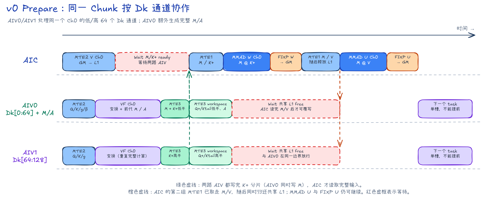

- AIV0/AIV1 处理同一个 Chunk，分别写 K+ 的低/高 64 个 Dk 通道；AIV0 还生成完整 M/A。
- AIC 等两路都写完后，读取完整 M/K+ 计算 W，再读取 M/V 计算 U。
- AIC 的第二组 MTE1 取走 M/V 后便归还共享 L1。此时两路 AIV 可以结束等待，AIC 的 U 矩阵乘和写回仍可继续。

#### StateUpdate

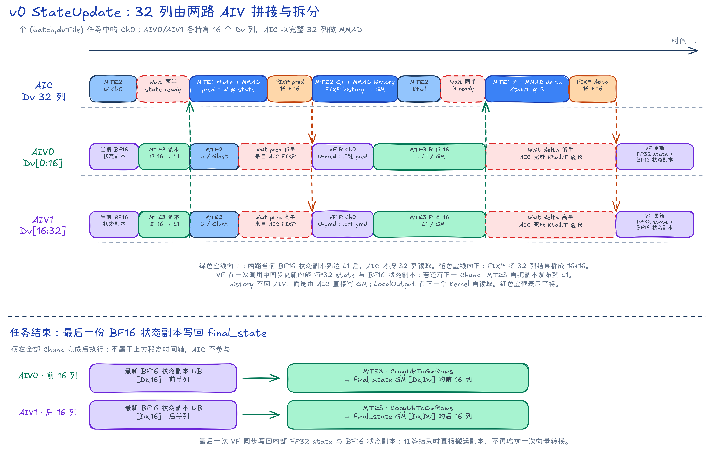

- 两路 AIV 各维护 16 个 Dv 列，并把 state/R 的两个半块写到共享 L1；AIC 等两半都到达后按 32 列读取。
- AIC 的 prediction/delta 均为 32 列，Fixpipe 再按 `16+16` 列写入 AIV0/AIV1。
- history 由 AIC 直接写 GM，不回到 AIV；下一 Kernel 再把它与 local 合并。

#### LocalOutput

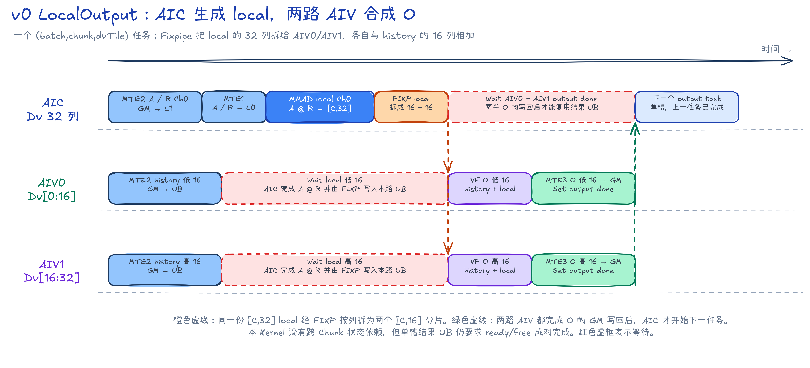

- AIC 计算完整的 $\mathbf{local}=\mathbf A\mathbf R\in\mathbb R^{C\times32}$，Fixpipe 将其拆成两个 $[C,16]$ 半块。
- AIV0/AIV1 分别读取 history 的低/高 16 列，计算 `history+local` 并写回 O。
- AIC 等两路 O 都写完后才复用单槽结果 UB，开始下一个 output task。

### 并行设计

- `Prepare` 的任务数为 $B\lceil S/C\rceil$，不同 `(batch,chunk)` 可以分到不同 Mix 组。
  - AIV0/AIV1 都读取完整 Q/K/g 并计算变换，各自输出 64 个 Dk 通道；AIV0 还读取 beta，求完整 M/A。
  - AIC 等完整 M、拼接后的 K+ 和 V 就绪，再计算 W/U。
  - 单物理槽限制了在途任务数；AIC 读走共享 L1 数据并归还槽位后，下一任务的 AIV 可以与上一任务尚未结束的 Cube/Fixpipe 局部重叠。
- `StateUpdate` 的任务数为 $B(D_v/32)=4B$。每个任务负责一个 `(batch,dvTile)`，并按 Chunk 顺序推进该状态切片。
  - AIV0 保存前 16 个 Dv 列，AIV1 保存后 16 列。
  - AIC 读取拼接后的 32 列 state/R，计算 prediction、history 和 delta。
  - 不同 Batch 或 DvTile 可以并行，同一任务内的 Chunk 必须串行。
- `LocalOutput` 的任务数为 $B\lceil S/C\rceil(D_v/32)$，各 `(batch,chunk,dvTile)` 彼此独立。
  - AIC 计算完整 32 列 local，Fixpipe 按 `16+16` 列交给两路 AIV。
  - AIV0/AIV1 分别完成自己的 `history+local` 并写 O。

### 性能与设计取舍

统一规格下，v0 的 Prepare、StateUpdate、LocalOutput 分别耗时 17450.373047、15919.649414、7958.541992 us，合计 41328.564453 us。

Prepare 和 StateUpdate 是主要耗时，独立 LocalOutput 也占总 Kernel 时间的 19.26%。在 `B=1,S=256,C=32,core-num=1` 的 CANNSIM 短规格中，三个 Kernel 的调度跨度分别为 70128、42713、16786 cycles，各 Kernel 调度跨度之和为 129627 cycles。周期只用于观察分阶段执行和单槽发射造成的空洞，不与真机时间直接换算。

**StateUpdate Kernel 仿真流水**

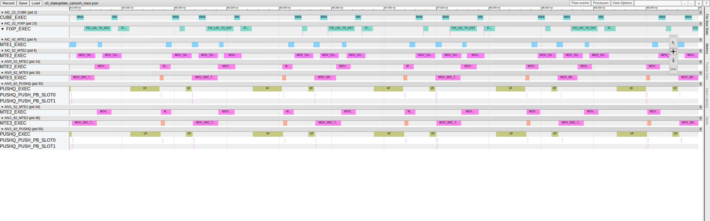

*图：v0 StateUpdate CANNSIM trace 中的 `[84,000, 90,000] ns` 稳态窗口。AIV0/AIV1 各处理 Dv 的 16 列并发布 state/R，AIC 在两半就绪后处理完整 32 列；窗口展示 AIC 的 MTE2/MTE1/Cube/Fixpipe 与两路 AIV 的 MTE2、PUSHQ/PUSH_PB、MTE3 交接，和前面的手绘图相对应。*

v0 的主要开销来自以下数据路径：

```text
W/U/R/history 落 GM
  -> 三个 Kernel 之间发生两次全局等待
  -> LocalOutput 单独占 19.26%
  -> 阶段边界清楚，但 GM 交换和独立 LocalOutput 成为主要开销
```

v1 保留相同数学结果，将 W/U/R/history 的生命周期收进片上，并把 LocalOutput 合入状态 Kernel。

---

## v1：融合状态与输出

### 实现

v1 把 Prepare 改为纯 AIV Kernel，并将 LocalOutput 合入 StateOutput：

```text
Prepare, __vector__
  -> K_plus、Q_plus、K_tail、M、A、state_decay
  -> StateOutput, __mix(1,2)__
       -> O、final_state
```

StateOutput 不再读取 W/U/R/history 的 GM 结果，而是在片上计算：

```text
U            = M @ V
K_plus_state = K_plus @ state_in
prediction   = M @ K_plus_state
R            = U - prediction
history      = Q_plus @ state_in
delta        = K_tail.T @ R
local        = A @ R
state_out    = state_decay ⊙ state_in + delta
O            = history + local
```

其中 `state_decay[Dk]` 由 Prepare 根据当前 Chunk 的 `log_decay` 计算并写入 workspace。StateOutput 的两路 AIV 分别把同一个 `state_decay` 预取到本地 UB；更新各自的 16 列状态时，`state_decay[d]` 会广播到第 `d` 行。内部 FP32 状态与 `delta[Dk,16]` 完成乘加后，再转换为供下一 Chunk 使用的 BF16 状态副本。

Prepare 的每个 AIV 任务处理一个完整 Chunk。

因此 v1 的 Prepare 不存在 AIC/AIV 交接；下面的流水图只对应第二个 Kernel StateOutput。

StateOutput 中，同组 AIV0/AIV1 各维护 16 个 Value 通道，合起来对应 AIC 的 `DV_TILE=32`。双槽和四个 L0C 槽让相邻 Chunk 的搬运、`MMAD` 与 Fixpipe 可以部分重叠。

每路 AIV 的递推 state 仍是 FP32。每个 Chunk 的 `UpdateStateAndShadowVF` 同时刷新 BF16 状态副本；任务处理完最后一个 Chunk 后，AIV 直接把最新副本写成 BF16 `final_state`。


图的上半部跟踪一条 `(batch,dvTile)` 状态链上的 Ch0，并画出 Ch1 的 U 预发：

1. 初始化或 Ch−1 结束后，两路 AIV 各发布 16 列 BF16 state 副本；AIC 拼成 32 列 state。
2. AIC 先计算 `K+@state`，再以 `M@(...)` 得到 prediction，同时计算 history；已提前算好的 U 与 prediction 按 `16+16` 列交给两路 AIV。
3. 两路 AIV 计算各自的 R 并写入共享 L1；AIC 拼接 R，计算 delta/local，再把结果拆回两路 AIV。
4. 两路 AIV 分别预取相同的 `state_decay[Dk]`，以 `state_out=state_decay⊙state_in+delta` 更新各自的 16 列 FP32 state，并同步生成 BF16 状态副本；它们先发布 Ch1 的状态副本，随后计算 Ch0 的 O。双槽允许 AIC 在等待 R 前预发 Ch1 的 U，但同一 Mix 仍只维护一条递推链。

下半部把同一流程展开成源码中的真实槽位滚动：

- `s0` 依次承载 Ch0、Ch2，`s1` 依次承载 Ch1、Ch3。Chunk 只读矩阵、Value、BF16 state 副本和 AIC/AIV 交接 UB 都按这两个槽滚动。
- AIC 的 L0A 使用 2 槽，L0C 结果队列使用 4 槽。图中的 `q0～q3` 就是这四个 L0C 槽按 MMAD 发射次序循环复用。
- 每路 AIV 保存的 FP32 递推 state 仍是单槽，因为下一个 Chunk 必须使用上一个 Chunk 更新后的 state。两路 AIV 拼接 R 的共享 L1 也是单槽。

默认 C32 workspace 从 68096 降到 29184 B/Chunk，下降 57.14%。

但 Pair/Araw 的 128 维点积和 M 的逐行求解仍在单路 AIV 上，Prepare 的 Vector 工作很集中。每个 State 任务也只处理一条状态链，等待期间难以用其他工作填空。

### 并行设计

- `Prepare` 的任务数仍为 $B\lceil S/C\rceil$，但它是纯 AIV Kernel。
  - 每个物理 AIV 独立领取一个完整 Chunk，计算全部 C 行和 128 个 Dk 通道。
  - 本 Kernel 不启动 AIC，也没有 AIV0/AIV1 配对；`--core-num=n` 时最多使用 `2n` 个 AIV。
- `StateOutput` 的任务数为 $4B$。一个 Mix 组负责一个 `(batch,dvTile)`。
  - AIC 计算完整 32 列。
  - AIV0/AIV1 各维护 16 列 state、R 和 O。
  - 不同任务可以并行；同一任务仍按 Chunk 串行，只用双槽覆盖相邻 Chunk 的搬运和局部计算。

### 性能与设计取舍

v1 的 Prepare 为 8797.722656 us，StateOutput 为 13432.345703 us，合计 22230.068359 us。相对 v0 下降 46.2114%，加速 1.8591x。

在 `B=1,S=256,C=32,core-num=1` 的 CANNSIM 短规格中，Prepare/StateOutput 的调度跨度为 36860/37385 cycles，合计 74245 cycles，较同规格 v0 的三个 Kernel 合计缩短 42.72%。Kernel 融合同时减少了 GM 数据量和一个完整阶段边界。

**StateOutput Kernel 仿真流水**

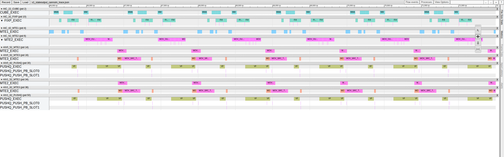

*图：v1 StateOutput CANNSIM trace 中的 `[66,000, 72,000] ns` 稳态窗口。每个双槽节拍中，AIC 依次发射 `K+@state`、prediction、history、下一 Chunk 的 U、delta 和 local；两路 AIV 分别处理 16 列 R/state/O。截图同时保留 AIC 的 MTE2/MTE1/Cube/Fixpipe 与两路 AIV 的 MTE2、PUSHQ/PUSH_PB、MTE3。*

v1 的数据路径变化如下：

```text
三 Kernel + GM 中间量
  -> 两 Kernel + U/R/history 留在片上
  -> 总 Kernel 时间下降 46.21%
  -> 瓶颈从 GM 交换转到片上计算和调度
```

与 v0 相比，v1 删除了一组 Kernel 边界和多项 GM 中间量。其主要开销转为两部分：Prepare 的 Pair/Araw 仍由 Vector 做 128 维点积；StateOutput 每个 Mix 一次只推进一条状态链。v2 针对这两个位置分别使用 Cube Prepare 和多状态链滚动调度。

---

## v2：Cube Prepare 与多状态链

### Pair/Araw 上 Cube

v2 把 Pair/Araw 的矩阵乘移到 AIC。AIV0 和 AIV1 各准备一个完整 Chunk，AIC 依次处理两份数据，随后两路 AIV 分别求解各自的 M/A：

```text
Prepare: VP(AIV) -> Cpair(AIC) -> VS(AIV)
```

VP（Vector Prepare）生成变换矩阵和 Cube 输入。Cpair 在 AIC 上计算 Pair/Araw。VS（Vector Solve）逐行求 M，并整理 A。

Prepare 使用两个时间槽，典型顺序为 `VP(0)->VP(1)->VS(0)->VP(2)...`。当 VS 处理旧 Chunk 时，另一个槽可以开始准备新 Chunk。

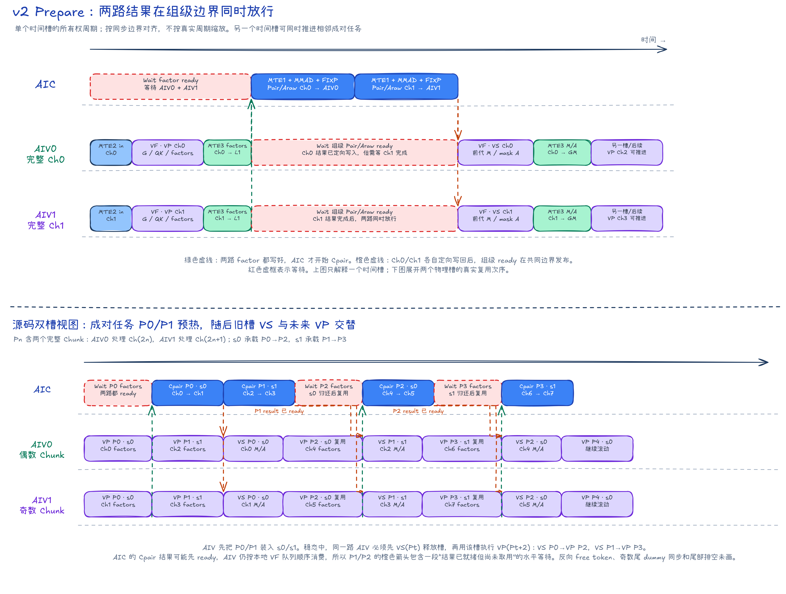

图的上半部解释一个槽内的 `VP -> Cpair -> VS` 依赖；下半部对照源码展示两槽滚动。成对任务 P0/P2 复用 `s0`，P1/P3 复用 `s1`。每个 Pn 中，AIV0 和 AIV1 各处理一个完整 Chunk；两路使用相同的时间槽号，但使用槽内不同的 AIV 子区。

#### 如何读 Prepare 流水图

图中取一个 Mix 组，使用 Ch0～Ch3 表示它先后拿到的四个逻辑 Chunk。真实运行有多个 Mix 组，各组取得的全局 Chunk 编号可能不连续，但 AIV0 处理成对任务中的偶数项，AIV1 处理奇数项，阶段顺序不变。

图内的 `in` 表示输入 $\mathbf Q/\mathbf K/\mathbf g/\boldsymbol\beta$，`fac` 表示 `QFactor/KFactor/KInvFactor`。各色块的含义如下。

| 图内简写 | 处理对象 | 计算或搬运的数据 |
| --- | --- | --- |
| `MTE2 in Ch0` | AIV0，Ch0 | 将 Q/K/g 的 $[C,D_k]$ 数据和 $[C]$ 的 beta 从 GM 搬到本地 UB。AIV1 对 Ch1 执行相同操作。 |
| `VF VP Ch0` | AIV0，Ch0 | 计算累计衰减 G、Q+/K+/Ktail、stateDecay，以及三个 $[C,D_k]$ factor。 |
| `MTE3 fac Ch0→L1` | AIV0，Ch0 | 将三个 $[C,D_k]$ factor 从 UB 写入共享 L1；同一阶段还把 Q+/K+/Ktail/stateDecay 写入 workspace。 |
| `MTE1 fac Ch0` | AIC，Ch0 | 从 AIV0 对应的 L1 子槽读取 factor，装入 L0A/L0B。 |
| `MMAD Pair/Araw Ch0` | AIC，Ch0 | 计算两个 $[C,D_k]\times[D_k,C]$ 矩阵乘，在 L0C 中得到 FP32 Pair/Araw $[C,C]$。 |
| `FIXP Ch0→AIV0` | AIC→AIV0，Ch0 | 把完整的 $[C,C]$ Pair/Araw 定向写入 AIV0 的结果 UB。Ch1 的结果定向写入 AIV1。 |
| `Wait Pair/Araw Ch0` | AIV0，Ch0 | 等待组级结果就绪。Ch0 的结果先定向写入本路 UB，但还要等 Ch1 也完成。虚线框表示等待。 |
| `VF VS Ch0` | AIV0，Ch0 | 用 Pair 和 beta 前向代入求 M，并对 Araw 作下三角 mask 得到 A。 |
| `MTE3 M/A Ch0→GM` | AIV0，Ch0 | 将两个 $[C,C]$ 矩阵写入 workspace；随后原槽可被 Ch2 复用。 |

Ch0 与 Ch1 在两路 AIV 上独立执行。AIC 会先等待 AIV0/AIV1 都把三组缩放矩阵写入 L1，然后依次读 Ch0 和 Ch1。图中的绿色竖直虚线汇合两路 `MTE3 factors` 的完成边界，表示“两路都就绪”后 AIC 才能继续。

AIC 用 Fixpipe 把 Ch0 结果定向写给 AIV0，把 Ch1 结果定向写给 AIV1。结果的存放位置彼此独立，但同步信号按 Mix 组发布：AIC 完成两份 Pair/Araw 后，才在共同的橙色边界同时放行 AIV0/AIV1 的 VS。

虚线框只表示当前 Pipe 必须等待的条件，不表示整个 Mix 组都停止工作。图中只画数据就绪方向；计算完成后还会沿同一 Flag 归还空槽，该反向事件没有展开。图末只画 Ch2/Ch3 的 VF 起点，用来说明槽位复用。

### Anchor：平移指数区间

#### 指数范围

直接把 $\exp(-\mathbf G)$ 转为 BF16 有数值风险。衰减越强、Chunk 越长，$\mathbf G$ 越负，$\exp(-\mathbf G)$ 就越大。

#### 取区间中点

源码为每个 Chunk、每个 $D_k$ 通道计算

$$
\mathbf a=\frac{1}{2}\mathbf G_{\mathrm{tail}}
\in\mathbb R^{1\times D_k}.
$$

`anchor` 是这个行向量 $\mathbf a$。它不是一个标量，也不是训练参数，只在 Prepare 中改变 Cube 输入的写法：

```text
QFactor_i    = Q_i * exp(G_i - anchor)
KFactor_i    = K_i * exp(G_i - anchor)
KInvFactor_i = K_i * exp(anchor - G_i)
```

对任意通道 $d$，因为 $g_{i,d}\le 0$，所以

$$
G_{\mathrm{tail},d}\le G_{i,d}\le 0.
$$

不使用 anchor 时，Cube 输入中的最大正指数可达到 $|G_{\mathrm{tail},d}|$。取区间中点后，$G_{i,d}-a_d$ 与 $a_d-G_{i,d}$ 都落在

$$
\left[-\frac{|G_{\mathrm{tail},d}|}{2},
\frac{|G_{\mathrm{tail},d}|}{2}\right].
$$

最大正指数被减半，BF16 输入不容易上溢或下溢。

$a_d=G_{\mathrm{tail},d}/2$ 正好是区间 $[G_{\mathrm{tail},d},0]$ 的中点。它使区间两端到 anchor 的最大距离最小，因此是这类单点平移中最直接的选择。

例如某个通道的 $G_{\mathrm{tail}}=-80$。原写法中的 $-G_i$ 最高可到 80；取 $a=-40$ 后，Cube 两侧的指数都限制在 `[-40,40]`。这不是把衰减删掉，而是把同一个指数拆到矩阵乘两侧。

#### 保持矩阵乘不变

矩阵乘的实数结果没有变化。以 Pair 的第 `(i,j)` 项为例：

$$
\begin{aligned}
(\mathrm{Pair})_{ij}
&=\sum_d k_{i,d}k_{j,d}
\exp(G_{i,d}-a_d)\exp(a_d-G_{j,d})\\
&=\sum_d k_{i,d}k_{j,d}\exp(G_{i,d}-G_{j,d}).
\end{aligned}
$$

$a_d$ 在同一通道内相消。Araw 同理。因此 anchor 只缩小 Cube 两侧 BF16 输入的指数范围，不改变前面推导的 Pair/Araw 公式。

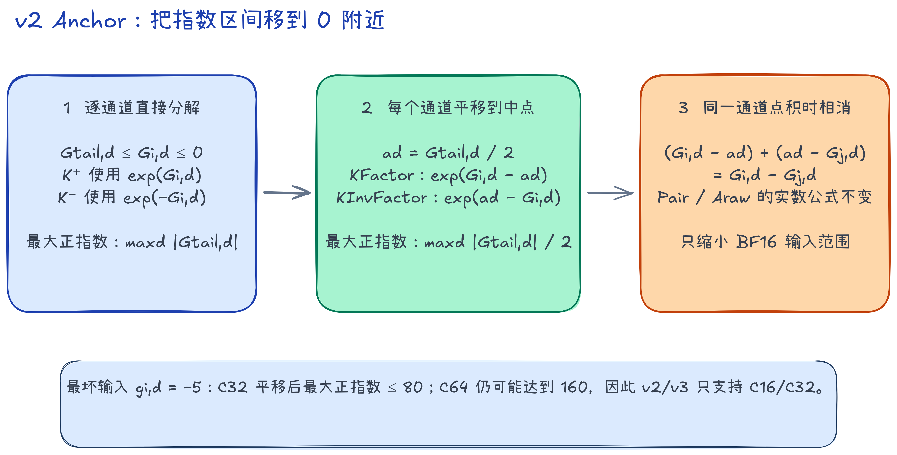

#### 支持范围

在测试范围 $g\in[-5,0]$ 下，C32 的最坏累计值约为 $-160$，平移后最大正指数约为 80。C64 的最坏累计值约为 $-320$，平移后仍可能达到 160，超出 BF16 输入路径的安全范围。

v2/v3 支持 C16/C32，不支持 C64。两种 ChunkSize 已通过普通输入、尾块、1/2/4 条状态链、多任务组、强衰减和混合衰减校验。anchor 会改变 BF16 舍入位置，精度统一以逐 token FP32 Recurrent 结果为准。

### 多状态链调度

v2 的 StateOutput 会同时维护 1、2 或 4 条互不依赖的状态链，具体数量取决于每个 AIC 分到多少 `(batch,dvTile)` 任务。

同一 Batch 的四个 DvTile 共用当前 Chunk 的 K/Q/M/A，避免重复搬运。某条链等待 AIC/AIV 交接时，调度器可以先推进另一条链。

```text
StateOutput: C1(AIC) -> V1(AIV) -> C2(AIC) -> V2(AIV)
```

V2 调用 `UpdateStateAndShadowVF`，以 FP32 更新每条状态链，同时生成供下一 Chunk 使用的 BF16 状态副本。该任务处理完全部 Chunk 后，单状态链路径或多状态链路径都会直接把各链的最新副本写成 BF16 `final_state`。

源码使用三个调度名词。后文优先使用中文，括号中保留代码里的英文名。

| 源码名 | 本文称呼 | 含义 |
| --- | --- | --- |
| lane | 状态链 | 一条独立的 `(batch,dvTile)` 递推链 |
| item | Chunk 任务 | 某条状态链上的一个 Chunk |
| epoch | 调度轮次 | 调度器的一轮发射 |
| C1 / V1 | 前半段 | AIC 生成 U/prediction，AIV 计算 R |
| C2 / V2 | 后半段 | AIC 生成 history/delta/local，AIV 更新 state 并输出 O |

状态链不是流水阶段。每条状态链内的 Chunk 顺序仍然不变；并行来自多条互不依赖的状态链。

### 并行设计

- `Prepare` 将相邻两个 `(batch,chunk)` 组成一个成对任务。
  - AIV0 处理第一块完整 Chunk，AIV1 处理第二块；两路都计算全部 C 行和 128 个 Dk 通道。
  - AIC 等两路 factor 就绪后，依次计算两份 Pair/Araw，再把完整 $C\times C$ 结果定向写回对应 AIV。
  - 两个时间槽允许 `VP(t+1)` 与 `VS(t)` 交错。
- `StateOutput` 的基础任务仍是 `(batch,dvTile)`，总数为 $4B$。
  - Host 根据每个 Mix 分到的任务数选择 `laneCount=1/2/4`；每条状态链属于一个独立 DvTile，链内 Chunk 仍严格串行。
  - AIC 始终处理完整 32 列，AIV0/AIV1 各处理 16 列。
  - `laneCount=2/4` 时，同一 Batch 的多个 DvTile 共享当前 Chunk 的 Q+/K+/M/Ktail/A。某条状态链等待 AIC/AIV 交接数据时，调度器可以先发射另一条状态链的工作。

### 性能与设计取舍

v2 的 Prepare 为 4766.383 us，StateOutput 为 9558.908 us，合计 14325.292 us。相对 v1 下降 35.56%，加速 1.552x。

`B=32,S=4096,C=32` 的真机 PipeTimeline 数据如下。

Prepare 的两路 AIV 几乎一直有工作，AIC Cube 的工作时间则较短。该 Kernel 的主要耗时在 AIV 路径。

| v2 PipeTimeline 指标 | Prepare | StateOutput |
| --- | ---: | ---: |
| Task Duration (us) | 295.489 | 602.562 |
| AIC Cube active (us) | 27.575 | 200.961 |
| AIC MTE2 / Fixpipe active (us) | - / 13.838 | 243.704 / 181.365 |
| AIV0 / AIV1 Vector active (us) | 219.390 / 214.646 | 197.388 / 197.725 |
| AIV0 / AIV1 MTE3 active (us) | 66.908 / 69.552 | 207.982 / 217.376 |
| AIV0 / AIV1 任一相关 Pipe 的忙碌占比 | 98.54% / 97.88% | 78.28% / 79.42% |
| AIC 任一相关 Pipe 的忙碌占比 | 14.45% | 71.84% |
| Cube 与 AIV0 / AIV1 Vector 重叠 | - | 22.49% / 23.80% |

StateOutput 中，AIC 至少一条相关 Pipe 忙碌的时间只占本地 span 的 71.84%。Cube 与两路 Vector 的重叠率也只有 22.49% 和 23.80%。

本文的重叠率定义为“两组忙碌区间的交集长度，除以两组 active 时间中的较小值”。这些数据说明流水仍有空闲区间，但不足以判定该 Kernel 由单一组件限制。

在 `B=1,S=256,C=32,core-num=1` 的 CANNSIM 短规格中，Prepare/StateOutput 的调度跨度为 22343/29224 cycles，合计 51567 cycles，较同规格 v1 缩短 30.54%。Prepare 包含 16 次 `MMAD`，对应 `8 Chunk×2`；StateOutput 包含 192 次 `MMAD`，对应 `4 state task×8 Chunk×6`。

StateOutput 中，Cube 与 Vector Function 的重叠率为 39.24%，Cube/Fixpipe 为 57.00%，Fixpipe/Vector Function 为 38.35%。这些比例按“两组忙碌区间的交集长度，除以两组 active 时间中的较小值”计算。

**Prepare Kernel 仿真流水**

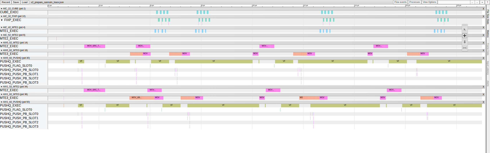

*图：v2 Prepare CANNSIM trace 中的 `[2, 19] µs` 窗口。AIV0/AIV1 分别处理两个不同的完整 Chunk，因此两路都保留；AIC 等两侧 factor 就绪后，依次为两块 Chunk 计算 Pair/Araw 并定向写回。长 VP/VS 与间歇出现的 Cpair 对应前面的双槽手绘图。*

**StateOutput Kernel 仿真流水**

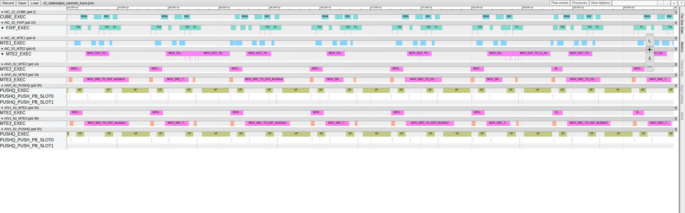

*图：v2 StateOutput CANNSIM trace 中的 `[34,000, 40,000] ns` 稳态窗口。AIC 按 `C1(e) -> C2(e-3)` 发射，AIV0/AIV1 按 `V1(e-1) -> V2(e-4)` 处理各自的 16 列；多条状态链已经形成交错，但 AIC 组件之间仍有空档。*

尽管 Prepare 和调度均有改进，StateOutput 仍占 v2 总时间的 66.73%：

```text
StateOutput = 9558.908 us，占 v2 总时间 66.73%
  + 每个 Chunk 任务仍有 6 次 MMAD
  + AIC 相关 Pipe 的忙碌占比只有 71.84%
  + Cube 与两路 Vector 重叠约为 22%～24%
  -> v3 缩短 prediction 和输出路径，并优先发布旧任务的 state
```

---

## v3：缩短状态依赖链

### W 前移

v3 在 Prepare 中计算 $\mathbf W=\mathbf M\mathbf K^+$。同一 Batch/Chunk 的四个 DvTile 可以共用 W。

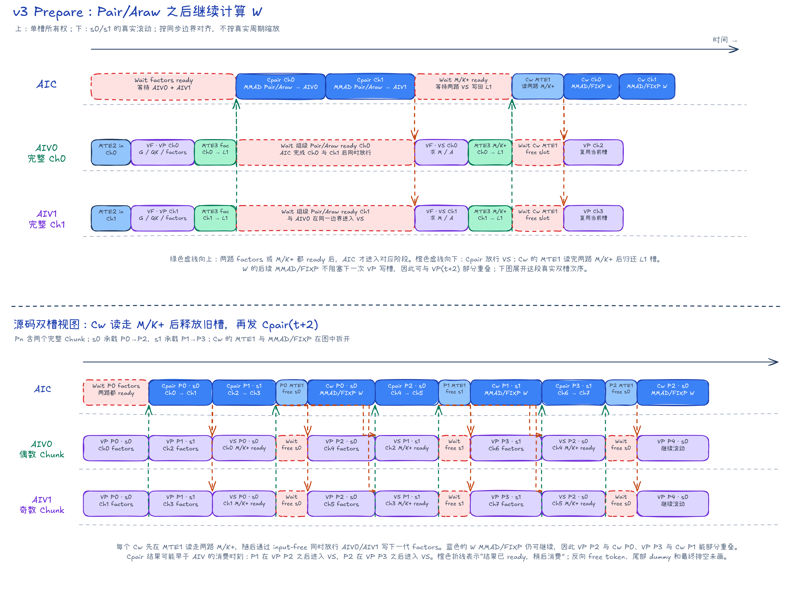

图的上半部解释一个槽的所有权传递，下半部展示 `s0/s1` 的实际交错。一个时间槽依次经过 Cpair、VS、Cw 三段计算：

1. AIV0/AIV1 分别为 Ch0/Ch1 生成 factors；AIC 等两路就绪后依次执行两份 Cpair。
2. Cpair 的结果分别定向写入对应 AIV，但两路 VS 在组级结果边界同时开始。VS 求出 M/A，并把 M/K+ 覆写到已经读完的 L1 子槽。
3. AIC 等两路 M/K+ 都到达后，先通过 MTE1 取走数据，此时即可归还 L1 槽供 `VP(t+2)` 复用。随后的 $\mathbf W=\mathbf M\mathbf K^+$ MMAD 和 Fixpipe 不再占用该 L1 槽，可与下一代 VP 部分重叠。

Prepare 仍有两个时间槽。AIV 的稳态次序近似为 `VS(t) -> VP(t+2)`；AIC 则以 `Cw(t) -> Cpair(t+2)` 交错两类 Cube 工作。

**Prepare Kernel 仿真流水**

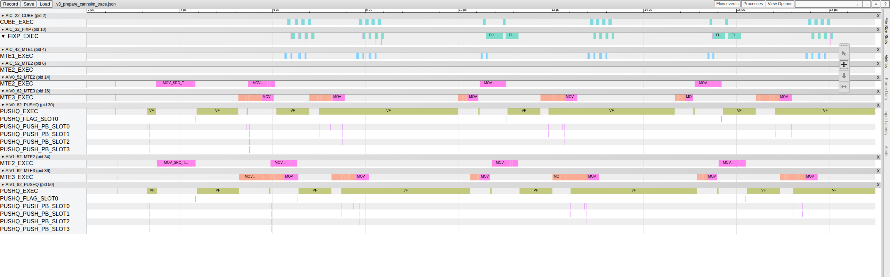

*图：v3 Prepare CANNSIM trace 中的 `[2, 19] µs` 窗口。AIV0/AIV1 分别处理不同的完整 Chunk；AIC 的 Cpair 簇之间新增 Cw 簇，对应手绘图中的 `Cpair -> VS -> Cw` 所有权传递。图中可见 Cw 与下一代 VP/Cpair 已开始交错。*

StateOutput 直接计算 `prediction=W@state`，不再保存和回读 `K_plus@state`。每个 Chunk 任务的 `MMAD` 从 6 次降到 5 次。

V2 仍在 AIV 上更新 FP32 state，并同时生成 BF16 状态副本。无论走单状态链还是多状态链路径，任务排空后都直接把各链的最新副本写成 BF16 `final_state`。

### 输出直写

输出路径也从：

```text
AIC: history、local -> AIV UB
AIV: history+local -> Cast -> MTE3 -> O(GM)
```

改为：

```text
AIC: history -> output L0C
     output L0C += local
     Fixpipe -> O(GM)
```

这会增加 Fixpipe 的工作，但省掉两路 AIV 的输出相加、Cast 和逐 Chunk MTE3 写回。

### 优先推进旧状态

多条状态链之间，v3 先处理能够发布新 state 的旧 Chunk 任务，再继续新任务：

```text
AIC: C1Pre(new) -> C2Core(old) -> C1Post(new) -> Output(old)
AIV: V2(old) -> V1(new)
```


图的上半部已经是 `laneCount=4` 的多状态链调度，不是单 Chunk 简图。下半部把源码中的物理槽位单独列出：

- state 和 `stateDecay` 按 `laneId` 使用 4 槽，因为 `laneCount=4` 时同时维护四条独立递推链。
- Chunk 只读矩阵按 `chunkId % 2` 使用 2 槽；Value、U、prediction、delta 等短生命数据按 `itemId % 2` 使用 2 槽。
- 残差 R 从 V1 产生到 C2 消费最多有 `laneCount-1` 个在途，所以 `laneCount=4` 时使用 3 槽。
- AIC 的 L0A 使用 2 槽，普通 L0C 结果使用 4 槽；v3 另外为 `history+local` 准备 4 个 output L0C 槽。

`laneCount=2` 只启用 lane0/lane1 和一个残差 R 槽。`laneCount=1` 走独立的单状态链流程，但仍保留双槽以预取相邻 Chunk。

#### 如何读 StateOutput 流水图

这张图固定 `laneCount=4`，截取稳态调度轮次 `e=4`。源码把一个 Chunk 的四个 `DV_TILE` 任务编号为四条状态链，图中 `Ch1·lane0` 表示“Chunk 1、状态链 lane0”。

在这一轮里，四个不同进度的 Chunk 任务同时占用 AIC/AIV 流水：

1. AIC 的新任务是 `item=4`，即 `Ch1·lane0`；
2. AIC 可继续处理的旧任务是 `item=1`，即 `Ch0·lane1`；
3. AIV 的 V1 处理 `item=3`，即 `Ch0·lane3`；
4. AIV 的 V2 处理 `item=0`，即 `Ch0·lane0`。

因此，横向读一轮时会看到多个 lane 编号。这不是数据错位，而是四条独立状态链按固定距离交错推进。AIV0/AIV1 也不是两条 lane：它们共同处理同一个 `DV_TILE=32`，AIV0 负责前 16 列，AIV1 负责后 16 列。

| 图内简写 | 处理对象 | 计算或搬运的数据 |
| --- | --- | --- |
| `MTE2 in Ch1·lane0` | AIC，Ch1·lane0 | 搬入 $[C,D_k]$ 的 Chunk 只读矩阵、$[C,C]$ 的 M/A，以及 $[C,32]$ 的 Value tile。v3 将 v2 的 K+ 换为 W。 |
| `MMAD U Ch1·lane0` | AIC，Ch1·lane0 | 计算 $\mathbf U=\mathbf M\mathbf V_{\mathrm{tile}}\in\mathbb R^{C\times32}$。 |
| `MTE1 state Ch1·lane0` | AIC，Ch1·lane0 | 读取 AIV 发布到 L1 的 BF16 状态副本 $[D_k,32]$，装入 L0B。 |
| `K+S`、`K+S→L1`、`pred` | v2 AIC，Ch1·lane0 | 先算 $\mathbf K^+\mathbf H\in\mathbb R^{C\times32}$，经 Fixpipe 转为 BF16 并回读，再算 $\mathbf M(\mathbf K^+\mathbf H)$。 |
| `W@state` | v3 AIC，Ch1·lane0 | 直接计算 $\mathbf W\mathbf H\in\mathbb R^{C\times32}$，替代 v2 的两次矩阵乘和一次中间回写。 |
| `FIXP U/pred` | AIC→两路 AIV，Ch1·lane0 | 把 `[C,32]` 的 U/prediction 按列拆成两个 `[C,16]` 半块，分别写给 AIV0/AIV1。 |
| `MTE2 d Ch0·lane3` | 两路 AIV，Ch0·lane3 | 将 $[D_k]$ 的 `stateDecay` 从 GM 预取到各 AIV 的 lane 专属 UB 槽，供后续 V2 更新 state。 |
| `VF V1：R Ch0·lane3` | 两路 AIV，Ch0·lane3 | 各自计算 $[C,16]$ 的 $\mathbf R=\mathbf U-\mathbf{prediction}$，再通过 MTE3 把两个半块拼成共享 L1 中的 $[C,32]$。 |
| `history/delta/local Ch0·lane1` | AIC，Ch0·lane1 | 依次得到 $[C,32]$ 的 history、$[D_k,32]$ 的 delta 和 $[C,32]$ 的 local。 |
| `FIXP h/δ/local→AIV` | v2 AIC→两路 AIV，Ch0·lane1 | 将 history、delta、local 按 16+16 列交给两路 AIV，供该任务后续的 V2 更新 state 并生成 O。 |
| `FIXP δ→AIV`、`FIXP O→GM` | v3 AIC，Ch0·lane1 | 只把 delta 交给 AIV；history+local 在 L0C 内合并后直接写入 O。 |
| `VF V2：state+O Ch0·lane0` | v2 两路 AIV，Ch0·lane0 | 各自用 $[D_k,16]$ delta 更新 FP32 state 并生成 BF16 状态副本，同时将 $[C,16]$ 的 `history+local` 转为 BF16 O 后写 GM。 |
| `VF V2：state Ch0·lane0` | v3 两路 AIV，Ch0·lane0 | 各自更新 FP32 state 并发布 $[D_k,16]$ BF16 状态副本；完整 $[C,32]$ O 已在 AIC 的 L0C 中累加，由 `FIXP O→GM` 写出。 |

主流水图里的红色竖直虚线只画当前调度轮中能直接对齐的 state 依赖。AIV0/AIV1 各写 $[D_k,16]$ 的状态副本；AIC 等两个半块都就绪，才能读取完整的 $[D_k,32]$ state。

图中带 `from e−1` 的 Wait 消费上一轮 AIC 已发布的数据；带 `→e+1` 的 Fixpipe 结果供下一轮 AIV 消费。它们跨越调度轮次，若强行连线会遮挡当前轮次，因此图中用文字标注代际关系。

v2 的 AIC 很早就开始等待 state，但 AIV 要先完成 V1，随后才由 V2 发布 state；状态就绪边界因而出现在当前调度轮较后的位置。v3 先发 V2，再继续 V1，AIC 也把旧任务的 C2 插到新任务的 U 与 prediction 之间。两路 AIV 发布 state 后，AIC 随即读取它并计算新任务的 prediction，图中的竖线因此明显前移。

#### 同一任务的跨核依赖

主流水图是“一轮调度”的横截面，同一横行中会同时出现不同 Chunk 任务。下图改为跟踪同一个 `item=(Chunk c, lane ℓ)`，因此会跨越多个调度轮次。

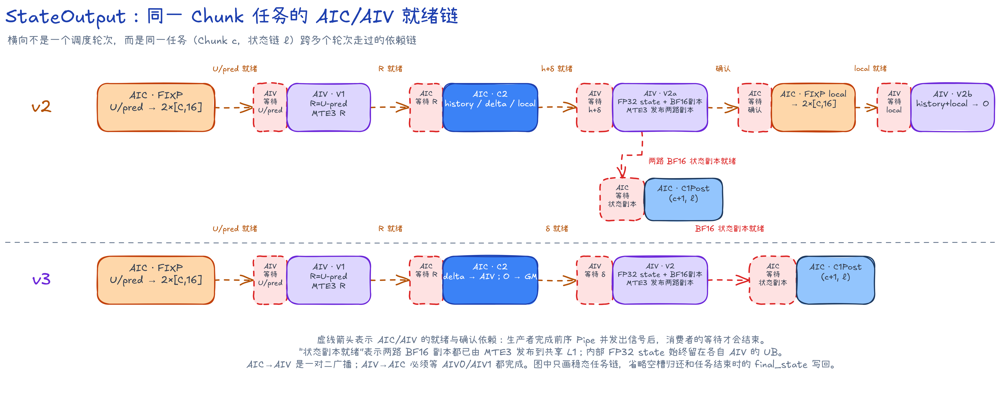

虚线箭头表示 AIC/AIV 之间的依赖：生产者完成前序 Pipe 并发出就绪信号后，消费者的等待才会结束。图中的 `Set`、`Wait` 是对应的源码操作名。

1. AIC 用 Fixpipe 把 U/prediction 按 16+16 列写给两路 AIV；V1 等两项都就绪后才能计算 R。
2. AIV0/AIV1 各自写出 $[C,16]$ 的 R；AIC 等两个半块都就绪，再读取 $[C,32]$ 的 R 进入 C2。
3. v2 的 V2 有两次交接：先等 history/delta 更新 state，确认完成后再等 local 生成 O。
4. v3 只需把 delta 交给 AIV 更新 state；O 由 AIC 的 Fixpipe 直接写入 GM，不再经 AIC/AIV 交接。
5. AIV0/AIV1 更新后各发布一半 BF16 状态副本。下一 Chunk 同一状态链的 C1Post 必须等待这两个半块；最后一个 Chunk 的最新副本直接写入 `final_state`。

AIC 发给 AIV 的信号是一对二广播；AIV 发给 AIC 时，AIC 必须等 AIV0/AIV1 都完成。为避免图线过密，图中只画决定计算先后的就绪与确认信号，没有展开空槽归还和一组状态链结束时的排空过程。

v3 把 `V2(Ch0·lane0)` 放到当前调度轮的 AIV 队列前部。它发布的新 state 正是 `C1Post(Ch1·lane0)` 计算 prediction 所需的输入。AIC 同时把 `C2(Ch0·lane1)` 插到 U 与 prediction 之间，用旧任务覆盖等待 state 的空档。

### 并行设计

- `Prepare` 的任务映射和 v2 相同。
  - AIV0/AIV1 仍各处理一个完整 Chunk，AIC 仍依次计算两份 Pair/Araw。
  - VS 求出 M 后把 M/K+ 写回共享 L1，AIC 再计算 $\mathbf W=\mathbf M\mathbf K^+$。W 由同一 Batch/Chunk 的四个 DvTile 共用。
- `StateOutput` 的任务数、`laneCount=1/2/4` 和 `16+16` Dv 列切分保持不变。
  - AIC 对完整 32 列执行 `C1Pre(new) -> C2Core(old) -> C1Post(new) -> Output(old)`。
  - AIV0/AIV1 分别对自己的 16 列执行 `V2(old) -> V1(new)`。
  - 同一状态链内，Chunk $c+1$ 的 prediction 仍要等待 Chunk $c$ 发布 state。v3 只是把能产生 state 的 V2 提前，并用其他状态链的 C2 覆盖等待区间。

### 性能与设计取舍

v3 Prepare 为 4950.757 us，比 v2 增长 3.87%；StateOutput 为 6544.310 us，比 v2 下降 31.54%。两 Kernel 合计 11495.066 us，相对 v2 下降 19.76%，相对 v0 加速 3.595x。

真机 `B=32,S=4096,C=32` 的 PipeTimeline 解释了时间为何下降：

| v2→v3 StateOutput 指标 | v2 | v3 |
| --- | ---: | ---: |
| Task Duration (us) | 602.562 | 413.553 |
| AIC Cube active (us) | 200.961 | 163.512 |
| AIC Fixpipe active (us) | 181.365 | 290.278 |
| AIV0 / AIV1 Vector active (us) | 197.388 / 197.725 | 164.315 / 164.779 |
| AIV0 / AIV1 MTE3 active (us) | 207.982 / 217.376 | 39.096 / 38.868 |
| AIC 任一相关 Pipe 的忙碌占比 | 71.84% | 94.55% |
| Cube 与 AIV0 / AIV1 Vector 重叠 | 22.49% / 23.80% | 40.51% / 41.19% |

Cube 和两路 Vector 的 active 均下降。删除逐 Chunk 输出链后，AIV MTE3 的时间也明显缩短。

最终 O 改由 Fixpipe 直接写出，所以 Fixpipe active 增至 290.278 us。与此同时，AIC 至少一条相关 Pipe 忙碌的时间占比达到 94.55%，Cube 与两路 Vector 的重叠率提高到 40.51% 和 41.19%。

v3 的三项改动分别作用于矩阵乘、输出写回和状态发布：

```text
W 前移                  -> 每个 State Chunk 少 1 次 MMAD
history/local 在 L0C 累加 -> 删除 AIV 输出相加与逐 Chunk MTE3 写回
V2(old) 提前             -> 下一 Chunk 所需 state 更早发布
```

Fixpipe active 虽然最大，但上述 active 与 overlap 数据不足以判定整个 Kernel 仅受 Fixpipe 限制。

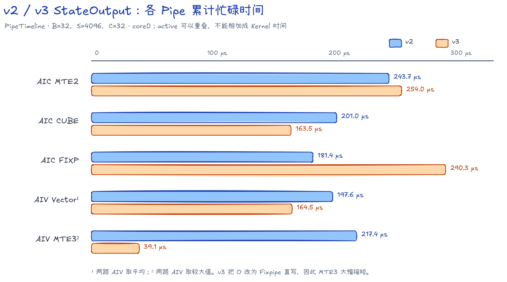

**v2/v3 StateOutput 真机 PipeTimeline 对照**

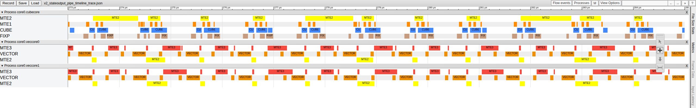

*图：v2 StateOutput 真机流水中 core0 的 `[273, 285] µs` 稳定窗口。AIC 上的 MTE2、MTE1、Cube、Fixpipe 之间仍有空档，两路 AIV 的 MTE3 包含较长的 O/state 写回。截图仅展开这四条 AIC Pipe，以及两路 AIV 的 MTE2、Vector、MTE3。*

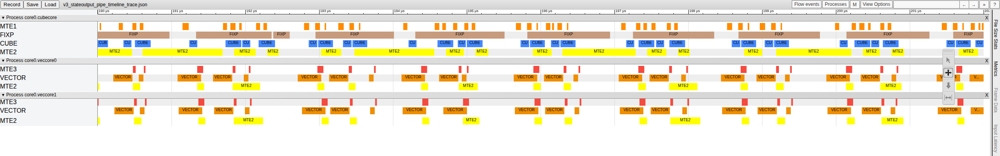

*图：v3 StateOutput 真机流水中 core0 的 `[190, 202] µs` 稳定窗口，使用与 v2 相同的 12 µs 窗口宽度和泳道。AIC 的四条流水更紧密；两路 AIV 的 MTE3 缩短为 state/R 交接。PipeTimeline 没有阶段标记，因此这里不把单个色块强行命名为 C1/V1/C2/V2。*

在 `B=1,S=256,C=32,core-num=1` 的 CANNSIM 短规格中，v3 Prepare/StateOutput 的调度跨度为 23333/20743 cycles，合计 44076 cycles，较同规格 v2 再缩短 14.53%。Prepare 的 `MMAD` 从 16 次增至 24 次，跨度增长 4.43%；StateOutput 的 `MMAD` 从 192 次降至 160 次，跨度下降 29.02%。

StateOutput 中，Cube/Vector Function 重叠率从 v2 的 39.24% 提高到 47.47%。Cube/Fixpipe 从 57.00% 提高到 79.60%，Fixpipe/Vector Function 从 38.35% 提高到 81.39%。

**StateOutput Kernel 仿真流水**

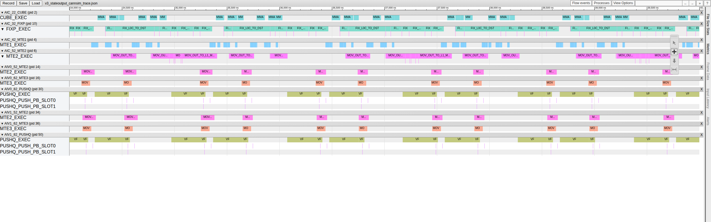

*图：v3 StateOutput CANNSIM trace 中的 `[34,000, 40,000] ns` 稳态窗口。AIC 按 `C1Pre(e) -> C2Core(e-3) -> C1Post(e) -> OutputFix(e-3)` 推进，AIV0/AIV1 按 `V2(e-4) -> V1(e-1)` 先发布旧状态、再生成新 R。Cube/Fixpipe 与两路 VF 更密集，MTE3 只保留短交接。*

---

## 性能汇总

下表汇总统一真机规格下 v0～v3 的 Kernel Task Duration。接口 O 和 `final_state` 均为 BF16。

| 版本 | Prepare (us) | StateUpdate/StateOutput (us) | LocalOutput (us) | Kernel Task Duration 合计 (us) | 相对前版 |
| --- | ---: | ---: | ---: | ---: | ---: |
| v0 | 17450.373047 | 15919.649414 | 7958.541992 | 41328.564453 | 基线 |
| v1 | 8797.722656 | 13432.345703 | - | 22230.068359 | `-46.2114%`，`1.8591x` |
| v2 | 4766.383301 | 9558.908203 | - | 14325.291504 | `-35.5589%`，`1.5518x` |
| v3 | 4950.756836 | 6544.309570 | - | 11495.066406 | `-19.7568%`，`1.2462x` |

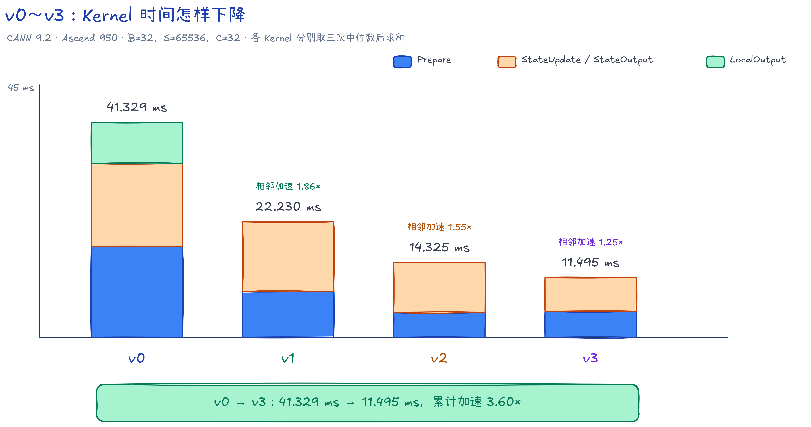

版本升级不意味着每个 Kernel 都会变快。v3 把可供四个 DvTile 共用的 W 移到 Prepare，因此 Prepare 略慢；StateOutput 缩短得更多，所以总时间继续下降。

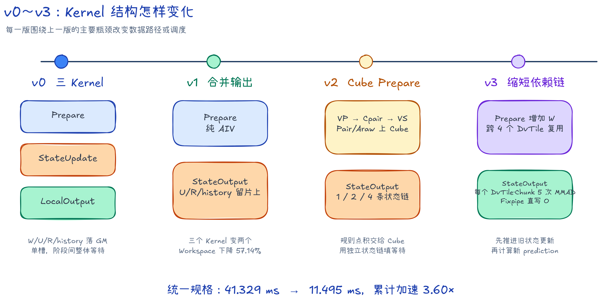

下表给出 `B=1,S=256,C=32,core-num=1` 单 Mix 组 CANNSIM 调度跨度。它用于比较调度和同步开销，不等同于真机耗时，也不用于计算主性能加速比。

| 版本 | Prepare (cycles) | StateUpdate/StateOutput (cycles) | LocalOutput (cycles) | 各 Kernel 调度跨度之和 (cycles) |
| --- | ---: | ---: | ---: | ---: |
| v0 | 70128 | 42713 | 16786 | 129627 |
| v1 | 36860 | 37385 | - | 74245 |
| v2 | 22343 | 29224 | - | 51567 |
| v3 | 23333 | 20743 | - | 44076 |

四个版本依次减少 Kernel/GM 交接、将规则矩阵乘迁至 Cube，并按状态依赖重排 AIC/AIV 工作。v1～v3 的结果表明，本样例的收益主要来自缩短数据路径和依赖链；仅增加槽位不能替代这两项改动。

---

## 后续优化

v0～v3 是四个可独立构建和复现的版本。v3 在本文统一规格下耗时最短，但仍不是 KDA 在 Ascend 950 上的性能上限。结合前述源码与流水，还可以继续探索以下方向：

1. 性能方面，继续减少 Prepare 前向代入的逐行依赖，并缩短 StateOutput 等待上一 Chunk 状态的路径；
2. 精度方面，研究 C64 强衰减场景的重标定或分段方案，补充更贴近完整模型输入分布的精度标准与验证规格；
3. 能力方面，逐步支持多 Head、非零初始状态、Decode、变长序列，以及归一化和门激活等前处理；
4. 泛化方面，为小 Batch、短序列、尾块和不同 ChunkSize 建立更合适的 tiling 与调度策略。

欢迎开发者在 [cann-samples 的 Kimi Delta Attention Lite 样例](https://gitcode.com/cann/cann-samples/tree/master/Samples/2_Performance/kimi_delta_attn_lite_story) 上继续完善这项工作。无论是进一步提升性能、改进精度标准，还是补充更多能力以贴近实际网络中的 KDA 算子，都欢迎在社区中交流和共建。这份样例愿作一个公开、可复现的起点，供开发者在不同规格和应用场景下继续试验和改进。

---

## 参考资料

1. Kimi Team, [Kimi K3: Open Frontier Intelligence](https://arxiv.org/abs/2607.24653).
2. Kimi Team, [Kimi Linear: An Expressive, Efficient Attention Architecture](https://arxiv.org/abs/2510.26692).
3. Yang et al., [Parallelizing Linear Transformers with the Delta Rule over Sequence Length](https://proceedings.neurips.cc/paper_files/paper/2024/hash/d13a3eae72366e61dfdc7eea82eeb685-Abstract-Conference.html), NeurIPS 2024.
4. Schlag et al., [Linear Transformers Are Secretly Fast Weight Programmers](https://proceedings.mlr.press/v139/schlag21a.html), ICML 2021.
5. Yang et al., [Gated Delta Networks: Improving Mamba2 with Delta Rule](https://arxiv.org/abs/2412.06464).
6. [FlashKDA](https://github.com/MoonshotAI/FlashKDA).
7. [Flash Linear Attention](https://github.com/fla-org/flash-linear-attention).
8. [一站式 Ascend C 编程语言文档](https://asc.gitcode.com/).
