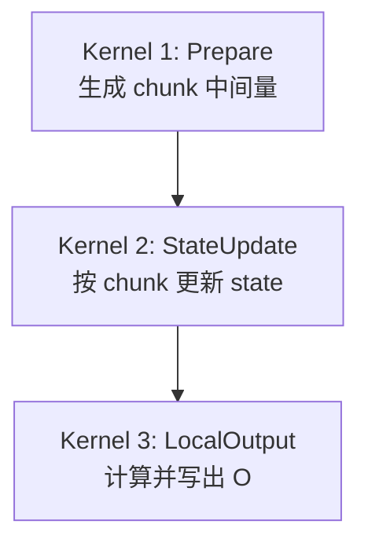
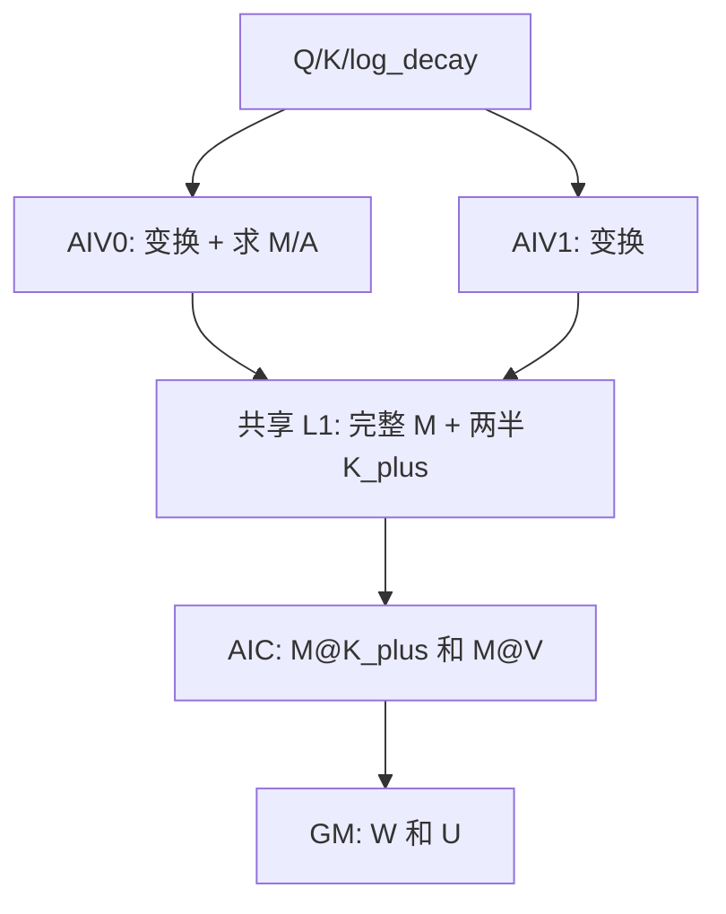
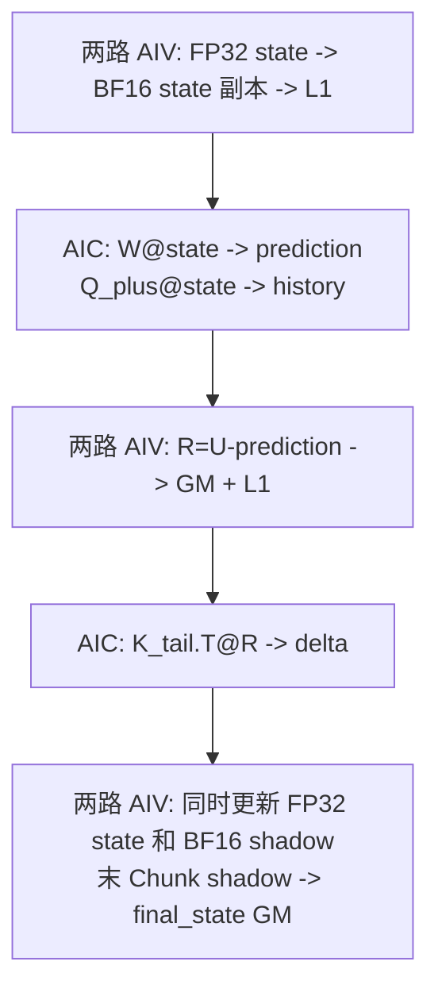
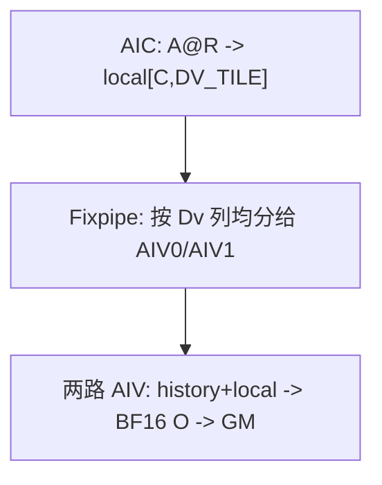

# KDALite v0：三 Kernel 单槽基线

## 版本概览

v0 是 KDALite 的功能基线。它把 Chunk KDA 拆成 Prepare、StateUpdate 和 LocalOutput 三个 Kernel，三个 Kernel 在同一个 ACL stream 中依次提交。主要共享数据使用单槽，不建立多槽滚动调度；Prepare 在 AIC 读完共享 L1 后会提前归还该槽，因此相邻任务的 AIV 准备仍可与当前任务的 AIC 矩阵乘和写回局部重叠。

| 张量 | Shape | dtype | 说明 |
| --- | --- | --- | --- |
| Q | `[B,1,S,128]` | BF16 | 已完成 L2Norm 和 `1/sqrt(128)` 缩放。 |
| K | `[B,1,S,128]` | BF16 | 已完成 L2Norm。 |
| V | `[B,1,S,128]` | BF16 | Value。 |
| log_decay | `[B,1,S,128]` | FP32 | 已完成门函数，取值不大于 0。 |
| beta | `[B,1,S]` | BF16 | 已完成 sigmoid。 |
| O | `[B,1,S,128]` | BF16 | 序列输出。 |
| final_state | `[B,1,128,128]` | BF16 | 序列结束后的状态，布局为 `[Dk,Dv]`。 |

本版支持可变 `B/S`，固定 `N=1`、`Dk=Dv=128`，初始状态为 0。本样例的接口、任务切分和片上布局要求 `Dk==Dv`；这是样例支持边界，不是 KDA 数学公式的限制。`CHUNK_SIZE=C` 是编译期常量，支持 16、32 和 64，默认值为 32。Q/K/V 投影、ShortConv、门参数生成、输出归一化、Decode 和反向计算不在本样例范围内。

固定为 1 的 Head 轴不写入数据文件。O 的物理布局为 `[B,S,128]`，占 `256*B*S` 字节；`final_state` 的物理布局为 `[B,128,128]`，占 `32768*B` 字节。AIV 在 UB 中仍以 FP32 维护递推 state，对外输出的 `final_state` 来自同一次状态更新生成的 BF16 shadow。

## 数学约定与 Chunk 公式

下文省略 Batch 和 Head 轴，令 `g_i=log_decay_i`。token 向量均为行向量，状态为 `[Dk,Dv]`。`@` 表示矩阵乘，`*` 表示逐元素乘，`.T` 表示转置，`Diag(x)` 表示以 x 为对角线的矩阵。

```text
q_i, k_i:      [1,Dk]
v_i, r_i, o_i: [1,Dv]
state_i:       [Dk,Dv]

alpha_i         = exp(g_i)
decayed_state_i = Diag(alpha_i) @ state_(i-1)
prediction_i    = k_i @ decayed_state_i
r_i             = beta_i * (v_i - prediction_i)
state_i         = decayed_state_i + k_i.T @ r_i
o_i             = q_i @ state_i
```

对一个长度为 C 的 chunk，先沿 token 轴累计衰减：

```text
G_i     = sum(g_t, t=0...i)                    [1,Dk]
Gamma_i = exp(G_i)                             [1,Dk]
```

严格下三角 Key-Key 关系与求 M 的前向代入为：

```text
pairKK[i,j] = sum_d K[i,d] * K[j,d] * exp(G_i[d]-G_j[d]),  j<i

L[i,i] = 1
L[i,j] = beta_i * pairKK[i,j],  j<i
L[i,j] = 0,                       j>i

L @ M  = Diag(beta)
M[i,:] = beta_i*e_i - sum_(j<i)(beta_i*pairKK[i,j])*M[j,:]
```

本文按 `i=0,...,C-1` 编号。`e_i∈R^{1×C}` 是第 `i` 个标准基行向量：第 `i` 项为 1，其余项为 0，因此 `beta_i*e_i` 是 `Diag(beta)` 的第 `i` 行。

Prepare 生成以下中间量：

```text
Q_plus[i] = Gamma_i * Q[i]                    [1,Dk]
K_plus[i] = Gamma_i * K[i]                    [1,Dk]
K_tail[i] = exp(G_last-G_i) * K[i]            [1,Dk]
W         = M @ K_plus                        [C,Dk]
U         = M @ V                             [C,Dv]

A[i,j] = sum_d Q[i,d] * K[j,d] * exp(G_i[d]-G_j[d]),  j<=i
A[i,j] = 0,                                                   j>i
```

后两个 Kernel 按下式更新状态并生成输出：

```text
prediction = W @ state_in                     [C,Dv]
R          = U - prediction                   [C,Dv]
history    = Q_plus @ state_in                [C,Dv]
local      = A @ R                            [C,Dv]
delta      = K_tail.T @ R                     [Dk,Dv]

state_out = Diag(exp(G_last)) @ state_in + delta
O         = history + local
```

A 包含对角线，因为第 i 个输出读取的状态已经包含第 i 个 token 的更新。精度校验使用独立的逐 token Recurrent KDA Golden，不复刻上述 Chunk 公式。

## Kernel 总览

### 入口与执行顺序

v0 定义三个 `__mix(1,2)` 入口：

```cpp
__global__ __mix__(1, 2) void kimi_delta_attn_lite_prepare_k(
    GM_ADDR q, GM_ADDR k, GM_ADDR v, GM_ADDR logDecay, GM_ADDR beta, GM_ADDR workspace,
    KDALite::KimiDeltaAttnLiteTilingData data);

__global__ __mix__(1, 2) void kimi_delta_attn_lite_state_update_k(
    GM_ADDR finalState, GM_ADDR workspace, KDALite::KimiDeltaAttnLiteTilingData data);

__global__ __mix__(1, 2) void kimi_delta_attn_lite_local_output_k(
    GM_ADDR output, GM_ADDR workspace, KDALite::KimiDeltaAttnLiteTilingData data);
```



三个入口在同一 stream 中异步提交，launch 顺序提供 Kernel 间依赖；`KimiDeltaAttnLiteNPU` 不在内部同步 stream，三个 Kernel 始终按上述顺序执行。

### 任务划分与 AIV 分工

```text
Tc           = ceil(S/C)
prepareTasks = B * Tc
stateTasks   = B * (128/DV_TILE)
outputTasks  = B * Tc * (128/DV_TILE)
```

文档中的 AIC 侧 DvTile 对应源码常量 `DV_TILE=32`，因此 `DV_TILE_COUNT=VALUE_DIM/DV_TILE=128/32=4`。同组两路 AIV 均分这 32 列，所以 AIV 侧 DvTile 为 `AIV_DV_TILE=DV_TILE/2=16`。这组 Dv 切分与 `CHUNK_SIZE=C` 无关。Prepare 中每路 AIV 负责的 64 个 Dk 通道则来自 `Dk/2=128/2=64`，也与 C 无关。

| Kernel | 一个 task | AIV0/AIV1 的关系 |
| --- | --- | --- |
| Kernel 1：Prepare | `(batch,chunk)` | 协作同一 chunk；最终各写一半 Dk，AIV0 另算 M/A。 |
| Kernel 2：StateUpdate | `(batch,dvTile)` | 协作同一 `[Dk,DV_TILE]=[128,32]` state 切片，各维护 `[Dk,AIV_DV_TILE]=[128,16]`。 |
| Kernel 3：LocalOutput | `(batch,chunk,dvTile)` | 协作同一 `[C,DV_TILE]=[C,32]` 输出块，各处理 `[C,AIV_DV_TILE]=[C,16]`。 |

同一 Mix 组中，AIC 发布一次信号后两路 AIV 都能接收；反向则要等 AIV0 和 AIV1 都完成，AIC 的等待才结束。这个机制只传递事件，不合并数值。两路 AIV 通过写入共享 L1 的相邻区域组成完整矩阵。

`--core-num` 按 Mix 组上限解释。三个 Kernel 均最多使用该数量的 Mix 组；如果对应阶段的任务更少，则按实际任务数缩减 launch。

### Workspace

Workspace 按中间量分段存放，每个分段按全部 Chunk 连续排列：

| 分段 | 每 chunk shape | dtype | 生产者 | 消费者 |
| --- | --- | --- | --- | --- |
| W | `[C,Dk]` | BF16 | Prepare AIC | StateUpdate AIC |
| Q_plus | `[C,Dk]` | BF16 | Prepare AIV | StateUpdate AIC |
| K_tail | `[C,Dk]` | BF16 | Prepare AIV | StateUpdate AIC |
| A | `[C,C]` | BF16 | Prepare AIV0 | LocalOutput AIC |
| U | `[C,Dv]` | FP32 | Prepare AIC | StateUpdate AIV |
| R | `[C,Dv]` | BF16 | StateUpdate AIV | LocalOutput AIC |
| G_last | `[Dk]` | FP32 | Prepare AIV | StateUpdate AIV |
| O_history | `[C,Dv]` | FP32 | StateUpdate AIC | LocalOutput AIV |

每个 chunk 占用 `2*C*C + 2048*C + 512` 字节。C=16、32、64 时分别为 33792、68096、139776 字节。Host 使用 64 位整数计算任务数、分段 offset 和 workspace 总大小。

## Kernel 1：Prepare

### 输入、输出与计算

Prepare 读取 Q、K、V、log_decay 和 beta，写出 W、Q_plus、K_tail、A、U 和 G_last。M 与 K_plus 只在片上存活。核心计算是前文的变换、前向代入以及两次矩阵乘 `W=M@K_plus`、`U=M@V`。

### AIV0、AIV1 与 AIC 的分工

| 核心 | 处理范围 | 主要工作 |
| --- | --- | --- |
| AIV0 | 当前 chunk 的完整 Q/K/log_decay 和 beta；输出 Dk `[0,64)` | 计算变换、完整 M/A；把半个 K_plus 和完整 M 写入 L1，并把 A、半个 Q_plus/K_tail/G_last 写入 GM。 |
| AIV1 | 当前 chunk 的完整 Q/K/log_decay；输出 Dk `[64,128)` | 重复完整 Dk 变换，不计算 M/A；把另半个 K_plus 写入 L1，并把另半个 Q_plus/K_tail/G_last 写入 GM。 |
| AIC | 完整 M、K_plus 和 V | 两路 K_plus 在 L1 中拼成 `[C,Dk]`；AIC 从 GM 直搬 V，计算 W/U 并直接写 GM。 |



AIC 的 W 通过 Fixpipe 转为 BF16，U 保持 FP32。U 会进入跨 Chunk 的状态反馈路径；为保持长序列精度，本实现将 U 保留为 FP32。AIV0/AIV1 都完成 L1 写入后，AIC 才读取完整 M/K_plus；AIC 读完后归还 L1，随后两路 AIV 才进入下一 task。

| 事件 | Set | Wait | 含义 |
| --- | --- | --- | --- |
| `FLAG_PREP_INPUT_READY` | AIV `PIPE_MTE3` | AIC `PIPE_MTE1` | 两路 AIV 已写完 M/K_plus。 |
| `FLAG_PREP_L1_FREE` | AIC `PIPE_MTE1` | AIV `PIPE_MTE3` | AIC 已读完共享 L1。 |

Prepare 的 L1、L0A、L0B、L0C 和每路 AIV UB 都是单槽。默认 C=32 时，L1 为 18432B，L0A/L0B/L0C 为 2048/8192/16384B，每路 AIV UB 为 81984B。

## Kernel 2：StateUpdate

### 输入、输出与计算

StateUpdate 读取 W、Q_plus、K_tail、U 和 G_last，按 chunk 顺序计算 prediction、R、history 和 delta，更新 FP32 state，写出 R、O_history 和最后的 BF16 `final_state`。`UpdateStateAndShadowVF` 在一次 VF 中同时更新 FP32 state 并生成 BF16 shadow；最后一个 Chunk 完成后，AIV 直接把该 shadow 写入 GM，不再从 FP32 state 另做一次输出转换。

### AIV0、AIV1 与 AIC 的列切分

一个 task 处理 `[Dk,DV_TILE]=[128,32]` state 切片。设 `dvBase=dvTile*DV_TILE`：

| 核心 | 全局 Dv 列 | 本地数据 | 主要工作 |
| --- | --- | --- | --- |
| AIV0 | `dvBase+[0,AIV_DV_TILE)` | state/delta 为 `[Dk,AIV_DV_TILE]`，U/prediction/R 为 `[C,AIV_DV_TILE]` | 维护低半区 FP32 state，生成 BF16 shadow，计算低半区 R，并写 `final_state` 低半区。 |
| AIV1 | `dvBase+[AIV_DV_TILE,DV_TILE)` | shape 与 AIV0 相同 | 对高半区执行相同流程，并写 `final_state` 高半区。 |
| AIC | 完整 `DV_TILE` 列 | prediction/history 为 `[C,DV_TILE]`，delta 为 `[Dk,DV_TILE]` | 读取两路 AIV 拼成的 state/R，完成四次矩阵乘。 |



AIC 用 Fixpipe 沿 Dv 列均分 prediction 和 delta：低 `AIV_DV_TILE` 列写入 AIV0 UB，高 `AIV_DV_TILE` 列写入 AIV1 UB。反向交接时，两路 AIV 分别写共享 L1 的前后半区；AIC 等两路都写完后，一次读取完整 state 或 R。这个拼接不做数值求和。

| 事件 | 方向 | 含义 |
| --- | --- | --- |
| `FLAG_STATE_INPUT_READY` | AIV→AIC | BF16 state 副本已写入 L1。 |
| `FLAG_STATE_PRED_READY` | AIC→AIV | prediction 可读。 |
| `FLAG_STATE_PRED_CONSUMED` | AIV→AIC | prediction 已读完，结果 UB 可以覆写。 |
| `FLAG_STATE_R_READY` | AIV→AIC | BF16 R 已写入 GM 和 L1。 |
| `FLAG_STATE_DELTA_READY` | AIC→AIV | delta 可读。 |

五个事件都在当前 chunk 内完成，不需要额外初始化或尾部排空。prediction 和 delta 共用结果 UB，因此 AIC 在写 delta 前必须等两路 AIV 都读完 prediction。

StateUpdate 的 lhs、state 和 R L1 都是单槽。lhs 依次存放 W、Q_plus 和 K_tail；state 保留到 history 读取完成，R 保留到 delta 读取完成。默认 C=32 时，L1 为 18432B，L0A/L0B/L0C 为 8192/8192/16384B，每路 AIV UB 为 24064B。

## Kernel 3：LocalOutput

### 输入、输出与计算

LocalOutput 读取 A、R 和 O_history，计算 `local=A@R`，再得到 `O=history+local`。本 Kernel 只写最终 O，不再产生后续 Kernel 使用的 workspace 数据。

### AIV0、AIV1 与 AIC 的列切分

一个 task 处理 `(batch,chunk,dvTile)`。AIC 读取完整 `[C,C]` A 和 `[C,DV_TILE]` R，计算完整 local；Fixpipe 再沿 Dv 列均分结果。

| 核心 | 接收和写回范围 | 计算 |
| --- | --- | --- |
| AIV0 | `dvBase+[0,AIV_DV_TILE)` | 低半区 `O=O_history+local`。 |
| AIV1 | `dvBase+[AIV_DV_TILE,DV_TILE)` | 高半区执行相同计算。 |
| AIC | 完整 `[C,DV_TILE]` | `A@R`。 |



AIC 发布 local 后，两路 AIV 分别计算并写回自己的列。AIC 等两路写回完成后，才复用单槽结果 UB。

| 事件 | 方向 | 含义 |
| --- | --- | --- |
| `FLAG_OUTPUT_LOCAL_READY` | AIC→AIV | local 可读。 |
| `FLAG_OUTPUT_DONE` | AIV→AIC | 两路 AIV 都已写完 O。 |

默认 C=32 时，LocalOutput 的 L1 为 4096B，L0A/L0B/L0C 为 2048/2048/4096B，每路 AIV UB 为 5120B。片上地址均由 constexpr 显式规划，不使用 TPipe；Mutex 管理核内流水间的单槽复用，跨核事件管理 AIC 与两路 AIV 的交接。

## 运行、精度与限制

快速执行使用较短序列并跳过 Golden：

```bash
./build/Samples/2_Performance/kimi_delta_attn_lite_story/kdalite_v0 --dry-run --size 32 4096
```

去掉 `--dry-run` 会生成 Recurrent Golden，并检查 O 与 final_state。下面的规格可检查跨 chunk 尾块：

```bash
./build/Samples/2_Performance/kimi_delta_attn_lite_story/kdalite_v0 --size 2 65
```

最后一个 chunk 的无效行按 `Q/K/V=0`、`beta=0`、`log_decay=0` 补齐。StateUpdate 按完整 C 行计算，LocalOutput 只写 `validLen` 行。Prepare 将 Q_plus、K_plus、K_tail、M、A 和 W 量化为 BF16；StateUpdate 使用 BF16 state shadow 参与 Cube 计算，并把 R 量化为 BF16。U、O_history 和 AIV 递推 state 保持 FP32，只有对外的 O 与 `final_state` 为 BF16。

默认精度标准对齐 FlashKDA/FLA：将 NPU 的 BF16 O 和 `final_state` 转为 FP32，分别与未量化的 FP32 Recurrent Golden 计算 NRMSE，并要求 `NRMSE < 0.006`；NaN 或 Inf 直接失败。CANN 9.2、C32、`B=1,S=33,core-num=1` 的六类输入全部通过，其中 O 和 `final_state` 最大 NRMSE 分别为 0.003079 和 0.003058。统一大规格 random 输入 `B=32,S=4096` 也通过，两项 NRMSE 分别为 0.003383 和 0.002968。指标来源和完整测试矩阵见 [总 README：复现方法](../../README.md#复现方法)。

实现回归还覆盖 C16/C32/C64、跨 Chunk 尾块、多 Batch、`beta=0/1`、无衰减、强衰减和混合衰减。C64 的随机用例不能替代完整模型门值范围验证。

## 性能参考

采集环境为 CANN 9.2、`dav-3510`、C32、1650MHz，不传 `--core-num`，运行 `--dry-run --size 32 65536`。一次应用运行采集全部 Kernel，重复三次后分别取各 Kernel 的 `Task Duration` 中位数并求和。

| Kernel | Task Duration 中位数 (us) |
| --- | ---: |
| Prepare | 17450.373047 |
| StateUpdate | 15919.649414 |
| LocalOutput | 7958.541992 |
| 合计 | 41328.564453 |

合计只用于比较同一采集口径下的设备侧 Kernel 工作量，不是 Host 端到端耗时，也不包含数据生成、H2D/D2H、Kernel launch、Golden 和比对。
