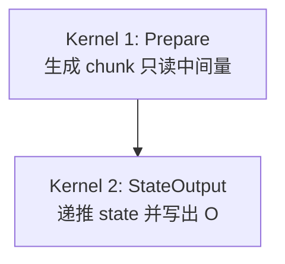
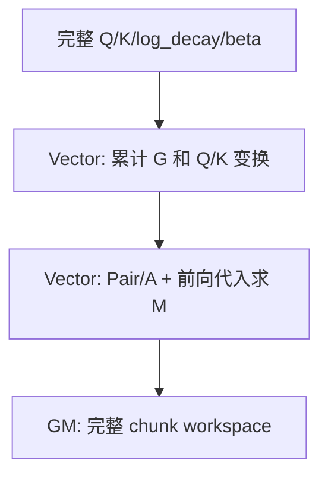
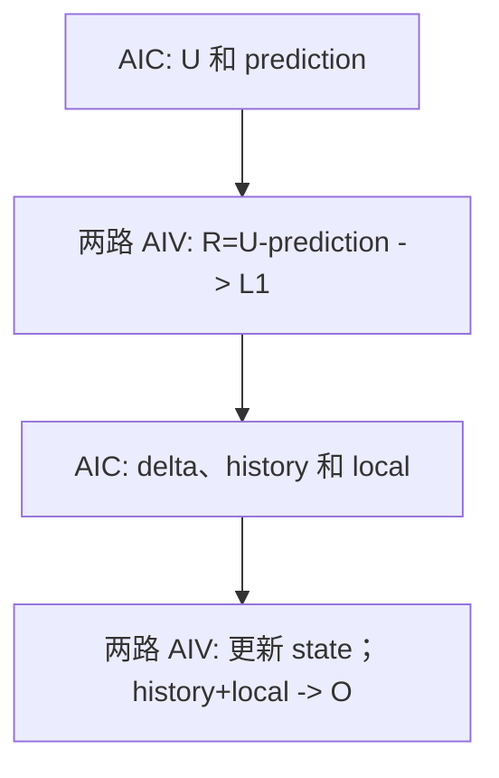

# KDALite v1：两 Kernel 融合与双槽流水

## 版本概览

v1 保持 v0 的 Chunk KDA 语义，把三个 Kernel 合并为纯 AIV Prepare 和 Mix StateOutput。Prepare 不再生成 W/U，LocalOutput 并入状态递推阶段，因而减少了 Kernel launch 和 GM workspace 中间量。

| 张量 | Shape | dtype | 说明 |
| --- | --- | --- | --- |
| Q | `[B,1,S,128]` | BF16 | 已完成 L2Norm 和 `1/sqrt(128)` 缩放。 |
| K | `[B,1,S,128]` | BF16 | 已完成 L2Norm。 |
| V | `[B,1,S,128]` | BF16 | Value。 |
| log_decay | `[B,1,S,128]` | FP32 | 已完成门函数，取值不大于 0。 |
| beta | `[B,1,S]` | BF16 | 已完成 sigmoid。 |
| O | `[B,1,S,128]` | BF16 | 序列输出。 |
| final_state | `[B,1,128,128]` | FP32 | 状态布局为 `[Dk,Dv]`。 |

本版支持可变 `B/S`，固定 `N=1`、`Dk=Dv=128`，初始状态为 0。当前源码的接口、任务切分和片上布局要求 `Dk==Dv`；这是样例支持边界，不是 KDA 数学公式的限制。`CHUNK_SIZE=C` 是编译期常量，支持 16、32 和 64，默认值为 32。Q/K/V 投影、ShortConv、门参数生成、输出归一化、Decode 和反向计算不在本样例范围内。

## 数学约定与 Chunk 公式

下文省略 Batch 和 Head 轴，令 `g_i=log_decay_i`。token 向量均为行向量，状态为 `[Dk,Dv]`。`@` 表示矩阵乘，`*` 表示逐元素乘，`.T` 表示转置，`Diag(x)` 表示以 x 为对角线的矩阵。

```text
q_i, k_i:      [1,Dk]
v_i, r_i, o_i: [1,Dv]
state_i:       [Dk,Dv]

alpha_i         = exp(g_i)
decayed_state_i = Diag(alpha_i) @ state_(i-1)
prediction_i    = k_i @ decayed_state_i
r_i             = beta_i * (v_i - prediction_i)
state_i         = decayed_state_i + k_i.T @ r_i
o_i             = q_i @ state_i
```

对一个长度为 C 的 chunk：

```text
G_i         = sum(g_t, t=0...i)                         [1,Dk]
Gamma_i     = exp(G_i)                                  [1,Dk]
Q_plus[i]   = Gamma_i * Q[i]                            [1,Dk]
K_plus[i]   = Gamma_i * K[i]                            [1,Dk]
K_tail[i]   = exp(G_last-G_i) * K[i]                    [1,Dk]
state_decay = exp(G_last)                               [1,Dk]
```

严格下三角 Key-Key 关系与求 M 的前向代入为：

```text
pairKK[i,j] = sum_d K[i,d] * K[j,d] * exp(G_i[d]-G_j[d]),  j<i

L[i,i] = 1
L[i,j] = beta_i * pairKK[i,j],  j<i
L[i,j] = 0,                       j>i

L @ M  = Diag(beta)
M[i,:] = beta_i*e_i - sum_(j<i)(beta_i*pairKK[i,j])*M[j,:]
```

本文按 `i=0,...,C-1` 编号。`e_i∈R^{1×C}` 是第 `i` 个标准基行向量：第 `i` 项为 1，其余项为 0，因此 `beta_i*e_i` 是 `Diag(beta)` 的第 `i` 行。

局部输出系数 A 包含因果下三角和对角线：

```text
A[i,j] = sum_d Q[i,d] * K[j,d] * exp(G_i[d]-G_j[d]),  j<=i
A[i,j] = 0,                                                   j>i
```

StateOutput 对一个 chunk 计算：

```text
U            = M @ V                              [C,Dv]
K_plus_state = K_plus @ state_in                  [C,Dv]
prediction   = M @ K_plus_state                   [C,Dv]
history      = Q_plus @ state_in                  [C,Dv]
R            = U - prediction                     [C,Dv]
delta        = K_tail.T @ R                       [Dk,Dv]
local        = A @ R                              [C,Dv]

state_out = Diag(state_decay) @ state_in + delta
O         = history + local
```

v0 的 prediction 路径是 `(M@K_plus)@state_in`，v1 改为 `M@(K_plus@state_in)`。实数代数相同，但 BF16 量化位置不同，因此精度校验仍使用独立的逐 token Recurrent KDA Golden。

## Kernel 总览

### 入口与执行顺序

v1 定义一个纯 Vector 入口和一个 `__mix(1,2)` 入口：

```cpp
__global__ __vector__ void kimi_delta_attn_lite_prepare_k(
    GM_ADDR q, GM_ADDR k, GM_ADDR logDecay, GM_ADDR beta, GM_ADDR workspace,
    KDALite::KimiDeltaAttnLiteTilingData data);

__global__ __mix__(1, 2) void kimi_delta_attn_lite_state_update_k(
    GM_ADDR value, GM_ADDR output, GM_ADDR finalState, GM_ADDR workspace,
    KDALite::KimiDeltaAttnLiteTilingData data);
```



两个入口在同一 stream 中异步提交，launch 顺序保证 StateOutput 读取到完整 workspace。`StateOutput` 是本文对第二个融合阶段的称呼，源码和 profiler 中的入口符号仍为 `kimi_delta_attn_lite_state_update_k`。

### 任务划分与 AIV 分工

```text
Tc           = ceil(S/C)
prepareTasks = B * Tc
stateTasks   = B * (128/DV_TILE)
```

文档中的 AIC 侧 DvTile 对应源码常量 `DV_TILE=32`，因此 `DV_TILE_COUNT=VALUE_DIM/DV_TILE=128/32=4`。同组两路 AIV 均分这 32 列，所以 AIV 侧 DvTile 为 `AIV_DV_TILE=DV_TILE/2=16`。这组 Dv 切分与 `CHUNK_SIZE=C` 无关。

| Kernel | 一个 task | AIV0/AIV1 的关系 |
| --- | --- | --- |
| Kernel 1：Prepare | `(batch,chunk)` | 纯 AIV 任务；每个物理 AIV 独立领取并完整处理不同 chunk，不存在组内配对。 |
| Kernel 2：StateOutput | `(batch,dvTile)` | 同组两路 AIV 协作同一 `[Dk,DV_TILE]=[128,32]` state 切片，各维护 `[Dk,AIV_DV_TILE]=[128,16]`。 |

不同 `(batch,dvTile)` task 可以分配到不同 Mix 组并行执行。每个 Mix task 内只按 Chunk 顺序推进一条状态列链，没有 v2 的多 lane 滚动调度。

StateOutput 中，AIC 发布一次信号后两路 AIV 都能接收；反向则要等 AIV0 和 AIV1 都完成，AIC 的等待才结束。这个机制只传递事件，不合并数值。两路 AIV 通过写入共享 L1 的相邻区域组成完整 state 或 R。

`--core-num` 按 Mix 组上限解释。纯 AIV Prepare 最多使用其两倍数量的 AIV，Mix StateOutput 最多使用该数量的 Mix 组；任务不足时均按实际任务数缩减 launch。

### Workspace

Workspace 只保留 StateOutput 需要的 chunk 数据：

| 分段 | 每 chunk shape | dtype | 字节数 |
| --- | --- | --- | ---: |
| K_plus | `[C,Dk]` | BF16 | `256*C` |
| Q_plus | `[C,Dk]` | BF16 | `256*C` |
| K_tail | `[C,Dk]` | BF16 | `256*C` |
| M | `[C,C]` | BF16 | `2*C*C` |
| A | `[C,C]` | BF16 | `2*C*C` |
| state_decay | `[Dk]` | FP32 | 512 |

每个 chunk 占用 `4*C*C + 768*C + 512` 字节。C=16、32、64 时分别为 13824、29184、66048 字节。Host 使用 64 位整数检查任务数、分段大小、offset 和 workspace 总量。

## Kernel 1：Prepare

### 输入、输出与计算

Prepare 读取 Q、K、log_decay 和 beta，不读取 V。它生成完整 K_plus、Q_plus、K_tail、M、A 和 state_decay，并写入 workspace。

### AIV 任务与数据流

本 Kernel 不启动 AIC，也不建立同组 AIV0/AIV1 配对。每个物理 AIV 都是独立执行单元：`blockIdx=p` 和 `blockIdx=p+1` 通常处理两个不同 Chunk，每个 AIV 都计算自己 Chunk 的全部 C 行和 128 个 Dk 通道。



```text
MTE2: Q/K/log_decay/beta GM -> UB
Vector: cumulative G -> Q_plus/K_plus/K_tail/state_decay
Vector: Pair/A + FP32 前向代入 M -> BF16 M/A
MTE3: 六个结果分段 -> GM workspace
```

`PrepareTransformsVF` 只循环有效行，并在 UB 中补齐尾行。`PreparePairASolveMVF` 按完整 C 行处理，逐行缓存当前 Q/K/G，在寄存器中计算 `exp(G_i-G_j)`，不生成 `[C,C,Dk]` 的 relativeDecay 张量。M 先以 FP32 保存在 UB，全部完成后再转为 BF16。

Prepare 不需要 CrossCore 同步。每个 AIV 的 UB 是单槽，Mutex 依次把该槽交给 MTE2、Vector 和 MTE3。UB 上界为 `8*C*C + 2306*C + 512` 字节；C=16、32、64 时分别为 39456、82496、180864 字节，均低于单 AIV 可用的 248KiB。

## Kernel 2：StateOutput

### 输入、输出与计算

StateOutput 从 GM 读取 V，并从 workspace 读取 Prepare 的六个分段。U、prediction、R、delta、history 和 local 都在片上生成和消费；Kernel 只向 GM 写 O 和 final_state。

AIC 对每个 chunk 发射六次 BF16×BF16→FP32 Mmad：

| 顺序 | 计算 | 结果去向 |
| ---: | --- | --- |
| 1 | `M @ V` | 两路 AIV 的 U 结果区。 |
| 2 | `K_plus @ state` | BF16 K_plus_state L1。 |
| 3 | `M @ K_plus_state` | 两路 AIV 的 prediction 结果区。 |
| 4 | `Q_plus @ state` | 两路 AIV 的 history 结果区。 |
| 5 | `K_tail.T @ R` | 两路 AIV 的 delta 结果区。 |
| 6 | `A @ R` | 两路 AIV 的 local 结果区。 |

K_plus_state 从 FP32 L0C 转为 BF16 NZ 后写入 L1，再进入 L0B。其余结果由 Fixpipe 沿 Dv 列直接均分给两路 AIV。

### AIV0、AIV1 与 AIC 的列切分

一个 task 处理 `[Dk,DV_TILE]=[128,32]` state 切片。设 `dvBase=dvTile*DV_TILE`：

| 核心 | 全局 Dv 列 | 本地数据 | 主要工作 |
| --- | --- | --- | --- |
| AIV0 | `dvBase+[0,AIV_DV_TILE)` | state/delta 为 `[Dk,AIV_DV_TILE]`，其余为 `[C,AIV_DV_TILE]` | 维护低半区 state，计算低半区 R/O。 |
| AIV1 | `dvBase+[AIV_DV_TILE,DV_TILE)` | shape 与 AIV0 相同 | 维护高半区 state，计算高半区 R/O。 |
| AIC | 完整 `DV_TILE` 列 | Cube 结果为 `[C,DV_TILE]` 或 `[Dk,DV_TILE]` | 读取两路拼成的 state/R，完成六次矩阵乘。 |



AIC 的每个 `[*,DV_TILE]` 结果按列均分，前 `AIV_DV_TILE` 列进入 AIV0 UB，后 `AIV_DV_TILE` 列进入 AIV1 UB。反向交接时，两路 AIV 分别把自己的 state 副本或 R 写入共享 L1 的前后半区；AIC 等两路都写完后，一次读取完整 `[Dk,DV_TILE]` state 或 `[C,DV_TILE]` R。这个拼接不做求和。

### 双槽调度

AIC 在 task 开始时预取 chunk 0 并发射 U(0)。主循环处理当前 chunk 时，同时预取下一 chunk；history 发出后，在等待当前 R 之前发射下一 chunk 的 U。

```text
预热: preload(0) -> U(0)

chunk i:
  preload(i+1)
  K_plus@state -> K_plus_state -> M@K_plus_state
  Q_plus@state -> history
  发布 U(i) + prediction(i)
  发射 U(i+1)
  等待 R(i)
  K_tail.T@R -> delta
  A@R -> local
  发布 delta(i) 和 history(i)+local(i)
```

调度中的 CrossCore 交接可压缩为：

```python
# AIC
initialize_state_and_r_free()
preload_chunk_0_and_issue_u()
for chunk in chunks_in_order:
    preload_next_chunk_if_present()
    wait_state_then_issue_prediction_and_history()
    issue_next_u_if_present()
    wait_r_then_issue_delta_and_local()
drain_aiv_returned_slots()

# AIV0/AIV1，各处理自己的 AIV_DV_TILE 列
initialize_result_slots_free()
publish_zero_state()
for chunk in chunks_in_order:
    wait_u_prediction_then_publish_r()
    wait_delta_then_update_and_publish_next_state()
    wait_history_local_then_store_output()
drain_aic_returned_slots()
```

### 同步与片上资源

同一个 FlagID 在 ready 和 free 两个方向交替传递资源所有权。AIC 生产 U/prediction、delta 和 history/local；AIV 生产 state 副本和 R。

| FlagID | 资源 | ready | free |
| --- | --- | --- | --- |
| 0、1 | state 双槽 | AIV 写完，AIC 可读。 | AIC 读完，AIV 可复用。 |
| 2、3 | U/prediction 双槽 | AIC 写完，AIV 可读。 | AIV 读完，AIC 可复用。 |
| 4 | R L1 单槽 | AIV 写完，AIC 可读。 | AIC 读完，AIV 可复用。 |
| 5、6 | delta 双槽 | AIC 写完，AIV 可读。 | AIV 读完，AIC 可复用。 |
| 7、8 | history/local 双槽 | AIC 写完，AIV 可读。 | AIV 读完，AIC 可复用。 |

U 和 prediction 共用一组结果区：AIC 写完 prediction 后才发布 ready。history 和 local 采用同样方式。task 开始时先发布所有空槽，结束时双方消费尚未返回的 free；奇数尾 chunk 未使用的固定槽也必须完成配对。history/local 的 free 只表示 AIV 已完成 Vector 读取，output UB 的 Mutex 继续保护后续 MTE3 写回。

默认 C=32 时的主要片上布局为：

| 位置 | 内容 | 槽数 | 总大小 |
| --- | --- | ---: | ---: |
| AIC L1 | K_plus/Q_plus/M/K_tail/A | 2 | 57344B |
| AIC L1 | state 副本 / V / K_plus_state | 2/2/2 | 16384/4096/4096B |
| AIC L1 | R | 1 | 2048B |
| AIC L0A/L0B/L0C | Mmad 输入和结果 | 2/见源码/4 | 16384/14336/65536B |
| 单路 AIV UB | 结果交接、state、R、decay、output | 见源码 | 50176B |

chunk 级双槽统一使用 `slot=chunkId%2`。AIV 持有的 FP32 state、BF16 state 副本 UB 和共享 R L1 为单槽；L0A 与 L0C 分别按 `opIdx%2` 和 `opIdx%4` 轮转，因为一个 chunk 会连续发射六次 Mmad。片上地址由 constexpr 显式规划，不使用 TPipe；Mutex 管理核内流水间的地址复用，跨核事件管理 AIC 与两路 AIV 的交接。

## 从 v0 到 v1

- Kernel 数从三个减为两个，LocalOutput 并入 StateOutput。
- Prepare 改为纯 AIV，删除 W/U；StateOutput 现场计算 U，并用 `M@(K_plus@state)` 计算 prediction。
- 默认 C=32 的 workspace 从 68096B/chunk 减少到 29184B/chunk。
- v0 使用单槽；v1 StateOutput 为 chunk 输入和跨核结果开启双槽，L0C 使用四槽。
- V 仍由 AIC 从 GM 直接搬入 L1，不经过 AIV UB。

## 运行、精度与限制

快速执行使用较短序列并跳过 Golden：

```bash
./build/Samples/2_Performance/kimi_delta_attn_lite_story/kdalite_v1 --dry-run --size 32 4096
```

去掉 `--dry-run` 会生成 Recurrent Golden，并检查 O 与 final_state。下面的规格可检查跨 chunk 尾块：

```bash
./build/Samples/2_Performance/kimi_delta_attn_lite_story/kdalite_v1 --size 2 65
```

Prepare 只从 GM 读取 `validLen` 行，并把无效行补成 `Q/K=0`、`beta=0`、`log_decay=0`。StateOutput 按完整 C 行计算，最终只写有效输出行；V 的 L1 槽在尾块搬入前清零。

O 按 BF16、final_state 按 FP32 比较，判据为 `abs(npu-golden) <= 2^-6 + 2^-6*abs(golden)`；NaN 或 Inf 直接失败。Prepare 把 Q_plus、K_plus、K_tail、M 和 A 量化为 BF16；StateOutput 使用 BF16 state 副本和 K_plus_state 参与 Cube 计算，并把 R/O 量化为 BF16。U、prediction、history、delta、local、递推 state 和 final_state 保持 FP32，直到明确的量化或写回位置。

已验证 C32 的 `S=1/31/32/33/65`、`B=2,S=513`、`B=8,S=4096`、`beta=0/1` 和 `log_decay=0`，以及 C16 的 `S=17` 与 C64 的 `S=65`。C64 只通过随机衰减用例，不能外推到完整模型门值范围。

## 性能参考

采集环境为 CANN 9.2、`dav-3510`、C32、1650MHz，不传 `--core-num`，运行 `--dry-run --size 32 65536`。一次应用运行采集全部 Kernel，重复三次后分别取各 Kernel 的 `Task Duration` 中位数并求和。

| Kernel | Task Duration 中位数 (us) |
| --- | ---: |
| Prepare | 8816.471680 |
| StateOutput | 13393.181641 |
| 合计 | 22209.653321 |

同一口径下，v0 合计为 41318.982422us；v1 下降 46.248305%，加速 1.860406x。合计不是 Host 端到端耗时，也不包含数据生成、H2D/D2H、Kernel launch、Golden 和比对。
