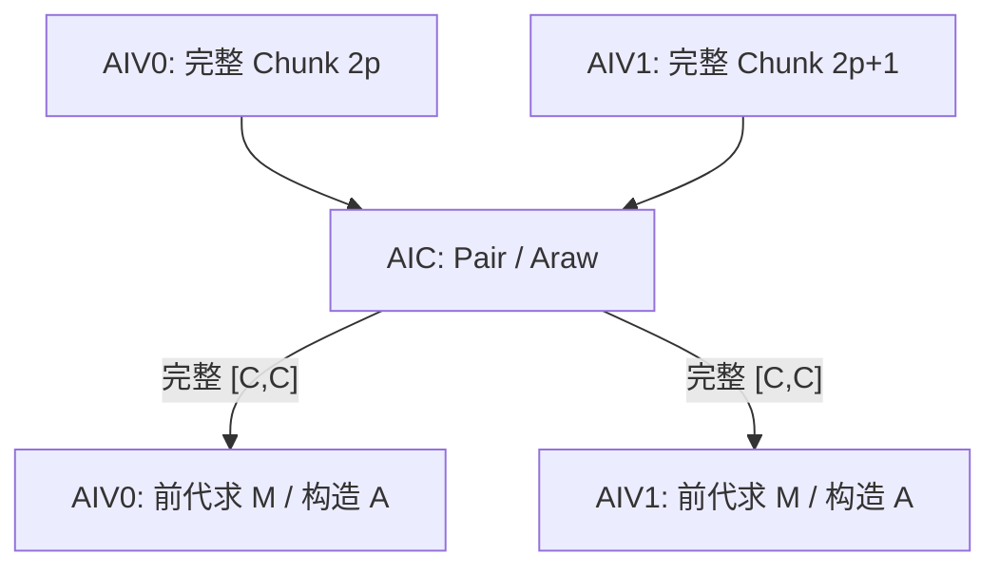
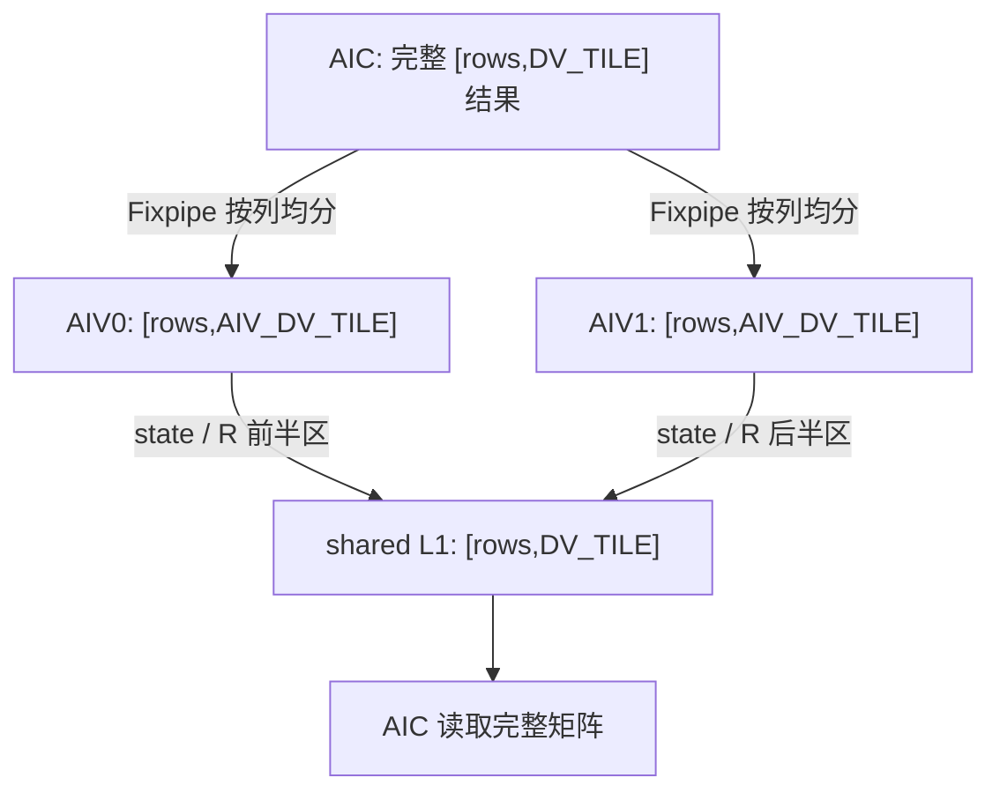

# KDALite v2：Cube Prepare 与多状态链 StateOutput

## 版本概览

v2 保留 v1 的双 Kernel 划分和 Chunk KDA 公式，将 Prepare 中的 Pair/Araw 点积迁移到 Cube，并为 Prepare 和 StateOutput 增加跨核滚动流水。本版支持可变 `B/S`，固定 `N=1`、`Dk=Dv=128`，初始 state 为零。本样例的接口、任务切分和片上布局要求 `Dk==Dv`；这是样例支持边界，不是 KDA 数学公式的限制。

```text
Kernel 1, Prepare:     VP(AIV) -> Cpair(AIC) -> VS(AIV)
Kernel 2, StateOutput: C1(AIC) -> V1(AIV) -> C2(AIC) -> V2(AIV)
```

VP 表示两路 AIV 准备变换数据，Cpair 表示 AIC 计算 Pair/Araw，VS 表示 AIV 前向代入求 M/A。StateOutput 中，C1/V1 生成残差 R，C2/V2 再完成输出和状态更新。

`CHUNK_SIZE` 默认为 32，也可在编译时通过 `-DKDALITE_V2_CHUNK_SIZE=16` 选择 C16。v2 不开放 C64。

## 数学差异与约定

完整的 Recurrent KDA 和 Chunk KDA 推导见 [总 README 的 Chunk 公式](../../README.md#chunk-公式)；可直接用于实现的公式见 [NPU Kernel 公式速查](../../README.md#npu-kernel-公式速查)。本节只保留读取 v2 源码必需的公式，以及本版为 Cube 计算引入的缩放输入（factor）。

本文默认 token 向量为行向量。`@` 表示矩阵乘，`*` 表示逐元素乘，`.T` 表示转置。对一个有效长度为 `L` 的 Chunk，主要变量如下。

| 变量 | Shape | 含义 |
| --- | --- | --- |
| Q、K、V | `[C,128]` | 当前 chunk 的 Query、Key、Value。 |
| beta | `[C]` | 每个 token 的标量更新系数。 |
| g | `[C,128]` | `log_decay`。 |
| state | `[128,128]` | 跨 chunk 递推状态；Kernel 内按 32 列切片。 |
| O | `[C,128]` | 当前 chunk 的输出。 |

第 `i` 个 token 的累计衰减为：

```text
G_i    = sum(g_t, t=0...i)                              [1,128]
G_tail = G_(L-1)                                        [1,128]
```

Prepare 计算：

```text
Q_plus_i    = Q_i * exp(G_i)                            [1,128]
K_plus_i    = K_i * exp(G_i)                            [1,128]
K_inv_i     = K_i * exp(-G_i)                           [1,128]
K_tail_i    = K_i * exp(G_tail-G_i)                     [1,128]
state_decay = exp(G_tail)                               [1,128]

Pair = K_plus @ K_inv.T                                 [C,C]
Araw = Q_plus @ K_inv.T                                 [C,C]
Lmat = StrictLower(Diag(beta) @ Pair)                   [C,C]
M    = inverse(I+Lmat) @ Diag(beta)                     [C,C]
A    = Lower(Araw)                                      [C,C]
```

源码不显式求逆，而是逐行前向代入：

```text
M_i = beta_i*e_i - beta_i*sum(Pair_(i,j)*M_j, j=0...i-1)
```

本文按 `i=0,...,C-1` 编号。`e_i∈R^{1×C}` 是第 `i` 个标准基行向量：第 `i` 项为 1，其余项为 0，因此 `beta_i*e_i` 正是 `Diag(beta)` 的第 `i` 行。`StrictLower` 不含对角线，`Lower` 包含对角线。

StateOutput 将 128 个 Dv 通道切为 4 个 AIC 侧列块。这个列块在源码中是 `DV_TILE=32`，具体来源见后文的任务映射。对一个 `state_in=[128,DV_TILE]` 列切片，计算为：

```text
U           = M @ V                                    [C,32]
KPlusState  = K_plus @ state_in                         [C,32]
prediction  = M @ KPlusState                            [C,32]
R           = U - prediction                            [C,32]
history     = Q_plus @ state_in                         [C,32]
delta       = K_tail.T @ R                              [128,32]
state_out   = Diag(state_decay) @ state_in + delta      [128,32]
local       = A @ R                                     [C,32]
O           = history + local                           [C,32]
```

以上公式描述数学语义。实现中，AIV 以 FP32 保存 state 本体，再将 BF16 shadow 交给 AIC；R 在 AIV 中以 FP32 相减后转为 BF16；Cube 输入为 BF16，L0C 累加、state 更新和 `state_decay` 为 FP32。O 与对外的 `final_state` 均为 BF16。最后一次 `UpdateStateAndShadowVF` 在更新 FP32 state 的同时生成 BF16 shadow，AIV 直接把该 shadow 写入 `final_state` GM。

固定为 1 的 Head 轴不写入数据文件。O 的物理布局为 `[B,S,128]`，占 `256*B*S` 字节；`final_state` 的物理布局为 `[B,128,128]`，占 `32768*B` 字节。O 和 `final_state` 均为 BF16，workspace 的分段和大小见下文。

## Kernel 总览

### 入口与调用顺序

两个 Kernel 在同一 stream 中按下列顺序发射：

```cpp
__global__ __mix__(1, 2) void kimi_delta_attn_lite_prepare_k(
    GM_ADDR q, GM_ADDR k, GM_ADDR logDecay, GM_ADDR beta,
    GM_ADDR workspace, KDALite::KimiDeltaAttnLiteTilingData data);

__global__ __mix__(1, 2) void kimi_delta_attn_lite_state_update_k(
    GM_ADDR value, GM_ADDR output, GM_ADDR finalState,
    GM_ADDR workspace, KDALite::KimiDeltaAttnLiteTilingData data);

// 同一 stream
kimi_delta_attn_lite_prepare_k<<<data.prepareUseAicNum, 0, stream>>>(...);
kimi_delta_attn_lite_state_update_k<<<data.stateUseAicNum, 0, stream>>>(...);
```

Prepare 完成后，StateOutput 才读取 workspace。每个 Prepare 成对任务最多处理两个完整 Chunk；Chunk 总数为奇数时只处理一个，另一 AIV 仅完成同步。每个 StateOutput 任务处理一个 Batch 的 32 个 Value 列。

`--core-num` 按 Mix 组上限解释。两个 Kernel 均最多使用该数量的 Mix 组；如果对应阶段的任务更少，则按实际任务数缩减 launch。

### Workspace

Workspace 按中间量分段，各段存放所有 Chunk 的同类数据，段首按 32B 对齐。

| 分段 | Shape/chunk | dtype | 字节/chunk |
| --- | --- | --- | ---: |
| K_plus、Q_plus、K_tail | 各 `[C,128]` | BF16 | `3*256C` |
| M、A | 各 `[C,C]` | BF16 | `4C²` |
| state_decay | `[128]` | FP32 | `512` |
| 合计 |  |  | `4C²+768C+512` |

C16/C32 每个 chunk 分别使用 13824B/29184B。Pair、Araw 和用于 Cube 的 factor 只存在于片上，不写入 workspace。

## Kernel 1：Prepare

### 输入、输出与 Cube 公式

Prepare 读取 Q、K、`log_decay` 和 beta，向 workspace 写出 K_plus、Q_plus、K_tail、M、A 和 `state_decay`。Pair、Araw 和 Cube factor 只在片上存活。

直接把 `K_inv=K*exp(-G)` 转成 BF16 可能放大强衰减输入的数值范围。v2 对每个 Dk 通道取 `anchor=G_tail/2`：

```text
QFactor_i    = Q_i * exp(G_i-anchor)
KFactor_i    = K_i * exp(G_i-anchor)
KInvFactor_i = K_i * exp(anchor-G_i)

Pair = KFactor @ KInvFactor.T
Araw = QFactor @ KInvFactor.T
```

anchor 在点积中相消。BF16 factor 经过舍入后不保证与标准公式逐位相同。K_plus、Q_plus 和 K_tail 仍由 FP32 寄存器路径生成并写入 workspace，factor 不写 GM。

### 任务映射与 AIV0/AIV1 分工

Host 将全部 Chunk 展平后两两组成成对任务（pair task）：

```text
prepareNumTasks     = B * ceil(S/C)
preparePairNumTasks = ceil(prepareNumTasks/2)
prepareUseAicNum    = min(preparePairNumTasks, availableMixCoreNum)
```

同一 Mix 组内，AIV0/AIV1 各处理一个完整 chunk，而不是沿 Dk 维切分。设当前 `pairTaskId=p`，两路 AIV 的任务和存储位置如下。

| 核心 | `taskId` | 负责的数据 | 当前 CV slot 内的 AIV L1 子槽 | 接收的 Cube 结果 |
| --- | ---: | --- | --- | --- |
| AIV0 | `2p` | 展平后第 `2p` 个完整 chunk，包含该 chunk 的全部 C 行和 128 个 Dk 通道。 | `subAivIdx=0` | 完整的 `Pair[0:C,0:C]` 和 `Araw[0:C,0:C]`。 |
| AIV1 | `2p+1` | 展平后第 `2p+1` 个完整 chunk，数据范围与 AIV0 相同但 chunk 不同。 | `subAivIdx=1` | 自己 chunk 的完整 `Pair` 和 `Araw`。 |

两路 AIV 的 UB 地址相同，但属于各自独立的本地 UB。共享 L1 中的 factor 地址由时间槽和 AIV 子槽共同确定。AIC 按 `subBlockIdx=0,1` 顺序计算两个 Chunk，再用 `subBlockId=0/1` 把完整 `[C,C]` 结果返回对应 AIV。Chunk 总数为奇数时，AIV1 的无数据分支仍执行同步，保持两路事件数量一致。



| 阶段 | 核心 | 计算与搬运 |
| --- | --- | --- |
| AIV0-VP | AIV0 | 搬入 `taskId=2p` 的 Q/K/log_decay/beta；VF 计算累计 G、Q_plus、K_plus、K_tail、state_decay 和三个 factor；MTE3 将 factor 写入当前共享时间槽的 AIV0 子槽，并将 Q_plus/K_plus/K_tail/state_decay 写入 Chunk `2p` 的 workspace。 |
| AIV1-VP | AIV1 | 搬入 `taskId=2p+1` 的完整输入并执行同样的 VF；factor 写入当前共享时间槽的 AIV1 子槽，Q_plus/K_plus/K_tail/state_decay 写入 Chunk `2p+1` 的 workspace。若该尾任务无效，只执行对称同步。 |
| Cpair | AIC | MTE1 读取 factor；两次 BF16×BF16→FP32 Mmad 得到 Pair/Araw；Fixpipe 将完整 `[C,C]` 结果定向写入对应 AIV 的 UB。 |
| AIV0-VS | AIV0 | 等待定向到 AIV0 的完整 Pair/Araw；执行 FP32 前代求 M，屏蔽 Araw 上三角得到 A；转 BF16 后写入 Chunk `2p` 的 workspace。 |
| AIV1-VS | AIV1 | 等待定向到 AIV1 的完整 Pair/Araw，对 Chunk `2p+1` 执行同样的前代与写回；无效尾任务不访问数值数据。 |

Prepare 中两路 AIV 对应两个不同 chunk，因此 AIC 通过 `subBlockId` 将完整结果定向到某一路 AIV；这与 StateOutput 将同一个 32 列结果均分给两路 AIV 的用法不同。

### 双槽调度

Prepare 使用两个 AIC/AIV 共享时间槽，槽号为 `ordinal%2`。AIV 先预发两代 VP，使下一代变换不被当前 VS 的结果等待挡住。

```text
AIV: VP(0)    -> VP(1)    -> VS(0) -> VP(2)    -> VS(1) -> VP(3)    -> ... -> VS(last)
AIC: Cpair(0) -> Cpair(1) -> Cpair(2) -> Cpair(3) -> ...
```

必要调度骨架如下：

```python
def prepare_aic():
    publish_input_free_for_both_slots()
    for task in pair_tasks:
        slot = ordinal(task) % 2
        wait_input_ready(slot)
        wait_result_free(slot)
        issue_pair_and_araw_for_valid_subtasks(task, slot)
        publish_input_free(slot)
        publish_result_ready(slot)
    drain_result_free_for_both_slots()

def prepare_aiv():
    publish_result_free_for_both_slots()
    issue_vp(0); issue_vp(1)                 # if present
    for task in steady_tasks:
        issue_vs(task)
        issue_vp(task + 2)
    drain_remaining_vs()
    drain_input_free_for_both_slots()
```

### CrossCore 同步

AIC 发出一次 Set 后，同组 AIV0/AIV1 都能等待该事件。反向交接时，AIC 要等两路 AIV 都 Set 才能继续。这只确认两路任务均已完成，不会合并数值数据。

| FlagID | 初始化 | ready/free 交接 | 尾部排空 |
| ---: | --- | --- | --- |
| 0/1，factor L1 | AIC `Set<PIPE_MTE1>`，L1 槽归 AIV。 | AIV `Wait<PIPE_MTE3>` 后写 factor，并 `Set<PIPE_MTE3>` ready；AIC `Wait<PIPE_MTE1>` 后读 factor，再 `Set<PIPE_MTE1>` free。 | AIV `Wait<PIPE_MTE3>` 排空两个固定槽。 |
| 2/3，Pair/Araw UB | AIV `Set<PIPE_V>`，结果槽归 AIC。 | AIC `Wait<PIPE_FIX>` 后写 Pair/Araw，并 `Set<PIPE_FIX>` ready；AIV `Wait<PIPE_V>` 后求 M/A，再 `Set<PIPE_V>` free。 | AIC `Wait<PIPE_FIX>` 排空两个固定槽。 |

两个物理槽都会初始化。未承载任务的槽和奇数尾组也保持握手次数一致，否则会留下未配对的跨核事件。

### Mutex 与片上资源

CrossCore 只管理 AIC/AIV 共享资源的所有权。核内 Mutex 分别约束 AIV 的 `MTE2 -> Vector -> MTE3`、AIC 的 `MTE1 -> Mmad` 和 `Mmad -> Fixpipe`，不使用 `PIPE_S`。

默认 C32 的片上资源如下。

| 核心 | 片上资源 |
| --- | --- |
| 每路 AIV | UB 双槽，每槽 88.5625KiB，共 177.125KiB。 |
| Mix L1 | 两个 CV 槽，每槽含两路 AIV 的三份 factor；每槽 48KiB，共 96KiB。 |
| AIC | 单套 L0A/L0B/L0C：8KiB/8KiB/4KiB。 |

## Kernel 2：StateOutput

### 输入、输出与计算

StateOutput 读取 Prepare workspace 和 V，在 Chunk 之间递推 FP32 state，最终写出 BF16 O 和 BF16 `final_state`。U、prediction、R、delta、history 和 local 均只在片上存活；`final_state` 复用最后一次状态更新已经生成的 BF16 shadow。

### 任务映射与 AIV0/AIV1 分工

```text
stateNumTasks  = B * 4
taskId         = batchId * 4 + dvTileId
stateUseAicNum = min(stateNumTasks, availableMixCoreNum)
```

文档中的 AIC 侧 DvTile 对应源码常量 `DV_TILE=32`，因此 `DV_TILE_COUNT=VALUE_DIM/DV_TILE=128/32=4`。同组两路 AIV 均分这 32 列，所以 AIV 侧 DvTile 为 `AIV_DV_TILE=DV_TILE/2=16`。一个 task 处理一个 `[128,DV_TILE]` state 列切片；令 `base=dvTileId*DV_TILE`，AIV0 负责前半列，AIV1 负责后半列。

| 核心 | Value/O/final_state 的列范围 | 本地 state | 本地计算与写回 |
| --- | --- | --- | --- |
| AIV0 | `[base,base+AIV_DV_TILE)` | `state[:,0:AIV_DV_TILE]`，Shape 为 `[128,AIV_DV_TILE]`，FP32；另有同 shape 的 BF16 shadow。 | 计算前半列的 R、state 和 O，写回 O，并在末 Chunk 后把 shadow 写入 `final_state` 前半区。 |
| AIV1 | `[base+AIV_DV_TILE,base+DV_TILE)` | `state[:,AIV_DV_TILE:DV_TILE]`，Shape 为 `[128,AIV_DV_TILE]`，FP32；另有同 shape 的 BF16 shadow。 | 对后半列执行相同流程，并写入对应的 O 与 `final_state` 后半区。 |
| AIC | 完整 `[base,base+DV_TILE)` | 从共享 L1 的两个相邻半区读取完整 `[128,DV_TILE]` BF16 状态副本。 | 搬入完整 `[C,DV_TILE]` Value tile，每个 Chunk 完成六次 Mmad，并通过 Fixpipe 按列分发结果。 |

AIC 的 `FixpipeToVecUB` 设置 `dualDstCtl=0b10` 和 `dstStride=AIV_DV_TILE`。U、prediction、history、delta 和 local 的前半列写入 AIV0，后半列写入 AIV1；两路本地 UB 中的 shape 都是 `[rows,AIV_DV_TILE]`。

反向交接通过共享 L1 的相邻地址完成。AIV0 写前半区，AIV1 写后半区；AIC 等两路都写完后，把相邻地址作为完整 `[128,DV_TILE]` state 或 `[C,DV_TILE]` R 读取。两路 AIV 都读取同一份 `[128]` `state_decay`，但只更新自己的 `AIV_DV_TILE` 列 state。



Host 按每个已用 AIC 至少分到的任务数选择同时维护的状态链数：

```text
tasksPerAic >= 4 -> laneCount=4
tasksPerAic >= 2 -> laneCount=2
otherwise        -> laneCount=1
```

后文调度术语统一如下：

| 术语 | 含义 |
| --- | --- |
| 状态链（源码中的 `lane`） | 一个独立的 `(batch,dvTile)` 任务，不是 C1/V1/C2/V2 的阶段编号。 |
| 任务组（源码中的 `wave`） | 同一 Mix 组同时滚动的 `laneCount` 条状态链。 |
| 工作项（源码中的 `item`） | 某条状态链上的一个 Chunk。 |
| 调度轮次（源码中的 `epoch`） | 一次发射新 C1 并尝试推进旧 C2 的轮次。 |
| Chunk 只读矩阵 | `K_plus/Q_plus/M/K_tail/A`，同一 Chunk 的不同 DvTile 可共用。 |
| 结果交接 | AIC 与 AIV 通过共享 L1 或结果 UB 传递数据。 |
| 缓冲区等待 | 下一次发射因物理槽尚未归还而等待。 |

`laneCount=1/2/4` 只改变任务和状态链的发射方式，不改变上述 AIV0/AIV1 列切分。每条状态链都由同一组的两路 AIV 合作维护一个 `DV_TILE` 列 state tile。

### 单状态链专用流程

`laneCount=1` 使用独立源码路径和同步协议，不是通用多状态链流程的退化分支。每个 AIC 串行处理分配到的任务；Chunk 只读矩阵、Value、state L1 发布槽和 state_decay 按 Chunk 奇偶使用双槽，AIV 的 FP32 state 本体为单槽，残差 R 只使用一个 L1 槽。

```text
prologue: preload Chunk 只读矩阵(0), Value(0), state_decay(0), U(0)

chunk i:
  AIC: preload inputs(i+1)
       wait state(i)
       K_plus@state -> M@KPlusState -> prediction
       Q_plus@state -> history
       issue U(i+1)
       wait R(i)
       K_tail.T@R -> delta
       A@R -> local
  AIV: U-prediction -> R -> L1
       state_decay*state+delta -> FP32 state/BF16 shadow
       publish state(i+1)
       history+local -> BF16 O -> GM
```

单状态链的专用跨核同步协议如下。

| FlagID | 初始化与交接 | task 末尾 |
| ---: | --- | --- |
| 0/1，state 奇偶槽 | AIC `Set<PIPE_MTE1>` free；AIV `Wait/Set<PIPE_MTE3>` 写 state ready；AIC `Wait/Set<PIPE_MTE1>` 读 state 并归还。 | AIV `Wait<PIPE_MTE3>` drain 两槽。 |
| 2，R 单槽 | AIC `Set<PIPE_MTE1>` free；AIV `Wait/Set<PIPE_MTE3>` 写 R ready；AIC `Wait/Set<PIPE_MTE1>` 读 R 并归还。 | AIV `Wait<PIPE_MTE3>` drain。 |
| 4/5，U/prediction 双槽 | AIV `Set<PIPE_V>` free；AIC 在 U Fix 前 `Wait<PIPE_FIX>`，prediction Fix 后 `Set<PIPE_FIX>` ready；AIV `Wait/Set<PIPE_V>` 计算 R 并归还。 | AIC `Wait<PIPE_FIX>` drain 两槽。 |
| 6/7，delta 双槽 | AIV `Set<PIPE_V>` free；AIC `Wait/Set<PIPE_FIX>` 写 delta；AIV `Wait/Set<PIPE_V>` 更新 state。 | AIC `Wait<PIPE_FIX>` drain 两槽。 |
| 8/9，history/local 双槽 | AIV `Set<PIPE_V>` free；AIC history Fix 时 `Wait<PIPE_FIX>`，local Fix 后 `Set<PIPE_FIX>` ready；AIV `Wait/Set<PIPE_V>` 完成相加和 Cast。 | AIC `Wait<PIPE_FIX>` drain 两槽。 |

所有 token 已在任务内闭环，因此单状态链流程不使用任务组完成通知（源码中的 `wave-done`）。

### 两条或四条状态链的滚动流水

一个 wave 的映射为：

```text
waveTaskBase = aicIdx*laneCount + wave*stateUseAicNum*laneCount
task(lane)   = waveTaskBase + lane
itemId       = chunkId*laneCount + lane
```

`stateNumTasks=B*4`，多状态链流程的 `laneCount` 只取 2 或 4，因此每个任务组分别固定包含 2 条或 4 条状态链，不存在不足 `laneCount` 的部分尾组。源码中的动态 `laneCount` 仅作防御性处理。

v2 在同一个 epoch 中先发完整的新 C1，再发旧 C2；AIV 先发 V1，再发 V2。

```text
AIC: C1(e) -> C2(e-laneCount+1), e>=laneCount-1 时存在 C2
AIV: V1(e-1) -> V2(e-laneCount)
```

```python
for wave in multi_lane_waves:
    initialize_all_physical_state_and_r_flags()
    for epoch in range(chunk_count * laneCount + laneCount):
        if has_new(epoch):
            issue_input_preload_u_and_c1(epoch)
        if has_old(epoch):
            issue_history_delta_and_local(epoch - laneCount + 1)
    drain_u_pred_and_v2_phase_flags()
    wait_wave_done_on_reused_state0()
```

K_plus/Q_plus/M/K_tail/A 与 Dv tile 无关，同一任务组只由第一条状态链搬入一次，所有状态链共用 `chunkMatrixSlot=chunkId%2`。最后一条状态链在 C2 读完 A 后归还 Chunk 矩阵槽。Value 仍按工作项双槽搬入。V1 到 C2 之间最多有 `laneCount-1` 个残差 R 同时在途，因此 R 的 L1 队列深度在两条状态链时为 1，在四条状态链时为 3。

### 多状态链的跨核同步

| FlagID | 初始化 | ready/free 交接 | wave 末尾 |
| ---: | --- | --- | --- |
| 0..3，state lane | AIC `Set<PIPE_MTE1>` 发布全部四个物理槽 free；AIV 将全零 BF16 状态副本发布为首个 ready。 | AIV `Wait/Set<PIPE_MTE3>` 写 state；AIC `Wait/Set<PIPE_MTE1>` 读 state。V2 更新后，AIV 为下一 chunk 再次发布。 | AIV `Wait<PIPE_MTE3>` 排空四个物理槽；随后复用已排空的 ID0 `Set<PIPE_MTE3>` 发送 wave-done，AIC 以额外一次 `Wait<PIPE_MTE1>` 接收。 |
| 4/5，U/prediction 双槽 | AIV `Set<PIPE_V>` free。 | AIC 在 U Fix 前 `Wait<PIPE_FIX>`，prediction Fix 后 `Set<PIPE_FIX>` ready；AIV V1 `Wait<PIPE_V>` 读两者并 `Set<PIPE_V>` free。 | AIC `Wait<PIPE_FIX>` drain。 |
| 6..8，R 队列 | AIC `Set<PIPE_MTE1>` 发布三个物理槽 free。 | AIV V1 `Wait/Set<PIPE_MTE3>` 写 R；AIC C2 `Wait/Set<PIPE_MTE1>` 读 R。 | AIV `Wait<PIPE_MTE3>` drain 三个物理槽。 |
| 9/10，V2 阶段双槽 | AIV `Set<PIPE_V>` free。 | AIC 以一次 `Wait<PIPE_FIX>` 开始 history，delta Fix 后 `Set<PIPE_FIX>`；AIV 第一次 `Wait/Set<PIPE_V>` 更新 state；AIC 再次 `Wait/Set<PIPE_FIX>` 写 local；AIV 第二次 `Wait/Set<PIPE_V>` 计算并写 O。 | AIC `Wait<PIPE_FIX>` drain。 |

ID9/10 在一次 item 中顺序承载两次握手：第一轮交接 history/delta 和 state ack，第二轮交接 local 和 O free。它不是一个泛化的“V2完成”标记。

### Mutex 与槽位

核内 Mutex 保护 L1、L0A、L0B、L0C 和 UB 的生产消费顺序。state L0B 从 `K_plus@state` 一直保留到 history 读取完成；R L0B 从 delta 一直保留到 local 读取完成，不能在第一次 Mmad 后提前释放。

| 位置 | 多状态链物理槽数 | 用途 |
| --- | ---: | --- |
| L1 Chunk 只读矩阵 | 4，逻辑使用 2 | 地址按四条状态链预留，实际按 Chunk 奇偶复用。 |
| L1 state/Value/KPlusState/R | 4/2/2/3 | state 按状态链；Value、KPlusState 双槽；R 队列最多为 `laneCount-1` 个槽。 |
| L0A/L0B/L0C | 2/7/4 | L0B 为 state 4 槽，加 Value、R、KPlusState 各 1 槽。 |
| 每路 AIV UB | FP32 state/BF16 状态副本/state_decay 各 4 | 每 lane 一份递推状态与衰减。 |
| 每路 AIV 结果交接 UB | U、prediction、history、delta、local、R stage、output 各 2 | 相邻工作项双槽交接。 |

默认 C32 下，多状态链 AIC 使用 L1/L0A/L0B/L0C 158/16/38/64KiB，每路 AIV 使用 86KiB UB。单状态链流程的 AIC L1 为 82KiB，每路 AIV UB 为 49KiB。

## 从 v1 到 v2

- Prepare 从纯 AIV 改为 `__mix(1,2)`，Pair/Araw 的 128 维点积迁到 Cube，M 的 FP32 前代仍留在 AIV。
- Prepare 增加 midpoint anchor，并用 VP/Cpair/VS 双槽滚动隐藏跨核等待。
- StateOutput 增加两条或四条状态链的滚动流水、残差 R 队列和同 Batch 的 Chunk 只读矩阵共享；单状态链保留独立流程。
- workspace 语义不变，StateOutput 的六次 Mmad 不变；C32 保留强衰减门禁，C64 不开放。

## 运行、精度与限制

快速执行使用较短序列并跳过 Golden：

```bash
./build/Samples/2_Performance/kimi_delta_attn_lite_story/kdalite_v2 --dry-run --size 32 4096
```

精度示例会同时比较 O 和 `final_state`：

```bash
./build/Samples/2_Performance/kimi_delta_attn_lite_story/kdalite_v2 --size 2 65
```

尾块将无效行按 `Q/K/V=0`、`beta=0`、`log_decay=0` 补齐。Kernel 片上仍按完整 C 行计算，最终只回写 `validLen` 行 O；`state_decay` 取最后一个有效 token 的累计值。

默认精度标准对齐 FlashKDA/FLA：将 NPU 的 BF16 O 和 `final_state` 转为 FP32，分别与未量化的 FP32 Recurrent Golden 计算 NRMSE，并要求 `NRMSE < 0.006`；NaN 或 Inf 直接失败。CANN 9.2、C32、`B=1,S=33,core-num=1` 的六类输入全部通过，其中 O 和 `final_state` 最大 NRMSE 分别为 0.003676 和 0.003120。统一大规格 random 输入 `B=32,S=4096` 也通过，两项 NRMSE 分别为 0.003830 和 0.002995。指标来源和完整测试矩阵见 [总 README：复现方法](../../README.md#复现方法)。

本版还覆盖 post-gate `log_decay in [-5,0]`、普通输入、尾块、1/2/4 条状态链、多任务组、强衰减和混合衰减。v2 仅支持 C16/C32，不支持 C64，不能通过放开 `static_assert` 启用。

## 性能参考

主性能环境为 CANN 9.2、`dav-3510`、C32、32 AIC/64 AIV 和 1650MHz，运行参数为 `--dry-run --size 32 65536`，不传 `--core-num`。msopprof 不指定 `--kernel-name`；重复三次后，分别取两个 Kernel 的 `Task Duration` 中位数再求和。

| 版本 | Prepare 中位数 (us) | StateOutput 中位数 (us) | Kernel Task Duration 合计 (us) |
| --- | ---: | ---: | ---: |
| v1 | 8797.722656 | 13432.345703 | 22230.068359 |
| v2 | 4766.383301 | 9558.908203 | 14325.291504 |

v2 相对 v1 的 Prepare 下降 45.822533%，StateOutput 下降 28.836642%，合计下降 35.558941%，加速 1.551806x。合计不是 Host 端到端耗时，也不包含数据生成、H2D/D2H、Kernel launch、Golden 和比对。

### 流水证据，不参与统一性能比较

采集环境为 CANN 9.2、`dav-3510`、C32、32 Mix 组和 1650MHz，运行 `--dry-run --size 32 4096`。该规格下每个 Mix 组分到 4 条状态链。Task Duration 来自 `OpBasicInfo.csv`，Pipe 数据只统计 PipeTimeline 采样到的 core0。

| Kernel | Task Duration (us) |
| --- | ---: |
| Prepare | 295.488983 |
| StateOutput | 602.562012 |

| StateOutput core0 指标 | AIC | AIV0 | AIV1 |
| --- | ---: | ---: | ---: |
| MTE2 active (us) | 243.704242 | - | - |
| MTE1 active (us) | 95.493333 | - | - |
| CUBE active (us) | 200.960609 | - | - |
| FIXP active (us) | 181.364845 | - | - |
| VECTOR active (us) | - | 197.388480 | 197.724843 |
| MTE3 active (us) | - | 207.981819 | 217.375756 |
| 任一 AIC 关注 Pipe active/span | 71.84% | - | - |
| CUBE 与 VECTOR overlap | - | 22.49% | 23.80% |

两路 AIV 的 VECTOR active 接近，符合沿 Dv 列对称切分的设计。AIC 与 AIV 仍存在较多可见空档，CUBE 与两路 VECTOR 的重叠率约为 22%～24%。不同 Pipe 可以并行，表中的 active 不能相加解释 Task Duration；PipeTimeline 的 busy 段也不等于指令数。core0 结果用于观察局部排布，不外推为全部 32 个 Mix 组。
