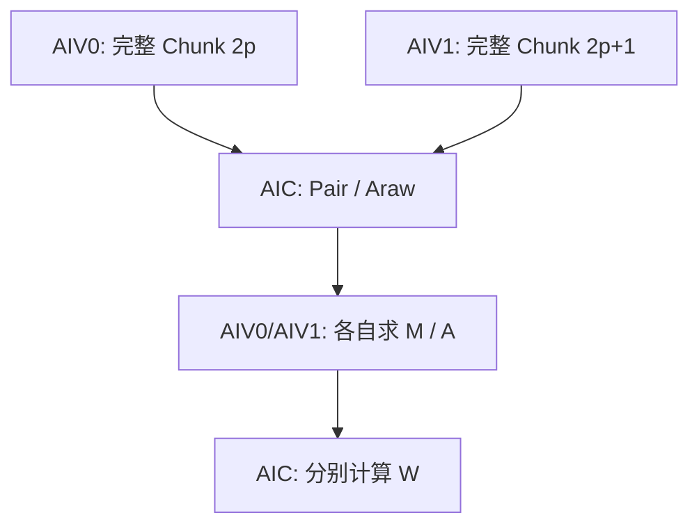
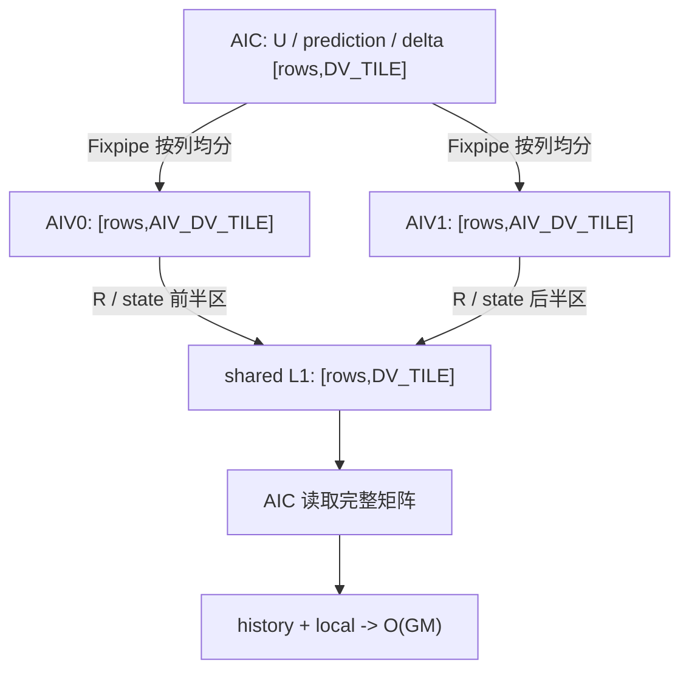

# KDALite v3：W 前移、输出直写与状态链重排

## 版本概览

v3 保留 v2 的两个 Mix Kernel、Prepare 双槽和 StateOutput 多状态链框架，调整三条数据路径：

- Prepare 新增 `W=M@K_plus`，workspace 首段由 K_plus 改为同 shape 的 W。
- StateOutput 用 `W@state` 计算 prediction，每个 item 的 Mmad 从六次减为五次，并删除 KPlusState 中转。
- history/local 在专用 L0C 槽中原地累加，由 AIC Fixpipe 直接写 O；多状态链路径按递推依赖重排发射顺序。

本版支持可变 `B/S`，固定 `N=1`、`Dk=Dv=128`，初始 state 为零。本样例的接口、任务切分和片上布局要求 `Dk==Dv`；这是样例支持边界，不是 KDA 数学公式的限制。`CHUNK_SIZE` 默认为 32，也可在编译时通过 `-DKDALITE_V3_CHUNK_SIZE=16` 选择 C16。v3 不支持 C64。

```text
Kernel 1, Prepare:     VP(AIV) -> Cpair(AIC) -> VS(AIV) -> Cw(AIC)
Kernel 2, StateOutput: C1Pre/C1Post(AIC) <-> V1/V2(AIV) <-> C2Core/Output(AIC)
```

VP 表示两路 AIV 准备变换数据，Cpair 表示 AIC 计算 Pair/Araw，VS 表示 AIV 前向代入求 M/A，Cw 表示 AIC 计算 W。StateOutput 中，C1Pre 预取输入并计算 U，C1Post 计算 prediction，V1 生成残差 R，C2Core 计算 history/delta/local，V2 更新状态，Output 写出 O。

## 数学差异与约定

完整的 Recurrent KDA 和 Chunk KDA 推导见 [总 README 的 Chunk 公式](../../README.md#chunk-公式)；可直接用于实现的公式见 [NPU Kernel 公式速查](../../README.md#npu-kernel-公式速查)。本节只保留读取 v3 源码必需的公式，以及 W 前移后的 prediction 路径。

本文默认 token 向量为行向量。`@` 表示矩阵乘，`*` 表示逐元素乘，`.T` 表示转置。对一个有效长度为 `L` 的 Chunk，主要变量如下。

| 变量 | Shape | 含义 |
| --- | --- | --- |
| Q、K、V | `[C,128]` | 当前 chunk 的 Query、Key、Value。 |
| beta | `[C]` | 每个 token 的标量更新系数。 |
| g | `[C,128]` | `log_decay`。 |
| state | `[128,128]` | 跨 chunk 递推状态；Kernel 内按 32 列切片。 |
| O | `[C,128]` | 当前 chunk 的输出。 |

第 `i` 个 token 的累计衰减为：

```text
G_i    = sum(g_t, t=0...i)                              [1,128]
G_tail = G_(L-1)                                        [1,128]
```

Prepare 计算：

```text
Q_plus_i    = Q_i * exp(G_i)                            [1,128]
K_plus_i    = K_i * exp(G_i)                            [1,128]
K_inv_i     = K_i * exp(-G_i)                           [1,128]
K_tail_i    = K_i * exp(G_tail-G_i)                     [1,128]
state_decay = exp(G_tail)                               [1,128]

Pair = K_plus @ K_inv.T                                 [C,C]
Araw = Q_plus @ K_inv.T                                 [C,C]
Lmat = StrictLower(Diag(beta) @ Pair)                   [C,C]
M    = inverse(I+Lmat) @ Diag(beta)                     [C,C]
A    = Lower(Araw)                                      [C,C]
W    = M @ K_plus                                       [C,128]
```

源码不显式求逆，而是逐行前向代入：

```text
M_i = beta_i*e_i - beta_i*sum(Pair_(i,j)*M_j, j=0...i-1)
```

本文按 `i=0,...,C-1` 编号。`e_i∈R^{1×C}` 是第 `i` 个标准基行向量：第 `i` 项为 1，其余项为 0，因此 `beta_i*e_i` 正是 `Diag(beta)` 的第 `i` 行。`StrictLower` 不含对角线，`Lower` 包含对角线。

StateOutput 将 128 个 Dv 通道切为 4 个 AIC 侧列块。这个列块在源码中是 `DV_TILE=32`，具体来源见后文的任务映射。对一个 `state_in=[128,DV_TILE]` 列切片，计算为：

```text
U          = M @ V                                     [C,32]
prediction = W @ state_in                               [C,32]
R          = U - prediction                             [C,32]
history    = Q_plus @ state_in                          [C,32]
delta      = K_tail.T @ R                               [128,32]
state_out  = Diag(state_decay) @ state_in + delta       [128,32]
local      = A @ R                                      [C,32]
O          = history + local                            [C,32]
```

以上公式描述数学语义。实现中，AIV 以 FP32 保存 state 本体，再将 BF16 shadow 交给 AIC；R 在 AIV 中以 FP32 相减后转为 BF16；Cube 输入为 BF16，L0C 累加、state 更新和 `state_decay` 为 FP32。O 与对外的 `final_state` 均为 BF16。最后一次 `UpdateStateAndShadowVF` 在更新 FP32 state 的同时生成 BF16 shadow，AIV 直接把该 shadow 写入 `final_state` GM。W 前移改变了 BF16 中间量的舍入位置，不能只根据实数结合律判断精度。

固定为 1 的 Head 轴不写入数据文件。O 的物理布局为 `[B,S,128]`，占 `256*B*S` 字节；`final_state` 的物理布局为 `[B,128,128]`，占 `32768*B` 字节。O 和 `final_state` 均为 BF16，workspace 的分段和大小见下文。

## Kernel 总览

### 入口与调用顺序

两个 Kernel 在同一 stream 中按下列顺序发射：

```cpp
__global__ __mix__(1, 2) void kimi_delta_attn_lite_prepare_k(
    GM_ADDR q, GM_ADDR k, GM_ADDR logDecay, GM_ADDR beta,
    GM_ADDR workspace, KDALite::KimiDeltaAttnLiteTilingData data);

__global__ __mix__(1, 2) void kimi_delta_attn_lite_state_update_k(
    GM_ADDR value, GM_ADDR output, GM_ADDR finalState,
    GM_ADDR workspace, KDALite::KimiDeltaAttnLiteTilingData data);

// 同一 stream
kimi_delta_attn_lite_prepare_k<<<data.prepareUseAicNum, 0, stream>>>(...);
kimi_delta_attn_lite_state_update_k<<<data.stateUseAicNum, 0, stream>>>(...);
```

Prepare 完成后，StateOutput 才读取 workspace。每个成对任务最多处理两个完整 Chunk；Chunk 总数为奇数时只处理一个，另一 AIV 仅完成同步。每个 StateOutput 任务处理一个 Batch 的 32 个 Value 列。

`--core-num` 按 Mix 组上限解释。两个 Kernel 均最多使用该数量的 Mix 组；如果对应阶段的任务更少，则按实际任务数缩减 launch。

### Workspace

Workspace 按中间量分段，各段存放所有 Chunk 的同类数据，段首按 32B 对齐。

| 分段 | Shape/chunk | dtype | 字节/chunk |
| --- | --- | --- | ---: |
| W、Q_plus、K_tail | 各 `[C,128]` | BF16 | `3*256C` |
| M、A | 各 `[C,C]` | BF16 | `4C²` |
| state_decay | `[128]` | FP32 | `512` |
| 合计 |  |  | `4C²+768C+512` |

C16/C32 每个 chunk 分别使用 13824B/29184B。v3 与 v2 的 workspace 大小相同，但首段含义不同，不能跨版本复用已有内容。Pair、Araw、K_plus 和用于 Cube 的 factor 只存在于 Prepare 的片上工作区。

## Kernel 1：Prepare

### 输入、输出与计算

Prepare 读取 Q、K、`log_decay` 和 beta，向 workspace 写出 W、Q_plus、K_tail、M、A 和 `state_decay`。Pair、Araw、K_plus 和 Cube factor 只在片上存活。本版沿用 v2 的 anchor factor，并在 Prepare 末尾增加 `W=M@K_plus`。

### 任务映射与 AIV0/AIV1 分工

Host 将全部 Chunk 展平后两两组成成对任务（pair task）：

```text
prepareNumTasks     = B * ceil(S/C)
preparePairNumTasks = ceil(prepareNumTasks/2)
prepareUseAicNum    = min(preparePairNumTasks, availableMixCoreNum)
```

同一 Mix 组内，AIV0/AIV1 各处理一个完整 chunk。设当前 `pairTaskId=p`，AIV0 负责展平后的 `taskId=2p`，AIV1 负责 `taskId=2p+1`；每一路都处理对应 chunk 的全部 C 行和 128 个 Dk 通道，不按 Dk 维切分。两路的 UB 地址相同但物理独立；共享 L1 地址同时由 `cvSlot` 和 `subAivIdx` 决定，每个 CV slot 内包含两个 AIV 子槽。

AIC 按 `subBlockIdx=0,1` 顺序计算两路 Chunk，并用 `subBlockId=0/1` 将完整 `[C,C]` Pair/Araw 返回对应 AIV。VS 求出 M 后，每路 AIV 再把自己 Chunk 的 M/K_plus 写回原 L1 子槽；Cw 按相同顺序读取两个子槽，分别计算 W 并写入 workspace。奇数尾组中，AIV1 的无数据分支仍执行三组同步，保持两路事件数量一致。



v3 沿用 v2 的 `anchor=G_tail/2` Cube factor：

```text
QFactor_i    = Q_i * exp(G_i-anchor)
KFactor_i    = K_i * exp(G_i-anchor)
KInvFactor_i = K_i * exp(anchor-G_i)

Pair = KFactor @ KInvFactor.T
Araw = QFactor @ KInvFactor.T
```

anchor 在实数点积中相消。公式中的 Q_plus/K_plus/K_tail 仍由 FP32 寄存器路径生成；factor 和 K_plus 不写 GM，W 才写入 workspace。

| 阶段 | 核心 | 计算与搬运 |
| --- | --- | --- |
| AIV0-VP | AIV0 | 搬入 `taskId=2p` 的完整输入，计算累计 G、Q_plus、K_plus、K_tail、state_decay 和三个 factor；factor 写入当前共享时间槽的 AIV0 子槽，Q_plus/K_tail/state_decay 写入 Chunk `2p` 的 workspace。 |
| AIV1-VP | AIV1 | 搬入 `taskId=2p+1` 的完整输入并执行同样的计算；factor 写入当前共享时间槽的 AIV1 子槽，Q_plus/K_tail/state_decay 写入 Chunk `2p+1` 的 workspace。若该尾任务无效，只执行对称同步。 |
| Cpair | AIC | 对两个有效子任务顺序计算 Pair/Araw，Fixpipe 将完整 `[C,C]` 结果定向写入对应 AIV。 |
| AIV0-VS | AIV0 | 对定向到 AIV0 的完整 Pair/Araw 执行 FP32 前代，生成 M/A；M/A 写 Chunk `2p` 的 workspace，同时将该 Chunk 的 M/K_plus 写入 AIV0 子槽。 |
| AIV1-VS | AIV1 | 对 Chunk `2p+1` 执行同样的前代与写回；无效尾任务不访问数值数据，但仍完成三组同步。 |
| Cw | AIC | 读取 M/K_plus，计算 `W=M@K_plus`，FP32 L0C 经 Fixpipe 转为 BF16 后写 workspace。 |

Prepare 中两路 AIV 对应两个不同 chunk，因此 Cpair 的 Fixpipe 定向输出完整结果，而不是按列均分。

### 双槽调度与 L1 分时复用

同一 L1 子槽依次经历三个所有权阶段：

```text
AIV VP 写 factor
  -> AIC Cpair 读取 factor
  -> AIV VS 覆写 M/K_plus
  -> AIC Cw 读取 M/K_plus
  -> 归还未来 VP
```

AIV 的 VP/VS 顺序与 v2 相同；AIC 先预发两代 Cpair，再交替发 Cw 和下一代 Cpair。

```text
AIV: VP(0)    -> VP(1)    -> VS(0) -> VP(2)    -> VS(1) -> VP(3)    -> ...
AIC: Cpair(0) -> Cpair(1) -> Cw(0) -> Cpair(2) -> Cw(1) -> Cpair(3) -> ...
```

```python
def prepare_aic():
    publish_input_free_for_both_slots()
    issue_cpair(0); issue_cpair(1)           # if present
    for task in steady_tasks:
        issue_cw(task)
        issue_cpair(task + 2)
    drain_remaining_cw()
    drain_result_free_for_both_slots()

def prepare_aiv():
    publish_result_free_for_both_slots()
    issue_vp(0); issue_vp(1)                 # if present
    for task in steady_tasks:
        issue_vs(task)
        issue_vp(task + 2)
    drain_remaining_vs()
    drain_input_free_for_both_slots()
```

### CrossCore 同步

| FlagID | 初始化 | ready/free 交接 | 尾部排空 |
| ---: | --- | --- | --- |
| 0/1，复用 L1 | AIC `Set<PIPE_MTE1>`，槽归 AIV VP。 | AIV VP `Wait/Set<PIPE_MTE3>` 写 factor ready；AIC Cpair `Wait<PIPE_MTE1>` 读 factor，但暂不归还；AIC Cw 读完 M/K_plus 后 `Set<PIPE_MTE1>` free。 | AIV `Wait<PIPE_MTE3>` 排空两个固定槽。 |
| 2/3，Pair/Araw UB | AIV `Set<PIPE_V>` free。 | AIC Cpair `Wait/Set<PIPE_FIX>` 写结果；AIV VS `Wait/Set<PIPE_V>` 读结果。 | AIC `Wait<PIPE_FIX>` 排空两个固定槽。 |
| 4/5，M/K_plus L1 | 无初始化信号；Cpair 是首个生产者。 | AIC Cpair 读完 factor 后 `Set<PIPE_MTE1>` 给 AIV 写许可；AIV VS `Wait/Set<PIPE_MTE3>` 写 M/K_plus ready；AIC Cw `Wait<PIPE_MTE1>` 后读取。 | 每个有效成对任务都在 Cw 内将事件一一配对，无需额外排空；无数据的 AIV1 仍执行对应 Wait/Set。 |

AIC 发出一次 Set 后，同组 AIV0/AIV1 都能等待该事件。反向交接时，AIC 要等两路 AIV 都 Set 才能继续。这只确认两路任务均已完成；两个 Chunk 的地址、L1 子槽和数值结果仍彼此独立。两个固定共享时间槽都会初始化，奇数尾组也保持两路事件数量一致。

### Mutex 与片上资源

核内 Mutex 保护 AIV 的 `MTE2 -> Vector -> MTE3`、AIC 的 `MTE1 -> Mmad` 和 `Mmad -> Fixpipe`；CrossCore 只负责 AIC/AIV 之间的所有权，不使用 `PIPE_S`。

默认 C32 下，每路 AIV UB 为 177.125KiB，Prepare L1 为 96KiB，AIC L0A/L0B/L0C 为 8/8/16KiB。L0C 较 v2 增大，用于保存 `[C,128]` 的 W 结果；M/K_plus 分时复用 factor L1，不增加 L1 容量。

## Kernel 2：StateOutput

### 输入、输出与计算

StateOutput 读取 Prepare workspace 和 V，在 Chunk 之间递推 FP32 state，最终写出 BF16 O 和 BF16 `final_state`。U、prediction、R 和 delta 在 AIC/AIV 之间交接；history 与 local 在 AIC L0C 中直接相加。`final_state` 复用最后一次状态更新已经生成的 BF16 shadow。

### 任务映射与 AIV0/AIV1 分工

```text
stateNumTasks  = B * 4
taskId         = batchId * 4 + dvTileId
stateUseAicNum = min(stateNumTasks, availableMixCoreNum)
```

文档中的 AIC 侧 DvTile 对应源码常量 `DV_TILE=32`，因此 `DV_TILE_COUNT=VALUE_DIM/DV_TILE=128/32=4`。同组两路 AIV 均分这 32 列，所以 AIV 侧 DvTile 为 `AIV_DV_TILE=DV_TILE/2=16`。一个 task 处理一个 `[128,DV_TILE]` state 列切片；令 `base=dvTileId*DV_TILE`，AIV0 负责前半列，AIV1 负责后半列。

| 核心 | Value/O/final_state 的列范围 | 本地 state | 职责 |
| --- | --- | --- | --- |
| AIV0 | `[base,base+AIV_DV_TILE)` | `state[:,0:AIV_DV_TILE]`，Shape 为 `[128,AIV_DV_TILE]`，FP32；另有同 shape 的 BF16 shadow。 | 接收 U/prediction/delta 的前半列，计算 R 和 state update，写 R/state 的 L1 前半区，并在末 Chunk 后把 shadow 写入 `final_state` 前半区。 |
| AIV1 | `[base+AIV_DV_TILE,base+DV_TILE)` | `state[:,AIV_DV_TILE:DV_TILE]`，Shape 为 `[128,AIV_DV_TILE]`，FP32；另有同 shape 的 BF16 shadow。 | 对后半列执行同一流程，写 L1，并把末次 shadow 写入 `final_state` 后半区。 |
| AIC | 完整 `[base,base+DV_TILE)` | 从 L1 读取两路拼成的 `[128,DV_TILE]` BF16 状态副本。 | 搬入完整 `[C,DV_TILE]` Value，计算 U、prediction、history、delta 和 local，并直接写完整 `DV_TILE` 列 O。 |

U、prediction 和 delta 由 Fixpipe 按列均分，分别写入 AIV0/AIV1 的本地 UB。R 和 state 走反向路径：AIV0 写共享 L1 槽前半区，AIV1 写后半区。AIC 等两路都写完后，把相邻地址作为完整 `[C,DV_TILE]` R 或 `[128,DV_TILE]` state 读取。两路 AIV 都读取同一份 `[128]` `state_decay`，但只更新自己的 `AIV_DV_TILE` 列 state。

v3 不再把 history、local 或 O 发给 AIV。AIC 在一个 `[C,DV_TILE]` output L0C 槽中先计算 history，再原地累加 local，最后用 `dualDstCtl=0` 的 Fixpipe 直接写 GM。StateOutput 的 AIV 入口也不再接收 `output` 指针；两路 AIV 只把各自的 BF16 state shadow 写入 `final_state` 半区。



Host 选择状态链数的规则与 v2 相同：

```text
tasksPerAic >= 4 -> laneCount=4
tasksPerAic >= 2 -> laneCount=2
otherwise        -> laneCount=1
```

后文调度术语统一如下：

| 术语 | 含义 |
| --- | --- |
| 状态链（源码中的 `lane`） | 一个独立的 `(batch,dvTile)` 任务，不是流水阶段。 |
| 任务组（源码中的 `wave`） | 同一 Mix 组同时滚动的 `laneCount` 条状态链。 |
| 工作项（源码中的 `item`） | 某条状态链上的一个 Chunk。 |
| 调度轮次（源码中的 `epoch`） | 一次将新工作项和旧工作项组合发射的轮次。 |
| Chunk 只读矩阵 | `W/Q_plus/M/K_tail/A`，同一 Chunk 的不同 DvTile 可共用。 |
| 结果交接 | AIC 与 AIV 通过共享 L1 或结果 UB 传递数据。 |
| 缓冲区等待 | 下一次发射因物理槽尚未归还而等待。 |

`laneCount=1/2/4` 只改变任务和状态链的发射顺序，不改变 AIV0/AIV1 的对半列切分。每条状态链都由同一 Mix 组的两路 AIV 合作维护一个完整 `DV_TILE` 列 state tile。这里的 `laneCount` 与公式中的残差矩阵 R 无关。

### 单状态链专用流程

`laneCount=1` 使用独立源码路径和同步协议，只采用 W prediction 和输出 L0C 直写，不套用多状态链重排。Chunk 只读矩阵、Value、state L1 发布槽和 state_decay 按 Chunk 奇偶使用双槽，AIV 的 FP32 state 本体为单槽，残差 R 只使用一个 L1 槽。

```text
prologue: preload Chunk 只读矩阵(0), Value(0), state_decay(0), U(0)

chunk i:
  AIC: preload inputs(i+1)
       wait state(i)
       W@state -> prediction
       Q_plus@state -> outputL0C(history)
       issue U(i+1)
       wait R(i)
       K_tail.T@R -> delta
       outputL0C += A@R
       Fixpipe outputL0C -> BF16 O(GM)
  AIV: U-prediction -> R -> L1
       state_decay*state+delta -> FP32 state/BF16 shadow
       publish state(i+1)
```

单状态链的专用跨核同步协议如下。

| FlagID | 初始化与交接 | task 末尾 |
| ---: | --- | --- |
| 0/1，state 奇偶槽 | AIC `Set<PIPE_MTE1>` free；AIV `Wait/Set<PIPE_MTE3>` 写 state ready；AIC `Wait/Set<PIPE_MTE1>` 读 state 并归还。 | AIV `Wait<PIPE_MTE3>` drain 两槽。 |
| 2，R 单槽 | AIC `Set<PIPE_MTE1>` free；AIV `Wait/Set<PIPE_MTE3>` 写 R ready；AIC `Wait/Set<PIPE_MTE1>` 读 R 并归还。 | AIV `Wait<PIPE_MTE3>` drain。 |
| 4/5，U/prediction 双槽 | AIV `Set<PIPE_V>` free；AIC 在 U Fix 前 `Wait<PIPE_FIX>`，prediction Fix 后 `Set<PIPE_FIX>` ready；AIV `Wait/Set<PIPE_V>` 计算 R 并归还。 | AIC `Wait<PIPE_FIX>` drain 两槽。 |
| 6/7，delta 双槽 | AIV `Set<PIPE_V>` free；AIC `Wait/Set<PIPE_FIX>` 写 delta；AIV `Wait/Set<PIPE_V>` 更新 state。 | AIC `Wait<PIPE_FIX>` drain 两槽。 |

history/local 不再跨核，所有 token 已在任务内闭环，因此单状态链流程不使用任务组完成通知（源码中的 `wave-done`）。

### 两条或四条状态链：优先推进旧状态

多状态链任务组的映射为：

```text
waveTaskBase = aicIdx*laneCount + wave*stateUseAicNum*laneCount
task(lane)   = waveTaskBase + lane
itemId       = chunkId*laneCount + lane
```

`stateNumTasks=B*4`。多状态链流程的 `laneCount` 只取 2 或 4，因此每个任务组分别固定包含 2 条或 4 条状态链，不存在不足 `laneCount` 的部分尾组。源码中的动态 `laneCount` 仅作防御性处理。

v3 将每个 item 拆成四个 AIC 发射片段：

```text
C1Pre:    preload Chunk 只读矩阵/Value, U=M@V
C1Post:   prediction=W@state
C2Core:   history=Q_plus@state, delta=K_tail.T@R, local=A@R
Output:   Fixpipe(history+local) -> O(GM)
```

设调度轮次为 `e`，同一轮次中的四段处理如下：

```text
AIC: C1Pre(e) -> C2Core(e-laneCount+1) -> C1Post(e) -> Output(e-laneCount+1)
AIV: V2(e-laneCount) -> V1(e-1)
```

括号内是工作项编号。AIC 的 C2Core 与 AIV 的 V2 处理的不是同一工作项：C2Core 先为较早的工作项生成 delta，供后续轮次的 V2 使用；AIV 则先完成已经收到 delta 的 V2，再执行 V1。`C1Pre` 不依赖工作项 `e` 的 state 或 R，可以先发 Chunk 只读矩阵、Value 和 U。如果 AIV 还未归还 U/prediction 双槽，U 的 Fixpipe 仍需要等待。Output 已移出跨核递推链。

```python
for wave in multi_lane_waves:
    initialize_all_physical_state_and_r_flags()
    for epoch in range(chunk_count * laneCount + laneCount):
        if has_new(epoch):
            issue_c1_pre(epoch)
        if has_old(epoch):
            issue_history_delta_and_local(epoch - laneCount + 1)
        if has_new(epoch):
            issue_c1_post(epoch)
        if has_old(epoch):
            fix_output_to_gm(epoch - laneCount + 1)
    drain_u_pred_and_delta_flags()
    wait_wave_done_on_reused_state0()
```

AIV 在同一调度轮次先执行 `V2(epoch-laneCount)`，再预取该状态链的 state_decay 并执行 `V1(epoch-1)`。W/Q_plus/M/K_tail/A 由第 0 条状态链搬入 `chunkMatrixSlot=chunkId%2`，最后一条状态链在 C2 读完 A 后归还；Value 仍按工作项双槽搬入。残差 R 的 L1 队列深度为 `laneCount-1`。

### 输出 L0C 与 CrossCore 同步

v3 为 O 单独分配四个 L0C 槽。history Mmad 取得并初始化一个槽，local Mmad 以 `cmatrixInitVal=false` 在同一槽原地累加，Output Fixpipe 转为 BF16 后直接写 GM 并归还槽。U/prediction/delta 使用另一组四槽 L0C 队列。

| FlagID | 初始化 | ready/free 交接 | wave 末尾 |
| ---: | --- | --- | --- |
| 0..3，state lane | AIC `Set<PIPE_MTE1>` 发布四个物理槽 free；AIV 将全零 BF16 状态副本发布为首个 ready。 | AIV `Wait/Set<PIPE_MTE3>` 写 state；AIC C1Post `Wait/Set<PIPE_MTE1>` 读 state。V2 更新后，AIV 为下一 chunk 再次发布。 | AIV `Wait<PIPE_MTE3>` 排空四槽；复用已排空 ID0 `Set<PIPE_MTE3>` 发送 wave-done，AIC 以额外一次 `Wait<PIPE_MTE1>` 接收。 |
| 4/5，U/prediction 双槽 | AIV `Set<PIPE_V>` free。 | AIC 在 U Fix 前 `Wait<PIPE_FIX>`，prediction Fix 后 `Set<PIPE_FIX>` ready；AIV V1 `Wait<PIPE_V>` 读两者并 `Set<PIPE_V>` free。 | AIC `Wait<PIPE_FIX>` drain。 |
| 6..8，R 队列 | AIC `Set<PIPE_MTE1>` 发布三个物理槽 free。 | AIV V1 `Wait/Set<PIPE_MTE3>` 写 R；AIC C2Core `Wait/Set<PIPE_MTE1>` 读 R。 | AIV `Wait<PIPE_MTE3>` drain 三个物理槽。 |
| 9/10，delta 双槽 | AIV `Set<PIPE_V>` free。 | AIC delta `Wait/Set<PIPE_FIX>` 写入；AIV V2 `Wait/Set<PIPE_V>` 更新 state。 | AIC `Wait<PIPE_FIX>` drain。 |

history/local 不再跨核。wave 结束时必须先排空全部物理 state/R 槽，再复用 state0 发送 wave-done，否则下一 wave 重新初始化同一 FlagID 会与上一 wave 混淆。

### Mutex 与槽位

核内 Mutex 保护各级缓冲区。state L0B 从 prediction 保留到 history 读取完成；R L0B 从 delta 保留到 local 读取完成；output L0C 从 history 初始化一直保留到 local 累加和 Output Fix 完成。

| 位置 | 多状态链物理槽数 | 用途 |
| --- | ---: | --- |
| L1 Chunk 只读矩阵 | 4，逻辑使用 2 | 地址按四条状态链预留，实际按 Chunk 奇偶复用。 |
| L1 state/Value/R | 4/2/3 | state 按状态链；Value 双槽；残差 R 队列最多为 `laneCount-1` 个槽。 |
| L0A/L0B | 2/6 | L0B 为 state 4 槽，加 Value、R 各 1 槽。 |
| 普通 L0C/output L0C | 4/4 | 前者用于 U/prediction/delta，后者保存 history+local。 |
| 每路 AIV UB | FP32 state/BF16 状态副本/state_decay 各 4 | 每 lane 一份递推状态与衰减。 |
| 每路 AIV 结果交接 UB | U、prediction、delta、R 暂存各 2 | 相邻工作项双槽交接。 |

默认 C32 下，多状态链 AIC 使用 L1/L0A/L0B/L0C 154/16/36/80KiB，每路 AIV 使用 76KiB UB。单状态链流程使用独立地址、Mutex 和跨核同步协议。

## 从 v2 到 v3

- Prepare 新增 Cw 和 4/5 号 M/K_plus 交接；VP/Cpair/VS 的 factor 与前代算法不变。
- workspace 首段从 K_plus 改为 W。一个 batch/chunk 的四个 DvTile 共用 W：Prepare 每 chunk 增加一次 Mmad，StateOutput 每 DvTile/chunk 减少一次 Mmad，合计每 batch/chunk 净减少三次 Mmad。
- StateOutput 删除 KPlusState 的 L1/L0B、Fixpipe 和 MTE1 回读，每个 item 从六次 Mmad 减为五次。
- history/local 改为 output L0C 原地累加，O 由 AIC Fixpipe 直写；AIV 删除逐 chunk 的 output Vector/MTE3。
- 多状态链改为 `C1Pre -> C2Core -> C1Post -> Output` 和 `V2 -> V1`；状态链数选择、Chunk 只读矩阵共享和任务组完成协议不变。

## 运行、精度与限制

快速执行使用较短序列并跳过 Golden：

```bash
./build/Samples/2_Performance/kimi_delta_attn_lite_story/kdalite_v3 --dry-run --size 32 4096
```

精度示例会同时比较 O 和 `final_state`：

```bash
./build/Samples/2_Performance/kimi_delta_attn_lite_story/kdalite_v3 --size 2 65
```

尾块将无效行按 `Q/K/V=0`、`beta=0`、`log_decay=0` 补齐。Kernel 片上仍按完整 C 行计算，最终只回写 `validLen` 行 O；`state_decay` 取最后一个有效 token 的累计值。

默认精度标准对齐 FlashKDA/FLA：将 NPU 的 BF16 O 和 `final_state` 转为 FP32，分别与未量化的 FP32 Recurrent Golden 计算 NRMSE，并要求 `NRMSE < 0.006`；NaN 或 Inf 直接失败。CANN 9.2、C32、`B=1,S=33,core-num=1` 的六类输入全部通过，其中 O 和 `final_state` 最大 NRMSE 分别为 0.003678 和 0.003110。统一大规格 random 输入 `B=32,S=4096` 也通过，两项 NRMSE 分别为 0.003829 和 0.002992。指标来源和完整测试矩阵见 [总 README：复现方法](../../README.md#复现方法)。

本版还覆盖 post-gate `log_decay in [-5,0]`、普通输入、尾块、1/2/4 条状态链、多任务组、强衰减和混合衰减。v3 仅支持 C16/C32，不支持 C64，不能通过放开 `static_assert` 启用。W 前移会改变 BF16 中间量的舍入位置，因此精度统一与 FP32 Recurrent Golden 比较。

## 性能参考

主性能环境为 CANN 9.2、`dav-3510`、C32、32 AIC/64 AIV 和 1650MHz，运行参数为 `--dry-run --size 32 65536`，不传 `--core-num`。msopprof 不指定 `--kernel-name`；重复三次后，分别取两个 Kernel 的 `Task Duration` 中位数再求和。

| 版本 | Prepare 中位数 (us) | StateOutput 中位数 (us) | Kernel Task Duration 合计 (us) |
| --- | ---: | ---: | ---: |
| v2 | 4766.383301 | 9558.908203 | 14325.291504 |
| v3 | 4950.756836 | 6544.309570 | 11495.066406 |

v3 相对 v2 的 Prepare 增加 3.868206%，StateOutput 下降 31.537060%，合计下降 19.756841%，加速 1.246212x。Prepare 的增加来自新增 W 计算和交接；StateOutput 的下降来自跨 DvTile 复用 W、删除 KPlusState 中转以及 O 的 L0C 直写。合计不是 Host 端到端耗时，也不包含数据生成、H2D/D2H、Kernel launch、Golden 和比对。

### 流水证据，不参与统一性能比较

v2/v3 均在 CANN 9.2、`dav-3510`、C32、32 Mix 组和 1650MHz 下运行 `--dry-run --size 32 4096`。两版 StateOutput 都使用四条状态链。Task Duration 来自 `OpBasicInfo.csv`，Pipe 数据只统计 PipeTimeline 采样到的 core0。

| Kernel Task Duration (us) | v2 | v3 |
| --- | ---: | ---: |
| Prepare | 295.488983 | 308.513000 |
| StateOutput | 602.562012 | 413.552979 |

| StateOutput core0 指标 | v2 | v3 |
| --- | ---: | ---: |
| AIC MTE2 active (us) | 243.704242 | 254.026060 |
| AIC MTE1 active (us) | 95.493333 | 81.604849 |
| AIC CUBE active (us) | 200.960609 | 163.512123 |
| AIC FIXP active (us) | 181.364845 | 290.278182 |
| AIV0/AIV1 VECTOR active (us) | 197.388480 / 197.724843 | 164.315148 / 164.779390 |
| AIV0/AIV1 MTE3 active (us) | 207.981819 / 217.375756 | 39.096363 / 38.867878 |
| AIC 任一关注 Pipe active/span | 71.84% | 94.55% |
| CUBE 与 AIV0/AIV1 VECTOR overlap | 22.49% / 23.80% | 40.51% / 41.19% |

v3 的 StateOutput Task Duration 相对 v2 下降 31.37%。CUBE active 下降对应每个 item 少一次 Mmad；FIXP active 增加对应 O 改为由 output L0C 直接写 GM；AIV MTE3 active 大幅下降，对应删除 AIV 侧的 O 写回。AIC 的任一关注 Pipe active/span 从 71.84% 提高到 94.55%，CUBE 与两路 VECTOR 的重叠也提高到约 41%，与优先推进旧状态链的调度方向一致。

Prepare 因新增 `W=M@K_plus`，Task Duration 增加 4.41%，但两个 Kernel 合计仍由 898.050995us 降至 722.065979us。不同 Pipe 的 active 区间可以重叠，不能相加解释 Task Duration；PipeTimeline 的 busy 段也不等于指令数。core0 结果用于观察局部排布，不外推为全部 32 个 Mix 组。
