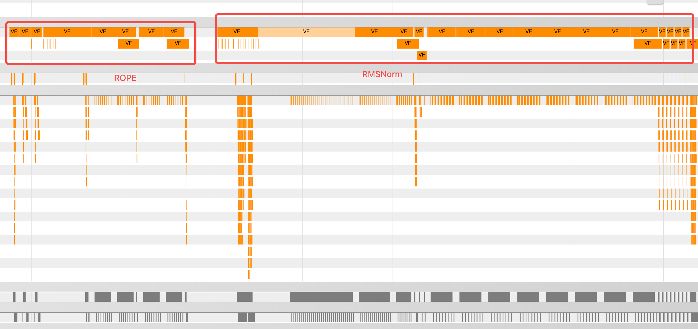
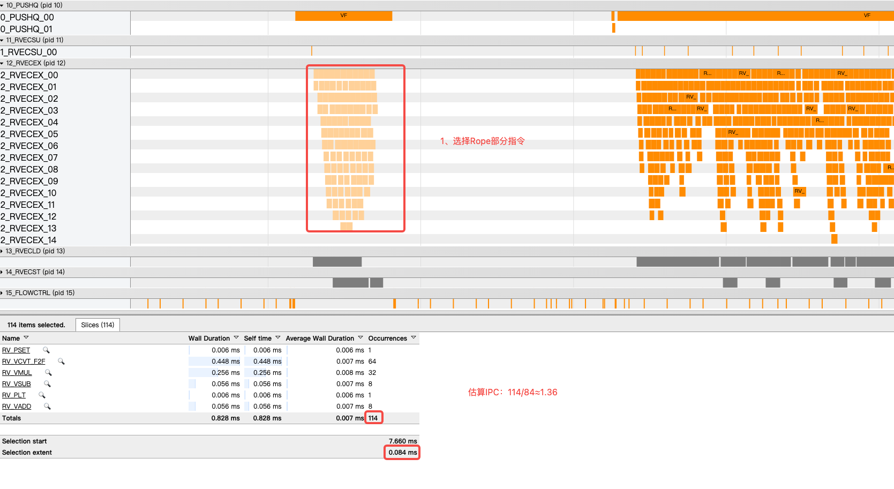
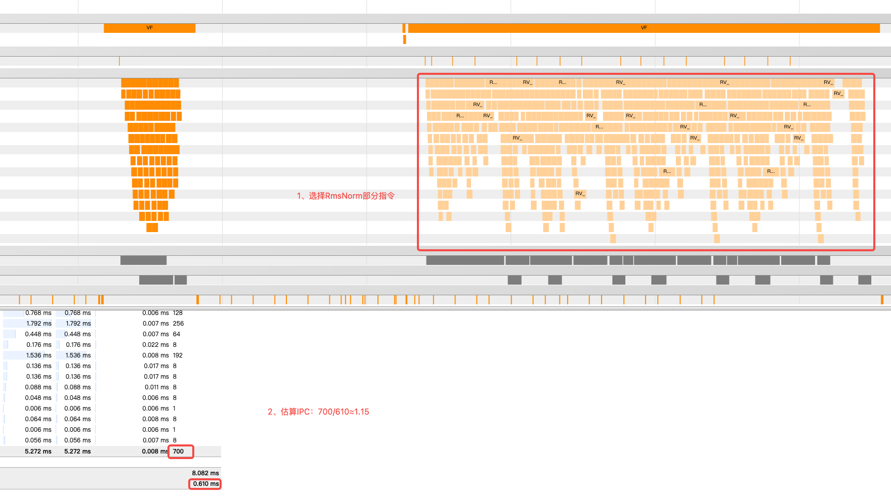

# KvRmsNormRopeCache: 从 MemBase 切换到 RegBase

本目录包含 `KvRmsNormRopeCache` 从 MemBase 编程切换到 RegBase 编程的完整样例，文件职责如下：

- MemBase 版本：`membase/full_load.asc`
- RegBase 版本：`regbase/full_load.asc`
- 公共 host、tiling、数据生成与精度校验：`include/sample_common.h`、`scripts/gen_data.py`
- 构建入口：`CMakeLists.txt`

## 快速编译与运行

以下命令在 `cann-samples` 仓库根目录执行：

```bash
cmake -S . -B build -DNPU_ARCH=dav-3510
cmake --build build --target kv_rms_norm_rope_cache_story
```

构建完成后会生成两个可执行文件：

```text
build/Samples/2_Performance/kv_rms_norm_rope_cache_story/kv_rms_norm_rope_cache_membase_full_load
build/Samples/2_Performance/kv_rms_norm_rope_cache_story/kv_rms_norm_rope_cache_regbase_full_load
```

分别运行：

```bash
./build/Samples/2_Performance/kv_rms_norm_rope_cache_story/kv_rms_norm_rope_cache_membase_full_load
./build/Samples/2_Performance/kv_rms_norm_rope_cache_story/kv_rms_norm_rope_cache_regbase_full_load
```

每个可执行文件会自动生成输入数据并执行 golden 精度校验，预期最后输出包含：

```text
PASS
```


## 1. 硬件信息与编程模型

本样例面向 Ascend 950PR/950DT，CMake 使用 `NPU_ARCH=dav-3510`。样例固定走 AIV Vector kernel，数据类型为 BF16，典型 shape 有：

- `Dv = 512`
- `Dk = 128`
- `kv`: `[B, N, S, (dv + dk)]`
- `gamma`: `[dv]`
- `cos/sin`: `[B, N, S, dk]`
- `k_cache`: `[B, N, S, dk]`
- `v_cache`: `[B, N, S, dv]`

从性能角度看，算子主要运行在三层存储/计算模型上：

1. GM 层：输入输出和 cache 位于全局内存。
2. UB 层：通过 `DataCopy` / `DataCopyPad` 把 tile 搬入本地 buffer。
3. Register/VF 层：RegBase 在 `__simd_vf__` 内使用 `RegTensor` 执行寄存器级计算。

MemBase 和 RegBase 的核心区别不在 GM/UB 搬运，而在 UB 内计算方式：

| 层级 | MemBase 写法 | RegBase 写法 |
| --- | --- | --- |
| GM/UB 搬运 | `DataCopyPad(GlobalTensor <-> LocalTensor)` | 保持相同 |
| UB staging | `LocalTensor`、`TQue`、`TPipe` | 保持相同 |
| 计算对象 | `LocalTensor<T>` | `RegTensor<T>` |
| 计算入口 | 普通 `__aicore__` 成员函数 | `__simd_vf__` |
| UB 到寄存器 | 隐含在标准 Vector API 中 | 显式 `Reg::LoadAlign` |
| 寄存器到 UB | 隐含在标准 Vector API 中 | 显式 `Reg::StoreAlign` |
| tail 控制 | count、repeat、mask 参数 | `MaskReg` |

因此，平滑迁移的原则是：保留 MemBase 已经验证过的数据流，只替换Vector计算部分。


## 2. 算子计算过程

该算子把 `kv` 最后一维拆成两段：

```text
kv[..., :Dv]  -> RMSNorm -> v_out -> v_cache
kv[..., Dv:]  -> RoPE    -> k_out -> k_cache
```

RMSNorm 计算：

```text
mean_square = mean(x * x)
rms = sqrt(mean_square + epsilon)
v_out = (x / rms) * gamma
```

RoPE 计算：

```text
real = rope_x[..., 0::2]
imag = rope_x[..., 1::2]
k_out_first  = real * cos_first - imag * sin_first
k_out_second = imag * cos_second + real * sin_second
```

当前规格下，`Dv=512`、`Dk=128`。RMSNorm 每行需要处理 512 个元素，并包含平方、归约、开方、除法、乘 `gamma`、BF16/FP32 转换等操作，是主要优化热点。RoPE 每行处理 128 个元素，计算链较短，但也适合用 VF 避免中间 UB 临时张量。


## 3. MemBase 版本计算流程和效果

MemBase 版本位于 `membase/full_load.asc`，整体采用 `Init -> Process -> ProcessTile` 的结构。`Init` 完成 GM 地址绑定、block 行数计算、`TQue`/`TBuf` 初始化；`Process` 先预加载并转换共享 `gamma`，随后按 `ubFactor` 循环处理 tile；`ProcessTile` 串联当前 tile 的搬入、RoPE、RMSNorm 和写回。

完整数据流如下：

```text
Process
  Load gamma(BF16) -> Cast gamma(FP32)
  for each tile:
    CopyRopeAndX
      kv[..., :Dv] -> xLocal
      kv[..., Dv:] -> ropeLocal
    Load cos/sin
    Rope
      ropeLocal + cos/sin -> k outLocal
    CopyOutK
      k outLocal -> k_out
      k outLocal -> k_cache[index]
    RmsNorm
      xLocal + gammaFp32 -> v outLocal
    CopyOutV
      v outLocal -> v_out
      v outLocal -> v_cache[index]
```

在 GM/UB 搬运层，MemBase 版本使用 `DataCopyPad` 按行搬入 `kv` 的两段数据。`CopyRopeAndX` 将后 `Dk` 维搬到 `ropeLocal`，将前 `Dv` 维搬到 `xLocal`，从而让 RoPE 和 RMSNorm 在 UB 中独立消费各自的数据段。`cos`、`sin` 也按 tile 搬入 `cosSinQueue_`，与当前 `ropeLocal` 对齐。

RoPE 计算仍以 `LocalTensor` 为核心：先将 `cos/sin` 转成 FP32，再通过 `GatherMask` 从交错 rope 数据中抽取 real/imag，随后执行两组乘加，最后 cast 回 BF16。这个流程直观、易验证，但会在 `realFp32`、`imagFp32`、`y0`、`y1` 等 UB 临时张量之间产生多次读写。

RMSNorm 是 MemBase 版本的主要热点。它先将 `xLocal` 从 BF16 cast 到 FP32，再执行平方、分段累加、`WholeReduceSum`、乘 `1/Dv`、加 `epsilon`、开方、broadcast、逐行除法、乘 `gammaFp32`，最后 cast 回 BF16。该链路依赖多个 UB 临时区：

```text
xFp32 -> square -> rowSum -> broadcast rms -> normalized xFp32 -> outLocal
```

MemBase 版本运行的打点图如下：


图中展示的是一次循环的Vector计算内容，左边是ROPE，右边是RmsNorm，所有的Vector指令都是一个单独的VF，整体看Vector指令较为细碎。


## 4. 从 MemBase 到 RegBase 的平滑迁移边界

从 MemBase 迁移到 RegBase 的整体原则有：

1. 在一个完整的介绍功能内应融尽融，理论来看，VF内融合的指令越多，UB和寄存器交互的次数越少，性能越好。
2. VF内尽量少使用Reduce类，非对齐访存，Interleave，Deinterleave类单发指令。
3. VF内尽量少使用Membar，Membar会导致VF内流水中断，使整体IPC不高。

迁移不是推倒重写。当前 RegBase 版本复用了 MemBase 中已经验证过的外层结构：

- `Init` 中的 GM tensor 绑定方式保持一致。
- `BuildTiling`、`blockFactor`、`ubFactor`、`blockNum` 保持一致。
- `CopyRopeAndX` 中的 GM -> UB 搬运保持 `DataCopyPad`。
- `CopyOutK` / `CopyOutV` 中的 cache 写回和 output 写回保持一致。
- `inQueue`、`cosSinQueue`、`outQueue` 的 double buffer 数据流保持一致。
- 输出仍走同一套 golden 校验，比较 `k_cache`、`v_cache`、`k_out`、`v_out`。

真正变化的是 `RmsNorm` 和 `Rope` 的 compute body：

```text
MemBase:
  LocalTensor -> Cast/Mul/Add/WholeReduceSum/Div/Mul/Cast -> LocalTensor

RegBase:
  __ubuf__ pointer -> Reg::LoadAlign -> RegTensor
  RegTensor compute chain
  Reg::StoreAlign -> __ubuf__ pointer
```

这种边界划分的好处是：

1. 外层索引、cache offset、batch 切分和 GM 地址计算不变，降低迁移风险。
2. 原有精度 golden 可以直接复用，MemBase 可以作为 RegBase 的对照基线。
3. 出现错误时可以快速判断问题在 GM/UB 数据流还是 VF compute body。
4. RegBase 的收益集中在热计算链，避免为追求寄存器化引入额外 pipeline 复杂度。


## 5. VF 方案设计

### 5.1 RMSNormVF

RegBase 版本在 `RmsNormVF` 中将每一行的 RMSNorm 拆成两个 VF 循环。

第一段循环计算平方和：

```text
for each row:
  reduceSum = 0
  for i in Dv chunks:
    xB16    = LoadAlign(DIST_UNPACK_B16)
    xFp32   = Cast(BF16 -> FP32)
    square  = xFp32 * xFp32
    chunk   = ReduceSum(square)
    reduceSum += chunk
```

第二段循环归一化并乘 `gamma`：

```text
rms = sqrt(reduceSum / Dv + epsilon)

for i in Dv chunks:
  xB16      = LoadAlign(DIST_UNPACK_B16)
  gammaB16  = LoadAlign(DIST_UNPACK_B16)
  xFp32     = Cast(BF16 -> FP32)
  gammaFp32 = Cast(BF16 -> FP32)
  norm      = (xFp32 / rms) * gammaFp32
  outB16    = Cast(FP32 -> BF16)
  StoreAlign(DIST_PACK_B32)
```

设计要点：

- BF16 输入先升到 FP32 做平方、归约、除法和乘法，保证 RMSNorm 中间计算精度。
- `reduceSum`、`rmsValue`、`rmsBrc`、`norm` 等短生命周期中间量保留在 `RegTensor` 中。
- `gamma` 不再预先 cast 成一整段 FP32 UB 临时张量，而是在 VF 中按 chunk load BF16 并 cast 到 FP32。
- 通过 `UpdateMask<float>(remaining)` 控制最后一个 chunk 的有效 lane，避免把 tail padding 当有效数据。

### 5.2 RopeVF

RegBase 版本也把 RoPE 写成 VF。核心思路是直接从 BF16 rope 数据中拆出 real/imag，并用两段 cos/sin 完成复数旋转。

```text
real, imag = LoadAlign(DIST_DINTLV_B16, rope)
realFp32   = Cast + Interleave
imagFp32   = Cast + Interleave

out_first  = realFp32 * cos_first  - imagFp32 * sin_first
out_second = imagFp32 * cos_second + realFp32 * sin_second

StoreAlign(out_first)
StoreAlign(out_second)
```

设计要点：

- real/imag、cos/sin、mul/result 都在寄存器内串联。
- RoPE 的 `pairCount = Dk / 2 = 64`，mask 固定控制 64 个 FP32 lane。
- 输出分成前后两段写回，与 golden 中 `concat(real, imag)` 的布局保持一致。


## 6. 理论分析

### 6.1 UB 使用量减少

MemBase RMSNorm 需要多个 UB 临时张量：

```text
xFp32 -> square -> rowSum -> broadcast rms -> xFp32 norm -> outLocal
```

并且标准 Vector API 之间通常会形成 UB load/store 边界。RegBase 把平方、归约、除法、乘 gamma 等中间状态尽量保存在寄存器中，只在 VF 入口 load 输入，在 VF 末尾 store 输出。

理论收益来自：

- 减少中间结果落 UB。
- 减少多段 Vector API 之间的 UB 往返。
- 降低 UB 临时 buffer 占用。


### 6.2 精度路径保持一致

样例输入和输出是 BF16，但 RMSNorm 的关键中间计算必须使用 FP32：

```text
BF16 load -> FP32 compute -> BF16 store
```

RegBase 版本通过 `CAST_B16_TO_B32` 和 `CAST_B32_TO_B16` 明确表达转换路径。实测中，MemBase 和 RegBase 均通过同一套 golden 校验：

```text
MemBase: k_cache/v_cache/k_out/v_out 全部 PASS
RegBase: k_cache/v_cache/k_out/v_out 全部 PASS
```

其中 RegBase `v_cache` / `v_out` 的最大 diff 为 `0.0078125`，低于 BF16 比对阈值 `6e-2`。


## 7. 实际调优路径

### 7.1 保持 full-load 外层数据流

当前样例一次 tile 处理 `ubFactor=8` 行。运行时实测打印：

```text
blockNum 54, blockFactor 19, ubFactor 8
```

这说明外层按照 AIV core 数自动切分总行数 `8 * 1 * 128 = 1024`，每个 block 处理约 19 行，UB 内一次搬入最多 8 行。这个切分对 MemBase 和 RegBase 共同适用，因此调优时先不改外层，只验证 compute body 的收益和正确性。

### 7.2 减少 UB 使用

MemBase 版本需要 `wsBuffer_` 存放 RMSNorm 和 RoPE 的 FP32 中间结果。RegBase 版本删除了这个大块 VECCALC，改为在 VF 中使用 `RegTensor` 临时变量。

对比：

```text
MemBase:
  gammaQueue: BF16 gamma + FP32 gamma
  wsBuffer_: rows * (Dv * 3 + Dk * 8) * sizeof(float)

RegBase:
  gammaQueue: BF16 gamma
  no wsBuffer_
```

这是最直接的 UB 占用优化。

### 7.3 gamma 处理从整段预转换改为 VF 内按需转换

MemBase 版本在主循环前把整段 `gamma` 从 BF16 cast 成 FP32，并保存在 UB 中供后续每行复用。RegBase 版本保留 BF16 `gammaLocal`，在 `RmsNormVF` 的第二段循环中按 chunk load 并 cast。

这样做的取舍：

- 优点：减少一份完整 FP32 gamma UB buffer。
- 优点：gamma 与 x 的 load/cast 粒度一致，寄存器链更紧凑。
- 代价：每行都会重新 cast gamma chunk。

当前样例的主要目标是演示 RegBase VF 迁移和减少 UB 中间张量；如果后续 profiler 证明 gamma cast 成本突出，可以考虑引入小块 gamma 预处理或更细粒度复用策略，但不能破坏 UB 容量和 double buffer 数据流。

### 7.4 切换验证顺序

建议按以下顺序调优，避免一次修改多个变量后无法归因：

1. 固定输入数据和 shape，只替换 compute body，确认精度 PASS。
2. 对比 MemBase 和 RegBase 的输出 diff，先确认 BF16 阈值内一致。
3. 使用 profiler 观察 UB load/store、Vector 指令、pipeline stall。
4. 若 UB 压力仍高，继续检查 VF 内是否还有可消除的 store/load。
5. 若算术指令成为瓶颈，再检查 reduce 组织、gamma cast 复用和 div/sqrt 链路。
6. 若搬运成为瓶颈，再调整 `ubFactor`、double buffer 深度或 GM copy 形态。

当前已完成的功能验证：

```text
kv_rms_norm_rope_cache_membase_full_load: PASS
kv_rms_norm_rope_cache_regbase_full_load: PASS
```

## 8. RegBase版本运行效果


RegBase 版本位于 `regbase/full_load.asc`，图中的左侧部分是rope，已经融合成1个VF，右侧部分是RmsNorm，融合成1个VF；

选择Rope中的RVEC_EX部分的指令，可以看到下侧的简易统计，估算出ipc1.36左右



选择RmsNorm中的RVEC_EX部分的指令，可以看到下侧的简易统计，估算出ipc1.15左右，RmsNorm的IPC比Rope低，是因为其中有单发指令，而且代码中第一个循环体前后有依赖，所以整体IPC比Rope低。



## 9. 迁移实践清单

从 MemBase 切到 RegBase 时，可以按以下清单执行：

1. 先保留 MemBase 的 host、tiling、queue、CopyIn、CopyOut。
2. 找出最热的 `LocalTensor` 计算链，本样例是 RMSNorm，其次是 RoPE。
3. 把计算链拆成独立 `__simd_vf__` 函数。
4. 在普通 `__aicore__` 函数中只做 `LocalTensor.GetPhyAddr()` 到 `__ubuf__` 指针的转换。
5. VF 内只使用 `RegTensor`、`MaskReg`、`Reg::Load*`、`Reg::Store*` 和 `Reg::*` compute API。
6. BF16 路径显式写清 `BF16 -> FP32 -> BF16` 的 cast trait 和 round mode。
7. tail 只用 `MaskReg` 控制，不依赖 UB padding 参与数学。
8. 每次优化后都运行同一套 golden 校验，确认 `k_cache`、`v_cache`、`k_out`、`v_out` 全部 PASS。

一句话总结：RegBase 的平滑迁移路线是“外层不动、热链下沉、寄存器串联、同源校验”。本样例正是沿着这条路线，把 MemBase 中以 `LocalTensor` 为中心的计算链切换为 VF 中以 `RegTensor` 为中心的寄存器计算链。
