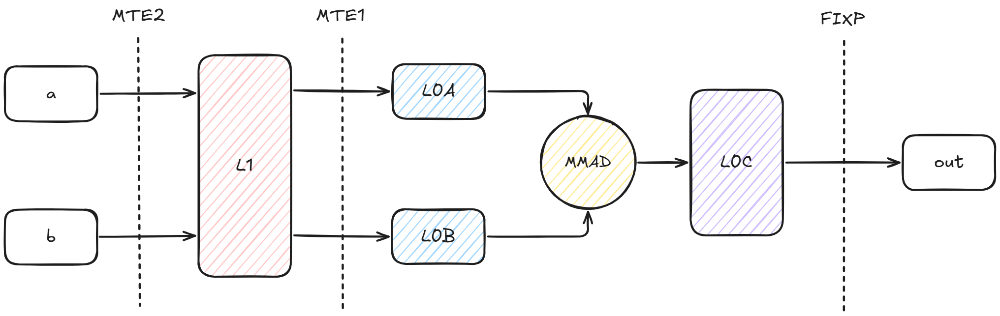
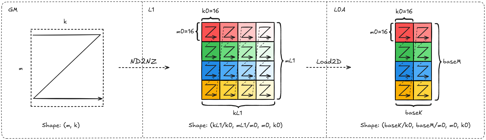
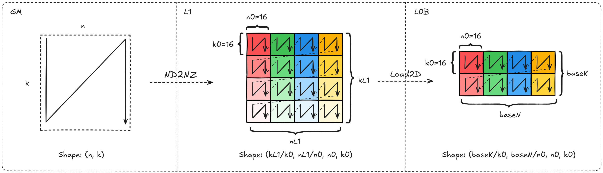
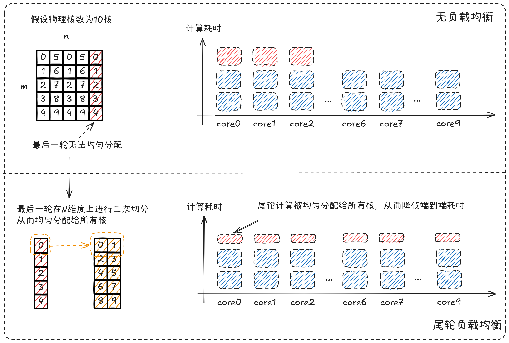
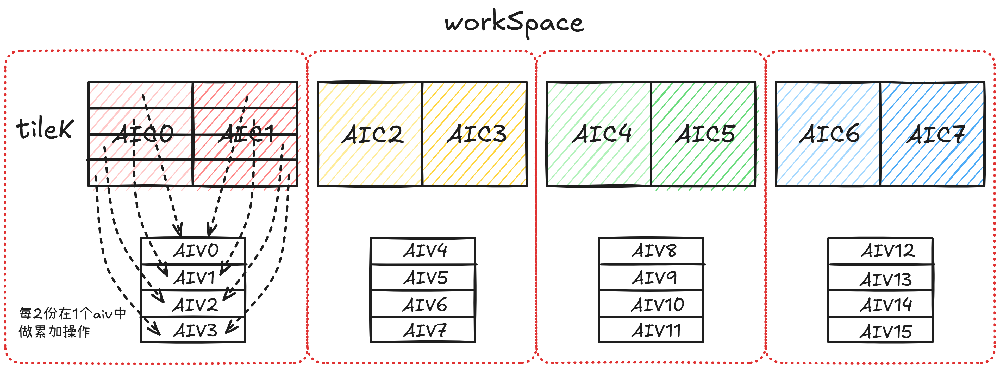
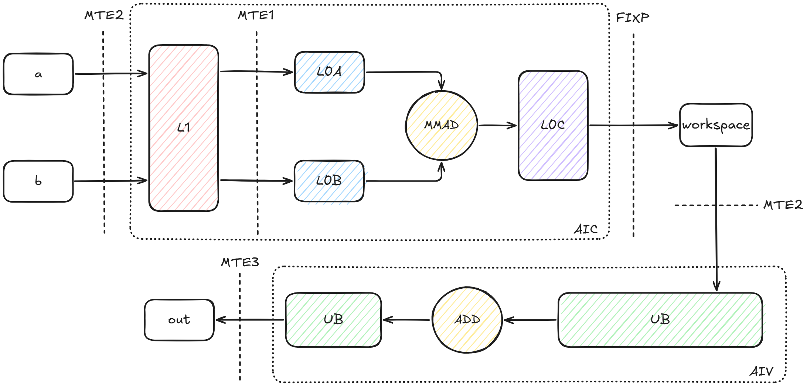

# 非量化矩阵乘算子性能优化指南

## 概述

本文档系统阐述非量化矩阵乘算子的实现原理、性能建模方法及优化实践，以A16W16为例进行说明，覆盖Float16、BFloat16数据类型场景。通过系统性的优化策略，帮助开发者快速掌握算子性能调优的核心技术，提升算子在昇腾平台上的执行效率。

**矩阵乘法**是神经网络和大模型的"底层计算引擎"，从特征传递到注意力机制实现，再到大规模参数运算，所有核心流程都依赖其完成。没有矩阵乘法就无法支撑模型的高效运行与规模突破。

**表 1** 主流网络中矩阵乘法的开销占比

| **网络类型** | **核心矩阵乘法占比** | **主要瓶颈来源** |
|---|---|---|
| 全连接网络（FCN） | 95%+ | 几乎全部为线性层，无卷积/注意力等操作。 |
| Transformer/LLM | 80%~95% | 注意力机制和FFN中的矩阵乘法。 |
| CNN（ResNet等） | 60%~85% | 卷积操作（本质为局部矩阵乘）。 |
| 轻量网络（EfficientNet-Lite） | 40%~60% | 拆分结构多，低维操作，非线性操作占比高。 |

矩阵乘法的性能（运算速度、内存效率、精度）直接决定了网络的"运行效率"和"落地能力"。

## 算子实现原理

### 算子功能说明

- **算子功能**：

| 对比项 | Float16 | BFloat16 |
|---|---|---|
| A/B数据类型 | `Float16` | `BFloat16` |
| 输出数据类型 | `Float16` | `BFloat16` |
| 数据格式 | 1位符号位 + 5位指数位 + 10位尾数位 | 1位符号位 + 8位指数位 + 7位尾数位 |
| 数值范围 | 较小（~±65504），易上溢/下溢 | 与FP32相同（~±3.4e38），不易溢出 |
| 数值精度 | 较高（10位尾数） | 较低（7位尾数） |
| 训练稳定性 | 需要loss scaling防止梯度下溢 | 通常无需loss scaling，训练更稳定 |
| FP32转换成本 | 需要指数偏移调整，转换开销较大 | 直接截断尾数，转换开销小 |
| 内存占用 | 2字节 | 2字节 |
| 典型应用场景 | 模型训练与推理，适用于全连接层、注意力机制、计算机视觉等 | 大语言模型训练与推理、对数值范围敏感的场景 |

- **计算公式**：

$$
c_{i, j} = \sum_{k=0}^{K-1} a_{i, k} \cdot b_{k, j}
$$

#### A16W16参数说明

| **变量名** | **描述** | **Dtype** | **Layout** | **Shape** |
|---|---|---|---|---|
| a | 输入左矩阵 | `Float16` 或 `BFloat16` | ND | `(m, k)` 或 `(k, m)` |
| b | 输入右矩阵 | `Float16` 或 `BFloat16` | ND | `(k, n)` 或 `(n, k)` |
| c | 输出矩阵 | `Float16` 或 `BFloat16` | ND | `(m, n)` |

<a id="matmul-operator-implementation"></a>

### 算子实现说明

matmul矩阵乘执行时完整数据搬运流程如下图所示：

<div align="center">
  
</div>

关于每个输入在各个缓冲区上的Shape关系和排布要求，可以参考下面的详细介绍。

**关键参数说明**：
- `m, k, n`：矩阵输入大小
- `mL1, kL1, nL1`：L1缓冲区的切分大小
- `baseM, baseK, baseN`：L0缓冲区的切分大小
- `m0, k0, n0`：当前缓冲区最小分型大小

#### Tensor a 的搬运说明

> 输入Layout说明：标准输入(m, k)对应ND排布。转置输入(k, m)对应DN排布

| **缓冲区变化** | **Shape排布变化** | **Layout变化** | **所属流水** | **所用指令** |
|---|---|---|---|---|
| GM -> L1 | (m, k) -> (ceil(kL1/k0), ceil(mL1/m0), m0, k0) | ND -> Nz | MTE2 | DataCopy with ND2NZ |
| L1 -> L0A | (ceil(kL1/k0), ceil(mL1/m0), m0, k0) -> (ceil(baseK/k0), ceil(baseM/m0), m0, k0) | Nz -> Nz | MTE1 | LoadData with Load2D |

<div align="center">
  
</div>

#### Tensor b 的搬运说明
 
> 输入Layout说明：标准输入(k, n)对应ND排布。转置输入(n, k)对应DN排布

| **缓冲区变化** | **Shape排布变化** | **Layout变化** | **所属流水** | **所用指令** |
|---|---|---|---|---|
| GM -> L1 | (n, k) -> (ceil(kL1/k0), ceil(nL1/n0), n0, k0) | DN -> Zn | MTE2 | DataCopy with ND2NZ |
| L1 -> L0B | (ceil(kL1/k0), ceil(nL1/n0), n0, k0) -> (ceil(baseK/k0), ceil(baseN/n0), n0, k0) | Zn -> Zn | MTE1 | LoadData with Load2D |

<div align="center">
  
</div>

## 算子性能建模

<a id="matmul-performance-modeling-formulas"></a>

### 性能建模公式

#### 基本原理

理论计算时间 = max(MMAD时间, MTE2搬运时间, MTE1搬运时间, FIXPIPE搬出时间)

通过评估不同流水的理论耗时并加以对比，可以得到影响耗时的决定性因素，从而选择对应的优化策略。

#### 流水理论耗时评估

> 说明：以下公式统一采用`16 × 16 × 16`表示Cube核每拍计算量。

**1. MMAD计算时间**

$$
T_{cube} = \frac{M \times K \times N}{16 \times 16 \times 16 \times 核数 \times 频率}
$$

其中`16 * 16 * 16`表示Cube核每拍的计算量（FP16/BF16场景）。

**2. MTE2搬运时间**

MTE2的搬运量包含了因切分带来的重复搬运：

$$
T_{mte2} = \frac{(M \times \frac{N}{baseN} + N \times \frac{M}{baseM}) \times K \times sizeof(dtype)}{BandWidth_{mte2}}
$$

MTE2的综合带宽包含DDR带宽和L2带宽的共同作用，可简化为：

$$
T_{mte2} \approx \frac{Size_{DDR}}{BandWidth_{DDR}} + \frac{Size_{L2}}{BandWidth_{L2}}
$$

其中：
- $Size_{DDR} = (M + N) \times K \times sizeof(dtype)$ （首次搬运量）
- $Size_{L2} = (M \times \frac{N}{baseN} + N \times \frac{M}{baseM}) \times K \times sizeof(dtype) - Size_{DDR}$ （重复搬运量）

**3. MTE1搬运时间**

MTE1作为Cube核内的流水，以单核内的计算和搬运量进行评估：

$$
T_{mte1} = \frac{baseM \times baseK \times sizeof(dtype)}{BandWidth_{L0A}} + \frac{baseN \times baseK \times sizeof(dtype)}{BandWidth_{L0B}}
$$

**4. FIXPIPE搬出时间**

$$
T_{fixp} = \frac{M \times N \times sizeof(dtype)}{BandWidth_{fixp}}
$$

#### 流水理论耗时对比

算子期望最终变成CubeBound，因此可以将不同的搬运流水和计算流水展开对比，分析影响CubeBound的决定性因素。在理论无法达成CubeBound的背景下，选择优化策略优化各条搬运流水。

**1. MTE2 VS MMAD**

$$
\frac{M \times K \times N}{16 \times 16 \times 16 \times 核数 \times 频率} \geq \frac{(M \times \frac{N}{baseN} + N \times \frac{M}{baseM}) \times K \times sizeof(dtype)}{BandWidth_{mte2}}
$$

化简后得到MTE2 Bound条件：

$$
BandWidth_{mte2} \geq (\frac{1}{baseN} + \frac{1}{baseM}) \times sizeof(dtype) \times 16 \times 16 \times 16 \times 核数 \times 频率
$$

**特征分析**：
- 当MTE2带宽满足上述条件时，算子性能受限于计算单元（Cube Bound）
- 不满足条件时，算子性能受限于MTE2数据搬运（MTE2 Bound）
- 右侧表达式主要受tiling参数（baseM, baseN）和硬件配置（核数、频率）影响
- 增大baseM和baseN可以降低右侧数值，更容易满足Cube Bound条件

**2. MTE1 VS MMAD**

由于MTE1和MMAD均为Cube核内部流水，因此可以将公式化简到单核内对比：

$$
\frac{baseM \times baseN \times baseK}{16 \times 16 \times 16 \times 频率} \geq \frac{baseM \times baseK \times sizeof(dtype)}{BandWidth_{L{0}A}} + \frac{baseN \times baseK \times sizeof(dtype)}{BandWidth_{L{0}B}}
$$

化简后得到MTE1 Bound条件：

$$
\frac{baseM \times baseN}{16 \times 16 \times 16 \times 频率} \geq \frac{baseM \times sizeof(dtype)}{BandWidth_{L0A}} + \frac{baseN \times sizeof(dtype)}{BandWidth_{L0B}}
$$

当L0A和L0B的带宽一致时，可进一步化简：

$$
BandWidth_{mte1} \geq (\frac{1}{baseN} + \frac{1}{baseM}) \times sizeof(dtype) \times 16 \times 16 \times 16 \times 频率
$$

**特征分析**：
- 当满足上述条件时，L1到L0的数据搬运不成为性能瓶颈
- 不满足条件时，算子性能受限于MTE1数据搬运（MTE1 Bound）
- 右侧表达式主要受tiling参数（baseM, baseN）和L0缓冲区带宽影响
- 增大baseM和baseN可以降低右侧数值，更容易满足Cube Bound条件

**3. FIXPIPE VS MMAD**
$$
\frac{M \times K \times N}{16 \times 16 \times 16 \times 核数 \times 频率} \geq \frac{M \times N \times sizeof(dtype)}{BandWidth_{fixp}}
$$

化简后得到FIXPIPE Bound条件：

$$
BandWidth_{fixp} \geq \frac{16 \times 16 \times 16 \times 核数 \times 频率 \times sizeof(dtype)}{K}
$$

**特征分析**：
- 当满足上述条件时，L0C到GM的数据搬出不成为性能瓶颈
- 不满足条件时，算子性能受限于FIXPIPE数据搬出（FIXPIPE Bound）
- 右侧表达式与K维度成反比；对于大K场景，通常不会出现FIXPIPE Bound；对于小K场景，FIXPIPE Bound更容易成为瓶颈

**建模说明**：
- 该模型基于流水线理论，整体性能受限于最慢的流水阶段
- 通过分析比较各阶段的时间，从而准确识别性能瓶颈类型
- 优化目标是令算子在预期的流水上进行Bound，并将对应流水优化到极致
- 实际应用中还需考虑指令发射延迟、流水线并行度等额外开销

### 优化目标

基于理论公式对比，识别当前的Bound类型，应用相应的优化策略，使各流水阶段的时间尽可能接近，从而最大化整体算子性能。

## 算子优化实践

本章介绍非量化matmul中应用的优化措施，针对不同的Bound类型场景分别提供**搬运效率优化**、**计算效率优化**方法，以及针对因流水阻塞导致Bound类型不明确的场景提供**指令并行度优化**实践。

### 指令并行度优化

#### Double Buffer（双缓冲）

- **原理介绍**

  Double Buffer使用两个缓冲区交替工作：一个缓冲区用于当前计算，另一个并行准备下一轮数据。通过计算与数据加载/准备的重叠，隐藏内存访问延迟，减少流水线停顿，提高算子吞吐量。

  在本算子实践中，Double Buffer通常首先用于L1侧（配合后文的Bank冲突规避），在缓冲区资源允许时也可扩展为`4-Buffer`以进一步提升并行度。

- **Double Buffer（2-Buffer） vs 4-Buffer**
  - **2-Buffer**：两份buffer交替，覆盖“当前计算/下一轮准备”的基本重叠关系，资源开销更小，适用于多数场景。
  - **4-Buffer**：在buffer空间足够时，将准备阶段进一步细分（例如同时覆盖更多轮次或更多输入/scale的准备），以减少因搬运抖动、带宽瞬时不足造成的断流风险。
  - **使能4-Buffer条件**：当Profiling显示存在明显的流水停顿（计算等待搬运），且L1/L0空间评估后仍能保持目标`base`块大小、不引入新的MTE1/FIXPIPE瓶颈时，可考虑使能4-Buffer。

- **效果对比**

  下图展示了使能Double Buffer后流水图的预期变化，从而有效提升不同流水间的并行度。

  <div align="center">
    
  </div>

- **适用场景**
  - 存在流水停顿的场景
  - 内存访问延迟成为瓶颈的场景
  - L1或L0缓冲区空间充足的场景

#### UnitFlag（单元标志）

- **原理介绍**

  UnitFlag为`MMAD`计算指令和`FIXPIPE`数据搬运指令提供基于内存访问的细粒度同步（512B粒度）。未开启时，FIXPIPE需等MMAD指令完全执行完才开始搬出；开启后，MMAD每计算完512B数据，FIXPIPE立即搬出该数据块，**提高计算与搬出流水的并行度**。

- **效果对比**

  <div align="center">
    
  </div>

- **适用场景**
  - MMAD和FIXPIPE流水部分或全部串行执行的场景
  - 需要提高计算与搬出并行度的场景


### 搬运效率优化

#### SWAT（自适应滑动窗口模板）

- **原理介绍**

  SWAT(Slide Window Adaptive Template)通过提升多核单次访问的L2命中率来提高`MTE2`搬运效率，从而实现首轮搬运即可做到`MMAD`指令不断流，使算子在Cube Bound场景下计算单元利用率达到95%+。

  核心逻辑是使每一轮多核计算的输出排布尽量**方正**，具体方法是在M轴上设定固定窗口，根据M轴方向尾块大小灵活调整，再沿N方向进行"Z"型滑动，从而最大程度提高L2命中率。

- **效果对比**

  下图对比了传统的列优先分配和SWAT的理论效果。

  <div align="center">
    
  </div>

- **适用场景**
  - 大规模矩阵乘法场景
  - 多核并行计算场景
  - Cube Bound为主要瓶颈的场景

### 计算效率优化

#### 尾轮负载均衡

- 当前Matmul算子普遍使用基本块策略进行多核分配。但在处理不同规格输入时，划分的基本块无法均匀分配到所有核上，导致分核不均，尤其是最后一轮计算存在算力浪费，使整体算力利用率无法达到最优。

  为兼顾**双边负载均衡**与尾块浪费问题，会在分核阶段综合考虑M/N两个方向的分配结果：不仅对最后一轮未完全分配的基本块做二次切分，也可能根据整体负载分布对**非尾轮**的`baseM/baseN`（base块大小）做自适应调整，从而使各核工作量更均衡、整体算力利用率更高。

- **效果对比**

  <div align="center">
    
  </div>

- **适用场景**
  - 多核并行计算场景
  - 输入形状不规则，无法均匀分配的场景
  - 最后一轮计算存在算力浪费的场景

#### 切K模板

- **原理介绍**

  切K模板（StreamK）在普通模板多核并行切分M轴、N轴的基础上，进一步增加了K轴的切分。根据性能建模公式，由于L0C大小的限制，当`baseM=baseN=256`时数据重复搬运量最少；但在此配置下，可能出现无法充分利用全部核数的情况，如下图(1)所示。

  <div align="center">
    
  </div>

  以8个AIC核为例，普通模板仅能使用其中一半核数。StreamK模板通过对K轴进行切分（假设切分后每个核处理的K维度为`singleCoreK=K/2`），可以充分利用全部8个AIC核，如上图(2)所示。

- **确定性切K计算**

  由于在K维度上进行了切分，矩阵乘法的结果需要进行多核累加。使用atomic操作（数据从L0C搬出到GM同一片地址累加）实现的多核累加可能存在确定性问题（由于不同AIC结束顺序可能存在随机性，导致相同输入多次执行的累加结果不一致）。因此，为保证K轴切分时核间累加顺序的确定性，StreamK模板采用确定性累加策略：在单核内完成K轴累加后，将结果从L0C搬移到workSpace（每个核独立开辟workSpace空间，而非共享一份），启用AIV核搬运数据到UB上，在UB中完成逐次累加，如下图所示：

  <div align="center">
    
  </div>

  昇腾950系列芯片的AIC与AIV配比为1:2，设该配比`ratio=2`。为有效利用AIV的计算能力，将每个AIC的数据结果切分为`tileK`块送入AIV进行累加，计算公式为：

  $$
  tileK = \left\lceil \frac{K}{\text{singleCoreK}} \right\rceil \times \text{ratio}
  $$

  单核数据搬运流程如下图所示：

  <div align="center">
    
  </div>

- **数据并行优化**

  常规StreamK方案存在效率问题：最后一轮累加操作期间，AIC完全空闲等待AIV完成，导致整体计算时间受限于AIV结束时间。DPSK（Data-Parallel StreamK）通过将最后一轮StreamK操作提前执行，实现数据并行：AIV执行累加计算时，AIC可继续进行矩阵乘操作。优化前后流水对比如下图所示：

  <div align="center">
    
  </div>

- **主要适用场景**
  - SK(streamK)场景：当M轴和N轴使用(256, 256)的基本块无法分满核，K轴相对较大；
  - DPSK(data-parallel streamK)场景：正常轮次下能够分满核，但是尾轮存在空闲核，将该轮提前并采用streamK。

- **代码实践**

  ```cpp
  //切K代码示例
  tileNum = Div(m, baseM) * Div(n, baseN) * Div(k, baseK);
  if ASCEND_IS_AIC {
      for (int64_t tileIdx = curBlockIdx; tileIdx < tileNum; tileIdx += usedCoreNum) {
          for (uint64_t iter0 = 0; iter0 < curKL1Iter; ++iter0) {
              CopyInA1();
              CopyInB1();
              for (uint64_t iter1 = 0; iter1 < kL0Iter; ++iter1) {
                  CopyInA2();
                  CopyInB2();
                  Mmad();
              }
              CopyOut();
          }
      }
  }
  if ASCEND_IS_AIV {
      DataCopyPad<>();
      for (uint64_t i = 1; i < Div(k, baseK); ++i) { // 在ub上按序累加
          Add();
      }
      DataCopyPad<>();
  }
  ```

## 算子模板归纳

### SWAT模板

- **模板特点**：
  - 作为基础模板用于处理非特化模板的所有场景，具有广泛的适用性
  - 适用于大规模矩阵乘法场景，在Cube Bound场景下表现优异
  - 支持灵活的形状配置，可适应不同维度的矩阵输入
  - 综合性能最优，是大多数应用场景的首选模板

- **涉及优化手段**：
  - SWAT（自适应滑动窗口）：提升L2命中率，优化多核并行效率
  - 尾轮负载均衡：均衡多核负载，消除算力浪费
  - Double Buffer：隐藏内存访问延迟，提升流水线并行度

- **模板实现**：
  - [matmul_a16w16_swat.asc](../matmul_recipes/examples/matmul_a16w16/matmul_a16w16_swat.asc)

### StreamK模板

- **模板特点**：
  - 适用于大K维度场景（建议 K ≥ 8192）
  - 在M/N维度较小而K维度较大的场景下表现优异
  - 通过K轴切分实现多核并行负载均衡

- **涉及优化手段**：
  - K轴切分：实现多核负载均衡
  - UnitFlag：提升计算与搬出流水并行度

- **输入范围限制**：
  - **SK模式**：K维度需足够大，M和N的块数乘积不超过AIC核数的一半
  - **DPSK模式**：M和N需为256的倍数，K维度需足够大，满足特定的负载均衡条件

- **模板实现**：
  - [matmul_a16w16_streamk.asc](../matmul_recipes/examples/matmul_a16w16/matmul_a16w16_streamk.asc)

## 优化策略选择指南

### 根据Bound类型选择优化策略

| **Bound类型** | **推荐优化策略** | **优先级** |
|---|---|---|
| Cube Bound | SWAT + 尾轮负载均衡 | 高 |
| MTE2 Bound | StreamK | 高 |
| FIXPIPE Bound | UnitFlag | 中 |
| 流水停顿 | Double Buffer | 高 |

### 根据输入特征选择模板

| **输入特征** | **推荐模板** | **原因** |
|---|---|---|
| 大规模矩阵 | SWAT模板 | 提高L2命中率，提升计算单元利用率 |
| 大K维度（K ≥ 8192） | StreamK模板 | 通过K轴切分实现多核负载均衡 |
| 不规则形状 | SWAT模板 + 尾轮负载均衡 | 均衡多核负载，避免算力浪费 |

## 性能调优实践步骤

1. **性能分析**：使用Profiling工具结合性能建模分析当前算子的Bound类型
2. **瓶颈识别**：确定主要的性能瓶颈所在
3. **策略选择**：根据Bound类型选择合适的优化策略
4. **模板选择**：根据输入特征选择合适的算子模板
5. **参数调优**：调整tiling参数，优化缓冲区使用
6. **效果验证**：对比优化前后的性能数据
7. **迭代优化**：根据结果进一步调整优化策略

## 总结

非量化矩阵乘算子的性能优化是一个系统性的工程，需要根据具体的场景和瓶颈选择合适的优化策略。通过合理应用SWAT、StreamK、Double Buffer、UnitFlag等优化技术，可以显著提升算子在昇腾平台上的执行效率。