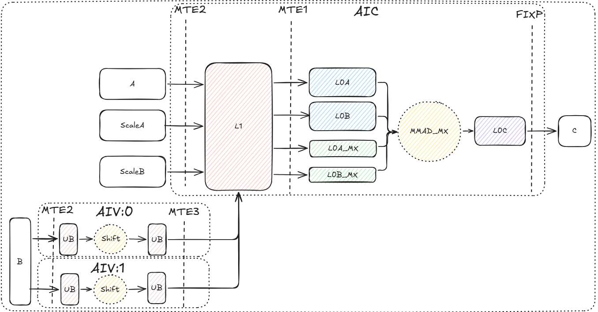
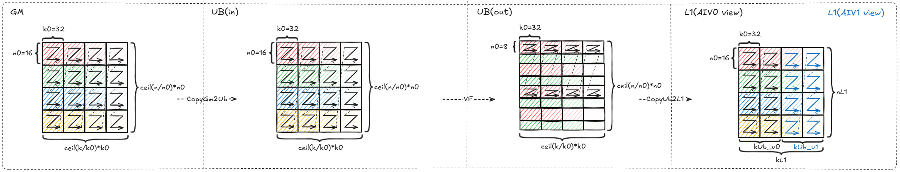
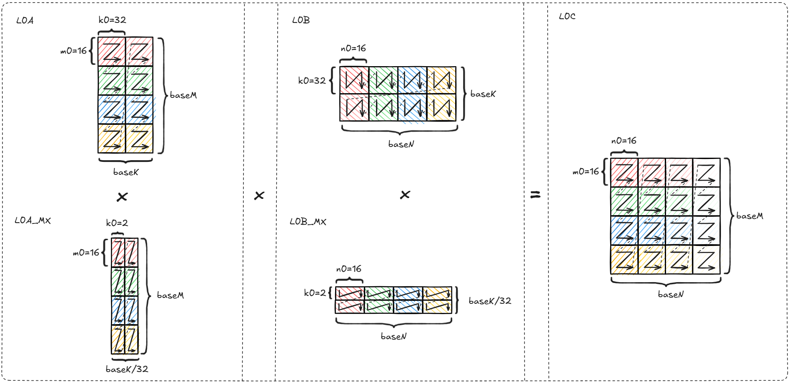
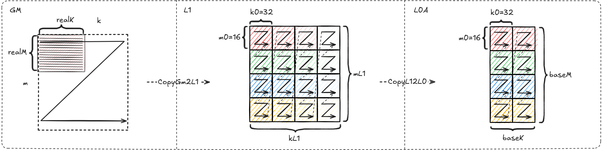
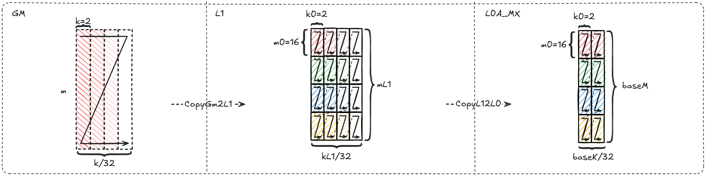
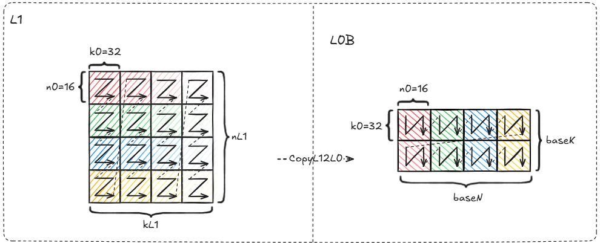
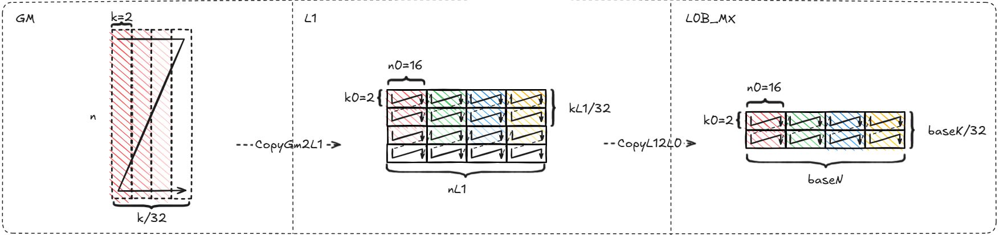
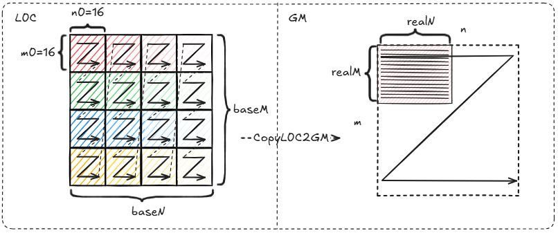
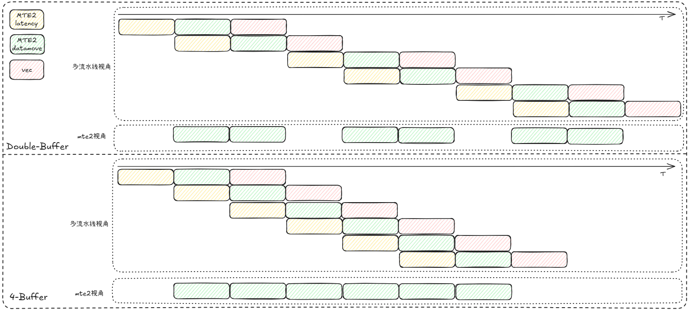
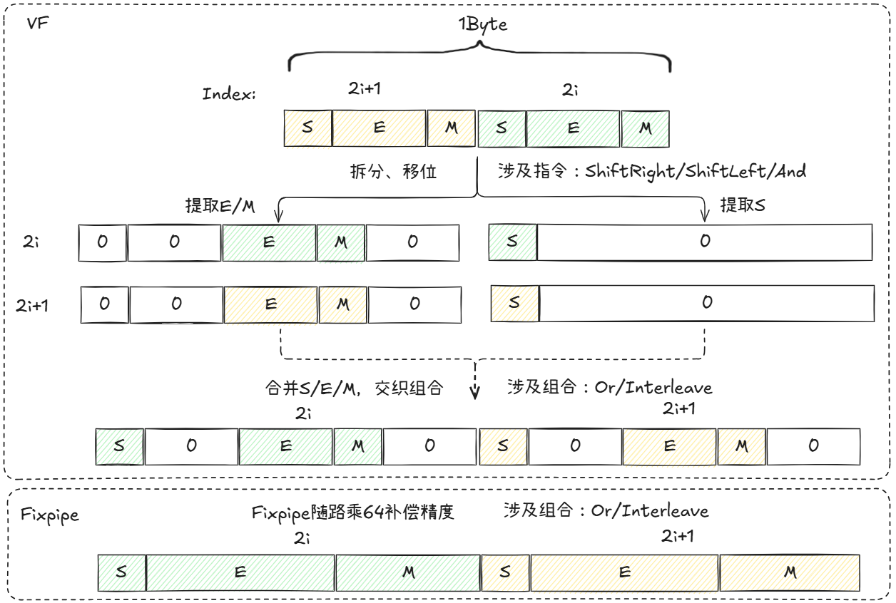

# MXFP8FP4混合精度量化矩阵乘算子性能优化指南

## 概述

本文档系统阐述MXFP8FP4混合精度量化矩阵乘算子的实现原理、性能建模方法及优化实践。通过系统性的优化策略，帮助开发者快速掌握算子性能调优的核心技术，提升算子在昇腾平台上的执行效率。

## 算子实现原理

### 算子功能说明

- **算子功能**：实现MXFP8FP4混合精度量化矩阵乘计算，左矩阵类型为`float8_e4m3fn`，右矩阵类型为`float4_e2m1`，量化方式均为MX(Microscaling)，即scale为float8_e8m0类型、groupsize=32的分组量化。混合精度乘的优势在于性能和精度的折中：相比于MXFP8量化，MXFP4的weight内存占用节省50%，具有更好的搬运效率；相比于MXFP4量化，MXFP8FP4保证了更好的精度。

- **应用场景**：MXFP8FP4混合精度量化矩阵乘适用于对时延和内存要求较高的情况，尤其是**A矩阵较小而B矩阵较大的场景**，例如大语言模型(LLM)的推理场景。这种场景下，普通矩阵乘算子的性能容易陷入带宽瓶颈，而MXFP8FP4具有更少的weight数据量，能够有效提升算力利用率。

- **计算公式**：

$$
c_{i, j} = \sum_{g=0}^{k/G-1}\left(scaleA_{i, g} \cdot scaleB_{g, j} \cdot \sum_{k'=0}^{G-1} (a_{i, gG+k'} \cdot b_{gG + k', j}) \right),\ i\in[0,m),\ j\in[0,n).
$$

注：上述公式按逻辑矩阵维度描述，当前样例约束`k`按64对齐，因此每个量化组均包含`G`个元素，且每2个量化组可在实现Shape中打包。`scaleA`和`scaleB`在公式中均表示二维逻辑量化因子，其中`scaleB_{g, j}`表示第`j`列、第`g`个量化组的逻辑缩放因子；实际实现中，为满足硬件访存和对齐约束，量化因子会按参数表中的三维Shape存放。

- **参数说明**：

| **变量名** | **描述** | **Dtype** | **Layout** | **Shape** |
|-|-|-|-|-|
| a | 输入左矩阵 | `float8_e4m3fn` | ND | `(m, k)` |
| b | 输入右矩阵 | `float4_e2m1` | Weight4BitLayout | `(k/_k0, n/_n0, _n0, _k0)` |
| scaleA | 左矩阵量化因子 | `float8_e8m0` | ScaleAND | `(m, k/G/2, 2)` |
| scaleB | 右矩阵量化因子 | `float8_e8m0` | ScaleBDN | `(n, k/G/2, 2)` |
| c | 输出矩阵 | `bfloat16` | ND | `(m, n)` |

**关键参数说明**：

- `m, k, n`：输入矩阵完整大小
- `realM, realK, realN`：单次搬运的有效大小，用于描述当前搬运块覆盖的真实数据范围
- `G`：G=32 表示量化分组大小，当前样例约束`k`按64对齐
- `mL1, nL1, kL1`：L1缓冲区切分大小
- `nUB, kUB`：UB缓冲区切分大小
- `kReg, nReg`：Vector单轮处理区域大小
- `baseM, baseN, baseK`：L0缓冲区切分大小

注：参数表中的Shape按当前样例约束下的整除形态描述：`k`需按64对齐，`n`需满足`_n0`对齐；`b`的Weight4BitLayout对应Vector侧搬运表中的`Layout(Custom0)`；`scaleA`和`scaleB`的`k/G/2`表示每2个量化组在最后一维打包。详细搬运表中的`ceil(...)`用于描述局部切块或硬件Layout下的块数展开。图中的`realM`、`realK`、`realN`表示单次搬运有效大小，`m`、`k`、`n`表示完整矩阵大小，GM侧stride仍按完整矩阵大小计算。

注：表格中的`_0`、`_1`、`_m0`、`_n0`、`_k0`、`_1024`表示编译期常量，其中`_m0=16`、`_n0=16`、`_k0=32`分别对应M、N、K方向的基础块大小；`n0Vec=8`表示Vector寄存器阶段及UB(out)布局中的N向粒度，`UB(out) --> L1`搬运后转换为L1布局中的`_n0=16`；scale搬运表中的`64`表示两个量化组覆盖的K向长度，即 $2 \times G$。

### 算子实现说明

与传统Matmul算子相比，MXFP8FP4场景需要同时用到Cube核和Vector核。这是因为芯片的`MMAD_MX`指令不支持混合精度矩阵乘，因此B矩阵在参与`MMAD`运算前，需要先经过Vector核进行预处理，完成`float4_e2m1`到`float8_e4m3fn`的类型转换。

本文中的MIX算子指同时使用Vector核和Cube核协同完成计算的算子，而不是只使用单一核的算子。

B矩阵的预处理过程为：GM搬运至UB(MTE2) → VF完成类型转换 → UB搬运至L1(MTE3)。A矩阵、scaleA和scaleB可直接搬入L1，这一步由MTE2流水完成。在所有入参都进入L1后，算子的执行流程和同精度矩阵乘法相同：L1搬运至L0(MTE1) → MMAD计算 → L0C搬出至GM(FIXPIPE)。

MXFP8FP4执行时的完整数据搬运流程如下图所示：

  

关于每个输入在各个缓冲区上的Shape关系和排布要求，可以参考下面的详细介绍。

初学者阅读时可先抓住三条主线：B矩阵先走`GM -> UB -> L1`并在Vector侧完成类型转换；A矩阵和量化因子主要走`GM -> L1 -> L0`进入Cube侧计算；C矩阵最后从`L0C -> GM`搬出。理解这三条路径后，再细看各表中的Shape和stride。

整体数据路径可先按计算单元划分为四类：

| **数据对象** | **主要路径** | **所属计算单元** | **说明** |
|-|-|-|-|
| Tensor B | `GM -> UB -> L1` | Vector核 | B矩阵先在Vector侧完成`float4_e2m1`到`float8_e4m3fn`的预处理 |
| Tensor A / scaleA | `GM -> L1 -> L0A / L0A_MX` | Cube核 | A矩阵及其缩放因子直接进入Cube侧缓存，参与`MMAD_MX`计算 |
| Tensor B / scaleB | `L1 -> L0B / L0B_MX` | Cube核 | 预处理后的B矩阵及其缩放因子进入Cube侧缓存，参与`MMAD_MX`计算 |
| Tensor C | `L0C -> GM` | Cube核 | `MMAD_MX`结果写入L0C后，通过FIXPIPE搬出到GM |

#### Vector核说明

##### Vector核计算说明

Vector核负责实现类型转换：`float4_e2m1` → `float8_e4m3fn`。Ascend950芯片不支持直接从`float4_e2m1`到`float8_e4m3fn`的数据类型转换，需要按照`float4_e2m1` → `bfloat16` → `float32` → `float8_e4m3fn`的路径进行格式转换，共需3个`Cast`指令。

使用`Cast`指令虽可较为简单地实现算子功能，但并非最优性能。关于VF优化的措施将在[VF优化](#vf-optimization)小节中讨论。

##### Tensor B 的Vector侧搬运说明

| **缓冲区变化** | **Src Layout** | **Dst Layout** | **CopyOperation** | **所属流水** |
|-|-|-|-|-|
| GM --> UB(in) | `Layout(Custom0): k1=ceil(k/_k0) n1=ceil(n/_n0)` `shape: ((_k0, k1), (_n0, n1))` `stride: ((_1, _k0*_n0*n1), (_k0, _k0*_n0))` | `Layout(Custom1): k1=ceil(k/_k0) n1=ceil(n/_n0)` `shape: ((_k0, k1), (_n0, n1))` `stride: ((_1, _k0*_n0*n1), (_k0, _k0*_n0))` | CopyGM2UB | MTE2|
| UB(in) --> VF Reg --> UB(out)| `Layout(Custom1): k1=ceil(k/_k0) n1=ceil(n/_n0)` `shape: ((_k0, k1), (_n0, n1))` `stride: ((_1, _k0*_n0*n1), (_k0, _k0*_n0))` | `VF Reg / UB(out) Layout(Custom2): n0Vec=8` `k1Vec=ceil(kReg/_k0) n1Vec=ceil(nReg/n0Vec)` `shape: ((_k0, k1Vec), (n0Vec, n1Vec))` `stride: ((_1, _1024*n1Vec), (_k0, _1024))`| VF/Shift | VEC |
| UB(out) --> L1| `Layout(Custom2): n0Vec=8` `k1Vec=ceil(kReg/_k0) n1Vec=ceil(nReg/n0Vec)` `shape: ((_k0, k1Vec), (n0Vec, n1Vec))` `stride: ((_1, _1024*n1Vec), (_k0, _1024))` | `Layout(Custom3): k1L1=ceil(kL1/_k0) n1L1=ceil(nL1/_n0)` `shape: ((_k0, k1L1), (_n0, n1L1))` `stride: ((_1, _k0*_n0*nL1), (_k0, _k0*_n0))`| CopyUB2L1 | MTE3 |

注：`UB(in) --> VF Reg --> UB(out)`中的`n0Vec=8`会保留到UB(out)布局；`UB(out) --> L1`搬运时再转换为L1内存Layout中的`_n0=16`。`UB(out) --> L1`的源端和目的端`k1`含义不同。源端`k1Vec`表示单个Vector核本轮输出覆盖的K向块数；目的端`k1L1`表示L1中供Cube核消费的K向块数，由两个Vector核的输出在K向拼接形成。

  

#### Cube核说明

##### MMAD计算说明

芯片`MMAD_MX`接口支持带缩放因子的FP8类型矩阵乘法，每拍可处理的矩阵大小为 $16 \times 32 \times 16$，计算公式为 $C = (scaleA \otimes A) @ (scaleB \otimes B)$。其中 $\otimes$ 表示量化因子按量化组广播到矩阵元素后再逐元素相乘，$@$ 表示矩阵乘法，scaleA 和 scaleB 通过`Load2D_MX`接口载入。

| **数据位置** | **Layout** | **Data Type** |
|-|-|-|
|L0A|`Layout(NZ):` `shape: ((_m0, baseM/_m0), (_k0, baseK/_k0))` `stride: ((_k0, _m0*_k0), (_1, _k0*mL1))`|`float8_e4m3fn`|
|L0A_MX|`Layout(ZZ): m1=ceil(baseM/_m0) k1=ceil(baseK/_k0)` `shape: ((_m0, m1), (_k0, k1))` `stride: ((_k0, _k0*kL1), (_1, _k0))`|`float8_e8m0`|
|L0B|`Layout(ZN): k1=ceil(baseK/_k0) n1=ceil(baseN/_n0)` `shape: ((_k0, k1), (_n0, n1))` `stride: ((_1, _k0*baseN), (_k0, _k0*_n0))`|`float8_e4m3fn`|
|L0B_MX|`Layout(NN): sk=ceil(baseK/64)*2 n1=ceil(baseN/_n0)` `shape: ((_k0, sk), (_n0, n1))` `stride: ((_1, _k0*_n0*n1), (_k0, _k0*_n0))`|`float8_e8m0`|
|L0C|`Layout(NZ):` `shape: ((_m0, baseM/_m0), (_n0, baseN/_n0))` `stride: ((_n0, _n0*_m0), (_1, _n0*baseM))`|`float32`|

下图展示了`MMAD`计算指令对L0缓冲区矩阵的内存排布要求。

  

##### Tensor A 的搬运说明

| **缓冲区变化** | **Src Layout** | **Dst Layout** | **CopyOperation** | **所属流水** |
|-|-|-|-|-|
| GM --> L1 | `Layout(ND):` `shape: (m, k)` `stride: (k, _1)` | `Layout(NZ):` `shape: ((_m0, mL1/_m0), (_k0, kL1/_k0))` `stride: ((_k0, _m0*_k0), (_1, _k0*mL1))` | CopyGM2L1 | MTE2|
| L1 --> L0A| `Layout(NZ):` `shape: ((_m0, mL1/_m0), (_k0, kL1/_k0))` `stride: ((_k0, _m0*_k0), (_1, _k0*mL1))` | `Layout(NZ):` `shape: ((_m0, baseM/_m0), (_k0, baseK/_k0))` `stride: ((_k0, _m0*_k0), (_1, _k0*mL1))`| CopyL12L0A | MTE1 |

  

##### Tensor scaleA 的搬运说明

| **缓冲区变化** | **Src Layout** | **Dst Layout** | **CopyOperation** | **所属流水** |
|-|-|-|-|-|
| GM --> L1 | `Layout(ScaleAND): sk=ceil(k/64)*2` `shape: ((_1, m), (_1, sk))` `stride: ((_0, sk), (_0, _1))` | `Layout(ZZ): m1=ceil(mL1/_m0) k1=ceil(kL1/_k0)` `shape: ((_m0, m1), (_k0, k1))` `stride: ((_k0, _k0*kL1), (_1, _k0))` | CopyGM2L1 | MTE2|
| L1 --> L0A| `Layout(ZZ): m1=ceil(mL1/_m0) k1=ceil(kL1/_k0)` `shape: ((_m0, m1), (_k0, k1))` `stride: ((_k0, _k0*kL1), (_1, _k0))` | `Layout(ZZ): m1=ceil(baseM/_m0) k1=ceil(baseK/_k0)` `shape: ((_m0, m1), (_k0, k1))` `stride: ((_k0, _k0*kL1), (_1, _k0))`| CopyL12L0A | MTE1 |

  

##### Tensor B 的Cube侧搬运说明

| **缓冲区变化** | **Src Layout** | **Dst Layout** | **CopyOperation** | **所属流水** |
|-|-|-|-|-|
| L1 --> L0B| `Layout(ZN): k1=ceil(kL1/_k0) n1=ceil(nL1/_n0)` `shape: ((_k0, k1), (_n0, n1))` `stride: ((_1, _k0*_n0*nL1), (_k0, _k0*_n0))` | `Layout(ZN): k1=ceil(baseK/_k0) n1=ceil(baseN/_n0)` `shape: ((_k0, k1), (_n0, n1))` `stride: ((_1, _k0*baseN), (_k0, _k0*_n0))`| CopyL12L0B | MTE1 |

  

##### Tensor scaleB 的搬运说明

| **缓冲区变化** | **Src Layout** | **Dst Layout** | **CopyOperation** | **所属流水** |
|-|-|-|-|-|
| GM --> L1 | `Layout(ScaleBDN): sk=ceil(k/64)*2` `shape: ((_1, sk), (_1, n))` `stride: ((_0, _1), (_0, sk))` | `Layout(NN): sk=ceil(kL1/64)*2 n1=ceil(nL1/_n0)` `shape: ((_k0, sk), (_n0, n1))` `stride: ((_1, _k0*_n0*n1), (_k0, _k0*_n0))` | CopyGM2L1 | MTE2|
| L1 --> L0B| `Layout(NN): sk=ceil(kL1/64)*2 n1=ceil(nL1/_n0)` `shape: ((_k0, sk), (_n0, n1))` `stride: ((_1, _k0*_n0*n1), (_k0, _k0*_n0))` | `Layout(NN): sk=ceil(baseK/64)*2 n1=ceil(baseN/_n0)` `shape: ((_k0, sk), (_n0, n1))` `stride: ((_1, _k0*_n0*n1), (_k0, _k0*_n0))`| CopyL12L0B | MTE1 |

  

##### Tensor C 的搬运说明

| **缓冲区变化** | **Src Layout** | **Dst Layout** | **CopyOperation** | **所属流水** |
|-|-|-|-|-|
| L0C --> GM | `Layout(NZ):` `shape: ((_m0, baseM/_m0), (_n0, baseN/_n0))` `stride: ((_n0, _n0*_m0), (_1, _n0*baseM))` | `Layout(ND):` `shape: (m, n)` `valid: (realM, realN)` `stride: (n, 1)` | CopyL0C2GM | FIXPIPE|

  

## 算子性能建模

### 性能瓶颈分析

MXFP8FP4混合精度矩阵乘算子的性能瓶颈主要分为以下三类：

1. **Cube Bound**：算子耗时主要由Cube核`MMAD`计算决定，且未被数据搬运或VF预处理阻塞
2. **VF Bound**：算子性能受限于Vector核算力，VF计算耗时占据主导地位
3. **Memory Bound**：算子性能受限于硬件带宽，数据搬运耗时占据主导地位。根据流水的不同，可包括**MTE1 Bound**、**MTE2 Bound**、**MTE3 Bound**以及**FIXPIPE Bound**。本文重点关注`MTE1`、`MTE2`、`VF`和`FIXPIPE`，`MTE3`通常不是主瓶颈

为了能够充分利用硬件算力，希望算子达到上述意义上的Cube Bound，此时MMAD流水连续，算力得以充分发挥。尽管VF Bound也是算力bound，但Cube核的算力远高于Vector核，因此更希望达到Cube Bound。

### 性能建模公式

#### 基本原理

和普通矩阵乘算子相比，MXFP8FP4算子会新增**VF预处理**和**MTE3搬运**两个步骤。单核`MTE3`带宽为256BPC，而单Vector核VF输出带宽需求约50BPC，2个Vector核合计约100BPC，低于`MTE3`带宽，因此通常不会阻塞在`MTE3`上，建模时不单独展开。MXFP8FP4算子的理论计算时间需要额外考虑**VF预处理**的影响，其理论计算时间可近似建模为：

$$
T_{total} = \max(T_{MMAD}, T_{MTE2}, T_{VF}, T_{MTE1}, T_{FIXPIPE})
$$

#### 流水理论耗时评估

**1. MMAD计算时间**

和普通矩阵乘算子(MXFP8)的计算原理相同：
$$
T_{MMAD} = \frac{m \times n \times k}{16 \times 32 \times 16 \times 核数 \times 频率}
$$

其中 $16 \times 32 \times 16$ 表示MMAD指令每拍可处理的矩阵大小。

**2. MTE2搬运时间**

和普通矩阵乘算子的计算原理相同，需要考虑因切块产生的重复搬运。需要注意MXFP8FP4是混合精度矩阵乘，因此A、B两侧数据类型字节数不相等，分别为1 Byte、0.5 Byte：

$$
T_{MTE2} = \frac{\frac{n}{baseN} \times (m \times k + m \times k/32)}{BandWidth_{MTE2}} + \frac{\frac{m}{baseM} \times (n \times k \times 0.5 + n \times k/32)}{BandWidth_{MTE2}}
$$

MTE2搬运耗时受HBM和L2数据来源共同影响，可简化为：

$$
T_{MTE2} \approx \frac{Size_{HBM}}{BandWidth_{HBM}} + \frac{Size_{L2}}{BandWidth_{L2}}
$$

在不考虑数据被踢出L2的情况下：

- $Size_{HBM} = (m \times k + m \times k / 32) + (n \times k \times 0.5 + n \times k / 32)$ （首次从HBM搬入的数据量）
- $Size_{L2} = Size_{MTE2} - Size_{HBM}$ （重复搬运量，其中 $Size_{MTE2}$ 表示MTE2总搬运量）

MTE2的综合带宽可以表达为：

$$
BandWidth_{MTE2} \approx (1 - L2HitRatio) \times BandWidth_{HBM} + L2HitRatio \times BandWidth_{L2}
$$

其中 $L2HitRatio$ 表示L2命中率。该公式用于快速估算L2命中率对MTE2带宽的影响；当工作集超过L2容量、存在数据淘汰或多核访问竞争时，应以Profiling实测带宽为准。

**3. MTE1搬运时间**

B矩阵进入L1后，数据类型已与A矩阵相同，因此MTE1耗时的计算原理和普通矩阵乘算子相同。MTE1作为Cube核内的流水，以单核内的计算和搬运量进行评估：

$$
T_{MTE1} = \frac{baseK \times (1 + 1/32) \times (baseM + baseN)}{BandWidth_{MTE1}}
$$

**4. FIXPIPE搬出时间**

和普通矩阵乘算子的计算原理相同：
$$
T_{FIXPIPE} = \frac{m \times n \times sizeof(bfloat16)}{BandWidth_{FIXPIPE}}
$$

**5. VF计算时间**

设VF按输出字节计的处理效率为 $v_{VF}$ BPC（Byte Per Cycle），VF输出数据量为 $Size_{VF}$，则VF计算耗时为
$$
T_{VF} = \frac{Size_{VF}}{v_{VF} \times 频率}
$$
其中 $Size_{VF}$ 表示经过Vector核类型转换后写入L1的B矩阵数据量，可按实际切分产生的重复预处理数据量统计。

#### 流水理论耗时对比

以32核，1.65GHz，HBM带宽1.6TB/s，L2带宽5.2TB/s，MTE1带宽为256BPC（约422.4GB/s），L0C空间为256KiB为例，给出参考数据，在理论推导外提供定量的参考。本文中`TB/s`按十进制口径计算，即 $1\mathrm{TB/s}=10^{12}\mathrm{B/s}$，下文的2.64TB/s也按该口径计算；`KiB`表示 $1024\mathrm{B}$；`BPC`表示Byte Per Cycle，换算为带宽时需乘以频率。

**1. MTE1 VS MMAD**
$$
\frac{baseM \times baseK \times baseN}{16 \times 32 \times 16 \times 频率} \geq \frac{baseK \times (1 + 1/32) \times (baseM + baseN)}{BandWidth_{MTE1}}
$$

化简后得到避免MTE1 Bound的条件：

$$
BandWidth_{MTE1} \geq \left(\frac{1}{baseN} + \frac{1}{baseM}\right) \times (1 + 1/32) \times 16 \times 32 \times 16 \times 频率
$$

**特征分析**：

- 当满足上述条件时，L1到L0的数据搬运不成为性能瓶颈。
- 不满足条件时，算子性能受限于MTE1数据搬运（MTE1 Bound）。
- 增大baseM和baseN可以降低右侧数值，更容易满足Cube Bound条件。
- 参考数据：假设MTE1带宽为256BPC、baseM和baseN一样，且是16倍数，baseM = baseN = 80 时满足MTE1耗时小于MMAD耗时

**2. MTE2 VS MMAD**

$$
\frac{m \times n \times k}{16 \times 32 \times 16 \times 核数 \times 频率} \geq \frac{\frac{n}{baseN} \times (m \times k + m \times k/32)}{BandWidth_{MTE2}} + \frac{\frac{m}{baseM} \times (n \times k/2 + n \times k/32)}{BandWidth_{MTE2}}
$$

化简后得到避免MTE2 Bound的条件：

$$
BandWidth_{MTE2} \geq \left(\frac{1 + 1/32}{baseN} + \frac{0.5 + 1/32}{baseM}\right) \times 16 \times 32 \times 16 \times 核数 \times 频率
$$

**特征分析**：

- 当MTE2带宽满足上述条件时，算子性能受限于计算单元（Cube Bound）
- 不满足条件时，算子性能受限于MTE2数据搬运（MTE2 Bound）
- 右侧表达式主要受tiling参数（baseM, baseN）和硬件配置（核数、频率）影响
- 增大baseM和baseN可以降低右侧数值，更容易满足Cube Bound条件（baseM和baseN受限于L0C缓冲区大小）
- 仅按单份L0C结果空间估算，基于256KiB的L0C大小，$256 \times 256 \times sizeof(float32) = 256\mathrm{KiB}$，最大baseM = baseN = 256
- 当 baseM = baseN = 256 时，达成Cube Bound的最小MTE2带宽为2.64TB/s；当L2命中率达到28.9%时，MTE2不会成为主瓶颈

**3. FIXPIPE VS MMAD**

$$
\frac{m \times n \times k}{16 \times 32 \times 16 \times 核数 \times 频率} \geq \frac{m \times n \times sizeof(bfloat16)}{BandWidth_{FIXPIPE}}
$$

化简后得到避免FIXPIPE Bound的条件：

$$
BandWidth_{FIXPIPE} \geq \frac{16 \times 32 \times 16 \times 核数 \times 频率 \times sizeof(bfloat16)}{k}
$$

**特征分析**：

- 当满足上述条件时，L0C到GM的数据搬出不成为性能瓶颈
- 不满足条件时，算子性能受限于FIXPIPE数据搬出（FIXPIPE Bound）
- 右侧表达式与K维度成反比；对于大K场景，通常不会出现FIXPIPE Bound；对于小K场景，FIXPIPE Bound更容易成为瓶颈
- 对固定输入而言，无法通过改变全局`k`调优；工程上可结合输出搬出流水并行策略，降低FIXPIPE Bound风险

**4. B-MTE2 VS VF**

MXFP8FP4相对于MXFP8的性能收益在于weight搬运量减少，所以为了充分发挥MXFP8FP4的优势，MIX算子中的VF耗时不能阻塞MTE2搬运。因此，需要确保**VF预处理耗时不超过B矩阵的MTE2搬运耗时**，即 $T_{B\text{-}MTE2} \geq T_{VF}$。

设MTE2搬运效率为 $v_{MTE2}$ BPC（Byte Per Cycle），VF计算效率为 $v_{VF}$ BPC（按输出字节计）。MTE2搬入FP4数据，VF输出FP8数据（数据量×2），因此
$$
T_{B\text{-}MTE2} \geq T_{VF} \Rightarrow v_{VF} \geq 2v_{MTE2}.
$$

**特征分析**：

- VF的处理效率需达到MTE2搬运效率的2倍。
- 优化VF指令类型和指令数，可提升计算效率。
- 以满足 Cube Bound 的最低MTE2带宽2.64TB/s为例，在32核、1.65GHz配置下，折算到单核约为 $2.64\mathrm{TB/s} / (32 \times 1.65\mathrm{GHz}) \approx 50$ BPC，在Ascend950上平摊到2个Vector核为25 BPC。
- B矩阵MTE2输入为`float4_e2m1`，单Vector核输入约25 BPC；VF输出为`float8_e4m3fn`，输出字节数为输入的2倍，因此单Vector核按输出字节计需达到约50 BPC，才能保证VF不会成为瓶颈

### 优化目标

基于理论公式，识别用例的Bound类型，使用相应的优化策略，使得用例达到理论性能。

## 算子优化实践

### 指令并行度优化

#### 4-buffer优化

- **原理介绍**

  双缓冲(Double buffer)可有效掩盖搬运开销，然而buffer数目太少时，可能无法掩盖MTE2指令的头开销，包括指令的读取、解码、发送等。设每轮搬运的头开销为 $cycle_{latency}$，实际搬运开销为 $cycle_{datamove}$，VF处理耗时为 $cycle_{vec}$，则 $BufferNum$ 和每轮计算所浪费的 MTE2 带宽的关系为：

  $$
  cycle_{wasted} = cycle_{vec} + cycle_{latency} - (BufferNum - 1) \times cycle_{datamove}.
  $$

  代入 $cycle_{wasted} \leq 0$ 即可得到所需要的buffer数目。从上式可知，增大buffer数目可以降低被浪费带宽，提升带宽利用率。

- **效果对比**

  

    
  

- **适用场景**
  - VF阻塞B矩阵MTE2搬运场景
  - MTE2带宽利用率不足的场景
  - 缓冲区空间充足的场景

#### UnitFlag（单元标志）

- **原理介绍**

  UnitFlag是当前样例中用于提升计算与输出搬出流水并行度的同步机制。它为`MMAD`计算指令和`FIXPIPE`数据搬运指令提供基于内存访问的细粒度同步（512B粒度）。未使用该机制时，FIXPIPE需等MMAD指令完全执行完才开始搬出；使用该机制后，MMAD每计算完512B数据，FIXPIPE立即搬出该数据块。

- **效果对比**

  

    
  

- **适用场景**
  - MMAD和FIXPIPE流水部分或全部串行执行的场景
  - 需要提高计算与搬出并行度的场景

### 搬运效率优化

#### SWAT（自适应滑动窗口模板）

- **原理介绍**

  SWAT(Slide Window Adaptive Template)通过提升多核单次访问的L2命中率来提高`MTE2`搬运效率，从而实现首轮搬运即可做到`MMAD`指令不断流，使算子在Cube Bound场景下计算单元利用率达到95%+。

  核心逻辑是使每一轮多核计算的输出排布尽量**方正**，具体方法是在M轴上设定固定窗口，根据M轴方向尾块大小灵活调整，再沿N方向进行"Z"型滑动，从而最大程度提高L2命中率。

- **效果对比**

  下图对比了传统的列优先分配和SWAT的理论效果。

  

    
  

- **适用场景**
  - 大规模矩阵乘法场景
  - 多核并行计算场景
  - Cube Bound为主要瓶颈的场景

#### L1 Bank冲突优化

- **原理介绍**

  L1缓冲区以256KiB粒度分为两个Bank，当同时对同一Bank进行读写操作时，会触发Bank冲突，导致`MTE1`带宽效率降低，进而打断`MMAD`指令连续性。

  因此在开启L1 Double Buffer时，需将两份缓存的数据放置于不同Bank中，从而避免读写冲突导致的Bank冲突。

- **效果对比**

  

    
  

- **适用场景**
  - 开启了L1 Double Buffer的场景
  - MTE1带宽利用率不足的场景
  - 存在Bank冲突导致`MMAD`断流的场景

### 计算效率优化

#### VF优化

Vector核需要完成`float4_e2m1`到`float8_e4m3fn`的类型转换。虽然使用`Cast`指令可简单实现该功能，但由于没有`float4_e2m1` → `float8_e4m3fn`的Cast接口，需要按照`float4_e2m1` → `bfloat16` → `float32` → `float8_e4m3fn`的路径进行格式转换，这使得Vector执行大量冗余指令，导致局部VF Bound阻塞MTE2搬运效率。本节中将针对此问题进行优化。

- **原理介绍**

  根据浮点数的表示公式，`float4_e2m1` → `float8_e4m3fn`的格式转换等效于下列操作：

  1. 符号位(Sign)保持不变
  2. 指数位(Exponent)高位补两个0
  3. 尾数位(Mantissa)低位补两个0
  4. 将上述结果解释为`float8_e4m3fn`后，数值为真实值的1/64，需乘 $2^6=64$ 进行补偿

  上述操作中，前三步均可通过bit shift、And、Or等高效操作完成，和Cast指令相比，大幅降低VF的计算压力。第四步的精度补偿，可利用FIXPIPE对数据随路乘缩放因子的能力，在FIXPIPE搬出时乘64进行精度补偿，进一步缓解VF的指令数。具体的计算流程如下图所示。

  

    
  

- **扩展到Bias场景时的特殊处理**

  **扩展问题**：当后续扩展样例支持`bias`输入时，计算公式变为：$C = A @ B + \mathrm{bias}$，在FIXPIPE中乘64会导致`bias`变为原先的64倍。
  
  **扩展处理**：需要先将`bias`搬入Vector核计算除法，缩小为原先的1/64，之后再通过MTE3搬入Cube核参与计算，最后在FIXPIPE中随路完成精度补偿。由于`bias`的数据量较小（仅有n个数据），对`bias`的预处理只会造成微弱性能损失。

- **适用场景**
  - VF Bound为主要瓶颈的场景
  - MTE2带宽利用率受VF限制的场景
  - 需要优化Vector计算效率的场景

## 优化策略选择指南

### 根据Bound类型选择优化策略

| **Bound类型** | **推荐优化策略** | **优先级** |
|-------------|-----------------|-----------|
| Cube Bound | 已达到目标状态，保持MMAD连续性和核间负载均衡 | 高 |
| VF Bound | VF优化 | 高 |
| MTE2 Bound | 4-buffer / SWAT | 高 |
| MTE1 Bound | 增大baseM和baseN | 中 |
| FIXPIPE Bound | UnitFlag提升计算与搬出流水并行度 | 中 |

### 根据输入特征选择优化策略

| **输入特征** | **推荐优化策略** | **原因** |
|-------------|-----------------|---------|
| A矩阵较小，B矩阵较大 | 4-buffer + VF优化 | 提升带宽利用率，避免VF Bound |
| 多核场景 | L2命中率优化 | 提升首轮计算效率 |
| 扩展支持`bias`场景 | VF优化 + `bias`预处理 | 避免精度错误 |

## 性能调优实践步骤

1. **性能分析**：使用Profiling工具结合性能建模分析当前算子的Bound类型
2. **瓶颈识别**：确定主要的性能瓶颈所在
3. **策略选择**：根据Bound类型选择合适的优化策略
4. **参数调优**：调整tiling参数，优化缓冲区使用
5. **效果验证**：对比优化前后的性能数据
6. **迭代优化**：根据结果进一步调整优化策略

## 总结

MXFP8FP4混合精度量化矩阵乘算子适用于对时延和内存占用要求较高的场景，尤其是左矩阵较小，右矩阵较大的情况，例如LLM的推理场景。作为MIX算子，MXFP8FP4需要兼顾Vector核和Cube核，在最大化提升Cube利用率的同时，也要优化VF的计算效率，保证MTE2带宽不被堵塞，这样才能获得算子极致性能。
