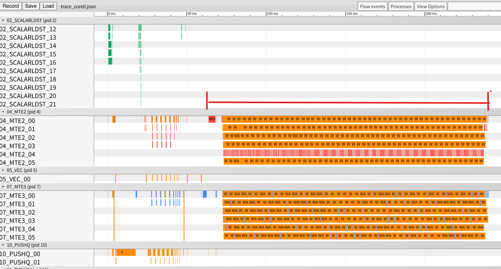
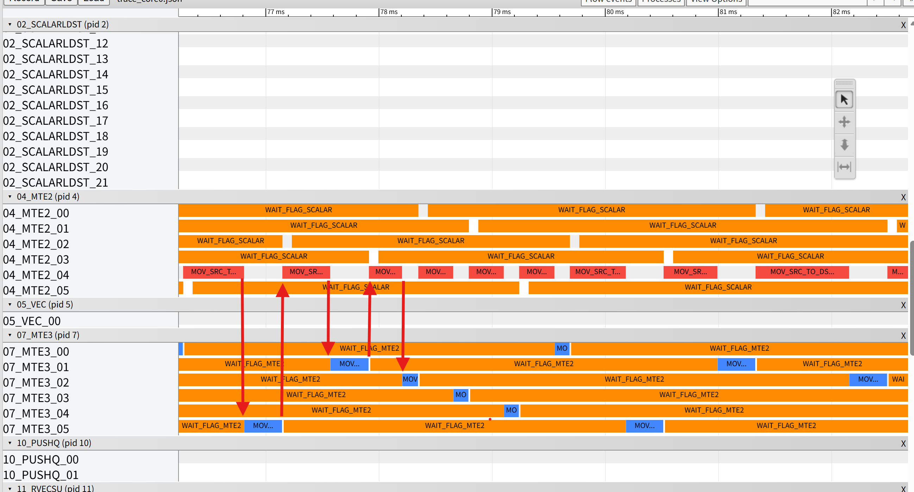
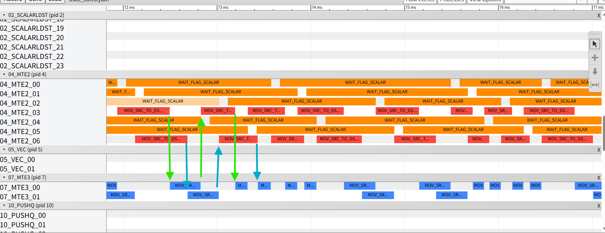
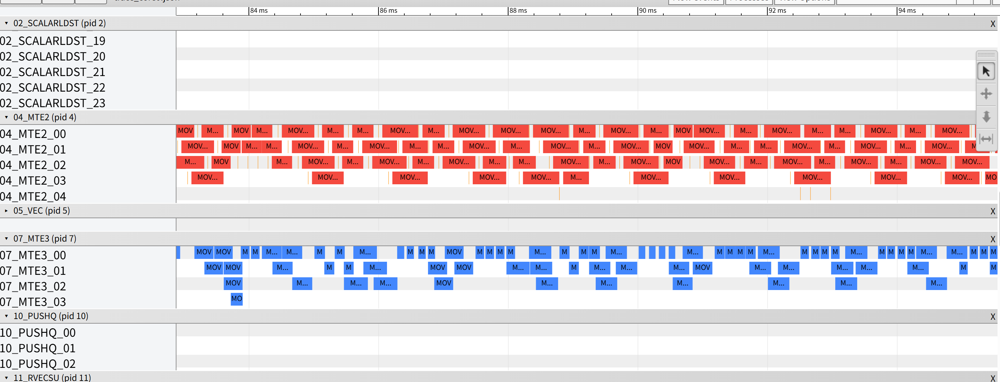
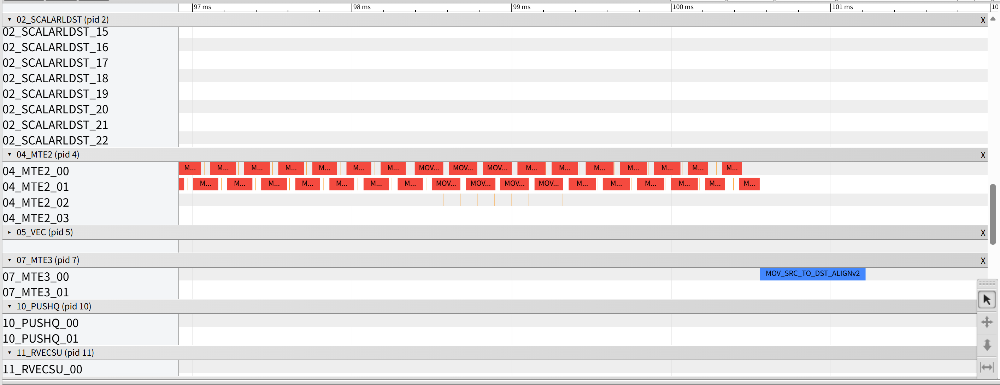
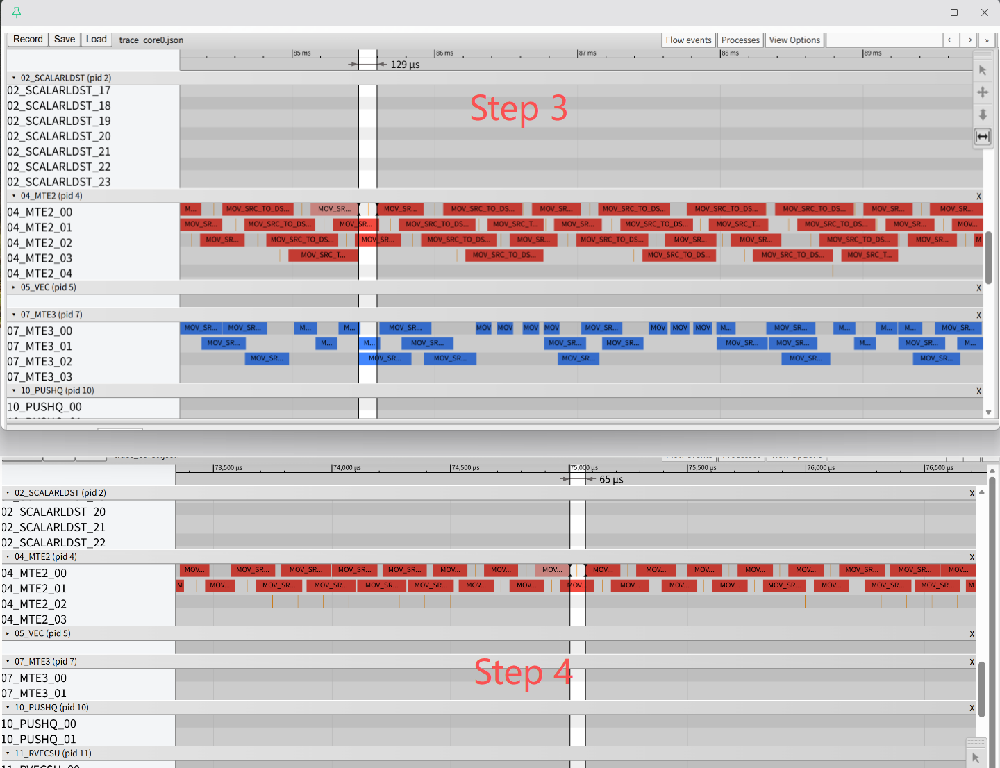
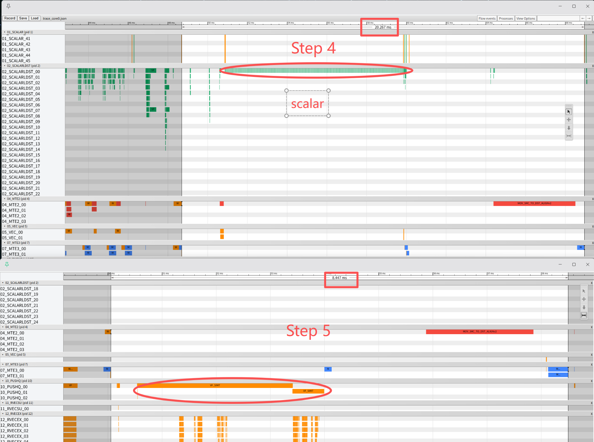
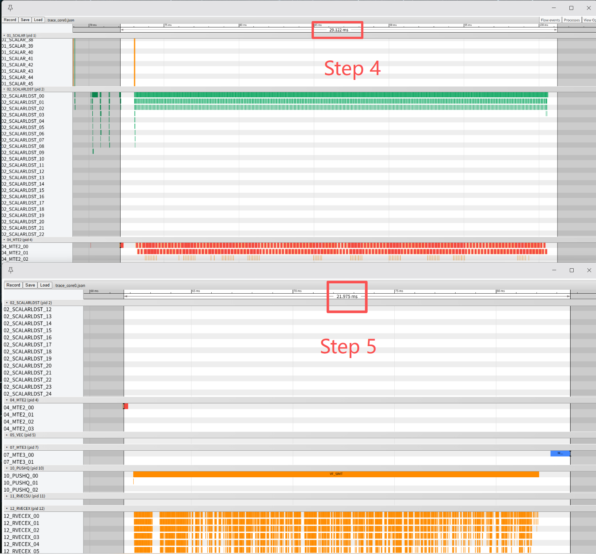
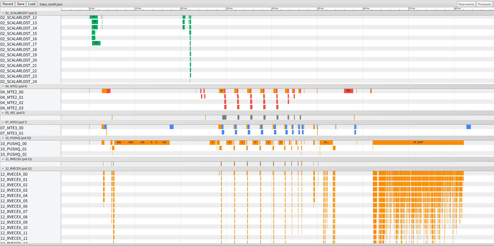

# MoeInitRoutingV3算子性能优化实践与效果分析

## 概述

本文档系统阐述 MoeInitRoutingV3 算子的实现原理、性能建模方法及优化实践。通过系统性的优化策略，帮助开发者快速掌握算子性能调优的核心技术，提升算子在昇腾平台上的执行效率。

- **平台**：Ascend 950PR/950DT（64 Vector Core）
- **测试规格**：`N=2048, K=8, H=32, expertNum=8`
- **优化路径**：基准实现 → 多核并行 → Double Buffer → 带宽优化 → UB优化 → SIMT并行

---

## 算子实现原理

### 算子功能说明

- **算子功能**：MoeInitRouting 是 MoE (Mixture of Experts) 模型的路由初始化算子，核心功能是将 token 按专家 ID 排序并重排特征数据，为后续专家计算做准备。

- **应用场景**：MoE (Mixture of Experts) 是一种稀疏激活架构，通过 Router 为每个 Token 动态选择 Top-K 个专家进行计算。相较于稠密模型，MoE 可在保持推理计算量不变的情况下大幅扩展模型参数量，已成为 LLM 架构演进的重要方向。本算子在 MoE 推理中承担 Token 路由分发功能。

- **计算公式**：

**排序：**

$$
\text{sortedExpertIdx}, \text{sortedRowIdx} = \text{KeyValueSort}(\text{expertIdx}, \text{rowIdx})
$$

**索引映射：**

- Scatter 模式：

$$
\text{expandedRowIdxOut}[i] = \text{sortedRowIdx}[i]
$$

- Gather 模式：

$$
\text{expandedRowIdxOut}[\text{sortedRowIdx}[i]] = i
$$

**直方图统计：**

$$
\text{expertTokensCountOut}[i] = \text{Histogram}(\text{sortedExpertIdx})
$$

**特征搬运：**

- Scatter 模式：

$$
\text{expandedXOut}[i] = x[\text{expandedRowIdx}[i] / K]
$$

- Gather 模式：

$$
\text{expandedXOut}[\text{expandedRowIdx}[i]] = x[i / K]
$$

- **计算流程**（本文以 Scatter 模式为例进行分析）：

**Step 1: 排序**

按 expertIdx 排序，将相同专家的 token 放在一起：

```
示例 (N=4, K=2, expertNum=4):

expertIdx:    [[1,3], [0,2], [1,2], [0,3]]
                ↓ 展开
flat:         [1, 3, 0, 2, 1, 2, 0, 3]
rowIdx:       [0, 1, 2, 3, 4, 5, 6, 7]   ← 展开后的位置索引
                ↓ 排序
sortedExpert: [0, 0, 1, 1, 2, 2, 3, 3]   ← 按专家ID排序
sortedRowIdx: [2, 6, 0, 4, 3, 5, 1, 7]   ← 排序后的原始位置
```

**Step 2: 直方图统计**

统计每个专家处理的 token 数量：

```
sortedExpert: [0, 0, 1, 1, 2, 2, 3, 3]
                ↓ 统计
expertTokensCount: [2, 2, 2, 2]  ← 每个专家处理2个token
```

**Step 3: 特征搬运**

根据 sortedRowIdx 重排特征数据（`expandedXOut[i] = x[sortedRowIdx[i] / K]`）：

```
输入 x (N=4, H=4):
        H0   H1   H2   H3
    ┌────────────────────┐
t0  │ 🟦  🟦  🟦  🟦  │  ← token 0 (蓝色)
t1  │ 🟩  🟩  🟩  🟩  │  ← token 1 (绿色)
t2  │ 🟨  🟨  🟨  🟨  │  ← token 2 (黄色)
t3  │ 🟪  🟪  🟪  🟪  │  ← token 3 (紫色)
    └────────────────────┘

sortedRowIdx: [2, 6, 0, 4, 3, 5, 1, 7]
tokenIdx:     [1,  3, 0,  2,  1,  2,  0,  3]

输出 expandedXOut (N*K=8, H=4):
        H0   H1   H2   H3
    ┌────────────────────┐
e0  │ 🟩  🟩  🟩  🟩  │  ← token 1 (专家0)
e0  │ 🟪  🟪  🟪  🟪  │  ← token 3 (专家0)
e1  │ 🟦  🟦  🟦  🟦  │  ← token 0 (专家1)
e1  │ 🟨  🟨  🟨  🟨  │  ← token 2 (专家1)
e2  │ 🟩  🟩  🟩  🟩  │  ← token 1 (专家2)
e2  │ 🟨  🟨  🟨  🟨  │  ← token 2 (专家2)
e3  │ 🟦  🟦  🟦  🟦  │  ← token 0 (专家3)
e3  │ 🟪  🟪  🟪  🟪  │  ← token 3 (专家3)
    └────────────────────┘
```

- **参数说明**：

| **变量名** | **描述** | **Dtype** | **Shape** |
|-----------|---------|-----------|-----------|
| x | Token 特征 | `float32` | (N, H) |
| expertIdx | 选中专家 ID | `int32` | (N, K) |
| expandedXOut | 重排后特征 | `float32` | (N*K, H) |
| expandedRowIdx | 索引映射 | `int32` | (N*K,) |
| expertTokensCount | 每个专家处理的 token 数量 | `int64` | (expertNum,) |

### 算子实现说明

MoeInitRouting 是混合 Bound 算子，以访存瓶颈为主导。主要流水包括：

- **MTE2**：GM → UB 数据搬入（expertIdx、x、scale）
- **VEC**：向量计算（Sort、Histogram）
- **MTE3**：UB → GM 数据搬出（expandedX、expertTokensCount）

**为什么以访存瓶颈为主导：**

1. **数据搬运量大**：特征搬运阶段需要读写 `N×K×H` 个 float32 元素，占总数据量的绝大部分
2. **计算量相对较小**：排序 `O(N×K log(N×K))`、直方图 `O(N×K)`，远小于数据搬运量 `O(N×K×H)`
3. **访存比低**：每个 Token 搬运 H 个元素，但仅进行简单的索引映射操作

典型场景下 `H=4096`，数据搬运量是计算量的数百倍，访存是主要性能瓶颈。

算子的典型执行流程：

```
排序阶段：   MTE2(expertIdx, rowIdx) → VEC(Sort) → MTE3(sortedExpertIdx, sortedRowIdx)
直方图阶段： MTE2(sortedExpertIdx) → VEC(Histogram) → MTE3(expertTokensCount)
特征搬运：   MTE2(x) → MTE3(expandedX)
```

### 算子实现约束

1. **排序复杂度**：N*K 个元素需要排序，支持 VBS（单核）和 VMS（多核归并）两种模式
2. **直方图串行依赖**：需要遍历已排序的 expertIdx，存在数据依赖
3. **Gather 不规则访问**：根据 sortedRowIdx 访问 x，内存访问模式不规则

---

## 算子性能建模

### 性能瓶颈分析

MoeInitRouting 算子的性能瓶颈主要分为以下类型：

1. **Memory Bound（MTE2/MTE3 主导）**：算子性能受限于 GM↔UB 数据搬运能力。典型现象：`aiv_mte2_ratio` 偏高，数据搬运是主要开销。
2. **计算 Bound（VEC 主导）**：排序和直方图计算受限于向量计算单元。典型现象：`aiv_vec_ratio` 偏高。
3. **流水停顿（串行执行）**：MTE2 与 MTE3 交替执行而非并行，导致流水空洞。

---

## 算子优化实践

### Step 0 — 基准实现（Naive）

**实现特点**：仅使用单个核心完成所有计算，作为性能优化的基准线。

#### 单核排序流程

```cpp
// src/0_native.cpp
// VBSProcess: 单核排序
if (blockIdx < 1) {  // 只有 Core 0 执行
    // Step 1: 分多轮排序（UB 空间限制）
    for (loop = 0; loop < sortCoreLoops; loop++) {
        CopyIn(expertIdx[loop * blockSize]);      // 搬入数据块
        Sort(expertIdx, rowIdx);                  // KeyValueSort
        CopyOut(workspace, sortedResult);         // 写入 workspace
    }
    // Step 2: 单核内归并多轮结果
    if (sortCoreLoops > 1) {
        OneCoreVMSProcess();  // 归并 workspace 中的多个有序块
    }
}
SyncAll();

// SortOutProcess: 输出排序结果
if (blockIdx < 1) {
    // Step 3: 将 workspace 中的排序结果输出到 GM
    for (i = 0; i < totalElements; i++) {
        sortedExpertIdxGm[i] = workspace[i].expertIdx;
        expandedRowIdxGm[i] = workspace[i].rowIdx;
    }
}
SyncAll();
```

**流程图解：**

```
VBSProcess:
┌─────────────────────────────────────────┐
│  Core 0:                                 │
│  [数据块0] → 排序 → [有序块0]             │
│  [数据块1] → 排序 → [有序块1]             │
│  ...                                     │
│  [数据块N] → 排序 → [有序块N]             │
│              ↓ OneCoreVMSProcess         │
│  归并所有有序块 → [全局有序数据]           │
│              (存储在 workspace)          │
└─────────────────────────────────────────┘

SortOutProcess:
┌─────────────────────────────────────────┐
│  Core 0:                                 │
│  workspace → sortedExpertIdxGm          │
│           → expandedRowIdxGm            │
└─────────────────────────────────────────┘
```

#### 单核直方图统计

```cpp
// src/0_native.cpp
__aicore__ inline void Process()
{
    if (blockIdx_ < 1) {  // 只有 Core 0 执行
        // 分轮遍历已排序的 expertIdx
        for (int64_t i = 0; i < coreLoopsNum_; i++) {
            CopyIn(i, perLoopElements);
            Compute(perLoopElements);  // 标量遍历，检测专家ID变化
            CopyOut();
        }
    }
}

__aicore__ inline void Compute(int64_t curLoopElements)
{
    // 标量逐元素遍历，检测专家ID跳变点
    for (int64_t i = 1; i < curLoopElements; i++) {
        int32_t curExpertId = sortedExpertIdxInLocal.GetValue(i);
        if (curExpertId != lastExpertId) {
            expertCountOutLocal.SetValue(lastExpertId - expertStart_, i - lastIndex);
            lastIndex = i;
            lastExpertId = curExpertId;
        }
    }
}
```

**流程图解：**

```
ExpertTokensCount:
┌─────────────────────────────────────────┐
│  Core 0:                                 │
│  sortedExpertIdx: [0,0,1,1,2,2,3,3,...] │
│       ↓ 标量逐元素遍历                    │
│  检测跳变点: 0→1, 1→2, 2→3, ...          │
│       ↓                                  │
│  expertTokensCount: [2, 2, 2, 2]        │
└─────────────────────────────────────────┘
```

#### 单核 Gather（特征搬运）

```cpp
// src/0_native.cpp
for (int64_t indicesIndex = 0; indicesIndex < curLoopElements; indicesIndex++) {
    int64_t rowIdx = subRowIdxLocal.GetValue(indicesIndex);
    int64_t xSrcOffset = rowIdx / k_ * cols_;
    int64_t xDstOffset = (curExpertLoopOffset + indicesIndex) * cols_;
    
    // 逐行搬运特征
    for (int64_t colsLoop = 0; colsLoop < colsLoops_; colsLoop++) {
        CopyX(xSrcOffset + colsLoopOffset, xDstOffset + colsLoopOffset, curLoopCols);
    }
}
```

**流程图解：**

```
GatherOut:
┌─────────────────────────────────────────┐
│  Core 0:                                 │
│  expandedRowIdx: [2, 6, 0, 4, ...]      │
│       ↓ 逐元素遍历                        │
│  for each idx:                           │
│    rowIdx = idx                          │
│    srcOffset = rowIdx / K * cols         │
│    dstOffset = (loopOffset + idx) * cols │
│    CopyX(srcOffset, dstOffset)           │
│       ↓                                  │
│  expandedX: [x[1], x[3], x[0], ...]     │
└─────────────────────────────────────────┘
```

**性能瓶颈分析：**

| 阶段 | 问题 | 原因 |
|------|------|------|
| **整体** | **核心利用率低** | **64 核仅使用 1 核** |
| 排序 | 单核排序效率低 | VBS 仅 Core 0 执行 |
| 直方图 | 标量遍历效率低 | `GetValue()` 逐元素访问，无法向量化 |
| Gather | 搬运流水连续性差 | 每次搬入和搬出`x`存在前后依赖，后一次搬出/搬入需等待前一次的搬入/搬出结束 |
| Gather | 小包搬运 | 根据 `rowIdx` 跨行访问，无法连续搬运多行`x`，当x的cols维度较小时搬运量少，带宽未充分利用 |
| Gather | UB空间利用率低 | 每次只搬入`rowIdx` 和 一行`x` ，当cols较小时，核内UB空间有大量闲置 |

---

### Step 1 — 多核并行

**优化目标**：将并行度从 1 提升到最大核数，充分利用硬件资源。

#### 排序多核并行

排序阶段采用 VBS + VMS 混合策略：

1. **VBS（Vector Based Sort）**：每个 Core 对自己负责的数据块进行局部排序
2. **VMS（Merge Sort）**：多 Core 归并各数据块的排序结果

**多核排序 vs 单核排序：**

- **优势**：每个核待排序元素数量从 N×K 降至约 N×K/64（尾核可能更少），排序复杂度显著降低，效率提升
- **代价**：核间归并需要 `SyncAll()` 全核同步等待，产生一定阻塞开销
- **整体**：并行加速收益远大于同步开销，整体性能大幅提升

**关键实现（VMS 多核归并）：**

```cpp
// src/1_multi_core.cpp
// VMS: 多核归并
__aicore__ inline void VMSProcess()
{
    for (; listNum > MAX_MRGSORT_LIST;) {
        currentStageNeedCoreNum = Ceil(listNum, MAX_MRGSORT_LIST);
        // 多核并行归并
        if (this->blockIdx < currentStageNeedCoreNum) {
            mrgsorter.Init(&mrgsortParam);
            mrgsorter.Process();
        }
        SyncAll();
    }
}
```

#### 直方图多核并行

直方图阶段采用分片统计 + 原子累加策略：

**多核直方图 vs 单核直方图：**

- **并行遍历**：每个核处理约 (N×K)/64 个元素，并行统计局部计数
- **原子累加**：各核将局部计数通过 `AtomicAdd` 累加到全局计数器
- **核心利用率**：从单核串行遍历 → 多核并行处理，充分利用硬件资源

**关键实现：**

```cpp
// src/1_multi_core.cpp
__aicore__ inline void CopyOut()
{
    LocalTensor<int32_t> expertCountOutLocal = expertCountOutToTempQueue_.DeQue<int32_t>();
    SetWaitFlag<HardEvent::S_MTE3>(HardEvent::S_MTE3);
    SetAtomicAdd<int32_t>();  // 使用原子操作累加
    DataCopyPad(expertCountTempGm_, expertCountOutLocal, copyParams);
    SetAtomicNone();
}
```

#### Gather 多核并行

Gather 阶段按索引分块到多个 Core：

**多核 Gather vs 单核 Gather：**

- **数据分片**：每个核处理约 (N×K)/64 个 token 的特征搬运，无数据依赖
- **无需同步**：各核独立处理各自数据块，无原子操作或同步开销
- **核心利用率**：从单核串行搬运 → 多核并行搬运，充分利用带宽

**关键实现：**

```cpp
// src/1_multi_core.cpp
perCoreIndicesElements_ = Ceil(expertTotalCount_, tilingData->coreNum);
needCoreNum_ = Ceil(expertTotalCount_, perCoreIndicesElements_);
```

**性能数据：**

| 指标 | 单核 | 多核 | 变化 |
|------|------|------|------|
| Block Num | 1 | 64 | 多核并行加速 |
| 执行时间 | 4465us | 158us | 28.3x |

多核并行加速：实际加速比 `4450 / 158 = 28.3x`，并行效率 `28.3 / 64 = 44%`，在排序部分，多核排序并不会使用全部的64核。

从打点图可以看出，最后执行的特征搬运（Gather）阶段占据了流水超过 70% 的时间，是主要的性能瓶颈。



进一步展开 Gather 阶段的流水，发现存在大量 `wait_flag_mte2`。原因是 Gather 需要等待 x 搬入完成后才能搬出，等待上一波 x 搬出后才能开始下一波搬入，流水未充分重叠。



---

### Step 2 — Double Buffer（双缓冲）

**优化目标**：让 MTE3 搬出当前批次时，MTE2 同时预取下一批数据，实现流水重叠。

**单缓冲 vs 双缓冲流水线：**

```
单缓冲（串行）：
时间 ─────────────────────────────────────────────────────────►
Core 0: [MTE2: 搬入batch0] [MTE3: 搬出batch0] [MTE2: 搬入batch1] [MTE3: 搬出batch1] ...
        ├───── MTE3空闲 ─────┤├───── MTE2空闲 ─────┤

双缓冲（重叠）：
时间 ─────────────────────────────────────────────────────────►
MTE2:  [搬入batch0] [搬入batch1] [搬入batch2] [搬入batch3] ...
MTE3:                [搬出batch0] [搬出batch1] [搬出batch2] ...
                     ├──── 流水重叠 ────┤├──── 流水重叠 ────┤
```

**代码改动：**

```cpp
// src/1_multi_core.cpp - 单缓冲
TQueBind<TPosition::VECIN, TPosition::VECOUT, 1> xCopyInQueue_;

// src/2_double_buffer.cpp - 双缓冲
TQueBind<TPosition::VECIN, TPosition::VECOUT, DOUBLE_BUFFER> xCopyInQueue_;
```

**同步机制对比：**

```cpp
// 单缓冲：显式同步等待
CopyXIn(...);                              // MTE2: 搬入特征到 UB
SetWaitFlag<HardEvent::MTE2_MTE3>();       // 等待 MTE2 完成
CopyXOut(...);                             // MTE3: 从 UB 搬出结果

// 双缓冲：队列机制自动同步
LocalTensor<float> xLocal = xCopyInQueue_.AllocTensor<float>();
DataCopy(xLocal, xGm[...], ...);           // MTE2: 搬入特征到 UB buffer
xCopyInQueue_.EnQue(xLocal);               // EnQue 放入队列，自动释放信号
xLocal = xCopyInQueue_.DeQue<float>();     // DeQue 取出数据，自动等待信号
DataCopy(expandedXGm[...], xLocal, ...);   // MTE3: 从 UB 搬出结果
```

**关键实现：**

```cpp
// src/2_double_buffer.cpp
constexpr static int64_t DOUBLE_BUFFER = 2;  // 双缓冲深度

// GatherOut 双缓冲队列初始化
pipe_->InitBuffer(xCopyInQueue_, DOUBLE_BUFFER, AlignBytes(perLoopCols_, sizeof(float)));

// 双缓冲流水线执行
for (int64_t i = 0; i < totalLoops; i++) {
    CopyXIn(i, ...);        // MTE2: 搬入当前批特征
    CopyXOut(i, ...);       // MTE3: 搬出当前批结果 - 与下一批 MTE2 重叠
}
```

**性能数据：**

| 指标 | Step 1 | Step 2 | 变化 |
|------|----------|---------------|------|
| 执行时间 | 158us | 107us | 1.47x |
| `aiv_mte2_time` | 72.5us | 44us | MTE2 时间下降|
| `aiv_mte3_time` | 34.5us | 24us | MTE3 时间下降 |

开启double buffer后，两条MTE buffer间无依赖，流水形成掩盖，总的MTE时间显著下降。


**遗留问题：**

虽然双缓冲显著提升了 MTE2/MTE3 流水重叠效率，但存在带宽利用率不足的问题：

- **单次 DMA 数据量小**：cols 较小导致单次 DMA 搬运数据量不足，无法充分发挥 HBM 带宽能力
- **循环次数多**：每轮只处理少数元素，DMA 启动延迟开销占比高

---

### Step 3 — 带宽利用率优化

**优化目标**：当 UB 空间充足时，适当增加缓冲区数量，可让 MTE2/MTE3 流水重叠更充分，带宽利用率更高。

**核心思路：**

- Step 2 使用 2 个 Buffer，当 UB 空间充足时可继续增加 bufferNum（如 4）
- 更深的流水线 → In/Out 重叠更充分 → MTE 空闲时间减少
- 带宽打得更满，整体性能提升

**关键实现：**

```cpp
// src/3_bandwidth_utilization.cpp
// 计算 bufferNum=2 时每轮能处理的最大索引数
int64_t perLoopMaxIndicesElements = 
    (tilingData->ubSize / DOUBLE_BUFFER - inputXSize - inputScaleSize) / sizeof(int32_t);

// 动态调整：找到最大 bufferNum，同时保证每轮能处理完所有数据
while (perLoopMaxIndicesElements > perCoreIndicesElements && bufferNum < MAX_BUFFER_NUM) {
    bufferNum++;
    perLoopMaxIndicesElements = 
        (tilingData->ubSize / bufferNum - inputXSize - inputScaleSize) / sizeof(int32_t);
}

// 根据最优 bufferNum 初始化队列
pipe_->InitBuffer(expandedRowIdxCopyInQueue_, bufferNum, 
                  AlignBytes(curCorePerLoopIndicesElements_, sizeof(int32_t)));
pipe_->InitBuffer(xCopyInQueue_, bufferNum, AlignBytes(perLoopCols_, sizeof(float)));
```

**性能数据：**

| 指标 | Step 2 | Step 3 | 变化 |
|------|----------|---------------|------|
| 执行时间 | 107us | 74us | 1.45x |
| `aiv_mte2_time` | 44us | 23us | MTE2 仍下降明显|
| `aiv_mte3_time` | 24us | 21us | MTE3 时间下降 |

相比于step2，step3的mte2时间仍下降了接近一倍，搬入数据量总量不变，带宽利用率大幅提升


**收益边界：**

实验表明，bufferNum 增加到 6 或 8 后，收益趋于平缓。流水重叠已接近极限，继续增加反而会减少每个 buffer 的容量，可能引入其他开销。

**遗留问题：**

增大 BufferNum 在 cols 较大场景收益明显，但小 cols 场景收益可能有限：

**DMA 性能特点：**

| 特性 | 说明 |
|------|------|
| 启动延迟 | ~几十 cycles，固定开销 |
| 传输时间 | 与数据量成正比 |

**关键洞察：流水并行只能重叠"传输时间"，无法消除"启动延迟"**

```
小 cols_ 场景（启动延迟占比高）：
Buffer0: [启动50][传3]--------------[启动50][传3]
Buffer1: --------[启动50][传3]--------------[启动50][传3]
                      ↑
               启动延迟占94%，并行无法优化

大 cols_ 场景（传输时间长）：
Buffer0: [启动50][====传输200====]--------[启动50][====传输200====]
Buffer1: ----------[启动50][====传输200====]--------[启动50][====传输200====]
                            ↑
                   传输时间长，并行收益明显
```

小 cols_ 场景下，单次 DMA 数据量小，启动延迟占比较高，流水并行无法消除启动延迟。

---

### Step 4 — UB 利用率优化

**优化目标**：利用 UB 缓冲多行数据，一次大 DMA 写出，减少启动延迟次数。

**核心思路：**

- **分批搬入多行**：在Step 2的基础上，逐行搬入 x 到 UB（必须逐行，因为来源不连续），充分利用 UB 空间缓存多行数据
- **一次搬出**：UB 中累积多行后，一次性大 DMA 写出（多行连续）
- **收益**：
  - 相比于 Step 3，搬入虽然牺牲了一定的队列深度，但 MTE2 不再依赖上一次 MTE3 完成，搬入可连续执行
  - 最大化 UB 空间利用率，单次写出数据量更大
  - DMA 搬出次数减少 → MTE3启动延迟（无效时间）次数减少 → 有效传输占比提升 → 带宽利用率提升

**对比分析：**

```
增大BufferNum：
每行：[搬入启动][搬入传输][搬出启动][搬出传输] × N 次
      启动延迟次数 = 2N 次，无法消除

多行缓存批量写出：
      [搬入启动][搬入传输] × N 次（搬入必须逐行）
      [搬出启动][搬出传输] × 1 次（一次大写出）
      启动延迟次数 = N+1 次，大幅减少
```

**关键实现：**

```cpp
// src/4_ub_utilization.cpp
__aicore__ inline void Process()
{
    LocalTensor<float> xLocal = xCopyInQueue_.AllocTensor<float>();
    for (int64_t indicesIndex = 0; indicesIndex < curLoopElements; indicesIndex++) {
        // 分批搬入：根据 rowIdx 跳跃访问，逐行搬入（来源不连续）
        for (int64_t colsLoop = 0; colsLoop < colsLoops_; colsLoop++) {
            CopyXIn(xSrcOffset + colsLoopOffset, xLocalOffset + colsLoopOffset, curLoopCols, xLocal);
        }
    }
    // 一次搬出：多行数据在 UB 中连续，目标 GM 也连续 → 单次大 DMA
    CopyXOut(curExpertLoopOffset * cols_, curLoopElements * cols_);
}
```

**性能数据：**

| 指标 | Step 3 | Step 4 | 变化 |
|------|----------|---------------|------|
| 执行时间 | 74us | 68us | 1.09x |
| `aiv_mte2_time` | 23us | 16.5us | MTE2 略微下降 |
| `aiv_mte3_time` | 21us | 2us | MTE3 下降显著 |

**分析：**

- **MTE3 显著下降**：UB 中累积多行后一次性大 DMA 写出，搬出次数大幅减少


- **MTE2 略有下降**：虽然牺牲队列深度，但相邻两次 MTE2 间隔显著缩小（如 129us → 65us），搬入更连续


- **整体略有提升**：Step 3 中 MTE2/MTE3 已有大部分流水重叠，Step 4 的收益无法简单叠加，但仍有优化效果

---

### Step 5 — SIMT 并行

**优化目标**：使用 SIMT（Single Instruction Multiple Threads）编程模型，实现细粒度并行。

**为何适用 SIMT**：

SIMT 的核心特性是**直接访问 Global Memory** 和**离散访存友好**，非常适合处理不规则访问场景。MoeInitRouting 算子中的两个关键场景均可利用 SIMT 优势：

| 场景 | 问题特征 | SIMT 优势 |
|------|----------|-----------|
| 直方图 | 标量遍历、串行依赖 | 边界检测只依赖输入数据 → 多线程并行 |
| Gather | 离散访存、核内串行逐行搬入 | 多线程并发访存 → 带宽利用率提升 |

#### 直方图 SIMT 优化

**原始串行方法的问题**：

```cpp
// Step 4 - 标量逐元素遍历，存在数据依赖
for (int64_t i = 1; i < curLoopElements; i++) {
    if (currExpertId != lastExpertId) {
        lastIndex = i;  // 串行传递，无法并行
        lastExpertId = currExpertId;
    }
}
```

**SIMT 解决方案**：将串行依赖拆解为两个独立步骤，每个位置可并行检测：

```
sortedExpertIdx: [0, 0, 1, 1, 2, 2, 2, 3, 3]
                  ↓ 多线程并行检测边界
检测首次出现: currExpertId != prevExpertId
检测最后出现: currExpertId != nextExpertId
```

**Step 1：查找每个专家首次出现的位置**

```cpp
// src/5_simt.cpp
__simt_vf__ LAUNCH_BOUND(SIMT_THREAD_NUM) inline void ComputeExpertFirstIndexSimt(
    int32_t elementNum, int32_t expertStart, int32_t expertEnd,
    __gm__ int32_t *sortedExpertIdGmAddr,
    __ubuf__ int32_t *expertFirstIndexLocalAddr)
{
    auto threadIdx = static_cast<int32_t>(Simt::GetThreadIdx());
    auto threadNum = static_cast<int32_t>(Simt::GetThreadNum());
    
    for (auto i = threadIdx; i < elementNum; i += threadNum) {
        auto currExpertId = sortedExpertIdGmAddr[i];
        if (currExpertId >= expertEnd) break;
        
        auto prevExpertId = (i == 0 ? -1 : sortedExpertIdGmAddr[i - 1]);
        if (currExpertId != prevExpertId) {
            expertFirstIndexLocalAddr[currExpertId - expertStart] = i;
        }
    }
}
```

**Step 2：根据首次出现位置计算每个专家的 token 数量**

```cpp
// src/5_simt.cpp
__simt_vf__ LAUNCH_BOUND(SIMT_THREAD_NUM) inline void ComputeExpertCountOutSimt(
    int32_t elementNum, int32_t expertStart, int32_t expertEnd,
    __gm__ int32_t *sortedExpertIdGmAddr,
    __ubuf__ int32_t *expertFirstIndexLocalAddr,
    __ubuf__ int32_t *expertCountOutLocalAddr)
{
    auto threadIdx = static_cast<int32_t>(Simt::GetThreadIdx());
    auto threadNum = static_cast<int32_t>(Simt::GetThreadNum());
    
    for (auto i = threadIdx; i < elementNum; i += threadNum) {
        auto currExpertId = sortedExpertIdGmAddr[i];
        if (currExpertId >= expertEnd) break;
        
        // 检测专家ID跳变点（最后一个元素或下一个元素是不同专家）
        if (i == elementNum - 1 || currExpertId != sortedExpertIdGmAddr[i + 1]) {
            expertCountOutLocalAddr[currExpertId - expertStart] =
                i + 1 - expertFirstIndexLocalAddr[currExpertId - expertStart];
        }
    }
}
```

**主核组合调用两个 SIMT 函数：**

```cpp
// src/5_simt.cpp
Simt::VF_CALL<ComputeExpertFirstIndexSimt>(Simt::Dim3{SIMT_THREAD_NUM, 1, 1}, 
    curCoreElements_, expertStart_, expertEnd_, 
    sortedExpertIdxGmAddr, expertCountOutLocalAddr);
Simt::VF_CALL<ComputeExpertCountOutSimt>(Simt::Dim3{SIMT_THREAD_NUM, 1, 1}, 
    curCoreElements_, expertStart_, expertEnd_, 
    sortedExpertIdxGmAddr, expertCountOutLocalAddr, expertCountOutLocalAddr);
```

相比于 Step 4 的标量逐元素串行遍历，Step 5 通过 SIMT 多线程并行检测边界并直接访问 GM，直方图耗时从 20.267降至 8.447，提升 2.40x。


#### Gather SIMT 优化

**原始方法的问题**：

- 根据 `expandedRowIdx` 跨行访问 `x`，内存访问模式**不规则、不连续**
- SIMD 对数据排布有严格要求（连续、对齐），难以向量化

**SIMT 优势**：

- **直接从 GM 读取**：SIMT 线程可直接访问 `xGmAddr[rowIdx / k * cols]` 读取源数据，无需先将 x 搬入 UB
- **第一维离散并行访问**：64 个线程同时访问不同的 token 位置，充分释放带宽
- **第二维连续访问**：32 个线程处理同一 token 的 cols 维度，访问连续

```cpp
// src/5_simt.cpp
__simt_vf__ LAUNCH_BOUND(SIMT_THREAD_NUM) inline void GatherOutSimt(
    int32_t curLoopElements, int32_t cols, uint64_t magic, uint64_t shift,
    __gm__ float *xGmAddr, 
    __ubuf__ int32_t *expandedRowIdxLocalAddr, 
    __ubuf__ float *xLocalAddr)
{
    auto threadIdx0 = static_cast<int32_t>(Simt::GetThreadIdx<0>());
    auto threadNum0 = static_cast<int32_t>(Simt::GetThreadNum<0>());
    auto threadIdx1 = static_cast<int32_t>(Simt::GetThreadIdx<1>());
    auto threadNum1 = static_cast<int32_t>(Simt::GetThreadNum<1>());

    // 二维并行：第一维离散访问 indices，第二维连续访问 cols
    for (auto i = threadIdx0; i < curLoopElements; i += threadNum0) {
        int64_t rowIdx = expandedRowIdxLocalAddr[i];
        int64_t xSrcOffset = static_cast<int64_t>(Simt::UintDiv(
            static_cast<uint64_t>(rowIdx), magic, shift)) * cols;
        int64_t xLocalOffset = i * cols;
        
        for (auto j = threadIdx1; j < cols; j += threadNum1) {
            xLocalAddr[xLocalOffset + j] = xGmAddr[xSrcOffset + j];
        }
    }
}

// 主核调用 SIMT 函数 - 二维线程布局
Simt::VF_CALL<GatherOutSimt>(
    Simt::Dim3{64, 32, 1},  // 第一维64线程离散访问，第二维32线程连续访问
    static_cast<int32_t>(curLoopElements), 
    static_cast<int32_t>(cols_), 
    magic, shift,
    xGmAddr, expandedRowIdxLocalAddr, xLocalAddr);
```

Step 5 保持大块搬出的逻辑不变，将分批 MTE 搬入改为 SIMT 方式从 GM 直接读取。从打点图可见，Step 4 中相邻两次 MTE2 搬入间存在标量运算，影响带宽利用率；若标量操作过重，搬入流水无法充分连续。相比之下，SIMT 多线程并行访问配合线程独有的寄存器机制，在此场景下访存性能略有提升。


需要指出的是，从 SIMT 机制来看，直接从 GM 读取数据到 UB 的带宽其实不如 SIMD MTE2 搬入的带宽。当前场景主要针对 H 较小的离散小包搬运，若 H 较大时，从实践效果来看，SIMT 可能不如多 Buffer 下的 SIMD。

**性能数据：**

| 指标 | Step 4 | Step 5 | 变化 |
|------|--------|--------|------|
| 执行时间 | 68us | 60us | 1.13x |
| scalar time | 23us | 4us | 降低 |
| mte2 time | 16.5us | 0.5us | 降低 |
| vec time | 0.6us | 15us | 提高 |
| Histogram | 串行 | **并行** | 多线程加速 |
| Gather | 离散逐行 | **并行** | 二维并行 |

经过多轮优化后，Gather 部分耗时占比从 Step 1 的超过 70%降至不到 1/3。从打点图来看，Sort 部分多处流水间存在较大空隙，可作为后续优化方向。



---

## 整体收益

| Step | 核心动作 | 优化内容 | 关键技术 | 步骤加速比 | 累计加速比 |
|------|----------|----------|----------|------------|------------|
| 0 | 基准实现 | 单核完成所有计算 | VBS 单核排序 | — | 1.0x |
| 1 | 多核并行 | 排序/直方图/Gather 多核并行 | VBS+VMS、AtomicAdd | 28.3x | 28.3x |
| 2 | Double Buffer | 双缓冲流水重叠 | QueBind、PIPELINE_DEPTH | 1.48x | 41.9x |
| 3 | 带宽利用率 | 动态缓冲区数量 | bufferNum 自适应 | 1.45x | 60.8x |
| 4 | UB 利用率 | 优化 UB 空间分配 | 分批搬入、一次搬出 | 1.09x | 66.3x |
| 5 | SIMT 并行 | 细粒度线程并行 | Simt::VF_CALL、二维线程布局 | 1.13x | 75.0x |

---

## 附录

### A. 参考资料

- [Ascend C 编程指南](https://www.hiascend.com/document)
- [ops-transformer 仓库](https://gitcode.com/cann/ops-transformer)
- [MoeInitRouting 原始实现](https://gitcode.com/cann/ops-transformer/tree/master/moe/moe_init_routing_v3)

### B. 代码结构

```
moe_init_routing_story/
├── README.md                    # 本文档
├── CMakeLists.txt               # 构建配置
├── src/                         # 各优化版本代码
│   ├── 0_native.cpp             # 基准实现（Naive）
│   ├── 1_multi_core.cpp         # 多核并行
│   ├── 2_double_buffer.cpp      # Double Buffer
│   ├── 3_bandwidth_utilization.cpp  # 带宽利用率
│   ├── 4_ub_utilization.cpp     # UB 利用率
│   └── 5_simt.cpp               # SIMT 并行
├── include/                     # 头文件
│   ├── moe_mrgsort.h            # 归并排序
│   ├── moe_mrgsort_out.h        # 归并排序输出
│   ├── moe_sort_base.h          # 排序基类
│   ├── moe_tiling_def.h         # Tiling 定义
│   ├── moe_util.h               # 工具函数
│   └── moe_kernel_common.h      # 公共定义
└── scripts/
    ├── gen_data.py              # 生成测试数据
    └── verify_result.py         # 结果验证
```

### C. 编译与运行

在项目根目录启动构建，执行：

```bash
cmake -S . -B build
cmake --build build --target moe_init_routing_story
```
构建完成后会在./build/Samples/2_Performance/moe_init_routing_story/目录下生成MoeInitRoutingV3算子各个版本的可执行文件，如1_multi_core、2_double_buffer。

先在可执行文件的同目录下生成一组测试数据，其中n和c为输入Token的维度特征(n, c)，k表示为每个Token动态选择Top-K个专家：

```bash
python3 ./Samples/2_Performance/moe_init_routing_story/scripts/gen_data.py -n 2048 -k 8 -c 32
```

运行相应的可执行文件，三个参数分别对应上文的-n、-k和-c：

```bash
./build/Samples/2_Performance/moe_init_routing_story/1_multi_core 2048 8 32
```

最后执行精度校验：

```bash
python3 ./Samples/2_Performance/moe_init_routing_story/scripts/verify_result.py
```

执行结束后会在控制台输出精度比对结果，如：

```bash
ExpandedX Precision is 100.0000%
ExpandedRowIdx Precision is 100.0000%
TokenCount Precision is 100.0000%
```