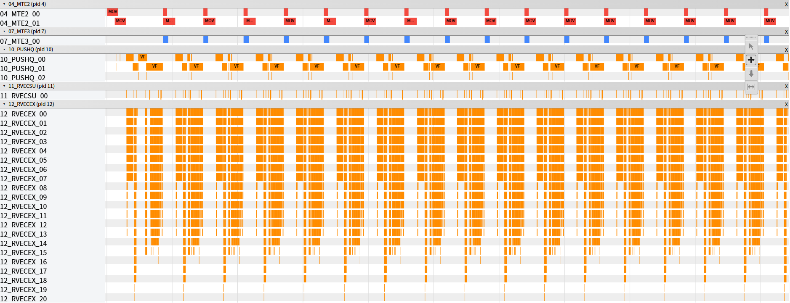
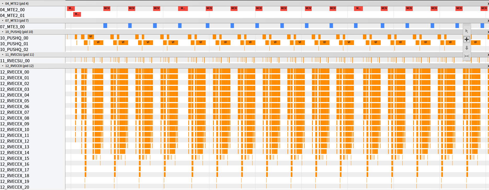
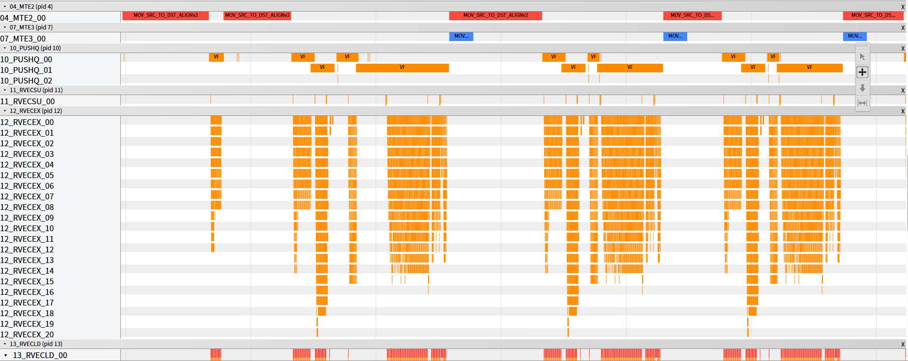
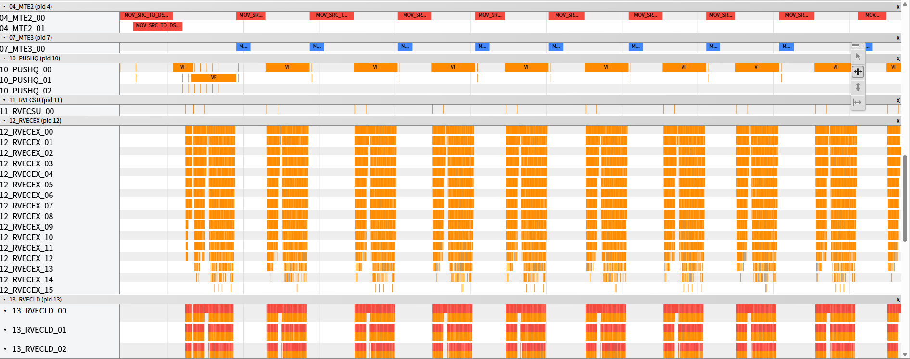
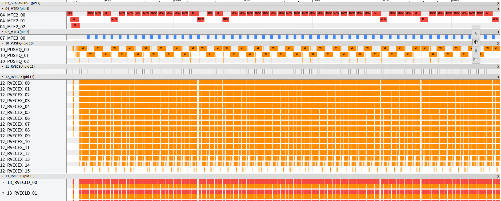
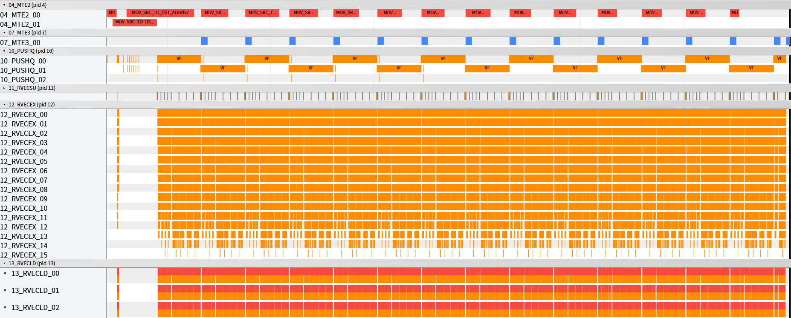
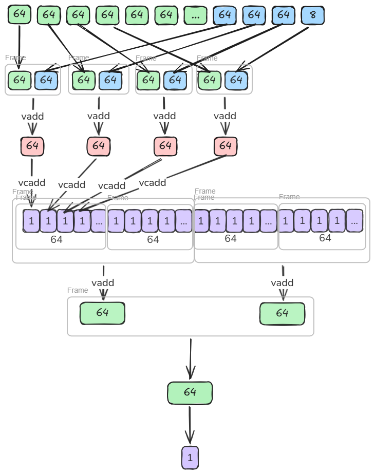
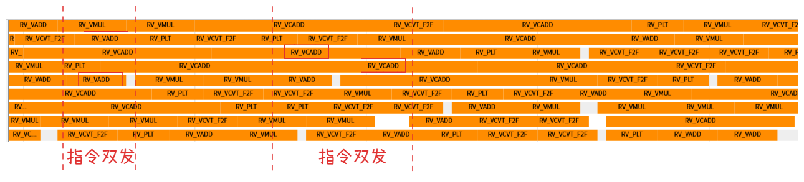

# RmsNormQuant 算子性能优化指南

## 概述

本文档系统阐述 RmsNormQuant 算子的实现原理、性能建模方法及优化实践。通过系统性的优化策略，帮助开发者快速掌握算子性能调优的核心技术，提升算子在昇腾平台上的执行效率。

- **平台**：Ascend 950PR/950DT（64 Vector Core）
- **测试规格**：`x[4096, 8192] float16 → y[4096, 8192] int8`
- **最佳结果**：`7693 us → 49.0 us`，总加速比 **157x**

---

## 算子实现原理

### 算子功能说明

- **算子功能**：RmsNormQuant 是 LLM 推理中常见的归一化与量化融合算子。其核心逻辑将输入矩阵按行做 RMS Normalization，乘以可学习权重 gamma，再通过量化参数映射为 int8 输出。相较于分离执行 RmsNorm + Quantize，融合实现可显著减少中间结果的全局内存读写。

- **应用场景**：Transformer 架构中 Attention 和 FFN 计算前的归一化与量化预处理，广泛用于 KV Cache 量化、激活量化等场景。

- **计算公式**：

$$
\text{RMS}_i = \sqrt{\frac{1}{r}\sum_{j=0}^{r-1}x_{i,j}^2 + \varepsilon}
$$

$$
\text{norm}_{i,j} = \frac{x_{i,j}}{\text{RMS}_i} \cdot \gamma_j
$$

$$
y_{i,j} = \text{clamp}\!\left(\text{round}\!\left(\text{norm}_{i,j} \cdot s + b\right),\ -128,\ 127\right)
$$

- **参数说明**：

| **变量名** | **描述** | **Dtype** | **Shape** |
|-----------|---------|-----------|-----------|
| x | 输入矩阵 | `float16` | (a, r) |
| gamma | 归一化权重 | `float16` | (r,) |
| scale | 量化缩放系数 | `float16` | (1,) |
| offset | 量化偏置 | `int8` | (1,) |
| y | 输出矩阵 | `int8` | (a, r) |
| ε | 数值稳定常数 | — | 1e-6 |

### 算子实现说明

RmsNormQuant 是纯 Vector 算子。主要流水包括：

- **MTE2**：GM → UB 数据搬入（x、gamma）
- **VEC**：向量计算（平方归约、sqrt、除法、量化映射）
- **MTE3**：UB → GM 数据搬出（y）

算子的典型执行流程：

```
MTE2(x) → VEC(RMS归约) → VEC(归一化+量化) → MTE3(y)
```

### 算子实现约束

1. **行间独立性**：每行的 RMS 只依赖本行数据，天然适合按行做多核并行。
2. **行内长归约**：`r=8192`，列方向不能随意切碎，ReduceSum 的中间值需保存。
3. **gamma 跨行共享**：4096 行共用同一份 gamma（16 KB）。

---

## 算子性能建模

### 性能瓶颈分析

RmsNormQuant 算子的性能瓶颈主要分为以下类型：

1. **Memory Bound（MTE2 主导）**：算子性能受限于 GM→UB 数据搬运能力。典型现象：`aiv_mte2_ratio` 偏高，`vec+mte2 ≈ 100%` 但两者不重叠。
2. **计算 Bound（VEC 主导）**：算子性能受限于向量计算单元。典型现象：`aiv_vec_ratio` 偏高，MTE2 已经不是瓶颈但时延仍未继续下降。
3. **流水停顿（串行执行）**：VEC 与 MTE2 交替执行而非并行，导致流水空洞。典型现象：`vec+mte2 ≈ 100%` 且两者比例之和接近 100% 。

### 性能建模公式

#### 基本原理

$$
T_{\text{total}} = \max(T_{\text{vec}},\ T_{\text{mte2}},\ T_{\text{mte3}}) + T_{\text{scalar\_overhead}}
$$

当 VEC 与 MTE2 完全重叠时，整体时延由更慢的一侧决定。

#### 各流水理论耗时估算

**1. MTE2 搬运时间**

每核处理 `blockFactor` 行，每行搬运 `r` 个 float16（x）和一次 gamma（16 KB）：

$$
T_{\text{mte2}} \approx \frac{\text{blockFactor} \times r \times \text{sizeof}(\text{float16}) + r \times \text{sizeof}(\text{float16})}{BW_{\text{hbm}}}
$$

其中 `blockFactor = a / coreNum = 4096 / 64 = 64`，当 gamma 提前全量搬入时，gamma 开销折算为一次性固定成本。

**2. VEC 计算时间**

每行需要完成 `ReduceSum + Sqrt + Div + Mul + Muls + Adds + Cast` 等操作，每元素约 10 FLOPs：

$$
T_{\text{vec}} \approx \frac{\text{blockFactor} \times r \times 10\ \text{FLOPs}}{FP_{\text{vec}}}
$$

**3. MTE3 搬出时间**

输出为 int8，每核搬出 `blockFactor × r` 字节：

$$
T_{\text{mte3}} \approx \frac{\text{blockFactor} \times r \times \text{sizeof}(\text{int8})}{BW_{\text{hbm}}}
$$

**4. 固定成本**

循环次数 × (DMA setup 开销 + 调度开销)，与 `ubFactor` 成反比。

#### 流水理论耗时对比

**MTE2 vs VEC**

当 `aiv_vec_ratio ≫ aiv_mte2_ratio`（Step 2~3），VEC 是主要瓶颈，应优先压缩计算链路（如减少中间 UB 读写），而非立即开 Double Buffer。

当两者接近时（Step 3 优化后 `vec ≈ 54%`, `mte2 ≈ 41%`），开 Double Buffer 使两者真正重叠，此时理论收益最大。

**建模说明**：

- 该模型基于单核流水线理论，整体性能受限于最慢的流水阶段。
- 通过分析各阶段 ratio 变化趋势，可以准确识别性能瓶颈类型。
- 优化目标是让各流水在 `vec+mte2 ≫ 100%` 的状态下运行（即发生显著重叠）。

---

## 算子优化实践

### Step 0 — Naive 基线

直接按数学公式翻译成标准 AscendC API，不做任何优化，先拿一个能跑、能测、能暴露瓶颈的基线。

**实现方式：**

```cpp
// src/0_naive.cpp
for (int64_t loop = 0; loop < tilingData_->a; loop++) {
    CopyInGamma();   // <- 每轮都搬，4096 轮
    CopyInX(loop);
    Compute();
    CopyOut(loop);
}
```

`Compute()` 中的中间结果反复落 UB：

```cpp
Cast(gamma_fp32, gamma_fp16, r);
Cast(x_fp32, x_fp16, r);
Mul(rms_buf, x_fp32, x_fp32, r);
ReduceSum(reduce_buf, rms_buf, r);
Duplicate(rms_buf, reduce_buf, r);
Muls(rms_buf, rms_buf, r_inv, r);
Adds(rms_buf, rms_buf, epsilon, r);
Sqrt(rms_buf, rms_buf, r);
Div(x_fp32, x_fp32, rms_buf, r);
Mul(rms_buf, x_fp32, gamma_fp32, r);
Muls(rms_buf, rms_buf, scale, r);
Adds(rms_buf, rms_buf, offset, r);
Cast(y, rms_buf, CAST_RINT, r);
```

**性能数据：**

| 指标 | 值 |
|------|-----|
| **Task Duration** | **7693 us** |
| Block Num | 1 |
| `aiv_vec_ratio` | 67.2% |
| `aiv_mte2_ratio` | 29.9% |
| `aiv_mte3_ratio` | 11.7% |
| **vec+mte2** | **97.1%** |

**指令计数验证：**

| 单元 | 指令数 | 说明 |
|------|--------|------|
| RVECEX | 147,968 | 真正的计算指令 |
| RVECLD | 123,392 | 中间读回 |
| RVECST | 131,648 | 中间写回 |
| SCALAR | 14,507 | 调度开销 |

`RVECLD + RVECST = 255,040`，是 `RVECEX` 的 **1.72x**——大量工作花在搬中间结果。

**问题诊断：**

基线版本三类浪费同时叠加：
- 只有 1 个核在工作（63 个核闲置）
- gamma 跨 4096 行共享却每轮都重新搬（4095 次冗余）
- 标准 API 几乎每步都写回 UB 一次



打点图上 MTE2 与 VEC 基本交替，几乎没有重叠。每次计算前都有两个MTE2搬运动作，分别是搬运`x`和`gamma`到UB，但是每次搬运的`gamma`是同样的数据，存在重复搬运。

---

### Step 1 — Gamma 预加载

**优化目标**：消除共享只读参数的循环内冗余搬运。

把跨 4096 行共享的只读参数 gamma 从循环里提到循环外，只搬一次。

**代码改动：**

```cpp
// Step 0
for (int64_t loop = 0; loop < a; loop++) {
    CopyInGamma();
    CopyInX(loop);
    Compute();
    CopyOut(loop);
}

// Step 1
CopyInGamma();
for (int64_t loop = 0; loop < a; loop++) {
    CopyInX(loop);
    Compute();
    CopyOut(loop);
}
```

**性能数据：**

| 指标 | Step 0 | Step 1 | 变化 |
|------|--------|--------|------|
| **Task Duration** | 7693 us | **6790 us** | **-11.7%，1.13x** |
| `aiv_vec_ratio` | 67.2% | 69.0% | 基本不变 |
| `aiv_mte2_ratio` | 29.9% | 27.8% | 小幅下降 |
| `aiv_scalar_ratio` | 14.3% | 13.4% | 小幅下降 |
| **vec+mte2** | 97.1% | 96.8% | 仍是串行形态 |

真正被删掉的不是一份 16 KB 数据，而是 **4095 次重复的搬运 + Cast + 调度链路**。



以上所有的计算都是core0在执行，剩余的核都处于空闲状态；此算子有一个很重要的特性，行与行之间的计算时独立的没有依赖关系，因此可以将数据均匀的分到不同核并行计算。


---

### Step 2 — 多核并行

**优化目标**：将并行度从 1 提升到 64，充分利用硬件资源。

按行把 4096 行分给 64 个 Vector Core，每核处理自己负责的行块。

**关键实现：**

```cpp
// src/2_multi_core.cpp
blockIdx_ = AscendC::GetBlockIdx();
if (blockIdx_ == AscendC::GetBlockNum() - 1) {
    curblockFactor_ = tilingData_->blockTail;
} else {
    curblockFactor_ = tilingData_->blockFactor;
}
xGm_.SetGlobalBuffer(x + blockIdx_ * tilingData_->blockFactor * r);
yGm_.SetGlobalBuffer(y + blockIdx_ * tilingData_->blockFactor * r);
```

**性能数据：**

| 指标 | Step 1 | Step 2 | 变化 |
|------|--------|--------|------|
| **Task Duration** | 6790 us | **113.6 us** | **-98.3%，59.8x** |
| Block Num | 1 | **64** | — |
| `aiv_vec_ratio` | 69.0% | 65.8% | 基本不变 |
| `aiv_mte2_ratio` | 27.8% | 29.0% | 基本不变 |
| `aiv_scalar_ratio` | 13.4% | 14.7% | 基本不变 |
| **vec+mte2** | 96.8% | 94.8% | 核内仍以串行为主 |

各类 ratio 基本没变，说明**收益来自并行度，不是来自单核实现变化**。

并行效率：实际加速比 `6790 / 113.6 = 59.8x`，并行效率 `59.8 / 64 = 93.4%`。



此时 `aiv_vec_ratio (65.8%) ≫ aiv_mte2_ratio (29.0%)`，同时存在多个VF函数，说明 VEC 链路过长仍是主要瓶颈，应优先压缩计算链路，而非立即开 Double Buffer。

---

### Step 3 — VF MicroAPI

**优化目标**：减少中间结果反复写回 UB 的次数，缩短单核 VEC 链路。

把标准 API 改为 `__simd_vf__` MicroAPI，让中间值尽量在寄存器上流动。

**关键实现：**

标准 API 的问题：每步都落一次 UB：
```
UB → 寄存器 → 计算 → UB → 寄存器 → 计算 → UB ...
```

MicroAPI 让中间值在寄存器上流动：

```cpp
// src/3_vf.cpp
AscendC::MicroAPI::Duplicate(vregReduceSum, 0);
for (uint16_t i = 0; i < vfLoopRNum_; i++) {
    preg = AscendC::MicroAPI::UpdateMask<float>(r);
    AscendC::MicroAPI::DataCopy<DATA_TYPE, LoadDist::DIST_UNPACK_B16>(vregXIn, xInAddr + i * VL_B32_SIZE);
    AscendC::MicroAPI::Cast<float, DATA_TYPE, castTraitB162B32>(vregX, vregXIn, preg);
    AscendC::MicroAPI::Mul(vregXQuared, vregX, vregX, preg);
    AscendC::MicroAPI::Add(vregReduceSum, vregReduceSum, vregXQuared, pregAll);
}
AscendC::MicroAPI::ReduceSum(vregReduceSum, vregReduceSum, preg);
AscendC::MicroAPI::Sqrt(vregRms, vregRms, preg);
// 只把真正需要的 RMS 标量写回 UB
AscendC::MicroAPI::DataCopy<float, StoreDist::DIST_FIRST_ELEMENT_B32>(rmsAddr, vregRms, preg);
```

**性能数据：**

| 指标 | Step 2 | Step 3 | 变化 |
|------|--------|--------|------|
| **Task Duration** | 113.6 us | **84.1 us** | **-26.0%，1.35x** |
| `aiv_vec_ratio` | 65.8% | 54.5% | 下降 |
| `aiv_mte2_ratio` | 29.0% | **41.5%** | 上升 |
| `aiv_scalar_ratio` | 14.7% | 12.4% | 下降 |
| **vec+mte2** | 94.8% | 96.0% | 仍基本串行 |

**指令变化：**

| 单元 | Step 2 | Step 3 | 变化 |
|------|--------|--------|------|
| RVECEX | 124,744 | 88,264 | -29.3% |
| RVECLD | 95,560 | 44,146 | **-53.8%** |
| RVECST | 102,913 | **14,905** | **-85.5%** |
| SCALAR | 11,558 | 5,709 | -50.6% |
| 总计 | 334,892 | 153,141 | **-54.3%** |

`RVECST` 断崖式下降说明中间结果不再频繁落 UB，通过以下打点图也能够看出VF函数变少，VF调度开销也会变小。`aiv_mte2_ratio` 上升是好信号——VEC 链路更短了，MTE2 接近新瓶颈，**此时才是 Double Buffer 真正有价值的时机**。




---

### Step 4 — Double Buffer（双缓冲）

**优化目标**：让 MTE2 预取下一批数据时，VEC 同时计算当前批次，实现流水重叠。

**代码改动：**

```cpp
// src/3_vf.cpp
static constexpr size_t BUF_NUM = 1;

// src/4_double_buffer.cpp
static constexpr size_t BUF_NUM = 2;
```

仅修改缓冲区数量，其含义：
- `BUF_NUM = 1`：搬一批、算一批、再搬下一批（串行）
- `BUF_NUM = 2`：当前 batch 在算，下一 batch 已经开始搬（重叠）

**性能数据：**

| 指标 | Step 3 | Step 4 | 变化 |
|------|--------|--------|------|
| **Task Duration** | 84.1 us | **54.3 us** | **-35.4%，1.55x** |
| `aiv_vec_ratio` | 54.5% | **86.9%** | 上升 |
| `aiv_mte2_ratio` | 41.5% | **79.2%** | 上升 |
| `aiv_scalar_ratio` | 12.4% | **20.0%** | 上升 |
| `aiv_mte3_ratio` | 17.5% | 28.0% | 上升 |
| **vec+mte2** | 96.0% | **166.1%** | **发生显著重叠** |

**指令变化：**

| 单元 | Step 3 | Step 4 | 变化 |
|------|--------|--------|------|
| RVECEX | 88,264 | 88,264 | 0% |
| RVECLD | 44,146 | 44,146 | 0% |
| RVECST | 14,905 | 14,905 | 0% |
| SCALAR | 5,709 | 5,723 | 基本不变 |

**指令没变，时延掉了 35%——收益完全来自调度重排。**



此时UB内每次只计算一行，还有大量空间没有使用，可以考虑一次搬运多行进UB计算，减少搬运指令的次数。

---

### Step 5 — UB 利用率

**优化目标**：充分利用 UB 剩余空间，一次处理多行，摊薄循环控制和 DMA setup 的固定成本。

#### UB 空间模型

`calcMaxUbFactor` 函数将 UB 总空间按与 `ubFactor` 的关系分为**固定部分**和**线性部分**：
$$
\text{UB}_{\text{total}} = \text{fixedSize} + \text{ubFactor} \times \text{linearCoef}
$$

各缓冲区的归属：

| 缓冲区 | 与 ubFactor 关系 | 大小公式 | 说明 |
|--------|:---:|------|------|
| `xInQueue_` | 线性 ×2 | `rAlign × ubFactor × 2B × BUF_NUM` | 输入 float16，双缓冲 |
| `yOutQueue_` | 线性 ×2 | `rAlign × ubFactor × 1B × BUF_NUM` | 输出 int8，双缓冲 |
| `rmsBuf_` | 线性 | `ubFactor × 4B` | 每行一个 float32 RMS 值 |
| `gammaInQueue_` | 固定 | `rAlign × 2B` | gamma 的 fp16 搬入缓冲 |
| `gammaBuf_` | 固定 | `rAlign × 4B` | gamma 转 float32 后常驻 UB |
| `rmsBuf_` 对齐 | 固定 | `BLOCK_BYTES (32B)` | 块对齐余量 |

对应代码（`src/5_ub_utilization.cpp:438-442`）：

```cpp
int64_t rAlign = (r + BLOCK_BYTES - 1) / BLOCK_BYTES * BLOCK_BYTES;  // 8192
int64_t fixedSize = rAlign * (sizeof(half) + sizeof(float)) + BLOCK_BYTES;
//                 = 8192 × 6 + 32 = 49,184 B
int64_t linearCoef = rAlign * (sizeof(half)*2 + sizeof(int8_t)*2) + sizeof(float);
//                  = 8192 × 6 + 4 = 49,156 B
int64_t maxUbFactor = (ubSize - fixedSize) / linearCoef;
```

#### 三层循环与流水

UB 划分决定了三层循环的分工：

```
AICore 间: blockIdx (64核 × 64行/核 = 4096行)
  └─ UB 循环: curUbLoops_ = ⌈64/10⌉ = 7 次（最后一次处理 4 行）
       └─ 行内循环: vfLoopRNum_ = ⌈8192/64⌉ = 128 次
```

尾处理逻辑：

```cpp
curUbLoops_  = CeilDiv(64, 10);       // = 7
ubFactorTail_ = 64 - (7-1) × 10;      // = 4
```

每轮 UB 循环的流水：

```
CopyInX(loop, ubFactor)   // MTE2: GM → UB, blockCount=ubFactor
    ↓
Compute(ubFactor)          // Vec: loopA(行) × i(向量段) 两层循环
    ↓
CopyOut(loop, ubFactor)   // MTE3: UB → GM, blockCount=ubFactor
```

关键机制：`DataCopyExtParams.blockCount = ubFactor` 让 MTE2 一次 DMA 传输合并搬运 `ubFactor` 行，而非发起 `ubFactor` 次独立 DMA 请求。

**性能数据：**

| 指标 | Step 4 | Step 5 | 变化 |
|------|--------|--------|------|
| **Task Duration** | 54.3 us | **49.0 us** | **-9.8%，1.11x** |
| `aiv_scalar_ratio` | 20.0% | **9.4%** | **-53.0%** |
| `aiv_mte3_ratio` | 28.0% | 10.5% | **-62.5%** |
| `aiv_vec_ratio` | 86.9% | 82.9% | 小幅下降 |
| `aiv_mte2_ratio` | 79.2% | 73.8% | 小幅下降 |
| **vec+mte2** | 166.1% | 156.7% | 仍保持高重叠 |

循环次数从 64 次降到 7 次，固定成本被摊薄约 9 倍：

| 单元 | Step 4 | Step 5 | 变化 |
|------|--------|--------|------|
| RVECEX | 88,264 | 88,153 | 基本不变 |
| RVECLD | 44,146 | 44,146 | 不变 |
| SCALAR | 5,723 | **2,522** | **-55.9%** |
| MTE2 | 59 | **17** | **-71.2%** |
| MTE3 | 58 | **16** | **-72.4%** |



MTE2/MTE3 的次数明显减少。性能到达最优点。

---

### Step 6 — 二分累加

**动机**：尝试用二分累加提高中间精度、Halley 迭代压缩除法代价，提升精度。

#### 算法原理

**1. 二分累加（Pairwise Summation）**

标准线性累加对长向量存在浮点误差积累，误差界约为 $O(n \cdot \varepsilon)$，其中 $n$ 为元素数量，$\varepsilon$ 为机器精度。当 $n=8192$、`float16` 精度约为 $10^{-3}$ 时，误差可达 8。

二分累加将向量分成等长两段，分别累加后相加，误差界降至 $O(\log n \cdot \varepsilon)$：

$$
\text{Sum}(x_0, \ldots, x_{n-1}) = \text{Sum}(x_0, \ldots, x_{n/2-1}) + \text{Sum}(x_{n/2}, \ldots, x_{n-1})
$$

具体实现：将长度 $r=8192$ 的行从折叠点 `binaryAddPoint=4096` 处对折，前后两段同步计算平方后立即相加，再做一次 ReduceSum。相比线性累加减少了一半的累加步数，误差界从 $O(8192\varepsilon)$ 降至 $O(4096\varepsilon)$，再经 ReduceSum 后约为 $O(\log 64 \cdot \varepsilon) = O(6\varepsilon)$。



**2. Halley 迭代（替换 Div/Sqrt）**

归一化步骤需要计算 $\text{rstd}_i = 1/\sqrt{\text{var}_i}$。标准实现用 `Div + Sqrt` 两条硬件指令，而 Halley 迭代用 `Mul/Add` 链逼近 $f(x) = x^{-1/2}$，在向量流水中比除法更容易并行。

Halley 迭代公式（对 $1/\sqrt{x}$ 的高阶收敛逼近）：

$$
y_0 = \text{rsqrt}(x) \quad \text{（初始估计）}
$$

$$
y_{k+1} = y_k \cdot \left(\frac{3}{2} - \frac{x}{2} \cdot y_k^2\right) \quad \text{（Newton-Raphson 步）}
$$

在此基础上加一个 Halley 修正步以提高精度：

$$
e_k = 1 - x \cdot y_k^2, \quad y_{k+1} = y_k \cdot \left(1 + \frac{e_k}{2} + \frac{3e_k^2}{8}\right)
$$

其中 $e_k = 1 - \text{var} \cdot y_k^2$ 是当前估计的残差，三阶收敛速度比 Newton 法更快。代码中的实现等价于：先用 `Rsqrt` 获得初始估计 $y_0$，再用一步 Newton-Raphson + 一步 Halley 修正，最终精度满足 `float32` 需求，且全程只用 Mul/Add/Mula 指令，避免了硬件 Div 指令的高延迟。

#### 代码实现

```cpp
// src/6_binary_sum.cpp — 二分累加核心（BINARY_ADD=true 分支）
template <bool BINARY_ADD = false, int32_t LAST_LOOP_NUMS = 1>
__simd_vf__ inline void ComputeSquareReduceSum(
    __ubuf__ DATA_TYPE *xInAddr, __ubuf__ float *rmsAddr, uint16_t ubFactor)
{
    if constexpr (BINARY_ADD) {
        // 对折点 binaryAddPoint 将行分为前后两段，同步计算平方后相加
        for (uint16_t loopA = 0; loopA < ubFactor; loopA++) {
            for (uint16_t i = 0; i < flodAddLoops; i++) {
                // 前段：xInAddr[loopA*rAlign + i*VL]
                DataCopy<DATA_TYPE, DIST_UNPACK_B16>(vregXIn1, xInAddr + loopA * rAlign_ + i * VL_B32_SIZE);
                Cast<float, DATA_TYPE>(vregX1, vregXIn1, pregAll);
                // 后段：xInAddr[loopA*rAlign + binaryAddPoint + i*VL]
                DataCopy<DATA_TYPE, DIST_UNPACK_B16>(vregXIn2,
                    xInAddr + loopA * rAlign_ + tilingData_->binaryAddPoint + i * VL_B32_SIZE);
                Cast<float, DATA_TYPE>(vregX2, vregXIn2, preg);
                // 前后段平方后直接相加，再 ReduceSum 存入 rmsAddr
                Mul(vregXQuared1, vregX1, vregX1, pregAll);
                Mul(vregXQuared2, vregX2, vregX2, preg);
                Add(vregReduceSum, vregXQuared1, vregXQuared2, pregAll);
                ReduceSum(vregReduceSum, vregReduceSum, pregAll);
                DataCopy<float, DIST_FIRST_ELEMENT_B32>(rmsAddr + binaryAddLastLoops * VL * loopA + i,
                    vregReduceSum, preg);
            }
        }
        // 第二阶段：对中间结果再做一次 ReduceSum，得到最终标量
        LocalMemBar<VEC_STORE, VEC_LOAD>();
        for (uint16_t loopA = 0; loopA < ubFactor; loopA++) {
            DataCopy(vregReduceSum, rmsAddr + binaryAddLastLoops * 64 * loopA);
            ReduceSum(vregReduceSum, vregReduceSum, preg);
            DataCopy<float, DIST_FIRST_ELEMENT_B32>(rmsAddr + loopA, vregReduceSum, preg);
        }
    }
}

// Halley 迭代逼近 1/sqrt(var)
__simd_vf__ inline void ComputeRstdVf(__ubuf__ float *rmsAddr, int64_t ubFactor, ...)
{
    DataCopy(var, rmsAddr + i * VL_B32_SIZE);
    Muls(var, var, avgFactor, pregLoop);    // var = sum / r
    Adds(var, var, epsilon, pregLoop);      // var += epsilon
    Div(r, one, var, pregLoop);             // r = 1/var (初始估计辅助)
    Sqrt(y, r, pregLoop);                   // y0 = sqrt(1/var)
    // Newton-Raphson: y1 = y0 * (1.5 - 0.5 * var * y0^2)
    Muls(t, var, -0.5f, pregLoop);
    Mul(t, t, y, pregLoop);                 // t = -0.5 * var * y0
    Mula(t1, t, y, pregLoop);              // t1 = 1.5 + t * y0
    Mul(rstd, y, t1, pregLoop);            // rstd = y1
    // Halley 修正: e = 1 - var * rstd^2, rstd += rstd * e * 0.5
    Muls(t3, var, -1.0f, pregLoop);
    Mula(s, t3, r, pregLoop);              // s = 1 - var * r（残差估计）
    Muls(t4, rstd, -1.0f, pregLoop);
    Mula(r, t4, rstd, pregLoop);           // r' = r - rstd^2（修正项）
    Mula(s, var, r, pregLoop);             // s += var * r'
    Mul(s, s, rstd, pregLoop);             // e * rstd
    Mula(rstd, s, scalar1, pregLoop);      // rstd += e * rstd * 0.5
}
```



二分累加提升精度稳定性，减少依赖发挥指令双发能力。


---

### 整体收益

| Step | 核心动作 | Duration (us) | 步骤加速比 | 累计加速比 |
|------|----------|:-------------:|:----------:|:----------:|
| 0 | Naive 基线 | 7693 | — | 1.0x |
| 1 | Gamma 预加载 | 6790 | 1.13x | 1.13x |
| 2 | 多核并行 | 113.6 | **59.8x** | **67.7x** |
| 3 | VF MicroAPI | 84.1 | 1.35x | 91.5x |
| 4 | Double Buffer | 54.3 | 1.55x | 141.7x |
| 5 | UB 利用率 | **49.0** | 1.11x | **157.0x** |
| 6 | 二分累加 | 49.5 | ≈1.0x | 155.4x |
