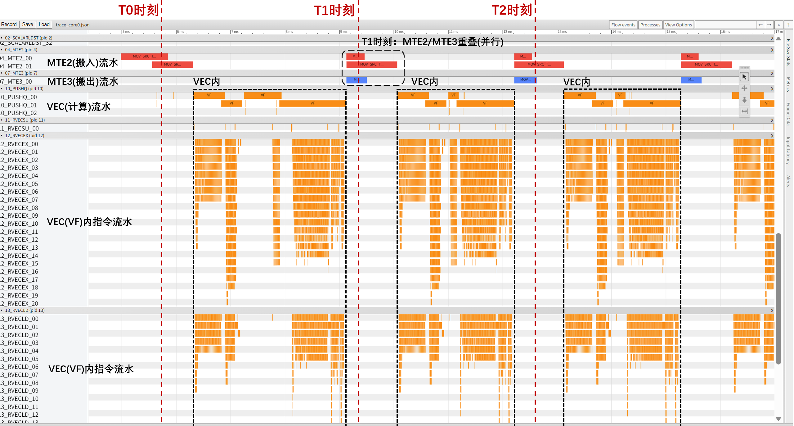
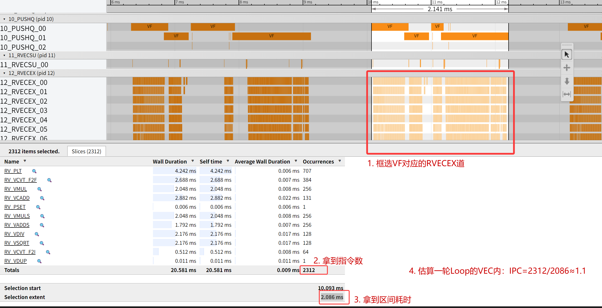
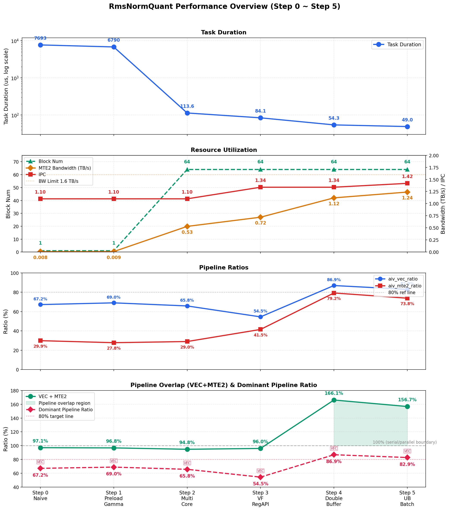

# 【cann-samples系列】RmsNormQuant：Ascend950 上的高性能 Vector 算子分阶段优化实践

[cann-samples](https://gitcode.com/cann/cann-samples) 是算子领域高性能实战演进样例与体系化调优知识库，致力于为开发者提供可复用的优化方法论和最佳实践代码。本系列文章将陆续介绍仓库中的典型样例，分享我们在算子优化过程中的思考与经验。

> **实验平台**：Ascend 950PR（64 Vector Core 仿真环境）\
> **用例规格**：`x[4096, 8192] float16 → y[4096, 8192] int8` \
> **优化结果**：7693 us → 49.0 us，总加速比 157x

---

## 概述

本文记录Vector融合算子 RmsNormQuant 在昇腾Ascend950平台上的性能优化过程。RmsNormQuant 是 LLM 推理中 RmsNorm 归一化与 Int8 量化的融合算子，通过消除中间结果的 GM 写回+读入，在访存效率上优于分离执行。优化从最基础的公式直译实现出发，逐步识别并消除每一层性能瓶颈，最终达成 157 倍的性能加速。

**读者将通过本文掌握以下内容：**

- Vector 算子的性能建模方法——如何通过 profiling 指标判断 Memory Bound、Compute Bound 与流水停顿
- 四项关键优化技术：多核并行、寄存器数据流（VF RegAPI）、Double Buffer（流水重叠）、充分利用 UB 可用空间
- 优化决策的判断逻辑——何时压缩计算链路、何时开启双缓冲、何时提升 UB 利用率
- 数值精度优化方法：二分累加（Pairwise Summation）与迭代求 rsqrt

**全文结构：**

1. **算子实现原理**：计算公式、算子特点、性能建模基础
2. **算子优化实践**：7 个递进的优化步骤（Step 0 ~ Step 6），每步包含优化目标、代码实现、profiling 数据与瓶颈分析
3. **整体收益**：全流程性能数据汇总
4. **优化策略总结**：优化节奏、瓶颈判断规则、核心技术提炼

---

## 算子实现原理

### 功能说明

- **算子功能**：对输入矩阵按行计算 RMS Normalization，乘以可学习权重 gamma，再通过量化参数映射为 int8 输出。

- **计算公式**：

$$
\text{RMS}_i = \sqrt{\frac{1}{r}\sum_{j=0}^{r-1}x_{i,j}^2 + \varepsilon}
$$

$$
\text{norm}_{i,j} = \frac{x_{i,j}}{\text{RMS}_i} \cdot \gamma_j
$$

$$
y_{i,j} = \text{clamp}\!\left(\text{round}\!\left(\text{norm}_{i,j} \cdot s + b\right),\ -128,\ 127\right)
$$

- **参数说明**：

| **变量名** | **描述** | **Dtype** | **Shape** |
|-----------|---------|-----------|-----------|
| x | 输入矩阵 | `float16` | (token_num, hidden_size) |
| gamma | 归一化权重 | `float16` | (hidden_size,) |
| scale | 量化缩放系数 | `float16` | (1,) |
| offset | 量化偏置 | `int8` | (1,) |
| y | 输出矩阵 | `int8` | (token_num, hidden_size) |
| ε | 数值稳定常数 | — | 1e-6 |

### 算子特点

1. **行间独立性**：每行的 RMS 只依赖本行数据，天然适合按行做多核并行。
2. **行内长归约**：`hidden_size=8192`，列方向不能随意切碎，ReduceSum 的中间值需保存。
3. **gamma 跨行共享**：4096 行共用同一份 gamma（16 KB）。

### 性能建模

RmsNormQuant 是纯 Vector 算子，单核内的执行流水为 **MTE2（GM→UB 搬运）→ VEC（向量计算）→ MTE3（UB→GM 搬运）**。理想情况下三条流水并行执行，整体时延的下限由最慢的流水阶段决定：

$$
T_{\text{total}} = \max(T_{\text{vec}},\ T_{\text{mte2}},\ T_{\text{mte3}}) + T_{\text{overhead}}
$$

后续优化过程围绕三个分析维度展开，每个维度对应可直接从 profiling 数据中读取的核心指标，作为性能优化的抓手。

#### 流水并行

核心指标：**`aiv_vec_ratio`、`aiv_mte2_ratio`、`aiv_mte3_ratio`**——VEC、MTE2、MTE3 三条流水各自的耗时占比。

三条流水的关系存在两种典型模式：

| **模式** | **特征** | **判断依据** |
|----------|---------|-------------|
| 串行（流水停顿） | VEC 与 MTE2 交替执行，无时间重叠 | `vec + mte2 ≈ 100%` |
| 重叠（流水并行） | VEC 与 MTE2 并行执行，同周期内均有工作量 | `vec + mte2 ≫ 100%` |

在串行模式下，占比最高的流水即为性能瓶颈：

| **Bound 类型** | **瓶颈所在** | **判断依据** |
|---------------|-------------|-------------|
| Memory Bound | GM→UB 搬运能力不足 | `aiv_mte2_ratio` 显著高于其他 |
| Compute Bound | 向量计算单元吞吐不足 | `aiv_vec_ratio` 显著高于其他 |

优化目标是推动流水从串行模式向重叠模式演进，使 `vec + mte2 ≫ 100%`——即 MTE2 搬运与 VEC 计算在同一时段并行推进，用一方的耗时掩盖另一方的耗时。

在上述三条 ratio 的基础上，定义**主导流水占比（Dominant Pipeline Ratio）** = max(`aiv_vec_ratio`, `aiv_mte2_ratio`, `aiv_mte3_ratio`)。该指标在串行模式下直接指向瓶颈类型（VEC 最高为 Compute Bound，MTE2 最高为 Memory Bound），在重叠模式下则反映单位时间内最忙碌的流水线。后续各 Step 的性能表中均列出此项，优化目标之一是在重叠模式下推动其达到 80% 以上。

#### 资源利用率

核心指标：**带宽、IPC、核数**。定位到瓶颈流水后，需进一步量化该流水对硬件资源的利用程度。

**带宽**：MTE2/MTE3 流水每秒实际完成的数据读写量（TB/s），可通过 `算子读写数据量 / 算子耗时` 估算。当前平台理论带宽上限为 1.6 TB/s。带宽偏离理论上限越远，说明搬运效率的挖掘空间越大。

**IPC（Instructions Per Cycle）**：VEC 流水每周期处理的指令数。Add、Mul 等指令支持双发射，IPC 上限为 2；ReduceSum 等指令仅支持单发射，IPC 上限为 1。整体 IPC 的理论上限取决于算子中各类指令的混合比例，需结合具体实现分析。

**核数**：参与并行计算的 Vector Core 数量。不同核之间独立并行，核数直接决定可用的计算与搬运能力。

优化目标是让各项资源利用率逼近理论上限。

#### 计算简化

核心指标：**搬运复用率、计算复用率**。该维度无法直接从 profiling 数据中观测，需结合算子公式进行分析——通过提取公因数、调整计算顺序、将重复搬运提到循环外等方式，减少冗余的搬运和计算操作。

优化目标是在不改变数学语义的前提下，降低算子整体的搬运量和计算量。

---

## 环境准备与编译运行

本文的每个优化步骤对应 `Samples/2_Performance/rms_norm_quant_story/src/` 下的一个独立源文件（`0_naive.cpp` ~ `6_binary_sum.cpp`），均可独立编译运行。

**编译：**

根据仓库 README.md 安装配置 CANN 环境后，在项目根目录编译：

```bash
cd ~/cann-samples
cmake -S . -B build -DNPU_ARCH=dav-3510
cmake --build build --target rms_norm_quant_story
```

**执行仿真：**

本文的性能数据均通过 cannsim 仿真获取。以 Step 0 为例：

```bash
mkdir -p record && cd record/
cannsim record ~/cann-samples/build/Samples/2_Performance/rms_norm_quant_story/rms_norm_quant_0_naive -s Ascend950 --gen-report
```

**分析流水：**

仿真完成后，日志目录中的 `report/trace_core0.json` 为第 0 核的指令流水记录，可通过浏览器 `chrome://tracing/` 或 [Perfetto](https://ui.perfetto.dev/) 生成流水打点图（以下检测流水图或是打点图）。后续各 Step 只需替换对应的 binary 名称即可。



以该图作为示例，可以观察：

1. 横坐表示时序，单位为us，由于是仿真流水，因此1us实际上表示vector单元的1cycle。
2. 纵坐标描述各个组件的流水泳道。有些组件具有多条子道，是因为存在同时执行中的块，为清晰绘制而错开它们。
3. MTE2、MTE3、VEC流水分别用红色、蓝色、橙色块表示。
4. PUSHQ为VEC函数(VF)的泳道，RVECEX/RVECLD/RVECST为VF内实际执行的指令，也就是PUSHQ的每块VF是同时段下RVECEX/RVECLD/RVECST所有指令的外层。



还可以使用打点图来估计每段VF的IPC情况。简单来说，框选目标VF下的RVECEX段，拿到全部指令数量，再除以统计的耗时（这里耗时的us数就是cycles数目）

> **提示**：指令级仿真开销较大、耗时较长，推荐在分析阶段使用较小的输入 shape 进行仿真指导优化，达到目标提升比后再在 NPU 上板环境实际验证。

---

## 算子优化实践

### Step 0 — Naive 基线（7693 us）

直接将数学公式逐行翻译成 AscendC 标准 API，不做任何优化，先建立可测量、可暴露瓶颈的基线。

**实现方式：**

```cpp
// src/0_naive.cpp
for (int64_t loop = 0; loop < tilingData_->a; loop++) {
    CopyInGamma();   // 每轮把gamma从GM搬入UB，以便参与计算
    CopyInX(loop);
    Compute();
    CopyOut(loop);
}
```

`Compute()` 内的每一步API调用，VEC单元会把源数据从UB加载进寄存器，执行对应的计算，把结果写回UB中对应的目的地buffer：

```cpp
Cast(gamma_fp32, gamma_fp16, r);
Cast(x_fp32, x_fp16, r);
Mul(rms_buf, x_fp32, x_fp32, r);
ReduceSum(reduce_buf, rms_buf, r);
Duplicate(rms_buf, reduce_buf, r);
Muls(rms_buf, rms_buf, r_inv, r);
Adds(rms_buf, rms_buf, epsilon, r);
Sqrt(rms_buf, rms_buf, r);
Div(x_fp32, x_fp32, rms_buf, r);
Mul(rms_buf, x_fp32, gamma_fp32, r);
Muls(rms_buf, rms_buf, scale, r);
Adds(rms_buf, rms_buf, offset, r);
Cast(y, rms_buf, CAST_RINT, r);
```

**性能数据：**

| 指标 | 值 |
|------|-----|
| **Task Duration** | **7693 us** |
| Block Num | 1 |
| MTE2带宽 | 0.008TB/s |
| IPC | 1.10 |
| `aiv_vec_ratio` | 67.2% |
| `aiv_mte2_ratio` | 29.9% |
| `aiv_mte3_ratio` | 11.7% |
| **vec+mte2** | **97.1%** |
| **主导流水占比** | **67.2% (VEC)** |


打点图上 MTE2 与 VEC 基本交替，没有重叠。每轮循环有两次 MTE2 搬运（`x` 和 `gamma`），其中 `gamma` 每次搬的是同一份数据。

**问题诊断：**

1. `VEC + MTE2 = 97.1%`，两者之和接近 100%，属于典型的串行模式，打点图中 MTE2 与 VEC 交替执行、无重叠；
2. 主导流水占比 67.2%，VEC 是当前瓶颈，属于 Compute Bound；
3. 带宽利用率极低，远未触及硬件理论带宽；
4. 仅使用 1 个 Block，63 个 Vector Core 处于空闲状态；
5. IPC 偏低，需检查向量指令的发射情况。

---

### Step 1 — Gamma 预加载（6790 us，1.13x）

**优化思路**：观察计算公式可知，gamma 对所有 token（行）共享且只读。Step 0 的实现中，gamma 在每轮循环内被重复搬运——4096 轮循环搬运的是同一份 16 KB 数据。将 gamma 搬运从循环内提到循环外，使其在算子整个生命周期内常驻 UB，即可消除这部分冗余搬运：

```cpp
// Step 0                          // Step 1
for (loop) {                       CopyInGamma();
    CopyInGamma();       →        for (loop) {
    CopyInX(loop);                    CopyInX(loop);
    Compute();                        Compute();
    CopyOut(loop);                    CopyOut(loop);
}                                  }
```

**性能数据：**

| 指标 | Step 0 | Step 1 | 变化 |
|------|--------|--------|------|
| **Task Duration** | 7693 us | **6790 us** | **-11.7%** |
| Block Num | 1 | 1 | 不变 |
| MTE2带宽 | 0.008TB/s | 0.009TB/s | 小幅提升 |
| IPC | 1.10 | 1.10 | 不变 |
| `aiv_vec_ratio` | 67.2% | 69.0% | 基本不变 |
| `aiv_mte2_ratio` | 29.9% | 27.8% | 小幅下降 |
| **VEC + MTE2** | 97.1% | 96.8% | 仍是串行 |
| **主导流水占比** | 67.2% (VEC) | **69.0% (VEC)** | VEC 仍主导 |


**优化效果：**
消除了 4095 次冗余的 MTE2 搬运，MTE2 耗时按预期下降。由于 VEC 与 MTE2 仍为串行模式，整体收益有限，但为后续优化奠定了基础。

> **延伸思考：预加载的跷跷板权衡**
> 
> 预加载并非零代价：gamma 在 UB 中常驻，占用约 49 KB（fp16 搬入缓冲 + fp32 工作缓冲），约占 UB 总量的 10%。这部分空间不再可用于容纳更多行数据，会轻微压缩每轮循环可处理的行数。
> 
> 跷跷板的另一端是收益——省去 4095 次、累计约 64 MB 的冗余 MTE2 搬运，在量级上远超空间代价。一般性地，预加载的得失取决于共享数据量与 UB 容量的比值：比值越小，空间代价越可忽略；当共享数据量逼近 UB 容量大半时，预加载会严重挤压行处理空间，导致循环次数陡增、单次搬运量不足以打满带宽，此时不预加载更为合理。本例 gamma 仅 16 KB，跷跷板明确倾向收益一侧。

---

### Step 2 — 多核并行（113.6 us，59.8x）

**优化思路**：Step 1 的 profiling 数据显示 VEC 占比最高，是当前的性能瓶颈。同时 Block 仅使用 1 个，剩余 63 个 Vector Core 空闲。利用行间独立性，将 4096 行均匀分配到 64 个 Block 上并行执行。

按行将 4096 行均匀分给 64 个 Vector Core，每核处理 64 行：

```cpp
// src/2_multi_core.cpp — Init()
blockIdx_ = AscendC::GetBlockIdx();
if (blockIdx_ == AscendC::GetBlockNum() - 1) {
    curblockFactor_ = tilingData_->blockTail;
} else {
    curblockFactor_ = tilingData_->blockFactor;
}
xGm_.SetGlobalBuffer(x + blockIdx_ * tilingData_->blockFactor * r);
yGm_.SetGlobalBuffer(y + blockIdx_ * tilingData_->blockFactor * r);
```

Host 代码通过 `<<<blockNum, 0, stream>>>` 启动 64 个核。

**性能数据：**

| 指标 | Step 1 | Step 2 | 变化 |
|------|--------|--------|------|
| **Task Duration** | 6790 us | **113.6 us** | **-98.3%** |
| Block Num | 1 | **64** | — |
| MTE2带宽 | 0.009TB/s | 0.53TB/s | 大幅上升 |
| IPC | 1.10 | 1.10 | 不变 |
| `aiv_vec_ratio` | 69.0% | 65.8% | 基本不变 |
| `aiv_mte2_ratio` | 27.8% | 29.0% | 基本不变 |
| **VEC + MTE2** | 96.8% | 94.8% | 核内仍以串行为主 |
| **主导流水占比** | 69.0% (VEC) | **65.8% (VEC)** | VEC 小幅下降 |

并行效率：实际加速比为 `6790 / 113.6 = 59.8x`，全核心利用率为 `59.8 / 64 = 93.4%`，接近理想线性加速。各流水 ratio 基本不变，说明收益完全来自并行度提升，单核实现未变。


**优化效果：** 
1. 单 Block 的 VEC 计算速度不变，通过 64 个 Block 并行处理实现整体性能提升；
2. 由原本的单 Block 搬运改为 64 个 Block 并行搬运，带宽利用率相应提升，但仍距理论上限有一定空间。

---

### Step 3 — 寄存器数据流（VF RegAPI，84.1 us，1.35x）

**优化思路**：Step 2 的 profiling 数据显示，在 64 核满并行的情况下 VEC 占比仍然最高，说明单核 VEC 计算效率是进一步优化的关键。此时 IPC 仅为 1.10，指令级并行度不足，本轮优化的目标是 **提升 IPC 指标**。

标准 AscendC API 的抽象级别是"UB 到 UB"，每个操作默认将结果写回 UB：

```
UB → 寄存器 → 计算 → 寄存器 → UB → 寄存器 → 计算 → 寄存器 → UB → ...
```

VF RegAPI（`__simd_vf__`）允许直接操作向量寄存器（`RegTensor`），使中间值在寄存器上流动，从而减少大量UB和寄存器间的数据搬运：

```
UB → 寄存器 → 计算 → 寄存器 → 计算 → 寄存器 → UB → ...
```

```cpp
// src/3_vf.cpp — ComputeRmsVf()
AscendC::RegAPI::Duplicate(vregReduceSum, 0);
for (uint16_t i = 0; i < vfLoopRNum_; i++) {  // r=8192 → 128 次循环
    preg = AscendC::RegAPI::UpdateMask<float>(r);
    DataCopy<DATA_TYPE, DIST_UNPACK_B16>(vregXIn, xInAddr + i * VL_B32_SIZE);
    Cast<float, DATA_TYPE>(vregX, vregXIn, preg);    // 寄存器内 fp16→fp32
    Mul(vregXQuared, vregX, vregX, preg);            // 寄存器内平方
    Add(vregReduceSum, vregReduceSum, vregXQuared, pregAll);  // 寄存器内累加
}
ReduceSum(vregReduceSum, vregReduceSum, preg);
Sqrt(vregRms, vregReduceSum, preg);
DataCopy<float, DIST_FIRST_ELEMENT_B32>(rmsAddr, vregRms, preg);  // 只写一个标量
```

128 次循环中 `vregReduceSum` 始终在寄存器上累加，仅在最终才写回 UB。`ComputeNormQuantVf` 同理，归一化+量化全在寄存器上完成。

**性能数据：**

| 指标 | Step 2 | Step 3 | 变化 |
|------|--------|--------|------|
| **Task Duration** | 113.6 us | **84.1 us** | **-26.0%** |
| MTE2带宽 | 0.53TB/s | 0.72TB/s | 小幅上升 |
| IPC | 1.10 | 1.34 | 上升 |
| `aiv_vec_ratio` | 65.8% | 54.5% | 下降 |
| `aiv_mte2_ratio` | 29.0% | **41.5%** | 上升 |
| **VEC + MTE2** | 94.8% | 96.0% | 仍基本串行 |
| **主导流水占比** | 65.8% (VEC) | **54.5% (VEC)** | VEC 显著下降，逼近 MTE2 |


**优化效果：**
1. IPC 从 1.10 提升至 1.34，单 Block 的 VEC 计算吞吐提升，端到端耗时相应下降；
2. VEC 计算速度提升后，MTE2 搬运变得更密集，带宽利用率随之上升。`aiv_mte2_ratio` 的上升是 VEC 占比下降后的被动效应，并非 MTE2 绝对耗时增加；
3. 主导流水占比从 65.8% 降至 54.5%，VEC 与 MTE2 比例趋近 1:1，这是开启 Double Buffer 的最佳时机。

---

### Step 4 — Double Buffer（54.3 us，1.55x）

**优化思路**：Step 3 的 profiling 数据显示，VEC 处理速度已有明显提升，但 `VEC + MTE2 = 96.0%`，Block 内 MTE2 与 VEC 仍为串行执行。下一步的目标是通过流水线重叠，使 MTE2 搬运与 VEC 计算并行执行。

代码仅修改缓冲区数量：

```cpp
// src/3_vf.cpp               // src/4_double_buffer.cpp
static constexpr size_t       static constexpr size_t
    BUF_NUM = 1;      →           BUF_NUM = 2;
```

`BUF_NUM = 1` 时搬一批、算一批、再搬下一批（串行）；`BUF_NUM = 2` 时当前 batch 在算，下一 batch 已开始搬（重叠）。AscendC的资源管理API（`TQue`）通过抽象队列（EnQue、DeQue等操作）自动管理这样的ping-pong调度。

**性能数据：**

| 指标 | Step 3 | Step 4 | 变化 |
|------|--------|--------|------|
| **Task Duration** | 84.1 us | **54.3 us** | **-35.4%** |
| MTE2带宽 | 0.72TB/s | 1.12TB/s | 小幅上升 |
| IPC | 1.34 | 1.34 | 不变 |
| `aiv_vec_ratio` | 54.5% | **86.9%** | 上升 |
| `aiv_mte2_ratio` | 41.5% | **79.2%** | 上升 |
| `aiv_mte3_ratio` | 17.5% | 28.0% | 上升 |
| **VEC + MTE2** | 96.0% | **166.1%** | **显著重叠** |
| **主导流水占比** | 54.5% (VEC) | **86.9% (VEC)** | 首次突破 80% |


**优化效果：**
1. `VEC + MTE2 = 166.1%`，MTE2 与 VEC 两条流水线发生显著重叠，Block 内从串行模式转为并行模式；
2. 主导流水占比从 54.5% 跃升至 86.9%，首次突破 80%——在重叠模式下，MTE2 搬运与 VEC 计算同时饱和运行，两条流水各自的时间占比均大幅上升；
3. MTE2 搬运不再受 VEC 计算周期的阻塞，搬运频次增加，带宽利用率进一步提升。

---

### Step 5 — UB 多行批处理（49.0 us，1.11x）

**优化思路**：Step 4 已实现 MTE2 与 VEC 的流水重叠，但带宽（1.12 TB/s）和 IPC（1.34）距理论上限仍有差距。Step 4 中 `ubFactor = 1`，每轮循环仅处理 1 行，单核需循环 64 次，循环开销（指令发射、队列调度）在总耗时中占比较高。提升每轮循环处理的数据量，可以摊薄固定开销，同时提高带宽和 IPC 的利用率。

#### UB 空间建模

**ubFactor 的含义**：`ubFactor` 是一次 UB 循环中处理的行数。Step 4 中 `ubFactor = 1`，每轮只搬入 1 行到 UB 计算，单核需循环 64 次。Step 5 的目标是求解 UB 空间允许的最大 `ubFactor`，使每轮处理尽可能多的行，从而减少循环次数。

UB 的总空间消耗由两部分组成：

$$
\text{UB}_{\text{total}} = \text{fixedSize} + \text{ubFactor} \times \text{linearCoef}
$$

- **固定部分（fixedSize）**：gamma 的 fp16 搬入缓冲和 fp32 常驻缓冲，大小与 `ubFactor` 无关。
- **行数据部分（linearCoef × ubFactor）**：每行所需的输入、输出和中间结果空间，随 `ubFactor` 线性增长。由于开启了双缓冲（`BUF_NUM = 2`），输入和输出缓冲各需要两份交替使用。

各缓冲区的空间需求：

| 缓冲区 | 大小 | 说明 |
|--------|------|------|
| `gammaInQueue_` | `rAlign × 2B` | gamma fp16 搬入缓冲（固定） |
| `gammaBuf_` | `rAlign × 4B` | gamma 转 float32 常驻 UB（固定） |
| `xInQueue_` | `rAlign × 2B × 2 × ubFactor` | 每行输入 float16，双缓冲 |
| `yOutQueue_` | `rAlign × 1B × 2 × ubFactor` | 每行输出 int8，双缓冲 |
| `rmsBuf_` | `4B × ubFactor` | 每行一个 float32 RMS 标量 |

其中 `rAlign = 8192` 为行方向对齐后的元素数，`× 2` 来自 `BUF_NUM = 2`（双缓冲）。

对应代码（`src/5_ub_utilization.cpp:438-442`）：

```cpp
int64_t fixedSize = rAlign * (sizeof(half) + sizeof(float)) + BLOCK_BYTES;
//                 = 8192 × 6 + 32 = 49,184 B
int64_t linearCoef = rAlign * (sizeof(half)*2 + sizeof(int8_t)*2) + sizeof(float);
//                  = 8192 × 6 + 4 = 49,156 B
int64_t maxUbFactor = (ubSize - fixedSize) / linearCoef;  // ≈ 10
```

#### 三层循环结构

优化后形成三层循环分工：

```
核间并行: blockIdx (64核 × 64行/核 = 4096行)
  └─ UB 循环: ⌈64/10⌉ = 7 次（最后一次处理 4 行）
       └─ 行内循环: ⌈8192/64⌉ = 128 次（VF 向量段）
```

关键机制：`DataCopyExtParams.blockCount = ubFactor` 使 MTE2 一次 DMA 传输合并搬运 `ubFactor` 行，而非发起 `ubFactor` 次独立 DMA 请求。

**性能数据：**

| 指标 | Step 4 | Step 5 | 变化 |
|------|--------|--------|------|
| **Task Duration** | 54.3 us | **49.0 us** | **-9.8%** |
| MTE2带宽 | 1.12TB/s | 1.24TB/s | 小幅上升 |
| IPC | 1.34 | 1.42 | 小幅上升 |
| `aiv_vec_ratio` | 86.9% | 82.9% | 小幅下降 |
| `aiv_mte2_ratio` | 79.2% | 73.8% | 小幅下降 |
| `aiv_mte3_ratio` | 28.0% | 10.5% | -62.5% |
| **VEC + MTE2** | 166.1% | 156.7% | 仍保持高重叠 |
| **主导流水占比** | 86.9% (VEC) | **82.9% (VEC)** | 仍维持在 80% 以上 |


**优化效果：**
1. 循环从 64 次降到 7 次，每次处理的数据量更多，带宽与IPC均得到小幅的提升；
2. 主导流水占比 82.9%，仍维持在 80% 以上，但较 Step 4 略有下降——Scalar 调度占比的降低使得 VEC 和 MTE2 的 ratio 被动下降，并非效率退化。

**49.0 us 为性能最优点。** 累计加速 157 倍。

至此，我们的5步性能优化就全部完成了，汇总数据变化如下：


可以看出，各项性能指标（带宽、IPC、流水重叠度、主导流水占比）的提升与端到端耗时下降呈正相关，这些指标可作为性能优化过程中的有效抓手。

---

### Step 6 — 二分累加 + 迭代求 rsqrt（49.5 us，该步骤为精度提升）

**优化目标**：在性能基本不退的前提下提高数值精度。

Step 3~5 中，行内平方和通过 float32 寄存器上的 128 次 `Add(vregReduceSum, vregReduceSum, vregXQuared)` 完成，构成典型的线性累加（sequential summation）。float32 的机器精度 $\varepsilon \approx 1.2 \times 10^{-7}$（$2^{-23}$），线性累加的浮点相对误差界为 $O(n \cdot \varepsilon)$——对于 $n=8192$，误差上界约 $10^{-3}$。这意味着 RMS 值在千分之一量级上存在偏差，在量化边界附近可能导致输出偏移 1 个 quant level，大规模推理中逐层累积。误差根源在于浮点加法不可结合：$(a \oplus b) \oplus c \neq a \oplus (b \oplus c)$，线性累加每一步的舍入误差都被后续操作放大。

**二分累加。** 核心思想是缩短累加链深度。将长度为 $n$ 的向量递归分成两半分别求和再合并：

$$
\text{Sum}(x_0, \ldots, x_{n-1}) = \text{Sum}(x_0, \ldots, x_{n/2-1}) + \text{Sum}(x_{n/2}, \ldots, x_{n-1})
$$

理想的全递归二分累加可将误差界从 $O(n\varepsilon)$ 降至 $O(\log n \cdot \varepsilon)$。本例将一行 8192 个元素从折叠点 `binaryAddPoint` 处拆分为前后两段（`r=8192` 时取 4096），经两阶段 ReduceSum 归约——虽非完全递归树，但累加链深度已从 $O(n)$ 量级大为缩短。


前后段的数据加载、平方、相加之间没有值依赖，编译器/硬件可以将这些无依赖指令在同一周期内双发射。经 `LocalMemBar` 同步后，第二阶段对这 64 个标量做最终 `ReduceSum`。关键代码片段：

```cpp
// src/6_binary_sum.cpp — ComputeSquareReduceSum<true>()
// 前段: x[0..4095], 后段: x[4096..8191]
DataCopy<DATA_TYPE>(vregXIn1, xInAddr + loopA*rAlign_ + i*VL_B32_SIZE);
Cast<float>(vregX1, vregXIn1, pregAll);
DataCopy<DATA_TYPE>(vregXIn2,
    xInAddr + loopA*rAlign_ + binaryAddPoint + i*VL_B32_SIZE);
Cast<float>(vregX2, vregXIn2, preg);

Mul(vregXQuared1, vregX1, vregX1, pregAll);    // 前段平方
Mul(vregXQuared2, vregX2, vregX2, preg);       // 后段平方
Add(vregReduceSum, vregXQuared1, vregXQuared2, pregAll);  // pairwise 相加
ReduceSum(vregReduceSum, vregReduceSum, pregAll);          // 归约为一标量
```

代价是 `rmsBuf_` 从 `ubFactor × 4B` 增至 `ubFactor × 256B`，`ubFactor` 从 10 降至 9，UB 循环从 7 次变为 8 次，影响极小。

**迭代求 rsqrt。** 归一化需计算 $\text{rstd} = 1/\sqrt{\text{var}}$。Step 3~5 使用的指令链为：

```cpp
// Step 3~5: 硬件 Div + Sqrt
Sqrt(vregRms, vregReduceSum, preg);   // rms = √var
// ... ComputeNormQuantVf 中：
Div(vregNorm, vregX, vregRms, preg);  // norm = x / rms
```

Step 6 以硬件 `Div` + `Sqrt` 获得初始估计 $y_0 = \sqrt{1/\text{var}}$，再用乘加链迭代提高精度，以两轮 Newton-Raphson 替代直接使用硬件 `Div`/`Sqrt` 的结果。

**初始估计：**

```cpp
Div(r, one, var, pregLoop);     // r = 1/var
Sqrt(y, r, pregLoop);           // y₀ = √(1/var) = rsqrt(var)
```

**第一轮（Newton-Raphson）：**

$$
y_1 = y_0 \cdot \left(\frac{3}{2} - \frac{\text{var}}{2} \cdot y_0^2\right)
$$

```cpp
Muls(t, var, float(-0.5), pregLoop);  // t = -0.5 * var
Mul(t, t, y, pregLoop);               // t = -0.5 * var * y₀
Mula(t1, t, y, pregLoop);             // t1 = 1.5 + t * y₀
Mul(rstd, y, t1, pregLoop);           // rstd = y₀ * (1.5 - 0.5 * var * y₀²)
```

`Mula(dst, src1, src2)` = `dst += src1 * src2`，实现乘加融合。

**第二轮（残差形式 Newton 修正）：** 令 $e = 1 - \text{var} \cdot y_1^2$，修正步为 $y_2 = y_1 \cdot \left(1 + \frac{e}{2}\right)$——该形式与 Newton-Raphson 公式代数等价，但更便于在寄存器上直接操作。

```cpp
Muls(t3, var, float(-1.0), pregLoop);   // t3 = -var
Mula(s, t3, r, pregLoop);               // 残差中间项
Muls(t4, rstd, float(-1.0), pregLoop);  // t4 = -rstd
Mula(r, t4, rstd, pregLoop);            // r = (1/var) - rstd²
Mula(s, var, r, pregLoop);              // s = e（残差）
Mul(s, s, rstd, pregLoop);              // s = e * rstd
Mula(rstd, s, scalar1, pregLoop);       // rstd += e * rstd * 0.5
```

两轮迭代共约 10 条 `Muls`/`Mul`/`Mula` 指令。相比硬件 `Div` 和 `Sqrt`（延迟通常 10+ cycle），这些指令延迟低且可双发射，在向量流水线中能被有效掩盖。同时 `ComputeNormQuantVf` 同步改为：

```cpp
// Step 6: Div 替换为 Mul
Mul(vregNorm, vregX, vregRms, preg);  // norm = x * rstd = x / rms
```

迭代结果 `rstd`（代码中复用 `vregRms` 变量名存储）已是 $1/\text{rms}$ 的逼近值，`Div` 被 `Mul` 取代。

**性能数据：**

| 指标 | Step 5 | Step 6 |
|------|--------|--------|
| **Task Duration** | **49.0 us** | 49.5 us |
| 累计加速比 | 157.0x | 155.4x |

时延增加 0.5 us（~1%），在测量误差范围内。二分累加压低了累加误差，迭代求 rsqrt 消除了对硬件 Div/Sqrt 舍入误差的依赖。

下图展示了二分累加实现中，前后段的无依赖指令在同一 VF 内双发射执行（图中圈出的 `RV_VADD` 与 `RV_VCADD` 两条向量指令在同一时刻并行执行），这也是能维持较高 IPC 值，从而性能相比前一个 step 不劣化的主要原因。


---

## 整体收益

| Step | 核心动作 | Duration (us) | 步骤加速 | 累计加速 |
|------|----------|:-------------:|:--------:|:--------:|
| 0 | Naive 基线 | 7693 | — | 1.0x |
| 1 | Gamma 预加载 | 6790 | 1.13x | 1.13x |
| 2 | 多核并行 | 113.6 | **59.8x** | **67.7x** |
| 3 | 寄存器数据流 | 84.1 | 1.35x | 91.5x |
| 4 | Double Buffer | 54.3 | 1.55x | 141.7x |
| 5 | UB 多行批处理 | **49.0** | 1.11x | **157.0x** |
| 6 | 二分累加 | 49.5 | ≈1.0x | 155.4x |

---

## 优化策略总结

### 优化节奏

七步优化的先后顺序遵循一个核心原则：**先定位瓶颈，再对症施策**。具体分为三个阶段：

**阶段一：低投入、高回报的基础优化（Step 1~2）**

代码改动量小，收益可直接预期。Step 1 将只读数据提到循环外，Step 2 开启多核并行——这两步不需要深入硬件细节，却贡献了最大的加速比（67.7x）。

**阶段二：依赖硬件理解的深度优化（Step 3~5）**

这一阶段的前提是基础优化已将瓶颈从"资源闲置"收窄到"单核效率"。Step 3 通过寄存器数据流压缩 VEC 链路，为 Step 4 的流水重叠创造了比例条件；Step 4 在 VEC/MTE2 比例接近 1:1 后开启 Double Buffer，拿到阶段内最大的 1.55x 加速；Step 5 进一步挖掘 UB 空间利用率，摊薄循环固定开销。三步形成"压缩→重叠→摊薄"的递进链路。

**阶段三：精度改进（Step 6）**

在性能达到瓶颈后，转向数值质量优化。二分累加 + 迭代求 rsqrt 在不退性能的前提下改善了浮点累加精度和除法舍入质量。

### 瓶颈判断规则

Step 2→3→4 的过渡中存在一个关键判断点：何时开启 Double Buffer。可总结为以下递进规则：

> **主导流水占比 > 65%，且为 VEC** → VEC 是瓶颈，压缩计算链路（如改用 RegAPI）；
> **主导流水占比降至 55% 以下，VEC ≈ MTE2** → 两者接近，开 Double Buffer 实现流水重叠；
> **主导流水占比突破 80%，`vec + mte2 ≫ 100%`** → 流水已充分重叠，转而减少固定开销（如提高 UB 利用率）。

其中主导流水占比是辅助判断的核心量化指标：它在串行模式下指示瓶颈归属，在重叠模式下（≥ 80%）则标志流水线已达到高效区间。过早开启 Double Buffer 效果有限——VEC 占比远高于 MTE2 时，MTE2 在 VEC 计算期间大部分时间处于等待，重叠收益甚微。Step 3 先通过 VF 优化将主导流水占比从 65.8% 压至 54.5%，VEC 与 MTE2 比例接近 1:1，此时双缓冲的重叠效率才达到最高。

### 核心技术

**1. 寄存器级数据流（VF RegAPI）**

标准 API 的抽象级别是 UB 到 UB，每个操作触发一次 UB 读和一次 UB 写。VF RegAPI 打破这一抽象，开发者直接控制向量寄存器，中间值在整个循环体内始终驻留寄存器，仅在循环结束后写回 UB 一次。这一替换减少了大量 UB↔寄存器间的冗余搬运，效果直接体现在 IPC 的提升上。

**2. 流水线重叠的时机选择**

Double Buffer 的收益取决于两条流水段的工作量是否匹配。Step 3 先压缩 VEC 使两者比例趋近 1:1，Step 4 再开双缓冲拿到 1.55x 加速。**先压缩后重叠**——而非直接重叠——是这个判断的核心。这一规则可推广到其他 Vector 算子：当 VEC 占比远高于 MTE2 时，应优先优化 VEC 链路，待比例接近后再开启流水重叠。

**3. UB 空间建模**

UB 利用率优化需要区分固定开销（如 gamma 缓冲区，大小与 `ubFactor` 无关）和线性开销（如 x/y/rms 缓冲区，大小随 `ubFactor` 线性增长），据此建立 UB 空间方程：

$$
\text{UB}_{\text{total}} = \text{fixedSize} + \text{ubFactor} \times \text{linearCoef}
$$

`calcMaxUbFactor` 函数的本质是在给定 UB 总量下求解最大行容量。这一建模方式可直接套用到其他 Vector 算子——只需根据算子的实际缓冲区需求重新计算 `fixedSize` 和 `linearCoef`。

---

## 参考

rms_norm_quant 性能优化指南与源代码：[`cann-samples/Samples/2_Performance/rms_norm_quant_story`](https://gitcode.com/cann/cann-samples/tree/master/Samples/2_Performance/rms_norm_quant_story)。
`README.md` 描述了 step by step 的性能优化指南，`src/` 目录下每个 Step 对应一个独立文件（`0_naive.cpp` ~ `6_binary_sum.cpp`），均可编译运行。