# Scalar如何影响昇腾NPU算子性能：原理与优化实践

---

## 摘要

Scalar单元是昇腾NPU AI Core中的标量运算流水线，负责指令分发与地址计算。当Scalar成为性能瓶颈（即ScalarBound）时，会阻塞Cube/Vector/MTE等其他流水线，导致算子性能大幅下降。本文基于**Ascend 950平台上**的实测用例的统计分析，发现Cube类和Mix类算子中ScalarBound问题最为突出（占比超过97%）。根因分析表明，**Load/Store指令过多（占比普遍超过30%）** 是ScalarBound的主因，其根源在于编译器的寄存器spill。

针对FusedInferAttentionScore和QuantBatchMatmul两个典型算子，本文详细阐述了四类优化手段：（1）icache预取；（2）静态创建LocalTensor；（3）局部变量替代成员变量；（4）消除多级指针解引用。优化后Scalar耗时分别平均降低**33%**和**50%**，端到端性能平均提升**15%**和**10%**。最后，本文总结出7条Scalar高性能算子编码原则，并提供了一套可落地的ScalarBound诊断流程。

---

## 1. 昇腾AI Core架构

### 1.1 AI Core架构概览

昇腾NPU的AI Core是其计算核心单元，内部包含多条并行流水线，协同完成深度学习算子的计算任务。其核心流水线包括：

- **Cube Engine（矩阵计算引擎）**：执行矩阵乘加（MMAD）运算，是Matmul/Conv/FlashAttention等算子的核心计算单元。
- **Vector Engine（向量计算引擎）**：执行向量运算，如element-wise操作、规约（Reduce）等。
- **MTE（Memory Transfer Engine）**：负责不同存储层级间的数据搬运，分为：
  - **MTE1**：L1 -> L0
  - **MTE2**：外部存储（GM/DDR） -> L1/UB
  - **MTE3**：L1/UB -> 外部存储
- **Scalar Unit（标量运算单元）**：即本文的主角，负责标量计算、地址计算、指令参数构造，以及**为其他流水线分发指令**。
- **FixPipe**：L0C -> 外部存储/UB，以及数据格式转换和后处理。

各流水线通过**Issue队列**接收指令，多条流水线可以并行执行。

---

## 2. Scalar单元简介

Scalar单元（Scalar Unit）是AI Core中的标量运算流水线，负责算子中的标量计算，包括：访存地址的计算，以及构造Vector/Cube/MTE等单元的指令参数。

此外，Scalar还承担**指令分发**的职责。如下图所示，Scalar会根据指令类型将指令分发到不同流水线的Issue队列中。例如：`CopyGmToUbuf`指令会分发到MTE2单元的Issue队列；`MMAD`指令会分发到Cube单元的Issue队列。

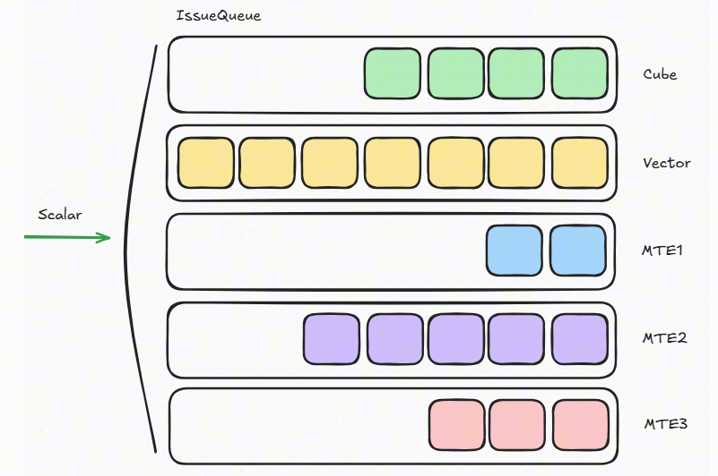

> 由于Scalar承担着指令分发的"中枢"角色，它的性能直接影响所有其他流水线能否满负荷运行。
>
> 如果某个流水线的issue队列满载（如上图所示的Vector单元），会反压导致Scalar无法继续前进。

---

## 3. ScalarBound对性能的影响

### 3.1 ScalarBound的定义

如上文所述，Scalar单元为其他流水线分发指令。理想情况下，Scalar应能及时将指令分发到各流水线的Issue队列中，使所有流水线保持满载并行。

**当Scalar单元本身成为瓶颈，无法及时为其他流水线分发指令，导致流水线产生bubble（空闲周期）时，这种现象称为ScalarBound。**

### 3.2 ScalarBound对算子性能的影响

ScalarBound对性能的影响主要体现在两个层面：

**影响一：导致流水中断，破坏指令并行性。** 以下Conv2D算子的例子中，MTE2和MTE1的间隔超过1000个cycle，流水线出现明显空泡，指令级并行严重受损：

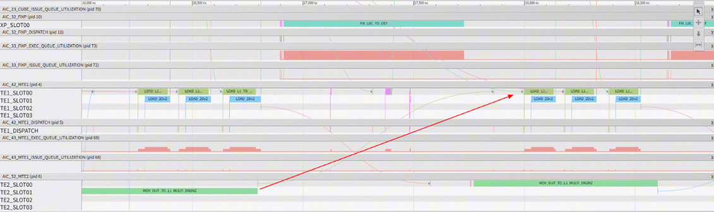

**影响二：Scalar本身的高耗时直接拖慢算子总耗时。** 即使暂不考虑对其他流水线的中断影响，Scalar自身的执行耗时也是不可忽视的开销。下图展示了一个BatchMatmul算子各流水线的耗时分布，其中Scalar耗时为18155个cycle，远超其他流水线：

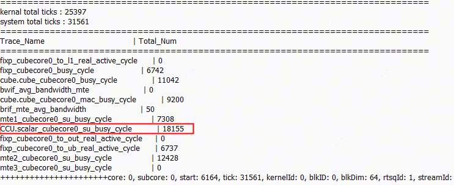

---

## 4. ScalarBound算子现状分析

### 4.1 实验环境

| 项目 | 说明 |
|------|------|
| 芯片平台 | Ascend 950 |
| CANN版本 | 9.0（具体版本随发布更新） |
| Profiling工具 | msprof+cannsim |
| 用例总规模 | 约8000+个用例（含不同shape/精度组合） |

> **说明**：本文所有性能数据均基于上述特定环境采集。不同芯片型号或不同CANN版本下，具体数值可能存在差异，但优化趋势和结论具有通用性。

### 4.2 ScalarBound算子统计

我们统计了测试集中每个算子用例各流水线的耗时（含Scalar），筛选标准为：
1. 算子端到端总耗时 > 10us（排除过小用例的噪声）
2. Scalar耗时占算子总耗时的比例排名最高

经人工逐一确认是否确实存在ScalarBound后，最终分布如下：

| Op Name | Count | 类型分类 |
|---------|-------|---------|
| conv2dv2 | 160 | Conv |
| mat_mul_v3 | 152 | Matmul |
| conv3d_backprop_input_v2 | 142 | Conv |
| quant_batch_matmul_v3 | 127 | Matmul(量化) |
| conv3d_backprop_filter_v2 | 122 | Conv |
| fused_infer_attention_score | 96 | Mix(FlashAttention) |
| batch_mat_mul_v3 | 70 | Matmul |
| weight_quant_batch_matmul_v2 | 52 | Matmul(量化) |
| quant_batch_matmul_v4 | 39 | Matmul(量化) |
| conv2d_backprop_filter_v3 | 33 | Conv |
| conv3dv2 | 25 | Conv |
| extend_conv2d | 20 | Conv |
| flash_attention_score | 18 | Mix(FlashAttention) |
| conv2d_backprop_input_v2 | 16 | Conv |
| conv3d_transpose_v2 | 14 | Conv |
| flash_attention_score_grad | 10 | Mix(FlashAttention) |
| split_v | 9 | Vector |

> **Count**：该算子在测试集中出现ScalarBound的用例数量（不同shape/配置计为不同用例）

**关键发现**：FlashAttention + Matmul + Conv类用例共**1098**个，占ScalarBound总用例数（1125个）的**97.6%**。Vector类算子仅占不到3%。

**结论**：**Cube类算子（Matmul/Conv）和Mix类算子（FlashAttention）是ScalarBound的重灾区，应作为优化重点。** Vector类算子ScalarBound问题相对不突出（但不代表不存在，本文暂不深入分析Vector场景）。

### 4.3 ScalarBound原因分析

ScalarBound主要有以下三种产生原因：

| 原因 | 描述 | 是否属于Scalar自身问题 |
|------|------|----------------------|
| **Load依赖阻塞** | Scalar计算依赖Load指令的执行结果（如从栈上加载数据），Load未完成时Scalar无法推进 | 是 |
| **计算指令过多** | Scalar计算指令数量过多，分发速度跟不上其他流水线的消费速度 | 是 |
| **反压阻塞** | 某个或多个Issue队列已满，反向阻塞Scalar无法继续分发 | 一般不是（属于其他流水线的瓶颈） |

从Cube/Mix算子的实际分析结果来看，**Load/Store指令数占比普遍超过30%**，指令间的RAW（Read After Write）数据依赖是Scalar流水线stall的主要原因，其中大部分stall来自对Load指令结果的等待。

> **核心结论：消除算子ScalarBound的关键不在于减少Scalar计算指令的数量，而在于如何有效减少Load/Store指令的数量。**

### 4.4 Load/Store产生原因

编译器会尽量使用寄存器保存变量，但硬件寄存器的个数是有限的。当活跃变量数超过可用寄存器个数时，编译器必须选择一个寄存器，将其当前值通过Store指令保存到栈内存上，这个过程称为**寄存器Spill（Register Spill）**。等到需要再次使用该变量时，编译器再通过Load指令从栈内存读回寄存器。

> 栈内存位于Global Memory，如果dcache miss，Load完成需要几百cycle。

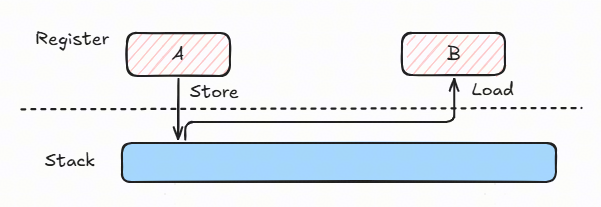

寄存器Spill过程对程序员不可见，因此在算子开发中容易被忽略。然而，**算子的编码方式会显著影响编译器的寄存器分配决策**，进而影响Spill的频率和Load/Store指令的总量。以下编码模式容易加剧寄存器Spill：

- 类成员变量过多（每个成员需通过`this`指针+偏移访问，增加寄存器压力）
- 结构体变量的拷贝（触发大量字段的逐个Load/Store）
- 变量生命周期过长（占用寄存器时间长，挤压其他变量的寄存器空间）
- 多级指针解引用（每一级解引用都引入Load依赖链）

下图展示了一个结构体拷贝过程引入的大量Load/Store指令：

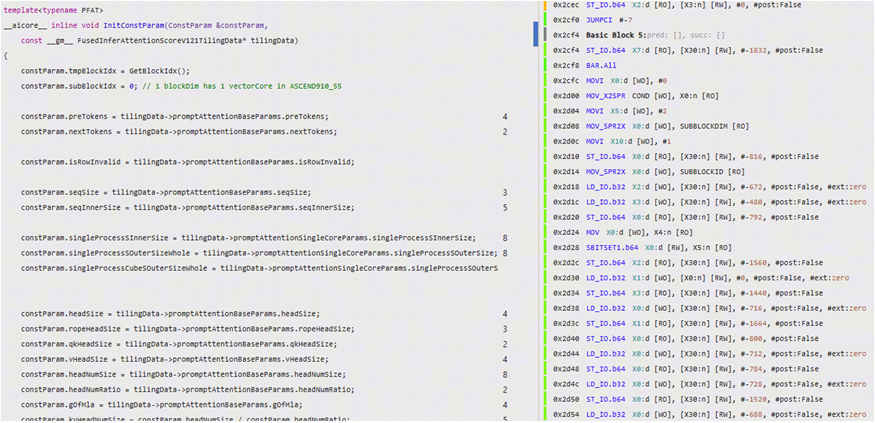

---

## 5. 算子Scalar优化实践

基于FusedInferAttentionScore和QuantBatchMatmul两个典型算子，结合对Scalar性能瓶颈的根因分析，本节详细阐述针对性的优化手段及其效果。

> **选择依据**：这两个算子分别代表了Mix类（FlashAttention，涉及Cube+Vector+MTE协同）和Cube量化类（QuantBatchMatmul，指令密集型）的典型场景，且ScalarBound优化空间较大。

### 5.1 FusedInferAttentionScore

#### 5.1.1 优化手段

##### 手段一：icache预取消除icache miss

**原理**：分析算子执行时PC（Program Counter）地址随cycle的变化，可识别icache miss的位置。当Scalar需要从I-Cache加载指令但缓存未命中时，会产生数十到数百cycle的等待。

**诊断方法**：绘制"PC地址 vs Cycle"折线图。图中出现的水平红线段表示icache miss（PC地址不变，说明在等待指令加载），红线越长表示等待时间越久：

**优化前**（存在icache miss）：

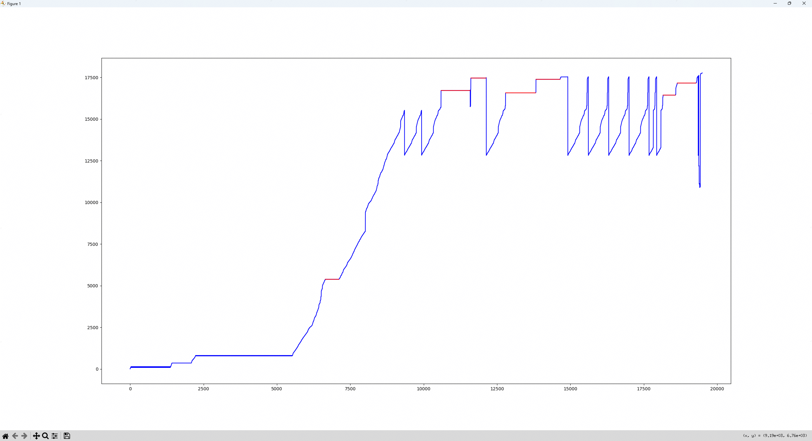

**优化方法**：在代码中关键位置插入icache预取指令（通过AscendC内置预取API），提前将要执行的指令加载到I-Cache中。

**适用条件**：代码体量较大（如超过I-Cache容量），且存在循环体中调用大函数的场景。

**优化后**（icache miss完全消除）：

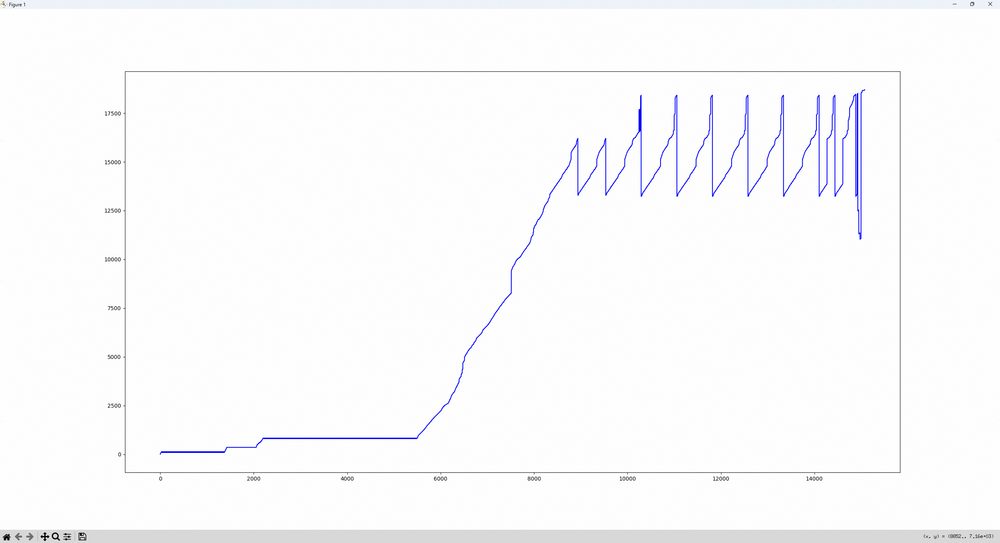

> **注意**：icache预取的位置和预取量需要根据实际代码布局调优。预取过早会浪费带宽，预取过晚则无法消除miss。一般建议在循环入口或函数调用前1-2个基本块处预取。

##### 手段二：静态创建LocalTensor

**原理**：`TPipe::InitBuffer`是AscendC的通用buffer管理框架，支持动态分配、状态追踪和队列调度。但在FlashAttention这类buffer数量固定、地址布局已知的场景下，这些通用能力带来的Scalar开销（内部含条件判断、队列操作等）是不必要的浪费。

**适用条件**：buffer布局在编译期完全确定（数量、大小、偏移均已知），无动态分配需求。

**优化前**，buffer通过`TBuf`和`TQue`动态分配：

```c++
for (int32_t i = 0; i < L1KVNumSacler; ++i) {
    pipe->InitBuffer(tmpBufL1KV[i], KV_L1_SIZE);
    L1KVTensorPingPong[i] = tmpBufL1KV[i].template Get<T>();
}

pipe->InitBuffer(tmpBufL1Q, Q_L1_SIZE);
L1QTensorPingPong = tmpBufL1Q.template Get<T>();

pipe->InitBuffer(tmpBufL1KRope, K_ROPE_SIZE);
L1KRopeTensor = tmpBufL1KRope.template Get<T>();
```

**优化后**，`LocalTensor`通过常量直接静态创建，类型（`TPosition`）与地址偏移均手动指定：

```c++
L1KVTensorPingPong0 = LocalTensor<T>(TPosition::B1, (Q_L1_SIZE + 2 * P_L1_SIZE) * 2, KV_L1_SIZE);
L1KVTensorPingPong1 = LocalTensor<T>(TPosition::B1, (Q_L1_SIZE + 2 * P_L1_SIZE + KV_L1_SIZE) * 2, KV_L1_SIZE);
L1KVTensorPingPong2 = LocalTensor<T>(TPosition::B1, (Q_L1_SIZE + 2 * P_L1_SIZE + 2 * KV_L1_SIZE) * 2, KV_L1_SIZE);

L1QTensorPingPong = LocalTensor<T>(TPosition::A1, 0, Q_L1_SIZE);
L1KRopeTensor = LocalTensor<T>(TPosition::B1, (Q_L1_SIZE + 2 * P_L1_SIZE + 3 * KV_L1_SIZE) * 2, K_ROPE_SIZE);
```

其中偏移计算规则为：`起始地址 = 之前所有buffer大小之和 * 2`（乘2是因为ping-pong双缓冲），`大小 = 该buffer的元素数`。

**效果**：仅修改L1层级后，`TPipe::InitBuffer`的调用次数和执行cycle均有明显下降，头开销优化约900 cycle，端到端耗时优化约0.5us。

##### 手段三：使用局部变量提高数据访问局部性

**原理**：`ConstParam`保存了FlashAttention计算过程中所需的参数，在算子执行期间会被频繁访问。它默认是类的成员变量——这对编译器来说意味着：(1) 必须通过`this`指针+偏移访问；(2) 别名分析无法排除其他指针修改它的可能；(3) 跨函数调用后必须重新从内存加载。这些因素共同导致大量Load指令。

**适用条件**：参数仅在单个函数（或少数内联函数）中使用，无需跨多个非内联函数共享。

**优化前**（`constParam`为类成员变量）：

```c++
template <typename PFAT>
class PromptFlashAttentionNormalBNS1PreloadBasicApi {
    ...
protected:
    ...
    ConstParam constParam;
}
```

**优化后**（改为函数内的局部变量）：

```c++
template<typename PFAT>
__aicore__ inline void PromptFlashAttentionNormalBNS1PreloadBasicApi<PFAT>::Init()
{
    ConstParam constParam;
    ...
}
```

**效果**：Cube核Scalar耗时优化**15%**，Load/Store指令数大幅减少，dcache miss完全消除。

##### 手段四：优化tilingdata拷贝

**原理**：Kernel启动时，惯例做法是在栈上创建一个tilingdata对象，然后将kernel入参指向的tilingdata内存整块拷贝到栈上对象中。对于FlashAttention这类tilingdata很大的算子（字段多、总尺寸大），拷贝过程会引入大量Load/Store指令，导致算子头开销暴增。

**优化方法**：改为直接通过kernel入参指针读取tilingdata参数，省去拷贝的中转过程。

**效果**：

| 用例名称 | 软件头开销（优化前，cycle） | 软件头开销（优化后，cycle） | 优化幅度 |
|----------|---------------------------|---------------------------|---------|
| bf16_8_128_4096_512_bsnd_rope | 9060 | 4117 | **-54.6%** |
| BF16_FP4_E2M1_BF16_64_8_4096_128_GQA_KAnti_pto_noff_VAnti_pto_noff | 8626 | 4426 | **-48.7%** |

#### 5.1.2 优化结果

以下为8组不同shape/配置下的端到端性能数据对比。优化后Scalar耗时平均降低**33.22%**（算术平均），端到端耗时平均提升**14.74%**，ScalarBound完全消除。

**表5-1 FusedInferAttentionScore优化前后对比（单位：cycle）**

| 优化后 TOTAL | SCALAR | CUBE | VECTOR | MTE1 | MTE2 | MTE3 | FIXPIPE | 优化前 TOTAL | 优化前 SCALAR | Scalar优化比例 | 端到端提升比例 |
|-------------|--------|------|--------|------|------|------|---------|-------------|--------------|---------------|--------------|
| 19890 | 9979 | 5343 | 7273 | 6479 | 11084 | 974 | 1547 | 24408 | 14876 | 32.92% | 18.51% |
| 27432 | 14425 | 4867 | 7894 | 8001 | 16158 | 1336 | 2579 | 32400 | 19148 | 24.67% | 15.33% |
| 20250 | 9512 | 4419 | 6759 | 6330 | 10591 | 984 | 1617 | 25182 | 13293 | 28.44% | 19.59% |
| 20268 | 11077 | 2472 | 5885 | 6424 | 10122 | 818 | 1608 | 24210 | 14187 | 21.92% | 16.28% |
| 22212 | 8692 | 686 | 5159 | 1145 | 4989 | 1788 | 995 | 26208 | 12881 | 32.52% | 15.25% |
| 21240 | 9899 | 4444 | 7212 | 6245 | 10348 | 1053 | 1591 | 24354 | 14229 | 30.43% | 12.79% |
| 26820 | 8377 | 2844 | 4770 | 6043 | 9575 | 2110 | 1720 | 32166 | 16935 | 50.53% | 16.62% |
| 50832 | 13416 | 18230 | 18561 | 15372 | 16455 | 5803 | 8347 | 52704 | 24114 | 44.36% | 3.55% |

---

### 5.2 QuantBatchMatmul

#### 5.2.1 优化手段

##### 手段一：使用局部变量提高数据访问局部性

**原理**：使用局部变量且定义尽量贴近使用位置时，编译器更容易将变量缓存在寄存器中，显著减少Load/Store指令数。

**适用条件**：适用于参数在单个计算阶段内使用、生命周期可控的场景。

**优化前**：代码中使用一个"上帝类"（God Class）保存所有参数，且在函数入口处很早就创建了类对象。变量生命周期贯穿整个函数，编译器倾向于将其溢出到栈上。

**优化后**：定义局部结构体保存计算所需参数，同时精简类的成员变量：

```c++
using BlockMmad = Cmct::Gemm::Block::BlockMmadGmm<
        BlockMmadPolicy, AType, LayoutA, BType, LayoutB, CType, LayoutC, biasType, LayoutBias, L1Tileshape,
        L0Tileshape>;
using QbmmKernel = Cmct::Gemm::Kernel::QuantMmBatchPertile<ProblemShape, BlockMmad, BlockEpilogue, BlockScheduler>;
using Params = typename QbmmKernel::Params;
using QbmmTiling = typename QbmmKernel::QBMMTiling;

QbmmTiling qbmmParams{

    tilingParamsIn->params.batchC,
    tilingParamsIn->params.batchA1,
    tilingParamsIn->params.batchA2,
    tilingParamsIn->params.batchA3,
    ...
    ...
};

Params params = {
    {1, 1, 1, 1},
    {x, weight, y, bias},
    {y, scale, perTokenScale, nullptr, static_cast<uint32_t>(tilingParamsIn->matmulTiling.baseM),
     static_cast<uint32_t>(tilingParamsIn->matmulTiling.baseN),
     static_cast<uint32_t>(tilingParamsIn->matmulTiling.baseK), tilingParamsIn->params.groupSizeM,
     tilingParamsIn->params.groupSizeN, tilingParamsIn->params.groupSizeK},
    qbmmParams};
QbmmKernel qbmm;
qbmm(params);

__aicore__ inline void operator()(const Params& params)
{
    Run(params);
}
```

##### 手段二：消除tiling的多级指针解引用

**原理**：多级指针的每一级解引用都引入一条Load指令，且这些Load之间存在数据依赖链，延迟累加。改用值类型的聚合结构体可以消除中间的指针跳转。

**适用条件**：参数在kernel生命周期内只读，或可以在初始化阶段一次性拷贝到本地。

**优化前**（`matmulTiling_`为`TCubeTiling`类型的类成员指针变量）：

```c++
class MatMulPerBlock {
protected:
    const TCubeTiling *matmulTiling_;
};
isTailBL1 = (kInner + minStepK_) >= matmulTiling_->Kb;
```

每次访问`matmulTiling_`的成员变量（如`Kb`），需要先Load `matmulTiling_`自身的地址值（一次Load），再根据`Kb`的偏移计算地址并Load `Kb`的值（又一次Load），共两次Load，且中间还引入额外的加法指令计算偏移：

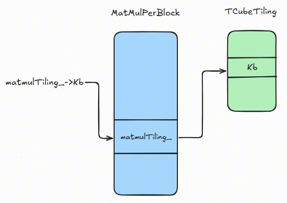

**优化后**：通过`tuple`类型的值变量`problemShape_`来存储shape信息：

```c++
using TupleShape = AscendC::Shape<int64_t, int64_t, int64_t>;              // m,n,k
TupleShape problemShape_;
Get<MNK_K>(problemShape_);
```

`problemShape_`是值类型（非指针），访问其中的成员变量仅需一次Load：

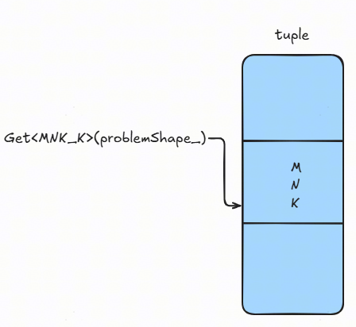

##### 手段三：解决数组导致常量传播失效的问题

**原理**：与FusedInferAttentionScore类似，本算子也尝试通过静态常量创建`LocalTensor`来减少Scalar指令。但实际测试发现Scalar耗时并未降低。

**根因定位**：观察到一个明显现象——每次调用`DataCopy`时，即使`LocalTensor<T>& dst`的`TPosition`为编译期已知的固定值，运行时仍要动态获取该值并进行判断：

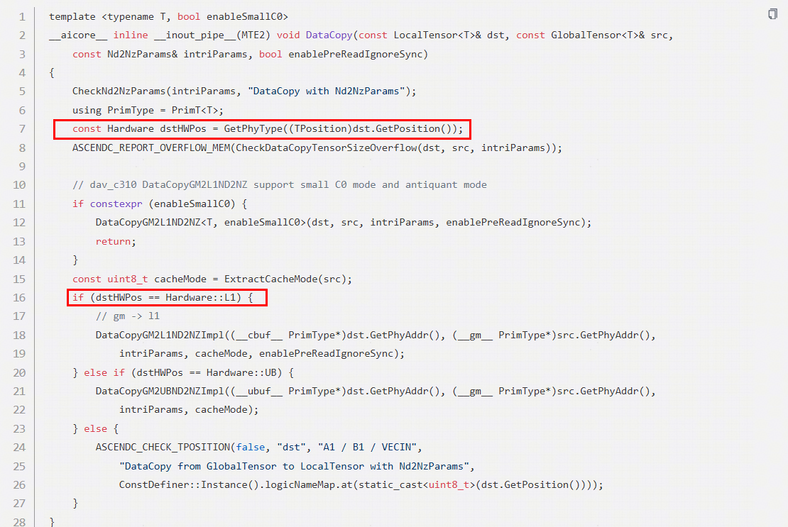

原因在于：类中包含数组类型成员变量（如`event_t eventIdV2Mte2[2]`）。当通过动态下标变量`x1ScalePingPongID_`访问该数组时，编译器无法确定下标值，必须假设数组元素可能被修改。由于数组成员与其他成员共享同一结构体内存布局，编译器会保守地放弃对整个结构体所有成员的常量传播和常量折叠优化。

**适用条件**：类/结构体中同时存在数组成员和其他需要常量优化的成员时触发。如果数组是独立的（不与其他需优化的成员共存），则影响有限。

**优化前**：类变量包含数组，存储ping-pong模式下不同缓冲区使用的同步eventId：

```c++
class MatMulPerBlock {
protected:
    event_t eventIdV2Mte2[2] = {EVENT_ID0, EVENT_ID1};
    event_t eventIdV2Mte3[2] = {EVENT_ID0, EVENT_ID1};
    uint16_t x1ScalePingPongID_ = 0;
}
SetFlag<HardEvent::V_MTE2>(eventIdV2Mte2[x1ScalePingPongID_]);
x1ScalePingPongID_ ^= 1;
```

**优化后**：去除类中的数组类型成员变量，改用独立的标量成员：

```c++
class MatMulPerBlock {
protected:
    uint16_t x1ScalePingPongID_ = 0;
}
SetFlag<HardEvent::V_MTE2>(x1ScalePingPongID_);
x1ScalePingPongID_ ^= 1;
```

#### 5.2.2 优化结果

以下为25组不同shape/配置下的端到端性能数据对比。优化后Scalar耗时平均降低**50.15%**（算术平均），端到端耗时平均提升**10.37%**，ScalarBound完全消除。

**表5-2 QuantBatchMatmul优化前后对比（单位：cycle）**


| 优化后 TOTAL | 优化后 SCALAR | 优化前 TOTAL | 优化前 SCALAR | Scalar优化比例 | 端到端提升比例 |
|-------------|--------------|-------------|--------------|---------------|--------------|
| 7965374 | 1611787 | 8294647 | 2153329 | 33.60% | 3.97% |
| 10872031 | 2425274 | 12207123 | 3819802 | 57.50% | 10.94% |
| 5034884 | 1295635 | 5704961 | 1558552 | 20.29% | 11.75% |
| 65962366 | 8666010 | 71878373 | 16711983 | 92.85% | 8.23% |
| 4464038 | 1210496 | 5078586 | 1429136 | 18.06% | 12.10% |
| 7965374 | 1611787 | 8318603 | 2159788 | 34.00% | 4.25% |
| 3580631 | 1449553 | 3716591 | 1584385 | 9.30% | 3.66% |
| 11006577 | 2459560 | 12008279 | 3811651 | 54.97% | 8.34% |
| 16610969 | 2813659 | 17569001 | 4354076 | 54.75% | 5.45% |
| 20919479 | 3953740 | 22124823 | 5858260 | 48.17% | 5.45% |
| 40338010 | 6032413 | 43561074 | 10464468 | 73.47% | 7.40% |
| 15060759 | 2386686 | 16167320 | 3900448 | 63.43% | 6.84% |
| 5661563 | 1648400 | 6074752 | 2115224 | 28.32% | 6.80% |
| 4537665 | 1607619 | 5028119 | 2041225 | 26.97% | 9.75% |
| 5817233 | 1436143 | 5865284 | 1598135 | 11.28% | 0.82% |
| 4708601 | 1907522 | 6330356 | 2988020 | 56.64% | 25.62% |
| 56515161 | 7875640 | 60259530 | 14673669 | 86.32% | 6.21% |
| 8407417 | 3027709 | 11603878 | 5386442 | 77.90% | 27.55% |
| 2262011 | 958752 | 3027156 | 1533945 | 59.99% | 25.28% |
| 3240292 | 1084115 | 3264983 | 1168450 | 7.78% | 0.76% |
| 45299475 | 13069434 | 60964231 | 25882265 | 98.04% | 25.69% |
| 8495102 | 1968114 | 9244449 | 2824228 | 43.50% | 8.11% |
| 18927267 | 3084501 | 21381647 | 5501899 | 78.37% | 11.48% |
| 35455432 | 5011354 | 40085011 | 9478127 | 89.13% | 11.55% |
| 2358969 | 866393 | 2658785 | 1118957 | 29.15% | 11.28% |

---

## 6. 优化方法论总结

第5章展示了两个具体算子的优化实践，本章从中提炼通用优化模式，形成可复用的方法论，并给出诊断流程。

### 6.1 从实践中提炼的优化模式

从FusedInferAttentionScore和QuantBatchMatmul的优化经验中，可以归纳出以下**四类通用优化模式**：

| 模式 | 核心思想 | 典型手段 | 对应实践 |
|------|---------|---------|---------|
| **减少内存访问** | 减少Load/Store指令数，降低寄存器Spill | 局部变量替代成员变量；静态创建LocalTensor；消除多级指针 | 5.1手段二三；5.2手段一二三 |
| **改善指令缓存** | 消除I-Cache miss，保证Scalar指令流的连续供给 | icache预取；代码精简；循环拆分减少代码体量 | 5.1手段一 |
| **改善数据缓存** | 提高数据访问的空间/时间局部性 | 变量定义贴近使用；避免大结构体；减少数据拷贝 | 5.1手段四；5.2手段一 |
| **消除编译器优化障碍** | 帮助编译器完成常量传播、常量折叠等优化 | 去除结构体中的动态索引数组；用值类型替代指针类型 | 5.2手段二三 |

**各模式的优先级建议**：

1. **首先排查"减少内存访问"**：这是投入产出比最高的方向，因为Load/Store是ScalarBound的主因（占比超30%），且优化手段通常只需修改代码结构，不涉及算法变更。
2. **其次关注"消除编译器优化障碍"**：这类问题隐蔽性强（编译器行为程序员不可见），但修复成本通常不高（改成员变量类型、调整结构体布局）。
3. **最后处理"缓存相关优化"**：icache/dcache优化需要借助profiling工具诊断（PC-Cycle图、cache miss统计），且调参（预取位置、预取量）需要反复尝试。

### 6.2 ScalarBound诊断流程

当怀疑算子存在ScalarBound时，建议按以下步骤诊断和处理：

```
Step 1: 采集Profiling数据
    └─ 工具：msprof或者cannsim仿真
    └─ 关键命令：msprof --application=./your_op --output=./prof_data
    └─ 输出：各流水线耗时（含Scalar）、instr_popped_log.dump文件等

Step 2: 判断Scalar耗时占比
    └─ 查看各pipeline的cycle分布
    └─ 阈值建议：Scalar耗时超过其它pipeline的耗时，可能存在ScalarBound
    └─ 更准确的判断：通过打点图观察其他pipeline（Cube/MTE）是否出现明显bubble

Step 3: 分析Scalar瓶颈类型
    ├─ 检查 instr_popped_log.dump → 统计Load/Store指令占比
    │   └─ Load/Store占比 > 30% → 寄存器Spill问题（进入Step 4a）
    ├─ 绘制 PC vs Cycle 图 → 检查icache miss
    │   └─ 出现长水平线段 → I-Cache问题（进入Step 4b）
    └─ 检查 branch预测统计 → 分支预测失败率
        └─ 失败率高 → 分支预测问题（进入Step 4c）

Step 4: 针对性优化
    ├─ 4a: 寄存器Spill → 对照第7章原则排查代码
    │   ├─ 成员变量过多？→ 改为局部变量（7.4）
    │   ├─ 结构体含动态索引数组？→ 去除数组（7.1）
    │   ├─ 多级指针解引用？→ 改为值类型（7.6）
    │   ├─ 变量定义过早？→ 贴近使用位置（7.5）
    │   └─ tilingdata拷贝开销大？→ 直接读入参（5.1手段四）
    ├─ 4b: I-Cache Miss → icache预取；精简代码体量
    └─ 4c: 分支预测 → 循环主尾块分离（7.2）；显式for循环（7.3）

Step 5: 验证优化效果
    └─ 重新采集profiling数据，对比优化前后
    └─ 关注指标：Scalar cycle数、Load/Store指令数、端到端耗时
```

> **Scalar优化与其他优化的协同**：在开始Scalar优化前，应先确认算子的tiling策略和数据搬运（MTE）策略是否合理。如果tiling粒度过小导致kernel启动开销占比过高，或MTE搬运策略不当导致带宽利用率低，则应优先解决这些问题。

---

## 7. Scalar高性能算子编码原则

基于第5章的优化实践和第6章的方法论总结，本章提炼出7条编写Scalar高性能算子的编码原则。每条原则包含"原理"、"做法"和"反面/正面示例"三部分。

> **核心原则**：所有原则的共同目标都是**帮助编译器更好地进行寄存器分配和常量传播优化**，从而减少Load/Store指令，最终降低ScalarBound的风险。

### 7.1 结构体内慎用数组

**原理**

结构体内的数组成员，如果通过动态下标（运行时变量）访问，会导致编译器的**别名分析（Alias Analysis）**失败，进而阻断**常量传播（Constant Propagation）**和**常量折叠（Constant Folding）**优化。

具体机制：当编译器无法确定动态下标的具体值时，必须考虑最坏情况——下标可能越界或经过计算后恰好指向结构体中的其他成员。为了保证正确性，编译器会放弃对该结构体所有成员的常量传播，改为从内存重新读取。

如果其他结构体包含该结构体（作为成员或继承），别名分析的失败会**向上传播**，污染父结构体。

**做法**

- 将数组中的不同元素拆分为独立的标量成员变量
- 如果数组的语义是"多个独立状态"，每个状态用独立变量命名

**示例**

结构体不含动态索引数组时，编译器可以成功完成常量折叠，直接给寄存器赋常量值：

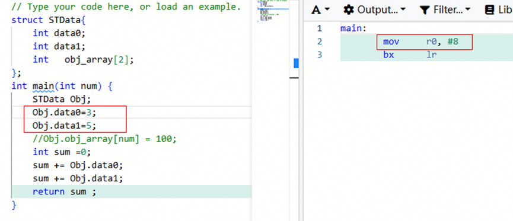

当使用动态变量`index`访问结构体数组`obj_array[index]`时，编译器无法确定`index`的范围，做保守编译——放弃常量传播，改为从内存重新读取：

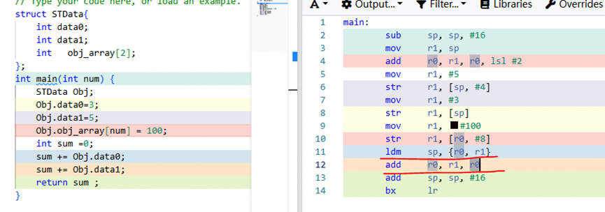

**量化参考**：在QuantBatchMatmul算子中（5.2.1手段三），去除类中的`event_t`数组后，配合其他优化，该用例Scalar耗时平均降低50%。

### 7.2 循环主尾块分离

**原理**

对于Cube类算子（如Conv、Matmul），K维度的Reduce循环是计算密度最高的热路径，循环次数通常很多（数十到数百次）。如果在单一`for`循环内通过`if`判断处理首块、周期性事件和尾块，则每次迭代都需要执行3次分支判断（即使大部分迭代只需要执行计算主体）。

Scalar的分支预测器较简单，对"条件大部分时间为false但偶尔为true"的模式（如`k == 0`、`k % N == 0`）预测效果差。在热路径中，每一次分支预测失败的代价会被放大。

**做法**

将单一循环拆分为三段：

1. **Prologue（首块）**：仅执行1次，处理初始化逻辑
2. **Hot Loop（中间段）**：循环主体，**零分支**，仅包含纯计算和参数更新
3. **Epilogue（尾块）**：仅执行1次，处理收尾逻辑

**示例**

优化前（单一循环，每次迭代3个分支判断）：

```c++
__aicore__ inline void ReduceK_InlineChecks(KernelCtx* self) {
    uint64_t maxK = self->ctx.maxKInterLoop;
    for (uint64_t k = 0; k < maxK; k++) {
        if (k == 0) {
          SetInitialParams();
	    }

        if (k % self->multiKAL1 == 0) {
            MTE2_LoadAL1();
        }
	    UpdataParams(k);
        if (k == maxK - 1) {
            SetFinalParams();
        }
        compute();
    }
}
```

优化后（三段式，Hot Loop零分支）：

```c++
__aicore__ inline void ReduceK_ThreeStage(KernelCtx* self) {
    uint64_t k = 0;
    uint64_t maxK = self->ctx.maxKInterLoop;
    uint64_t segmentEnd = self->ctx.loadAkIter;

    if (k < maxK) {
        SetInitialParams();
        UpdataParams(k);
        compute();
        k++;
    }
    while (k < maxK - 1) {
        if unlikely(k == segmentEnd) {
            MTE2_LoadAL1();
            segmentEnd += self->ctx.loadAkIter;
        }
        while(k < segmentEnd) {
            UpdataParams(k);
            compute();
            k++;
        }
    }
    UpdataParams(k);
    SetFinalParams();
    compute();
}
```

**适用条件与注意事项**：当循环次数较少（< 5次）时，三段式拆分带来的代码体量增加可能反而触发I-Cache miss，需权衡。

### 7.3 显式编写循环代码

**原理**

Scalar的分支预测器远不如通用CPU复杂，对复杂的`if/else`分支往往难以准确预测。当算子通过隐式状态机（如`while(iterate())`循环配合返回值控制）实现多维嵌套循环时，每次Tile切换都会触发大量进位判断，嵌套层级越深，连续的分支预测失败次数越多（一次Tile切换可能引发3-5次连续mispredict）。

此外，状态机函数（如`Iterate`）为处理各种维度的Tail和边界条件，代码体积通常很大（数百行），容易触发I-Cache miss。

显式的`for`循环有两方面优势：
- **硬件层面**：`for`循环的回跳不经过分支预测器（使用专用的循环硬件），不会发生flush
- **编译器层面**：编译器更容易对显式循环进行循环展开、循环无关变量外提等优化

**做法**

将隐式的状态机循环改为显式的多层嵌套`for`循环。

**示例**

优化前（隐式状态机，复杂控制流）：

```c++
while (IterateMFirstMMode(self, enPartialSum)) {
   LoadAL1(...);
   IterateK(self, ...);
   FreeTensor();
}

template <class Intf>
__aicore__ inline bool IterateMFirstMMode(Intf *self)
{
    if (IterateL0MFirstMMode<Intf>(self)) {
        return true;
    }

    if ASCEND_IS_AIC_CONV {
        if constexpr (!Intf::groupOptPreloadFlag) {
            if (self->ctx.kAL1fullload) {
                self->ctx.queueAL1.FreeTensor(self->ctx.al1);
            }
        }
    }

    self->ctx.mAL1Iter++;
    self->ctx.loadAL1Flag = true;
    if (self->ctx.mAL1Iter != self->ctx.ddr2l1LoopM) {
        CalcMDirectionVar<Intf>(self);
        return true;
    } else {
        self->ctx.mAL1Iter = 0;
        CalcMDirectionVar<Intf>(self);
    }

    if constexpr (Intf::isConv3D) {
        self->ctx.dOutIter++;
        if (self->ctx.dOutIter != self->ctx.ddr2l1LoopD) {
            return true;
        } else {
            self->ctx.dOutIter = 0;
        }
    }

    self->ctx.batchIter++;
    if (self->ctx.batchIter != self->ctx.ddr2l1LoopBatch) {
        self->ctx.loadAL1Flag = true;
        self->ctx.loadBL1Flag = false;
        return true;
    } else {
        self->ctx.batchIter = 0;
    }

    // ... 后续还有多层嵌套判断 ...
    return false;
}
```

优化后（显式嵌套for循环，代码完全内联且线性排列）：

```c++
for (uint64_t nBL1 = 0; nBL1 < self->ctx.ddr2l1LoopN; ++nBL1) {
    for (uint64_t batch = 0; batch < self->ctx.ddr2l1LoopBatch; ++batch) {
        for (uint64_t mAL1 = 0; mAL1 < self->ctx.ddr2l1LoopM; ++mAL1) {
            self->ctx.nBL1Iter = nBL1;
            self->ctx.batchIter = batch;
            self->ctx.mAL1Iter = mAL1;
            CalcMDirectionVar(self);

            for (uint64_t nL0 = 0; nL0 < self->ctx.l12l0LoopN; ++nL0) {
                self->ctx.nL0Iter = nL0;
                self->ctx.loadBL0Flag = true;
                for (uint64_t mL0 = 0; mL0 < self->ctx.l12l0LoopM; ++mL0) {
                    self->ctx.mL0Iter = mL0;
                    self->ctx.loadBL0Flag = false;

                    // 执行 L0 层实际计算任务
                }
            }
        }
    }
}
```

### 7.4 尽量使用局部变量

**原理**

局部变量与成员变量在编译器优化层面存在三方面本质差异：

**（1）寄存器分配的难易度**

- **局部变量**：活跃范围通常不跨越函数调用（除非取地址），编译器能精确分析其使用点。许多局部变量可能**从不进入内存**，完全在寄存器中运算。
- **成员变量**：属于某个对象，编译器必须通过`this`指针+偏移访问。即使`this`在寄存器中，每次读写成员变量仍需至少一次内存访问（除非编译器能证明该成员可以长期驻留寄存器——但别名分析通常不允许这种假设）。

**（2）别名分析（Alias Analysis）的保守性**

编译器必须保证：两次读取同一个变量，中间如果有未知的写入，则不能重用第一次读取的值。

- **局部变量**：如果未取地址，编译器知道没有任何其他指针能指向它，可以大胆地将多次读取优化为寄存器复用。例如`x = a + b; y = a * 2;`中的`a`不会在中间被意外修改，可以一直驻留寄存器。
- **成员变量**：其他代码可能通过其他指针或引用修改同一对象。编译器通常无法证明两个指针不指向同一对象（即"指针别名"问题），因此每次读取成员变量都可能需要重新从内存加载。

```c++
void foo(Point* p1, Point* p2) {
    p1->x = 10;
    p2->x = 20;   // 若 p1 == p2，则 p1->x 被修改
    // 编译器无法确定 p1 和 p2 是否指向同一对象
    int v = p1->x; // 必须重新从内存读取
}
```

**（3）跨函数调用的行为**

- **局部变量**（未取地址）：编译器知道被调用函数没有该变量的地址，因此局部变量可以安全地跨函数调用保持在寄存器中。
- **成员变量**：编译器通常假定任何外部函数都可能修改对象的任意成员（除非有`const`成员函数标记或严格别名规则）。调用一个普通函数后，成员变量的缓存值被丢弃，需重新从内存加载。

```c++
struct S { int x; };
void use(S* s) {
    s->x = 1;
    some_func();   // 编译器不知道 some_func 是否会修改 s->x
    int y = s->x;  // 必须重新从内存读取 s->x
}
```

**做法**

- 将计算过程中频繁访问的参数，从类成员变量改为函数内的局部变量
- 局部变量在函数入口或首次使用前定义，通过函数参数或初始化列表获取值

**量化参考**：在FusedInferAttentionScore中（5.1.1手段三），仅将`constParam`从成员变量改为局部变量，Cube核Scalar耗时即降低**15%**。

### 7.5 变量定义贴近使用位置

**原理**

编译器需要将变量映射到寄存器。变量的**活跃范围（Live Range）**——即从定义到最后一次使用的代码范围——越长，该变量占用寄存器的时间就越长。

- **长生命周期的代价**：变量长期占用一个寄存器，当编译器遇到其他变量时可能寄存器不够用，被迫进行寄存器Spill。
- **贴近使用的效果**：变量在真正需要前才定义，用完后活跃状态立即结束。短生命周期的变量可能直接使用临时寄存器，甚至被优化掉。

**做法**

将变量的定义移动到首次使用它的代码行附近，避免在函数顶部集中定义所有变量。

**示例**

```c++
// 反面：定义过早，生命周期跨越100行代码
void foo() {
    int a = 1;          // 生命周期从函数开始
    // ... 100 行复杂计算，调用很多函数 ...
    printf("%d", a);    // 最后才用
}

// 正面：贴近使用
void foo() {
    // ... 100 行复杂计算 ...
    int a = 1;          // 紧邻使用位置
    printf("%d", a);
}
```

### 7.6 避免多级指针解引用

**原理**

多级指针（如`T**`、`Struct* -> member*`）带来三方面问题：

**（1）更多的访存延迟**

每一级解引用本质上是一条Load指令，且这些Load之间存在数据依赖（前一条Load的结果是下一条Load的地址），延迟串行累加。

**（2）破坏数据访问局部性**

多级指针的各级地址可能散落在堆内存的不同位置，每一级解引用都可能触发一次D-Cache miss。而单级数组（连续内存布局）可以通过一个cacheline预取多个元素，局部性好得多。

**（3）编译器优化困难**

- **指针别名问题**：编译器不确定指针的某一级内容是否会被其他写操作修改，每次解引用都必须从内存重新加载
- **跨函数调用**：多级指针作为参数传递时，函数内部的解引用通常不会被优化掉

**做法**

- 用值类型的聚合结构体替代多级指针
- 如果参数在kernel生命周期内只读，在初始化阶段一次性拷贝到本地值变量

**示例**

```c++
// 反面：多级指针，每次访问需2次Load
class MatMulPerBlock {
protected:
    const TCubeTiling *matmulTiling_;  // 指针
};
isTailBL1 = (kInner + minStepK_) >= matmulTiling_->Kb;  // 2次Load

// 正面：值类型，1次Load
using TupleShape = AscendC::Shape<int64_t, int64_t, int64_t>;
TupleShape problemShape_;  // 值类型
Get<MNK_K>(problemShape_);  // 1次Load
```

### 7.7 避免使用超大结构体

**原理**

**（1）缓存局部性差**

D-Cache的cacheline大小为64字节。结构体过大时，访问不同成员可能落在不同的cacheline上，导致D-Cache miss增多。一般建议将结构体大小控制在**64字节以内**（1个cacheline），最大不超过**128字节**。

**（2）寄存器溢出**

编译器无法将超大结构体完全放入寄存器，必须分配到栈内存上。每次访问成员都生成Load/Store指令。

**（3）指针传递引入别名问题**

为避免拷贝开销，大结构体通常通过指针传递，但这引入了别名问题——编译器无法确定两个指针是否指向同一块内存，从而无法激进优化。

```c++
void compute(struct Huge *a, struct Huge *b) {
    a->data[0] = 1;
    b->data[0] = 2;   // 如果 a == b，则上一条赋值被覆盖
    int x = a->data[0]; // 编译器必须重新从内存读取（b可能别名a）
}
```

**做法**

- 将大结构体按功能拆分为多个小结构体（每个 < 64字节）
- 热路径中只保留当前计算阶段所需的小结构体指针/引用
- 考虑使用局部副本（值语义）而非指针传递，以便编译器优化

---

## 8. 总结与展望

### 8.1 本文核心结论

1. **ScalarBound的本质是Load/Store指令过多**：ScalarBound的主因并非Scalar计算指令过多，而是寄存器Spill导致的大量Load/Store指令阻塞了Scalar流水线。消除ScalarBound的关键在于减少Load/Store。

2. **Cube/Mix算子是重灾区**：统计分析表明，FlashAttention、Matmul、Conv三类算子占ScalarBound用例的97%以上。Vector类算子的ScalarBound问题相对不突出。

3. **编码方式是根因**：类成员变量过多、结构体含动态索引数组、多级指针解引用、变量生命周期过长等编码模式，会阻碍编译器进行寄存器分配和常量传播优化，是Load/Store过多的直接诱因。

4. **优化效果显著**：两个典型算子的优化实践表明，通过针对性的代码结构调整（不涉及算法变更），Scalar耗时可降低30%-50%，端到端性能提升3%-27%。。

### 8.2 未来方向

- **编译器能力增强**：推动昇腾编译器在寄存器分配、别名分析、常量传播等方面增强自动优化能力，减少对手工调优的依赖。
- **自动化诊断工具**：开发ScalarBound自动诊断工具，自动分析issque dump并推荐优化手段。
- **硬件演进跟踪**：关注下一代昇腾NPU在Scalar单元的硬件改进（如更大的寄存器文件、更智能的预取），评估其对优化手段长期价值的影响。
