# 常见范式的 SIMD VF 实现

本文用一组可运行样例，介绍两类范式在 SIMD VF 内的实现方式，并用 cannsim trace 数据说明：同一个算法，哪种写法快、为什么快、为什么得这么写。

- **逻辑 broadcast 模式**（尾轴 / 首轴 / 中间轴）：把 shape 中长度为 1 的轴按逻辑重复到目标长度，优化重点是把外层循环收进 VF，减少 VF 发起与 PB 传参。
- **计算范式 elemwise / reduce**（逐元素、归约）：分水岭是相邻迭代之间有没有循环携带依赖，它决定瓶颈类型，也决定该用哪种优化。

全文分三部分：broadcast 逻辑模式、逐元素 elemwise、归约 reduce。前者和后两者的度量口径不同，跨部分比较时要注意区分。

## 第一部分：Broadcast 逻辑模式

Broadcast 是指把 shape 中长度为 1 的轴按逻辑重复到目标长度。例如 `a[M, 1]` 与 `x[M, N]` 做逐元素计算时，可以把 `a` 看成逻辑上的 `a[M, N]`，但实际实现不需要把 `a` 物理展开。SIMD VF 中更常见的写法是：在 VF 内按合适的循环顺序读取原始 `a`，在寄存器中完成复用或广播，再和 `x/y` 的数据流配合。

复杂 broadcast 通常可以先合轴，再规约到 3 种模式：

| 模式 | 规约前 | 规约后 | 本文样例 |
| --- | --- | --- | --- |
| 尾轴 broadcast | `(A1, ..., Ak, 1) -> (A1, ..., Ak, B)` | `(M, 1) -> (M, N)` | `y[m, n] = x[m, n] + a[m]` |
| 首轴 broadcast | `(1, A1, ..., Ak) -> (B, A1, ..., Ak)` | `(1, N) -> (M, N)` | `y[m, n] = x[m, n] + a[n]` |
| 中间轴 broadcast | `(A..., 1, C...) -> (A..., B, C...)` | `(M, 1, N) -> (M, B, N)` | `y[m, b, n] = x[m, b, n] + a[m, n]` |

中间轴 broadcast 固定一个外层 `m` 后，可以看成首轴 broadcast：`x[m, :, :]` 是 `(B, N)`，`a[m, :]` 是 `(1, N)`，计算 `y_m[b, n] = x_m[b, n] + a_m[n]`。

> **broadcast 的度量口径**：本部分 trace 中 `VF count` 是 kernel 实际发起 VF 的次数（不固定），瓶颈在于 VF 调用是否过碎、`RVECSU`（aux scalar 地址计算）与 `PUSH_PB`（VF 参数传入）是否偏重，因此重点看 `VF count`、`PUSHQ VF sum_cycles` 与 `PUSH_PB`。

### 尾轴 broadcast（tail_axis）

#### 用例公式

```cpp
y[m, n] = x[m, n] + a[m]
```

这里 `a[m]` 在逻辑上沿尾轴 `n` 重复，等价于把 `a[M]` 看成 `a[M, 1] -> a[M, N]`。

#### naive实现：逐行发起 VF

```cpp
__simd_vf__ inline void ComputeVF(
    __ubuf__ float* xAddr, __ubuf__ float* yAddr, uint32_t n, uint16_t vfLoopN, float aVal)
{
    AscendC::Reg::RegTensor<float> xReg;
    AscendC::Reg::RegTensor<float> yReg;
    AscendC::Reg::MaskReg mask = AscendC::Reg::CreateMask<float, AscendC::Reg::MaskPattern::ALL>();

    uint32_t remain = n;
    for (uint16_t i = 0; i < vfLoopN; ++i) {
        mask = AscendC::Reg::UpdateMask<float>(remain);
        AscendC::Reg::LoadAlign<float>(xReg, xAddr + i * VL_B32);
        AscendC::Reg::Adds<float>(yReg, xReg, aVal, mask);
        AscendC::Reg::StoreAlign<float>(yAddr + i * VL_B32, yReg, mask);
    }
}

auto* xUb = reinterpret_cast<__ubuf__ float*>(xLocal.GetPhyAddr());
auto* yUb = reinterpret_cast<__ubuf__ float*>(yLocal.GetPhyAddr());
for (uint32_t j = 0; j < tiling.m; ++j) {
    asc_vf_call<ComputeVF>(
        xUb + j * tiling.nElemsAligned, yUb + j * tiling.nElemsAligned, tiling.n,
        VFLoopNumForB32(tiling.n), aLocal.GetValue(j));
}
```

这个实现按行发起 VF，每次处理一段连续 `n`，代码最直观。但每行都要启动一次 VF，还需要在 Main Scalar 侧读取 `aLocal.GetValue(j)` 后再通过 PB 传给 Vector 单元，VF 粒度偏碎。

源码：`broadcast/src/tail_axis_1_naive_getvalue.asc`

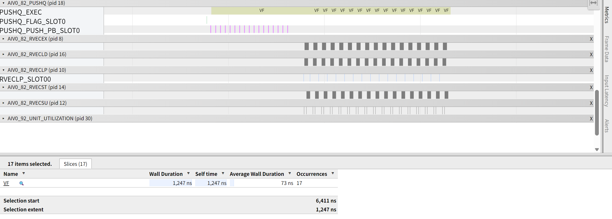

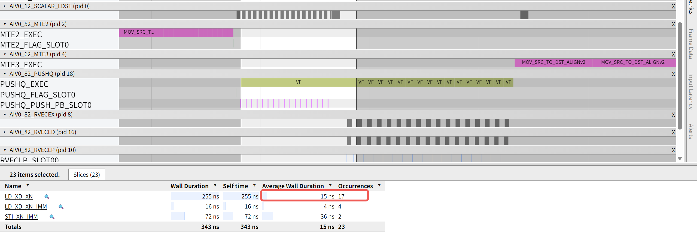

#### 优化实现：VF 内广播行标量

```cpp
__simd_vf__ inline void ComputeVF(
    __ubuf__ float* xAddr, __ubuf__ float* aAddr, __ubuf__ float* yAddr, uint32_t n, uint32_t nElemsAligned,
    uint16_t vfLoopM, uint16_t vfLoopN)
{
    AscendC::Reg::RegTensor<float> xReg;
    AscendC::Reg::RegTensor<float> aReg;
    AscendC::Reg::RegTensor<float> yReg;
    AscendC::Reg::MaskReg mask = AscendC::Reg::CreateMask<float, AscendC::Reg::MaskPattern::ALL>();

    uint32_t remain;
    for (uint16_t j = 0; j < vfLoopM; ++j) {
        remain = n;
        AscendC::Reg::LoadAlign<float, AscendC::Reg::LoadDist::DIST_BRC_B32>(aReg, aAddr + j);
        for (uint16_t i = 0; i < vfLoopN; ++i) {
            mask = AscendC::Reg::UpdateMask<float>(remain);
            AscendC::Reg::LoadAlign<float>(xReg, xAddr + j * nElemsAligned + i * VL_B32);
            AscendC::Reg::Add<float>(yReg, xReg, aReg, mask);
            AscendC::Reg::StoreAlign<float>(yAddr + j * nElemsAligned + i * VL_B32, yReg, mask);
        }
    }
}

auto* xUb = reinterpret_cast<__ubuf__ float*>(xLocal.GetPhyAddr());
auto* aUb = reinterpret_cast<__ubuf__ float*>(aLocal.GetPhyAddr());
auto* yUb = reinterpret_cast<__ubuf__ float*>(yLocal.GetPhyAddr());
asc_vf_call<ComputeVF>(
    xUb, aUb, yUb, tiling.n, tiling.nElemsAligned, static_cast<uint16_t>(tiling.m), VFLoopNumForB32(tiling.n));
```

优化实现把 `m` 循环也收进一个 VF。每行开始时用广播读把 `a[j]` 写入 `aReg`，内层仍沿连续 `n` 处理 `x/y`。这样可以减少 VF 发起和 PB 传参，同时让核心计算留在 VF 硬循环内执行。

源码：`broadcast/src/tail_axis_2_distbrc.asc`

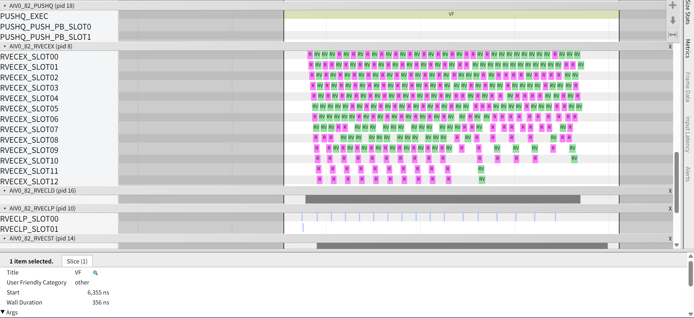

#### 性能对比

| 样例 | VF count | PUSHQ VF sum_cycles | RVECSU sum_cycles | PUSH_PB sum_cycles | 结论 |
| --- | ---: | ---: | ---: | ---: | --- |
| `tail_axis_1_naive_getvalue` | 17 | 1247 | 34 | 68 | naive实现；VF 粒度过碎，还有额外的 Main Scalar 开销。 |
| `tail_axis_2_distbrc` | 1 | 356 | 35 | 8 | 优化实现；单 VF 内广播行标量。 |

尾轴 broadcast 的优化重点是把行循环放进 VF，在 VF 内完成行标量广播。主要收益来自 VF 发起次数和 PB 传参次数减少。

### 首轴 broadcast（head_axis）

#### 用例公式

```cpp
y[m, n] = x[m, n] + a[n]
```

这里 `a[n]` 在逻辑上沿首轴 `m` 重复，等价于把 `a[N]` 看成 `a[1, N] -> a[M, N]`。

#### naive实现：逐行发起 VF

```cpp
__simd_vf__ inline void ComputeVF(
    __ubuf__ float* xAddr, __ubuf__ float* aAddr, __ubuf__ float* yAddr, uint32_t n, uint16_t vfLoopN)
{
    AscendC::Reg::RegTensor<float> xReg;
    AscendC::Reg::RegTensor<float> aReg;
    AscendC::Reg::RegTensor<float> yReg;
    AscendC::Reg::MaskReg mask = AscendC::Reg::CreateMask<float, AscendC::Reg::MaskPattern::ALL>();

    uint32_t remain = n;
    for (uint16_t i = 0; i < vfLoopN; ++i) {
        mask = AscendC::Reg::UpdateMask<float>(remain);
        AscendC::Reg::LoadAlign<float>(xReg, xAddr + i * VL_B32);
        AscendC::Reg::LoadAlign<float>(aReg, aAddr + i * VL_B32);
        AscendC::Reg::Add<float>(yReg, xReg, aReg, mask);
        AscendC::Reg::StoreAlign<float>(yAddr + i * VL_B32, yReg, mask);
    }
}

auto* aUb = reinterpret_cast<__ubuf__ float*>(aLocal.GetPhyAddr());
for (uint32_t j = 0; j < tiling.m; ++j) {
    auto* xUbCurrentRow = reinterpret_cast<__ubuf__ float*>(xLocal.GetPhyAddr()) + j * tiling.nElemsAligned;
    auto* yUbCurrentRow = reinterpret_cast<__ubuf__ float*>(yLocal.GetPhyAddr()) + j * tiling.nElemsAligned;
    asc_vf_call<ComputeVF>(xUbCurrentRow, aUb, yUbCurrentRow, tiling.n, VFLoopNumForB32(tiling.n));
}
```

naive实现按行发起 VF，每次计算一行 `x[j, :] + a[:]`。它保持了单行内连续访问，但会发起 17 次 VF，启动和 PB 开销占比高，也无法让跨行复用 `a[n]` 的机会留在 VF 内。

源码：`broadcast/src/head_axis_1_naive.asc`

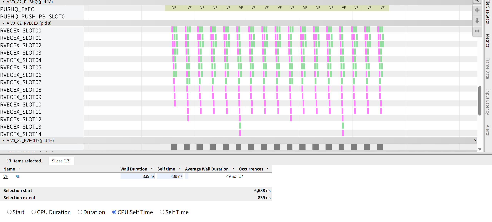

#### 优化实现：把 `m` 轴放进 VF

首轴 broadcast 的 `a[n]` 可以复用到多行。把 `m` 循环放进 VF 后，可以选择先遍历 `n` 以复用 `aReg`，也可以先遍历 `m` 以保持每行内连续访问。

**`n -> m`：广播数据复用优先**

```cpp
__simd_vf__ inline void ComputeVF(
    __ubuf__ float* xAddr, __ubuf__ float* aAddr, __ubuf__ float* yAddr, uint32_t n, uint32_t nElemsAligned,
    uint16_t vfLoopM, uint16_t vfLoopN)
{
    AscendC::Reg::RegTensor<float> xReg;
    AscendC::Reg::RegTensor<float> aReg;
    AscendC::Reg::RegTensor<float> yReg;
    AscendC::Reg::MaskReg mask = AscendC::Reg::CreateMask<float, AscendC::Reg::MaskPattern::ALL>();

    uint32_t remain = n;
    for (uint16_t i = 0; i < vfLoopN; ++i) {
        mask = AscendC::Reg::UpdateMask<float>(remain);
        AscendC::Reg::LoadAlign<float>(aReg, aAddr + i * VL_B32);
        for (uint16_t j = 0; j < vfLoopM; ++j) {
            AscendC::Reg::LoadAlign<float>(xReg, xAddr + i * VL_B32 + j * nElemsAligned);
            AscendC::Reg::Add<float>(yReg, xReg, aReg, mask);
            AscendC::Reg::StoreAlign<float>(yAddr + i * VL_B32 + j * nElemsAligned, yReg, mask);
        }
    }
}

auto* xUb = reinterpret_cast<__ubuf__ float*>(xLocal.GetPhyAddr());
auto* aUb = reinterpret_cast<__ubuf__ float*>(aLocal.GetPhyAddr());
auto* yUb = reinterpret_cast<__ubuf__ float*>(yLocal.GetPhyAddr());
asc_vf_call<ComputeVF>(
    xUb, aUb, yUb, tiling.n, tiling.nElemsAligned, static_cast<uint16_t>(tiling.m), VFLoopNumForB32(tiling.n));
```

`n -> m` 写法每个 `n` 块只加载一次 `aReg`，再复用到所有 `m` 行。当前 `m = 17` 下，少读广播数据省下的开销更明显，因此它是本组最快的写法。

源码：`broadcast/src/head_axis_2_vfloop_nm.asc`

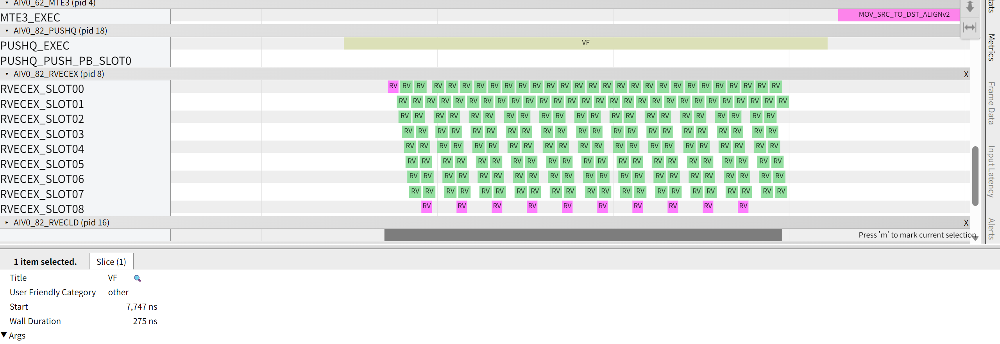

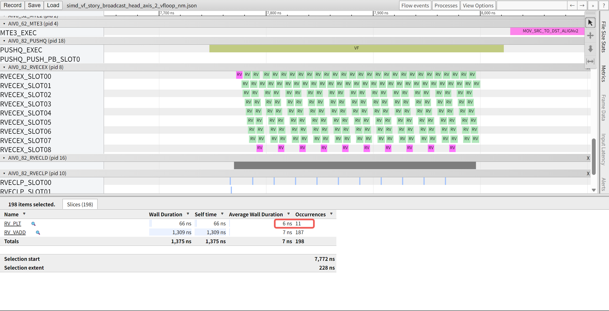

**`m -> n`：主数据连续优先**

```cpp
__simd_vf__ inline void ComputeVF(
    __ubuf__ float* xAddr, __ubuf__ float* aAddr, __ubuf__ float* yAddr, uint32_t n, uint32_t nElemsAligned,
    uint16_t vfLoopM, uint16_t vfLoopN)
{
    AscendC::Reg::RegTensor<float> xReg;
    AscendC::Reg::RegTensor<float> aReg;
    AscendC::Reg::RegTensor<float> yReg;
    AscendC::Reg::MaskReg mask = AscendC::Reg::CreateMask<float, AscendC::Reg::MaskPattern::ALL>();

    uint32_t remain;
    for (uint16_t j = 0; j < vfLoopM; ++j) {
        remain = n;
        for (uint16_t i = 0; i < vfLoopN; ++i) {
            mask = AscendC::Reg::UpdateMask<float>(remain);
            AscendC::Reg::LoadAlign<float>(aReg, aAddr + i * VL_B32);
            AscendC::Reg::LoadAlign<float>(xReg, xAddr + j * nElemsAligned + i * VL_B32);
            AscendC::Reg::Add<float>(yReg, xReg, aReg, mask);
            AscendC::Reg::StoreAlign<float>(yAddr + j * nElemsAligned + i * VL_B32, yReg, mask);
        }
    }
}

auto* xUb = reinterpret_cast<__ubuf__ float*>(xLocal.GetPhyAddr());
auto* aUb = reinterpret_cast<__ubuf__ float*>(aLocal.GetPhyAddr());
auto* yUb = reinterpret_cast<__ubuf__ float*>(yLocal.GetPhyAddr());
asc_vf_call<ComputeVF>(
    xUb, aUb, yUb, tiling.n, tiling.nElemsAligned, static_cast<uint16_t>(tiling.m), VFLoopNumForB32(tiling.n));
```

`m -> n` 写法保持每行内连续访问，也把 17 次 VF 合并成 1 次，因此明显优于 naive实现。但它会在每行内重复读取 `aReg`，最内层也重复更新 `mask`，当前形状下不如 `n -> m`。

源码：`broadcast/src/head_axis_3_vfloop_mn.asc`

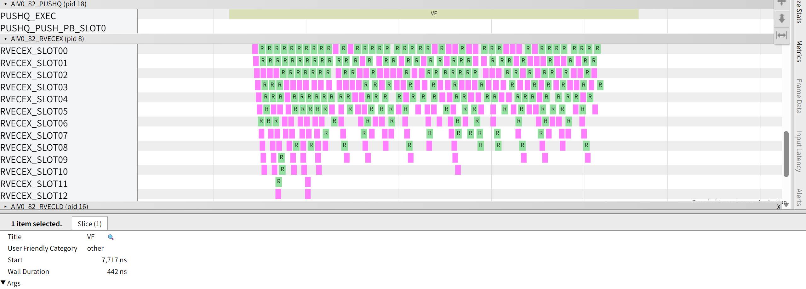

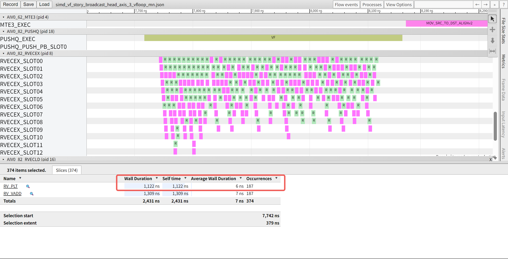

#### 性能对比

| 样例 | VF count | PUSHQ VF sum_cycles | RVECEX sum_cycles | RVECLD sum_cycles | RVECSU sum_cycles | PUSH_PB sum_cycles | 结论 |
| --- | ---: | ---: | ---: | ---: | ---: | ---: | --- |
| `head_axis_1_naive` | 17 | 839 | 2431 | 3552 | 34 | 68 | naive实现；VF 粒度过碎。 |
| `head_axis_2_vfloop_nm` | 1 | 275 | 1375 | 1782 | 13 | 4 | 优化实现；广播数据跨行复用。 |
| `head_axis_3_vfloop_mn` | 1 | 442 | 2431 | 3546 | 35 | 4 | 优化实现；连续访问更直接，但重复处理 `a[n]` 和更新 `mask`。 |

首轴 broadcast 的优化重点是把逐行 VF 合并为单个 VF，并在 VF 内利用 `a[n]` 可跨行复用的特点。当前形状下，`n -> m` 复用 `aReg` 带来的事件规模下降更关键，因此优于 `m -> n`。

### 中间轴 broadcast（mid_axis）

#### 用例公式

```cpp
y[m, b, n] = x[m, b, n] + a[m, n]
```

这里 `a[m, n]` 在逻辑上沿中间轴 `b` 重复，等价于 `a[M, 1, N] -> a[M, B, N]`。固定一个 `m` 后，它可以看成首轴 broadcast：`a_m[n]` 作为 `(1, N)`，沿 `b` 重复到 `(B, N)`。

#### naive实现：每个 `(m, b)` 发起一次 VF

```cpp
__simd_vf__ inline void ComputeVF(
    __ubuf__ float* xAddr, __ubuf__ float* aAddr, __ubuf__ float* yAddr, uint32_t n, uint16_t vfLoopN)
{
    AscendC::Reg::RegTensor<float> xReg;
    AscendC::Reg::RegTensor<float> aReg;
    AscendC::Reg::RegTensor<float> yReg;
    AscendC::Reg::MaskReg mask = AscendC::Reg::CreateMask<float, AscendC::Reg::MaskPattern::ALL>();

    uint32_t remain = n;
    for (uint16_t i = 0; i < vfLoopN; ++i) {
        mask = AscendC::Reg::UpdateMask<float>(remain);
        AscendC::Reg::LoadAlign<float>(xReg, xAddr + i * VL_B32);
        AscendC::Reg::LoadAlign<float>(aReg, aAddr + i * VL_B32);
        AscendC::Reg::Add<float>(yReg, xReg, aReg, mask);
        AscendC::Reg::StoreAlign<float>(yAddr + i * VL_B32, yReg, mask);
    }
}

auto* xUb = reinterpret_cast<__ubuf__ float*>(xLocal.GetPhyAddr());
auto* aUb = reinterpret_cast<__ubuf__ float*>(aLocal.GetPhyAddr());
auto* yUb = reinterpret_cast<__ubuf__ float*>(yLocal.GetPhyAddr());
for (uint32_t m = 0; m < tiling.m; ++m) {
    for (uint32_t b = 0; b < tiling.b; ++b) {
        uint32_t rowOffset = (m * tiling.b + b) * tiling.nElemsAligned;
        asc_vf_call<ComputeVF>(
            xUb + rowOffset, aUb + m * tiling.nElemsAligned, yUb + rowOffset, tiling.n,
            VFLoopNumForB32(tiling.n));
    }
}
```

naive实现的单个 VF 最简单，每次只处理一段连续 `n`。问题是 VF 粒度过碎，会发起 24 次 VF，PB 传参次数最高，整体性能最差。

源码：`broadcast/src/mid_axis_1_naive.asc`

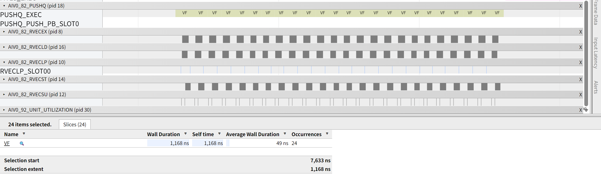

#### 第一步优化：把 broadcast 轴放进 VF

固定一个 `m` 后，`x[m, :, :]` 是 `(B, N)`，`a[m, :]` 是 `(1, N)`。第一步可以先让 kernel 每个 `m` 只发起一次 VF，在 VF 内处理 broadcast 轴 `b`。

**`n -> b`：广播数据复用优先**

```cpp
__simd_vf__ inline void ComputeVF(
    __ubuf__ float* xAddr, __ubuf__ float* aAddr, __ubuf__ float* yAddr, uint32_t n, uint32_t nElemsAligned,
    uint16_t vfLoopB, uint16_t vfLoopN)
{
    AscendC::Reg::RegTensor<float> xReg;
    AscendC::Reg::RegTensor<float> aReg;
    AscendC::Reg::RegTensor<float> yReg;
    AscendC::Reg::MaskReg mask = AscendC::Reg::CreateMask<float, AscendC::Reg::MaskPattern::ALL>();

    uint32_t remain = n;
    for (uint16_t i = 0; i < vfLoopN; ++i) {
        mask = AscendC::Reg::UpdateMask<float>(remain);
        AscendC::Reg::LoadAlign<float>(aReg, aAddr + i * VL_B32);
        for (uint16_t b = 0; b < vfLoopB; ++b) {
            AscendC::Reg::LoadAlign<float>(xReg, xAddr + b * nElemsAligned + i * VL_B32);
            AscendC::Reg::Add<float>(yReg, xReg, aReg, mask);
            AscendC::Reg::StoreAlign<float>(yAddr + b * nElemsAligned + i * VL_B32, yReg, mask);
        }
    }
}

auto* xUb = reinterpret_cast<__ubuf__ float*>(xLocal.GetPhyAddr());
auto* aUb = reinterpret_cast<__ubuf__ float*>(aLocal.GetPhyAddr());
auto* yUb = reinterpret_cast<__ubuf__ float*>(yLocal.GetPhyAddr());
for (uint32_t m = 0; m < tiling.m; ++m) {
    asc_vf_call<ComputeVF>(
        xUb + m * tiling.b * tiling.nElemsAligned, aUb + m * tiling.nElemsAligned,
        yUb + m * tiling.b * tiling.nElemsAligned, tiling.n, tiling.nElemsAligned,
        static_cast<uint16_t>(tiling.b), VFLoopNumForB32(tiling.n));
}
```

`n -> b` 写法每个 `n` 块只加载一次 `aReg`，再用于所有 `b` 分块。它减少了广播数据的重复读取，但每个 `m` 仍要单独发起 VF，且短 `b` 循环在内层。当前样例里 `b = 3`，内层循环太短，展开和乱序发射后仍然不容易把向量加载、计算、写回流水充分铺开。

源码：`broadcast/src/mid_axis_2_vfloop_nb.asc`

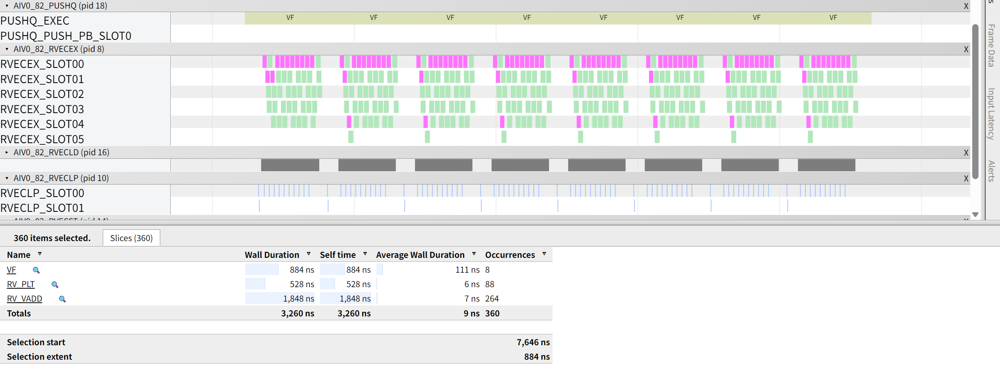

**`b -> n`：主数据连续优先**

```cpp
__simd_vf__ inline void ComputeVF(
    __ubuf__ float* xAddr, __ubuf__ float* aAddr, __ubuf__ float* yAddr, uint32_t n, uint32_t nElemsAligned,
    uint16_t vfLoopB, uint16_t vfLoopN)
{
    AscendC::Reg::RegTensor<float> xReg;
    AscendC::Reg::RegTensor<float> aReg;
    AscendC::Reg::RegTensor<float> yReg;
    AscendC::Reg::MaskReg mask = AscendC::Reg::CreateMask<float, AscendC::Reg::MaskPattern::ALL>();

    for (uint16_t b = 0; b < vfLoopB; ++b) {
        uint32_t remain = n;
        for (uint16_t i = 0; i < vfLoopN; ++i) {
            mask = AscendC::Reg::UpdateMask<float>(remain);
            AscendC::Reg::LoadAlign<float>(aReg, aAddr + i * VL_B32);
            AscendC::Reg::LoadAlign<float>(xReg, xAddr + b * nElemsAligned + i * VL_B32);
            AscendC::Reg::Add<float>(yReg, xReg, aReg, mask);
            AscendC::Reg::StoreAlign<float>(yAddr + b * nElemsAligned + i * VL_B32, yReg, mask);
        }
    }
}

auto* xUb = reinterpret_cast<__ubuf__ float*>(xLocal.GetPhyAddr());
auto* aUb = reinterpret_cast<__ubuf__ float*>(aLocal.GetPhyAddr());
auto* yUb = reinterpret_cast<__ubuf__ float*>(yLocal.GetPhyAddr());
for (uint32_t m = 0; m < tiling.m; ++m) {
    asc_vf_call<ComputeVF>(
        xUb + m * tiling.b * tiling.nElemsAligned, aUb + m * tiling.nElemsAligned,
        yUb + m * tiling.b * tiling.nElemsAligned, tiling.n, tiling.nElemsAligned,
        static_cast<uint16_t>(tiling.b), VFLoopNumForB32(tiling.n));
}
```

`b -> n` 写法会在每个 `b` 下重新读取 `aReg`，但 `x/y` 沿连续 `n` 方向推进，内层循环长度由 `b = 3` 变成 `n` 方向的多个向量片段，流水并行度更容易展开。流水里 `n -> b` 的向量事件数量更少，但 RVECLD/RVECEX/RVECST 的执行跨度反而更长，RVECLP/RVECSU 事件也更多；说明它省下的 `aReg` 读取没有抵消短内层循环带来的发射效率损失。所以在 `b = 3` 这种小尺寸下，`b -> n` 比 `n -> b` 更好。

源码：`broadcast/src/mid_axis_3_vfloop_bn.asc`

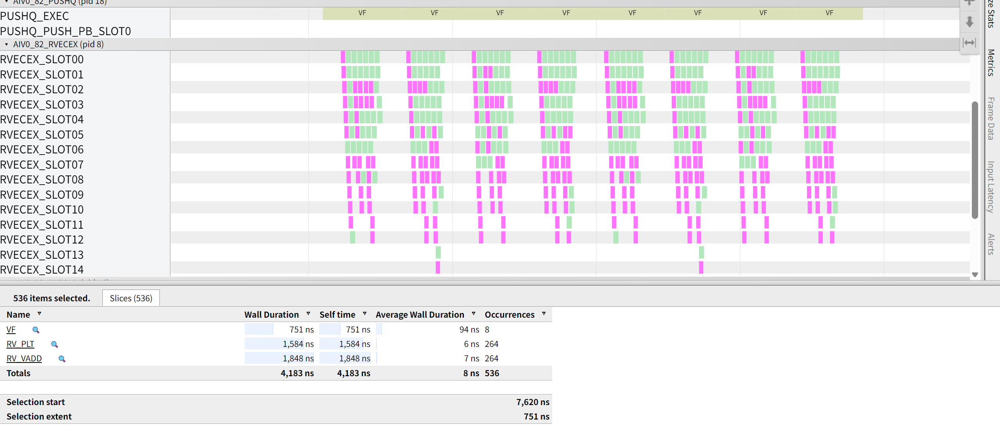

这和尾轴 broadcast 的直觉不同。尾轴场景中 `a[m]` 是行标量，VF 内广播一次后内层自然沿连续 `n` 处理；而中间轴这里如果写成 `n -> b`，虽然复用了 `aReg`，但最内层只有 3 个 `b` 分块，无法形成足够长的连续指令流。当前形状下，优先保持主数据连续访问和足够长的内层循环更重要。

#### 优化实现：把 `m` 也放进 VF

第一步优化已经说明：只看单个 `m` 时，`b -> n` 优于 `n -> b`。进一步优化时，可以把外层 `m` 也收入 VF，继续减少 VF 发起和 PB 传参。`m -> b -> n` 延续主数据连续优先的思路，当前样例最快；`m -> n -> b` 也把三层循环收入单个 VF，虽然当前形状下略慢，但仍属于单 VF 优化实现。

**`m -> b -> n`：主数据连续优先**

```cpp
__simd_vf__ inline void ComputeVF(__ubuf__ float* xAddr, __ubuf__ float* aAddr, __ubuf__ float* yAddr,
    uint16_t vfLoopM, uint16_t vfLoopB, uint32_t n, uint32_t nElemsAligned, uint16_t vfLoopN)
{
    AscendC::Reg::RegTensor<float> xReg;
    AscendC::Reg::RegTensor<float> aReg;
    AscendC::Reg::RegTensor<float> yReg;
    AscendC::Reg::MaskReg mask = AscendC::Reg::CreateMask<float, AscendC::Reg::MaskPattern::ALL>();

    for (uint16_t m = 0; m < vfLoopM; ++m) {
        for (uint16_t b = 0; b < vfLoopB; ++b) {
            uint32_t remain = n;
            for (uint16_t i = 0; i < vfLoopN; ++i) {
                mask = AscendC::Reg::UpdateMask<float>(remain);
                AscendC::Reg::LoadAlign<float>(aReg, aAddr + m * nElemsAligned + i * VL_B32);
                AscendC::Reg::LoadAlign<float>(
                    xReg, xAddr + (m * vfLoopB + b) * nElemsAligned + i * VL_B32);
                AscendC::Reg::Add<float>(yReg, xReg, aReg, mask);
                AscendC::Reg::StoreAlign<float>(
                    yAddr + (m * vfLoopB + b) * nElemsAligned + i * VL_B32, yReg, mask);
            }
        }
    }
}

auto* xUb = reinterpret_cast<__ubuf__ float*>(xLocal.GetPhyAddr());
auto* aUb = reinterpret_cast<__ubuf__ float*>(aLocal.GetPhyAddr());
auto* yUb = reinterpret_cast<__ubuf__ float*>(yLocal.GetPhyAddr());
asc_vf_call<ComputeVF>(xUb, aUb, yUb, static_cast<uint16_t>(tiling.m), static_cast<uint16_t>(tiling.b),
    tiling.n, tiling.nElemsAligned, VFLoopNumForB32(tiling.n));
```

源码：`broadcast/src/mid_axis_4_vfloop_mbn.asc`

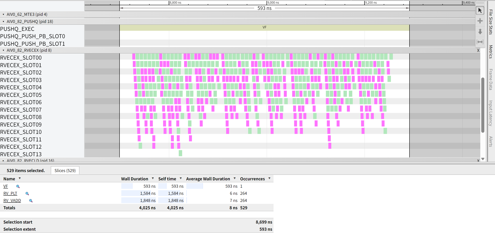

**`m -> n -> b`：广播数据复用优先**

```cpp
__simd_vf__ inline void ComputeVF(__ubuf__ float* xAddr, __ubuf__ float* aAddr, __ubuf__ float* yAddr,
    uint16_t vfLoopM, uint16_t vfLoopB, uint32_t n, uint32_t nElemsAligned, uint16_t vfLoopN)
{
    AscendC::Reg::RegTensor<float> xReg;
    AscendC::Reg::RegTensor<float> aReg;
    AscendC::Reg::RegTensor<float> yReg;
    AscendC::Reg::MaskReg mask = AscendC::Reg::CreateMask<float, AscendC::Reg::MaskPattern::ALL>();

    for (uint16_t m = 0; m < vfLoopM; ++m) {
        uint32_t remain = n;
        for (uint16_t i = 0; i < vfLoopN; ++i) {
            mask = AscendC::Reg::UpdateMask<float>(remain);
            AscendC::Reg::LoadAlign<float>(aReg, aAddr + m * nElemsAligned + i * VL_B32);
            for (uint16_t b = 0; b < vfLoopB; ++b) {
                AscendC::Reg::LoadAlign<float>(
                    xReg, xAddr + (m * vfLoopB + b) * nElemsAligned + i * VL_B32);
                AscendC::Reg::Add<float>(yReg, xReg, aReg, mask);
                AscendC::Reg::StoreAlign<float>(
                    yAddr + (m * vfLoopB + b) * nElemsAligned + i * VL_B32, yReg, mask);
            }
        }
    }
}

auto* xUb = reinterpret_cast<__ubuf__ float*>(xLocal.GetPhyAddr());
auto* aUb = reinterpret_cast<__ubuf__ float*>(aLocal.GetPhyAddr());
auto* yUb = reinterpret_cast<__ubuf__ float*>(yLocal.GetPhyAddr());
asc_vf_call<ComputeVF>(xUb, aUb, yUb, static_cast<uint16_t>(tiling.m), static_cast<uint16_t>(tiling.b),
    tiling.n, tiling.nElemsAligned, VFLoopNumForB32(tiling.n));
```

源码：`broadcast/src/mid_axis_5_vfloop_mnb.asc`

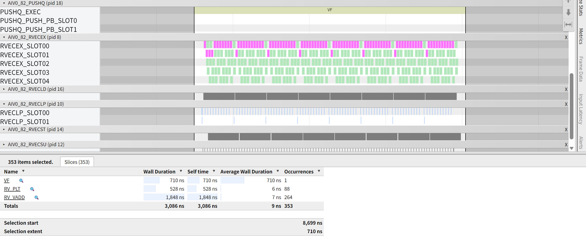

#### 性能对比

| 样例 | VF count | PUSHQ VF sum_cycles | RVECLP sum_cycles | RVECSU sum_cycles | PUSH_PB sum_cycles | 结论 |
| --- | ---: | ---: | ---: | ---: | ---: | --- |
| `mid_axis_1_naive` | 24 | 1168 | 24 | 48 | 96 | naive实现；VF 调用粒度过碎。 |
| `mid_axis_2_vfloop_nb` | 8 | 884 | 96 | 104 | 32 | 第一步优化；每个 `m` 一次 VF，按 `n -> b` 复用 `aReg`。 |
| `mid_axis_3_vfloop_bn` | 8 | 751 | 32 | 56 | 32 | 第一步优化；每个 `m` 一次 VF，按 `b -> n` 连续处理。 |
| `mid_axis_4_vfloop_mbn` | 1 | 593 | 33 | 49 | 8 | 优化实现；单 VF，按 `m -> b -> n` 连续处理主数据。 |
| `mid_axis_5_vfloop_mnb` | 1 | 710 | 97 | 97 | 8 | 优化实现；单 VF，按 `m -> n -> b` 复用 `aReg`。 |

中间轴 broadcast 的优化顺序可以分两步看：先把 `b` 轴放进 VF，减少 `(m, b)` 粒度的重复发起；再把 `m` 轴也放进 VF，进一步减少 VF 和 PB 开销。当前形状下，`m -> b -> n` 最好；`m -> n -> b` 也属于优化实现，但短 `b` 内层带来的开销更明显。

## 第二部分：逐元素 elemwise

逐元素 elemwise 相邻迭代之间没有循环携带依赖（每个 lane 只用自己的数据，后一步不依赖前一步的结果），属于 throughput-bound。这类算子的 baseline 已经最优，优化空间有限，不必过度展开（原理见下文）。

### 用例公式

```cpp
z[i] = a * x[i] + y[i]      // AXPY，每个 i 独立
```

### 逻辑原理

每个 lane 只读写自己的位置，迭代之间没有依赖。矢量管线每拍可发射一条新指令，相邻指令互不依赖时发射就能打满，是典型的 throughput-bound。

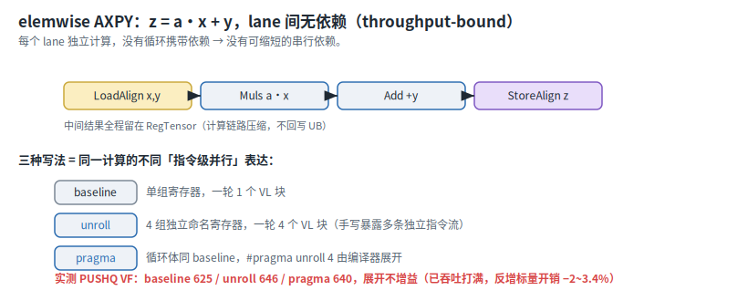

### 实现

源码：`elemwise/src/elemwise_axpy_baseline.asc`

一轮一个 VL 块，中间结果留在 `RegTensor` 不回写 UB：

```cpp
// VF：一轮算 1 个 VL 块
__simd_vf__ inline void ElemwiseAxpyVf(__ubuf__ float* xAddr, __ubuf__ float* yAddr,
                                       __ubuf__ float* zAddr, float a, uint32_t n, uint16_t loopNum)
{
    AscendC::Reg::RegTensor<float> vx, vy, vt;
    AscendC::Reg::MaskReg mask;
    uint32_t count = n;

    for (uint16_t i = 0; i < loopNum; i++) {
        mask = AscendC::Reg::UpdateMask<float>(count);   // 开前 count 个 lane，count 原地递减
        AscendC::Reg::LoadAlign<float, AscendC::Reg::LoadDist::DIST_NORM>(vx, xAddr + i * VL_B32);  // 搬入，无 mask
        AscendC::Reg::LoadAlign<float, AscendC::Reg::LoadDist::DIST_NORM>(vy, yAddr + i * VL_B32);
        AscendC::Reg::Muls(vt, vx, a, mask);             // vt = a * x
        AscendC::Reg::Add(vt, vt, vy, mask);             // vt = a * x + y
        AscendC::Reg::StoreAlign<float, AscendC::Reg::StoreDist::DIST_NORM>(zAddr + i * VL_B32, vt, mask);  // 搬出，带 mask
    }
}

// kernel 侧：单核单 tile，VF 计算位于 Compute()
asc_vf_call<ElemwiseAxpyVf>(x, y, z, A, n_, static_cast<uint16_t>(loopNum_));
```

流水数据：

| 指标 | 数值 |
| --- | ---: |
| VF count | 5 |
| PUSHQ VF cycles | 625 |
| VF IPC（RVECEX/cycle，稳态） | 1.47（915/621） |
| MTE2 sum_cycles | 2343 |
| MTE3 sum_cycles | 1099 |
| 关键指令 | `RVECEX RV_VMULS:305/2440 · RV_VADD:305/2135`，`RVECLD RV_VLD:610/5490`，`RVECST RV_VST:305/4950` |

### 展开几乎无差异

把循环展开的两种写法实测都不增益，与 baseline 的 VF 耗时几乎一样：

| 写法 | PUSHQ VF cycles |
| --- | ---: |
| baseline（一轮 1 块） | **625** |
| 手写展开 ×4（`elemwise_axpy_unroll.asc`） | 646（−3.4%） |
| `#pragma unroll 4`（`elemwise_axpy_pragma.asc`） | 640（−2.4%） |

手写展开 ×4 用 4 组独立命名寄存器一轮算 4 个 VL 块，`#pragma unroll 4` 只在 `for` 前加一行让编译器展开；两者搬运与指令条数都与 baseline 几乎一致。原因是 elemwise 属于 throughput-bound：相邻指令本就互不依赖、发射已打满，没有空泡可填、也没有串行依赖可缩，展开既藏不了延迟也缩不了链，只多出标量地址指令，VF 反而略升。所以这里最简单的写法就是最快的，优化精力应放在搬运、多核、DoubleBuffer 上。

## 第三部分：归约 reduce

归约 reduce 是多对一，累加器 `acc` 要用上一步的结果，带来循环携带依赖，属于 latency-bound（耗时 ≈ 串行步数 × 延迟 L），这也是它和第二部分 elemwise 的分界。归约还分两个轴，后缀 `ar`/`ra` 拼出 `[A, R]` 布局并归约其中的 R 轴：`ar` 沿尾维归约（行内，输出 `[D0]`），`ra` 沿首维归约（跨行，输出 `[D1]`）。

latency-bound 的优化判断如下：

1. **串行步数减不掉**，就用多累加器手写展开把延迟藏掉（步数越多收益越大）；
2. **归约可结合**（求和、norm 这类），就优先二分 / 树形折叠，既减步数又减量，通常最快；
3. **`#pragma unroll` 对归约无效**：它只复制循环体，串行依赖未断（编译器不会擅自重排归约顺序）。

### 归约 reduce_max（多路并行隐藏延迟）

#### 用例公式

```cpp
out[i] = max_j x[i][j]   // ar：沿尾维，输出 [D0]
out[j] = max_i x[i][j]   // ra：沿首维，输出 [D1]
```

`reduce_max` 的归约 `op` 是 `Max`，归约寄存器 `acc` 存当前最大值。两个轴的处理方式见下图（`reduce_sum` 把 `op` 换成 `Add` 即可，轴和串行依赖完全一样）。

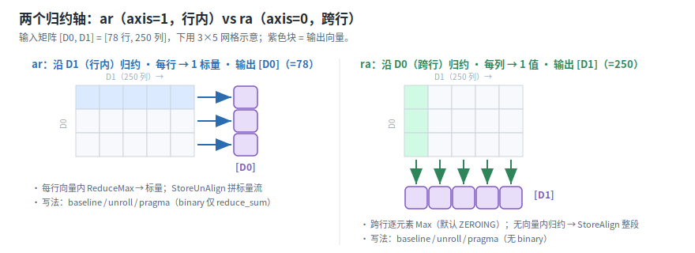

#### 逻辑原理：串行依赖把延迟暴露成空泡

归约是 `acc = op(acc, x[i])`：要算下一条，得先拿到上一条算出的 `acc`，所以这些指令只能一个接一个、按顺序算。这串「后一条必须等前一条结果」、无法并行的指令有多少条，就是**串行步数**（只数最长的那条顺序链，能并行的指令不计入）。串行之所以慢，是因为矢量指令发出后要等 L 拍（指令延迟）才出结果，下一条只能干等，中间 L−1 拍管线空转（空泡）。耗时 ≈ 串行步数 × L，步数越多、空泡越多越慢：

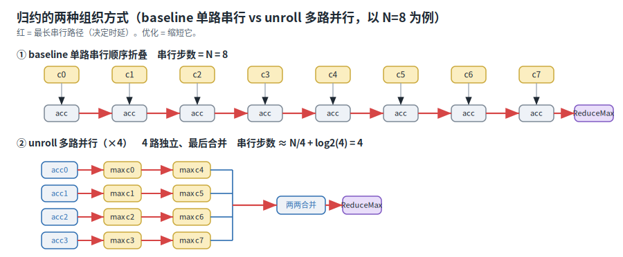

（reduce_max 的两种手写写法是单路串行 baseline 与多路并行 unroll；`#pragma` 版是编译器自动展开循环，但累加器单一、串行步数不变，效果 ≈ baseline，见后文 pragma 列。缩短串行依赖的二叉折叠是 reduce_sum 专属，见下一节。）

- `ra`（跨行）串行步数 = 78：一个列块要把 78 行折进同一个 `acc`，是 78 步的串行依赖，空泡极多。
- `ar`（行内）串行步数 = 4：每行只折 4 个列块，78 行还彼此独立、能并行，步数少得多。

`ra` 串行步数最多、优化空间最大，以它为例。

#### bad example：单路串行 baseline（串行步数 78）

源码：`reduce/src/reduce_max_ra_baseline.asc`

外层列块、内层 78 行顺序折进一个 acc（单路串行）：

```cpp
// VF：axis=0 沿首维归约，输出 [d1]
__simd_vf__ inline void ReduceMaxRaVf(__ubuf__ float* xAddr, __ubuf__ float* zAddr,
                                      uint32_t d0, uint32_t d1, uint32_t d1Pad)
{
    AscendC::Reg::RegTensor<float> accReg, inReg;
    uint32_t remainCols = d1;
    const uint16_t colChunks = static_cast<uint16_t>((d1 + VL_B32 - 1) / VL_B32);

    for (uint16_t c = 0; c < colChunks; c++) {           // 外层：列块循环
        AscendC::Reg::MaskReg mask = AscendC::Reg::UpdateMask<float>(remainCols);
        AscendC::Reg::Duplicate(accReg, NEG_INF);        // 累加器全 lane 置 -inf
        for (uint16_t i = 0; i < static_cast<uint16_t>(d0); i++) {   // 内层：78 行单路串行折叠
            AscendC::Reg::LoadAlign<float, AscendC::Reg::LoadDist::DIST_NORM>(
                inReg, xAddr + i * d1Pad + c * VL_B32);
            AscendC::Reg::Max(accReg, accReg, inReg, mask);          // 第 i+1 条等第 i 条出结果
        }
        AscendC::Reg::StoreAlign<float, AscendC::Reg::StoreDist::DIST_NORM>(
            zAddr + c * VL_B32, accReg, mask);           // 整段搬出（连续对齐）
    }
}

// kernel 侧：单核单 tile，VF 计算位于 Compute()
asc_vf_call<ReduceMaxRaVf>(xAddr, zAddr, d0_, d1_, d1Pad_);
```

流水数据：

| 指标 | 数值 |
| --- | ---: |
| VF count | 5 |
| PUSHQ VF cycles | 510 |
| VF IPC（RVECEX/cycle，稳态） | 0.63（321/506） |
| MTE2 sum_cycles | 5122 |
| MTE3 sum_cycles | 291 |
| 关键指令 | `RVECEX RV_VMAX:312/1872`，`RVECLD RV_VLD:312/2808`，`RVECST RV_VST:4/39` |

`RV_VMAX` 只有 312 条，指令量很省，但 VF 仍要 510 cycle。原因是它们首尾相接，下一条 Max 必须等上一条出结果才能发，时间都耗在等待上。

#### good example：多路并行 unroll

源码：`reduce/src/reduce_max_ra_unroll.asc`

开 4 路互不依赖的 Max，等 acc0 出结果的那几拍正好发 acc1/acc2/acc3：

```cpp
// VF：axis=0，4 个独立累加器并行跨行 Max
__simd_vf__ inline void ReduceMaxRaVfUnroll(__ubuf__ float* xAddr, __ubuf__ float* zAddr,
                                            uint32_t d0, uint32_t d1, uint32_t d1Pad)
{
    AscendC::Reg::RegTensor<float> acc0, acc1, acc2, acc3, in0, in1, in2, in3;
    uint32_t remainCols = d1;
    const uint16_t colChunks = static_cast<uint16_t>((d1 + VL_B32 - 1) / VL_B32);

    for (uint16_t c = 0; c < colChunks; c++) {
        AscendC::Reg::MaskReg mask = AscendC::Reg::UpdateMask<float>(remainCols);
        AscendC::Reg::Duplicate(acc0, NEG_INF); AscendC::Reg::Duplicate(acc1, NEG_INF);
        AscendC::Reg::Duplicate(acc2, NEG_INF); AscendC::Reg::Duplicate(acc3, NEG_INF);
        const uint16_t groups = static_cast<uint16_t>(d0) / 4;
        for (uint16_t g = 0; g < groups; g++) {              // 主循环：每轮 4 行 → 4 路独立
            const uint16_t r = static_cast<uint16_t>(g * 4);
            AscendC::Reg::LoadAlign<float, AscendC::Reg::LoadDist::DIST_NORM>(in0, xAddr + (r + 0) * d1Pad + c * VL_B32);
            AscendC::Reg::LoadAlign<float, AscendC::Reg::LoadDist::DIST_NORM>(in1, xAddr + (r + 1) * d1Pad + c * VL_B32);
            AscendC::Reg::LoadAlign<float, AscendC::Reg::LoadDist::DIST_NORM>(in2, xAddr + (r + 2) * d1Pad + c * VL_B32);
            AscendC::Reg::LoadAlign<float, AscendC::Reg::LoadDist::DIST_NORM>(in3, xAddr + (r + 3) * d1Pad + c * VL_B32);
            AscendC::Reg::Max(acc0, acc0, in0, mask);        // ┐ 四条 Max 互不依赖
            AscendC::Reg::Max(acc1, acc1, in1, mask);        // │ → 填满彼此的延迟空泡
            AscendC::Reg::Max(acc2, acc2, in2, mask);        // │
            AscendC::Reg::Max(acc3, acc3, in3, mask);        // ┘
        }
        for (uint16_t r = static_cast<uint16_t>(groups * 4); r < static_cast<uint16_t>(d0); r++) {  // 尾部 0~3 行
            AscendC::Reg::LoadAlign<float, AscendC::Reg::LoadDist::DIST_NORM>(in0, xAddr + r * d1Pad + c * VL_B32);
            AscendC::Reg::Max(acc0, acc0, in0, mask);
        }
        AscendC::Reg::Max(acc0, acc0, acc1, mask);           // 合并 4 个累加器
        AscendC::Reg::Max(acc2, acc2, acc3, mask);
        AscendC::Reg::Max(acc0, acc0, acc2, mask);
        AscendC::Reg::StoreAlign<float, AscendC::Reg::StoreDist::DIST_NORM>(zAddr + c * VL_B32, acc0, mask);
    }
}

// kernel 侧：单核单 tile，VF 计算位于 Compute()
asc_vf_call<ReduceMaxRaVfUnroll>(xAddr, zAddr, d0_, d1_, d1Pad_);
```

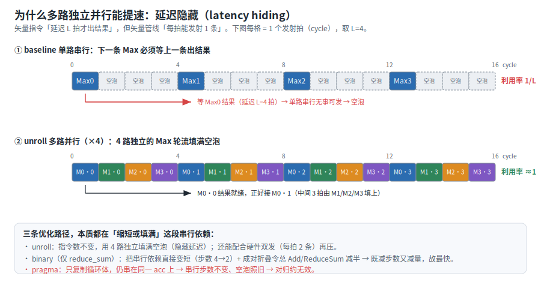

流水数据：

| 指标 | 数值 |
| --- | ---: |
| VF count | 5 |
| PUSHQ VF cycles | 358 |
| VF IPC（RVECEX/cycle，稳态） | 0.97（345/355） |
| MTE2 sum_cycles | 5186 |
| MTE3 sum_cycles | 293 |
| 关键指令 | `RVECEX RV_VMAX:324/1944`，`RVECLD RV_VLD:312/3416`，`RVECST RV_VST:4/210` |

搬运（MTE2 5186≈5122）和 `RV_VMAX` 条数几乎不变（312→324，多出的是合并），VF 从 510 降到 358（+29.8%）。指令没有减少，提速来自多路并发把原来的空泡填上。提速幅度由串行步数决定：

| 轴 | 串行步数 | baseline | unroll | pragma |
| --- | --- | ---: | ---: | ---: |
| `ra`（跨行） | 78 | 510 | **358（+29.8%）** | 524（≈，噪声） |
| `ar`（行内） | 4 | 699 | 592（+15.3%） | 699（0%） |

跨行步数多（78）提速 +29.8%，行内步数少（4）只有 +15.3%。`#pragma unroll` 一栏几乎没变，因为它只复制循环体，这些 `Max` 仍串在同一个 `acc` 上，串行步数不变（编译器不会擅自重排归约顺序）。加速归约要靠手写多路并行，或在可结合时用二分折叠（见 reduce_sum 一节）。

> `reduce_max` 选元素、精确：多路并行换了折叠顺序，结果仍和 baseline 逐位一致，host 用很小的绝对容差校验。

#### 另一个轴 `ar`（行内步数少）：同样的多累加器手法

`ar` 沿尾维归约，每行折 4 个列块（串行步数 4），78 行彼此独立、本就能并行。步数少，多累加器收益小（+15.3%，远低于 `ra`（步数 78）的 +29.8%），但写法完全对称：把「逐行单累加器」改成「每轮 4 行各一个累加器」。注意 `ar` 跨块折叠必须 `MERGING`（末块 mask 不满，默认 ZEROING 会抹掉前面已折进来的列），行末用 `ReduceMax` 压成标量、`StoreUnAlign` 非对齐散出。

**bad example：单累加器（串行步数 4）**

源码：`reduce/src/reduce_max_ar_baseline.asc`

```cpp
// VF：axis=1 沿尾维归约，每行按 VL 分块折进 acc，再向量内 ReduceMax，输出 [d0]
__simd_vf__ inline void ReduceMaxArVf(__ubuf__ float* xAddr, __ubuf__ float* zAddr,
                                      uint32_t d0, uint32_t d1, uint32_t d1Pad)
{
    AscendC::Reg::RegTensor<float> accReg, inReg, outReg;
    AscendC::Reg::UnalignRegForStore unalignAcc;
    AscendC::Reg::MaskReg fullMask = AscendC::Reg::CreateMask<float, AscendC::Reg::MaskPattern::ALL>();
    const uint16_t rowChunks = static_cast<uint16_t>((d1 + VL_B32 - 1) / VL_B32);

    for (uint16_t i = 0; i < static_cast<uint16_t>(d0); i++) {   // 外层：行循环（每行归约出一个标量）
        AscendC::Reg::Duplicate(accReg, NEG_INF);
        uint32_t remainCols = d1;
        for (uint16_t c = 0; c < rowChunks; c++) {              // 内层：4 块顺序折叠 → 串行步数 4
            AscendC::Reg::MaskReg mask = AscendC::Reg::UpdateMask<float>(remainCols);
            AscendC::Reg::LoadAlign<float, AscendC::Reg::LoadDist::DIST_NORM>(
                inReg, xAddr + i * d1Pad + c * VL_B32);
            AscendC::Reg::Max<float, AscendC::Reg::MaskMergeMode::MERGING>(accReg, accReg, inReg, mask);
        }
        AscendC::Reg::ReduceMax(outReg, accReg, fullMask);         // 向量内归约 → 行最大值落 lane0
        AscendC::Reg::StoreUnAlign(zAddr, outReg, unalignAcc, 1);
    }
    AscendC::Reg::StoreUnAlignPost(zAddr, unalignAcc, 0);
}

// kernel 侧：单核单 tile，VF 计算位于 Compute()
asc_vf_call<ReduceMaxArVf>(xAddr, zAddr, d0_, d1_, d1Pad_);
```

| 指标 | 数值 |
| --- | ---: |
| VF count | 5 |
| PUSHQ VF cycles | 699 |
| VF IPC（RVECEX/cycle，稳态） | 1.57（1094/695） |
| MTE2 sum_cycles | 5356 |
| MTE3 sum_cycles | 314 |
| 关键指令 | `RVECEX RV_VMAX:312/1872 · RV_VCMAX:78/1248`，`RVECLD RV_VLD:312/2808`，`RVECST RV_VSTUI:78/633` |

**good example：4 行并行 unroll**

源码：`reduce/src/reduce_max_ar_unroll.asc`

```cpp
// VF：axis=1，每轮 4 行并行折叠 → 4 路互不依赖填满彼此空泡；尾部 0~3 行单独收尾
__simd_vf__ inline void ReduceMaxArVfUnroll(__ubuf__ float* xAddr, __ubuf__ float* zAddr,
                                            uint32_t d0, uint32_t d1, uint32_t d1Pad)
{
    AscendC::Reg::RegTensor<float> acc0, acc1, acc2, acc3, in0, in1, in2, in3;
    AscendC::Reg::UnalignRegForStore unalignAcc;
    AscendC::Reg::MaskReg fullMask = AscendC::Reg::CreateMask<float, AscendC::Reg::MaskPattern::ALL>();
    const uint16_t rowChunks = static_cast<uint16_t>((d1 + VL_B32 - 1) / VL_B32);
    const uint16_t groups = static_cast<uint16_t>(d0) / 4;

    for (uint16_t g = 0; g < groups; g++) {                  // 主循环：每轮 4 行
        const uint16_t r = static_cast<uint16_t>(g * 4);
        AscendC::Reg::Duplicate(acc0, NEG_INF); AscendC::Reg::Duplicate(acc1, NEG_INF);
        AscendC::Reg::Duplicate(acc2, NEG_INF); AscendC::Reg::Duplicate(acc3, NEG_INF);
        uint32_t remainCols = d1;
        for (uint16_t c = 0; c < rowChunks; c++) {           // 4 行同一列结构 → 共享 mask
            AscendC::Reg::MaskReg mask = AscendC::Reg::UpdateMask<float>(remainCols);
            AscendC::Reg::LoadAlign<float, AscendC::Reg::LoadDist::DIST_NORM>(in0, xAddr + (r + 0) * d1Pad + c * VL_B32);
            AscendC::Reg::LoadAlign<float, AscendC::Reg::LoadDist::DIST_NORM>(in1, xAddr + (r + 1) * d1Pad + c * VL_B32);
            AscendC::Reg::LoadAlign<float, AscendC::Reg::LoadDist::DIST_NORM>(in2, xAddr + (r + 2) * d1Pad + c * VL_B32);
            AscendC::Reg::LoadAlign<float, AscendC::Reg::LoadDist::DIST_NORM>(in3, xAddr + (r + 3) * d1Pad + c * VL_B32);
            AscendC::Reg::Max<float, AscendC::Reg::MaskMergeMode::MERGING>(acc0, acc0, in0, mask);
            AscendC::Reg::Max<float, AscendC::Reg::MaskMergeMode::MERGING>(acc1, acc1, in1, mask);
            AscendC::Reg::Max<float, AscendC::Reg::MaskMergeMode::MERGING>(acc2, acc2, in2, mask);
            AscendC::Reg::Max<float, AscendC::Reg::MaskMergeMode::MERGING>(acc3, acc3, in3, mask);
        }
        AscendC::Reg::ReduceMax(in0, acc0, fullMask); AscendC::Reg::StoreUnAlign(zAddr, in0, unalignAcc, 1);  // 复用 in* 接收行标量
        AscendC::Reg::ReduceMax(in1, acc1, fullMask); AscendC::Reg::StoreUnAlign(zAddr, in1, unalignAcc, 1);
        AscendC::Reg::ReduceMax(in2, acc2, fullMask); AscendC::Reg::StoreUnAlign(zAddr, in2, unalignAcc, 1);
        AscendC::Reg::ReduceMax(in3, acc3, fullMask); AscendC::Reg::StoreUnAlign(zAddr, in3, unalignAcc, 1);
    }
    for (uint16_t r = static_cast<uint16_t>(groups * 4); r < static_cast<uint16_t>(d0); r++) {  // 尾部 0~3 行
        AscendC::Reg::Duplicate(acc0, NEG_INF);
        uint32_t remainCols = d1;
        for (uint16_t c = 0; c < rowChunks; c++) {
            AscendC::Reg::MaskReg mask = AscendC::Reg::UpdateMask<float>(remainCols);
            AscendC::Reg::LoadAlign<float, AscendC::Reg::LoadDist::DIST_NORM>(in0, xAddr + r * d1Pad + c * VL_B32);
            AscendC::Reg::Max<float, AscendC::Reg::MaskMergeMode::MERGING>(acc0, acc0, in0, mask);
        }
        AscendC::Reg::ReduceMax(in0, acc0, fullMask);
        AscendC::Reg::StoreUnAlign(zAddr, in0, unalignAcc, 1);
    }
    AscendC::Reg::StoreUnAlignPost(zAddr, unalignAcc, 0);
}

// kernel 侧：单核单 tile，VF 计算位于 Compute()
asc_vf_call<ReduceMaxArVfUnroll>(xAddr, zAddr, d0_, d1_, d1Pad_);
```

| 指标 | 数值 |
| --- | ---: |
| VF count | 5 |
| PUSHQ VF cycles | 592 |
| VF IPC（RVECEX/cycle，稳态） | 1.47（866/588） |
| MTE2 sum_cycles | 5091 |
| MTE3 sum_cycles | 304 |
| 关键指令 | `RVECEX RV_VMAX:312/1872 · RV_VCMAX:78/1248`，`RVECLD RV_VLD:312/3043`，`RVECST RV_VSTUI:78/635` |

`RV_VMAX` 条数没变（312），VF 从 699 降到 592（+15.3%）。和 `ra` 一样靠并发填空泡，只是步数少（4），回报也小。

### 归约 reduce_sum（浮点求和：还能二分减少串行步数）

#### 用例公式

```cpp
out[i] = Σ_j x[i][j]   // ar：沿尾维
out[j] = Σ_i x[i][j]   // ra：沿首维
```

#### 逻辑原理：不可结合，校验放宽但能二分

`reduce_sum` 把 reduce_max 的 `op` 换成 `Add`，轴、串行依赖、多累加器原理完全一样，这里只讲它和「选最大值」不同的地方：浮点加法会累积舍入误差，而且不可结合，换个加法顺序结果就略有不同。

这带来一个麻烦：多累加器、二分这些重排折叠顺序的写法，结果不会和 baseline 逐位相等，只在低位有舍入差，所以 host golden 改用 double 累加 + 相对容差校验。也带来一个机会：正因为可重排，求和能用二分折叠把串行步数直接减少。`reduce_max` 因为选元素、精确，反而用不上二分。

`unroll` 对 sum 同样有效；浮点加法流水更深、空泡更多，收益比 max 更大（`ra` 跨行 757→364，+51.9%，为全部样例中最高）。`ar`（行内）轴上还能更进一步，下面把 `unroll` 作为台阶、`binary` 作为 good example，二者都在该轴演示。

#### bad example：单累加器 baseline

源码：`reduce/src/reduce_sum_ar_baseline.asc`

每行把 4 个列块顺序折进 acc（串行步数 4），再向量内 `ReduceSum`：

```cpp
// VF：axis=1 沿尾维归约，输出 [d0]
__simd_vf__ inline void ReduceSumArVf(__ubuf__ float* xAddr, __ubuf__ float* zAddr,
                                      uint32_t d0, uint32_t d1, uint32_t d1Pad)
{
    AscendC::Reg::RegTensor<float> accReg, inReg, outReg;
    AscendC::Reg::UnalignRegForStore unalignAcc;                                  // 非对齐散出累积器
    AscendC::Reg::MaskReg fullMask = AscendC::Reg::CreateMask<float, AscendC::Reg::MaskPattern::ALL>();
    const uint16_t rowChunks = static_cast<uint16_t>((d1 + VL_B32 - 1) / VL_B32);

    for (uint16_t i = 0; i < static_cast<uint16_t>(d0); i++) {   // 外层：行循环（每行归约出一个标量）
        AscendC::Reg::Duplicate(accReg, 0.0f);
        uint32_t remainCols = d1;
        for (uint16_t c = 0; c < rowChunks; c++) {              // 内层：4 块顺序折叠 → 串行步数 4
            AscendC::Reg::MaskReg mask = AscendC::Reg::UpdateMask<float>(remainCols);
            AscendC::Reg::LoadAlign<float, AscendC::Reg::LoadDist::DIST_NORM>(
                inReg, xAddr + i * d1Pad + c * VL_B32);
            // 必须 MERGING：默认 ZEROING 会把 mask 外清零，末块（mask 不满）会抹掉前面已折进来的列
            AscendC::Reg::Add<float, AscendC::Reg::MaskMergeMode::MERGING>(accReg, accReg, inReg, mask);
        }
        AscendC::Reg::ReduceSum(outReg, accReg, fullMask);         // 向量内归约 → 行和落 lane0
        AscendC::Reg::StoreUnAlign(zAddr, outReg, unalignAcc, 1);  // 追加 1 个标量，zAddr 自动后移
    }
    AscendC::Reg::StoreUnAlignPost(zAddr, unalignAcc, 0);          // 冲刷尾部不足一个 block 的残留
}

// kernel 侧：单核单 tile，VF 计算位于 Compute()
asc_vf_call<ReduceSumArVf>(xAddr, zAddr, d0_, d1_, d1Pad_);
```

流水数据：

| 指标 | 数值 |
| --- | ---: |
| VF count | 5 |
| PUSHQ VF cycles | 792 |
| VF IPC（RVECEX/cycle，稳态） | 1.51（1094/726） |
| MTE2 sum_cycles | 5154 |
| MTE3 sum_cycles | 304 |
| 关键指令 | `RVECEX RV_VADD:312/2184 · RV_VCADD:78/1716`，`RVECLD RV_VLD:312/2808`，`RVECST RV_VSTUI:78/635` |

`RV_VADD` 312 条 = 78 行 × 4 块顺序折叠；`RV_VCADD` 是行内 `ReduceSum`。

#### good example：二分 binary（减少串行步数 + 减量 + 提精度）

源码：`reduce/src/reduce_sum_ar_binary.asc`

把一行的 4 块成对折叠到 2 的幂折叠点（foldPoint=128），串行步数从 4 缩到 2，再 `ReduceSum`：

```cpp
// VF：axis=1，每行 4 块成对二分折叠 → 串行步数 2
__simd_vf__ inline void ReduceSumArVfBinary(__ubuf__ float* xAddr, __ubuf__ float* zAddr,
                                            uint32_t d0, uint32_t d1, uint32_t d1Pad)
{
    AscendC::Reg::RegTensor<float> c0, c1, c2, c3, outReg;
    AscendC::Reg::UnalignRegForStore unalignAcc;
    AscendC::Reg::MaskReg fullMask = AscendC::Reg::CreateMask<float, AscendC::Reg::MaskPattern::ALL>();

    for (uint16_t i = 0; i < static_cast<uint16_t>(d0); i++) {   // 行循环：每行二分折叠出一个标量
        const uint32_t base = i * d1Pad;
        uint32_t lastValid = d1 - 3u * VL_B32;                   // 末块有效列数（250-192=58）
        AscendC::Reg::LoadAlign<float, AscendC::Reg::LoadDist::DIST_NORM>(c0, xAddr + base + 0u * VL_B32);  // [0:64)
        AscendC::Reg::LoadAlign<float, AscendC::Reg::LoadDist::DIST_NORM>(c1, xAddr + base + 1u * VL_B32);  // [64:128)
        AscendC::Reg::LoadAlign<float, AscendC::Reg::LoadDist::DIST_NORM>(c2, xAddr + base + 2u * VL_B32);  // [128:192)
        AscendC::Reg::LoadAlign<float, AscendC::Reg::LoadDist::DIST_NORM>(c3, xAddr + base + 3u * VL_B32);  // [192:256)
        AscendC::Reg::MaskReg lastMask = AscendC::Reg::UpdateMask<float>(lastValid);                        // 末块 58 个有效 lane
        // 第 1 层：配对距离 foldPoint=128。c3 尾部 [58,64) 是行外 padding，用 MERGING+lastMask 屏蔽；两条 Add 互相独立。
        AscendC::Reg::Add(c0, c0, c2, fullMask);                                                            // [0:64)+[128:192)
        AscendC::Reg::Add<float, AscendC::Reg::MaskMergeMode::MERGING>(c1, c1, c3, lastMask);               // [64:128)+[192:250)
        // 第 2 层：c0+c1 → 每 lane 含 4 块之和；再向量内 ReduceSum 压成行标量
        AscendC::Reg::Add(c0, c0, c1, fullMask);
        AscendC::Reg::ReduceSum(outReg, c0, fullMask);           // 64 lane → 行和落 lane0
        AscendC::Reg::StoreUnAlign(zAddr, outReg, unalignAcc, 1);
    }
    AscendC::Reg::StoreUnAlignPost(zAddr, unalignAcc, 0);
}

// kernel 侧：单核单 tile，VF 计算位于 Compute()
asc_vf_call<ReduceSumArVfBinary>(xAddr, zAddr, d0_, d1_, d1Pad_);
```

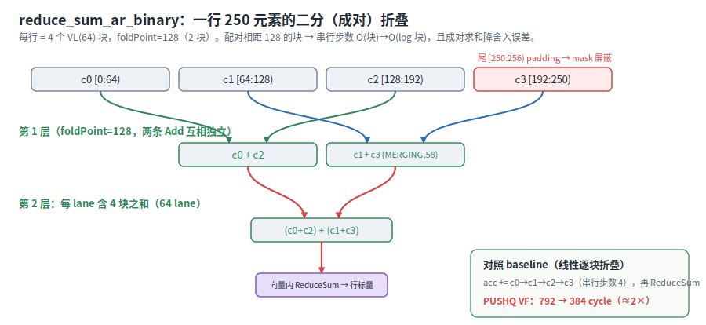

流水数据：

| 指标 | 数值 |
| --- | ---: |
| VF count | 5 |
| PUSHQ VF cycles | 384 |
| VF IPC（RVECEX/cycle，稳态） | 1.03（392/380） |
| MTE2 sum_cycles | 5574 |
| MTE3 sum_cycles | 503 |
| 关键指令 | `RVECEX RV_VADD:234/1638 · RV_VCADD:78/1716`，`RVECLD RV_VLD:312/2896`，`RVECST RV_VSTUI:78/646` |

二分同时减少串行步数、减量、提精度：串行步数从 4 缩到 2；`RV_VADD` 从 312（4 块/行）减到 234（3 块/行），mask 相关的 `RV_VSEL`/`RV_PLT` 也大幅减少，`RVECEX` 总量从 8124 降到 3834；成对求和（pairwise summation）降低舍入误差。搬运不变，VF 从 792 降到 384（约 2×），是 `ar` 轴各写法中最快的（baseline 792 / unroll 670 / binary 384）。

#### 台阶：`ar` 多累加器 unroll（步数不减，只藏延迟）

二分是 `ar` 上更进一步的写法。作为台阶，先看只靠多累加器藏延迟、不减步数的 unroll，它和 reduce_max 完全对称：每轮 4 行各一个累加器，跨块 `MERGING`。

源码：`reduce/src/reduce_sum_ar_unroll.asc`

```cpp
// VF：axis=1，每轮 4 行并行折叠 → 4 路独立 Add；尾部 0~3 行单独收尾
__simd_vf__ inline void ReduceSumArVfUnroll(__ubuf__ float* xAddr, __ubuf__ float* zAddr,
                                            uint32_t d0, uint32_t d1, uint32_t d1Pad)
{
    AscendC::Reg::RegTensor<float> acc0, acc1, acc2, acc3, in0, in1, in2, in3;
    AscendC::Reg::UnalignRegForStore unalignAcc;
    AscendC::Reg::MaskReg fullMask = AscendC::Reg::CreateMask<float, AscendC::Reg::MaskPattern::ALL>();
    const uint16_t rowChunks = static_cast<uint16_t>((d1 + VL_B32 - 1) / VL_B32);
    const uint16_t groups = static_cast<uint16_t>(d0) / 4;

    for (uint16_t g = 0; g < groups; g++) {                  // 主循环：每轮 4 行
        const uint16_t r = static_cast<uint16_t>(g * 4);
        AscendC::Reg::Duplicate(acc0, 0.0f); AscendC::Reg::Duplicate(acc1, 0.0f);
        AscendC::Reg::Duplicate(acc2, 0.0f); AscendC::Reg::Duplicate(acc3, 0.0f);
        uint32_t remainCols = d1;
        for (uint16_t c = 0; c < rowChunks; c++) {           // 4 行同一列结构 → 共享 mask
            AscendC::Reg::MaskReg mask = AscendC::Reg::UpdateMask<float>(remainCols);
            AscendC::Reg::LoadAlign<float, AscendC::Reg::LoadDist::DIST_NORM>(in0, xAddr + (r + 0) * d1Pad + c * VL_B32);
            AscendC::Reg::LoadAlign<float, AscendC::Reg::LoadDist::DIST_NORM>(in1, xAddr + (r + 1) * d1Pad + c * VL_B32);
            AscendC::Reg::LoadAlign<float, AscendC::Reg::LoadDist::DIST_NORM>(in2, xAddr + (r + 2) * d1Pad + c * VL_B32);
            AscendC::Reg::LoadAlign<float, AscendC::Reg::LoadDist::DIST_NORM>(in3, xAddr + (r + 3) * d1Pad + c * VL_B32);
            AscendC::Reg::Add<float, AscendC::Reg::MaskMergeMode::MERGING>(acc0, acc0, in0, mask);
            AscendC::Reg::Add<float, AscendC::Reg::MaskMergeMode::MERGING>(acc1, acc1, in1, mask);
            AscendC::Reg::Add<float, AscendC::Reg::MaskMergeMode::MERGING>(acc2, acc2, in2, mask);
            AscendC::Reg::Add<float, AscendC::Reg::MaskMergeMode::MERGING>(acc3, acc3, in3, mask);
        }
        AscendC::Reg::ReduceSum(in0, acc0, fullMask); AscendC::Reg::StoreUnAlign(zAddr, in0, unalignAcc, 1);  // 复用 in* 接收行标量
        AscendC::Reg::ReduceSum(in1, acc1, fullMask); AscendC::Reg::StoreUnAlign(zAddr, in1, unalignAcc, 1);
        AscendC::Reg::ReduceSum(in2, acc2, fullMask); AscendC::Reg::StoreUnAlign(zAddr, in2, unalignAcc, 1);
        AscendC::Reg::ReduceSum(in3, acc3, fullMask); AscendC::Reg::StoreUnAlign(zAddr, in3, unalignAcc, 1);
    }
    for (uint16_t r = static_cast<uint16_t>(groups * 4); r < static_cast<uint16_t>(d0); r++) {  // 尾部 0~3 行
        AscendC::Reg::Duplicate(acc0, 0.0f);
        uint32_t remainCols = d1;
        for (uint16_t c = 0; c < rowChunks; c++) {
            AscendC::Reg::MaskReg mask = AscendC::Reg::UpdateMask<float>(remainCols);
            AscendC::Reg::LoadAlign<float, AscendC::Reg::LoadDist::DIST_NORM>(in0, xAddr + r * d1Pad + c * VL_B32);
            AscendC::Reg::Add<float, AscendC::Reg::MaskMergeMode::MERGING>(acc0, acc0, in0, mask);
        }
        AscendC::Reg::ReduceSum(in0, acc0, fullMask);
        AscendC::Reg::StoreUnAlign(zAddr, in0, unalignAcc, 1);
    }
    AscendC::Reg::StoreUnAlignPost(zAddr, unalignAcc, 0);
}

// kernel 侧：单核单 tile，VF 计算位于 Compute()
asc_vf_call<ReduceSumArVfUnroll>(xAddr, zAddr, d0_, d1_, d1Pad_);
```

| 指标 | 数值 |
| --- | ---: |
| VF count | 5 |
| PUSHQ VF cycles | 670 |
| VF IPC（RVECEX/cycle，稳态） | 1.30（866/666） |
| MTE2 sum_cycles | 5309 |
| MTE3 sum_cycles | 487 |
| 关键指令 | `RVECEX RV_VADD:312/2184 · RV_VCADD:78/1716`，`RVECLD RV_VLD:312/3063`，`RVECST RV_VSTUI:78/637` |

串行步数仍是 4，VF 792→670（+15.4%），与 reduce_max `ar` 同档。但浮点加法延迟更高、空泡更多，二分（384）兼具减步数与减量，远胜单纯展开，因此 `ar` 的 good example 选二分而非 unroll。

#### 另一个轴 `ra`（跨行步数多）：unroll 收益最大

`ra` 沿首维归约，一个列块把 78 行折进同一个 `acc`（串行步数 78），是全部样例中步数最多的，unroll 收益也最大。与 `ar` 不同，`ra` 的 mask 在整个行循环里恒定，搬出用同一 mask 丢弃多余 lane，默认 ZEROING 即可，无需 MERGING。

**bad example：单累加器 baseline（串行步数 78）**

源码：`reduce/src/reduce_sum_ra_baseline.asc`

```cpp
// VF：axis=0 沿首维归约，外层列块、内层 78 行单路串行 Add，输出 [d1]
__simd_vf__ inline void ReduceSumRaVf(__ubuf__ float* xAddr, __ubuf__ float* zAddr,
                                      uint32_t d0, uint32_t d1, uint32_t d1Pad)
{
    AscendC::Reg::RegTensor<float> accReg, inReg;
    uint32_t remainCols = d1;
    const uint16_t colChunks = static_cast<uint16_t>((d1 + VL_B32 - 1) / VL_B32);

    for (uint16_t c = 0; c < colChunks; c++) {           // 外层：列块循环
        AscendC::Reg::MaskReg mask = AscendC::Reg::UpdateMask<float>(remainCols);
        AscendC::Reg::Duplicate(accReg, 0.0f);
        for (uint16_t i = 0; i < static_cast<uint16_t>(d0); i++) {   // 内层：78 行单路串行折叠
            AscendC::Reg::LoadAlign<float, AscendC::Reg::LoadDist::DIST_NORM>(
                inReg, xAddr + i * d1Pad + c * VL_B32);
            AscendC::Reg::Add(accReg, accReg, inReg, mask);          // 第 i+1 条等第 i 条出结果
        }
        AscendC::Reg::StoreAlign<float, AscendC::Reg::StoreDist::DIST_NORM>(
            zAddr + c * VL_B32, accReg, mask);           // 整段搬出（连续对齐）
    }
}

// kernel 侧：单核单 tile，VF 计算位于 Compute()
asc_vf_call<ReduceSumRaVf>(xAddr, zAddr, d0_, d1_, d1Pad_);
```

| 指标 | 数值 |
| --- | ---: |
| VF count | 5 |
| PUSHQ VF cycles | 757 |
| VF IPC（RVECEX/cycle，稳态） | 0.45（321/716） |
| MTE2 sum_cycles | 5325 |
| MTE3 sum_cycles | 293 |
| 关键指令 | `RVECEX RV_VADD:312/2184`，`RVECLD RV_VLD:312/2808`，`RVECST RV_VST:4/39` |

**good example：4 累加器 unroll**

源码：`reduce/src/reduce_sum_ra_unroll.asc`

```cpp
// VF：axis=0，4 个独立累加器并行跨行 Add，等 acc0 出结果的那几拍正好发 acc1/acc2/acc3
__simd_vf__ inline void ReduceSumRaVfUnroll(__ubuf__ float* xAddr, __ubuf__ float* zAddr,
                                            uint32_t d0, uint32_t d1, uint32_t d1Pad)
{
    AscendC::Reg::RegTensor<float> acc0, acc1, acc2, acc3, in0, in1, in2, in3;
    uint32_t remainCols = d1;
    const uint16_t colChunks = static_cast<uint16_t>((d1 + VL_B32 - 1) / VL_B32);

    for (uint16_t c = 0; c < colChunks; c++) {
        AscendC::Reg::MaskReg mask = AscendC::Reg::UpdateMask<float>(remainCols);
        AscendC::Reg::Duplicate(acc0, 0.0f); AscendC::Reg::Duplicate(acc1, 0.0f);
        AscendC::Reg::Duplicate(acc2, 0.0f); AscendC::Reg::Duplicate(acc3, 0.0f);
        const uint16_t groups = static_cast<uint16_t>(d0) / 4;
        for (uint16_t g = 0; g < groups; g++) {              // 主循环：每轮 4 行 → 4 路独立
            const uint16_t r = static_cast<uint16_t>(g * 4);
            AscendC::Reg::LoadAlign<float, AscendC::Reg::LoadDist::DIST_NORM>(in0, xAddr + (r + 0) * d1Pad + c * VL_B32);
            AscendC::Reg::LoadAlign<float, AscendC::Reg::LoadDist::DIST_NORM>(in1, xAddr + (r + 1) * d1Pad + c * VL_B32);
            AscendC::Reg::LoadAlign<float, AscendC::Reg::LoadDist::DIST_NORM>(in2, xAddr + (r + 2) * d1Pad + c * VL_B32);
            AscendC::Reg::LoadAlign<float, AscendC::Reg::LoadDist::DIST_NORM>(in3, xAddr + (r + 3) * d1Pad + c * VL_B32);
            AscendC::Reg::Add(acc0, acc0, in0, mask);
            AscendC::Reg::Add(acc1, acc1, in1, mask);
            AscendC::Reg::Add(acc2, acc2, in2, mask);
            AscendC::Reg::Add(acc3, acc3, in3, mask);
        }
        for (uint16_t r = static_cast<uint16_t>(groups * 4); r < static_cast<uint16_t>(d0); r++) {  // 尾部 0~3 行
            AscendC::Reg::LoadAlign<float, AscendC::Reg::LoadDist::DIST_NORM>(in0, xAddr + r * d1Pad + c * VL_B32);
            AscendC::Reg::Add(acc0, acc0, in0, mask);
        }
        AscendC::Reg::Add(acc0, acc0, acc1, mask);           // 合并 4 个累加器
        AscendC::Reg::Add(acc2, acc2, acc3, mask);
        AscendC::Reg::Add(acc0, acc0, acc2, mask);
        AscendC::Reg::StoreAlign<float, AscendC::Reg::StoreDist::DIST_NORM>(zAddr + c * VL_B32, acc0, mask);
    }
}

// kernel 侧：单核单 tile，VF 计算位于 Compute()
asc_vf_call<ReduceSumRaVfUnroll>(xAddr, zAddr, d0_, d1_, d1Pad_);
```

| 指标 | 数值 |
| --- | ---: |
| VF count | 5 |
| PUSHQ VF cycles | 364 |
| VF IPC（RVECEX/cycle，稳态） | 0.95（345/363） |
| MTE2 sum_cycles | 5359 |
| MTE3 sum_cycles | 328 |
| 关键指令 | `RVECEX RV_VADD:324/2268`，`RVECLD RV_VLD:312/3416`，`RVECST RV_VST:4/201` |

`RV_VADD` 几乎不变（312→324，多出的是合并），VF 757→364（+51.9%，为全部样例中最高），也是串行步数最多的样例。`ra` 每列块单输出，结构上不便行内二分，多累加器即其极限；进一步加速需改变数据布局。

### 各轴各写法横向对比

reduce 两个轴、各写法横向对比（`PUSHQ VF cycles`）：

| 范式 | 串行步数 | baseline | unroll | pragma | binary |
| --- | --- | ---: | ---: | ---: | ---: |
| reduce_max `ar` | 4 | 699 | 592（+15.3%） | 699 | — |
| reduce_max `ra` | 78 | 510 | 358（+29.8%） | 524 | — |
| reduce_sum `ar` | 4 | 792 | 670（+15.4%） | 788 | **384（+51.5%）** |
| reduce_sum `ra` | 78 | 757 | 364（+51.9%） | 720 | — |

结论：reduce_max 多路并行最高 +29.8%；reduce_sum 多累加器 `ra` 最高 +51.9%，二分 `ar` 约 2×（+51.5%）是 `ar` 轴各写法中最快的。规律一致：串行步数越多，多累加器回报越大。

`#pragma unroll`（表中 pragma 列）对 reduce 基本无效，四种写法都 ≈ 各自 baseline：它只把循环体复制成多条，所有 `Max`/`Add` 仍串在同一个 `acc` 上，编译器不会擅自重排归约顺序（浮点不可结合），串行步数不变、空泡照旧。要减步数或藏延迟，只能靠手写多累加器或二分。

## 总结

这几类样例的共同思路是：先写最自然、功能正确的 VF，再用 cannsim 流水验证直觉，回到源码和流水一起看。但两部分的优化重点不同：

- **broadcast 模式**的瓶颈是 VF 调用过碎、`RVECSU`/`PUSH_PB` 偏重。共同优化路径是逐步把外层循环收入 VF，让更多计算停留在 VF 硬循环里，从而减少 `asc_vf_call` 次数和 PB 传参，也更容易让 Vector 单元形成连续流水。具体经验：
  1. naive实现若按行或按分块多次发起 VF，先尝试把外层循环放进 VF。
  2. 尾轴 broadcast：行标量在 VF 内广播后复用，内层继续沿连续 `n` 处理主数据。
  3. 首轴 broadcast：广播向量可跨行复用；对一个不太小的 `m`，先 `n` 后 `m` 通常能拿到每列复用 `a` 的收益；若 `m` 过小导致内层展开短，也可能拿不到收益，需具体分析。
  4. 中间轴 broadcast：通常可规约为首轴 broadcast，把外层循环包入 VF 即可提升；但要看 broadcast 轴 `b` 的大小取舍。本例 `b = 3` 太小，`m -> n -> b` 的列循环反而不如 `m -> b -> n` 的行循环。
- **elemwise / reduce 范式**的瓶颈在 VF 内部的串行依赖。先判断有没有循环携带依赖：没有（elemwise）就是 throughput-bound，baseline 已最优、不必过度展开；有（reduce）就是 latency-bound，串行步数减不掉就用多累加器藏延迟，可结合（求和）就优先二分减步数。判断都要靠数据验证：先用 `MTE2`/`MTE3` 确认搬运规模没差异，再用 `PUSHQ VF cycles` 比总耗时，最后用 `RVECEX` 和关键指令解释是减了指令还是藏了延迟。

> broadcast 的中间轴是个典型反直觉例子：`n -> b` 看似减少了 `aReg` 读取，但 `b = 3` 内层太短，最终反而慢于 `b -> n`。比较 VF 写法时，VF 调用次数、PB 传参、主数据访问是否连续、最内层循环是否足够长，都要和 `RVECLP`/`RVECSU` 一起看。

## 归约范式的关键约定

- **跨块折叠必须 `MERGING`**（`ar`/axis=1）：按块折叠时末块 mask 不满，`Max`/`Add` 默认 `ZEROING` 会把 mask 外清零、抹掉前面已折进来的列，必须显式 `MaskMergeMode::MERGING`。`ra`/axis=0 的 mask 在行循环里恒定、搬出用同一 mask 丢多余 lane，用默认 ZEROING 即可。
- **非对齐散出**（`ar`）：每行只产出一个标量、目标地址逐个错位，用 `StoreUnAlign` 拼成连续流，循环末 `StoreUnAlignPost` 冲刷残留（二者必须成对，是高频 bug 点）。
- **两维任意大小**：`LoadAlign` 要 32B 对齐，第 i 行起点对任意 `D1` 未必对齐，故 CopyIn 逐行搬到「按 32B 对齐的 `D1Pad` 槽位」；行内按 `VL(64)` 分块覆盖 `D1 > VL`，尾部不足 VL 的 lane 由 mask 屏蔽。
- **校验**：随机 float 输入 + host 侧独立归约作 golden。reduce_sum 用 double 累加 + 相对容差 `|got-ref| ≤ 1e-3·(|ref|+1)`、输入 `[-1,1)`；reduce_max 用很小的绝对容差。

## 公共写法约定

- **VF 层**：MicroAPI 必须放在 `__simd_vf__` 函数中，`for` 按 VL(64 lane) 推进、迭代变量 `uint16_t`、循环内禁分支；经 `asc_vf_call<VFFunc>(args...)` 从 kernel 侧调起（入参为 `__ubuf__` 裸指针 + 基本类型）。
- **mask**：每轮 `UpdateMask<T>(count)` 开前 `count` 个 lane 并原地递减；搬入可不带 mask（尾部多读后续屏蔽）。
- **三段式 CopyIn → Compute → CopyOut**：用 `TQue<VECIN>`/`TQue<VECOUT>`，`EnQue`/`DeQue` 自动插入 MTE2→V→MTE3 同步，VF 计算位于 Compute。
- **单核单 tile**：数据取小到一次放进 UB，整批搬入 → VF 计算 → 整批搬出，`depth=1` 单块 buffer、不开 DoubleBuffer。聚焦 VF 本身，多核与 UB 级切分留作扩展。
- **样例规格**：elemwise / reduce 统一 `[D0, D1] = [78, 250]`，N = 19500，按最受限的 elemwise（x/y/z 三块 UB buffer，约 234KB < 256KB）定尺寸；`D1 > VL` 且 `D1 % 8 ≠ 0`、`D0 % 4 = 2`，覆盖分块 / 尾块 / 4 路展开尾行三条边界路径。broadcast 用各自的小尺寸演示（尾轴 / 首轴 `m = 17`、中间轴 `b = 3`），以放大 VF 调用粒度的差异。

## 编译 & 运行

```bash
cmake -S . -B build -DNPU_ARCH=dav-3510                              # 仓库根目录，一次即可
cmake --build build --target simd_vf_story_reduce_reduce_sum_ar_binary   # 构建单个 VF（target = simd_vf_story_<类别>_<文件名去掉 .asc>）
cmake --build build --target simd_vf_story_reduce                    # 或：构建某一类别全部（broadcast / elemwise / reduce）
cmake --build build --target simd_vf_story                           # 或：一次构建全部样例
./build/Samples/2_Performance/simd_vf_story/reduce/simd_vf_story_reduce_reduce_sum_ar_binary
# 自带 host golden 校验，末行打印 PASSED / FAILED

cannsim record ./build/.../simd_vf_story_reduce_reduce_sum_ar_binary -s Ascend950 --gen-report   # 打点，trace 落在 cannsim_traces/
```
